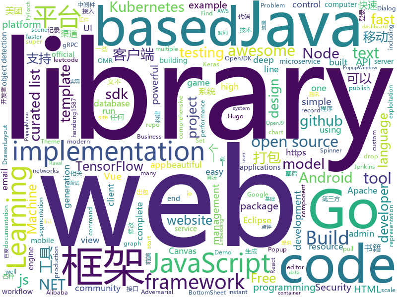

# 2019-07-18
See what the GitHub community is most excited about today.

## python
* [python-cheatsheet](https://github.com/gto76/python-cheatsheet)(**469 stars today**): Comprehensive Python Cheatsheet
* [interview_internal_reference](https://github.com/0voice/interview_internal_reference)(**986 stars today**): 2019年最新总结，阿里，腾讯，百度，美团，头条等技术面试题目，以及答案，专家出题人分析汇总。
* [pytorch-transformers](https://github.com/huggingface/pytorch-transformers)(**523 stars today**): 👾A library of state-of-the-art pretrained models for Natural Language Processing (NLP)
* [Realistic-Neural-Talking-Head-Models](https://github.com/vincent-thevenin/Realistic-Neural-Talking-Head-Models)(**28 stars today**): My implementation of Few-Shot Adversarial Learning of Realistic Neural Talking Head Models (Egor Zakharov et al.).
* [Osmedeus](https://github.com/j3ssie/Osmedeus)(**82 stars today**): Fully automated offensive security framework for reconnaissance and vulnerability scanning
* [DeepLearningExamples](https://github.com/NVIDIA/DeepLearningExamples)(**110 stars today**): Deep Learning Examples
* [pytorch-CycleGAN-and-pix2pix](https://github.com/junyanz/pytorch-CycleGAN-and-pix2pix)(**21 stars today**): Image-to-image translation in PyTorch (e.g., horse2zebra, edges2cats, and more)
* [mlflow](https://github.com/mlflow/mlflow)(**8 stars today**): Open source platform for the machine learning lifecycle
* [text-detection-ctpn](https://github.com/eragonruan/text-detection-ctpn)(**9 stars today**): text detection mainly based on ctpn model in tensorflow, id card detect, connectionist text proposal network
* [Deep-Flow-Guided-Video-Inpainting](https://github.com/nbei/Deep-Flow-Guided-Video-Inpainting)(**31 stars today**): pytorch implementation for "Deep Flow-Guided Video Inpainting"(CVPR'19)
* [Mask_RCNN](https://github.com/matterport/Mask_RCNN)(**24 stars today**): Mask R-CNN for object detection and instance segmentation on Keras and TensorFlow
* [webshell-venom](https://github.com/yzddmr6/webshell-venom)(**41 stars today**): 免杀webshell无限生成工具
* [routersploit](https://github.com/threat9/routersploit)(**4 stars today**): Exploitation Framework for Embedded Devices
* [bert](https://github.com/google-research/bert)(**50 stars today**): TensorFlow code and pre-trained models for BERT
* [ludwig](https://github.com/uber/ludwig)(**39 stars today**): Ludwig is a toolbox built on top of TensorFlow that allows to train and test deep learning models without the need to write code.
* [sherlock](https://github.com/sherlock-project/sherlock)(**79 stars today**): 🔎Find usernames across social networks
* [semantic-segmentation-pytorch](https://github.com/CSAILVision/semantic-segmentation-pytorch)(**8 stars today**): Pytorch implementation for Semantic Segmentation/Scene Parsing on MIT ADE20K dataset
* [EfficientNet-PyTorch](https://github.com/lukemelas/EfficientNet-PyTorch)(**15 stars today**): A PyTorch implementation of EfficientNet
* [imgclsmob](https://github.com/osmr/imgclsmob)(**8 stars today**): Sandbox for training convolutional networks for computer vision
* [nlp-journey](https://github.com/msgi/nlp-journey)(**53 stars today**): nlp相关的一些论文及代码, 包括主题模型、词向量(Word Embedding)、命名实体识别(NER)、文本分类(Text Classificatin)、文本生成(Text Generation)、文本相似性(Text Similarity)计算等，涉及到各种与nlp相关的算法，基于keras和tensorflow。
* [image-super-resolution](https://github.com/idealo/image-super-resolution)(**12 stars today**): Super-scale your images and run experiments with Residual Dense and Adversarial Networks.
* [webssh](https://github.com/huashengdun/webssh)(**7 stars today**): 🌱Web based ssh client
* [LASER](https://github.com/facebookresearch/LASER)(**7 stars today**): Language-Agnostic SEntence Representations
* [models](https://github.com/tensorflow/models)(**71 stars today**): Models and examples built with TensorFlow
* [django-rest-framework](https://github.com/encode/django-rest-framework)(**26 stars today**): Web APIs for Django.⚡️

## java
* [grpc-java](https://github.com/grpc/grpc-java)(**69 stars today**): The Java gRPC implementation. HTTP/2 based RPC
* [cat](https://github.com/dianping/cat)(**132 stars today**): CAT 作为服务端项目基础组件，提供了 Java, C/C++, Node.js, Python, Go 等多语言客户端，已经在美团点评的基础架构中间件框架（MVC框架，RPC框架，数据库框架，缓存框架等，消息队列，配置系统等）深度集成，为美团点评各业务线提供系统丰富的性能指标、健康状况、实时告警等。
* [openj9](https://github.com/eclipse/openj9)(**24 stars today**): Eclipse OpenJ9: A Java Virtual Machine for OpenJDK that's optimized for small footprint, fast start-up, and high throughput. Builds on Eclipse OMR (https://github.com/eclipse/omr) and combines with the Extensions for OpenJDK for OpenJ9 repo.
* [easyexcel](https://github.com/alibaba/easyexcel)(**154 stars today**): 快速、简单避免OOM的java处理Excel工具
* [kafka-streams-examples](https://github.com/confluentinc/kafka-streams-examples)(**6 stars today**): Demo applications and code examples for Apache Kafka's Streams API.
* [JustAuth](https://github.com/zhangyd-c/JustAuth)(**67 stars today**): 💯史上最全的整合第三方登录的工具,目前已支持Github、Gitee、微博、钉钉、百度、Coding、腾讯云开发者平台、OSChina、支付宝、QQ、微信、淘宝、Google、Facebook、抖音、领英、小米、微软和今日头条等第三方平台的授权登录。 Login, so easy!
* [MPAndroidChart](https://github.com/PhilJay/MPAndroidChart)(**19 stars today**): A powerful🚀Android chart view / graph view library, supporting line- bar- pie- radar- bubble- and candlestick charts as well as scaling, dragging and animations.
* [arthas](https://github.com/alibaba/arthas)(**47 stars today**): Alibaba Java Diagnostic Tool Arthas/Alibaba Java诊断利器Arthas
* [dropwizard](https://github.com/dropwizard/dropwizard)(**3 stars today**): A damn simple library for building production-ready RESTful web services.
* [XPopup](https://github.com/li-xiaojun/XPopup)(**18 stars today**): 🔥功能强大，UI简洁，交互优雅的通用弹窗！可以替代Dialog，PopupWindow，PopupMenu，BottomSheet，DrawerLayout，Spinner等组件，自带十几种效果良好的动画， 支持完全的UI和动画自定义！(Powerful and Beautiful Popup，can absolutely replace Dialog，PopupWindow，PopupMenu，BottomSheet，DrawerLayout，Spinner. With built-in animators , very easy to custom popup view.)
* [flowable-engine](https://github.com/flowable/flowable-engine)(**5 stars today**): A compact and highly efficient workflow and Business Process Management (BPM) platform for developers, system admins and business users.
* [solo](https://github.com/b3log/solo)(**111 stars today**): 🎸一款小而美的博客系统，专为程序员设计。https://hacpai.com/tag/solo
* [DataX](https://github.com/alibaba/DataX)(**20 stars today**): 
* [FATE](https://github.com/WeBankFinTech/FATE)(**11 stars today**): An Industrial Level Federated Learning Framework
* [selenium](https://github.com/SeleniumHQ/selenium)(**15 stars today**): A browser automation framework and ecosystem.
* [incubator-druid](https://github.com/apache/incubator-druid)(**5 stars today**): Apache Druid (Incubating) - Column oriented distributed data store ideal for powering interactive applications
* [tutorials](https://github.com/eugenp/tutorials)(**40 stars today**): The "REST With Spring" Course:
* [kubernetes-plugin](https://github.com/jenkinsci/kubernetes-plugin)(**4 stars today**): Jenkins plugin to run dynamic agents in a Kubernetes/Docker environment
* [jenkins](https://github.com/jenkinsci/jenkins)(**9 stars today**): Jenkins automation server
* [litemall](https://github.com/linlinjava/litemall)(**33 stars today**): 又一个小商城。litemall = Spring Boot后端 + Vue管理员前端 + 微信小程序用户前端 + Vue用户移动端
* [ksql](https://github.com/confluentinc/ksql)(**4 stars today**): KSQL - the Streaming SQL Engine for Apache Kafka
* [aws-doc-sdk-examples](https://github.com/awsdocs/aws-doc-sdk-examples)(**6 stars today**): Code examples used in the official AWS SDK documentation.
* [freeline](https://github.com/alibaba/freeline)(**6 stars today**): A super fast build tool for Android, an alternative to Instant Run
* [AndroidUtilCode](https://github.com/Blankj/AndroidUtilCode)(**24 stars today**): 🔥Android developers should collect the following utils(updating).
* [Sentinel](https://github.com/alibaba/Sentinel)(**25 stars today**): A lightweight powerful flow control component enabling reliability and monitoring for microservices. (轻量级的流量控制、熔断降级 Java 库)

## unknown
* [awesome-graph-classification](https://github.com/benedekrozemberczki/awesome-graph-classification)(**229 stars today**): A collection of important graph embedding, classification and representation learning papers with implementations.
* [awesome-nodejs](https://github.com/sindresorhus/awesome-nodejs)(**154 stars today**): ⚡️Delightful Node.js packages and resources
* [awesome-sysadmin](https://github.com/kahun/awesome-sysadmin)(**84 stars today**): A curated list of amazingly awesome open source sysadmin resources inspired by Awesome PHP.
* [1024app-android](https://github.com/yuuwill/1024app-android)(**112 stars today**): 草榴官方客户端，小草客户端，Android
* [Learn_Computer_Vision](https://github.com/llSourcell/Learn_Computer_Vision)(**72 stars today**): This is the curriculum for "Learn Computer Vision" by Siraj Raval on Youtube
* [awesome-java-books](https://github.com/sorenduan/awesome-java-books)(**238 stars today**): Java开发者技术书籍大全 - Java入门书籍，Java基础及进阶书籍，框架与中间件，架构设计，设计模式，数学与算法，JVM周边语言，项目管理&领导力&流程，职业素养与个人成长，格局与视野，面试参考书等。
* [A-to-Z-Resources-for-Students](https://github.com/dipakkr/A-to-Z-Resources-for-Students)(**128 stars today**): Curated list of resources for college students
* [Learn_Machine_Learning_in_3_Months](https://github.com/llSourcell/Learn_Machine_Learning_in_3_Months)(**6 stars today**): This is the code for "Learn Machine Learning in 3 Months" by Siraj Raval on Youtube
* [Penetration_Testing_Case](https://github.com/r35tart/Penetration_Testing_Case)(**38 stars today**): 用于记录分享一些有趣的案例
* [Interview_Question_for_Beginner](https://github.com/JaeYeopHan/Interview_Question_for_Beginner)(**3 stars today**): 👦👧Technical-Interview guidelines written for those who started studying programming. I wish you all the best.👾
* [OnJava8](https://github.com/LingCoder/OnJava8)(**38 stars today**): 《On Java 8》中文版，又名《Java编程思想》 第5版
* [html-handbook](https://github.com/flaviocopes/html-handbook)(**6 stars today**): A draft of the HTML Handbook free ebook. Looking for feedback before I publish it!
* [1x.engineer](https://github.com/cutenode/1x.engineer)(**73 stars today**): The official website of 1x Engineers around the world
* [papers-we-love](https://github.com/papers-we-love/papers-we-love)(**21 stars today**): Papers from the computer science community to read and discuss.
* [desafio-front-end](https://github.com/VAGAScom/desafio-front-end)(**0 stars today**): Desafio Frontend VAGAS.com
* [AD-Attack-Defense](https://github.com/infosecn1nja/AD-Attack-Defense)(**7 stars today**): Attack and defend active directory using modern post exploitation adversary tradecraft activity
* [AspNetCore-Developer-Roadmap](https://github.com/MoienTajik/AspNetCore-Developer-Roadmap)(**10 stars today**): Roadmap to becoming an ASP.NET Core developer in 2019
* [Doctor](https://github.com/p1v0t/Doctor)(**4 stars today**): A quick reference for Vim text editor.
* [awesome](https://github.com/sindresorhus/awesome)(**81 stars today**): 😎Awesome lists about all kinds of interesting topics
* [free-api](https://github.com/fangzesheng/free-api)(**11 stars today**): 收集免费的接口服务,做一个api的搬运工
* [es6features](https://github.com/lukehoban/es6features)(**3 stars today**): Overview of ECMAScript 6 features
* [1024app-ios](https://github.com/yuuwill/1024app-ios)(**8 stars today**): 草榴官方客户端，小草客户端，iOS
* [awesome-production-machine-learning](https://github.com/EthicalML/awesome-production-machine-learning)(**4 stars today**): A curated list of awesome open source libraries to deploy, monitor, version and scale your machine learning
* [awesome-object-detection](https://github.com/amusi/awesome-object-detection)(**12 stars today**): Awesome Object Detection based on handong1587 github: https://handong1587.github.io/deep_learning/2015/10/09/object-detection.html
* [You-Dont-Know-JS](https://github.com/getify/You-Dont-Know-JS)(**81 stars today**): A book series on JavaScript. @YDKJS on twitter.

## javascript
* [baidu-netdisk-downloaderx](https://github.com/b3log/baidu-netdisk-downloaderx)(**634 stars today**): ⚡️一款图形界面的百度网盘不限速下载器，支持 Windows、Linux 和 Mac。
* [testcafe](https://github.com/DevExpress/testcafe)(**25 stars today**): A Node.js tool to automate end-to-end web testing.
* [quasar](https://github.com/quasarframework/quasar)(**56 stars today**): Quasar Framework - Build high-performance VueJS user interfaces in record time
* [react-beautiful-dnd](https://github.com/atlassian/react-beautiful-dnd)(**24 stars today**): Beautiful and accessible drag and drop for lists with React
* [fabric.js](https://github.com/fabricjs/fabric.js)(**17 stars today**): Javascript Canvas Library, SVG-to-Canvas (& canvas-to-SVG) Parser
* [VvvebJs](https://github.com/givanz/VvvebJs)(**37 stars today**): Drag and drop website builder javascript library.
* [create-react-app](https://github.com/facebook/create-react-app)(**41 stars today**): Set up a modern web app by running one command.
* [three.js](https://github.com/mrdoob/three.js)(**46 stars today**): JavaScript 3D library.
* [500lines](https://github.com/aosabook/500lines)(**30 stars today**): 500 Lines or Less
* [vidly-mvc-5](https://github.com/mosh-hamedani/vidly-mvc-5)(**0 stars today**): 
* [yapi](https://github.com/YMFE/yapi)(**61 stars today**): YApi 是一个可本地部署的、打通前后端及QA的、可视化的接口管理平台
* [styled-system](https://github.com/styled-system/styled-system)(**19 stars today**): ⬢ Style props for rapid UI development
* [shaka-player](https://github.com/google/shaka-player)(**7 stars today**): JavaScript player library / DASH & HLS client / MSE-EME player
* [OptimizedHTML-5](https://github.com/agragregra/OptimizedHTML-5)(**9 stars today**): Lightweight startup HTML5 template, based on Gulp
* [leetcode](https://github.com/azl397985856/leetcode)(**131 stars today**): LeetCode Solutions: A Record of My Problem Solving Journey.( leetcode题解，记录自己的leetcode解题之路。)
* [react-testing-library](https://github.com/testing-library/react-testing-library)(**28 stars today**): 🐐Simple and complete React DOM testing utilities that encourage good testing practices.
* [engine](https://github.com/cocos-creator/engine)(**8 stars today**): Cocos Creator is a complete package of game development tools and workflow, including a game engine, resource management, scene editing, game preview, debug and publish one project to multiple platforms.
* [pdfkit](https://github.com/foliojs/pdfkit)(**36 stars today**): A JavaScript PDF generation library for Node and the browser
* [curso-javascript-ninja](https://github.com/da2k/curso-javascript-ninja)(**5 stars today**): Curso Javascript Ninja
* [serverless](https://github.com/serverless/serverless)(**19 stars today**): Serverless Framework – Build web, mobile and IoT applications with serverless architectures using AWS Lambda, Azure Functions, Google CloudFunctions & more! –
* [material-ui](https://github.com/mui-org/material-ui)(**34 stars today**): React components for faster and easier web development. Build your own design system, or start with Material Design.
* [oidc-client-js](https://github.com/IdentityModel/oidc-client-js)(**4 stars today**): OpenID Connect (OIDC) and OAuth2 protocol support for browser-based JavaScript applications
* [vuepress](https://github.com/vuejs/vuepress)(**22 stars today**): 📝Minimalistic Vue-powered static site generator
* [lerna](https://github.com/lerna/lerna)(**24 stars today**): 🐉A tool for managing JavaScript projects with multiple packages.
* [graphql-engine](https://github.com/hasura/graphql-engine)(**24 stars today**): Blazing fast, instant realtime GraphQL APIs on Postgres with fine grained access control, also trigger webhooks on database events.

## html
* [awesome-piracy](https://github.com/Igglybuff/awesome-piracy)(**14 stars today**): A curated list of awesome warez and piracy links
* [docsy-example](https://github.com/google/docsy-example)(**0 stars today**): An example documentation site using the Docsy Hugo theme
* [fastText](https://github.com/facebookresearch/fastText)(**12 stars today**): Library for fast text representation and classification.
* [AdminLTE](https://github.com/ColorlibHQ/AdminLTE)(**17 stars today**): AdminLTE - Free Premium Admin control Panel Theme Based On Bootstrap 3.x
* [webdevbootcamp](https://github.com/nax3t/webdevbootcamp)(**2 stars today**): All source code for back-end projects from the Web Developer Bootcamp
* [Cerberus](https://github.com/TedGoas/Cerberus)(**2 stars today**): A few simple, but solid patterns for responsive HTML email templates and newsletters. Even in Outlook and Gmail.
* [beautiful-jekyll](https://github.com/daattali/beautiful-jekyll)(**3 stars today**): ✨Build a beautiful and simple website in literally minutes. Demo at http://deanattali.com/beautiful-jekyll
* [TheHive](https://github.com/TheHive-Project/TheHive)(**1 stars today**): TheHive: a Scalable, Open Source and Free Security Incident Response Platform
* [all-contributors](https://github.com/all-contributors/all-contributors)(**8 stars today**): ✨Recognize all contributors, not just the ones who push code✨
* [openweb](https://github.com/good/openweb)(**2 stars today**): 
* [Usdk](https://github.com/honghuachen/Usdk)(**2 stars today**): 这是一个Unity3D移动平台sdk快速适配框架和多渠道打包平台，方便android、ios移动平台渠道sdk或者各种Native功能插件的快速接入，接入过程无需修改添加任何的C#代码。内置的打包工具，能够在不修改任何unity工程的情况下实现快速的单渠道和多渠道打包。sdk适配时间和渠道打包时间至少可以减少一半以上。一键打包工具配合jenkins构建平台可以实现web远程出包构建，从而保证项目组内任何成员都可以出包，而不需要程序介入。
* [Adminator-admin-dashboard](https://github.com/puikinsh/Adminator-admin-dashboard)(**3 stars today**): Adminator is a easy to use and well design admin dashboard template for web apps, websites, services and more
* [electron-api-demos](https://github.com/electron/electron-api-demos)(**11 stars today**): Explore the Electron APIs
* [docsy](https://github.com/google/docsy)(**7 stars today**): A set of Hugo doc templates for launching open source content.
* [mkdocs-material](https://github.com/squidfunk/mkdocs-material)(**5 stars today**): A Material Design theme for MkDocs
* [wysiwyg-editor](https://github.com/froala/wysiwyg-editor)(**3 stars today**): The next generation Javascript WYSIWYG HTML Editor.
* [chosen](https://github.com/harvesthq/chosen)(**3 stars today**): Chosen is a library for making long, unwieldy select boxes more friendly.
* [mescroll](https://github.com/mescroll/mescroll)(**7 stars today**): 精致的下拉刷新和上拉加载 js框架.支持vue,完美运行于移动端和主流PC浏览器 (JS framework for pull-refresh and pull-up-loading)
* [shiro-example](https://github.com/zhangkaitao/shiro-example)(**2 stars today**): 跟我学Shiro（我的公众号：kaitao-1234567，我的新书：《亿级流量网站架构核心技术》）
* [kubernetes-failure-stories](https://github.com/hjacobs/kubernetes-failure-stories)(**4 stars today**): Compilation of public failure/horror stories related to Kubernetes
* [owasp-mstg](https://github.com/OWASP/owasp-mstg)(**10 stars today**): The Mobile Security Testing Guide (MSTG) is a comprehensive manual for mobile app security development, testing and reverse engineering.
* [email-templates](https://github.com/ColorlibHQ/email-templates)(**2 stars today**): Free HTML email templates for Mailchimp and other emails services
* [Iosevka](https://github.com/be5invis/Iosevka)(**5 stars today**): Slender typeface for code, from code.
* [awesome-competitive-programming](https://github.com/lnishan/awesome-competitive-programming)(**4 stars today**): 💎A curated list of awesome Competitive Programming, Algorithm and Data Structure resources
* [dotnet](https://github.com/microsoft/dotnet)(**2 stars today**): This repo is the official home of .NET on GitHub. It's a great starting point to find many .NET OSS projects from Microsoft and the community, including many that are part of the .NET Foundation.

## go
* [mux](https://github.com/gorilla/mux)(**14 stars today**): A powerful HTTP router and URL matcher for building Go web servers with🦍
* [fasthttp](https://github.com/valyala/fasthttp)(**24 stars today**): Fast HTTP package for Go. Tuned for high performance. Zero memory allocations in hot paths. Up to 10x faster than net/http
* [loki](https://github.com/grafana/loki)(**24 stars today**): Like Prometheus, but for logs.
* [mock](https://github.com/golang/mock)(**24 stars today**): GoMock is a mocking framework for the Go programming language.
* [wtf](https://github.com/wtfutil/wtf)(**17 stars today**): The personal information dashboard for your terminal.
* [opa](https://github.com/open-policy-agent/opa)(**13 stars today**): An open source, general-purpose policy engine.
* [vault](https://github.com/hashicorp/vault)(**13 stars today**): A tool for secrets management, encryption as a service, and privileged access management
* [client-go](https://github.com/kubernetes/client-go)(**5 stars today**): Go client for Kubernetes.
* [kubernetes](https://github.com/kubernetes/kubernetes)(**79 stars today**): Production-Grade Container Scheduling and Management
* [martian](https://github.com/google/martian)(**32 stars today**): Martian is a library for building custom HTTP/S proxies
* [aws-sdk-go](https://github.com/aws/aws-sdk-go)(**7 stars today**): AWS SDK for the Go programming language.
* [rancher](https://github.com/rancher/rancher)(**9 stars today**): Complete container management platform
* [grpc-go](https://github.com/grpc/grpc-go)(**15 stars today**): The Go language implementation of gRPC. HTTP/2 based RPC
* [goproxy](https://github.com/elazarl/goproxy)(**5 stars today**): An HTTP proxy library for Go
* [kit](https://github.com/go-kit/kit)(**17 stars today**): A standard library for microservices.
* [jwt-go](https://github.com/dgrijalva/jwt-go)(**15 stars today**): Golang implementation of JSON Web Tokens (JWT)
* [argo](https://github.com/argoproj/argo)(**7 stars today**): Argo Workflows: Get stuff done with Kubernetes.
* [cloud-on-k8s](https://github.com/elastic/cloud-on-k8s)(**7 stars today**): Elastic Cloud on Kubernetes
* [micro](https://github.com/micro/micro)(**4 stars today**): A microservice development runtime
* [chat](https://github.com/tinode/chat)(**9 stars today**): Instant messaging server; backend in Go; Android, web command line clients; chatbots
* [sqlboiler](https://github.com/volatiletech/sqlboiler)(**5 stars today**): Generate a Go ORM tailored to your database schema.
* [origin](https://github.com/openshift/origin)(**4 stars today**): The self-managing, auto-upgrading, Kubernetes distribution for everyone
* [tidb](https://github.com/pingcap/tidb)(**18 stars today**): TiDB is a distributed HTAP database compatible with the MySQL protocol
* [community](https://github.com/kubernetes/community)(**7 stars today**): Kubernetes community content
* [node-problem-detector](https://github.com/kubernetes/node-problem-detector)(**9 stars today**): This is a place for various problem detectors running on the Kubernetes nodes.

## WordCloud

