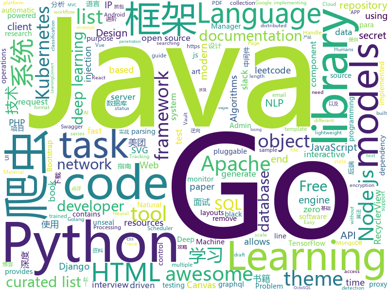

# 2019-07-19
See what the GitHub community is most excited about today.

## python
* [pytorch-transformers](https://github.com/huggingface/pytorch-transformers)(**302 stars today**): 👾A library of state-of-the-art pretrained models for Natural Language Processing (NLP)
* [python-cheatsheet](https://github.com/gto76/python-cheatsheet)(**340 stars today**): Comprehensive Python Cheatsheet
* [interview_internal_reference](https://github.com/0voice/interview_internal_reference)(**1,369 stars today**): 2019年最新总结，阿里，腾讯，百度，美团，头条等技术面试题目，以及答案，专家出题人分析汇总。
* [uiautomator2](https://github.com/openatx/uiautomator2)(**14 stars today**): Android Uiautomator2 Python Wrapper
* [django-rest-framework](https://github.com/encode/django-rest-framework)(**15 stars today**): Web APIs for Django.⚡️
* [bert-as-service](https://github.com/hanxiao/bert-as-service)(**23 stars today**): Mapping a variable-length sentence to a fixed-length vector using BERT model
* [NLP-progress](https://github.com/sebastianruder/NLP-progress)(**29 stars today**): Repository to track the progress in Natural Language Processing (NLP), including the datasets and the current state-of-the-art for the most common NLP tasks.
* [DeepLearningExamples](https://github.com/NVIDIA/DeepLearningExamples)(**58 stars today**): Deep Learning Examples
* [video-object-removal](https://github.com/zllrunning/video-object-removal)(**71 stars today**): Just draw a bounding box and you can remove the object you want to remove.
* [image-super-resolution](https://github.com/idealo/image-super-resolution)(**13 stars today**): Super-scale your images and run experiments with Residual Dense and Adversarial Networks.
* [gpt-2](https://github.com/openai/gpt-2)(**36 stars today**): Code for the paper "Language Models are Unsupervised Multitask Learners"
* [Text_Classification](https://github.com/kk7nc/Text_Classification)(**8 stars today**): Text Classification Algorithms: A Survey
* [oppia](https://github.com/oppia/oppia)(**2 stars today**): Tool for collaboratively building interactive lessons.
* [bert](https://github.com/google-research/bert)(**31 stars today**): TensorFlow code and pre-trained models for BERT
* [models](https://github.com/PaddlePaddle/models)(**33 stars today**): Pre-trained and Reproduced Deep Learning Models （『飞桨』官方模型库，包含多种学术前沿和工业场景验证的深度学习模型）
* [requests-html](https://github.com/oldani/requests-html)(**19 stars today**): Pythonic HTML Parsing for Humans™
* [mitmproxy](https://github.com/mitmproxy/mitmproxy)(**11 stars today**): An interactive TLS-capable intercepting HTTP proxy for penetration testers and software developers.
* [yolov3](https://github.com/ultralytics/yolov3)(**10 stars today**): YOLOv3 in PyTorch > ONNX > CoreML > iOS
* [Detectron](https://github.com/facebookresearch/Detectron)(**18 stars today**): FAIR's research platform for object detection research, implementing popular algorithms like Mask R-CNN and RetinaNet.
* [pandas-profiling](https://github.com/pandas-profiling/pandas-profiling)(**9 stars today**): Create HTML profiling reports from pandas DataFrame objects
* [requests](https://github.com/kennethreitz/requests)(**27 stars today**): Python HTTP Requests for Humans™✨🍰✨
* [plotly.py](https://github.com/plotly/plotly.py)(**15 stars today**): An open-source, interactive graphing library for Python✨
* [redis-py](https://github.com/andymccurdy/redis-py)(**6 stars today**): Redis Python Client
* [SiamMask](https://github.com/foolwood/SiamMask)(**16 stars today**): [CVPR2019] Fast Online Object Tracking and Segmentation: A Unifying Approach
* [ludwig](https://github.com/uber/ludwig)(**11 stars today**): Ludwig is a toolbox built on top of TensorFlow that allows to train and test deep learning models without the need to write code.

## java
* [solo](https://github.com/b3log/solo)(**274 stars today**): 🎸一款小而美的博客系统，专为程序员设计。https://hacpai.com/tag/solo
* [kafka](https://github.com/apache/kafka)(**52 stars today**): Mirror of Apache Kafka
* [Java](https://github.com/TheAlgorithms/Java)(**55 stars today**): All Algorithms implemented in Java
* [miaosha](https://github.com/qiurunze123/miaosha)(**89 stars today**): ⭐⭐⭐⭐秒杀系统设计与实现.互联网工程师进阶与分析🙋🐓
* [cat](https://github.com/dianping/cat)(**92 stars today**): CAT 作为服务端项目基础组件，提供了 Java, C/C++, Node.js, Python, Go 等多语言客户端，已经在美团点评的基础架构中间件框架（MVC框架，RPC框架，数据库框架，缓存框架等，消息队列，配置系统等）深度集成，为美团点评各业务线提供系统丰富的性能指标、健康状况、实时告警等。
* [java-design-patterns](https://github.com/iluwatar/java-design-patterns)(**54 stars today**): Design patterns implemented in Java
* [interviews](https://github.com/kdn251/interviews)(**78 stars today**): Everything you need to know to get the job.
* [java8-tutorial](https://github.com/winterbe/java8-tutorial)(**24 stars today**): Modern Java - A Guide to Java 8
* [ksql](https://github.com/confluentinc/ksql)(**1 stars today**): KSQL - the Streaming SQL Engine for Apache Kafka
* [spring-cloud-netflix](https://github.com/spring-cloud/spring-cloud-netflix)(**5 stars today**): Integration with Netflix OSS components
* [AndroidUtilCode](https://github.com/Blankj/AndroidUtilCode)(**18 stars today**): 🔥Android developers should collect the following utils(updating).
* [curator](https://github.com/apache/curator)(**9 stars today**): Apache Curator
* [ip2region](https://github.com/lionsoul2014/ip2region)(**15 stars today**): Ip2region is a offline IP location library with accuracy rate of 99.9% and 0.0x millseconds searching performance. DB file is less then 5Mb with all ip address stored. binding for Java,PHP,C,Python,Nodejs,Golang,C#,lua. Binary,B-tree,Memory searching algorithm
* [EasyScheduler](https://github.com/analysys/EasyScheduler)(**18 stars today**): Easy Scheduler is a distributed workflow task scheduling system, which mainly resolve the problem of "complicated task dependencies but cannot directly monitor the health status of tasks". Easy Scheduler assembles tasks in a DAG diagram and can monitor the running status of tasks in real time. Meanwhile, It supports operations such as retry, rec…
* [traccar](https://github.com/traccar/traccar)(**3 stars today**): Traccar GPS Tracking System
* [incubator-shardingsphere](https://github.com/apache/incubator-shardingsphere)(**12 stars today**): Distributed database middleware
* [guice](https://github.com/google/guice)(**3 stars today**): Guice (pronounced 'juice') is a lightweight dependency injection framework for Java 6 and above, brought to you by Google.
* [storm](https://github.com/apache/storm)(**3 stars today**): Mirror of Apache Storm
* [azkaban](https://github.com/azkaban/azkaban)(**1 stars today**): Azkaban workflow manager.
* [zkui](https://github.com/DeemOpen/zkui)(**4 stars today**): A UI dashboard that allows CRUD operations on Zookeeper.
* [IDDD_Samples](https://github.com/VaughnVernon/IDDD_Samples)(**2 stars today**): These are the sample Bounded Contexts from the book "Implementing Domain-Driven Design" by Vaughn Vernon: http://vaughnvernon.co/?page_id=168
* [java-docs-samples](https://github.com/GoogleCloudPlatform/java-docs-samples)(**1 stars today**): 
* [seldon-core](https://github.com/SeldonIO/seldon-core)(**4 stars today**): Machine Learning Deployment for Kubernetes
* [vlayout](https://github.com/alibaba/vlayout)(**4 stars today**): Project vlayout is a powerfull LayoutManager extension for RecyclerView, it provides a group of layouts for RecyclerView. Make it able to handle a complicate situation when grid, list and other layouts in the same recyclerview.
* [hive](https://github.com/apache/hive)(**2 stars today**): Apache Hive

## unknown
* [awesome-graph-classification](https://github.com/benedekrozemberczki/awesome-graph-classification)(**155 stars today**): A collection of important graph embedding, classification and representation learning papers with implementations.
* [kube-ladder](https://github.com/caicloud/kube-ladder)(**96 stars today**): Learning Kubernetes, The Chinese Taoist Way
* [awesome-nodejs](https://github.com/sindresorhus/awesome-nodejs)(**148 stars today**): ⚡️Delightful Node.js packages and resources
* [A-to-Z-Resources-for-Students](https://github.com/dipakkr/A-to-Z-Resources-for-Students)(**46 stars today**): Curated list of resources for college students
* [The-Hundred-Page-Machine-Learning-Book](https://github.com/ZakiaSalod/The-Hundred-Page-Machine-Learning-Book)(**5 stars today**): This repository contains the draft PDF copies of the book: The 100 Page Machine Learning Book
* [html-handbook](https://github.com/flaviocopes/html-handbook)(**3 stars today**): A draft of the HTML Handbook free ebook. Looking for feedback before I publish it!
* [lectures](https://github.com/oxford-cs-deepnlp-2017/lectures)(**3 stars today**): Oxford Deep NLP 2017 course
* [awesome-sysadmin](https://github.com/kahun/awesome-sysadmin)(**76 stars today**): A curated list of amazingly awesome open source sysadmin resources inspired by Awesome PHP.
* [public](https://github.com/openconfig/public)(**0 stars today**): Repository for publishing OpenConfig models, documentation, and other material for the community.
* [awesome-java-books](https://github.com/sorenduan/awesome-java-books)(**138 stars today**): Java开发者技术书籍大全 - Java入门书籍，Java基础及进阶书籍，框架与中间件，架构设计，设计模式，数学与算法，JVM周边语言，项目管理&领导力&流程，职业素养与个人成长，格局与视野，面试参考书等。
* [Data-Science-Books-1](https://github.com/SayantanMitra87/Data-Science-Books-1)(**4 stars today**): 
* [awesome-test-automation](https://github.com/atinfo/awesome-test-automation)(**12 stars today**): A curated list of awesome test automation frameworks, tools, libraries, and software for different programming languages. Sponsored by http://sdclabs.com
* [vagas](https://github.com/backend-br/vagas)(**6 stars today**): ✌️Espaço para divulgação de vagas para backenders
* [You-Dont-Know-JS](https://github.com/getify/You-Dont-Know-JS)(**62 stars today**): A book series on JavaScript. @YDKJS on twitter.
* [architect-awesome](https://github.com/xingshaocheng/architect-awesome)(**85 stars today**): 后端架构师技术图谱
* [everyone-can-use-english](https://github.com/xiaolai/everyone-can-use-english)(**12 stars today**): 人人都能用英语
* [products](https://github.com/Embdefire/products)(**5 stars today**): 野火所有产品资料的下载链接
* [awesome-distributed-systems](https://github.com/theanalyst/awesome-distributed-systems)(**9 stars today**): A curated list to learn about distributed systems
* [awesome-anomaly-detection](https://github.com/zhuyiche/awesome-anomaly-detection)(**1 stars today**): A complete list of papers on anomaly detection.
* [javaok](https://github.com/sayhiai/javaok)(**35 stars today**): 必看！java后端，亮剑诛仙。java发展路线技术要点。
* [awesome-design-systems](https://github.com/alexpate/awesome-design-systems)(**4 stars today**): 💅🏻⚒A collection of awesome design systems
* [Specs](https://github.com/CocoaPods/Specs)(**3 stars today**): The CocoaPods Master Repo
* [awesome-gcp-certifications](https://github.com/ddneves/awesome-gcp-certifications)(**3 stars today**): A curated list of resources for learning about Google Cloud Platform certifications and how to prepare for it.
* [styleguides](https://github.com/SAP/styleguides)(**2 stars today**): This repository provides SAP style guides for coding.
* [AI-Job-Notes](https://github.com/amusi/AI-Job-Notes)(**7 stars today**): AI算法岗求职攻略（涵盖准备攻略、刷题指南、内推和AI公司清单等资料）

## javascript
* [clean-code-javascript](https://github.com/ryanmcdermott/clean-code-javascript)(**213 stars today**): 🛁Clean Code concepts adapted for JavaScript
* [umi](https://github.com/umijs/umi)(**52 stars today**): 🌋Pluggable enterprise-level react application framework.
* [realworld](https://github.com/gothinkster/realworld)(**63 stars today**): "The mother of all demo apps" — Exemplary fullstack Medium.com clone powered by React, Angular, Node, Django, and many more🏅
* [graphql-engine](https://github.com/hasura/graphql-engine)(**21 stars today**): Blazing fast, instant realtime GraphQL APIs on Postgres with fine grained access control, also trigger webhooks on database events.
* [baidu-netdisk-downloaderx](https://github.com/b3log/baidu-netdisk-downloaderx)(**608 stars today**): ⚡️一款图形界面的百度网盘不限速下载器，支持 Windows、Linux 和 Mac。
* [jumpserver](https://github.com/jumpserver/jumpserver)(**37 stars today**): Jumpserver是全球首款完全开源的堡垒机，是符合 4A 的专业运维审计系统。
* [leetcode](https://github.com/azl397985856/leetcode)(**83 stars today**): LeetCode Solutions: A Record of My Problem Solving Journey.( leetcode题解，记录自己的leetcode解题之路。)
* [vue-echarts](https://github.com/ecomfe/vue-echarts)(**7 stars today**): ECharts component for Vue.js.
* [pm2](https://github.com/Unitech/pm2)(**20 stars today**): Node.js Production Process Manager with a built-in Load Balancer.
* [vuepress](https://github.com/vuejs/vuepress)(**21 stars today**): 📝Minimalistic Vue-powered static site generator
* [react-beautiful-dnd](https://github.com/atlassian/react-beautiful-dnd)(**27 stars today**): Beautiful and accessible drag and drop for lists with React
* [slick](https://github.com/kenwheeler/slick)(**12 stars today**): the last carousel you'll ever need
* [netron](https://github.com/lutzroeder/netron)(**29 stars today**): Visualizer for neural network, deep learning and machine learning models
* [flow-typed](https://github.com/flow-typed/flow-typed)(**1 stars today**): A central repository for Flow library definitions
* [yapi](https://github.com/YMFE/yapi)(**45 stars today**): YApi 是一个可本地部署的、打通前后端及QA的、可视化的接口管理平台
* [fe-interview](https://github.com/azl397985856/fe-interview)(**46 stars today**): 宇宙最强的前端面试指南 (https://lucifer.ren/fe-interview)
* [slack-black-theme](https://github.com/caiceA/slack-black-theme)(**7 stars today**): slack theme, dark theme for slack, black theme slack black theme
* [fabric.js](https://github.com/fabricjs/fabric.js)(**29 stars today**): Javascript Canvas Library, SVG-to-Canvas (& canvas-to-SVG) Parser
* [500lines](https://github.com/aosabook/500lines)(**16 stars today**): 500 Lines or Less
* [testcafe](https://github.com/DevExpress/testcafe)(**21 stars today**): A Node.js tool to automate end-to-end web testing.
* [charts](https://github.com/frappe/charts)(**27 stars today**): Simple, responsive, modern SVG Charts with zero dependencies
* [protobuf.js](https://github.com/protobufjs/protobuf.js)(**4 stars today**): Protocol Buffers for JavaScript (& TypeScript).
* [mongoose](https://github.com/Automattic/mongoose)(**10 stars today**): MongoDB object modeling designed to work in an asynchronous environment.
* [react-vis](https://github.com/uber/react-vis)(**11 stars today**): Data Visualization Components
* [search-ui](https://github.com/elastic/search-ui)(**36 stars today**): Libraries for the fast development of modern, engaging search experiences.

## html
* [node-interview](https://github.com/ElemeFE/node-interview)(**8 stars today**): How to pass the Node.js interview of ElemeFE.
* [learning-area](https://github.com/mdn/learning-area)(**2 stars today**): Github repo for the MDN Learning Area.
* [learn_python3_spider](https://github.com/wistbean/learn_python3_spider)(**59 stars today**): python爬虫教程系列、从0到1学习python爬虫，包括浏览器抓包，手机APP抓包，各种爬虫涉及的模块的使用，如：requests、beautifulSoup、selenium、appium、scrapy等，以及IP代理，验证码识别，Mysql，MongoDB数据库的python使用，多线程多进程爬虫的使用，css 爬虫加密逆向破解，JS爬虫逆向，爬虫项目实战实例等
* [email-templates](https://github.com/ColorlibHQ/email-templates)(**0 stars today**): Free HTML email templates for Mailchimp and other emails services
* [tiny-slider](https://github.com/ganlanyuan/tiny-slider)(**2 stars today**): Vanilla javascript slider for all purposes.
* [izone](https://github.com/Hopetree/izone)(**1 stars today**): django+bootstrap4 个人博客
* [webdevbootcamp](https://github.com/nax3t/webdevbootcamp)(**0 stars today**): All source code for back-end projects from the Web Developer Bootcamp
* [antd-mobile-samples](https://github.com/ant-design/antd-mobile-samples)(**1 stars today**): antd-mobile samples
* [Machine-Learning-in-Action-Python3](https://github.com/wzy6642/Machine-Learning-in-Action-Python3)(**5 stars today**): 《机器学习实战》python3源码
* [sql-formatter](https://github.com/jdorn/sql-formatter)(**3 stars today**): A lightweight php class for formatting sql statements. Handles automatic indentation and syntax highlighting.
* [stickyfill](https://github.com/wilddeer/stickyfill)(**3 stars today**): Polyfill for CSS `position: sticky`
* [compat-table](https://github.com/kangax/compat-table)(**1 stars today**): ECMAScript 5/6/7 compatibility tables
* [privacytools.io](https://github.com/privacytoolsIO/privacytools.io)(**1 stars today**): 🛡️encryption against global mass surveillance
* [mkdocs-material](https://github.com/squidfunk/mkdocs-material)(**4 stars today**): A Material Design theme for MkDocs
* [swagger-codegen](https://github.com/swagger-api/swagger-codegen)(**8 stars today**): swagger-codegen contains a template-driven engine to generate documentation, API clients and server stubs in different languages by parsing your OpenAPI / Swagger definition.
* [nndl.github.io](https://github.com/nndl/nndl.github.io)(**17 stars today**): 《神经网络与深度学习》 Neural Network and Deep Learning
* [pdf2htmlEX](https://github.com/coolwanglu/pdf2htmlEX)(**4 stars today**): Convert PDF to HTML without losing text or format.
* [Front-end-Developer-Interview-Questions](https://github.com/h5bp/Front-end-Developer-Interview-Questions)(**13 stars today**): A list of helpful front-end related questions you can use to interview potential candidates, test yourself or completely ignore.
* [jx-docs](https://github.com/jenkins-x/jx-docs)(**0 stars today**): the source code used to build the documentation and website for Jenkins X
* [NGINX-Demos](https://github.com/nginxinc/NGINX-Demos)(**0 stars today**): NGINX and NGINX Plus demos
* [bedrock](https://github.com/mozilla/bedrock)(**0 stars today**): Making mozilla.org awesome, one pebble at a time
* [web-api-auth-examples](https://github.com/spotify/web-api-auth-examples)(**1 stars today**): Basic examples to authenticate and fetch data using the Spotify Web API
* [python](https://github.com/Show-Me-the-Code/python)(**3 stars today**): Show Me the Code Python version.
* [gentelella](https://github.com/ColorlibHQ/gentelella)(**7 stars today**): Free Bootstrap 3 Admin Template
* [AdminLTE](https://github.com/ColorlibHQ/AdminLTE)(**15 stars today**): AdminLTE - Free Premium Admin control Panel Theme Based On Bootstrap 3.x

## go
* [vugu](https://github.com/vugu/vugu)(**182 stars today**): Vugu: A modern UI library for Go+WebAssembly (experimental)
* [octosql](https://github.com/cube2222/octosql)(**165 stars today**): OctoSQL is a query tool that allows you to join, analyse and transform data from multiple databases and file formats using SQL.
* [soar](https://github.com/XiaoMi/soar)(**70 stars today**): SQL Optimizer And Rewriter
* [autoscaler](https://github.com/kubernetes/autoscaler)(**52 stars today**): Autoscaling components for Kubernetes
* [vault](https://github.com/hashicorp/vault)(**13 stars today**): A tool for secrets management, encryption as a service, and privileged access management
* [serving](https://github.com/knative/serving)(**10 stars today**): Kubernetes-based, scale-to-zero, request-driven compute
* [goss](https://github.com/aelsabbahy/goss)(**15 stars today**): Quick and Easy server testing/validation
* [opa](https://github.com/open-policy-agent/opa)(**8 stars today**): An open source, general-purpose policy engine.
* [mongo-go-driver](https://github.com/mongodb/mongo-go-driver)(**14 stars today**): The Go driver for MongoDB
* [swag](https://github.com/swaggo/swag)(**15 stars today**): Automatically generate RESTful API documentation with Swagger 2.0 for Go.
* [gorm](https://github.com/jinzhu/gorm)(**24 stars today**): The fantastic ORM library for Golang, aims to be developer friendly
* [gqlgen](https://github.com/99designs/gqlgen)(**11 stars today**): go generate based graphql server library
* [minikube](https://github.com/kubernetes/minikube)(**19 stars today**): Run Kubernetes locally
* [toxiproxy](https://github.com/Shopify/toxiproxy)(**29 stars today**): ⏰🔥A TCP proxy to simulate network and system conditions for chaos and resiliency testing
* [stolon](https://github.com/sorintlab/stolon)(**11 stars today**): PostgreSQL cloud native High Availability and more.
* [logrus](https://github.com/sirupsen/logrus)(**21 stars today**): Structured, pluggable logging for Go.
* [zerolog](https://github.com/rs/zerolog)(**12 stars today**): Zero Allocation JSON Logger
* [Mastering_Go_ZH_CN](https://github.com/hantmac/Mastering_Go_ZH_CN)(**38 stars today**): 《Mastering GO》中文译本，暂时命名为《玩转 GO》。
* [mock](https://github.com/golang/mock)(**16 stars today**): GoMock is a mocking framework for the Go programming language.
* [wire](https://github.com/google/wire)(**10 stars today**): Compile-time Dependency Injection for Go
* [terraform-provider-aws](https://github.com/terraform-providers/terraform-provider-aws)(**5 stars today**): Terraform AWS provider
* [fzf](https://github.com/junegunn/fzf)(**33 stars today**): 🌸A command-line fuzzy finder
* [prometheus](https://github.com/prometheus/prometheus)(**24 stars today**): The Prometheus monitoring system and time series database.
* [bank-vaults](https://github.com/banzaicloud/bank-vaults)(**6 stars today**): A Vault swiss-army knife: A K8s operator. Go client with automatic token renewal, Kubernetes support, dynamic secrets, multiple unseal options and more. A CLI tool to init, unseal and configure Vault (auth methods, secret engines). Direct secret injection into Pods.
* [client-go](https://github.com/kubernetes/client-go)(**6 stars today**): Go client for Kubernetes.

## WordCloud

