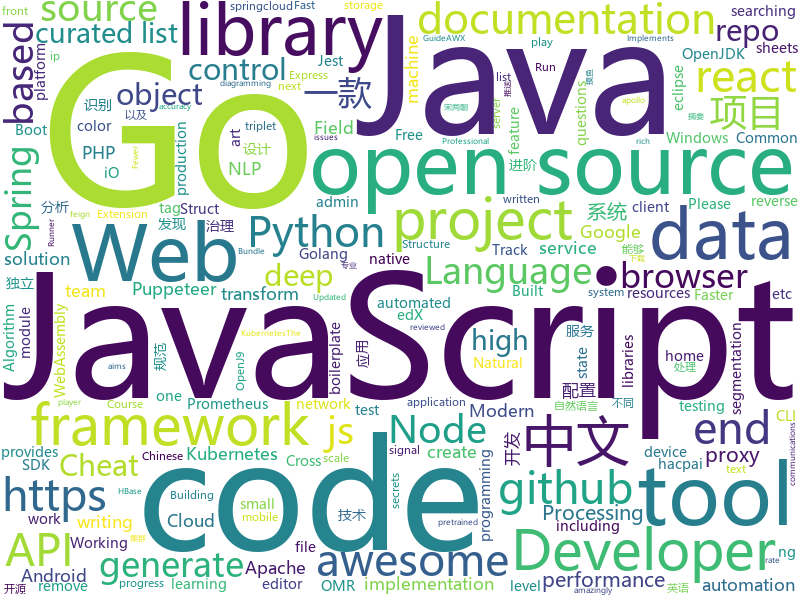

# 2019-07-21
See what the GitHub community is most excited about today.

## python
* [interview_internal_reference](https://github.com/0voice/interview_internal_reference)(**1,366 stars today**): 2019年最新总结，阿里，腾讯，百度，美团，头条等技术面试题目，以及答案，专家出题人分析汇总。
* [GitGot](https://github.com/BishopFox/GitGot)(**68 stars today**): Semi-automated, feedback-driven tool to rapidly search through troves of public data on GitHub for sensitive secrets.
* [stanfordnlp](https://github.com/stanfordnlp/stanfordnlp)(**46 stars today**): Official Stanford NLP Python Library for Many Human Languages
* [dreamtime](https://github.com/private-dreamnet/dreamtime)(**30 stars today**): DreamTime allows you to transform photos to get free entertainment.
* [chinese-poetry](https://github.com/chinese-poetry/chinese-poetry)(**131 stars today**): 最全中华古诗词数据库, 唐宋两朝近一万四千古诗人, 接近5.5万首唐诗加26万宋诗. 两宋时期1564位词人，21050首词。
* [maskrcnn-benchmark](https://github.com/facebookresearch/maskrcnn-benchmark)(**8 stars today**): Fast, modular reference implementation of Instance Segmentation and Object Detection algorithms in PyTorch.
* [faceai](https://github.com/vipstone/faceai)(**52 stars today**): 一款入门级的人脸、视频、文字检测以及识别的项目.
* [video-object-removal](https://github.com/zllrunning/video-object-removal)(**62 stars today**): Just draw a bounding box and you can remove the object you want to remove.
* [pytorch-transformers](https://github.com/huggingface/pytorch-transformers)(**63 stars today**): 👾A library of state-of-the-art pretrained models for Natural Language Processing (NLP)
* [edx-platform](https://github.com/edx/edx-platform)(**3 stars today**): The Open edX platform, the software that powers edX!
* [black](https://github.com/python/black)(**14 stars today**): The uncompromising Python code formatter
* [featuretools](https://github.com/Featuretools/featuretools)(**4 stars today**): An open source python framework for automated feature engineering
* [webssh](https://github.com/huashengdun/webssh)(**17 stars today**): 🌱Web based ssh client
* [natural-adv-examples](https://github.com/hendrycks/natural-adv-examples)(**16 stars today**): A Harder ImageNet Test Set
* [Learning-to-See-in-the-Dark](https://github.com/cchen156/Learning-to-See-in-the-Dark)(**33 stars today**): Learning to See in the Dark. CVPR 2018
* [magic-wormhole](https://github.com/warner/magic-wormhole)(**20 stars today**): get things from one computer to another, safely
* [NeuralNLP-NeuralClassifier](https://github.com/Tencent/NeuralNLP-NeuralClassifier)(**26 stars today**): An Open-source Neural Hierarchical Multi-label Text Classification Toolkit
* [Real-Time-Voice-Cloning](https://github.com/CorentinJ/Real-Time-Voice-Cloning)(**21 stars today**): Clone a voice in 5 seconds to generate arbitrary speech in real-time
* [flair](https://github.com/zalandoresearch/flair)(**11 stars today**): A very simple framework for state-of-the-art Natural Language Processing (NLP)
* [DeepLabCut](https://github.com/AlexEMG/DeepLabCut)(**6 stars today**): Markerless pose estimation of user-defined features with deep learning for all animals, including humans
* [siamese-triplet](https://github.com/adambielski/siamese-triplet)(**5 stars today**): Siamese and triplet networks with online pair/triplet mining in PyTorch
* [mlflow](https://github.com/mlflow/mlflow)(**5 stars today**): Open source platform for the machine learning lifecycle
* [home-assistant](https://github.com/home-assistant/home-assistant)(**31 stars today**): 🏡Open source home automation that puts local control and privacy first
* [boto3](https://github.com/boto/boto3)(**3 stars today**): AWS SDK for Python
* [airflow](https://github.com/apache/airflow)(**12 stars today**): Apache Airflow

## java
* [micronaut-predator](https://github.com/micronaut-projects/micronaut-predator)(**24 stars today**): Ahead of Time Data Repositories
* [java-design-patterns](https://github.com/iluwatar/java-design-patterns)(**134 stars today**): Design patterns implemented in Java
* [miaosha](https://github.com/qiurunze123/miaosha)(**75 stars today**): ⭐⭐⭐⭐秒杀系统设计与实现.互联网工程师进阶与分析🙋🐓
* [hive](https://github.com/apache/hive)(**4 stars today**): Apache Hive
* [SpringCloud](https://github.com/zhoutaoo/SpringCloud)(**13 stars today**): 基于SpringCloud2.0的微服务开发脚手架，整合了spring-security-oauth2、apollo、eureka、feign、hystrix、springcloud-gateway、springcloud-bus等。治理方面引入elasticsearch、skywalking、springboot-admin、zipkin等，让项目开发快速进入业务开发，而不需过多时间花费在架构搭建上。持续更新中
* [java8-tutorial](https://github.com/winterbe/java8-tutorial)(**8 stars today**): Modern Java - A Guide to Java 8
* [maps](https://github.com/react-native-mapbox-gl/maps)(**1 stars today**): A Mapbox GL react native module for creating custom maps
* [incubator-druid](https://github.com/apache/incubator-druid)(**3 stars today**): Apache Druid (Incubating) - Column oriented distributed data store ideal for powering interactive applications
* [Telegram](https://github.com/DrKLO/Telegram)(**9 stars today**): Telegram for Android source
* [solo](https://github.com/b3log/solo)(**43 stars today**): 🎸一款小而美的博客系统，专为程序员设计。https://hacpai.com/tag/solo
* [piggymetrics](https://github.com/sqshq/piggymetrics)(**8 stars today**): Microservice Architecture with Spring Boot, Spring Cloud and Docker
* [hbase](https://github.com/apache/hbase)(**7 stars today**): Mirror of Apache HBase
* [HanLP](https://github.com/hankcs/HanLP)(**10 stars today**): 自然语言处理 中文分词 词性标注 命名实体识别 依存句法分析 新词发现 关键词短语提取 自动摘要 文本分类聚类 拼音简繁
* [helidon](https://github.com/oracle/helidon)(**2 stars today**): Java libraries for writing microservices
* [apollo](https://github.com/ctripcorp/apollo)(**31 stars today**): Apollo（阿波罗）是携程框架部门研发的分布式配置中心，能够集中化管理应用不同环境、不同集群的配置，配置修改后能够实时推送到应用端，并且具备规范的权限、流程治理等特性，适用于微服务配置管理场景。
* [microprofile](https://github.com/eclipse/microprofile)(**1 stars today**): Repository for important documentation - the index to the project / community
* [ExoPlayer](https://github.com/google/ExoPlayer)(**6 stars today**): An extensible media player for Android
* [kafka](https://github.com/apache/kafka)(**24 stars today**): Mirror of Apache Kafka
* [graal](https://github.com/oracle/graal)(**7 stars today**): GraalVM: Run Programs Faster Anywhere🚀
* [Interview-Questions](https://github.com/rishabh115/Interview-Questions)(**4 stars today**): Most comprehensive list📋of interview questions📘of companies scraped from Geeksforgeeks, CareerCup and Glassdoor.
* [ip2region](https://github.com/lionsoul2014/ip2region)(**4 stars today**): Ip2region is a offline IP location library with accuracy rate of 99.9% and 0.0x millseconds searching performance. DB file is less then 5Mb with all ip address stored. binding for Java,PHP,C,Python,Nodejs,Golang,C#,lua. Binary,B-tree,Memory searching algorithm
* [openj9](https://github.com/eclipse/openj9)(**10 stars today**): Eclipse OpenJ9: A Java Virtual Machine for OpenJDK that's optimized for small footprint, fast start-up, and high throughput. Builds on Eclipse OMR (https://github.com/eclipse/omr) and combines with the Extensions for OpenJDK for OpenJ9 repo.
* [jenkins](https://github.com/jenkinsci/jenkins)(**9 stars today**): Jenkins automation server
* [disruptor](https://github.com/LMAX-Exchange/disruptor)(**4 stars today**): High Performance Inter-Thread Messaging Library
* [feign](https://github.com/OpenFeign/feign)(**1 stars today**): Feign makes writing java http clients easier

## unknown
* [google-cloud-4-words](https://github.com/gregsramblings/google-cloud-4-words)(**61 stars today**): The Google Cloud Developer's Cheat Sheet
* [A-to-Z-Resources-for-Students](https://github.com/dipakkr/A-to-Z-Resources-for-Students)(**443 stars today**): Curated list of resources for college students
* [kube-ladder](https://github.com/caicloud/kube-ladder)(**38 stars today**): Learning Kubernetes, The Chinese Taoist Way
* [JDSRC-Small-Classroom](https://github.com/xiangpasama/JDSRC-Small-Classroom)(**40 stars today**): 京东SRC小课堂系列文章
* [weekly](https://github.com/ruanyf/weekly)(**102 stars today**): 科技爱好者周刊，每周五发布
* [pwc](https://github.com/zziz/pwc)(**10 stars today**): Papers with code. Sorted by stars. Updated weekly.
* [awesome-production-machine-learning](https://github.com/EthicalML/awesome-production-machine-learning)(**4 stars today**): A curated list of awesome open source libraries to deploy, monitor, version and scale your machine learning
* [awesome-sysadmin](https://github.com/kahun/awesome-sysadmin)(**26 stars today**): A curated list of amazingly awesome open source sysadmin resources inspired by Awesome PHP.
* [summer2020internships](https://github.com/elaine-zheng/summer2020internships)(**6 stars today**): Keep track of internships for Summer 2020 for undergraduates interested in tech./SWE/related fields
* [everyone-can-use-english](https://github.com/xiaolai/everyone-can-use-english)(**7 stars today**): 人人都能用英语
* [You-Dont-Know-JS](https://github.com/getify/You-Dont-Know-JS)(**42 stars today**): A book series on JavaScript. @YDKJS on twitter.
* [996.Leave](https://github.com/623637646/996.Leave)(**3 stars today**): 逃离996
* [nlp-beginner](https://github.com/FudanNLP/nlp-beginner)(**14 stars today**): NLP上手教程
* [chinese-independent-developer](https://github.com/1c7/chinese-independent-developer)(**7 stars today**): 👩🏿‍💻👨🏾‍💻👩🏼‍💻👨🏽‍💻👩🏻‍💻中国独立开发者项目列表 -- 分享大家都在做什么
* [about-us](https://github.com/gobridge/about-us)(**2 stars today**): Building Bridges That Educate & Empower Underrepresented Communities.
* [awesome-nodejs](https://github.com/sindresorhus/awesome-nodejs)(**23 stars today**): ⚡️Delightful Node.js packages and resources
* [javascript-interview-questions-developer](https://github.com/tuantvk/javascript-interview-questions-developer)(**2 stars today**): Danh sách những câu hỏi trong phỏng vấn Javascript📝(Working in progress)
* [Data-Science--Cheat-Sheet](https://github.com/abhat222/Data-Science--Cheat-Sheet)(**14 stars today**): Cheat Sheets
* [awesome-semantic-segmentation](https://github.com/mrgloom/awesome-semantic-segmentation)(**2 stars today**): 🤘awesome-semantic-segmentation
* [English-level-up-tips-for-Chinese](https://github.com/byoungd/English-level-up-tips-for-Chinese)(**9 stars today**): 可能是让你受益匪浅的英语进阶指南
* [free-programming-books-zh_CN](https://github.com/justjavac/free-programming-books-zh_CN)(**23 stars today**): 📚免费的计算机编程类中文书籍，欢迎投稿
* [mastering-emacs-in-one-year-guide](https://github.com/redguardtoo/mastering-emacs-in-one-year-guide)(**4 stars today**): Be great at emacs in one year
* [document-style-guide](https://github.com/ruanyf/document-style-guide)(**9 stars today**): 中文技术文档的写作规范
* [nlp_chinese_corpus](https://github.com/brightmart/nlp_chinese_corpus)(**2 stars today**): 大规模中文自然语言处理语料 Large Scale Chinese Corpus for NLP
* [awesome-knowledge-distillation](https://github.com/dkozlov/awesome-knowledge-distillation)(**34 stars today**): Awesome Knowledge Distillation

## javascript
* [clean-code-javascript](https://github.com/ryanmcdermott/clean-code-javascript)(**107 stars today**): 🛁Clean Code concepts adapted for JavaScript
* [Thief-Book](https://github.com/cteams/Thief-Book)(**56 stars today**): 一款真正的跨平台摸鱼神器
* [mpx](https://github.com/didi/mpx)(**13 stars today**): Mpx - An enhanced miniprogram framework with data reactivity and deep optimizition.
* [puppeteer-recorder](https://github.com/checkly/puppeteer-recorder)(**23 stars today**): Puppeteer recorder is a Chrome extension that records your browser interactions and generates a Puppeteer script.
* [vConsole](https://github.com/Tencent/vConsole)(**17 stars today**): A lightweight, extendable front-end developer tool for mobile web page.
* [readme-md-generator](https://github.com/kefranabg/readme-md-generator)(**28 stars today**): 📄CLI that generates beautiful README.md files
* [testcafe](https://github.com/DevExpress/testcafe)(**9 stars today**): A Node.js tool to automate end-to-end web testing.
* [vis](https://github.com/almende/vis)(**1 stars today**): ⚠️This project is not maintained anymore! Please go to https://github.com/visjs
* [typescript-tutorial](https://github.com/xcatliu/typescript-tutorial)(**21 stars today**): TypeScript 入门教程
* [jest-puppeteer](https://github.com/smooth-code/jest-puppeteer)(**17 stars today**): Run your tests using Jest & Puppeteer🎪✨
* [Rocket.Chat](https://github.com/RocketChat/Rocket.Chat)(**11 stars today**): The ultimate Free Open Source Solution for team communications.
* [appium](https://github.com/appium/appium)(**10 stars today**): 📱Automation for iOS, Android, and Windows Apps.
* [parse-server](https://github.com/parse-community/parse-server)(**5 stars today**): API server module for Node/Express
* [baidu-netdisk-downloaderx](https://github.com/b3log/baidu-netdisk-downloaderx)(**641 stars today**): ⚡️一款图形界面的百度网盘不限速下载器，支持 Windows、Linux 和 Mac。 https://hacpai.com/tag/bnd
* [umi](https://github.com/umijs/umi)(**5 stars today**): 🌋Pluggable enterprise-level react application framework.
* [fithero](https://github.com/ferrannp/fithero)(**19 stars today**): Track your gym progress with FitHero. Built with React Native.
* [cgm-remote-monitor](https://github.com/nightscout/cgm-remote-monitor)(**2 stars today**): nightscout web monitor
* [jumpserver](https://github.com/jumpserver/jumpserver)(**6 stars today**): Jumpserver是全球首款完全开源的堡垒机，是符合 4A 的专业运维审计系统。
* [stf](https://github.com/openstf/stf)(**10 stars today**): Control and manage Android devices from your browser.
* [color-thief](https://github.com/lokesh/color-thief)(**18 stars today**): Grabs the dominant color or a representative color palette from an image. Uses javascript and canvas.
* [WebGL-Fluid-Simulation](https://github.com/PavelDoGreat/WebGL-Fluid-Simulation)(**4 stars today**): Play with fluids in your browser (works even on mobile)
* [react-admin](https://github.com/yezihaohao/react-admin)(**5 stars today**): ✨react-admin system solution : react 后台管理系统解决方案
* [javascript](https://github.com/airbnb/javascript)(**40 stars today**): JavaScript Style Guide
* [awx](https://github.com/ansible/awx)(**6 stars today**): AWX Project
* [ckeditor5](https://github.com/ckeditor/ckeditor5)(**4 stars today**): Development environment for CKEditor 5 – the best browser-based rich text editor.

## html
* [favorites-web](https://github.com/cloudfavorites/favorites-web)(**1 stars today**): 云收藏 Spring Boot 2.X 开源项目
* [professional-services](https://github.com/GoogleCloudPlatform/professional-services)(**0 stars today**): Common solutions and tools developed by Google Cloud's Professional Services team
* [flutter-in-action](https://github.com/flutterchina/flutter-in-action)(**42 stars today**): 《Flutter实战》电子书
* [dsp-theory](https://github.com/capitanov/dsp-theory)(**9 stars today**): Theory of digital signal processing (DSP): signals, filtration (IIR, FIR, CIC, MAF), transforms (FFT, DFT, Hilbert, Z-transform) etc.
* [website](https://github.com/kubernetes/website)(**2 stars today**): Kubernetes website and documentation repo:
* [next-boilerplate](https://github.com/pankod/next-boilerplate)(**3 stars today**): A well-structured production ready Next.js boilerplate with Typescript, Redux, Jest, Enzyme, Express.js, Sass, Css, EnvConfig, Fetch, Reverse Proxy, Bundle Analyzer and Built-in Project CLI. https://pankod.github.io/next-boilerplate/
* [blog_os](https://github.com/phil-opp/blog_os)(**3 stars today**): Writing an OS in Rust
* [datasciencecoursera](https://github.com/mGalarnyk/datasciencecoursera)(**1 stars today**): Data Science Repo and blog for John Hopkins Coursera Courses. Please let me know if you have any questions.
* [en.javascript.info](https://github.com/javascript-tutorial/en.javascript.info)(**13 stars today**): Modern JavaScript Tutorial
* [awesome-competitive-programming](https://github.com/lnishan/awesome-competitive-programming)(**8 stars today**): 💎A curated list of awesome Competitive Programming, Algorithm and Data Structure resources
* [workshops](https://github.com/ansible/workshops)(**5 stars today**): Training Course for Ansible Automation
* [training-kit](https://github.com/github/training-kit)(**3 stars today**): Open source cheat sheets for Git and GitHub
* [dom-examples](https://github.com/mdn/dom-examples)(**1 stars today**): Code examples that accompany various MDN DOM and Web API documentation pages
* [CoHuRe](https://github.com/cohure/CoHuRe)(**2 stars today**): 
* [devdocs](https://github.com/magento/devdocs)(**0 stars today**): Magento Developer Documentation
* [bitcoin-whitepaper-chinese-translation](https://github.com/xiaolai/bitcoin-whitepaper-chinese-translation)(**0 stars today**): 
* [turndown](https://github.com/domchristie/turndown)(**1 stars today**): 🛏An HTML to Markdown converter written in JavaScript
* [china-indie-podcasts](https://github.com/typlog/china-indie-podcasts)(**1 stars today**): 发现与推荐高质量的中文独立播客
* [webdevbootcamp](https://github.com/nax3t/webdevbootcamp)(**4 stars today**): All source code for back-end projects from the Web Developer Bootcamp
* [expressjs.com](https://github.com/expressjs/expressjs.com)(**1 stars today**): 
* [foundation-sites](https://github.com/zurb/foundation-sites)(**3 stars today**): The most advanced responsive front-end framework in the world. Quickly create prototypes and production code for sites that work on any kind of device.
* [mxgraph](https://github.com/jgraph/mxgraph)(**3 stars today**): mxGraph is a fully client side JavaScript diagramming library
* [rellax](https://github.com/dixonandmoe/rellax)(**3 stars today**): Lightweight, vanilla javascript parallax library
* [csswg-drafts](https://github.com/w3c/csswg-drafts)(**1 stars today**): CSS Working Group Editor Drafts
* [sample-code](https://github.com/appium-boneyard/sample-code)(**0 stars today**): appium sample code (dotnet, java, node, perl, php, python, ruby, etc.)

## go
* [tinygo](https://github.com/tinygo-org/tinygo)(**49 stars today**): Go compiler for small places. Microcontrollers, WebAssembly, and command-line tools. Based on LLVM.
* [swag](https://github.com/swaggo/swag)(**29 stars today**): Automatically generate RESTful API documentation with Swagger 2.0 for Go.
* [vugu](https://github.com/vugu/vugu)(**39 stars today**): Vugu: A modern UI library for Go+WebAssembly (experimental)
* [istio](https://github.com/istio/istio)(**8 stars today**): Connect, secure, control, and observe services.
* [libpod](https://github.com/containers/libpod)(**5 stars today**): libpod is a library used to create container pods. Home of Podman.
* [grpc-go](https://github.com/grpc/grpc-go)(**15 stars today**): The Go language implementation of gRPC. HTTP/2 based RPC
* [vault](https://github.com/hashicorp/vault)(**5 stars today**): A tool for secrets management, encryption as a service, and privileged access management
* [thanos](https://github.com/thanos-io/thanos)(**9 stars today**): Highly available Prometheus setup with long term storage capabilities.
* [pacgo](https://github.com/danicat/pacgo)(**11 stars today**): A Pac Man clone written in Go (with emojis!)
* [testify](https://github.com/stretchr/testify)(**7 stars today**): A toolkit with common assertions and mocks that plays nicely with the standard library
* [cortex](https://github.com/cortexproject/cortex)(**8 stars today**): A multitenant, horizontally scalable Prometheus as a Service
* [golangci-lint](https://github.com/golangci/golangci-lint)(**6 stars today**): Linters Runner for Go. 5x faster than gometalinter. Nice colored output. Can report only new issues. Fewer false-positives. Yaml/toml config.
* [aws-sdk-go](https://github.com/aws/aws-sdk-go)(**1 stars today**): AWS SDK for the Go programming language.
* [autoscaler](https://github.com/kubernetes/autoscaler)(**3 stars today**): Autoscaling components for Kubernetes
* [gorm](https://github.com/jinzhu/gorm)(**5 stars today**): The fantastic ORM library for Golang, aims to be developer friendly
* [operator-sdk](https://github.com/operator-framework/operator-sdk)(**6 stars today**): SDK for building Kubernetes applications. Provides high level APIs, useful abstractions, and project scaffolding.
* [toxiproxy](https://github.com/Shopify/toxiproxy)(**8 stars today**): ⏰🔥A TCP proxy to simulate network and system conditions for chaos and resiliency testing
* [validator](https://github.com/go-playground/validator)(**4 stars today**): 💯Go Struct and Field validation, including Cross Field, Cross Struct, Map, Slice and Array diving
* [soar](https://github.com/XiaoMi/soar)(**8 stars today**): SQL Optimizer And Rewriter
* [terraform](https://github.com/hashicorp/terraform)(**5 stars today**): Terraform enables you to safely and predictably create, change, and improve infrastructure. It is an open source tool that codifies APIs into declarative configuration files that can be shared amongst team members, treated as code, edited, reviewed, and versioned.
* [go-spew](https://github.com/davecgh/go-spew)(**4 stars today**): Implements a deep pretty printer for Go data structures to aid in debugging
* [minio](https://github.com/minio/minio)(**7 stars today**): MinIO is a high performance object storage server compatible with Amazon S3 APIs
* [go-ethereum](https://github.com/ethereum/go-ethereum)(**5 stars today**): Official Go implementation of the Ethereum protocol
* [squirrel](https://github.com/Masterminds/squirrel)(**4 stars today**): Fluent SQL generation for golang
* [oauth2_proxy](https://github.com/pusher/oauth2_proxy)(**1 stars today**): A reverse proxy that provides authentication with Google, Github or other providers.

## WordCloud

