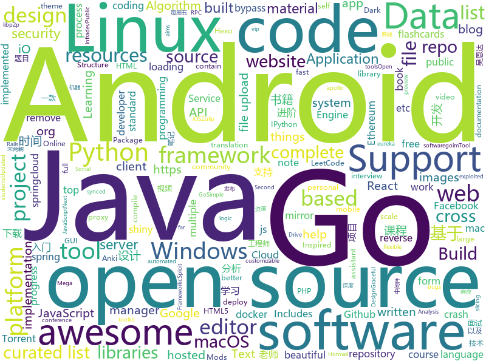

# 2019-07-22
See what the GitHub community is most excited about today.

## python
* [chinese-poetry](https://github.com/chinese-poetry/chinese-poetry)(**549 stars today**): 最全中华古诗词数据库, 唐宋两朝近一万四千古诗人, 接近5.5万首唐诗加26万宋诗. 两宋时期1564位词人，21050首词。
* [faceai](https://github.com/vipstone/faceai)(**298 stars today**): 一款入门级的人脸、视频、文字检测以及识别的项目.
* [interview_internal_reference](https://github.com/0voice/interview_internal_reference)(**1,717 stars today**): 2019年最新总结，阿里，腾讯，百度，美团，头条等技术面试题目，以及答案，专家出题人分析汇总。
* [baby-names-analysis](https://github.com/PhantomInsights/baby-names-analysis)(**49 stars today**): Data ETL & Analysis on the dataset 'Baby Names from Social Security Card Applications - National Data'.
* [video-object-removal](https://github.com/zllrunning/video-object-removal)(**80 stars today**): Just draw a bounding box and you can remove the object you want to remove.
* [Learning-to-See-in-the-Dark](https://github.com/cchen156/Learning-to-See-in-the-Dark)(**20 stars today**): Learning to See in the Dark. CVPR 2018
* [system-design-primer](https://github.com/donnemartin/system-design-primer)(**66 stars today**): Learn how to design large-scale systems. Prep for the system design interview. Includes Anki flashcards.
* [TBomb](https://github.com/TheSpeedX/TBomb)(**3 stars today**): This is a SMS And Call Bomber For Linux And Termux
* [TecoGAN](https://github.com/thunil/TecoGAN)(**11 stars today**): This repo will contain source code and materials for the TecoGAN project, i.e. code for a TEmporally COherent GAN
* [ipython](https://github.com/ipython/ipython)(**5 stars today**): Official repository for IPython itself. Other repos in the IPython organization contain things like the website, documentation builds, etc.
* [PythonSpiderNotes](https://github.com/lining0806/PythonSpiderNotes)(**13 stars today**): Python入门网络爬虫之精华版
* [NeuralNLP-NeuralClassifier](https://github.com/Tencent/NeuralNLP-NeuralClassifier)(**30 stars today**): An Open-source Neural Hierarchical Multi-label Text Classification Toolkit
* [GitGot](https://github.com/BishopFox/GitGot)(**94 stars today**): Semi-automated, feedback-driven tool to rapidly search through troves of public data on GitHub for sensitive secrets.
* [trfl](https://github.com/deepmind/trfl)(**7 stars today**): TensorFlow Reinforcement Learning
* [code_snippets](https://github.com/CoreyMSchafer/code_snippets)(**15 stars today**): 
* [interactive-coding-challenges](https://github.com/donnemartin/interactive-coding-challenges)(**12 stars today**): 120+ interactive Python coding interview challenges (algorithms and data structures). Includes Anki flashcards.
* [Brute_Force](https://github.com/Matrix07ksa/Brute_Force)(**10 stars today**): Brute_Force_Attack Gmail Hotmail Twitter Facebook Netflix
* [pyTelegramBotAPI](https://github.com/eternnoir/pyTelegramBotAPI)(**6 stars today**): Python Telegram bot api.
* [kivy](https://github.com/kivy/kivy)(**9 stars today**): Open source UI framework written in Python, running on Windows, Linux, macOS, Android and iOS
* [shadowsocks](https://github.com/shadowsocks/shadowsocks)(**15 stars today**): 
* [zulip](https://github.com/zulip/zulip)(**5 stars today**): Zulip server - powerful open source team chat
* [SETAN](https://github.com/pashayogi/SETAN)(**2 stars today**): Hack fb
* [Cura](https://github.com/Ultimaker/Cura)(**3 stars today**): 3D printer / slicing GUI built on top of the Uranium framework
* [DarkScrape](https://github.com/itsmehacker/DarkScrape)(**4 stars today**): OSINT Tool For Scraping Dark Websites
* [BLCMods](https://github.com/BLCM/BLCMods)(**1 stars today**): This is a repository for Community Mods made for the Borderlands series

## java
* [java-design-patterns](https://github.com/iluwatar/java-design-patterns)(**178 stars today**): Design patterns implemented in Java
* [miaosha](https://github.com/qiurunze123/miaosha)(**105 stars today**): ⭐⭐⭐⭐秒杀系统设计与实现.互联网工程师进阶与分析🙋🐓
* [MinecraftForge](https://github.com/MinecraftForge/MinecraftForge)(**6 stars today**): Modifications to the Minecraft base files to assist in compatibility between mods.
* [runelite](https://github.com/runelite/runelite)(**1 stars today**): Open source Old School RuneScape client
* [Arduino](https://github.com/arduino/Arduino)(**6 stars today**): open-source electronics prototyping platform
* [AndroidTutorialForBeginners](https://github.com/hussien89aa/AndroidTutorialForBeginners)(**6 stars today**): Step by step to build Android apps using Android Studio
* [micronaut-predator](https://github.com/micronaut-projects/micronaut-predator)(**23 stars today**): Ahead of Time Data Repositories
* [spring-framework](https://github.com/spring-projects/spring-framework)(**33 stars today**): Spring Framework
* [android](https://github.com/cSploit/android)(**5 stars today**): cSploit - The most complete and advanced IT security professional toolkit on Android.
* [neo4j-apoc-procedures](https://github.com/neo4j-contrib/neo4j-apoc-procedures)(**4 stars today**): Awesome Procedures On Cypher for Neo4j 3.x - codenamed "apoc"                     If you like it, please ★ above ⇧
* [toBeTopJavaer](https://github.com/hollischuang/toBeTopJavaer)(**62 stars today**): To Be Top Javaer - Java工程师成神之路
* [ProtocolSupport](https://github.com/ProtocolSupport/ProtocolSupport)(**3 stars today**): Support 1.14, 1.13, 1.12, 1.11, 1.10, 1.9, 1.8, 1.7, 1.6, 1.5, 1.4.7 clients on Spigot 1.14.3
* [LeetCodeAnimation](https://github.com/MisterBooo/LeetCodeAnimation)(**82 stars today**): Demonstrate all the questions on LeetCode in the form of animation.（用动画的形式呈现解LeetCode题目的思路）
* [NewPipe](https://github.com/TeamNewPipe/NewPipe)(**3 stars today**): A libre lightweight streaming front-end for Android.
* [SpringCloud](https://github.com/zhoutaoo/SpringCloud)(**26 stars today**): 基于SpringCloud2.0的微服务开发脚手架，整合了spring-security-oauth2、apollo、eureka、feign、hystrix、springcloud-gateway、springcloud-bus等。治理方面引入elasticsearch、skywalking、springboot-admin、zipkin等，让项目开发快速进入业务开发，而不需过多时间花费在架构搭建上。持续更新中
* [vjtools](https://github.com/vipshop/vjtools)(**8 stars today**): The vip.com's java coding standard, libraries and tools
* [Omni-Notes](https://github.com/federicoiosue/Omni-Notes)(**3 stars today**): Open source note-taking application for Android
* [proxyee-down](https://github.com/proxyee-down-org/proxyee-down)(**22 stars today**): http下载工具，基于http代理，支持多连接分块下载
* [geektime-spring-family](https://github.com/digitalsonic/geektime-spring-family)(**12 stars today**): 极客时间视频课程《玩转Spring全家桶》
* [AmazeFileManager](https://github.com/TeamAmaze/AmazeFileManager)(**6 stars today**): Material design file manager for Android
* [VirtualApp](https://github.com/asLody/VirtualApp)(**12 stars today**): Virtual Engine for Android(Support 10.0 in business version)
* [ghidra](https://github.com/NationalSecurityAgency/ghidra)(**17 stars today**): Ghidra is a software reverse engineering (SRE) framework
* [Conversations](https://github.com/siacs/Conversations)(**3 stars today**): Conversations is an open source XMPP/Jabber client for the Android platform
* [Java](https://github.com/TheAlgorithms/Java)(**33 stars today**): All Algorithms implemented in Java
* [Android-Universal-Image-Loader](https://github.com/nostra13/Android-Universal-Image-Loader)(**8 stars today**): Powerful and flexible library for loading, caching and displaying images on Android.

## unknown
* [fuzz.txt](https://github.com/Bo0oM/fuzz.txt)(**40 stars today**): Potentially dangerous files
* [regular-investing-in-box](https://github.com/xiaolai/regular-investing-in-box)(**314 stars today**): 定投改变命运 —— 让时间陪你慢慢变富
* [google-cloud-4-words](https://github.com/gregsramblings/google-cloud-4-words)(**70 stars today**): The Google Cloud Developer's Cheat Sheet
* [A-to-Z-Resources-for-Students](https://github.com/dipakkr/A-to-Z-Resources-for-Students)(**643 stars today**): Curated list of resources for college students
* [trackerslist](https://github.com/ngosang/trackerslist)(**49 stars today**): Updated list of public BitTorrent trackers
* [weekly](https://github.com/ruanyf/weekly)(**222 stars today**): 科技爱好者周刊，每周五发布
* [The-Flask-Mega-Tutorial-zh](https://github.com/luhuisicnu/The-Flask-Mega-Tutorial-zh)(**41 stars today**): 翻译自Miguel Grinberg的blog https://blog.miguelgrinberg.com 的2017年新版The Flask Mega-Tutorial教程
* [coding-interview-university](https://github.com/jwasham/coding-interview-university)(**43 stars today**): A complete computer science study plan to become a software engineer.
* [first-contributions](https://github.com/firstcontributions/first-contributions)(**7 stars today**): 🚀✨Help beginners to contribute to open source projects
* [OnJava8](https://github.com/LingCoder/OnJava8)(**45 stars today**): 《On Java 8》中文版，又名《Java编程思想》 第5版
* [Python](https://github.com/TwoWater/Python)(**10 stars today**): Python 入门教程：【草根学 Python （基于Python3.6）】
* [awesome-cpp](https://github.com/fffaraz/awesome-cpp)(**17 stars today**): A curated list of awesome C++ (or C) frameworks, libraries, resources, and shiny things. Inspired by awesome-... stuff.
* [machine-learning-asset-management](https://github.com/firmai/machine-learning-asset-management)(**10 stars today**): Machine Learning in Asset Management
* [project-based-learning](https://github.com/tuvtran/project-based-learning)(**31 stars today**): Curated list of project-based tutorials
* [hololive-720](https://github.com/nakaharalin/hololive-720)(**7 stars today**): 
* [awesome-dotnet](https://github.com/quozd/awesome-dotnet)(**3 stars today**): A collection of awesome .NET libraries, tools, frameworks and software
* [you-dont-know-js-ru](https://github.com/azat-io/you-dont-know-js-ru)(**3 stars today**): 📚Russian translation of "You Don't Know JS" book series
* [awesome-knowledge-distillation](https://github.com/dkozlov/awesome-knowledge-distillation)(**19 stars today**): Awesome Knowledge Distillation
* [fancyss_history_package](https://github.com/hq450/fancyss_history_package)(**18 stars today**): 科学上网插件的离线安装包储存在这里
* [download](https://github.com/getfotiaoqiang/download)(**2 stars today**): 佛跳墙下载页
* [Notes](https://github.com/gracenolan/Notes)(**6 stars today**): 
* [awesome-java-books](https://github.com/sorenduan/awesome-java-books)(**15 stars today**): Java开发者技术书籍大全 - Java入门书籍，Java基础及进阶书籍，框架与中间件，架构设计，设计模式，数学与算法，JVM周边语言，项目管理&领导力&流程，职业素养与个人成长，格局与视野，面试参考书等。
* [JDSRC-Small-Classroom](https://github.com/xiangpasama/JDSRC-Small-Classroom)(**33 stars today**): 京东SRC小课堂系列文章
* [build-your-own-x](https://github.com/danistefanovic/build-your-own-x)(**25 stars today**): 🤓Build your own (insert technology here)
* [awesome-c](https://github.com/kozross/awesome-c)(**5 stars today**): A curated list of awesome C frameworks, libraries, resources and other shiny things. Inspired by all the other awesome-... projects out there.

## javascript
* [org-web](https://github.com/DanielDe/org-web)(**71 stars today**): org-mode on the web, built with React, optimized for mobile, synced with Dropbox and Google Drive
* [clean-code-javascript](https://github.com/ryanmcdermott/clean-code-javascript)(**127 stars today**): 🛁Clean Code concepts adapted for JavaScript
* [brave-browser](https://github.com/brave/brave-browser)(**14 stars today**): Next generation Brave browser for macOS, Windows, Linux, and eventually Android
* [Motrix](https://github.com/agalwood/Motrix)(**25 stars today**): A full-featured download manager.
* [conference-app-in-a-box](https://github.com/dabit3/conference-app-in-a-box)(**21 stars today**): Full stack & cross platform app customizable & themeable for any event or conference.
* [searchbook](https://github.com/sowdust/searchbook)(**6 stars today**): A Firefox extension for executing some Graph-like searches against Facebook.
* [cgm-remote-monitor](https://github.com/nightscout/cgm-remote-monitor)(**6 stars today**): nightscout web monitor
* [ace](https://github.com/ajaxorg/ace)(**16 stars today**): Ace (Ajax.org Cloud9 Editor)
* [blockly](https://github.com/google/blockly)(**22 stars today**): The web-based visual programming editor.
* [fithero](https://github.com/ferrannp/fithero)(**13 stars today**): Track your gym progress with FitHero. Built with React Native.
* [complete-javascript-course](https://github.com/jonasschmedtmann/complete-javascript-course)(**13 stars today**): Starter files, final projects and FAQ for my Complete JavaScript course
* [marktext](https://github.com/marktext/marktext)(**18 stars today**): 📝A simple and elegant markdown editor, available for Linux, macOS and Windows.
* [javascript](https://github.com/airbnb/javascript)(**41 stars today**): JavaScript Style Guide
* [NodeBB](https://github.com/NodeBB/NodeBB)(**5 stars today**): Node.js based forum software built for the modern web
* [AnotherRedisDesktopManager](https://github.com/qishibo/AnotherRedisDesktopManager)(**32 stars today**): 🚀🚀🚀A faster, better and more stable redis desktop manager, compatible with Linux, windows, mac. What's more, it won't crash when loading a large number of keys.
* [next.js](https://github.com/zeit/next.js)(**34 stars today**): The React Framework
* [atom](https://github.com/atom/atom)(**17 stars today**): The hackable text editor
* [baidu-netdisk-downloaderx](https://github.com/b3log/baidu-netdisk-downloaderx)(**961 stars today**): ⚡️一款图形界面的百度网盘不限速下载器，支持 Windows、Linux 和 Mac。 https://hacpai.com/article/1563154719934
* [DPlayer](https://github.com/MoePlayer/DPlayer)(**7 stars today**): 🍭Wow, such a lovely HTML5 danmaku video player
* [MagicMirror](https://github.com/MichMich/MagicMirror)(**7 stars today**): MagicMirror² is an open source modular smart mirror platform. With a growing list of installable modules, the MagicMirror² allows you to convert your hallway or bathroom mirror into your personal assistant.
* [nodeppt](https://github.com/ksky521/nodeppt)(**44 stars today**): This is probably the best web presentation tool so far!
* [WebGoat](https://github.com/WebGoat/WebGoat)(**7 stars today**): WebGoat 8.0
* [discord-api-docs](https://github.com/discordapp/discord-api-docs)(**8 stars today**): Official Discord API Documentation
* [freeCodeCamp](https://github.com/freeCodeCamp/freeCodeCamp)(**33 stars today**): The https://www.freeCodeCamp.org open source codebase and curriculum. Learn to code for free together with millions of people.
* [brackets](https://github.com/adobe/brackets)(**8 stars today**): An open source code editor for the web, written in JavaScript, HTML and CSS.

## html
* [go101](https://github.com/go101/go101)(**5 stars today**): An online book focusing on Go syntax/semantics.
* [awesome-competitive-programming](https://github.com/lnishan/awesome-competitive-programming)(**3 stars today**): 💎A curated list of awesome Competitive Programming, Algorithm and Data Structure resources
* [hugo-academic](https://github.com/gcushen/hugo-academic)(**3 stars today**): 📝The website builder for Hugo. Build and deploy a beautiful website in minutes!
* [learning-area](https://github.com/mdn/learning-area)(**2 stars today**): Github repo for the MDN Learning Area.
* [Coursera-ML-AndrewNg-Notes](https://github.com/fengdu78/Coursera-ML-AndrewNg-Notes)(**38 stars today**): 吴恩达老师的机器学习课程个人笔记
* [home-assistant.io](https://github.com/home-assistant/home-assistant.io)(**2 stars today**): 📘Home Assistant User documentation
* [pcc_2e](https://github.com/ehmatthes/pcc_2e)(**4 stars today**): Online resources for Python Crash Course (Second Edition), from No Starch Press
* [electron-api-demos](https://github.com/electron/electron-api-demos)(**2 stars today**): Explore the Electron APIs
* [ctf-wiki](https://github.com/ctf-wiki/ctf-wiki)(**1 stars today**): CTF Wiki Online. Come and join us, we need you!
* [ru.javascript.info](https://github.com/javascript-tutorial/ru.javascript.info)(**4 stars today**): Современный учебник JavaScript
* [free-for-dev](https://github.com/ripienaar/free-for-dev)(**7 stars today**): A list of SaaS, PaaS and IaaS offerings that have free tiers of interest to devops and infradev
* [cs231n.github.io](https://github.com/cs231n/cs231n.github.io)(**1 stars today**): Public facing notes page
* [hl_text2speech](https://github.com/tz-dev/hl_text2speech)(**3 stars today**): Half-Life Text-to-Speech with 6 speakers, including dictionary & autocomplete.
* [fluxion](https://github.com/FluxionNetwork/fluxion)(**1 stars today**): Fluxion is a remake of linset by vk496 with less bugs and enhanced functionality.
* [ecma262](https://github.com/tc39/ecma262)(**7 stars today**): Status, process, and documents for ECMA-262
* [startbootstrap-resume](https://github.com/BlackrockDigital/startbootstrap-resume)(**1 stars today**): A Bootstrap 4 resume/CV theme created by Start Bootstrap
* [speedtest](https://github.com/adolfintel/speedtest)(**7 stars today**): Self-hosted HTML5 Speedtest. Easy setup, examples, configurable, mobile friendly. Supports PHP, Node, Multiple servers, and more
* [hexo-theme-matery](https://github.com/blinkfox/hexo-theme-matery)(**4 stars today**): A beautiful hexo blog theme with material design and responsive design.一个基于材料设计和响应式设计而成的全面、美观的Hexo主题。
* [personal-website](https://github.com/github/personal-website)(**4 stars today**): Code that'll help you kickstart a personal website that showcases your work as a software developer.
* [jQuery-File-Upload](https://github.com/blueimp/jQuery-File-Upload)(**5 stars today**): File Upload widget with multiple file selection, drag&drop support, progress bar, validation and preview images, audio and video for jQuery. Supports cross-domain, chunked and resumable file uploads. Works with any server-side platform (Google App Engine, PHP, Python, Ruby on Rails, Java, etc.) that supports standard HTML form file uploads.
* [GTFOBins.github.io](https://github.com/GTFOBins/GTFOBins.github.io)(**4 stars today**): Curated list of Unix binaries that can be exploited to bypass system security restrictions
* [anycubic-photon-docs](https://github.com/Photonsters/anycubic-photon-docs)(**0 stars today**): This repo aims to collect curate and compile information on anycubic photon hardware software and use
* [deeplearning_ai_books](https://github.com/fengdu78/deeplearning_ai_books)(**22 stars today**): deeplearning.ai（吴恩达老师的深度学习课程笔记及资源）
* [blackeye](https://github.com/thelinuxchoice/blackeye)(**0 stars today**): The most complete Phishing Tool, with 32 templates +1 customizable
* [istio.io](https://github.com/istio/istio.io)(**0 stars today**): Source for the istio.io site

## go
* [frp](https://github.com/fatedier/frp)(**39 stars today**): A fast reverse proxy to help you expose a local server behind a NAT or firewall to the internet.
* [cosmos-sdk](https://github.com/cosmos/cosmos-sdk)(**8 stars today**): ⛓Blockchain Application Framework✨
* [tinygo](https://github.com/tinygo-org/tinygo)(**50 stars today**): Go compiler for small places. Microcontrollers, WebAssembly, and command-line tools. Based on LLVM.
* [fyne](https://github.com/fyne-io/fyne)(**17 stars today**): Cross platform GUI in Go based on Material Design
* [tableflip](https://github.com/cloudflare/tableflip)(**48 stars today**): Graceful process restarts in Go
* [rpcx](https://github.com/smallnest/rpcx)(**11 stars today**): Faster multil-language bidirectional RPC framework in Go, like alibaba Dubbo, but with more features, Scale easily. Try it. Test it. If you feel it's better, use it!
* [community](https://github.com/kubernetes/community)(**13 stars today**): Kubernetes community content
* [brook](https://github.com/txthinking/brook)(**9 stars today**): Brook is a cross-platform(Linux/MacOS/Windows/Android/iOS) proxy/vpn software
* [goim](https://github.com/Terry-Mao/goim)(**15 stars today**): goim
* [docker-registry-pruner](https://github.com/tumblr/docker-registry-pruner)(**7 stars today**): Tool to apply retention logic to docker images in a Docker Registry
* [client](https://github.com/keybase/client)(**6 stars today**): Keybase Go Library, Client, Service, OS X, iOS, Android, Electron
* [yay](https://github.com/Jguer/yay)(**4 stars today**): Yet another Yogurt - An AUR Helper written in Go
* [v](https://github.com/vlang/v)(**46 stars today**): Simple, fast, safe, compiled language for developing maintainable software. Supports translation from C and (soon) C++. Compiles itself in <1s.
* [go-cmp](https://github.com/google/go-cmp)(**4 stars today**): Package for comparing Go values in tests
* [gogs](https://github.com/gogs/gogs)(**20 stars today**): Gogs is a painless self-hosted Git service.
* [cloud-torrent](https://github.com/jpillora/cloud-torrent)(**8 stars today**): ☁️Cloud Torrent: a self-hosted remote torrent client
* [gocron](https://github.com/jasonlvhit/gocron)(**15 stars today**): A Golang Job Scheduling Package.
* [go-libp2p](https://github.com/libp2p/go-libp2p)(**4 stars today**): libp2p implementation in Go
* [ko](https://github.com/google/ko)(**9 stars today**): Build and deploy Go applications on Kubernetes
* [1m-go-websockets](https://github.com/eranyanay/1m-go-websockets)(**16 stars today**): handling 1M websockets connections in Go
* [go-ethereum](https://github.com/ethereum/go-ethereum)(**12 stars today**): Official Go implementation of the Ethereum protocol
* [swag](https://github.com/swaggo/swag)(**25 stars today**): Automatically generate RESTful API documentation with Swagger 2.0 for Go.
* [v2ray-core](https://github.com/v2ray/v2ray-core)(**24 stars today**): A platform for building proxies to bypass network restrictions.
* [code](https://github.com/goinaction/code)(**6 stars today**): Source Code for Go In Action examples
* [quorum](https://github.com/jpmorganchase/quorum)(**2 stars today**): A permissioned implementation of Ethereum supporting data privacy

## WordCloud

