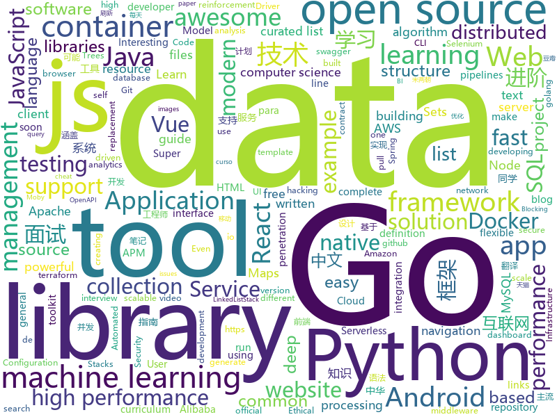

# 2019-07-25
See what the GitHub community is most excited about today.

## python
* [Algorithm_Interview_Notes-Chinese](https://github.com/imhuay/Algorithm_Interview_Notes-Chinese)(**183 stars today**): 2018/2019/校招/春招/秋招/算法/机器学习(Machine Learning)/深度学习(Deep Learning)/自然语言处理(NLP)/C/C++/Python/面试笔记
* [APT_REPORT](https://github.com/blackorbird/APT_REPORT)(**43 stars today**): Interesting apt report collection and some special ioc express
* [chinese-poetry](https://github.com/chinese-poetry/chinese-poetry)(**434 stars today**): 最全中华古诗词数据库, 唐宋两朝近一万四千古诗人, 接近5.5万首唐诗加26万宋诗. 两宋时期1564位词人，21050首词。
* [code_snippets](https://github.com/CoreyMSchafer/code_snippets)(**24 stars today**): 
* [auto-sklearn](https://github.com/automl/auto-sklearn)(**18 stars today**): Automated Machine Learning with scikit-learn
* [algorithms](https://github.com/keon/algorithms)(**15 stars today**): Minimal examples of data structures and algorithms in Python
* [scikit-learn](https://github.com/scikit-learn/scikit-learn)(**28 stars today**): scikit-learn: machine learning in Python
* [byteps](https://github.com/bytedance/byteps)(**5 stars today**): A high performance and general PS framework for distributed training
* [gym](https://github.com/openai/gym)(**22 stars today**): A toolkit for developing and comparing reinforcement learning algorithms.
* [python](https://github.com/kubernetes-client/python)(**4 stars today**): Official Python client library for kubernetes
* [learn-python3](https://github.com/michaelliao/learn-python3)(**11 stars today**): Learn Python 3 Sample Code
* [baselines](https://github.com/openai/baselines)(**14 stars today**): OpenAI Baselines: high-quality implementations of reinforcement learning algorithms
* [models](https://github.com/tensorflow/models)(**58 stars today**): Models and examples built with TensorFlow
* [kedro](https://github.com/quantumblacklabs/kedro)(**8 stars today**): A Python library for building robust production-ready data and analytics pipelines.
* [serverless-application-model](https://github.com/awslabs/serverless-application-model)(**5 stars today**): AWS Serverless Application Model (SAM) is an open-source framework for building serverless applications
* [awesome-aws](https://github.com/donnemartin/awesome-aws)(**5 stars today**): A curated list of awesome Amazon Web Services (AWS) libraries, open source repos, guides, blogs, and other resources. Featuring the Fiery Meter of AWSome.
* [pysc2](https://github.com/deepmind/pysc2)(**27 stars today**): StarCraft II Learning Environment
* [tpot](https://github.com/EpistasisLab/tpot)(**21 stars today**): A Python Automated Machine Learning tool that optimizes machine learning pipelines using genetic programming.
* [darts](https://github.com/quark0/darts)(**10 stars today**): Differentiable architecture search for convolutional and recurrent networks
* [examples-of-web-crawlers](https://github.com/shengqiangzhang/examples-of-web-crawlers)(**27 stars today**): 一些有趣的python爬虫例子,对新手比较友好,主要爬取淘宝、天猫、微信、豆瓣、QQ等网站。
* [RustPython](https://github.com/RustPython/RustPython)(**7 stars today**): A Python Interpreter written in Rust
* [compose](https://github.com/docker/compose)(**27 stars today**): Define and run multi-container applications with Docker
* [Learning-to-See-in-the-Dark](https://github.com/cchen156/Learning-to-See-in-the-Dark)(**10 stars today**): Learning to See in the Dark. CVPR 2018
* [redash](https://github.com/getredash/redash)(**21 stars today**): Make Your Company Data Driven. Connect to any data source, easily visualize, dashboard and share your data.

## java
* [miaosha](https://github.com/qiurunze123/miaosha)(**219 stars today**): ⭐⭐⭐⭐秒杀系统设计与实现.互联网工程师进阶与分析🙋🐓
* [advanced-java](https://github.com/doocs/advanced-java)(**329 stars today**): 😮互联网 Java 工程师进阶知识完全扫盲：涵盖高并发、分布式、高可用、微服务等领域知识，后端同学必看，前端同学也可学习
* [rocketmq](https://github.com/apache/rocketmq)(**16 stars today**): Mirror of Apache RocketMQ
* [CS-Notes](https://github.com/CyC2018/CS-Notes)(**132 stars today**): 📚Tech Interview Guide 技术面试必备基础知识、Leetcode 题解、Java、C++、Python、后端面试、操作系统、计算机网络、系统设计
* [skywalking](https://github.com/apache/skywalking)(**33 stars today**): APM, Application Performance Monitoring System
* [spring-cloud-kubernetes](https://github.com/spring-cloud/spring-cloud-kubernetes)(**11 stars today**): Kubernetes integration with Spring Cloud Discovery Client, Configuration, etc...
* [eureka](https://github.com/Netflix/eureka)(**10 stars today**): AWS Service registry for resilient mid-tier load balancing and failover.
* [SmartSwipe](https://github.com/luckybilly/SmartSwipe)(**20 stars today**): An android library to make swipe more easier and more powerful. https://luckybilly.github.io/SmartSwipe-tutorial/
* [spring-cloud-alibaba](https://github.com/alibaba/spring-cloud-alibaba)(**36 stars today**): Spring Cloud Alibaba provides a one-stop solution for application development for the distributed solutions of Alibaba middleware.
* [material-components-android](https://github.com/material-components/material-components-android)(**8 stars today**): Modular and customizable Material Design UI components for Android
* [mall-learning](https://github.com/macrozheng/mall-learning)(**43 stars today**): mall学习教程，架构、业务、技术要点全方位解析。mall项目（18k+star）是一套电商系统，使用现阶段主流技术实现。 涵盖了SpringBoot2.1.3、MyBatis3.4.6、Elasticsearch6.2.2、RabbitMQ3.7.15、Redis3.2、Mongodb3.2、Mysql5.7等技术，采用Docker容器化部署。
* [AndroidUtilCode](https://github.com/Blankj/AndroidUtilCode)(**30 stars today**): 🔥Android developers should collect the following utils(updating).
* [ananas-desktop](https://github.com/ananas-analytics/ananas-desktop)(**9 stars today**): A hackable data integration & analysis tool to enable non technical users to edit data processing jobs and visualise data on demand.
* [poli](https://github.com/shzlw/poli)(**109 stars today**): An easy-to-use BI server built for SQL lovers. Power data analysis in SQL and gain faster business insights.
* [pinpoint](https://github.com/naver/pinpoint)(**10 stars today**): APM, (Application Performance Management) tool for large-scale distributed systems written in Java.
* [testcontainers-java](https://github.com/testcontainers/testcontainers-java)(**5 stars today**): Testcontainers is a Java library that supports JUnit tests, providing lightweight, throwaway instances of common databases, Selenium web browsers, or anything else that can run in a Docker container.
* [react-native-navigation](https://github.com/wix/react-native-navigation)(**14 stars today**): A complete native navigation solution for React Native
* [Shadow](https://github.com/Tencent/Shadow)(**23 stars today**): 零反射全动态Android插件框架
* [zalenium](https://github.com/zalando/zalenium)(**6 stars today**): A flexible and scalable container based Selenium Grid with video recording, live preview, basic auth & dashboard.
* [netbeans](https://github.com/apache/netbeans)(**4 stars today**): Apache NetBeans
* [antlr4](https://github.com/antlr/antlr4)(**4 stars today**): ANTLR (ANother Tool for Language Recognition) is a powerful parser generator for reading, processing, executing, or translating structured text or binary files.
* [mybatis-plus](https://github.com/baomidou/mybatis-plus)(**42 stars today**): An powerful enhanced toolkit of MyBatis for simplify development
* [reactor-core](https://github.com/reactor/reactor-core)(**3 stars today**): Non-Blocking Reactive Foundation for the JVM
* [caffeine](https://github.com/ben-manes/caffeine)(**8 stars today**): A high performance caching library for Java 8
* [CameraView](https://github.com/natario1/CameraView)(**26 stars today**): 📸A well documented, high-level Android interface that makes capturing pictures and videos easy, addressing all of the common issues and needs. Gestures, watermarks, frame processing, output of any size.

## unknown
* [PENTESTING-BIBLE](https://github.com/blaCCkHatHacEEkr/PENTESTING-BIBLE)(**179 stars today**): This repository was created and developed by Ammar Amer @cry__pto Only. Updates to this repository will continue to arrive until the number of links reaches 2000 links & 2000 pdf files at any time soon.Learn Ethical Hacking and penetration testing .hundreds of ethical hacking & penetration testing & red team & cyber security & computer science r…
* [coding-interview-university](https://github.com/jwasham/coding-interview-university)(**774 stars today**): A complete computer science study plan to become a software engineer.
* [industry-machine-learning](https://github.com/firmai/industry-machine-learning)(**141 stars today**): A curated list of applied machine learning and data science notebooks and libraries across different industries.
* [30-seconds-zh_CN](https://github.com/b3log/30-seconds-zh_CN)(**145 stars today**): 📙前端知识精选集，包含 HTML、CSS、JavaScript、React、Node、安全等方面，每天仅需 30 秒。
* [the-art-of-command-line](https://github.com/jlevy/the-art-of-command-line)(**189 stars today**): Master the command line, in one page
* [awesome-production-machine-learning](https://github.com/EthicalML/awesome-production-machine-learning)(**127 stars today**): A curated list of awesome open source libraries to deploy, monitor, version and scale your machine learning
* [weekly](https://github.com/ruanyf/weekly)(**157 stars today**): 科技爱好者周刊，每周五发布
* [developer-roadmap](https://github.com/kamranahmedse/developer-roadmap)(**64 stars today**): Roadmap to becoming a web developer in 2019
* [English-level-up-tips-for-Chinese](https://github.com/byoungd/English-level-up-tips-for-Chinese)(**78 stars today**): 可能是让你受益匪浅的英语进阶指南
* [today-i-learned](https://github.com/KieSun/today-i-learned)(**20 stars today**): 记录今天学了什么
* [Android-Daily-Interview](https://github.com/Moosphan/Android-Daily-Interview)(**5 stars today**): 每工作日更新一道 Android 面试题，小聚成河，大聚成江，共勉之～
* [technology_books](https://github.com/arpitjindal97/technology_books)(**66 stars today**): Premium eBook free for Geeks
* [document-style-guide](https://github.com/ruanyf/document-style-guide)(**25 stars today**): 中文技术文档的写作规范
* [CVE-2019-2107](https://github.com/marcinguy/CVE-2019-2107)(**26 stars today**): CVE-2019-2107
* [gold-miner](https://github.com/xitu/gold-miner)(**41 stars today**): 🥇掘金翻译计划，可能是世界最大最好的英译中技术社区，最懂读者和译者的翻译平台：
* [datasharing](https://github.com/jtleek/datasharing)(**5 stars today**): The Leek group guide to data sharing
* [awesome](https://github.com/sindresorhus/awesome)(**80 stars today**): 😎Awesome lists about all kinds of interesting topics
* [awesome-semantic-segmentation](https://github.com/mrgloom/awesome-semantic-segmentation)(**17 stars today**): 🤘awesome-semantic-segmentation
* [open-source-cs](https://github.com/ForrestKnight/open-source-cs)(**8 stars today**): Video discussing this curriculum:
* [Awesome-Interview](https://github.com/Awesome-Interview/Awesome-Interview)(**27 stars today**): Collection of awesome interview references.
* [deep_learning_object_detection](https://github.com/hoya012/deep_learning_object_detection)(**11 stars today**): A paper list of object detection using deep learning.
* [vid](https://github.com/vlang/vid)(**3 stars today**): Open-source editor written in V with the performance of Sublime Text
* [story-huawei-north-korea](https://github.com/washingtonpost/story-huawei-north-korea)(**0 stars today**): 
* [computer-science](https://github.com/ossu/computer-science)(**30 stars today**): 🎓Path to a free self-taught education in Computer Science!
* [post-mortems](https://github.com/danluu/post-mortems)(**12 stars today**): A collection of postmortems. Sorry for the delay in merging PRs!

## javascript
* [cube.js](https://github.com/cube-js/cube.js)(**324 stars today**): 📊Cube.js - Open Source Analytics Framework
* [puppeteer](https://github.com/GoogleChrome/puppeteer)(**95 stars today**): Headless Chrome Node API
* [WebGL-Fluid-Simulation](https://github.com/PavelDoGreat/WebGL-Fluid-Simulation)(**42 stars today**): Play with fluids in your browser (works even on mobile)
* [nuxt.js](https://github.com/nuxt/nuxt.js)(**33 stars today**): The Vue.js Framework
* [taro-ui](https://github.com/NervJS/taro-ui)(**7 stars today**): 一款基于 Taro 框架开发的多端 UI 组件库
* [dash](https://github.com/plotly/dash)(**20 stars today**): Analytical Web Apps for Python. No JavaScript Required.
* [Front-End-Checklist](https://github.com/thedaviddias/Front-End-Checklist)(**93 stars today**): 🗂The perfect Front-End Checklist for modern websites and meticulous developers
* [openzeppelin-contracts](https://github.com/OpenZeppelin/openzeppelin-contracts)(**2 stars today**): OpenZeppelin Contracts is a library for secure smart contract development.
* [netron](https://github.com/lutzroeder/netron)(**48 stars today**): Visualizer for neural network, deep learning and machine learning models
* [js-xlsx](https://github.com/SheetJS/js-xlsx)(**26 stars today**): 📗SheetJS Community Edition -- Spreadsheet Toolkit
* [pomelo](https://github.com/NetEase/pomelo)(**5 stars today**): A fast,scalable,distributed game server framework for Node.js.
* [select2](https://github.com/select2/select2)(**8 stars today**): Select2 is a jQuery based replacement for select boxes. It supports searching, remote data sets, and infinite scrolling of results.
* [react-navigation](https://github.com/react-navigation/react-navigation)(**22 stars today**): Routing and navigation for your React Native apps
* [task-slice](https://github.com/nextdoorUncleLiu/task-slice)(**8 stars today**): 一个用来做性能优化的工具
* [uform](https://github.com/alibaba/uform)(**9 stars today**): ⚡React High Performance Form Solution For Enterprise.
* [video-maker](https://github.com/filipedeschamps/video-maker)(**3 stars today**): Projeto open source para fazer vídeos automatizados
* [openlayers](https://github.com/openlayers/openlayers)(**6 stars today**): OpenLayers
* [freeCodeCamp](https://github.com/freeCodeCamp/freeCodeCamp)(**34 stars today**): The https://www.freeCodeCamp.org open source codebase and curriculum. Learn to code for free together with millions of people.
* [react-native](https://github.com/facebook/react-native)(**37 stars today**): A framework for building native apps with React.
* [mpvue](https://github.com/Meituan-Dianping/mpvue)(**19 stars today**): 基于 Vue.js 的小程序开发框架，从底层支持 Vue.js 语法和构建工具体系。
* [redux-thunk](https://github.com/reduxjs/redux-thunk)(**15 stars today**): Thunk middleware for Redux
* [cesium](https://github.com/AnalyticalGraphicsInc/cesium)(**5 stars today**): An open-source JavaScript library for world-class 3D globes and maps🌎
* [highcharts](https://github.com/highcharts/highcharts)(**12 stars today**): Highcharts JS, the JavaScript charting framework
* [knex](https://github.com/tgriesser/knex)(**18 stars today**): A query builder for PostgreSQL, MySQL and SQLite3, designed to be flexible, portable, and fun to use.
* [gatsby](https://github.com/gatsbyjs/gatsby)(**42 stars today**): Build blazing fast, modern apps and websites with React

## html
* [sourcegraph](https://github.com/sourcegraph/sourcegraph)(**8 stars today**): Code search and navigation tool (self-hosted)
* [HiddenEye](https://github.com/DarkSecDevelopers/HiddenEye)(**7 stars today**): Modern Phishing Tool With Advanced Functionality [ Android-Support-Available ]
* [tools](https://github.com/googlecodelabs/tools)(**0 stars today**): Codelabs management & hosting tools
* [flutter-in-action](https://github.com/flutterchina/flutter-in-action)(**39 stars today**): 《Flutter实战》电子书
* [swagger-codegen](https://github.com/swagger-api/swagger-codegen)(**8 stars today**): swagger-codegen contains a template-driven engine to generate documentation, API clients and server stubs in different languages by parsing your OpenAPI / Swagger definition.
* [fastText](https://github.com/facebookresearch/fastText)(**11 stars today**): Library for fast text representation and classification.
* [portainer](https://github.com/portainer/portainer)(**4 stars today**): Making Docker management easy.
* [mescroll](https://github.com/mescroll/mescroll)(**5 stars today**): 精致的下拉刷新和上拉加载 js框架.支持vue,完美运行于移动端和主流PC浏览器 (JS framework for pull-refresh and pull-up-loading)
* [kubernetes-failure-stories](https://github.com/hjacobs/kubernetes-failure-stories)(**11 stars today**): Compilation of public failure/horror stories related to Kubernetes
* [cypress-example-kitchensink](https://github.com/cypress-io/cypress-example-kitchensink)(**1 stars today**): This is an example app used to showcase Cypress.io testing.
* [awesome-modern-cpp](https://github.com/rigtorp/awesome-modern-cpp)(**6 stars today**): A collection of resources on modern C++
* [boost](https://github.com/boostorg/boost)(**1 stars today**): Super-project for modularized Boost
* [computer-science-flash-cards](https://github.com/jwasham/computer-science-flash-cards)(**14 stars today**): Mini website for testing both general CS knowledge and enforce coding practice and common algorithm/data structure memorization.
* [Web-Security-Learning](https://github.com/CHYbeta/Web-Security-Learning)(**2 stars today**): Web-Security-Learning
* [EIPs](https://github.com/ethereum/EIPs)(**2 stars today**): The Ethereum Improvement Proposal repository
* [training-kit](https://github.com/github/training-kit)(**0 stars today**): Open source cheat sheets for Git and GitHub
* [SuperTinyIcons](https://github.com/edent/SuperTinyIcons)(**81 stars today**): Under 1KB each! Super Tiny Icons are miniscule SVG versions of your favourite website and app logos
* [JavaScript30](https://github.com/wesbos/JavaScript30)(**9 stars today**): 30 Day Vanilla JS Challenge
* [Java-Interview-Advanced](https://github.com/shishan100/Java-Interview-Advanced)(**16 stars today**): 中华石杉--互联网Java进阶面试训练营
* [500LineorLess_CN](https://github.com/HT524/500LineorLess_CN)(**22 stars today**): 500 line or less 中文翻译计划。
* [Cerberus](https://github.com/TedGoas/Cerberus)(**1 stars today**): A few simple, but solid patterns for responsive HTML email templates and newsletters. Even in Outlook and Gmail.
* [hyperblog](https://github.com/freddier/hyperblog)(**4 stars today**): Un blog increíble para el curso de Git y Github de Platzi
* [embeddedsw](https://github.com/Xilinx/embeddedsw)(**1 stars today**): Xilinx Embedded Software (embeddedsw) Development
* [web-moderno](https://github.com/cod3rcursos/web-moderno)(**3 stars today**): 
* [html](https://github.com/whatwg/html)(**4 stars today**): HTML Standard

## go
* [v](https://github.com/vlang/v)(**110 stars today**): Simple, fast, safe, compiled language for developing maintainable software. Supports translation from C and (soon) C++. Compiles itself in <1s.
* [packer](https://github.com/hashicorp/packer)(**37 stars today**): Packer is a tool for creating identical machine images for multiple platforms from a single source configuration.
* [vault](https://github.com/hashicorp/vault)(**22 stars today**): A tool for secrets management, encryption as a service, and privileged access management
* [rook](https://github.com/rook/rook)(**32 stars today**): Storage Orchestration for Kubernetes
* [sarama](https://github.com/Shopify/sarama)(**5 stars today**): Sarama is a Go library for Apache Kafka 0.8, and up.
* [go](https://github.com/json-iterator/go)(**15 stars today**): A high-performance 100% compatible drop-in replacement of "encoding/json"
* [terraformer](https://github.com/GoogleCloudPlatform/terraformer)(**13 stars today**): CLI tool to generate terraform files from existing infrastructure (reverse Terraform). Infrastructure to Code
* [code](https://github.com/goinaction/code)(**2 stars today**): Source Code for Go In Action examples
* [the-way-to-go_ZH_CN](https://github.com/unknwon/the-way-to-go_ZH_CN)(**34 stars today**): 《The Way to Go》中文译本，中文正式名《Go 入门指南》
* [eksctl](https://github.com/weaveworks/eksctl)(**4 stars today**): The official CLI for Amazon EKS
* [docker-ce](https://github.com/docker/docker-ce)(**13 stars today**): Docker CE
* [cert-manager](https://github.com/jetstack/cert-manager)(**18 stars today**): Automatically provision and manage TLS certificates in Kubernetes
* [golang](https://github.com/overnote/golang)(**30 stars today**): （进度：70% ）Golang笔记：语法，并发思想，web开发，Go微服务相关
* [gocui](https://github.com/jroimartin/gocui)(**13 stars today**): Minimalist Go package aimed at creating Console User Interfaces.
* [moby](https://github.com/moby/moby)(**24 stars today**): Moby Project - a collaborative project for the container ecosystem to assemble container-based systems
* [client_golang](https://github.com/prometheus/client_golang)(**5 stars today**): Prometheus instrumentation library for Go applications
* [istio](https://github.com/istio/istio)(**21 stars today**): Connect, secure, control, and observe services.
* [squirrel](https://github.com/Masterminds/squirrel)(**7 stars today**): Fluent SQL generation for golang
* [api](https://github.com/istio/api)(**2 stars today**): API definitions for the Istio project
* [gods](https://github.com/emirpasic/gods)(**11 stars today**): GoDS (Go Data Structures). Containers (Sets, Lists, Stacks, Maps, Trees), Sets (HashSet, TreeSet, LinkedHashSet), Lists (ArrayList, SinglyLinkedList, DoublyLinkedList), Stacks (LinkedListStack, ArrayStack), Maps (HashMap, TreeMap, HashBidiMap, TreeBidiMap, LinkedHashMap), Trees (RedBlackTree, AVLTree, BTree, BinaryHeap), Comparators, Iterators, …
* [cadvisor](https://github.com/google/cadvisor)(**8 stars today**): Analyzes resource usage and performance characteristics of running containers.
* [mysql](https://github.com/go-sql-driver/mysql)(**8 stars today**): Go MySQL Driver is a MySQL driver for Go's (golang) database/sql package
* [minishift](https://github.com/minishift/minishift)(**1 stars today**): Run OpenShift 3.x locally
* [cli](https://github.com/docker/cli)(**6 stars today**): The Docker CLI
* [kubernetes](https://github.com/kubernetes/kubernetes)(**52 stars today**): Production-Grade Container Scheduling and Management

## WordCloud

