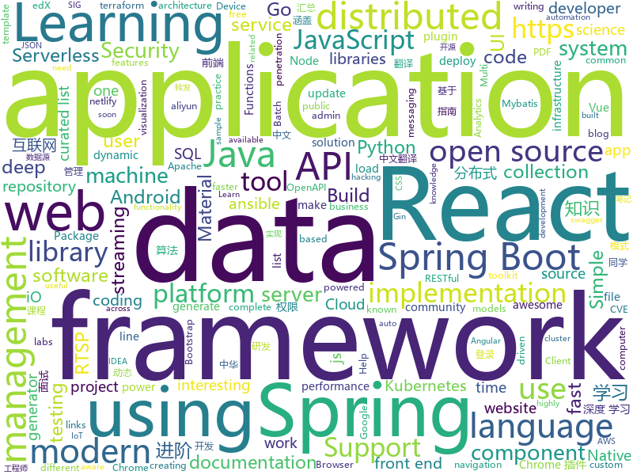

# 2019-07-26
See what the GitHub community is most excited about today.

## python
* [mmaction](https://github.com/open-mmlab/mmaction)(**19 stars today**): 
* [chinese-poetry](https://github.com/chinese-poetry/chinese-poetry)(**357 stars today**): 最全中华古诗词数据库, 唐宋两朝近一万四千古诗人, 接近5.5万首唐诗加26万宋诗. 两宋时期1564位词人，21050首词。
* [wtfpython-cn](https://github.com/leisurelicht/wtfpython-cn)(**72 stars today**): wtfpython的中文翻译/施工结束/ 能力有限，欢迎帮我改进翻译
* [bluekeep](https://github.com/0xeb-bp/bluekeep)(**36 stars today**): Public work for CVE-2019-0708
* [Algorithm_Interview_Notes-Chinese](https://github.com/imhuay/Algorithm_Interview_Notes-Chinese)(**129 stars today**): 2018/2019/校招/春招/秋招/算法/机器学习(Machine Learning)/深度学习(Deep Learning)/自然语言处理(NLP)/C/C++/Python/面试笔记
* [programming-talks](https://github.com/hellerve/programming-talks)(**69 stars today**): Awesome & interesting talks about programming
* [ChromeAppHeroes](https://github.com/zhaoolee/ChromeAppHeroes)(**26 stars today**): 🌈谷粒-Chrome插件英雄榜, 为优秀的Chrome插件写一本中文说明书, 让Chrome插件英雄们造福人类~ ChromePluginHeroes, Write a Chinese manual for the excellent Chrome plugin, let the Chrome plugin heroes benefit the human~
* [wtfpython](https://github.com/satwikkansal/wtfpython)(**21 stars today**): A collection of surprising Python snippets and lesser-known features.
* [APT_REPORT](https://github.com/blackorbird/APT_REPORT)(**27 stars today**): Interesting apt report collection and some special ioc express
* [tensor2tensor](https://github.com/tensorflow/tensor2tensor)(**8 stars today**): Library of deep learning models and datasets designed to make deep learning more accessible and accelerate ML research.
* [jupyterhub](https://github.com/jupyterhub/jupyterhub)(**7 stars today**): Multi-user server for Jupyter notebooks
* [pysc2](https://github.com/deepmind/pysc2)(**24 stars today**): StarCraft II Learning Environment
* [airflow](https://github.com/apache/airflow)(**17 stars today**): Apache Airflow
* [algo](https://github.com/wangzheng0822/algo)(**22 stars today**): 数据结构和算法必知必会的50个代码实现
* [edx-platform](https://github.com/edx/edx-platform)(**0 stars today**): The Open edX platform, the software that powers edX!
* [numba](https://github.com/numba/numba)(**10 stars today**): NumPy aware dynamic Python compiler using LLVM
* [troposphere](https://github.com/cloudtools/troposphere)(**6 stars today**): troposphere - Python library to create AWS CloudFormation descriptions
* [awesome-scala](https://github.com/lauris/awesome-scala)(**4 stars today**): A community driven list of useful Scala libraries, frameworks and software.
* [addons](https://github.com/tensorflow/addons)(**7 stars today**): Useful extra functionality for TensorFlow 2.0 maintained by SIG-addons
* [OpenKE](https://github.com/thunlp/OpenKE)(**5 stars today**): An Open-Source Package for Knowledge Embedding (KE)
* [ansible](https://github.com/ansible/ansible)(**22 stars today**): Ansible is a radically simple IT automation platform that makes your applications and systems easier to deploy. Avoid writing scripts or custom code to deploy and update your applications — automate in a language that approaches plain English, using SSH, with no agents to install on remote systems. https://docs.ansible.com/ansible/
* [gpytorch](https://github.com/cornellius-gp/gpytorch)(**1 stars today**): A highly efficient and modular implementation of Gaussian Processes in PyTorch
* [wagtail](https://github.com/wagtail/wagtail)(**4 stars today**): A Django content management system focused on flexibility and user experience
* [keras-rl](https://github.com/keras-rl/keras-rl)(**6 stars today**): Deep Reinforcement Learning for Keras.
* [simpledet](https://github.com/TuSimple/simpledet)(**7 stars today**): A Simple and Versatile Framework for Object Detection and Instance Recognition

## java
* [poli](https://github.com/shzlw/poli)(**89 stars today**): An easy-to-use BI server built for SQL lovers. Power data analysis in SQL and gain faster business insights.
* [advanced-java](https://github.com/doocs/advanced-java)(**281 stars today**): 😮互联网 Java 工程师进阶知识完全扫盲：涵盖高并发、分布式、高可用、微服务等领域知识，后端同学必看，前端同学也可学习
* [miaosha](https://github.com/qiurunze123/miaosha)(**135 stars today**): ⭐⭐⭐⭐秒杀系统设计与实现.互联网工程师进阶与分析🙋🐓
* [x-boot](https://github.com/Exrick/x-boot)(**24 stars today**): 基于Spring Boot 2.x的前后端分离开发平台X-Boot 前端：Vue+iView Admin 后端：Spring Boot 2.x/Spring Security/JWT/Spring Data JPA+Mybatis-Plus/Redis/Elasticsearch/Activiti 分布式限流/同步锁/验证码/SnowFlake雪花算法ID生成 动态权限管理 数据权限 工作流 代码生成 日志记录 定时任务 第三方社交账号、短信登录 单点登录
* [spring-security](https://github.com/spring-projects/spring-security)(**3 stars today**): Spring Security
* [kylin](https://github.com/apache/kylin)(**8 stars today**): Apache Kylin
* [pulsar](https://github.com/apache/pulsar)(**12 stars today**): Apache Pulsar - distributed pub-sub messaging system
* [QMUI_Android](https://github.com/Tencent/QMUI_Android)(**20 stars today**): 提高 Android UI 开发效率的 UI 库
* [p3c](https://github.com/alibaba/p3c)(**34 stars today**): Alibaba Java Coding Guidelines pmd implements and IDE plugin
* [react-native-navigation](https://github.com/wix/react-native-navigation)(**3 stars today**): A complete native navigation solution for React Native
* [spring-batch](https://github.com/spring-projects/spring-batch)(**3 stars today**): Spring Batch is a framework for writing offline and batch applications using Spring and Java
* [jackson-databind](https://github.com/FasterXML/jackson-databind)(**5 stars today**): General data-binding package for Jackson (2.x): works on streaming API (core) implementation(s)
* [fastjson](https://github.com/alibaba/fastjson)(**20 stars today**): 🚄A fast JSON parser/generator for Java. (Aliyun Data Lake Analytics https://www.aliyun.com/product/datalakeanalytics powered by fastjson )
* [DoraemonKit](https://github.com/didi/DoraemonKit)(**41 stars today**): 简称 "DoKit" 。一款功能齐全的客户端（ iOS 、Android ）研发助手，你值得拥有。
* [mybatis-plus](https://github.com/baomidou/mybatis-plus)(**24 stars today**): An powerful enhanced toolkit of MyBatis for simplify development
* [JavaGuide](https://github.com/Snailclimb/JavaGuide)(**160 stars today**): 【Java学习+面试指南】 一份涵盖大部分Java程序员所需要掌握的核心知识。
* [dynamic-datasource-spring-boot-starter](https://github.com/baomidou/dynamic-datasource-spring-boot-starter)(**11 stars today**): dynamic datasource for springboot 多数据源 动态数据源
* [thingsboard](https://github.com/thingsboard/thingsboard)(**7 stars today**): Open-source IoT Platform - Device management, data collection, processing and visualization.
* [AndroidUtilCode](https://github.com/Blankj/AndroidUtilCode)(**21 stars today**): 🔥Android developers should collect the following utils(updating).
* [APIJSON](https://github.com/APIJSON/APIJSON)(**8 stars today**): 🏆Gitee Most Valuable Project🚀A JSON Transmission Protocol and an ORM Library for auto providing APIs and Documents.
* [SpringAll](https://github.com/wuyouzhuguli/SpringAll)(**111 stars today**): 循序渐进，学习Spring Boot、Spring Boot & Shiro、Spring Cloud、Spring Security & Spring Security OAuth2，博客Spring系列源码
* [hadoop](https://github.com/apache/hadoop)(**10 stars today**): Apache Hadoop
* [mybatis-3](https://github.com/mybatis/mybatis-3)(**15 stars today**): MyBatis SQL mapper framework for Java
* [react-native-camera](https://github.com/react-native-community/react-native-camera)(**2 stars today**): A Camera component for React Native. Also supports barcode scanning!
* [FEBS-Shiro](https://github.com/wuyouzhuguli/FEBS-Shiro)(**23 stars today**): Spring Boot 2.1.3，Shiro1.4.0 & Layui 2.5.4 权限管理系统。预览地址：http://49.234.20.223:8080/login

## unknown
* [technology_books](https://github.com/arpitjindal97/technology_books)(**77 stars today**): Premium eBook free for Geeks
* [the-art-of-command-line](https://github.com/jlevy/the-art-of-command-line)(**187 stars today**): Master the command line, in one page
* [coding-interview-university](https://github.com/jwasham/coding-interview-university)(**366 stars today**): A complete computer science study plan to become a software engineer.
* [PENTESTING-BIBLE](https://github.com/blaCCkHatHacEEkr/PENTESTING-BIBLE)(**235 stars today**): This repository was created and developed by Ammar Amer @cry__pto Only. Updates to this repository will continue to arrive until the number of links reaches 2000 links & 2000 pdf files at any time soon.Learn Ethical Hacking and penetration testing .hundreds of ethical hacking & penetration testing & red team & cyber security & computer science r…
* [English-level-up-tips-for-Chinese](https://github.com/byoungd/English-level-up-tips-for-Chinese)(**111 stars today**): 可能是让你受益匪浅的英语进阶指南
* [awesome-production-machine-learning](https://github.com/EthicalML/awesome-production-machine-learning)(**56 stars today**): A curated list of awesome open source libraries to deploy, monitor, version and scale your machine learning
* [AMD_Vanilla](https://github.com/AMD-OSX/AMD_Vanilla)(**10 stars today**): Native AMD macOS via Clover KernelToPatch
* [30-seconds-zh_CN](https://github.com/b3log/30-seconds-zh_CN)(**71 stars today**): 📙前端知识精选集，包含 HTML、CSS、JavaScript、React、Node、安全等方面，每天仅需 30 秒。
* [flink-training-course](https://github.com/flink-china/flink-training-course)(**34 stars today**): Flink 中文视频课程（持续更新...）
* [industry-machine-learning](https://github.com/firmai/industry-machine-learning)(**138 stars today**): A curated list of applied machine learning and data science notebooks and libraries across different industries.
* [OI-wiki](https://github.com/OI-wiki/OI-wiki)(**19 stars today**): 🌟Wiki for OI / ICPC. （某大型游戏线上攻略，内含炫酷算术魔法）
* [book](https://github.com/songhuiqing/book)(**12 stars today**): 个人认为对技术提升很不错的书
* [CVE-2019-2107](https://github.com/marcinguy/CVE-2019-2107)(**25 stars today**): CVE-2019-2107
* [hosts](https://github.com/googlehosts/hosts)(**31 stars today**): 镜像：https://coding.net/u/scaffrey/p/hosts/git
* [iccv2019](https://github.com/extreme-assistant/iccv2019)(**90 stars today**): ICCV 2019 papers/new汇总帖，极市团队整理
* [binance-official-api-docs](https://github.com/binance-exchange/binance-official-api-docs)(**4 stars today**): Official Documentation for the Binance APIs and Streams
* [weekly](https://github.com/ruanyf/weekly)(**52 stars today**): 科技爱好者周刊，每周五发布
* [intellij-community](https://github.com/JetBrains/intellij-community)(**9 stars today**): IntelliJ IDEA Community Edition
* [datasharing](https://github.com/jtleek/datasharing)(**3 stars today**): The Leek group guide to data sharing
* [public](https://github.com/openconfig/public)(**1 stars today**): Repository for publishing OpenConfig models, documentation, and other material for the community.
* [first-contributions](https://github.com/firstcontributions/first-contributions)(**6 stars today**): 🚀✨Help beginners to contribute to open source projects
* [ios-good-practices](https://github.com/futurice/ios-good-practices)(**5 stars today**): Good ideas for iOS development, by Futurice developers.
* [awesome-github-wechat-weapp](https://github.com/opendigg/awesome-github-wechat-weapp)(**8 stars today**): 微信小程序开源项目库汇总
* [OpenAPI-Specification](https://github.com/OAI/OpenAPI-Specification)(**16 stars today**): The OpenAPI Specification Repository
* [The-Flask-Mega-Tutorial-zh](https://github.com/luhuisicnu/The-Flask-Mega-Tutorial-zh)(**9 stars today**): 翻译自Miguel Grinberg的blog https://blog.miguelgrinberg.com 的2017年新版The Flask Mega-Tutorial教程

## javascript
* [cube.js](https://github.com/cube-js/cube.js)(**225 stars today**): 📊Cube.js - Open Source Analytics Framework
* [Front-End-Checklist](https://github.com/thedaviddias/Front-End-Checklist)(**97 stars today**): 🗂The perfect Front-End Checklist for modern websites and meticulous developers
* [500lines](https://github.com/aosabook/500lines)(**52 stars today**): 500 Lines or Less
* [generator-jhipster](https://github.com/jhipster/generator-jhipster)(**11 stars today**): Open Source application generator for creating Spring Boot + Angular/React projects in seconds!
* [site-kit-wp](https://github.com/google/site-kit-wp)(**8 stars today**): Site Kit is a one-stop solution for WordPress users to use everything Google has to offer to make them successful on the web.
* [33-js-concepts](https://github.com/leonardomso/33-js-concepts)(**23 stars today**): 📜33 concepts every JavaScript developer should know.
* [franz](https://github.com/meetfranz/franz)(**9 stars today**): Franz is a free messaging app for services like WhatsApp, Slack, Messenger and many more.
* [gatsby](https://github.com/gatsbyjs/gatsby)(**33 stars today**): Build blazing fast, modern apps and websites with React
* [aws-serverless-workshops](https://github.com/aws-samples/aws-serverless-workshops)(**6 stars today**): Code and walkthrough labs to set up serverless applications for Wild Rydes workshops
* [socket.io](https://github.com/socketio/socket.io)(**17 stars today**): Realtime application framework (Node.JS server)
* [bootstrap-vue](https://github.com/bootstrap-vue/bootstrap-vue)(**11 stars today**): BootstrapVue, with over 40 plugins and more than 75 custom components, provides one of the most comprehensive implementations of Bootstrap v4 components and grid system for Vue.js. With extensive and automated WAI-ARIA accessibility markup.
* [renovate](https://github.com/renovatebot/renovate)(**7 stars today**): Multi-language dependency update automation. Flexible, so you don't need to be.
* [functions-samples](https://github.com/firebase/functions-samples)(**8 stars today**): Collection of sample apps showcasing popular use cases using Cloud Functions for Firebase
* [Sortable](https://github.com/SortableJS/Sortable)(**22 stars today**): Sortable — is a JavaScript library for reorderable drag-and-drop lists on modern browsers and touch devices. No jQuery required. Supports Meteor, AngularJS, React, Polymer, Vue, Ember, Knockout and any CSS library, e.g. Bootstrap.
* [jsPDF](https://github.com/MrRio/jsPDF)(**21 stars today**): Client-side JavaScript PDF generation for everyone.
* [fiora](https://github.com/yinxin630/fiora)(**28 stars today**): An interesting chat application power by socket.io, koa, mongodb and react
* [easy-mock](https://github.com/easy-mock/easy-mock)(**6 stars today**): A persistent service that generates mock data quickly and provids visualization view.
* [incubator-superset](https://github.com/apache/incubator-superset)(**19 stars today**): Apache Superset (incubating) is a modern, enterprise-ready business intelligence web application
* [react-select](https://github.com/JedWatson/react-select)(**21 stars today**): The Select Component for React.js
* [material-table](https://github.com/mbrn/material-table)(**4 stars today**): Datatable for React based on material-ui's table with additional features
* [react-navigation](https://github.com/react-navigation/react-navigation)(**15 stars today**): Routing and navigation for your React Native apps
* [material-components-web](https://github.com/material-components/material-components-web)(**8 stars today**): Modular and customizable Material Design UI components for the web
* [zws](https://github.com/zws-im/zws)(**31 stars today**): Shorten URLs using invisible spaces.
* [serverless](https://github.com/serverless/serverless)(**20 stars today**): Serverless Framework – Build web, mobile and IoT applications with serverless architectures using AWS Lambda, Azure Functions, Google CloudFunctions & more! –
* [How-To-Ask-Questions-The-Smart-Way](https://github.com/ryanhanwu/How-To-Ask-Questions-The-Smart-Way)(**20 stars today**): 本文原文由知名 Hacker Eric S. Raymond 所撰寫，教你如何正確的提出技術問題並獲得你滿意的答案。

## html
* [proposal-nullish-coalescing](https://github.com/tc39/proposal-nullish-coalescing)(**35 stars today**): Nullish coalescing proposal x ?? y
* [proposal-optional-chaining](https://github.com/tc39/proposal-optional-chaining)(**117 stars today**): 
* [en.javascript.info](https://github.com/javascript-tutorial/en.javascript.info)(**7 stars today**): Modern JavaScript Tutorial
* [fastText](https://github.com/facebookresearch/fastText)(**8 stars today**): Library for fast text representation and classification.
* [kubernetes-failure-stories](https://github.com/hjacobs/kubernetes-failure-stories)(**10 stars today**): Compilation of public failure/horror stories related to Kubernetes
* [HiddenEye](https://github.com/DarkSecDevelopers/HiddenEye)(**12 stars today**): Modern Phishing Tool With Advanced Functionality [ Android-Support-Available ]
* [computer-science-flash-cards](https://github.com/jwasham/computer-science-flash-cards)(**6 stars today**): Mini website for testing both general CS knowledge and enforce coding practice and common algorithm/data structure memorization.
* [quickstart-js](https://github.com/firebase/quickstart-js)(**1 stars today**): Firebase Quickstart Samples for Web
* [awesome-angular](https://github.com/PatrickJS/awesome-angular)(**0 stars today**): 📄A curated list of awesome Angular resources
* [500LineorLess_CN](https://github.com/HT524/500LineorLess_CN)(**15 stars today**): 500 line or less 中文翻译计划。
* [docs](https://github.com/knative/docs)(**5 stars today**): User documentation for Knative components
* [aws-well-architected-labs](https://github.com/awslabs/aws-well-architected-labs)(**7 stars today**): Hands on labs and code to help you learn, measure, and build using architectural best practices.
* [swagger-codegen](https://github.com/swagger-api/swagger-codegen)(**10 stars today**): swagger-codegen contains a template-driven engine to generate documentation, API clients and server stubs in different languages by parsing your OpenAPI / Swagger definition.
* [WanderingD19](https://github.com/wanderingd19/WanderingD19)(**9 stars today**): 上海交通大学流浪东19事件
* [metasploitable3](https://github.com/rapid7/metasploitable3)(**3 stars today**): Metasploitable3 is a VM that is built from the ground up with a large amount of security vulnerabilities.
* [Java-Interview-Advanced](https://github.com/shishan100/Java-Interview-Advanced)(**7 stars today**): 中华石杉--互联网Java进阶面试训练营
* [Front-end-Developer-Interview-Questions](https://github.com/h5bp/Front-end-Developer-Interview-Questions)(**18 stars today**): A list of helpful front-end related questions you can use to interview potential candidates, test yourself or completely ignore.
* [glTF](https://github.com/KhronosGroup/glTF)(**2 stars today**): glTF – Runtime 3D Asset Delivery
* [proposal-decorators](https://github.com/tc39/proposal-decorators)(**3 stars today**): Decorators for ES6 classes
* [modern-resume-theme](https://github.com/sproogen/modern-resume-theme)(**0 stars today**): A modern static resume template and theme. Powered by Jekyll and GitHub pages.
* [phantomjs](https://github.com/ariya/phantomjs)(**5 stars today**): Scriptable Headless Browser
* [repo-badges](https://github.com/dwyl/repo-badges)(**0 stars today**): ⭐️Use repo badges (build passing, coverage, etc) in your readme/markdown file to signal code quality in a project.
* [nndl.github.io](https://github.com/nndl/nndl.github.io)(**12 stars today**): 《神经网络与深度学习》 Neural Network and Deep Learning
* [ng-alain](https://github.com/ng-alain/ng-alain)(**4 stars today**): NG-ZORRO admin panel front-end framework (netlify mirror https://netlify.ng-alain.com/)
* [deeplearning_ai_books](https://github.com/fengdu78/deeplearning_ai_books)(**18 stars today**): deeplearning.ai（吴恩达老师的深度学习课程笔记及资源）

## go
* [gotraining](https://github.com/ardanlabs/gotraining)(**142 stars today**): Go Training Class Material :
* [v](https://github.com/vlang/v)(**108 stars today**): Simple, fast, safe, compiled language for developing maintainable software. Supports translation from C and (soon) C++. Compiles itself in <1s.
* [gin](https://github.com/gin-gonic/gin)(**73 stars today**): Gin is a HTTP web framework written in Go (Golang). It features a Martini-like API with much better performance -- up to 40 times faster. If you need smashing performance, get yourself some Gin.
* [influxdb](https://github.com/influxdata/influxdb)(**55 stars today**): Scalable datastore for metrics, events, and real-time analytics
* [kruise](https://github.com/openkruise/kruise)(**11 stars today**): Automate application workloads management on Kubernetes
* [testify](https://github.com/stretchr/testify)(**14 stars today**): A toolkit with common assertions and mocks that plays nicely with the standard library
* [origin](https://github.com/openshift/origin)(**10 stars today**): The self-managing, auto-upgrading, Kubernetes distribution for everyone
* [tidb](https://github.com/pingcap/tidb)(**23 stars today**): TiDB is a distributed HTAP database compatible with the MySQL protocol
* [vault](https://github.com/hashicorp/vault)(**11 stars today**): A tool for secrets management, encryption as a service, and privileged access management
* [packer](https://github.com/hashicorp/packer)(**26 stars today**): Packer is a tool for creating identical machine images for multiple platforms from a single source configuration.
* [argo-cd](https://github.com/argoproj/argo-cd)(**16 stars today**): Declarative continuous deployment for Kubernetes.
* [hey](https://github.com/rakyll/hey)(**19 stars today**): HTTP load generator, ApacheBench (ab) replacement, formerly known as rakyll/boom
* [node_exporter](https://github.com/prometheus/node_exporter)(**4 stars today**): Exporter for machine metrics
* [vegeta](https://github.com/tsenart/vegeta)(**18 stars today**): HTTP load testing tool and library. It's over 9000!
* [cert-manager](https://github.com/jetstack/cert-manager)(**15 stars today**): Automatically provision and manage TLS certificates in Kubernetes
* [go-filecoin](https://github.com/filecoin-project/go-filecoin)(**8 stars today**): Filecoin Full Node Implementation in Go
* [jaeger](https://github.com/jaegertracing/jaeger)(**8 stars today**): CNCF Jaeger, a Distributed Tracing Platform
* [EasyDarwin](https://github.com/EasyDarwin/EasyDarwin)(**12 stars today**): open source、high performance、industrial rtsp streaming server,a lot of optimization on streaming relay,KeyFrame cache,RESTful,and web management,also EasyDarwin support distributed load balancing,a simple streaming media cloud platform architecture.高性能开源RTSP流媒体服务器，基于go语言研发，维护和优化：RTSP推模式转发、RTSP拉模式转发、录像、检索、回放、关键帧缓存、秒开画面、RESTful接口、WEB后台管理、分布式负载均衡，基…
* [grpc-go](https://github.com/grpc/grpc-go)(**14 stars today**): The Go language implementation of gRPC. HTTP/2 based RPC
* [cluster-api](https://github.com/kubernetes-sigs/cluster-api)(**2 stars today**): Home for the Cluster Management API work, a subproject of sig-cluster-lifecycle
* [istio](https://github.com/istio/istio)(**22 stars today**): Connect, secure, control, and observe services.
* [helm](https://github.com/helm/helm)(**23 stars today**): The Kubernetes Package Manager
* [consul](https://github.com/hashicorp/consul)(**23 stars today**): Consul is a distributed, highly available, and data center aware solution to connect and configure applications across dynamic, distributed infrastructure.
* [faas](https://github.com/openfaas/faas)(**15 stars today**): OpenFaaS - Serverless Functions Made Simple
* [terraformer](https://github.com/GoogleCloudPlatform/terraformer)(**10 stars today**): CLI tool to generate terraform files from existing infrastructure (reverse Terraform). Infrastructure to Code

## WordCloud

