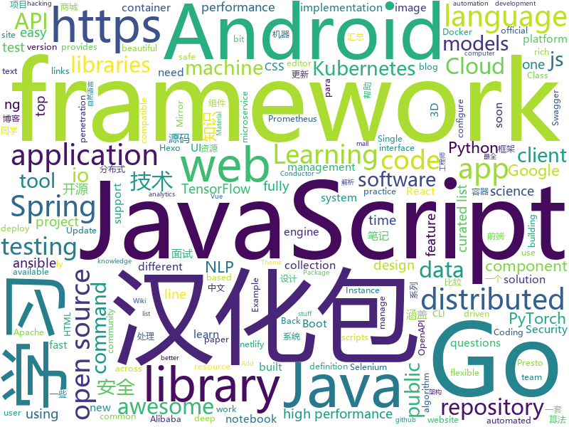

# 2019-07-27
See what the GitHub community is most excited about today.

## python
* [Algorithm_Interview_Notes-Chinese](https://github.com/imhuay/Algorithm_Interview_Notes-Chinese)(**72 stars today**): 2018/2019/校招/春招/秋招/算法/机器学习(Machine Learning)/深度学习(Deep Learning)/自然语言处理(NLP)/C/C++/Python/面试笔记
* [ludwig](https://github.com/uber/ludwig)(**33 stars today**): Ludwig is a toolbox built on top of TensorFlow that allows to train and test deep learning models without the need to write code.
* [azure-cli](https://github.com/Azure/azure-cli)(**1 stars today**): Command-line tools for Azure.
* [chinese-poetry](https://github.com/chinese-poetry/chinese-poetry)(**168 stars today**): 最全中华古诗词数据库, 唐宋两朝近一万四千古诗人, 接近5.5万首唐诗加26万宋诗. 两宋时期1564位词人，21050首词。
* [pytorch-image-models](https://github.com/rwightman/pytorch-image-models)(**22 stars today**): PyTorch image models, scripts, pretrained weights -- (SE)ResNet/ResNeXT, DPN, EfficientNet, MixNet, MobileNet-V3/V2/V1, MNASNet, Single-Path NAS, FBNet, and more
* [maskrcnn-benchmark](https://github.com/facebookresearch/maskrcnn-benchmark)(**4 stars today**): Fast, modular reference implementation of Instance Segmentation and Object Detection algorithms in PyTorch.
* [bluekeep](https://github.com/0xeb-bp/bluekeep)(**17 stars today**): Public work for CVE-2019-0708
* [localstack](https://github.com/localstack/localstack)(**18 stars today**): 💻A fully functional local AWS cloud stack. Develop and test your cloud & Serverless apps offline!
* [cheat.sh](https://github.com/chubin/cheat.sh)(**23 stars today**): the only cheat sheet you need
* [mmaction](https://github.com/open-mmlab/mmaction)(**7 stars today**): 
* [nuscenes-devkit](https://github.com/lyft/nuscenes-devkit)(**14 stars today**): Devkit for the public 2019 Lyft Level 5 AV Dataset (fork of https://github.com/nutonomy/nuscenes-devkit)
* [allennlp](https://github.com/allenai/allennlp)(**7 stars today**): An open-source NLP research library, built on PyTorch.
* [pysc2](https://github.com/deepmind/pysc2)(**22 stars today**): StarCraft II Learning Environment
* [fastapi](https://github.com/tiangolo/fastapi)(**28 stars today**): FastAPI framework, high performance, easy to learn, fast to code, ready for production
* [thefuck](https://github.com/nvbn/thefuck)(**30 stars today**): Magnificent app which corrects your previous console command.
* [bert](https://github.com/google-research/bert)(**29 stars today**): TensorFlow code and pre-trained models for BERT
* [Awesome-PyTorch-Chinese](https://github.com/INTERMT/Awesome-PyTorch-Chinese)(**19 stars today**): 【干货】史上最全的PyTorch学习资源汇总
* [blogger-cli](https://github.com/hemanta212/blogger-cli)(**30 stars today**): A cli tool to convert and manage jupyter notebook blogs. Proudly host your notebooks even as a static site.
* [spaCy](https://github.com/explosion/spaCy)(**11 stars today**): 💫Industrial-strength Natural Language Processing (NLP) with Python and Cython
* [gpt-2](https://github.com/openai/gpt-2)(**24 stars today**): Code for the paper "Language Models are Unsupervised Multitask Learners"
* [examples-of-web-crawlers](https://github.com/shengqiangzhang/examples-of-web-crawlers)(**13 stars today**): 一些有趣的python爬虫例子,对新手比较友好,主要爬取淘宝、天猫、微信、豆瓣、QQ等网站。
* [awesome-hand-pose-estimation](https://github.com/xinghaochen/awesome-hand-pose-estimation)(**6 stars today**): Awesome work on hand pose estimation/tracking
* [googleapis](https://github.com/googleapis/googleapis)(**4 stars today**): Public interface definitions of Google APIs.
* [ansible](https://github.com/ansible/ansible)(**20 stars today**): Ansible is a radically simple IT automation platform that makes your applications and systems easier to deploy. Avoid writing scripts or custom code to deploy and update your applications — automate in a language that approaches plain English, using SSH, with no agents to install on remote systems. https://docs.ansible.com/ansible/
* [keras-yolo3](https://github.com/qqwweee/keras-yolo3)(**9 stars today**): A Keras implementation of YOLOv3 (Tensorflow backend)

## java
* [advanced-java](https://github.com/doocs/advanced-java)(**143 stars today**): 😮互联网 Java 工程师进阶知识完全扫盲：涵盖高并发、分布式、高可用、微服务等领域知识，后端同学必看，前端同学也可学习
* [JavaGuide](https://github.com/Snailclimb/JavaGuide)(**116 stars today**): 【Java学习+面试指南】 一份涵盖大部分Java程序员所需要掌握的核心知识。
* [mall-learning](https://github.com/macrozheng/mall-learning)(**29 stars today**): mall学习教程，架构、业务、技术要点全方位解析。mall项目（18k+star）是一套电商系统，使用现阶段主流技术实现。 涵盖了SpringBoot2.1.3、MyBatis3.4.6、Elasticsearch6.2.2、RabbitMQ3.7.15、Redis3.2、Mongodb3.2、Mysql5.7等技术，采用Docker容器化部署。
* [spring-cloud-alibaba](https://github.com/alibaba/spring-cloud-alibaba)(**27 stars today**): Spring Cloud Alibaba provides a one-stop solution for application development for the distributed solutions of Alibaba middleware.
* [caffeine](https://github.com/ben-manes/caffeine)(**7 stars today**): A high performance caching library for Java 8
* [toBeTopJavaer](https://github.com/hollischuang/toBeTopJavaer)(**82 stars today**): To Be Top Javaer - Java工程师成神之路
* [skywalking](https://github.com/apache/skywalking)(**13 stars today**): APM, Application Performance Monitoring System
* [presto](https://github.com/prestosql/presto)(**1 stars today**): Official home of the community version of Presto, the distributed SQL query engine for big data, under the auspices of the Presto Software Foundation.
* [elasticsearch](https://github.com/elastic/elasticsearch)(**28 stars today**): Open Source, Distributed, RESTful Search Engine
* [lottie-android](https://github.com/airbnb/lottie-android)(**9 stars today**): Render After Effects animations natively on Android and iOS, Web, and React Native
* [testcontainers-java](https://github.com/testcontainers/testcontainers-java)(**3 stars today**): Testcontainers is a Java library that supports JUnit tests, providing lightweight, throwaway instances of common databases, Selenium web browsers, or anything else that can run in a Docker container.
* [ARouter](https://github.com/alibaba/ARouter)(**7 stars today**): 💪A framework for assisting in the renovation of Android componentization (帮助 Android App 进行组件化改造的路由框架)
* [zalenium](https://github.com/zalando/zalenium)(**5 stars today**): A flexible and scalable container based Selenium Grid with video recording, live preview, basic auth & dashboard.
* [tink](https://github.com/google/tink)(**31 stars today**): Tink is a multi-language, cross-platform, open source library that provides cryptographic APIs that are secure, easy to use correctly, and hard(er) to misuse.
* [SpringAll](https://github.com/wuyouzhuguli/SpringAll)(**69 stars today**): 循序渐进，学习Spring Boot、Spring Boot & Shiro、Spring Cloud、Spring Security & Spring Security OAuth2，博客Spring系列源码
* [quarkus](https://github.com/quarkusio/quarkus)(**9 stars today**): Quarkus: Supersonic Subatomic Java.
* [QMUI_Android](https://github.com/Tencent/QMUI_Android)(**14 stars today**): 提高 Android UI 开发效率的 UI 库
* [backtobackswe](https://github.com/bephrem1/backtobackswe)(**3 stars today**): Code Examples For Back To Back SWE Lessons
* [fresco](https://github.com/facebook/fresco)(**5 stars today**): An Android library for managing images and the memory they use.
* [guava](https://github.com/google/guava)(**17 stars today**): Google core libraries for Java
* [selenium](https://github.com/SeleniumHQ/selenium)(**13 stars today**): A browser automation framework and ecosystem.
* [conductor](https://github.com/Netflix/conductor)(**5 stars today**): Conductor is a microservices orchestration engine - https://netflix.github.io/conductor/
* [zeppelin](https://github.com/apache/zeppelin)(**2 stars today**): Mirror of Apache Zeppelin
* [android-testing](https://github.com/googlesamples/android-testing)(**2 stars today**): A collection of samples demonstrating different frameworks and techniques for automated testing
* [spring-boot-student](https://github.com/wyh-spring-ecosystem-student/spring-boot-student)(**2 stars today**): spring-boot-student

## unknown
* [coding-interview-university](https://github.com/jwasham/coding-interview-university)(**199 stars today**): A complete computer science study plan to become a software engineer.
* [tlroadmap](https://github.com/tlbootcamp/tlroadmap)(**64 stars today**): 👩🏼‍💻👨🏻‍💻Карта навыков и модель развития тимлидов
* [30-seconds-zh_CN](https://github.com/b3log/30-seconds-zh_CN)(**77 stars today**): 📙前端知识精选集，包含 HTML、CSS、JavaScript、React、Node、安全等方面，每天仅需 30 秒。
* [iccv2019](https://github.com/extreme-assistant/iccv2019)(**57 stars today**): ICCV 2019 papers/new汇总帖，极市团队整理
* [awesome-java](https://github.com/akullpp/awesome-java)(**90 stars today**): A curated list of awesome frameworks, libraries and software for the Java programming language.
* [PENTESTING-BIBLE](https://github.com/blaCCkHatHacEEkr/PENTESTING-BIBLE)(**80 stars today**): This repository was created and developed by Ammar Amer @cry__pto Only. Updates to this repository will continue to arrive until the number of links reaches 2000 links & 2000 pdf files at any time soon.Learn Ethical Hacking and penetration testing .hundreds of ethical hacking & penetration testing & red team & cyber security & computer science r…
* [AndroidInterView](https://github.com/interviewandroid/AndroidInterView)(**32 stars today**): Android面试2019年最新版（每日更新），音视频，Android高级，性能优化，算法，Flutter技术，FFmpeg OppenGl，资源混淆,插件化，组件化，OkHttp，Rxjava,架构师，Android架构
* [flink-training-course](https://github.com/flink-china/flink-training-course)(**5 stars today**): Flink 中文视频课程（持续更新...）
* [javascript-interview-questions-developer](https://github.com/tuantvk/javascript-interview-questions-developer)(**3 stars today**): Danh sách những câu hỏi trong phỏng vấn Javascript📝(Working in progress)
* [industry-machine-learning](https://github.com/firmai/industry-machine-learning)(**52 stars today**): A curated list of applied machine learning and data science notebooks and libraries across different industries.
* [reactjs-interview-questions](https://github.com/sudheerj/reactjs-interview-questions)(**8 stars today**): List of top 500 ReactJS Interview Questions & Answers....Coding exercise questions are coming soon!!
* [SSR](https://github.com/DuyaoSS/SSR)(**2 stars today**): 毒药笔记
* [Safety-Project-Collection](https://github.com/Bypass007/Safety-Project-Collection)(**9 stars today**): 收集一些比较优秀的开源安全项目，以帮助甲方安全从业人员构建企业安全能力。
* [papers-notebook](https://github.com/dyweb/papers-notebook)(**8 stars today**): 📄🇨🇳📃论文阅读笔记（分布式，虚拟化，容器，机器学习）
* [javascript-questions](https://github.com/lydiahallie/javascript-questions)(**15 stars today**): A long list of (advanced) JavaScript questions, and their explanations✨Updated weekly!
* [vagas](https://github.com/backend-br/vagas)(**7 stars today**): ✌️Espaço para divulgação de vagas para backenders
* [the-art-of-command-line](https://github.com/jlevy/the-art-of-command-line)(**72 stars today**): Master the command line, in one page
* [OpenAPI-Specification](https://github.com/OAI/OpenAPI-Specification)(**9 stars today**): The OpenAPI Specification Repository
* [awesome-ruby](https://github.com/markets/awesome-ruby)(**8 stars today**): 💎A collection of awesome Ruby libraries, tools, frameworks and software
* [CVE-2019-2107](https://github.com/marcinguy/CVE-2019-2107)(**25 stars today**): CVE-2019-2107
* [git-flight-rules](https://github.com/k88hudson/git-flight-rules)(**22 stars today**): Flight rules for git
* [golang-developer-roadmap](https://github.com/Alikhll/golang-developer-roadmap)(**6 stars today**): Roadmap to becoming a Go developer in 2019
* [awesome-cpp](https://github.com/fffaraz/awesome-cpp)(**19 stars today**): A curated list of awesome C++ (or C) frameworks, libraries, resources, and shiny things. Inspired by awesome-... stuff.
* [3D-Machine-Learning](https://github.com/timzhang642/3D-Machine-Learning)(**4 stars today**): A resource repository for 3D machine learning
* [nlp_chinese_corpus](https://github.com/brightmart/nlp_chinese_corpus)(**5 stars today**): 大规模中文自然语言处理语料 Large Scale Chinese Corpus for NLP

## javascript
* [cube.js](https://github.com/cube-js/cube.js)(**127 stars today**): 📊Cube.js - Open Source Analytics Framework
* [outline](https://github.com/outline/outline)(**81 stars today**): The fastest wiki and knowledge base for growing teams. Beautiful, feature rich, markdown compatible and open source.
* [500lines](https://github.com/aosabook/500lines)(**78 stars today**): 500 Lines or Less
* [gutenberg](https://github.com/WordPress/gutenberg)(**5 stars today**): The Block Editor project for WordPress and beyond. Plugin is available from the official repository.
* [semantic-release](https://github.com/semantic-release/semantic-release)(**7 stars today**): 📦🚀Fully automated version management and package publishing
* [UnblockNeteaseMusic](https://github.com/nondanee/UnblockNeteaseMusic)(**21 stars today**): Revive unavailable songs for Netease Cloud Music
* [react](https://github.com/facebook/react)(**60 stars today**): A declarative, efficient, and flexible JavaScript library for building user interfaces.
* [carbon](https://github.com/carbon-design-system/carbon)(**6 stars today**): A design system built by IBM
* [learnVue](https://github.com/answershuto/learnVue)(**13 stars today**): Vue.js 源码解析
* [FileSaver.js](https://github.com/eligrey/FileSaver.js)(**15 stars today**): An HTML5 saveAs() FileSaver implementation
* [cesium](https://github.com/AnalyticalGraphicsInc/cesium)(**15 stars today**): An open-source JavaScript library for world-class 3D globes and maps🌎
* [tiptap](https://github.com/scrumpy/tiptap)(**12 stars today**): A rich-text editor for Vue.js
* [vue-awesome-swiper](https://github.com/surmon-china/vue-awesome-swiper)(**20 stars today**): 🏆Swiper component for @vuejs
* [curso-javascript-ninja](https://github.com/da2k/curso-javascript-ninja)(**4 stars today**): Curso Javascript Ninja
* [react-trello](https://github.com/rcdexta/react-trello)(**13 stars today**): Pluggable components to add a trello-like kanban board to your application
* [MikuTools](https://github.com/Ice-Hazymoon/MikuTools)(**16 stars today**): 一个轻量的工具集合
* [jest](https://github.com/facebook/jest)(**15 stars today**): Delightful JavaScript Testing.
* [create-react-app](https://github.com/facebook/create-react-app)(**44 stars today**): Set up a modern web app by running one command.
* [CRMEB](https://github.com/crmeb/CRMEB)(**15 stars today**): 开源微信公众号商城 小程序商城系统，带分销、拼团、秒杀、砍价、优惠券、积分等功能，前后端全部开源，更是一套方便二次开发的框架
* [cockpit](https://github.com/agentejo/cockpit)(**6 stars today**): Add content management functionality to any site - plug & play / headless / api-first CMS
* [x-spreadsheet](https://github.com/myliang/x-spreadsheet)(**17 stars today**): A web-based JavaScript（canvas） spreadsheet
* [vue-analysis](https://github.com/ustbhuangyi/vue-analysis)(**12 stars today**): 👍Vue.js 源码分析
* [react-native](https://github.com/facebook/react-native)(**33 stars today**): A framework for building native apps with React.
* [dash](https://github.com/plotly/dash)(**14 stars today**): Analytical Web Apps for Python. No JavaScript Required.
* [fiora](https://github.com/yinxin630/fiora)(**13 stars today**): An interesting chat application power by socket.io, koa, mongodb and react

## html
* [proposal-optional-chaining](https://github.com/tc39/proposal-optional-chaining)(**87 stars today**): 
* [proposal-nullish-coalescing](https://github.com/tc39/proposal-nullish-coalescing)(**10 stars today**): Nullish coalescing proposal x ?? y
* [fastText](https://github.com/facebookresearch/fastText)(**4 stars today**): Library for fast text representation and classification.
* [stickyfill](https://github.com/wilddeer/stickyfill)(**2 stars today**): Polyfill for CSS `position: sticky`
* [webcomponents](https://github.com/w3c/webcomponents)(**1 stars today**): Web Components specifications
* [mxgraph](https://github.com/jgraph/mxgraph)(**5 stars today**): mxGraph is a fully client side JavaScript diagramming library
* [ng-alain](https://github.com/ng-alain/ng-alain)(**0 stars today**): NG-ZORRO admin panel front-end framework (netlify mirror https://netlify.ng-alain.com/)
* [ctf-wiki](https://github.com/ctf-wiki/ctf-wiki)(**4 stars today**): CTF Wiki Online. Come and join us, we need you!
* [ru.javascript.info](https://github.com/javascript-tutorial/ru.javascript.info)(**3 stars today**): Современный учебник JavaScript
* [computer-science-flash-cards](https://github.com/jwasham/computer-science-flash-cards)(**7 stars today**): Mini website for testing both general CS knowledge and enforce coding practice and common algorithm/data structure memorization.
* [minimal-twitter](https://github.com/thomaswangio/minimal-twitter)(**5 stars today**): Minimal Theme for the new Twitter UI!
* [kubernetes-failure-stories](https://github.com/hjacobs/kubernetes-failure-stories)(**5 stars today**): Compilation of public failure/horror stories related to Kubernetes
* [swagger-codegen](https://github.com/swagger-api/swagger-codegen)(**10 stars today**): swagger-codegen contains a template-driven engine to generate documentation, API clients and server stubs in different languages by parsing your OpenAPI / Swagger definition.
* [web-moderno](https://github.com/cod3rcursos/web-moderno)(**2 stars today**): 
* [blog](https://github.com/gwuhaolin/blog)(**1 stars today**): 浩麟的技术博客
* [cypress-example-kitchensink](https://github.com/cypress-io/cypress-example-kitchensink)(**1 stars today**): This is an example app used to showcase Cypress.io testing.
* [ecma262](https://github.com/tc39/ecma262)(**8 stars today**): Status, process, and documents for ECMA-262
* [TranslatorX](https://github.com/pingfangx/TranslatorX)(**4 stars today**): JetBrains 系列软件汉化包 关键字: Android Studio 3.4 汉化包 CLion 2019.1 汉化包 DataGrip 2019.1 汉化包 GoLand 2019.1 汉化包 IntelliJ IDEA 2019.1 汉化包 PhpStorm 2019.1 汉化包 PyCharm 2019.1 汉化包 RubyMine 2019.1 汉化包 WebStorm 2019.1 汉化包
* [intro.js](https://github.com/usablica/intro.js)(**25 stars today**): A better way for new feature introduction and step-by-step users guide for your website and project.
* [3d-force-graph](https://github.com/vasturiano/3d-force-graph)(**1 stars today**): 3D force-directed graph component using ThreeJS/WebGL
* [typedoc](https://github.com/TypeStrong/typedoc)(**1 stars today**): Documentation generator for TypeScript projects.
* [30-seconds-of-css](https://github.com/30-seconds/30-seconds-of-css)(**6 stars today**): A curated collection of useful CSS snippets you can understand in 30 seconds or less.
* [aws-well-architected-labs](https://github.com/awslabs/aws-well-architected-labs)(**7 stars today**): Hands on labs and code to help you learn, measure, and build using architectural best practices.
* [html](https://github.com/whatwg/html)(**2 stars today**): HTML Standard
* [hexo-theme-matery](https://github.com/blinkfox/hexo-theme-matery)(**3 stars today**): A beautiful hexo blog theme with material design and responsive design.一个基于材料设计和响应式设计而成的全面、美观的Hexo主题。

## go
* [yaegi](https://github.com/containous/yaegi)(**189 stars today**): Yaegi is Another Elegant Go Interpreter
* [gin](https://github.com/gin-gonic/gin)(**72 stars today**): Gin is a HTTP web framework written in Go (Golang). It features a Martini-like API with much better performance -- up to 40 times faster. If you need smashing performance, get yourself some Gin.
* [gotraining](https://github.com/ardanlabs/gotraining)(**116 stars today**): Go Training Class Material :
* [argo](https://github.com/argoproj/argo)(**23 stars today**): Argo Workflows: Get stuff done with Kubernetes.
* [prometheus-operator](https://github.com/coreos/prometheus-operator)(**19 stars today**): Prometheus Operator creates/configures/manages Prometheus clusters atop Kubernetes
* [influxdb](https://github.com/influxdata/influxdb)(**30 stars today**): Scalable datastore for metrics, events, and real-time analytics
* [getAwayBSG](https://github.com/jiangwei1995910/getAwayBSG)(**43 stars today**): 逃离北上广
* [go-swagger](https://github.com/go-swagger/go-swagger)(**10 stars today**): Swagger 2.0 implementation for go
* [consul](https://github.com/hashicorp/consul)(**9 stars today**): Consul is a distributed, highly available, and data center aware solution to connect and configure applications across dynamic, distributed infrastructure.
* [skaffold](https://github.com/GoogleContainerTools/skaffold)(**10 stars today**): Easy and Repeatable Kubernetes Development
* [elastic](https://github.com/olivere/elastic)(**3 stars today**): Elasticsearch client for Go.
* [kubernetes](https://github.com/kubernetes/kubernetes)(**36 stars today**): Production-Grade Container Scheduling and Management
* [v](https://github.com/vlang/v)(**68 stars today**): Simple, fast, safe, compiled language for developing maintainable software. Supports translation from C and (soon) C++. Compiles itself in <1s. https://vlang.io
* [helm](https://github.com/helm/helm)(**25 stars today**): The Kubernetes Package Manager
* [iris](https://github.com/kataras/iris)(**11 stars today**): 我爱中国人民 | The community-driven web framework for Go. Automatic HTTPS and Public Address, MVC and more. https://bit.ly/iriscandothat1 https://bit.ly/iriscandothat3 |
* [etcd](https://github.com/etcd-io/etcd)(**21 stars today**): Distributed reliable key-value store for the most critical data of a distributed system
* [photoprism](https://github.com/photoprism/photoprism)(**4 stars today**): Personal Photo Management powered by Go and Google TensorFlow
* [sarama](https://github.com/Shopify/sarama)(**4 stars today**): Sarama is a Go library for Apache Kafka 0.8, and up.
* [eksctl](https://github.com/weaveworks/eksctl)(**7 stars today**): The official CLI for Amazon EKS
* [go](https://github.com/json-iterator/go)(**12 stars today**): A high-performance 100% compatible drop-in replacement of "encoding/json"
* [protobuf](https://github.com/golang/protobuf)(**5 stars today**): Go support for Google's protocol buffers
* [packer](https://github.com/hashicorp/packer)(**5 stars today**): Packer is a tool for creating identical machine images for multiple platforms from a single source configuration.
* [redis](https://github.com/go-redis/redis)(**11 stars today**): Type-safe Redis client for Golang
* [micro](https://github.com/micro/micro)(**6 stars today**): A microservice development runtime
* [argo-cd](https://github.com/argoproj/argo-cd)(**5 stars today**): Declarative continuous deployment for Kubernetes.

## WordCloud

