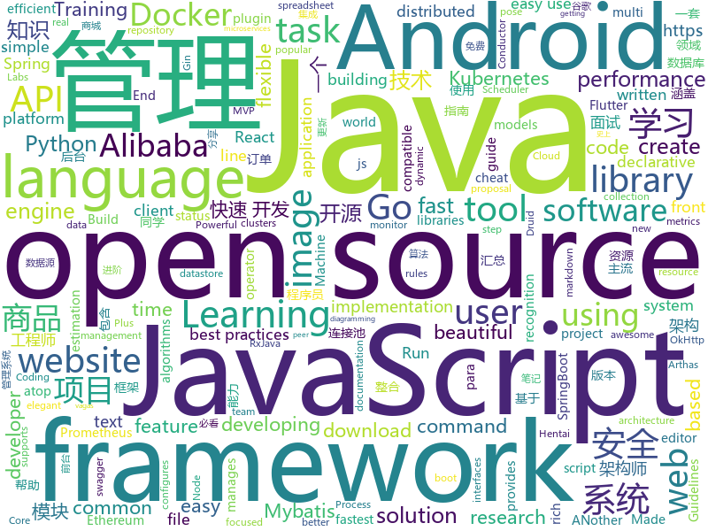

# 2019-07-28
See what the GitHub community is most excited about today.

## python
* [apple_bleee](https://github.com/hexway/apple_bleee)(**70 stars today**): Apple BLE research
* [Automagica](https://github.com/OakwoodAI/Automagica)(**80 stars today**): 🤖Open Source (Smart) Robotic Process Automation
* [pytorch-image-models](https://github.com/rwightman/pytorch-image-models)(**48 stars today**): PyTorch image models, scripts, pretrained weights -- (SE)ResNet/ResNeXT, DPN, EfficientNet, MixNet, MobileNet-V3/V2/V1, MNASNet, Single-Path NAS, FBNet, and more
* [Detectron](https://github.com/facebookresearch/Detectron)(**34 stars today**): FAIR's research platform for object detection research, implementing popular algorithms like Mask R-CNN and RetinaNet.
* [wtfpython-cn](https://github.com/leisurelicht/wtfpython-cn)(**22 stars today**): wtfpython的中文翻译/施工结束/ 能力有限，欢迎帮我改进翻译
* [Awesome-PyTorch-Chinese](https://github.com/INTERMT/Awesome-PyTorch-Chinese)(**21 stars today**): 【干货】史上最全的PyTorch学习资源汇总
* [ZeroNet](https://github.com/HelloZeroNet/ZeroNet)(**2 stars today**): ZeroNet - Decentralized websites using Bitcoin crypto and BitTorrent network
* [DG-Net](https://github.com/NVlabs/DG-Net)(**11 stars today**): CVPR2019 Joint Discriminative and Generative Learning for Person Re-identification
* [wagtail](https://github.com/wagtail/wagtail)(**9 stars today**): A Django content management system focused on flexibility and user experience
* [100-Days-Of-ML-Code](https://github.com/Avik-Jain/100-Days-Of-ML-Code)(**24 stars today**): 100 Days of ML Coding
* [distroless](https://github.com/GoogleContainerTools/distroless)(**11 stars today**): 🥑Language focused docker images, minus the operating system.
* [gallery-dl](https://github.com/mikf/gallery-dl)(**10 stars today**): Command-line program to download image-galleries and -collections from several image hosting sites
* [airflow](https://github.com/apache/airflow)(**8 stars today**): Apache Airflow
* [loguru](https://github.com/Delgan/loguru)(**6 stars today**): Python logging made (stupidly) simple
* [BlueKeep](https://github.com/Ekultek/BlueKeep)(**3 stars today**): Proof of concept for CVE-2019-0708
* [cheat.sh](https://github.com/chubin/cheat.sh)(**15 stars today**): the only cheat sheet you need
* [awesome-hand-pose-estimation](https://github.com/xinghaochen/awesome-hand-pose-estimation)(**3 stars today**): Awesome work on hand pose estimation/tracking
* [sagemaker-python-sdk](https://github.com/aws/sagemaker-python-sdk)(**3 stars today**): A library for training and deploying machine learning models on Amazon SageMaker
* [face_recognition](https://github.com/ageitgey/face_recognition)(**17 stars today**): The world's simplest facial recognition api for Python and the command line
* [Algorithm_Interview_Notes-Chinese](https://github.com/imhuay/Algorithm_Interview_Notes-Chinese)(**38 stars today**): 2018/2019/校招/春招/秋招/算法/机器学习(Machine Learning)/深度学习(Deep Learning)/自然语言处理(NLP)/C/C++/Python/面试笔记
* [cp-docker-images](https://github.com/confluentinc/cp-docker-images)(**1 stars today**): Docker images for Confluent Platform.
* [subEnum](https://github.com/itsKindred/subEnum)(**1 stars today**): Small Python script used to bruteforce subdomain names of a specified domain.
* [CppCoreGuidelines](https://github.com/isocpp/CppCoreGuidelines)(**11 stars today**): The C++ Core Guidelines are a set of tried-and-true guidelines, rules, and best practices about coding in C++
* [black](https://github.com/psf/black)(**18 stars today**): The uncompromising Python code formatter
* [tf-pose-estimation](https://github.com/ildoonet/tf-pose-estimation)(**2 stars today**): Deep Pose Estimation implemented using Tensorflow with Custom Architectures for fast inference.

## java
* [EhViewer](https://github.com/seven332/EhViewer)(**29 stars today**): An Unofficial E-Hentai Application for Android
* [tech-weekly](https://github.com/mercyblitz/tech-weekly)(**31 stars today**): 「小马哥技术周报」
* [advanced-java](https://github.com/doocs/advanced-java)(**94 stars today**): 😮互联网 Java 工程师进阶知识完全扫盲：涵盖高并发、分布式、高可用、微服务等领域知识，后端同学必看，前端同学也可学习
* [okdownload](https://github.com/lingochamp/okdownload)(**9 stars today**): A Reliable, Flexible, Fast and Powerful download engine.
* [spring-cloud-alibaba](https://github.com/alibaba/spring-cloud-alibaba)(**16 stars today**): Spring Cloud Alibaba provides a one-stop solution for application development for the distributed solutions of Alibaba middleware.
* [quarkus](https://github.com/quarkusio/quarkus)(**1 stars today**): Quarkus: Supersonic Subatomic Java.
* [server](https://github.com/wildfirechat/server)(**7 stars today**): 开源即时通讯(IM)系统
* [FATE](https://github.com/WeBankFinTech/FATE)(**10 stars today**): An Industrial Level Federated Learning Framework
* [antlr4](https://github.com/antlr/antlr4)(**8 stars today**): ANTLR (ANother Tool for Language Recognition) is a powerful parser generator for reading, processing, executing, or translating structured text or binary files.
* [toBeTopJavaer](https://github.com/hollischuang/toBeTopJavaer)(**46 stars today**): To Be Top Javaer - Java工程师成神之路
* [conductor](https://github.com/Netflix/conductor)(**2 stars today**): Conductor is a microservices orchestration engine - https://netflix.github.io/conductor/
* [EasyScheduler](https://github.com/analysys/EasyScheduler)(**5 stars today**): Easy Scheduler is a distributed workflow task scheduling system, which mainly resolve the problem of "complicated task dependencies but cannot directly monitor the health status of tasks". Easy Scheduler assembles tasks in a DAG diagram and can monitor the running status of tasks in real time. Meanwhile, It supports operations such as retry, rec…
* [arthas](https://github.com/alibaba/arthas)(**24 stars today**): Alibaba Java Diagnostic Tool Arthas/Alibaba Java诊断利器Arthas
* [JavaGuide](https://github.com/Snailclimb/JavaGuide)(**71 stars today**): 【Java学习+面试指南】 一份涵盖大部分Java程序员所需要掌握的核心知识。
* [spring-boot-plus](https://github.com/geekidea/spring-boot-plus)(**7 stars today**): spring-boot-plus集成Spring Boot 2.1.6,Mybatis,Mybatis Plus,Druid,FastJson,Redis,Rabbit MQ,Kafka等，可使用代码生成器快速开发项目
* [tink](https://github.com/google/tink)(**16 stars today**): Tink is a multi-language, cross-platform, open source library that provides cryptographic APIs that are secure, easy to use correctly, and hard(er) to misuse.
* [mall](https://github.com/macrozheng/mall)(**44 stars today**): mall项目是一套电商系统，包括前台商城系统及后台管理系统，基于SpringBoot+MyBatis实现。 前台商城系统包含首页门户、商品推荐、商品搜索、商品展示、购物车、订单流程、会员中心、客户服务、帮助中心等模块。 后台管理系统包含商品管理、订单管理、会员管理、促销管理、运营管理、内容管理、统计报表、财务管理、权限管理、设置等模块。
* [kubernetes-plugin](https://github.com/jenkinsci/kubernetes-plugin)(**2 stars today**): Jenkins plugin to run dynamic agents in a Kubernetes/Docker environment
* [druid](https://github.com/alibaba/druid)(**7 stars today**): 阿里巴巴数据库事业部出品，为监控而生的数据库连接池。阿里云Data Lake Analytics(https://www.aliyun.com/product/datalakeanalytics )、DRDS、TDDL 连接池powered by Druid
* [seata](https://github.com/seata/seata)(**4 stars today**): 🔥Seata is an easy-to-use, high-performance, open source distributed transaction solution.
* [phonegap-plugin-push](https://github.com/phonegap/phonegap-plugin-push)(**0 stars today**): Register and receive push notifications
* [mockito](https://github.com/mockito/mockito)(**5 stars today**): Most popular Mocking framework for unit tests written in Java
* [dynamic-datasource-spring-boot-starter](https://github.com/baomidou/dynamic-datasource-spring-boot-starter)(**3 stars today**): dynamic datasource for springboot 多数据源 动态数据源
* [MVPArms](https://github.com/JessYanCoding/MVPArms)(**0 stars today**): ⚔️A common architecture for Android applications developing based on MVP, integrates many open source projects, to make your developing quicker and easier (一个整合了大量主流开源项目高度可配置化的 Android MVP 快速集成框架).
* [MVVMHabit](https://github.com/goldze/MVVMHabit)(**3 stars today**): 👕基于谷歌最新AAC架构，MVVM设计模式的一套快速开发库，整合Okhttp+RxJava+Retrofit+Glide等主流模块，满足日常开发需求。使用该框架可以快速开发一个高质量、易维护的Android应用。

## unknown
* [Data-Science--Cheat-Sheet](https://github.com/abhat222/Data-Science--Cheat-Sheet)(**124 stars today**): Cheat Sheets
* [proposals](https://github.com/tc39/proposals)(**33 stars today**): Tracking ECMAScript Proposals
* [AWS-IAM-Privilege-Escalation](https://github.com/RhinoSecurityLabs/AWS-IAM-Privilege-Escalation)(**70 stars today**): A centralized source of all AWS IAM privilege escalation methods released by Rhino Security Labs.
* [git-flight-rules](https://github.com/k88hudson/git-flight-rules)(**41 stars today**): Flight rules for git
* [CVE-2019-2107](https://github.com/marcinguy/CVE-2019-2107)(**22 stars today**): CVE-2019-2107
* [English-level-up-tips-for-Chinese](https://github.com/byoungd/English-level-up-tips-for-Chinese)(**53 stars today**): 可能是让你受益匪浅的英语进阶指南
* [technology_books](https://github.com/arpitjindal97/technology_books)(**41 stars today**): Premium eBook free for Geeks
* [ipfs](https://github.com/ipfs/ipfs)(**29 stars today**): Peer-to-peer hypermedia protocol
* [awesome-java](https://github.com/akullpp/awesome-java)(**56 stars today**): A curated list of awesome frameworks, libraries and software for the Java programming language.
* [Security-PPT](https://github.com/FeeiCN/Security-PPT)(**13 stars today**): 大安全各领域各公司各会议分享的PPT
* [iccv2019](https://github.com/extreme-assistant/iccv2019)(**19 stars today**): ICCV 2019 papers/new汇总帖，极市团队整理
* [javaok](https://github.com/sayhiai/javaok)(**4 stars today**): 必看！java后端，亮剑诛仙。java发展路线技术要点。
* [sequelize-docs-Zh-CN](https://github.com/demopark/sequelize-docs-Zh-CN)(**4 stars today**): Sequelize 文档的中文版本 , 更新至 v5.8.6 版本.
* [Safety-Project-Collection](https://github.com/Bypass007/Safety-Project-Collection)(**2 stars today**): 收集一些比较优秀的开源安全项目，以帮助甲方安全从业人员构建企业安全能力。
* [android-developer-roadmap](https://github.com/mobile-roadmap/android-developer-roadmap)(**5 stars today**): Android Developer Roadmap 2019
* [AndroidInterView](https://github.com/interviewandroid/AndroidInterView)(**10 stars today**): Android面试2019年最新版（每日更新），音视频，Android高级，性能优化，算法，Flutter技术，FFmpeg OppenGl，资源混淆,插件化，组件化，OkHttp，Rxjava,架构师，Android架构
* [awesome-architecture](https://github.com/toutiaoio/awesome-architecture)(**31 stars today**): 架构师技术图谱，助你早日成为架构师
* [react-typescript-cheatsheet](https://github.com/typescript-cheatsheets/react-typescript-cheatsheet)(**9 stars today**): Cheatsheets for experienced React developers getting started with TypeScript
* [open-source-cs](https://github.com/ForrestKnight/open-source-cs)(**10 stars today**): Video discussing this curriculum:
* [petition](https://github.com/otvorete/petition)(**98 stars today**): ПОКАЖЕТЕ НИ КОДА!
* [awesome-ruby](https://github.com/markets/awesome-ruby)(**10 stars today**): 💎A collection of awesome Ruby libraries, tools, frameworks and software
* [howto-make-more-money](https://github.com/easychen/howto-make-more-money)(**3 stars today**): 程序员如何优雅的挣零花钱
* [vagas](https://github.com/frontendbr/vagas)(**3 stars today**): 🔬Espaço para divulgação de vagas para front-enders.
* [awesome-dubbo](https://github.com/thubbo/awesome-dubbo)(**2 stars today**): Dubbo resources collection
* [how-to-contribute-to-open-source](https://github.com/freeCodeCamp/how-to-contribute-to-open-source)(**1 stars today**): A guide to contributing to open source

## javascript
* [sequelize](https://github.com/sequelize/sequelize)(**30 stars today**): An easy-to-use multi SQL dialect ORM for Node.js
* [500lines](https://github.com/aosabook/500lines)(**52 stars today**): 500 Lines or Less
* [jexcel](https://github.com/paulhodel/jexcel)(**60 stars today**): jExcel is a lightweight vanilla javascript plugin to create amazing web-based interactive tables and spreadsheets compatible with Excel or any other spreadsheet software.
* [Front-End-Checklist](https://github.com/thedaviddias/Front-End-Checklist)(**17 stars today**): 🗂The perfect Front-End Checklist for modern websites and meticulous developers
* [google-access-helper](https://github.com/haotian-wang/google-access-helper)(**13 stars today**): 谷歌访问助手破解版
* [vis-network](https://github.com/visjs/vis-network)(**9 stars today**): Display dynamic, automatically organised, customizable network views.
* [react](https://github.com/facebook/react)(**44 stars today**): A declarative, efficient, and flexible JavaScript library for building user interfaces.
* [PersonalBlog](https://github.com/Nealyang/PersonalBlog)(**10 stars today**): 📝Nealyang personal blog
* [livewire](https://github.com/calebporzio/livewire)(**27 stars today**): A magical front-end framework for Laravel
* [outline](https://github.com/outline/outline)(**56 stars today**): The fastest wiki and knowledge base for growing teams. Beautiful, feature rich, markdown compatible and open source.
* [regl](https://github.com/regl-project/regl)(**20 stars today**): 👑Functional WebGL
* [x-spreadsheet](https://github.com/myliang/x-spreadsheet)(**8 stars today**): A web-based JavaScript（canvas） spreadsheet
* [website](https://github.com/CodingTrain/website)(**8 stars today**): Coding Train website
* [tiptap](https://github.com/scrumpy/tiptap)(**12 stars today**): A rich-text editor for Vue.js
* [computer-science-in-javascript](https://github.com/humanwhocodes/computer-science-in-javascript)(**28 stars today**): Collection of classic computer science paradigms, algorithms, and approaches written in JavaScript.
* [solid](https://github.com/ryansolid/solid)(**34 stars today**): A declarative, efficient, and flexible JavaScript library for building user interfaces.
* [E-Hentai-Downloader](https://github.com/ccloli/E-Hentai-Downloader)(**2 stars today**): Download E-Hentai archive as zip file
* [FE_You_dont_know](https://github.com/akira-cn/FE_You_dont_know)(**6 stars today**): 分享在前端开发中，你不知道的JavaScript、CSS和HTML趣味知识，增加你的知识面。
* [33-js-concepts](https://github.com/stephentian/33-js-concepts)(**6 stars today**): 📜每个 JavaScript 工程师都应懂的33个概念 @leonardomso
* [marktext](https://github.com/marktext/marktext)(**11 stars today**): 📝A simple and elegant markdown editor, available for Linux, macOS and Windows.
* [MikuTools](https://github.com/Ice-Hazymoon/MikuTools)(**27 stars today**): 一个轻量的工具集合
* [netlify-cms](https://github.com/netlify/netlify-cms)(**5 stars today**): A CMS for Static Site Generators
* [lighthouse](https://github.com/GoogleChrome/lighthouse)(**10 stars today**): Automated auditing, performance metrics, and best practices for the web.
* [odoo](https://github.com/odoo/odoo)(**5 stars today**): Odoo. Open Source Apps To Grow Your Business.
* [next.js](https://github.com/zeit/next.js)(**30 stars today**): The React Framework

## html
* [proposal-optional-chaining](https://github.com/tc39/proposal-optional-chaining)(**21 stars today**): 
* [aws-well-architected-labs](https://github.com/awslabs/aws-well-architected-labs)(**4 stars today**): Hands on labs and code to help you learn, measure, and build using architectural best practices.
* [swagger-codegen](https://github.com/swagger-api/swagger-codegen)(**3 stars today**): swagger-codegen contains a template-driven engine to generate documentation, API clients and server stubs in different languages by parsing your OpenAPI / Swagger definition.
* [craftinginterpreters](https://github.com/munificent/craftinginterpreters)(**5 stars today**): Repository for the book "Crafting Interpreters"
* [WanderingD19](https://github.com/wanderingd19/WanderingD19)(**0 stars today**): 上海交通大学D19宿舍搬迁事件启示录
* [beautiful-jekyll](https://github.com/daattali/beautiful-jekyll)(**4 stars today**): ✨Build a beautiful and simple website in literally minutes. Demo at http://deanattali.com/beautiful-jekyll
* [EIPs](https://github.com/ethereum/EIPs)(**2 stars today**): The Ethereum Improvement Proposal repository
* [flutter-in-action](https://github.com/flutterchina/flutter-in-action)(**11 stars today**): 《Flutter实战》电子书
* [docs](https://github.com/knative/docs)(**0 stars today**): User documentation for Knative components
* [glTF](https://github.com/KhronosGroup/glTF)(**3 stars today**): glTF – Runtime 3D Asset Delivery
* [ecma262](https://github.com/tc39/ecma262)(**3 stars today**): Status, process, and documents for ECMA-262
* [DIGITS](https://github.com/NVIDIA/DIGITS)(**0 stars today**): Deep Learning GPU Training System
* [mxgraph](https://github.com/jgraph/mxgraph)(**5 stars today**): mxGraph is a fully client side JavaScript diagramming library
* [intro.js](https://github.com/usablica/intro.js)(**34 stars today**): A better way for new feature introduction and step-by-step users guide for your website and project.
* [fastText](https://github.com/facebookresearch/fastText)(**2 stars today**): Library for fast text representation and classification.
* [tianocore.github.io](https://github.com/tianocore/tianocore.github.io)(**0 stars today**): Tianocore website
* [portainer](https://github.com/portainer/portainer)(**2 stars today**): Making Docker management easy.
* [jsr](https://github.com/mercyblitz/jsr)(**0 stars today**): Java Specification Requests
* [18.06-linalg-notes](https://github.com/apachecn/18.06-linalg-notes)(**1 stars today**): MIT-18.06-线性代数-完整笔记
* [react-naive-book](https://github.com/huzidaha/react-naive-book)(**4 stars today**): 开源、免费、专业、简单的 React.js 在线教程
* [zfaka](https://github.com/zlkbdotnet/zfaka)(**4 stars today**): 免费、安全、稳定、高效的发卡系统，值得拥有!
* [professional-services](https://github.com/GoogleCloudPlatform/professional-services)(**3 stars today**): Common solutions and tools developed by Google Cloud's Professional Services team
* [zenbot](https://github.com/DeviaVir/zenbot)(**1 stars today**): Zenbot is a command-line cryptocurrency trading bot using Node.js and MongoDB.
* [proposal-nullish-coalescing](https://github.com/tc39/proposal-nullish-coalescing)(**5 stars today**): Nullish coalescing proposal x ?? y
* [shiro-example](https://github.com/zhangkaitao/shiro-example)(**1 stars today**): 跟我学Shiro（我的公众号：kaitao-1234567，我的新书：《亿级流量网站架构核心技术》）

## go
* [gotraining](https://github.com/ardanlabs/gotraining)(**82 stars today**): Go Training Class Material :
* [gin](https://github.com/gin-gonic/gin)(**56 stars today**): Gin is a HTTP web framework written in Go (Golang). It features a Martini-like API with much better performance -- up to 40 times faster. If you need smashing performance, get yourself some Gin.
* [hugo](https://github.com/gohugoio/hugo)(**32 stars today**): The world’s fastest framework for building websites.
* [athens](https://github.com/gomods/athens)(**8 stars today**): A Go module datastore and proxy
* [autoscaler](https://github.com/kubernetes/autoscaler)(**5 stars today**): Autoscaling components for Kubernetes
* [terraform-provider-azurerm](https://github.com/terraform-providers/terraform-provider-azurerm)(**3 stars today**): Terraform provider for Azure Resource Manager
* [elastic](https://github.com/olivere/elastic)(**9 stars today**): Elasticsearch client for Go.
* [testify](https://github.com/stretchr/testify)(**6 stars today**): A toolkit with common assertions and mocks that plays nicely with the standard library
* [terraform](https://github.com/hashicorp/terraform)(**6 stars today**): Terraform enables you to safely and predictably create, change, and improve infrastructure. It is an open source tool that codifies APIs into declarative configuration files that can be shared amongst team members, treated as code, edited, reviewed, and versioned.
* [opa](https://github.com/open-policy-agent/opa)(**4 stars today**): An open source, general-purpose policy engine.
* [tendermint](https://github.com/tendermint/tendermint)(**4 stars today**): ⟁ Tendermint Core (BFT Consensus) in Go
* [go-swagger](https://github.com/go-swagger/go-swagger)(**10 stars today**): Swagger 2.0 implementation for go
* [prometheus-operator](https://github.com/coreos/prometheus-operator)(**13 stars today**): Prometheus Operator creates/configures/manages Prometheus clusters atop Kubernetes
* [influxdb](https://github.com/influxdata/influxdb)(**9 stars today**): Scalable datastore for metrics, events, and real-time analytics
* [colly](https://github.com/gocolly/colly)(**8 stars today**): Elegant Scraper and Crawler Framework for Golang
* [crc](https://github.com/code-ready/crc)(**6 stars today**): CodeReady Containers: Run OpenShift 4.x locally
* [faas](https://github.com/openfaas/faas)(**8 stars today**): OpenFaaS - Serverless Functions Made Simple
* [yaegi](https://github.com/containous/yaegi)(**112 stars today**): Yaegi is Another Elegant Go Interpreter
* [etcd-operator](https://github.com/coreos/etcd-operator)(**3 stars today**): etcd operator creates/configures/manages etcd clusters atop Kubernetes
* [loki](https://github.com/grafana/loki)(**11 stars today**): Like Prometheus, but for logs.
* [v](https://github.com/vlang/v)(**30 stars today**): Simple, fast, safe, compiled language for developing maintainable software. Supports translation from C and (soon) C++. Compiles itself in <1s. https://vlang.io
* [quorum](https://github.com/jpmorganchase/quorum)(**0 stars today**): A permissioned implementation of Ethereum supporting data privacy
* [skaffold](https://github.com/GoogleContainerTools/skaffold)(**9 stars today**): Easy and Repeatable Kubernetes Development
* [jwt-go](https://github.com/dgrijalva/jwt-go)(**7 stars today**): Golang implementation of JSON Web Tokens (JWT)
* [minikube](https://github.com/kubernetes/minikube)(**3 stars today**): Run Kubernetes locally

## WordCloud

