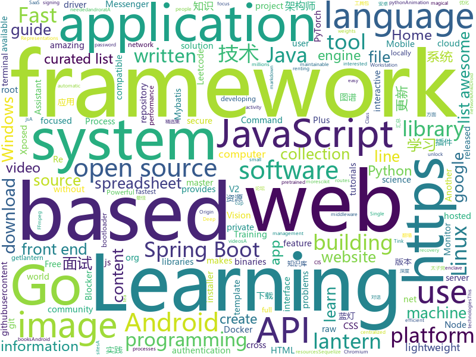

# 2019-07-29
See what the GitHub community is most excited about today.

## python
* [grapheneX](https://github.com/grapheneX/grapheneX)(**75 stars today**): Automated System Hardening Framework
* [tensorpack](https://github.com/tensorpack/tensorpack)(**51 stars today**): A Neural Net Training Interface on TensorFlow, with focus on speed + flexibility
* [chromego](https://github.com/killgcd/chromego)(**92 stars today**): ChromeGo 翻墙工具包
* [youtube-dl](https://github.com/ytdl-org/youtube-dl)(**79 stars today**): Command-line program to download videos from YouTube.com and other video sites
* [wagtail](https://github.com/wagtail/wagtail)(**34 stars today**): A Django content management system focused on flexibility and user experience
* [unlocker](https://github.com/DrDonk/unlocker)(**53 stars today**): VMware Workstation macOS
* [esptool](https://github.com/espressif/esptool)(**3 stars today**): ESP8266 and ESP32 serial bootloader utility
* [zhao](https://github.com/programthink/zhao)(**9 stars today**): 【编程随想】整理的《太子党关系网络》，专门揭露赵国的权贵
* [pytorch-image-models](https://github.com/rwightman/pytorch-image-models)(**107 stars today**): PyTorch image models, scripts, pretrained weights -- (SE)ResNet/ResNeXT, DPN, EfficientNet, MixNet, MobileNet-V3/V2/V1, MNASNet, Single-Path NAS, FBNet, and more
* [scikit-learn](https://github.com/scikit-learn/scikit-learn)(**16 stars today**): scikit-learn: machine learning in Python
* [optuna](https://github.com/pfnet/optuna)(**9 stars today**): A hyperparameter optimization framework
* [Automagica](https://github.com/OakwoodAI/Automagica)(**80 stars today**): 🤖Open Source (Smart) Robotic Process Automation
* [Awesome-PyTorch-Chinese](https://github.com/INTERMT/Awesome-PyTorch-Chinese)(**20 stars today**): 【干货】史上最全的PyTorch学习资源汇总
* [Knowledge-Graph](https://github.com/lihanghang/Knowledge-Graph)(**33 stars today**): 深度学习与自然语言处理、知识图谱、对话系统。包括知识获取、知识库构建、知识库应用三大技术研究与应用。
* [apple_bleee](https://github.com/hexway/apple_bleee)(**90 stars today**): Apple BLE research
* [Zvm](https://github.com/5A59/Zvm)(**30 stars today**): A lightweight jvm written by python
* [manim](https://github.com/3b1b/manim)(**20 stars today**): Animation engine for explanatory math videos
* [docker-py](https://github.com/docker/docker-py)(**8 stars today**): A Python library for the Docker Engine API
* [doccano](https://github.com/chakki-works/doccano)(**7 stars today**): Open source text annotation tool for machine learning practitioner.
* [PhoneInfoga](https://github.com/sundowndev/PhoneInfoga)(**4 stars today**): Advanced information gathering & OSINT tool for phone numbers.
* [googleapis](https://github.com/googleapis/googleapis)(**5 stars today**): Public interface definitions of Google APIs.
* [LASER](https://github.com/facebookresearch/LASER)(**6 stars today**): Language-Agnostic SEntence Representations
* [distroless](https://github.com/GoogleContainerTools/distroless)(**9 stars today**): 🥑Language focused docker images, minus the operating system.
* [kamerka](https://github.com/woj-ciech/kamerka)(**3 stars today**): Build interactive map of cameras from Shodan
* [DG-Net](https://github.com/NVlabs/DG-Net)(**20 stars today**): CVPR2019 Joint Discriminative and Generative Learning for Person Re-identification

## java
* [EhViewer](https://github.com/seven332/EhViewer)(**56 stars today**): An Unofficial E-Hentai Application for Android
* [web-flash](https://github.com/enilu/web-flash)(**67 stars today**): WEB-FLASH -- Admin Framework and Mobile Website Based on Spring Boot and Vue.js
* [milkman](https://github.com/warmuuh/milkman)(**15 stars today**): 
* [NewPipe](https://github.com/TeamNewPipe/NewPipe)(**13 stars today**): A libre lightweight streaming front-end for Android.
* [tink](https://github.com/google/tink)(**25 stars today**): Tink is a multi-language, cross-platform, open source library that provides cryptographic APIs that are secure, easy to use correctly, and hard(er) to misuse.
* [toBeTopJavaer](https://github.com/hollischuang/toBeTopJavaer)(**67 stars today**): To Be Top Javaer - Java工程师成神之路
* [runelite](https://github.com/runelite/runelite)(**2 stars today**): Open source Old School RuneScape client
* [Signal-Android](https://github.com/signalapp/Signal-Android)(**6 stars today**): A private messenger for Android.
* [spring-boot-plus](https://github.com/geekidea/spring-boot-plus)(**35 stars today**): spring-boot-plus集成Spring Boot 2.1.6,Mybatis,Mybatis Plus,Druid,FastJson,Redis,Rabbit MQ,Kafka等，可使用代码生成器快速开发项目
* [Leetcode](https://github.com/fishercoder1534/Leetcode)(**10 stars today**): Complete solutions to Leetcode problems; updated daily. (I'm looking for long-term contributors/partners to this repo! Send me PRs if you're interested! - 9/5/2018)
* [Lawnchair](https://github.com/LawnchairLauncher/Lawnchair)(**3 stars today**): [v2 sources released!] No clever tagline needed
* [androrat](https://github.com/wszf/androrat)(**5 stars today**): androrat
* [okdownload](https://github.com/lingochamp/okdownload)(**10 stars today**): A Reliable, Flexible, Fast and Powerful download engine.
* [jdk](https://github.com/openjdk/jdk)(**7 stars today**): Read-only mirror of https://hg.openjdk.java.net/jdk/jdk
* [bisq](https://github.com/bisq-network/bisq)(**1 stars today**): The decentralized bitcoin exchange network
* [Anki-Android](https://github.com/ankidroid/Anki-Android)(**3 stars today**): AnkiDroid: Anki on Android
* [springboot-learning-example](https://github.com/JeffLi1993/springboot-learning-example)(**20 stars today**): spring boot 实践学习案例，是 spring boot 初学者及核心技术巩固的最佳实践。
* [FATE](https://github.com/WeBankFinTech/FATE)(**7 stars today**): An Industrial Level Federated Learning Framework
* [EdXposed](https://github.com/ElderDrivers/EdXposed)(**6 stars today**): Elder driver Xposed Framework.
* [community](https://github.com/codedrinker/community)(**5 stars today**): 开源论坛系统 - Spring Boot
* [community](https://github.com/GoogleCloudPlatform/community)(**4 stars today**): This repository holds the content submitted to https://cloud.google.com/community. Files added to the tutorials/ will appear at https://cloud.google.com/community/tutorials.
* [CS-Notes](https://github.com/CyC2018/CS-Notes)(**128 stars today**): 📚Tech Interview Guide 技术面试必备基础知识、Leetcode 题解、Java、C++、Python、后端面试、操作系统、计算机网络、系统设计
* [VirtualXposed](https://github.com/android-hacker/VirtualXposed)(**8 stars today**): A simple app to use Xposed without root, unlock the bootloader or modify system image, etc.
* [gnirehtet](https://github.com/Genymobile/gnirehtet)(**5 stars today**): Gnirehtet provides reverse tethering for Android
* [PicaComic-Api](https://github.com/ShirosakiMieru/PicaComic-Api)(**5 stars today**): PicaComic's Api 哔咔漫画的Api

## unknown
* [awesome-architecture](https://github.com/toutiaoio/awesome-architecture)(**410 stars today**): 架构师技术图谱，助你早日成为架构师
* [AWS-IAM-Privilege-Escalation](https://github.com/RhinoSecurityLabs/AWS-IAM-Privilege-Escalation)(**64 stars today**): A centralized source of all AWS IAM privilege escalation methods released by Rhino Security Labs.
* [git-flight-rules](https://github.com/k88hudson/git-flight-rules)(**147 stars today**): Flight rules for git
* [awesome-java](https://github.com/akullpp/awesome-java)(**86 stars today**): A curated list of awesome frameworks, libraries and software for the Java programming language.
* [Data-Science--Cheat-Sheet](https://github.com/abhat222/Data-Science--Cheat-Sheet)(**104 stars today**): Cheat Sheets
* [awesome-computer-vision](https://github.com/jbhuang0604/awesome-computer-vision)(**6 stars today**): A curated list of awesome computer vision resources
* [sequelize-docs-Zh-CN](https://github.com/demopark/sequelize-docs-Zh-CN)(**6 stars today**): Sequelize 文档的中文版本 , 更新至 v5.8.6 版本.
* [HAHA](https://github.com/cvb941/HAHA)(**7 stars today**): Highly Available Home Assistant - a solution for running a redundant installation of Home Assistant
* [petition](https://github.com/otvorete/petition)(**114 stars today**): ПОКАЖЕТЕ НИ КОДА!
* [You-Dont-Know-JS](https://github.com/getify/You-Dont-Know-JS)(**68 stars today**): A book series on JavaScript. @YDKJS on twitter.
* [30-seconds-zh_CN](https://github.com/b3log/30-seconds-zh_CN)(**17 stars today**): 📙前端知识精选集，包含 HTML、CSS、JavaScript、React、Node、安全等方面，每天仅需 30 秒。
* [the-practical-linux-hardening-guide](https://github.com/trimstray/the-practical-linux-hardening-guide)(**16 stars today**): This guide details creating a secure Linux production system. OpenSCAP (C2S/CIS, STIG).
* [new-pac](https://github.com/Alvin9999/new-pac)(**24 stars today**): 
* [The-Economist](https://github.com/nailperry-zd/The-Economist)(**5 stars today**): The Economist 经济学人，持续更新
* [deep-learning-drizzle](https://github.com/kmario23/deep-learning-drizzle)(**19 stars today**): Drench yourself in Deep Learning, Reinforcement Learning, Machine Learning, Computer Vision, and NLP by learning from these exciting lectures!!
* [awesome-datascience](https://github.com/bulutyazilim/awesome-datascience)(**4 stars today**): 📝An awesome Data Science repository to learn and apply for real world problems.
* [free-programming-books](https://github.com/EbookFoundation/free-programming-books)(**56 stars today**): 📚Freely available programming books
* [Flutter-Course-Resources](https://github.com/londonappbrewery/Flutter-Course-Resources)(**4 stars today**): 
* [curriculum](https://github.com/PestoTech/curriculum)(**3 stars today**): 
* [AndroidInterView](https://github.com/interviewandroid/AndroidInterView)(**4 stars today**): Android面试2019年最新版（每日更新），音视频，Android高级，性能优化，算法，Flutter技术，FFmpeg OppenGl，资源混淆,插件化，组件化，OkHttp，Rxjava,架构师，Android架构
* [book](https://github.com/KeKe-Li/book)(**17 stars today**): 📚All programming languages books
* [every-programmer-should-know](https://github.com/mtdvio/every-programmer-should-know)(**16 stars today**): A collection of (mostly) technical things every software developer should know
* [fancyss_history_package](https://github.com/hq450/fancyss_history_package)(**17 stars today**): 科学上网插件的离线安装包储存在这里
* [gitignore](https://github.com/github/gitignore)(**40 stars today**): A collection of useful .gitignore templates
* [sql-style-guide](https://github.com/mattm/sql-style-guide)(**34 stars today**): An opinionated guide for writing clean, maintainable SQL.

## javascript
* [NeteaseCloudMusicApi](https://github.com/Binaryify/NeteaseCloudMusicApi)(**141 stars today**): 网易云音乐 Node.js API service
* [laravel-auth](https://github.com/jeremykenedy/laravel-auth)(**29 stars today**): Laravel 5.8 with user authentication, registration with email confirmation, social media authentication, password recovery, and captcha protection. Uses offical [Bootstrap 4](http://getbootstrap.com). This also makes full use of Controllers for the routes, templates for the views, and makes use of middleware for routing. Project can be stood up …
* [gridstudio](https://github.com/ricklamers/gridstudio)(**70 stars today**): Grid studio is a web-based spreadsheet application with full integration of the Python programming language.
* [Signal-Desktop](https://github.com/signalapp/Signal-Desktop)(**8 stars today**): Signal — Private Messenger for Windows, Mac, and Linux
* [MikuTools](https://github.com/Ice-Hazymoon/MikuTools)(**50 stars today**): 一个轻量的工具集合
* [jexcel](https://github.com/paulhodel/jexcel)(**99 stars today**): jExcel is a lightweight vanilla javascript plugin to create amazing web-based interactive tables and spreadsheets compatible with Excel or any other spreadsheet software.
* [ch-download](https://github.com/alekseylovchikov/ch-download)(**9 stars today**): download video from coursehunters.net
* [create-nuxt-app](https://github.com/nuxt/create-nuxt-app)(**11 stars today**): Create Nuxt.js App in seconds.
* [website](https://github.com/CodingTrain/website)(**8 stars today**): Coding Train website
* [hyper](https://github.com/zeit/hyper)(**21 stars today**): A terminal built on web technologies
* [awesome-selfhosted](https://github.com/Kickball/awesome-selfhosted)(**20 stars today**): This is a list of Free Software network services and web applications which can be hosted locally. Selfhosting is the process of locally hosting and managing applications instead of renting from SaaS providers.
* [html5-boilerplate](https://github.com/h5bp/html5-boilerplate)(**12 stars today**): A professional front-end template for building fast, robust, and adaptable web apps or sites.
* [500lines](https://github.com/aosabook/500lines)(**70 stars today**): 500 Lines or Less
* [anti-adblock-killer](https://github.com/reek/anti-adblock-killer)(**20 stars today**): Anti-Adblock Killer helps you keep your Ad-Blocker active, when you visit a website and it asks you to disable.
* [react-360](https://github.com/facebook/react-360)(**10 stars today**): Create amazing 360 and VR content using React
* [livewire](https://github.com/calebporzio/livewire)(**24 stars today**): A magical front-end framework for Laravel
* [AlgoCasts](https://github.com/StephenGrider/AlgoCasts)(**2 stars today**): 
* [discord.js](https://github.com/discordjs/discord.js)(**6 stars today**): A powerful JavaScript library for interacting with the Discord API
* [joplin](https://github.com/laurent22/joplin)(**15 stars today**): Joplin - a note taking and to-do application with synchronization capabilities for Windows, macOS, Linux, Android and iOS. Forum: https://discourse.joplinapp.org/
* [freeCodeCamp](https://github.com/freeCodeCamp/freeCodeCamp)(**38 stars today**): The https://www.freeCodeCamp.org open source codebase and curriculum. Learn to code for free together with millions of people.
* [bootstrap](https://github.com/twbs/bootstrap)(**32 stars today**): The most popular HTML, CSS, and JavaScript framework for developing responsive, mobile first projects on the web.
* [outline](https://github.com/outline/outline)(**105 stars today**): The fastest wiki and knowledge base for growing teams. Beautiful, feature rich, markdown compatible and open source.
* [shields](https://github.com/badges/shields)(**11 stars today**): Concise, consistent, and legible badges in SVG and raster format
* [uBlock](https://github.com/gorhill/uBlock)(**6 stars today**): uBlock Origin - An efficient blocker for Chromium and Firefox. Fast and lean.
* [computer-science-in-javascript](https://github.com/humanwhocodes/computer-science-in-javascript)(**44 stars today**): Collection of classic computer science paradigms, algorithms, and approaches written in JavaScript.

## go
* [gotraining](https://github.com/ardanlabs/gotraining)(**146 stars today**): Go Training Class Material :
* [tinygo](https://github.com/tinygo-org/tinygo)(**83 stars today**): Go compiler for small places. Microcontrollers, WebAssembly, and command-line tools. Based on LLVM.
* [gitea](https://github.com/go-gitea/gitea)(**41 stars today**): Git with a cup of tea, painless self-hosted git service
* [gin](https://github.com/gin-gonic/gin)(**54 stars today**): Gin is a HTTP web framework written in Go (Golang). It features a Martini-like API with much better performance -- up to 40 times faster. If you need smashing performance, get yourself some Gin.
* [yaegi](https://github.com/containous/yaegi)(**64 stars today**): Yaegi is Another Elegant Go Interpreter
* [v2ray-core](https://github.com/v2ray/v2ray-core)(**16 stars today**): A platform for building proxies to bypass network restrictions.
* [buildah](https://github.com/containers/buildah)(**32 stars today**): A tool that facilitates building OCI images
* [memguard](https://github.com/awnumar/memguard)(**31 stars today**): Secure software enclave for storage of sensitive information in memory.
* [lazydocker](https://github.com/jesseduffield/lazydocker)(**57 stars today**): The lazier way to manage everything docker
* [hugo](https://github.com/gohugoio/hugo)(**48 stars today**): The world’s fastest framework for building websites.
* [pspy](https://github.com/DominicBreuker/pspy)(**11 stars today**): Monitor linux processes without root permissions
* [pd](https://github.com/pingcap/pd)(**3 stars today**): Placement driver for TiKV
* [yay](https://github.com/Jguer/yay)(**4 stars today**): Yet another Yogurt - An AUR Helper written in Go
* [gotop](https://github.com/cjbassi/gotop)(**5 stars today**): A terminal based graphical activity monitor inspired by gtop and vtop
* [jwt-go](https://github.com/dgrijalva/jwt-go)(**16 stars today**): Golang implementation of JSON Web Tokens (JWT)
* [fx](https://github.com/uber-go/fx)(**20 stars today**): A dependency injection based application framework for Go.
* [awesome-go](https://github.com/avelino/awesome-go)(**36 stars today**): A curated list of awesome Go frameworks, libraries and software
* [skaffold](https://github.com/GoogleContainerTools/skaffold)(**7 stars today**): Easy and Repeatable Kubernetes Development
* [fsnotify](https://github.com/fsnotify/fsnotify)(**12 stars today**): Cross-platform file system notifications for Go.
* [Dragonfly](https://github.com/dragonflyoss/Dragonfly)(**9 stars today**): Dragonfly is an intelligent P2P based image and file distribution system.
* [caddy](https://github.com/caddyserver/caddy)(**20 stars today**): Fast, cross-platform HTTP/2 web server with automatic HTTPS
* [libpod](https://github.com/containers/libpod)(**51 stars today**): libpod is a library used to create container pods. Home of Podman.
* [skopeo](https://github.com/containers/skopeo)(**28 stars today**): Work with remote images registries - retrieving information, images, signing content
* [RockGO](https://github.com/zllangct/RockGO)(**9 stars today**): A developing game server framework,based on Entity Component System(ECS).
* [lantern](https://github.com/getlantern/lantern)(**32 stars today**): 蓝灯Windows下载 https://raw.githubusercontent.com/getlantern/lantern-binaries/master/lantern-installer.exe 蓝灯安卓下载 https://raw.githubusercontent.com/getlantern/lantern-binaries/master/lantern-installer.apk

## WordCloud

