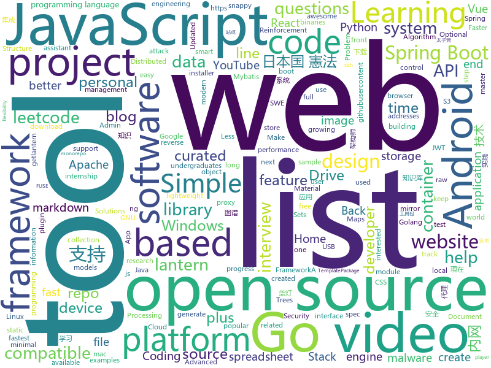

# 2019-07-30
See what the GitHub community is most excited about today.

## python
* [pytorch-image-models](https://github.com/rwightman/pytorch-image-models)(**78 stars today**): PyTorch image models, scripts, pretrained weights -- (SE)ResNet/ResNeXT, DPN, EfficientNet, MixNet, MobileNet-V3/V2/V1, MNASNet, Single-Path NAS, FBNet, and more
* [youtube-dl](https://github.com/ytdl-org/youtube-dl)(**129 stars today**): Command-line program to download videos from YouTube.com and other video sites
* [apple_bleee](https://github.com/hexway/apple_bleee)(**74 stars today**): Apple BLE research
* [grapheneX](https://github.com/grapheneX/grapheneX)(**90 stars today**): Automated System Hardening Framework
* [home-assistant](https://github.com/home-assistant/home-assistant)(**25 stars today**): 🏡Open source home automation that puts local control and privacy first
* [optuna](https://github.com/pfnet/optuna)(**17 stars today**): A hyperparameter optimization framework
* [httpx](https://github.com/encode/httpx)(**41 stars today**): A next generation HTTP client for Python.🦋
* [chromego](https://github.com/killgcd/chromego)(**48 stars today**): ChromeGo 翻墙工具包
* [Automagica](https://github.com/OakwoodAI/Automagica)(**28 stars today**): 🤖Open Source (Smart) Robotic Process Automation
* [mycroft-core](https://github.com/MycroftAI/mycroft-core)(**10 stars today**): Mycroft Core, the Mycroft Artificial Intelligence platform.
* [Knowledge-Graph](https://github.com/lihanghang/Knowledge-Graph)(**13 stars today**): 深度学习与自然语言处理、知识图谱、对话系统。包括知识获取、知识库构建、知识库应用三大技术研究与应用。
* [mypy](https://github.com/python/mypy)(**11 stars today**): Optional static typing for Python 3 and 2 (PEP 484)
* [wagtail](https://github.com/wagtail/wagtail)(**27 stars today**): A Django content management system focused on flexibility and user experience
* [electrum](https://github.com/spesmilo/electrum)(**4 stars today**): Electrum; Bitcoin thin client
* [zipline](https://github.com/quantopian/zipline)(**10 stars today**): Zipline, a Pythonic Algorithmic Trading Library
* [primer](https://github.com/Helpsypoo/primer)(**5 stars today**): code that makes videos for this: youtube.com/c/primerlearning
* [usbrip](https://github.com/snovvcrash/usbrip)(**67 stars today**): Simple command line forensics tool for tracking USB device artifacts (history of USB events) on GNU/Linux
* [manim](https://github.com/3b1b/manim)(**19 stars today**): Animation engine for explanatory math videos
* [lnkexploit](https://github.com/mortychannel/lnkexploit)(**7 stars today**): 
* [OctoPrint](https://github.com/foosel/OctoPrint)(**3 stars today**): OctoPrint is the snappy web interface for your 3D printer!
* [zhao](https://github.com/programthink/zhao)(**13 stars today**): 【编程随想】整理的《太子党关系网络》，专门揭露赵国的权贵
* [Reinforcement-learning-with-tensorflow](https://github.com/MorvanZhou/Reinforcement-learning-with-tensorflow)(**10 stars today**): Simple Reinforcement learning tutorials
* [tlroadmap](https://github.com/tlbootcamp/tlroadmap)(**84 stars today**): 👩🏼‍💻👨🏻‍💻Карта навыков и модель развития тимлидов
* [Detectron](https://github.com/facebookresearch/Detectron)(**10 stars today**): FAIR's research platform for object detection research, implementing popular algorithms like Mask R-CNN and RetinaNet.
* [fsociety](https://github.com/Manisso/fsociety)(**8 stars today**): fsociety Hacking Tools Pack – A Penetration Testing Framework

## java
* [interview](https://github.com/mission-peace/interview)(**14 stars today**): Interview questions
* [ghidra](https://github.com/NationalSecurityAgency/ghidra)(**16 stars today**): Ghidra is a software reverse engineering (SRE) framework
* [spring-boot-plus](https://github.com/geekidea/spring-boot-plus)(**47 stars today**): spring-boot-plus集成Spring Boot 2.1.6,Mybatis,Mybatis Plus,Druid,FastJson,Redis,Rabbit MQ,Kafka等，可使用代码生成器快速开发项目
* [EhViewer](https://github.com/seven332/EhViewer)(**25 stars today**): An Unofficial E-Hentai Application for Android
* [Mindustry](https://github.com/Anuken/Mindustry)(**5 stars today**): A sandbox tower defense game
* [milkman](https://github.com/warmuuh/milkman)(**19 stars today**): 
* [Leetcode](https://github.com/fishercoder1534/Leetcode)(**16 stars today**): Complete solutions to Leetcode problems; updated daily. (I'm looking for long-term contributors/partners to this repo! Send me PRs if you're interested! - 9/5/2018)
* [dubbo-samples](https://github.com/apache/dubbo-samples)(**6 stars today**): samples for Apache Dubbo
* [Signal-Android](https://github.com/signalapp/Signal-Android)(**7 stars today**): A private messenger for Android.
* [tech-weekly](https://github.com/mercyblitz/tech-weekly)(**20 stars today**): 「小马哥技术周报」
* [runelite](https://github.com/runelite/runelite)(**4 stars today**): Open source Old School RuneScape client
* [cassandra](https://github.com/apache/cassandra)(**6 stars today**): Mirror of Apache Cassandra
* [backtobackswe](https://github.com/bephrem1/backtobackswe)(**4 stars today**): Code Examples For Back To Back SWE Lessons
* [springboot-learning-example](https://github.com/JeffLi1993/springboot-learning-example)(**28 stars today**): spring boot 实践学习案例，是 spring boot 初学者及核心技术巩固的最佳实践。
* [spring-boot](https://github.com/spring-projects/spring-boot)(**42 stars today**): Spring Boot
* [thingsboard](https://github.com/thingsboard/thingsboard)(**7 stars today**): Open-source IoT Platform - Device management, data collection, processing and visualization.
* [incubator-hudi](https://github.com/apache/incubator-hudi)(**3 stars today**): Upserts And Incremental Processing on Big Data
* [open-location-code](https://github.com/google/open-location-code)(**2 stars today**): Open Location Code is a library to generate short codes, called "plus codes", that can be used as digital addresses where street addresses don't exist.
* [spring-security-react-ant-design-polls-app](https://github.com/callicoder/spring-security-react-ant-design-polls-app)(**5 stars today**): Full Stack Polls App built using Spring Boot, Spring Security, JWT, React, and Ant Design
* [FMap](https://github.com/jiyouliang/FMap)(**70 stars today**): 宇行地图Android客户端
* [web-flash](https://github.com/enilu/web-flash)(**35 stars today**): WEB-FLASH -- Admin Framework and Mobile Website Based on Spring Boot and Vue.js
* [NewPipe](https://github.com/TeamNewPipe/NewPipe)(**12 stars today**): A libre lightweight streaming front-end for Android.
* [Cknife](https://github.com/Chora10/Cknife)(**5 stars today**): Cknife
* [TheFatRat](https://github.com/Screetsec/TheFatRat)(**5 stars today**): Thefatrat a massive exploiting tool : Easy tool to generate backdoor and easy tool to post exploitation attack like browser attack,dll . This tool compiles a malware with popular payload and then the compiled malware can be execute on windows, android, mac . The malware that created with this tool also have an ability to bypass most AV software …
* [H-Viewer](https://github.com/PureDark/H-Viewer)(**2 stars today**): An android feed reader application which fetch data with selector and regular expression.

## unknown
* [summer2020internships](https://github.com/elaine-zheng/summer2020internships)(**75 stars today**): Keep track of internships for Summer 2020 for undergraduates interested in tech./SWE/related fields
* [SlimYOLOv3](https://github.com/PengyiZhang/SlimYOLOv3)(**79 stars today**): This page is for the SlimYOLOv3: Narrower, Faster and Better for UAV Real-Time Applications
* [Data-Science--Cheat-Sheet](https://github.com/abhat222/Data-Science--Cheat-Sheet)(**85 stars today**): Cheat Sheets
* [midTbot_esp32](https://github.com/bdring/midTbot_esp32)(**46 stars today**): A Small and Simple Pen Plotter
* [Flutter-Course-Resources](https://github.com/londonappbrewery/Flutter-Course-Resources)(**52 stars today**): 
* [free-programming-books](https://github.com/EbookFoundation/free-programming-books)(**158 stars today**): 📚Freely available programming books
* [git-flight-rules](https://github.com/k88hudson/git-flight-rules)(**137 stars today**): Flight rules for git
* [deep-learning-drizzle](https://github.com/kmario23/deep-learning-drizzle)(**54 stars today**): Drench yourself in Deep Learning, Reinforcement Learning, Machine Learning, Computer Vision, and NLP by learning from these exciting lectures!!
* [petition](https://github.com/otvorete/petition)(**99 stars today**): ПОКАЖЕТЕ НИ КОДА!
* [awesome-architecture](https://github.com/toutiaoio/awesome-architecture)(**275 stars today**): 架构师技术图谱，助你早日成为架构师
* [linux-hardening-checklist](https://github.com/trimstray/linux-hardening-checklist)(**19 stars today**): Simple checklist to help you deploying the most important areas of the GNU/Linux production systems - work in progress.
* [javascript-questions](https://github.com/lydiahallie/javascript-questions)(**66 stars today**): A long list of (advanced) JavaScript questions, and their explanations✨Updated weekly!
* [Security-PPT](https://github.com/FeeiCN/Security-PPT)(**98 stars today**): 大安全各领域各公司各会议分享的PPT
* [ipfs](https://github.com/ipfs/ipfs)(**12 stars today**): Peer-to-peer hypermedia protocol
* [javascript-interview-questions](https://github.com/sudheerj/javascript-interview-questions)(**3 stars today**): List of 1000 JavaScript Interview Questions
* [fancyss_history_package](https://github.com/hq450/fancyss_history_package)(**12 stars today**): 科学上网插件的离线安装包储存在这里
* [javascript-interview-questions-developer](https://github.com/tuantvk/javascript-interview-questions-developer)(**1 stars today**): Danh sách những câu hỏi trong phỏng vấn Javascript📝(Working in progress)
* [book](https://github.com/KeKe-Li/book)(**6 stars today**): 📚All programming languages books
* [summer-2019-internships](https://github.com/christine-hu/summer-2019-internships)(**5 stars today**): A document to help undergraduates keep track of software engineering internship opportunities.
* [AWS-IAM-Privilege-Escalation](https://github.com/RhinoSecurityLabs/AWS-IAM-Privilege-Escalation)(**52 stars today**): A centralized source of all AWS IAM privilege escalation methods released by Rhino Security Labs.
* [constitution-of-japan](https://github.com/atsuya/constitution-of-japan)(**3 stars today**): このレポジトリは、現在の日本国憲法、そして現在の日本国憲法に対して日本国憲法改正案がどのような変更点を含むのかを理解するためのものです
* [awesome-java](https://github.com/akullpp/awesome-java)(**54 stars today**): A curated list of awesome frameworks, libraries and software for the Java programming language.
* [technology_books](https://github.com/arpitjindal97/technology_books)(**212 stars today**): Premium eBook free for Geeks
* [ssr-download](https://github.com/xcxnig/ssr-download)(**3 stars today**): 最新版的ss/ssr/ssrr
* [system-design-interview](https://github.com/checkcheckzz/system-design-interview)(**7 stars today**): System design interview for IT companies

## javascript
* [github-do-not-ban-us](https://github.com/1995parham/github-do-not-ban-us)(**2,175 stars today**): Github do not ban us from open source world🇮🇷
* [ch-download](https://github.com/alekseylovchikov/ch-download)(**40 stars today**): download video from coursehunters.net
* [gridstudio](https://github.com/ricklamers/gridstudio)(**88 stars today**): Grid studio is a web-based spreadsheet application with full integration of the Python programming language.
* [outline](https://github.com/outline/outline)(**164 stars today**): The fastest wiki and knowledge base for growing teams. Beautiful, feature rich, markdown compatible and open source.
* [jexcel](https://github.com/paulhodel/jexcel)(**172 stars today**): jExcel is a lightweight vanilla javascript plugin to create amazing web-based interactive tables and spreadsheets compatible with Excel or any other spreadsheet software.
* [gatsby](https://github.com/gatsbyjs/gatsby)(**41 stars today**): Build blazing fast, modern apps and websites with React
* [tech-interview-handbook](https://github.com/yangshun/tech-interview-handbook)(**40 stars today**): 💯Materials to help you rock your next coding interview
* [google-access-helper](https://github.com/haotian-wang/google-access-helper)(**57 stars today**): 谷歌访问助手破解版
* [500lines](https://github.com/aosabook/500lines)(**38 stars today**): 500 Lines or Less
* [MikuTools](https://github.com/Ice-Hazymoon/MikuTools)(**62 stars today**): 一个轻量的工具集合
* [nuxt.js](https://github.com/nuxt/nuxt.js)(**26 stars today**): The Vue.js Framework
* [made-in-iran](https://github.com/mohebifar/made-in-iran)(**17 stars today**): A list of cool projects made in Iran
* [Boostnote](https://github.com/BoostIO/Boostnote)(**17 stars today**): A markdown editor for developers on Mac, Windows and Linux.
* [website](https://github.com/CodingTrain/website)(**10 stars today**): Coding Train website
* [discord.js](https://github.com/discordjs/discord.js)(**12 stars today**): A powerful JavaScript library for interacting with the Discord API
* [NeteaseCloudMusicApi](https://github.com/Binaryify/NeteaseCloudMusicApi)(**60 stars today**): 网易云音乐 Node.js API service
* [vuepress](https://github.com/vuejs/vuepress)(**23 stars today**): 📝Minimalistic Vue-powered static site generator
* [MagicMirror](https://github.com/MichMich/MagicMirror)(**10 stars today**): MagicMirror² is an open source modular smart mirror platform. With a growing list of installable modules, the MagicMirror² allows you to convert your hallway or bathroom mirror into your personal assistant.
* [leetcode](https://github.com/azl397985856/leetcode)(**76 stars today**): LeetCode Solutions: A Record of My Problem Solving Journey.( leetcode题解，记录自己的leetcode解题之路。)
* [DPlayer](https://github.com/MoePlayer/DPlayer)(**15 stars today**): 🍭Wow, such a lovely HTML5 danmaku video player
* [PersonalBlog](https://github.com/Nealyang/PersonalBlog)(**15 stars today**): 📝Nealyang personal blog
* [graphiql](https://github.com/graphql/graphiql)(**19 stars today**): An in-browser IDE for exploring GraphQL.
* [dribbble2react](https://github.com/react-ui-kit/dribbble2react)(**15 stars today**): Transform Dribbble designs to React-Native code & YouTube video tutorials
* [iptv](https://github.com/freearhey/iptv)(**16 stars today**): Collection of 6000+ free IPTV channels from all over the world
* [wtfjs](https://github.com/denysdovhan/wtfjs)(**57 stars today**): A list of funny and tricky JavaScript examples

## html
* [Java-Interview-Advanced](https://github.com/shishan100/Java-Interview-Advanced)(**23 stars today**): 中华石杉--互联网Java进阶面试训练营
* [webdevbootcamp](https://github.com/nax3t/webdevbootcamp)(**2 stars today**): All source code for back-end projects from the Web Developer Bootcamp
* [qiubaiying.github.io](https://github.com/qiubaiying/qiubaiying.github.io)(**6 stars today**): BY Blog ->
* [github-markdown-css](https://github.com/sindresorhus/github-markdown-css)(**2 stars today**): The minimal amount of CSS to replicate the GitHub Markdown style
* [awesome-competitive-programming](https://github.com/lnishan/awesome-competitive-programming)(**5 stars today**): 💎A curated list of awesome Competitive Programming, Algorithm and Data Structure resources
* [Front-end-Developer-Interview-Questions](https://github.com/h5bp/Front-end-Developer-Interview-Questions)(**17 stars today**): A list of helpful front-end related questions you can use to interview potential candidates, test yourself or completely ignore.
* [sketch-measure](https://github.com/utom/sketch-measure)(**5 stars today**): Make it a fun to create spec for developers and teammates
* [kagerou](https://github.com/hibiyasleep/kagerou)(**2 stars today**): ACT-FF14 OverlayPlugin Skin - Modern, easily configurable, always up-to-date.
* [intro.js](https://github.com/usablica/intro.js)(**30 stars today**): A better way for new feature introduction and step-by-step users guide for your website and project.
* [wpt](https://github.com/web-platform-tests/wpt)(**1 stars today**): Test suites for Web platform specs — including WHATWG, W3C, and others
* [HiddenEye](https://github.com/DarkSecDevelopers/HiddenEye)(**1 stars today**): Modern Phishing Tool With Advanced Functionality [ Android-Support-Available ]
* [Moon](https://github.com/TaylanTatli/Moon)(**0 stars today**): Moon is a minimal, one column jekyll theme.
* [geektime-ELK](https://github.com/onebirdrocks/geektime-ELK)(**2 stars today**): ELK Training
* [datasciencecoursera](https://github.com/mGalarnyk/datasciencecoursera)(**0 stars today**): Data Science Repo and blog for John Hopkins Coursera Courses. Please let me know if you have any questions.
* [home-assistant-config](https://github.com/isabellaalstrom/home-assistant-config)(**1 stars today**): My configuration for Home Assistant on Hass.io
* [Introduction-to-Web-Development](https://github.com/WebDevSimplified/Introduction-to-Web-Development)(**1 stars today**): 
* [30-seconds-of-css](https://github.com/30-seconds/30-seconds-of-css)(**4 stars today**): A curated collection of useful CSS snippets you can understand in 30 seconds or less.
* [spark-doc-zh](https://github.com/apachecn/spark-doc-zh)(**2 stars today**): Apache Spark 官方文档中文版
* [zfaka](https://github.com/zlkbdotnet/zfaka)(**3 stars today**): 免费、安全、稳定、高效的发卡系统，值得拥有!
* [roll20-character-sheets](https://github.com/Roll20/roll20-character-sheets)(**0 stars today**): Character sheet templates created by the community for use in Roll20.
* [course-git-blog-project](https://github.com/udacity/course-git-blog-project)(**0 stars today**): Sample repo of a blog for the Git course
* [en.javascript.info](https://github.com/javascript-tutorial/en.javascript.info)(**13 stars today**): Modern JavaScript Tutorial
* [svelma](https://github.com/c0bra/svelma)(**1 stars today**): Bulma components for Svelte
* [gentelella](https://github.com/ColorlibHQ/gentelella)(**4 stars today**): Free Bootstrap 3 Admin Template
* [likert](https://github.com/jbryer/likert)(**3 stars today**): Package to analyze likert based items.

## go
* [libpod](https://github.com/containers/libpod)(**71 stars today**): libpod is a library used to create container pods. Home of Podman.
* [gotraining](https://github.com/ardanlabs/gotraining)(**125 stars today**): Go Training Class Material :
* [rclone](https://github.com/rclone/rclone)(**92 stars today**): "rsync for cloud storage" - Google Drive, Amazon Drive, S3, Dropbox, Backblaze B2, One Drive, Swift, Hubic, Cloudfiles, Google Cloud Storage, Yandex Files
* [installer](https://github.com/openshift/installer)(**3 stars today**): Install an OpenShift cluster
* [skopeo](https://github.com/containers/skopeo)(**34 stars today**): Work with remote images registries - retrieving information, images, signing content
* [gin](https://github.com/gin-gonic/gin)(**48 stars today**): Gin is a HTTP web framework written in Go (Golang). It features a Martini-like API with much better performance -- up to 40 times faster. If you need smashing performance, get yourself some Gin.
* [hugo](https://github.com/gohugoio/hugo)(**34 stars today**): The world’s fastest framework for building websites.
* [gods](https://github.com/emirpasic/gods)(**37 stars today**): GoDS (Go Data Structures). Containers (Sets, Lists, Stacks, Maps, Trees), Sets (HashSet, TreeSet, LinkedHashSet), Lists (ArrayList, SinglyLinkedList, DoublyLinkedList), Stacks (LinkedListStack, ArrayStack), Maps (HashMap, TreeMap, HashBidiMap, TreeBidiMap, LinkedHashMap), Trees (RedBlackTree, AVLTree, BTree, BinaryHeap), Comparators, Iterators, …
* [proposal](https://github.com/golang/proposal)(**7 stars today**): Go Project Design Documents
* [nps](https://github.com/cnlh/nps)(**106 stars today**): 一款轻量级、功能强大的内网穿透代理服务器。支持tcp、udp流量转发，支持内网http代理、内网socks5代理，同时支持snappy压缩、站点保护、加密传输、多路复用、header修改等。支持web图形化管理，集成多用户模式。
* [goproxy.cn](https://github.com/goproxy/goproxy.cn)(**29 stars today**): The most trusted Go module proxy in China.
* [lantern](https://github.com/getlantern/lantern)(**27 stars today**): 蓝灯Windows下载 https://raw.githubusercontent.com/getlantern/lantern-binaries/master/lantern-installer.exe 蓝灯安卓下载 https://raw.githubusercontent.com/getlantern/lantern-binaries/master/lantern-installer.apk
* [moby](https://github.com/moby/moby)(**21 stars today**): Moby Project - a collaborative project for the container ecosystem to assemble container-based systems
* [wire](https://github.com/google/wire)(**21 stars today**): Compile-time Dependency Injection for Go
* [wtf](https://github.com/wtfutil/wtf)(**6 stars today**): The personal information dashboard for your terminal.
* [frp](https://github.com/fatedier/frp)(**40 stars today**): A fast reverse proxy to help you expose a local server behind a NAT or firewall to the internet.
* [buildah](https://github.com/containers/buildah)(**30 stars today**): A tool that facilitates building OCI images
* [mongo-go-driver](https://github.com/mongodb/mongo-go-driver)(**9 stars today**): The Go driver for MongoDB
* [seaweedfs](https://github.com/chrislusf/seaweedfs)(**10 stars today**): SeaweedFS is a simple and highly scalable distributed file system. There are two objectives: to store billions of files! to serve the files fast! SeaweedFS implements an object store with O(1) disk seek and an optional Filer with POSIX interface, supporting S3 API, Rack-Aware Erasure Coding for warm storage, FUSE mount, Hadoop compatible, WebDAV.
* [jwt-go](https://github.com/dgrijalva/jwt-go)(**12 stars today**): Golang implementation of JSON Web Tokens (JWT)
* [casbin](https://github.com/casbin/casbin)(**14 stars today**): An authorization library that supports access control models like ACL, RBAC, ABAC in Golang
* [m3](https://github.com/m3db/m3)(**7 stars today**): M3 monorepo - Distributed TSDB, Aggregator and Query Engine, Prometheus Sidecar, Graphite Compatible, Metrics Platform
* [shadowsocks-go](https://github.com/shadowsocks/shadowsocks-go)(**10 stars today**): go port of shadowsocks (Deprecated)
* [k8s-device-plugin](https://github.com/NVIDIA/k8s-device-plugin)(**8 stars today**): NVIDIA device plugin for Kubernetes
* [opa](https://github.com/open-policy-agent/opa)(**4 stars today**): An open source, general-purpose policy engine.

## WordCloud

