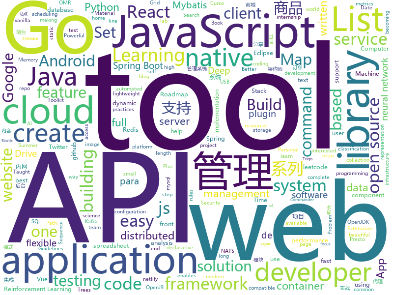

# 2019-07-31
See what the GitHub community is most excited about today.

## python
* [chromego](https://github.com/killgcd/chromego)(**66 stars today**): ChromeGo 翻墙工具包
* [Keras-BiGAN](https://github.com/manicman1999/Keras-BiGAN)(**25 stars today**): BiGAN implementation in Keras to detect similarities in Landscapes.
* [CppCoreGuidelines](https://github.com/isocpp/CppCoreGuidelines)(**22 stars today**): The C++ Core Guidelines are a set of tried-and-true guidelines, rules, and best practices about coding in C++
* [face_recognition](https://github.com/ageitgey/face_recognition)(**38 stars today**): The world's simplest facial recognition api for Python and the command line
* [Reinforcement-learning-with-tensorflow](https://github.com/MorvanZhou/Reinforcement-learning-with-tensorflow)(**12 stars today**): Simple Reinforcement learning tutorials
* [Orbit](https://github.com/s0md3v/Orbit)(**8 stars today**): Blockchain Transactions Investigation Tool
* [grapheneX](https://github.com/grapheneX/grapheneX)(**37 stars today**): Automated System Hardening Framework
* [coach](https://github.com/NervanaSystems/coach)(**5 stars today**): Reinforcement Learning Coach by Intel AI Lab enables easy experimentation with state of the art Reinforcement Learning algorithms
* [doccano](https://github.com/chakki-works/doccano)(**5 stars today**): Open source text annotation tool for machine learning practitioner.
* [HelloGitHub](https://github.com/521xueweihan/HelloGitHub)(**27 stars today**): Find pearls on open-source seashore 分享 GitHub 上有趣、入门级的开源项目
* [gnes](https://github.com/gnes-ai/gnes)(**16 stars today**): GNES is Generic Neural Elastic Search, a cloud-native semantic search system based on deep neural network.
* [kill-the-bits](https://github.com/facebookresearch/kill-the-bits)(**36 stars today**): Code for: "And the bit goes down: Revisiting the quantization of neural networks"
* [fairseq](https://github.com/pytorch/fairseq)(**74 stars today**): Facebook AI Research Sequence-to-Sequence Toolkit written in Python.
* [Aaia](https://github.com/rams3sh/Aaia)(**9 stars today**): AWS Identity and Access Management Visualizer and Anomaly Finder
* [torchdiffeq](https://github.com/rtqichen/torchdiffeq)(**5 stars today**): Differentiable ODE solvers with full GPU support and O(1)-memory backpropagation.
* [youtube-8m](https://github.com/google/youtube-8m)(**3 stars today**): Starter code for working with the YouTube-8M dataset.
* [wikiextractor](https://github.com/attardi/wikiextractor)(**6 stars today**): A tool for extracting plain text from Wikipedia dumps
* [pytorch-image-models](https://github.com/rwightman/pytorch-image-models)(**91 stars today**): PyTorch image models, scripts, pretrained weights -- (SE)ResNet/ResNeXT, DPN, EfficientNet, MixNet, MobileNet-V3/V2/V1, MNASNet, Single-Path NAS, FBNet, and more
* [usbrip](https://github.com/snovvcrash/usbrip)(**21 stars today**): Simple command line forensics tool for tracking USB device artifacts (history of USB events) on GNU/Linux
* [Mobile-Security-Framework-MobSF](https://github.com/MobSF/Mobile-Security-Framework-MobSF)(**4 stars today**): Mobile Security Framework is an automated, all-in-one mobile application (Android/iOS/Windows) pen-testing framework capable of performing static analysis, dynamic analysis, malware analysis and web API testing.
* [Jarvis](https://github.com/sukeesh/Jarvis)(**5 stars today**): Personal Assistant for Linux and macOS
* [django-rest-framework](https://github.com/encode/django-rest-framework)(**11 stars today**): Web APIs for Django.⚡️
* [twint](https://github.com/twintproject/twint)(**3 stars today**): An advanced Twitter scraping & OSINT tool written in Python that doesn't use Twitter's API, allowing you to scrape a user's followers, following, Tweets and more while evading most API limitations.
* [pwndbg](https://github.com/pwndbg/pwndbg)(**6 stars today**): Exploit Development and Reverse Engineering with GDB Made Easy
* [bert-as-service](https://github.com/hanxiao/bert-as-service)(**16 stars today**): Mapping a variable-length sentence to a fixed-length vector using BERT model

## java
* [resilience4j](https://github.com/resilience4j/resilience4j)(**16 stars today**): Resilience4j is a fault tolerance library designed for Java8 and functional programming
* [tutorials](https://github.com/eugenp/tutorials)(**32 stars today**): The "REST With Spring" Course:
* [xxl-job](https://github.com/xuxueli/xxl-job)(**33 stars today**): A lightweight distributed task scheduling framework.（分布式任务调度平台XXL-JOB）
* [mall](https://github.com/macrozheng/mall)(**82 stars today**): mall项目是一套电商系统，包括前台商城系统及后台管理系统，基于SpringBoot+MyBatis实现。 前台商城系统包含首页门户、商品推荐、商品搜索、商品展示、购物车、订单流程、会员中心、客户服务、帮助中心等模块。 后台管理系统包含商品管理、订单管理、会员管理、促销管理、运营管理、内容管理、统计报表、财务管理、权限管理、设置等模块。
* [presto](https://github.com/prestosql/presto)(**7 stars today**): Official home of the community version of Presto, the distributed SQL query engine for big data, under the auspices of the Presto Software Foundation.
* [redisson](https://github.com/redisson/redisson)(**14 stars today**): Redisson - Redis Java client with features of In-Memory Data Grid. Supports over 30 objects and services: Set, Multimap, SortedSet, Map, List, Queue, Deque, Semaphore, Lock, AtomicLong, Map Reduce, Publish / Subscribe, Bloom filter, Spring Cache, Tomcat, Scheduler, JCache API, Hibernate, RPC.
* [spring-boot-plus](https://github.com/geekidea/spring-boot-plus)(**31 stars today**): spring-boot-plus集成Spring Boot 2.1.6,Mybatis,Mybatis Plus,Druid,FastJson,Redis,Rabbit MQ,Kafka等，可使用代码生成器快速开发项目
* [android-developer-roadmap](https://github.com/MindorksOpenSource/android-developer-roadmap)(**76 stars today**): Android Developer Roadmap - A complete roadmap to learn Android App Development
* [quarkus](https://github.com/quarkusio/quarkus)(**12 stars today**): Quarkus: Supersonic Subatomic Java.
* [openj9](https://github.com/eclipse/openj9)(**14 stars today**): Eclipse OpenJ9: A Java Virtual Machine for OpenJDK that's optimized for small footprint, fast start-up, and high throughput. Builds on Eclipse OMR (https://github.com/eclipse/omr) and combines with the Extensions for OpenJDK for OpenJ9 repo.
* [micrometer](https://github.com/micrometer-metrics/micrometer)(**6 stars today**): An application metrics facade for the most popular monitoring tools. Think SLF4J, but for metrics.
* [canal](https://github.com/alibaba/canal)(**31 stars today**): 阿里巴巴 MySQL binlog 增量订阅&消费组件
* [react-native-camera](https://github.com/react-native-community/react-native-camera)(**7 stars today**): A Camera component for React Native. Also supports barcode scanning!
* [nacos](https://github.com/alibaba/nacos)(**31 stars today**): an easy-to-use dynamic service discovery, configuration and service management platform for building cloud native applications.
* [react-native-push-notification](https://github.com/zo0r/react-native-push-notification)(**6 stars today**): React Native Local and Remote Notifications
* [dbeaver](https://github.com/dbeaver/dbeaver)(**16 stars today**): Free universal database tool and SQL client
* [jib](https://github.com/GoogleContainerTools/jib)(**18 stars today**): 🏗Build container images for your Java applications.
* [maxwell](https://github.com/zendesk/maxwell)(**6 stars today**): Maxwell's daemon, a mysql-to-json kafka producer
* [RePlugin](https://github.com/Qihoo360/RePlugin)(**2 stars today**): RePlugin - A flexible, stable, easy-to-use Android Plug-in Framework
* [BaseRecyclerViewAdapterHelper](https://github.com/CymChad/BaseRecyclerViewAdapterHelper)(**19 stars today**): BRVAH:Powerful and flexible RecyclerAdapter
* [interview](https://github.com/mission-peace/interview)(**23 stars today**): Interview questions
* [Leetcode](https://github.com/fishercoder1534/Leetcode)(**6 stars today**): Complete solutions to Leetcode problems; updated daily. (I'm looking for long-term contributors/partners to this repo! Send me PRs if you're interested! - 9/5/2018)
* [HikariCP](https://github.com/brettwooldridge/HikariCP)(**16 stars today**): 光 HikariCP・A solid, high-performance, JDBC connection pool at last.
* [spring-security-react-ant-design-polls-app](https://github.com/callicoder/spring-security-react-ant-design-polls-app)(**8 stars today**): Full Stack Polls App built using Spring Boot, Spring Security, JWT, React, and Ant Design
* [ignite](https://github.com/apache/ignite)(**6 stars today**): Mirror of Apache Ignite

## unknown
* [A-to-Z-Resources-for-Students](https://github.com/dipakkr/A-to-Z-Resources-for-Students)(**163 stars today**): Curated list of resources for college students
* [learn-regex](https://github.com/ziishaned/learn-regex)(**91 stars today**): Learn regex the easy way
* [awesome-architecture](https://github.com/toutiaoio/awesome-architecture)(**597 stars today**): 架构师技术图谱，助你早日成为架构师
* [SlimYOLOv3](https://github.com/PengyiZhang/SlimYOLOv3)(**85 stars today**): This page is for the SlimYOLOv3: Narrower, Faster and Better for UAV Real-Time Applications
* [summer2020internships](https://github.com/elaine-zheng/summer2020internships)(**89 stars today**): Keep track of internships for Summer 2020 for undergraduates interested in tech./SWE/related fields
* [free-programming-books](https://github.com/EbookFoundation/free-programming-books)(**134 stars today**): 📚Freely available programming books
* [deep-learning-drizzle](https://github.com/kmario23/deep-learning-drizzle)(**67 stars today**): Drench yourself in Deep Learning, Reinforcement Learning, Machine Learning, Computer Vision, and NLP by learning from these exciting lectures!!
* [google-cloud-4-words](https://github.com/gregsramblings/google-cloud-4-words)(**48 stars today**): The Google Cloud Developer's Cheat Sheet
* [computer-science](https://github.com/ossu/computer-science)(**40 stars today**): 🎓Path to a free self-taught education in Computer Science!
* [Blog](https://github.com/mqyqingfeng/Blog)(**30 stars today**): 冴羽写博客的地方，预计写四个系列：JavaScript深入系列、JavaScript专题系列、ES6系列、React系列。
* [golang-developer-roadmap](https://github.com/Alikhll/golang-developer-roadmap)(**66 stars today**): Roadmap to becoming a Go developer in 2019
* [vagas](https://github.com/frontendbr/vagas)(**6 stars today**): 🔬Espaço para divulgação de vagas para front-enders.
* [awesome-graph-classification](https://github.com/benedekrozemberczki/awesome-graph-classification)(**51 stars today**): A collection of important graph embedding, classification and representation learning papers with implementations.
* [Emergency-Response-Notes](https://github.com/Bypass007/Emergency-Response-Notes)(**129 stars today**): 应急响应实战笔记，一个安全工程师的自我修养。
* [one-python-craftsman](https://github.com/piglei/one-python-craftsman)(**21 stars today**): 来自一位 Pythonista 的编程经验分享，内容涵盖编码技巧、最佳实践与思维模式等方面。
* [Beginner-Network-Pentesting](https://github.com/hmaverickadams/Beginner-Network-Pentesting)(**61 stars today**): Notes for Beginner Network Pentesting Course
* [Data-Science--Cheat-Sheet](https://github.com/abhat222/Data-Science--Cheat-Sheet)(**99 stars today**): Cheat Sheets
* [dragonstar2019](https://github.com/WGLab/dragonstar2019)(**10 stars today**): 
* [git-flight-rules](https://github.com/k88hudson/git-flight-rules)(**75 stars today**): Flight rules for git
* [AZ-300-MicrosoftAzureArchitectTechnologies](https://github.com/MicrosoftLearning/AZ-300-MicrosoftAzureArchitectTechnologies)(**4 stars today**): 
* [Flutter-Course-Resources](https://github.com/londonappbrewery/Flutter-Course-Resources)(**44 stars today**): 
* [You-Dont-Know-JS](https://github.com/getify/You-Dont-Know-JS)(**61 stars today**): A book series on JavaScript. @YDKJS on twitter.
* [happypandax](https://github.com/happypandax/happypandax)(**5 stars today**): A cross-platform server and client application for managing and reading manga and doujinshi
* [awesome-tensorflow](https://github.com/jtoy/awesome-tensorflow)(**11 stars today**): TensorFlow - A curated list of dedicated resources http://tensorflow.org
* [developer-roadmap](https://github.com/kamranahmedse/developer-roadmap)(**116 stars today**): Roadmap to becoming a web developer in 2019

## javascript
* [github-do-not-ban-us](https://github.com/1995parham/github-do-not-ban-us)(**1,128 stars today**): GitHub do not ban us from open source world🇮🇷
* [internships](https://github.com/Zackhardtoname/internships)(**35 stars today**): A collection of internship applications for the summer of 2020
* [gridstudio](https://github.com/ricklamers/gridstudio)(**149 stars today**): Grid studio is a web-based spreadsheet application with full integration of the Python programming language.
* [outline](https://github.com/outline/outline)(**214 stars today**): The fastest wiki and knowledge base for growing teams. Beautiful, feature rich, markdown compatible and open source.
* [NeteaseCloudMusicApi](https://github.com/Binaryify/NeteaseCloudMusicApi)(**72 stars today**): 网易云音乐 Node.js API service
* [react](https://github.com/facebook/react)(**84 stars today**): A declarative, efficient, and flexible JavaScript library for building user interfaces.
* [vue](https://github.com/vuejs/vue)(**104 stars today**): 🖖Vue.js is a progressive, incrementally-adoptable JavaScript framework for building UI on the web.
* [wtfjs](https://github.com/denysdovhan/wtfjs)(**43 stars today**): A list of funny and tricky JavaScript examples
* [google-access-helper](https://github.com/haotian-wang/google-access-helper)(**58 stars today**): 谷歌访问助手破解版
* [curso-javascript-ninja](https://github.com/da2k/curso-javascript-ninja)(**7 stars today**): Curso Javascript Ninja
* [daterangepicker](https://github.com/dangrossman/daterangepicker)(**11 stars today**): JavaScript Date Range, Date and Time Picker Component
* [jexcel](https://github.com/paulhodel/jexcel)(**143 stars today**): jExcel is a lightweight vanilla javascript plugin to create amazing web-based interactive tables and spreadsheets compatible with Excel or any other spreadsheet software.
* [bootstrap-vue](https://github.com/bootstrap-vue/bootstrap-vue)(**20 stars today**): BootstrapVue, with over 40 plugins and more than 75 custom components, provides one of the most comprehensive implementations of Bootstrap v4 components and grid system for Vue.js. With extensive and automated WAI-ARIA accessibility markup.
* [react-native-reanimated](https://github.com/kmagiera/react-native-reanimated)(**16 stars today**): React Native's Animated library reimplemented
* [leetcode](https://github.com/azl397985856/leetcode)(**56 stars today**): LeetCode Solutions: A Record of My Problem Solving Journey.( leetcode题解，记录自己的leetcode解题之路。)
* [tech-interview-handbook](https://github.com/yangshun/tech-interview-handbook)(**50 stars today**): 💯Materials to help you rock your next coding interview
* [computer-science-in-javascript](https://github.com/humanwhocodes/computer-science-in-javascript)(**17 stars today**): Collection of classic computer science paradigms, algorithms, and approaches written in JavaScript.
* [ch-download](https://github.com/alekseylovchikov/ch-download)(**30 stars today**): download video from coursehunters.net
* [nodeppt](https://github.com/ksky521/nodeppt)(**16 stars today**): This is probably the best web presentation tool so far!
* [create-nuxt-app](https://github.com/nuxt/create-nuxt-app)(**4 stars today**): Create Nuxt.js App in seconds.
* [vuepress](https://github.com/vuejs/vuepress)(**14 stars today**): 📝Minimalistic Vue-powered static site generator
* [ddd-fe-demo](https://github.com/Vincedream/ddd-fe-demo)(**28 stars today**): Domain-Driven Design for frontEnd demo
* [create-react-app](https://github.com/facebook/create-react-app)(**39 stars today**): Set up a modern web app by running one command.
* [cypress-example-recipes](https://github.com/cypress-io/cypress-example-recipes)(**0 stars today**): Various recipes for testing common scenarios with Cypress
* [fullPage.js](https://github.com/alvarotrigo/fullPage.js)(**16 stars today**): fullPage plugin by Alvaro Trigo. Create full screen pages fast and simple

## html
* [Java-Interview-Advanced](https://github.com/shishan100/Java-Interview-Advanced)(**12 stars today**): 中华石杉--互联网Java进阶面试训练营
* [intro.js](https://github.com/usablica/intro.js)(**12 stars today**): A better way for new feature introduction and step-by-step users guide for your website and project.
* [fastText](https://github.com/facebookresearch/fastText)(**23 stars today**): Library for fast text representation and classification.
* [JavaScript30](https://github.com/wesbos/JavaScript30)(**7 stars today**): 30 Day Vanilla JS Challenge
* [blog_os](https://github.com/phil-opp/blog_os)(**4 stars today**): Writing an OS in Rust
* [aws-well-architected-labs](https://github.com/awslabs/aws-well-architected-labs)(**1 stars today**): Hands on labs and code to help you learn, measure, and build using architectural best practices.
* [Front-end-Web-Development-Interview-Question](https://github.com/paddingme/Front-end-Web-Development-Interview-Question)(**5 stars today**): 前端开发面试题大收集，前端面试集锦❤️💝💘
* [qiubaiying.github.io](https://github.com/qiubaiying/qiubaiying.github.io)(**6 stars today**): BY Blog ->
* [sketch-measure](https://github.com/utom/sketch-measure)(**3 stars today**): Make it a fun to create spec for developers and teammates
* [tstp](https://github.com/calthoff/tstp)(**0 stars today**): This is an old repository for the exercises in "The Self-Taught Programmer." Please see /selftaught.
* [hyperblog](https://github.com/freddier/hyperblog)(**4 stars today**): Un blog increíble para el curso de Git y Github de Platzi
* [professional-services](https://github.com/GoogleCloudPlatform/professional-services)(**3 stars today**): Common solutions and tools developed by Google Cloud's Professional Services team
* [typedoc](https://github.com/TypeStrong/typedoc)(**3 stars today**): Documentation generator for TypeScript projects.
* [portainer](https://github.com/portainer/portainer)(**12 stars today**): Making Docker management easy.
* [jsr](https://github.com/mercyblitz/jsr)(**0 stars today**): Java Specification Requests
* [hugo-academic](https://github.com/gcushen/hugo-academic)(**2 stars today**): 📝The website builder for Hugo. Build and deploy a beautiful website in minutes!
* [flutter-in-action](https://github.com/flutterchina/flutter-in-action)(**35 stars today**): 《Flutter实战》电子书
* [blackeye](https://github.com/thelinuxchoice/blackeye)(**0 stars today**): The most complete Phishing Tool, with 32 templates +1 customizable
* [chosen](https://github.com/harvesthq/chosen)(**4 stars today**): Chosen is a library for making long, unwieldy select boxes more friendly.
* [personal-website](https://github.com/github/personal-website)(**4 stars today**): Code that'll help you kickstart a personal website that showcases your work as a software developer.
* [nndl.github.io](https://github.com/nndl/nndl.github.io)(**19 stars today**): 《神经网络与深度学习》 Neural Network and Deep Learning
* [html](https://github.com/whatwg/html)(**7 stars today**): HTML Standard
* [ng-alain](https://github.com/ng-alain/ng-alain)(**3 stars today**): NG-ZORRO admin panel front-end framework (netlify mirror https://netlify.ng-alain.com/)
* [quickstart-js](https://github.com/firebase/quickstart-js)(**2 stars today**): Firebase Quickstart Samples for Web
* [front-end-handbook-2019](https://github.com/FrontendMasters/front-end-handbook-2019)(**5 stars today**): [Book] 2019 edition of our front-end development handbook

## go
* [cobra](https://github.com/spf13/cobra)(**53 stars today**): A Commander for modern Go CLI interactions
* [consul](https://github.com/hashicorp/consul)(**30 stars today**): Consul is a distributed, highly available, and data center aware solution to connect and configure applications across dynamic, distributed infrastructure.
* [terraform](https://github.com/hashicorp/terraform)(**36 stars today**): Terraform enables you to safely and predictably create, change, and improve infrastructure. It is an open source tool that codifies APIs into declarative configuration files that can be shared amongst team members, treated as code, edited, reviewed, and versioned.
* [buildah](https://github.com/containers/buildah)(**23 stars today**): A tool that facilitates building OCI images
* [gotraining](https://github.com/ardanlabs/gotraining)(**94 stars today**): Go Training Class Material :
* [goconvey](https://github.com/smartystreets/goconvey)(**6 stars today**): Go testing in the browser. Integrates with `go test`. Write behavioral tests in Go.
* [testify](https://github.com/stretchr/testify)(**10 stars today**): A toolkit with common assertions and mocks that plays nicely with the standard library
* [nps](https://github.com/cnlh/nps)(**100 stars today**): 一款轻量级、功能强大的内网穿透代理服务器。支持tcp、udp流量转发，支持内网http代理、内网socks5代理，同时支持snappy压缩、站点保护、加密传输、多路复用、header修改等。支持web图形化管理，集成多用户模式。
* [coredns](https://github.com/coredns/coredns)(**11 stars today**): CoreDNS is a DNS server that chains plugins
* [sqlx](https://github.com/jmoiron/sqlx)(**10 stars today**): general purpose extensions to golang's database/sql
* [kubernetes](https://github.com/kubernetes/kubernetes)(**47 stars today**): Production-Grade Container Scheduling and Management
* [pq](https://github.com/lib/pq)(**15 stars today**): Pure Go Postgres driver for database/sql
* [libpod](https://github.com/containers/libpod)(**67 stars today**): libpod is a library used to create container pods. Home of Podman.
* [tyk](https://github.com/TykTechnologies/tyk)(**12 stars today**): Tyk Open Source API Gateway written in Go
* [mux](https://github.com/gorilla/mux)(**9 stars today**): A powerful HTTP router and URL matcher for building Go web servers with🦍
* [wire](https://github.com/google/wire)(**18 stars today**): Compile-time Dependency Injection for Go
* [gods](https://github.com/emirpasic/gods)(**23 stars today**): GoDS (Go Data Structures). Containers (Sets, Lists, Stacks, Maps, Trees), Sets (HashSet, TreeSet, LinkedHashSet), Lists (ArrayList, SinglyLinkedList, DoublyLinkedList), Stacks (LinkedListStack, ArrayStack), Maps (HashMap, TreeMap, HashBidiMap, TreeBidiMap, LinkedHashMap), Trees (RedBlackTree, AVLTree, BTree, BinaryHeap), Comparators, Iterators, …
* [tinygo](https://github.com/tinygo-org/tinygo)(**29 stars today**): Go compiler for small places. Microcontrollers, WebAssembly, and command-line tools. Based on LLVM.
* [redis](https://github.com/go-redis/redis)(**13 stars today**): Type-safe Redis client for Golang
* [nats-server](https://github.com/nats-io/nats-server)(**13 stars today**): High-Performance server for NATS, the cloud native messaging system.
* [nats-streaming-server](https://github.com/nats-io/nats-streaming-server)(**7 stars today**): NATS Streaming System Server
* [vault](https://github.com/hashicorp/vault)(**8 stars today**): A tool for secrets management, encryption as a service, and privileged access management
* [pg](https://github.com/go-pg/pg)(**5 stars today**): Golang ORM with focus on PostgreSQL features and performance
* [rclone](https://github.com/rclone/rclone)(**72 stars today**): "rsync for cloud storage" - Google Drive, Amazon Drive, S3, Dropbox, Backblaze B2, One Drive, Swift, Hubic, Cloudfiles, Google Cloud Storage, Yandex Files
* [govmomi](https://github.com/vmware/govmomi)(**3 stars today**): Go library for the VMware vSphere API

## WordCloud

