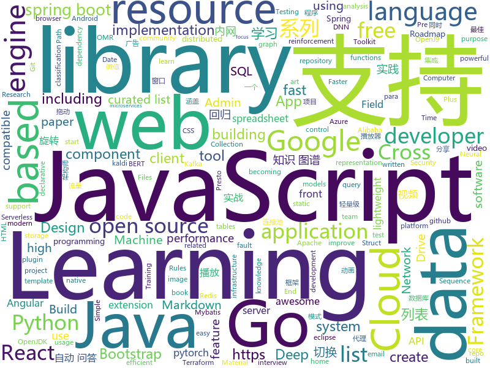

# 2019-08-01
See what the GitHub community is most excited about today.

## python
* [fairseq](https://github.com/pytorch/fairseq)(**103 stars today**): Facebook AI Research Sequence-to-Sequence Toolkit written in Python.
* [antialiased-cnns](https://github.com/adobe/antialiased-cnns)(**93 stars today**): Antialiasing cnns to improve stability and accuracy. In ICML 2019.
* [Chinese-BERT-wwm](https://github.com/ymcui/Chinese-BERT-wwm)(**66 stars today**): Pre-Training with Whole Word Masking for Chinese BERT（中文预训练BERT-wwm）
* [football](https://github.com/google-research/football)(**50 stars today**): 
* [pandas-profiling](https://github.com/pandas-profiling/pandas-profiling)(**19 stars today**): Create HTML profiling reports from pandas DataFrame objects
* [models](https://github.com/tensorflow/models)(**52 stars today**): Models and examples built with TensorFlow
* [kill-the-bits](https://github.com/facebookresearch/kill-the-bits)(**21 stars today**): Code for: "And the bit goes down: Revisiting the quantization of neural networks"
* [HelloGitHub](https://github.com/521xueweihan/HelloGitHub)(**38 stars today**): Find pearls on open-source seashore 分享 GitHub 上有趣、入门级的开源项目
* [pytorch-image-models](https://github.com/rwightman/pytorch-image-models)(**34 stars today**): PyTorch image models, scripts, pretrained weights -- (SE)ResNet/ResNeXT, DPN, EfficientNet, MixNet, MobileNet-V3/V2/V1, MNASNet, Single-Path NAS, FBNet, and more
* [pandas](https://github.com/pandas-dev/pandas)(**17 stars today**): Flexible and powerful data analysis / manipulation library for Python, providing labeled data structures similar to R data.frame objects, statistical functions, and much more
* [ERNIE](https://github.com/PaddlePaddle/ERNIE)(**103 stars today**): An Implementation of ERNIE For Language Understanding (including Pre-training models and Fine-tuning tools)
* [pytorch-kaldi](https://github.com/mravanelli/pytorch-kaldi)(**20 stars today**): pytorch-kaldi is a project for developing state-of-the-art DNN/RNN hybrid speech recognition systems. The DNN part is managed by pytorch, while feature extraction, label computation, and decoding are performed with the kaldi toolkit.
* [mypy](https://github.com/python/mypy)(**7 stars today**): Optional static typing for Python 3 and 2 (PEP 484)
* [apple_bleee](https://github.com/hexway/apple_bleee)(**30 stars today**): Apple BLE research
* [httpx](https://github.com/encode/httpx)(**36 stars today**): A next generation HTTP client for Python.🦋
* [Archery](https://github.com/hhyo/Archery)(**16 stars today**): SQL审核查询平台
* [youtube-dl](https://github.com/ytdl-org/youtube-dl)(**55 stars today**): Command-line program to download videos from YouTube.com and other video sites
* [QASystemOnMedicalKG](https://github.com/liuhuanyong/QASystemOnMedicalKG)(**11 stars today**): A tutorial and implement of disease centered Medical knowledge graph and qa system based on it。知识图谱构建，自动问答，基于kg的自动问答。以疾病为中心的一定规模医药领域知识图谱，并以该知识图谱完成自动问答与分析服务。
* [SPADE](https://github.com/NVlabs/SPADE)(**21 stars today**): Semantic Image Synthesis with SPADE
* [spinningup](https://github.com/openai/spinningup)(**14 stars today**): An educational resource to help anyone learn deep reinforcement learning.
* [FixRes](https://github.com/facebookresearch/FixRes)(**17 stars today**): This repository reproduces the results of the paper: "Fixing the train-test resolution discrepancy" https://arxiv.org/abs/1906.06423
* [keras](https://github.com/keras-team/keras)(**49 stars today**): Deep Learning for humans
* [awesome-edge-machine-learning](https://github.com/Bisonai/awesome-edge-machine-learning)(**16 stars today**): A curated list of awesome edge machine learning resources, including research papers, inference engines, challenges, books, meetups and others.
* [cloud-custodian](https://github.com/cloud-custodian/cloud-custodian)(**6 stars today**): Rules engine for cloud security, cost optimization, and governance, DSL in yaml for policies to query, filter, and take actions on resources

## java
* [spring-boot-plus](https://github.com/geekidea/spring-boot-plus)(**173 stars today**): 🔥spring-boot-plus集成Spring Boot 2.1.6,Mybatis,Mybatis Plus,Druid,FastJson,Redis,Rabbit MQ,Kafka等，可使用代码生成器快速开发项目🚀
* [android-developer-roadmap](https://github.com/MindorksOpenSource/android-developer-roadmap)(**98 stars today**): Android Developer Roadmap - A complete roadmap to learn Android App Development
* [GSYVideoPlayer](https://github.com/CarGuo/GSYVideoPlayer)(**100 stars today**): 视频播放器（IJKplayer、ExoPlayer、MediaPlayer），HTTPS，支持弹幕，支持滤镜、水印、gif截图，片头广告、中间广告，多个同时播放，支持基本的拖动，声音、亮度调节，支持边播边缓存，支持视频自带rotation的旋转（90,270之类），重力旋转与手动旋转的同步支持，支持列表播放 ，列表全屏动画，视频加载速度，列表小窗口支持拖动，动画效果，调整比例，多分辨率切换，支持切换播放器，进度条小窗口预览，列表切换详情页面无缝播放，rtsp、concat、mpeg。
* [beam](https://github.com/apache/beam)(**33 stars today**): Apache Beam
* [JavaGuide](https://github.com/Snailclimb/JavaGuide)(**146 stars today**): 【Java学习+面试指南】 一份涵盖大部分Java程序员所需要掌握的核心知识。
* [springboot-learning-example](https://github.com/JeffLi1993/springboot-learning-example)(**35 stars today**): spring boot 实践学习案例，是 spring boot 初学者及核心技术巩固的最佳实践。
* [google-cloud-java](https://github.com/googleapis/google-cloud-java)(**4 stars today**): Google Cloud Client Library for Java
* [kafka-connect-jdbc](https://github.com/confluentinc/kafka-connect-jdbc)(**4 stars today**): Kafka Connect connector for JDBC-compatible databases
* [elasticsearch](https://github.com/elastic/elasticsearch)(**39 stars today**): Open Source, Distributed, RESTful Search Engine
* [seata](https://github.com/seata/seata)(**49 stars today**): 🔥Seata is an easy-to-use, high-performance, open source distributed transaction solution.
* [resilience4j](https://github.com/resilience4j/resilience4j)(**17 stars today**): Resilience4j is a fault tolerance library designed for Java8 and functional programming
* [spring-data-elasticsearch](https://github.com/spring-projects/spring-data-elasticsearch)(**7 stars today**): Provide support to increase developer productivity in Java when using Elasticsearch. Uses familiar Spring concepts such as a template classes for core API usage and lightweight repository style data access.
* [ksql](https://github.com/confluentinc/ksql)(**1 stars today**): KSQL - the Streaming SQL Engine for Apache Kafka
* [closure-compiler](https://github.com/google/closure-compiler)(**5 stars today**): A JavaScript checker and optimizer.
* [arthas](https://github.com/alibaba/arthas)(**63 stars today**): Alibaba Java Diagnostic Tool Arthas/Alibaba Java诊断利器Arthas
* [presto](https://github.com/prestosql/presto)(**4 stars today**): Official home of the community version of Presto, the distributed SQL query engine for big data, under the auspices of the Presto Software Foundation.
* [ExoPlayer](https://github.com/google/ExoPlayer)(**16 stars today**): An extensible media player for Android
* [spring-security-react-ant-design-polls-app](https://github.com/callicoder/spring-security-react-ant-design-polls-app)(**5 stars today**): Full Stack Polls App built using Spring Boot, Spring Security, JWT, React, and Ant Design
* [guava](https://github.com/google/guava)(**26 stars today**): Google core libraries for Java
* [openj9](https://github.com/eclipse/openj9)(**2 stars today**): Eclipse OpenJ9: A Java Virtual Machine for OpenJDK that's optimized for small footprint, fast start-up, and high throughput. Builds on Eclipse OMR (https://github.com/eclipse/omr) and combines with the Extensions for OpenJDK for OpenJ9 repo.
* [karate](https://github.com/intuit/karate)(**5 stars today**): Web-Services Testing Made Simple
* [tutorials](https://github.com/eugenp/tutorials)(**36 stars today**): The "REST With Spring" Course:
* [DependencyCheck](https://github.com/jeremylong/DependencyCheck)(**2 stars today**): OWASP dependency-check is a software composition analysis utility that detects publicly disclosed vulnerabilities in application dependencies.
* [Sentinel](https://github.com/alibaba/Sentinel)(**24 stars today**): A lightweight powerful flow control component enabling reliability and monitoring for microservices. (轻量级的流量控制、熔断降级 Java 库)
* [druid](https://github.com/alibaba/druid)(**25 stars today**): 阿里巴巴数据库事业部出品，为监控而生的数据库连接池。阿里云Data Lake Analytics(https://www.aliyun.com/product/datalakeanalytics )、DRDS、TDDL 连接池powered by Druid

## unknown
* [A-to-Z-Resources-for-Students](https://github.com/dipakkr/A-to-Z-Resources-for-Students)(**179 stars today**): Curated list of resources for college students
* [learn-regex](https://github.com/ziishaned/learn-regex)(**291 stars today**): Learn regex the easy way
* [awesome-architecture](https://github.com/toutiaoio/awesome-architecture)(**474 stars today**): 架构师技术图谱，助你早日成为架构师
* [SlimYOLOv3](https://github.com/PengyiZhang/SlimYOLOv3)(**49 stars today**): This page is for the SlimYOLOv3: Narrower, Faster and Better for UAV Real-Time Applications
* [summer2020internships](https://github.com/elaine-zheng/summer2020internships)(**68 stars today**): Keep track of internships for Summer 2020 for undergraduates interested in tech./SWE/related fields
* [free-programming-books](https://github.com/EbookFoundation/free-programming-books)(**113 stars today**): 📚Freely available programming books
* [deep-learning-drizzle](https://github.com/kmario23/deep-learning-drizzle)(**70 stars today**): Drench yourself in Deep Learning, Reinforcement Learning, Machine Learning, Computer Vision, and NLP by learning from these exciting lectures!!
* [google-cloud-4-words](https://github.com/gregsramblings/google-cloud-4-words)(**67 stars today**): The Google Cloud Developer's Cheat Sheet
* [computer-science](https://github.com/ossu/computer-science)(**35 stars today**): 🎓Path to a free self-taught education in Computer Science!
* [Blog](https://github.com/mqyqingfeng/Blog)(**16 stars today**): 冴羽写博客的地方，预计写四个系列：JavaScript深入系列、JavaScript专题系列、ES6系列、React系列。
* [golang-developer-roadmap](https://github.com/Alikhll/golang-developer-roadmap)(**33 stars today**): Roadmap to becoming a Go developer in 2019
* [vagas](https://github.com/frontendbr/vagas)(**4 stars today**): 🔬Espaço para divulgação de vagas para front-enders.
* [awesome-graph-classification](https://github.com/benedekrozemberczki/awesome-graph-classification)(**14 stars today**): A collection of important graph embedding, classification and representation learning papers with implementations.
* [Emergency-Response-Notes](https://github.com/Bypass007/Emergency-Response-Notes)(**41 stars today**): 应急响应实战笔记，一个安全工程师的自我修养。
* [one-python-craftsman](https://github.com/piglei/one-python-craftsman)(**25 stars today**): 来自一位 Pythonista 的编程经验分享，内容涵盖编码技巧、最佳实践与思维模式等方面。
* [Beginner-Network-Pentesting](https://github.com/hmaverickadams/Beginner-Network-Pentesting)(**67 stars today**): Notes for Beginner Network Pentesting Course
* [Data-Science--Cheat-Sheet](https://github.com/abhat222/Data-Science--Cheat-Sheet)(**44 stars today**): Cheat Sheets
* [dragonstar2019](https://github.com/WGLab/dragonstar2019)(**5 stars today**): 
* [git-flight-rules](https://github.com/k88hudson/git-flight-rules)(**19 stars today**): Flight rules for git
* [AZ-300-MicrosoftAzureArchitectTechnologies](https://github.com/MicrosoftLearning/AZ-300-MicrosoftAzureArchitectTechnologies)(**1 stars today**): 
* [Flutter-Course-Resources](https://github.com/londonappbrewery/Flutter-Course-Resources)(**10 stars today**): 
* [You-Dont-Know-JS](https://github.com/getify/You-Dont-Know-JS)(**59 stars today**): A book series on JavaScript. @YDKJS on twitter.
* [happypandax](https://github.com/happypandax/happypandax)(**1 stars today**): A cross-platform server and client application for managing and reading manga and doujinshi
* [awesome-tensorflow](https://github.com/jtoy/awesome-tensorflow)(**15 stars today**): TensorFlow - A curated list of dedicated resources http://tensorflow.org
* [developer-roadmap](https://github.com/kamranahmedse/developer-roadmap)(**91 stars today**): Roadmap to becoming a web developer in 2019

## javascript
* [ch-download](https://github.com/alekseylovchikov/ch-download)(**20 stars today**): download video from coursehunters.net
* [jexcel](https://github.com/paulhodel/jexcel)(**113 stars today**): jExcel is a lightweight vanilla javascript plugin to create amazing web-based interactive tables and spreadsheets compatible with Excel or any other spreadsheet software.
* [daterangepicker](https://github.com/dangrossman/daterangepicker)(**18 stars today**): JavaScript Date Range, Date and Time Picker Component
* [material-ui](https://github.com/mui-org/material-ui)(**33 stars today**): React components for faster and easier web development. Build your own design system, or start with Material Design.
* [outline](https://github.com/outline/outline)(**172 stars today**): The fastest wiki and knowledge base for growing teams. Beautiful, feature rich, markdown compatible and open source.
* [react-native](https://github.com/facebook/react-native)(**39 stars today**): A framework for building native apps with React.
* [react](https://github.com/facebook/react)(**87 stars today**): A declarative, efficient, and flexible JavaScript library for building user interfaces.
* [MikuTools](https://github.com/Ice-Hazymoon/MikuTools)(**44 stars today**): 一个轻量的工具集合
* [markdown-here](https://github.com/adam-p/markdown-here)(**25 stars today**): Google Chrome, Firefox, and Thunderbird extension that lets you write email in Markdown and render it before sending.
* [iptv](https://github.com/freearhey/iptv)(**35 stars today**): Collection of 7000+ free IPTV channels from all over the world
* [Sortable](https://github.com/SortableJS/Sortable)(**21 stars today**): Sortable — is a JavaScript library for reorderable drag-and-drop lists on modern browsers and touch devices. No jQuery required. Supports Meteor, AngularJS, React, Polymer, Vue, Ember, Knockout and any CSS library, e.g. Bootstrap.
* [FileSaver.js](https://github.com/eligrey/FileSaver.js)(**31 stars today**): An HTML5 saveAs() FileSaver implementation
* [google-access-helper](https://github.com/haotian-wang/google-access-helper)(**60 stars today**): 谷歌访问助手破解版
* [omi](https://github.com/Tencent/omi)(**8 stars today**): Front End Cross-Frameworks Framework - 前端跨框架跨平台框架
* [gridstudio](https://github.com/ricklamers/gridstudio)(**914 stars today**): Grid studio is a web-based spreadsheet application with full integration of the Python programming language.
* [wechat-app-mall](https://github.com/EastWorld/wechat-app-mall)(**28 stars today**): 微信小程序商城，微信小程序微店
* [serverless](https://github.com/serverless/serverless)(**29 stars today**): Serverless Framework – Build web, mobile and IoT applications with serverless architectures using AWS Lambda, Azure Functions, Google CloudFunctions & more! –
* [react-static](https://github.com/react-static/react-static)(**15 stars today**): ⚛️🚀A progressive static site generator for React.
* [yarn](https://github.com/yarnpkg/yarn)(**8 stars today**): 📦🐈Fast, reliable, and secure dependency management.
* [react-table](https://github.com/tannerlinsley/react-table)(**18 stars today**): ⚛️Hooks for building fast and extendable tables and datagrids for React
* [jest](https://github.com/facebook/jest)(**23 stars today**): Delightful JavaScript Testing.
* [curso-javascript-ninja](https://github.com/da2k/curso-javascript-ninja)(**4 stars today**): Curso Javascript Ninja
* [wtfjs](https://github.com/denysdovhan/wtfjs)(**33 stars today**): A list of funny and tricky JavaScript examples
* [amphtml](https://github.com/ampproject/amphtml)(**4 stars today**): The AMP web component framework.
* [puppeteer-extra](https://github.com/berstend/puppeteer-extra)(**14 stars today**): 💯Teach puppeteer new tricks through plugins.

## html
* [fastText](https://github.com/facebookresearch/fastText)(**26 stars today**): Library for fast text representation and classification.
* [awesome-creative-coding](https://github.com/terkelg/awesome-creative-coding)(**9 stars today**): Creative Coding: Generative Art, Data visualization, Interaction Design, Resources.
* [MatBlazor](https://github.com/SamProf/MatBlazor)(**8 stars today**): Material Design components for Blazor and Razor Components
* [responsive-html-email-template](https://github.com/leemunroe/responsive-html-email-template)(**3 stars today**): A free simple responsive HTML email template
* [dash-sample-apps](https://github.com/plotly/dash-sample-apps)(**4 stars today**): Apps hosted in the Dash Gallery
* [data_analysis](https://github.com/zhouwei713/data_analysis)(**2 stars today**): 一些数据分析相关实战练习
* [awesome-angular](https://github.com/PatrickJS/awesome-angular)(**3 stars today**): 📄A curated list of awesome Angular resources
* [learning-area](https://github.com/mdn/learning-area)(**3 stars today**): Github repo for the MDN Learning Area.
* [web-moderno](https://github.com/cod3rcursos/web-moderno)(**2 stars today**): 
* [AdminLTE](https://github.com/ColorlibHQ/AdminLTE)(**37 stars today**): AdminLTE - Free Premium Admin control Panel Theme Based On Bootstrap 3.x
* [wpt](https://github.com/web-platform-tests/wpt)(**3 stars today**): Test suites for Web platform specs — including WHATWG, W3C, and others
* [bitcoin-whitepaper-chinese-translation](https://github.com/xiaolai/bitcoin-whitepaper-chinese-translation)(**3 stars today**): 
* [gentelella](https://github.com/ColorlibHQ/gentelella)(**11 stars today**): Free Bootstrap 3 Admin Template
* [stickyfill](https://github.com/wilddeer/stickyfill)(**2 stars today**): Polyfill for CSS `position: sticky`
* [screenfull.js](https://github.com/sindresorhus/screenfull.js)(**5 stars today**): Simple wrapper for cross-browser usage of the JavaScript Fullscreen API
* [indigo](https://github.com/sergiokopplin/indigo)(**2 stars today**): 🍜Minimalist Jekyll Template
* [polyfills](https://github.com/webcomponents/polyfills)(**4 stars today**): Webcomponents polyfills monorepo
* [country-list](https://github.com/umpirsky/country-list)(**3 stars today**): 🌐List of all countries with names and ISO 3166-1 codes in all languages and data formats.
* [git-it-electron](https://github.com/jlord/git-it-electron)(**1 stars today**): 💻🎓Git-it is a (Mac, Win, Linux) Desktop App for Learning Git and GitHub
* [Front-end-Developer-Interview-Questions](https://github.com/h5bp/Front-end-Developer-Interview-Questions)(**16 stars today**): A list of helpful front-end related questions you can use to interview potential candidates, test yourself or completely ignore.
* [node-interview](https://github.com/ElemeFE/node-interview)(**10 stars today**): How to pass the Node.js interview of ElemeFE.
* [nndl.github.io](https://github.com/nndl/nndl.github.io)(**28 stars today**): 《神经网络与深度学习》 Neural Network and Deep Learning
* [Machine-Learning](https://github.com/Jack-Cherish/Machine-Learning)(**5 stars today**): ⚡️机器学习实战（Python3）：kNN、决策树、贝叶斯、逻辑回归、SVM、线性回归、树回归
* [Markdown-Resume](https://github.com/CyC2018/Markdown-Resume)(**1 stars today**): ⭐️Markdown 简历模版
* [coreui-free-angular-admin-template](https://github.com/coreui/coreui-free-angular-admin-template)(**1 stars today**): CoreUI Angular is free Angular 2+ admin template based on Bootstrap 4

## go
* [liftbridge](https://github.com/liftbridge-io/liftbridge)(**61 stars today**): Lightweight, fault-tolerant message streams.
* [nats-server](https://github.com/nats-io/nats-server)(**13 stars today**): High-Performance server for NATS, the cloud native messaging system.
* [terraform](https://github.com/hashicorp/terraform)(**57 stars today**): Terraform enables you to safely and predictably create, change, and improve infrastructure. It is an open source tool that codifies APIs into declarative configuration files that can be shared amongst team members, treated as code, edited, reviewed, and versioned.
* [nps](https://github.com/cnlh/nps)(**90 stars today**): 一款轻量级、功能强大的内网穿透代理服务器。支持tcp、udp流量转发，支持内网http代理、内网socks5代理，同时支持snappy压缩、站点保护、加密传输、多路复用、header修改等。支持web图形化管理，集成多用户模式。
* [kafka-go](https://github.com/segmentio/kafka-go)(**11 stars today**): Kafka library in Go
* [opa](https://github.com/open-policy-agent/opa)(**6 stars today**): An open source, general-purpose policy engine.
* [terraform-provider-azurerm](https://github.com/terraform-providers/terraform-provider-azurerm)(**2 stars today**): Terraform provider for Azure Resource Manager
* [test-infra](https://github.com/kubernetes/test-infra)(**5 stars today**): Test infrastructure for the Kubernetes project.
* [libpod](https://github.com/containers/libpod)(**20 stars today**): libpod is a library used to create container pods. Home of Podman.
* [grpc-go](https://github.com/grpc/grpc-go)(**14 stars today**): The Go language implementation of gRPC. HTTP/2 based RPC
* [buildah](https://github.com/containers/buildah)(**16 stars today**): A tool that facilitates building OCI images
* [sqlx](https://github.com/jmoiron/sqlx)(**8 stars today**): general purpose extensions to golang's database/sql
* [aws-sdk-go](https://github.com/aws/aws-sdk-go)(**2 stars today**): AWS SDK for the Go programming language.
* [protobuf](https://github.com/gogo/protobuf)(**7 stars today**): Protocol Buffers for Go with Gadgets
* [validator](https://github.com/go-playground/validator)(**11 stars today**): 💯Go Struct and Field validation, including Cross Field, Cross Struct, Map, Slice and Array diving
* [community](https://github.com/kubernetes/community)(**10 stars today**): Kubernetes community content
* [redis](https://github.com/go-redis/redis)(**13 stars today**): Type-safe Redis client for Golang
* [pg](https://github.com/go-pg/pg)(**9 stars today**): Golang ORM with focus on PostgreSQL features and performance
* [cobra](https://github.com/spf13/cobra)(**35 stars today**): A Commander for modern Go CLI interactions
* [client_golang](https://github.com/prometheus/client_golang)(**4 stars today**): Prometheus instrumentation library for Go applications
* [roadrunner](https://github.com/spiral/roadrunner)(**11 stars today**): High-performance PHP application server, load-balancer and process manager written in Golang
* [go-collection](https://github.com/jiujuan/go-collection)(**16 stars today**): awesome awesome go
* [buildkit](https://github.com/moby/buildkit)(**8 stars today**): concurrent, cache-efficient, and Dockerfile-agnostic builder toolkit
* [loki](https://github.com/grafana/loki)(**25 stars today**): Like Prometheus, but for logs.
* [rclone](https://github.com/rclone/rclone)(**19 stars today**): "rsync for cloud storage" - Google Drive, Amazon Drive, S3, Dropbox, Backblaze B2, One Drive, Swift, Hubic, Cloudfiles, Google Cloud Storage, Yandex Files

## WordCloud

