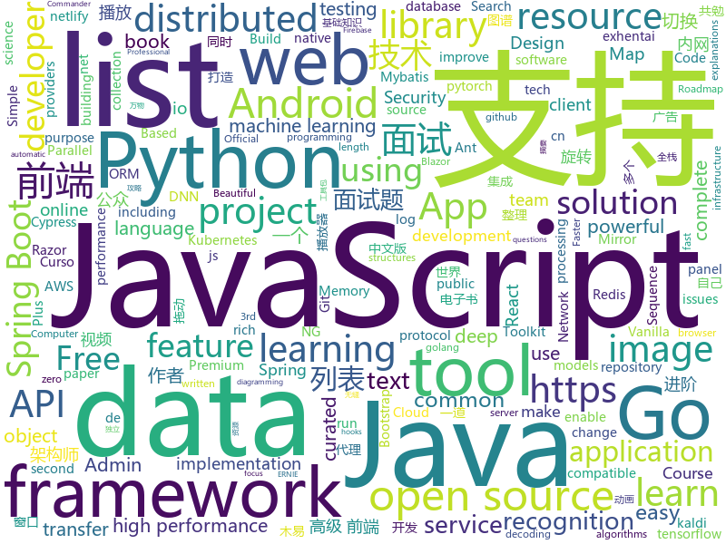

# 2019-08-02
See what the GitHub community is most excited about today.

## python
* [UGATIT](https://github.com/taki0112/UGATIT)(**109 stars today**): Official Tensorflow implementation of U-GAT-IT: Unsupervised Generative Attentional Networks with Adaptive Layer-Instance Normalization for Image-to-Image Translation
* [fairseq](https://github.com/pytorch/fairseq)(**95 stars today**): Facebook AI Research Sequence-to-Sequence Toolkit written in Python.
* [httpx](https://github.com/encode/httpx)(**173 stars today**): A next generation HTTP client for Python.🦋
* [chromego](https://github.com/killgcd/chromego)(**70 stars today**): ChromeGo 翻墙工具包
* [mlflow](https://github.com/mlflow/mlflow)(**7 stars today**): Open source platform for the machine learning lifecycle
* [pipelines](https://github.com/kubeflow/pipelines)(**5 stars today**): Machine Learning Pipelines for Kubeflow
* [bert-as-service](https://github.com/hanxiao/bert-as-service)(**17 stars today**): Mapping a variable-length sentence to a fixed-length vector using BERT model
* [doccano](https://github.com/chakki-works/doccano)(**4 stars today**): Open source text annotation tool for machine learning practitioner.
* [prefect](https://github.com/PrefectHQ/prefect)(**10 stars today**): The Prefect Core workflow engine
* [ERNIE](https://github.com/PaddlePaddle/ERNIE)(**63 stars today**): An Implementation of ERNIE For Language Understanding (including Pre-training models and Fine-tuning tools)
* [face_recognition](https://github.com/ageitgey/face_recognition)(**41 stars today**): The world's simplest facial recognition api for Python and the command line
* [antialiased-cnns](https://github.com/adobe/antialiased-cnns)(**85 stars today**): Antialiasing cnns to improve stability and accuracy. In ICML 2019.
* [football](https://github.com/google-research/football)(**23 stars today**): 
* [pytorch-kaldi](https://github.com/mravanelli/pytorch-kaldi)(**14 stars today**): pytorch-kaldi is a project for developing state-of-the-art DNN/RNN hybrid speech recognition systems. The DNN part is managed by pytorch, while feature extraction, label computation, and decoding are performed with the kaldi toolkit.
* [deep-text-recognition-benchmark](https://github.com/clovaai/deep-text-recognition-benchmark)(**6 stars today**): Text recognition (optical character recognition) with deep learning methods.
* [dask](https://github.com/dask/dask)(**13 stars today**): Parallel computing with task scheduling
* [Archery](https://github.com/hhyo/Archery)(**3 stars today**): SQL 审核查询平台
* [attention](https://github.com/bojone/attention)(**3 stars today**): some attention implements
* [studyFiles](https://github.com/threerocks/studyFiles)(**57 stars today**): 一些经典且高质量的电子书分享
* [synapse](https://github.com/matrix-org/synapse)(**4 stars today**): Synapse: Matrix reference homeserver
* [Interview-code-practice-python](https://github.com/leeguandong/Interview-code-practice-python)(**10 stars today**): 面试题
* [public-apis](https://github.com/public-apis/public-apis)(**28 stars today**): A collective list of free APIs for use in software and web development.
* [spinningup](https://github.com/openai/spinningup)(**10 stars today**): An educational resource to help anyone learn deep reinforcement learning.
* [connexion](https://github.com/zalando/connexion)(**5 stars today**): Swagger/OpenAPI First framework for Python on top of Flask with automatic endpoint validation & OAuth2 support

## java
* [arthas](https://github.com/alibaba/arthas)(**131 stars today**): Alibaba Java Diagnostic Tool Arthas/Alibaba Java诊断利器Arthas
* [data-transfer-project](https://github.com/google/data-transfer-project)(**93 stars today**): The Data Transfer Project makes it easy for people to transfer their data between online service providers. We are establishing a common framework, including data models and protocols, to enable direct transfer of data both into and out of participating online service providers.
* [quickstart-android](https://github.com/firebase/quickstart-android)(**38 stars today**): Firebase Quickstart Samples for Android
* [GSYVideoPlayer](https://github.com/CarGuo/GSYVideoPlayer)(**49 stars today**): 视频播放器（IJKplayer、ExoPlayer、MediaPlayer），HTTPS，支持弹幕，支持滤镜、水印、gif截图，片头广告、中间广告，多个同时播放，支持基本的拖动，声音、亮度调节，支持边播边缓存，支持视频自带rotation的旋转（90,270之类），重力旋转与手动旋转的同步支持，支持列表播放 ，列表全屏动画，视频加载速度，列表小窗口支持拖动，动画效果，调整比例，多分辨率切换，支持切换播放器，进度条小窗口预览，列表切换详情页面无缝播放，rtsp、concat、mpeg。
* [CS-Notes](https://github.com/CyC2018/CS-Notes)(**177 stars today**): 📚Tech Interview Guide 技术面试必备基础知识、Leetcode 题解、Java、C++、Python、后端面试、操作系统、计算机网络、系统设计
* [spring-boot-plus](https://github.com/geekidea/spring-boot-plus)(**57 stars today**): 🔥spring-boot-plus集成Spring Boot 2.1.6,Mybatis,Mybatis Plus,Druid,FastJson,Redis,Rabbit MQ,Kafka等，可使用代码生成器快速开发项目🚀
* [debezium](https://github.com/debezium/debezium)(**8 stars today**): Change data capture for a variety of databases. https://debezium.io Please log issues in our JIRA at https://issues.jboss.org/projects/DBZ/issues
* [schema-registry](https://github.com/confluentinc/schema-registry)(**0 stars today**): Confluent Schema Registry for Kafka
* [tutorials](https://github.com/eugenp/tutorials)(**39 stars today**): The "REST With Spring" Course:
* [SmartSwipe](https://github.com/luckybilly/SmartSwipe)(**98 stars today**): An android library to make swipe more easier and more powerful. 关于侧滑，有这一个就够了
* [jib](https://github.com/GoogleContainerTools/jib)(**9 stars today**): 🏗Build container images for your Java applications.
* [canal](https://github.com/alibaba/canal)(**21 stars today**): 阿里巴巴 MySQL binlog 增量订阅&消费组件
* [skywalking](https://github.com/apache/skywalking)(**19 stars today**): APM, Application Performance Monitoring System
* [android-developer-roadmap](https://github.com/MindorksOpenSource/android-developer-roadmap)(**107 stars today**): Android Developer Roadmap - A complete roadmap to learn Android App Development
* [elasticsearch](https://github.com/elastic/elasticsearch)(**35 stars today**): Open Source, Distributed, RESTful Search Engine
* [DataX](https://github.com/alibaba/DataX)(**13 stars today**): 
* [quarkus](https://github.com/quarkusio/quarkus)(**3 stars today**): Quarkus: Supersonic Subatomic Java.
* [graal](https://github.com/oracle/graal)(**9 stars today**): GraalVM: Run Programs Faster Anywhere🚀
* [spring-boot](https://github.com/spring-projects/spring-boot)(**29 stars today**): Spring Boot
* [seata](https://github.com/seata/seata)(**28 stars today**): 🔥Seata is an easy-to-use, high-performance, open source distributed transaction solution.
* [ignite](https://github.com/apache/ignite)(**0 stars today**): Mirror of Apache Ignite
* [spring-security-react-ant-design-polls-app](https://github.com/callicoder/spring-security-react-ant-design-polls-app)(**4 stars today**): Full Stack Polls App built using Spring Boot, Spring Security, JWT, React, and Ant Design
* [AndroidUtilCode](https://github.com/Blankj/AndroidUtilCode)(**32 stars today**): 🔥Android developers should collect the following utils(updating).
* [CainCamera](https://github.com/CainKernel/CainCamera)(**19 stars today**): CainCamera is an Android Project to learn about development of beauty camera, image and short video
* [redisson](https://github.com/redisson/redisson)(**11 stars today**): Redisson - Redis Java client with features of In-Memory Data Grid. Supports over 30 objects and services: Set, Multimap, SortedSet, Map, List, Queue, Deque, Semaphore, Lock, AtomicLong, Map Reduce, Publish / Subscribe, Bloom filter, Spring Cache, Tomcat, Scheduler, JCache API, Hibernate, RPC.

## unknown
* [learn-regex](https://github.com/ziishaned/learn-regex)(**400 stars today**): Learn regex the easy way
* [Beginner-Network-Pentesting](https://github.com/hmaverickadams/Beginner-Network-Pentesting)(**60 stars today**): Notes for Beginner Network Pentesting Course
* [coding-interview-university](https://github.com/jwasham/coding-interview-university)(**371 stars today**): A complete computer science study plan to become a software engineer.
* [awesome-architecture](https://github.com/toutiaoio/awesome-architecture)(**436 stars today**): 架构师技术图谱，助你早日成为架构师
* [awesome-indie](https://github.com/josephchang10/awesome-indie)(**145 stars today**): awesome-indie 中文版 - 帮助独立开发者赚钱的资源整理
* [A-to-Z-Resources-for-Students](https://github.com/dipakkr/A-to-Z-Resources-for-Students)(**85 stars today**): Curated list of resources for college students
* [books](https://github.com/programthink/books)(**17 stars today**): 【编程随想】收藏的电子书清单（多个学科，含下载链接）
* [awesome-blazor](https://github.com/AdrienTorris/awesome-blazor)(**27 stars today**): Resources for Blazor, a .NET web framework using C#/Razor and HTML that runs in the browser with WebAssembly.
* [deep_learning_object_detection](https://github.com/hoya012/deep_learning_object_detection)(**16 stars today**): A paper list of object detection using deep learning.
* [StabilityGuide](https://github.com/StabilityMan/StabilityGuide)(**166 stars today**): 【稳定大于一切】打造国内稳定性领域知识库，让无法解决的问题少一点，让世界的确定性多一点。
* [aws-cloudformation-coverage-roadmap](https://github.com/aws-cloudformation/aws-cloudformation-coverage-roadmap)(**64 stars today**): The AWS CloudFormation Public Coverage Roadmap
* [developer-roadmap](https://github.com/kamranahmedse/developer-roadmap)(**75 stars today**): Roadmap to becoming a web developer in 2019
* [Android-Daily-Interview](https://github.com/Moosphan/Android-Daily-Interview)(**429 stars today**): 每工作日更新一道 Android 面试题，小聚成河，大聚成江，共勉之～
* [awesome-point-cloud-analysis](https://github.com/Yochengliu/awesome-point-cloud-analysis)(**24 stars today**): A list of papers and datasets about point cloud analysis (processing)
* [Emergency-Response-Notes](https://github.com/Bypass007/Emergency-Response-Notes)(**92 stars today**): 应急响应实战笔记，一个安全工程师的自我修养。
* [blog](https://github.com/yygmind/blog)(**31 stars today**): 我是木易杨，公众号「高级前端进阶」作者，跟着我每周重点攻克一个前端面试重难点。接下来让我带你走进高级前端的世界，在进阶的路上，共勉！
* [technology_books](https://github.com/arpitjindal97/technology_books)(**195 stars today**): Premium eBook free for Geeks
* [javascript-questions](https://github.com/lydiahallie/javascript-questions)(**73 stars today**): A long list of (advanced) JavaScript questions, and their explanations✨Updated weekly!
* [You-Dont-Know-JS](https://github.com/getify/You-Dont-Know-JS)(**73 stars today**): A book series on JavaScript. @YDKJS on twitter.
* [The-Hundred-Page-Machine-Learning-Book](https://github.com/ZakiaSalod/The-Hundred-Page-Machine-Learning-Book)(**4 stars today**): This repository contains the draft PDF copies of the book: The 100 Page Machine Learning Book
* [weekly](https://github.com/dt-fe/weekly)(**32 stars today**): 前端精读周刊
* [ML-NOTE](https://github.com/yhangf/ML-NOTE)(**59 stars today**): 📙慢慢整理所学的机器学习算法，并根据自己所理解的样子叙述出来。(注重数学推导)
* [learn-javascript](https://github.com/michaelliao/learn-javascript)(**3 stars today**): JavaScript全栈教程参考源码→ http://t.cn/R2Elz3O 赞助→ http://t.cn/R5bhVpf
* [awesome-tensorflow](https://github.com/jtoy/awesome-tensorflow)(**26 stars today**): TensorFlow - A curated list of dedicated resources http://tensorflow.org
* [effective-java-3rd-chinese](https://github.com/sjsdfg/effective-java-3rd-chinese)(**6 stars today**): effective-java-3rd 中文版 https://sjsdfg.github.io/effective-java-3rd-chinese

## javascript
* [gridstudio](https://github.com/ricklamers/gridstudio)(**312 stars today**): Grid studio is a web-based spreadsheet application with full integration of the Python programming language.
* [google-access-helper](https://github.com/haotian-wang/google-access-helper)(**71 stars today**): 谷歌访问助手破解版
* [javascript-algorithms](https://github.com/trekhleb/javascript-algorithms)(**94 stars today**): 📝Algorithms and data structures implemented in JavaScript with explanations and links to further readings
* [outline](https://github.com/outline/outline)(**72 stars today**): The fastest wiki and knowledge base for growing teams. Beautiful, feature rich, markdown compatible and open source.
* [flow-typed](https://github.com/flow-typed/flow-typed)(**1 stars today**): A central repository for Flow library definitions
* [30-seconds-of-code](https://github.com/30-seconds/30-seconds-of-code)(**60 stars today**): A curated collection of useful JavaScript snippets that you can understand in 30 seconds or less.
* [slate](https://github.com/ianstormtaylor/slate)(**15 stars today**): A completely customizable framework for building rich text editors. (Currently in beta.)
* [cypress-example-recipes](https://github.com/cypress-io/cypress-example-recipes)(**8 stars today**): Various recipes for testing common scenarios with Cypress
* [Daily-Interview-Question](https://github.com/Advanced-Frontend/Daily-Interview-Question)(**94 stars today**): 我是木易杨，公众号「高级前端进阶」作者，每天搞定一道前端大厂面试题，祝大家天天进步，一年后会看到不一样的自己。
* [mobx-react](https://github.com/mobxjs/mobx-react)(**7 stars today**): React bindings for MobX
* [react-native](https://github.com/facebook/react-native)(**51 stars today**): A framework for building native apps with React.
* [fullstack-tutorial](https://github.com/frank-lam/fullstack-tutorial)(**17 stars today**): 🚀fullstack tutorial 2019，后台技术栈/架构师之路/全栈开发社区，春招/秋招/校招/面试
* [plotly.js](https://github.com/plotly/plotly.js)(**10 stars today**): Open-source JavaScript charting library behind Plotly and Dash
* [dash](https://github.com/plotly/dash)(**16 stars today**): Analytical Web Apps for Python. No JavaScript Required.
* [curso-javascript-ninja](https://github.com/da2k/curso-javascript-ninja)(**1 stars today**): Curso Javascript Ninja
* [RSSHub](https://github.com/DIYgod/RSSHub)(**19 stars today**): 🍰万物皆可 RSS
* [atomize](https://github.com/proksh/atomize)(**84 stars today**): 
* [Blog](https://github.com/ljianshu/Blog)(**29 stars today**): 关注基础知识，打造优质前端博客，公众号[前端工匠]的作者
* [spectrum](https://github.com/withspectrum/spectrum)(**3 stars today**): Simple, powerful online communities.
* [Rocket.Chat](https://github.com/RocketChat/Rocket.Chat)(**16 stars today**): The ultimate Free Open Source Solution for team communications.
* [ant-design-pro](https://github.com/ant-design/ant-design-pro)(**29 stars today**): 👨🏻‍💻👩🏻‍💻 Use Ant Design like a Pro!
* [react-beautiful-dnd](https://github.com/atlassian/react-beautiful-dnd)(**21 stars today**): Beautiful and accessible drag and drop for lists with React
* [jasmine](https://github.com/jasmine/jasmine)(**7 stars today**): Simple JavaScript testing framework for browsers and node.js
* [vuepress](https://github.com/vuejs/vuepress)(**12 stars today**): 📝Minimalistic Vue-powered static site generator
* [style2paints](https://github.com/lllyasviel/style2paints)(**14 stars today**): sketch + style = paints🎨

## html
* [AdminLTE](https://github.com/ColorlibHQ/AdminLTE)(**19 stars today**): AdminLTE - Free Premium Admin control Panel Theme Based On Bootstrap 3.x
* [frontend-tech-list](https://github.com/alienzhou/frontend-tech-list)(**67 stars today**): a frontend tech list for developers
* [gentelella](https://github.com/ColorlibHQ/gentelella)(**6 stars today**): Free Bootstrap 3 Admin Template
* [DetectionLab](https://github.com/clong/DetectionLab)(**9 stars today**): Vagrant & Packer scripts to build a lab environment complete with security tooling and logging best practices
* [MatBlazor](https://github.com/SamProf/MatBlazor)(**6 stars today**): Material Design components for Blazor and Razor Components
* [en.javascript.info](https://github.com/javascript-tutorial/en.javascript.info)(**14 stars today**): Modern JavaScript Tutorial
* [pcc_2e](https://github.com/ehmatthes/pcc_2e)(**2 stars today**): Online resources for Python Crash Course (Second Edition), from No Starch Press
* [fastText](https://github.com/facebookresearch/fastText)(**25 stars today**): Library for fast text representation and classification.
* [tiny-slider](https://github.com/ganlanyuan/tiny-slider)(**3 stars today**): Vanilla javascript slider for all purposes.
* [sourcegraph](https://github.com/sourcegraph/sourcegraph)(**4 stars today**): Code search and navigation tool (self-hosted)
* [mxgraph](https://github.com/jgraph/mxgraph)(**9 stars today**): mxGraph is a fully client side JavaScript diagramming library
* [web-moderno](https://github.com/cod3rcursos/web-moderno)(**0 stars today**): 
* [learning-area](https://github.com/mdn/learning-area)(**2 stars today**): Github repo for the MDN Learning Area.
* [REKCARC-TSC-UHT](https://github.com/PKUanonym/REKCARC-TSC-UHT)(**18 stars today**): 清华大学计算机系课程攻略 Guidance for courses in Department of Computer Science and Technology, Tsinghua University
* [kubernetes-failure-stories](https://github.com/hjacobs/kubernetes-failure-stories)(**3 stars today**): Compilation of public failure/horror stories related to Kubernetes
* [skill-map](https://github.com/TeamStuQ/skill-map)(**10 stars today**): 程序员技能图谱
* [professional-services](https://github.com/GoogleCloudPlatform/professional-services)(**1 stars today**): Common solutions and tools developed by Google Cloud's Professional Services team
* [JavaScript30](https://github.com/wesbos/JavaScript30)(**10 stars today**): 30 Day Vanilla JS Challenge
* [hyperblog](https://github.com/freddier/hyperblog)(**6 stars today**): Un blog increíble para el curso de Git y Github de Platzi
* [java-bible](https://github.com/biezhi/java-bible)(**9 stars today**): 🍌我的技术摘要
* [Web-Security-Learning](https://github.com/CHYbeta/Web-Security-Learning)(**2 stars today**): Web-Security-Learning
* [kryo](https://github.com/EsotericSoftware/kryo)(**1 stars today**): Java binary serialization and cloning: fast, efficient, automatic
* [cypress-example-kitchensink](https://github.com/cypress-io/cypress-example-kitchensink)(**0 stars today**): This is an example app used to showcase Cypress.io testing.
* [ng-alain](https://github.com/ng-alain/ng-alain)(**4 stars today**): NG-ZORRO admin panel front-end framework (netlify mirror https://netlify.ng-alain.com/)
* [Front-end-Web-Development-Interview-Question](https://github.com/paddingme/Front-end-Web-Development-Interview-Question)(**17 stars today**): 前端开发面试题大收集，前端面试集锦❤️💝💘

## go
* [minio](https://github.com/minio/minio)(**134 stars today**): MinIO is a high performance object storage server compatible with Amazon S3 APIs
* [loki](https://github.com/grafana/loki)(**18 stars today**): Like Prometheus, but for logs.
* [consul](https://github.com/hashicorp/consul)(**13 stars today**): Consul is a distributed, highly available, and data center aware solution to connect and configure applications across dynamic, distributed infrastructure.
* [community](https://github.com/kubernetes/community)(**8 stars today**): Kubernetes community content
* [alertmanager](https://github.com/prometheus/alertmanager)(**8 stars today**): Prometheus Alertmanager
* [sqlx](https://github.com/jmoiron/sqlx)(**17 stars today**): general purpose extensions to golang's database/sql
* [beats](https://github.com/elastic/beats)(**12 stars today**): 🐠Beats - Lightweight shippers for Elasticsearch & Logstash
* [cobra](https://github.com/spf13/cobra)(**17 stars today**): A Commander for modern Go CLI interactions
* [fasthttp](https://github.com/valyala/fasthttp)(**22 stars today**): Fast HTTP package for Go. Tuned for high performance. Zero memory allocations in hot paths. Up to 10x faster than net/http
* [terraform](https://github.com/hashicorp/terraform)(**29 stars today**): Terraform enables you to safely and predictably create, change, and improve infrastructure. It is an open source tool that codifies APIs into declarative configuration files that can be shared amongst team members, treated as code, edited, reviewed, and versioned.
* [tyk](https://github.com/TykTechnologies/tyk)(**10 stars today**): Tyk Open Source API Gateway written in Go
* [dgraph](https://github.com/dgraph-io/dgraph)(**55 stars today**): Fast, Distributed Graph DB
* [mapstructure](https://github.com/mitchellh/mapstructure)(**6 stars today**): Go library for decoding generic map values into native Go structures.
* [learn-go-with-tests](https://github.com/quii/learn-go-with-tests)(**29 stars today**): Learn Go with test-driven development
* [bild](https://github.com/anthonynsimon/bild)(**31 stars today**): A collection of parallel image processing algorithms in pure Go
* [nps](https://github.com/cnlh/nps)(**46 stars today**): 一款轻量级、功能强大的内网穿透代理服务器。支持tcp、udp流量转发，支持内网http代理、内网socks5代理，同时支持snappy压缩、站点保护、加密传输、多路复用、header修改等。支持web图形化管理，集成多用户模式。
* [gorm](https://github.com/jinzhu/gorm)(**24 stars today**): The fantastic ORM library for Golang, aims to be developer friendly
* [pg](https://github.com/go-pg/pg)(**8 stars today**): Golang ORM with focus on PostgreSQL features and performance
* [gubernator](https://github.com/mailgun/gubernator)(**35 stars today**): High Performance Rate Limiting MicroService and Library
* [local-ehentai](https://github.com/firefoxchan/local-ehentai)(**5 stars today**): Local E-Hentai / ExHentai Gallery Searcher (with ~830k exhentai metadata)
* [coredns](https://github.com/coredns/coredns)(**6 stars today**): CoreDNS is a DNS server that chains plugins
* [lefthook](https://github.com/Arkweid/lefthook)(**48 stars today**): Fast and powerful Git hooks manager for any type of projects.
* [mkcert](https://github.com/FiloSottile/mkcert)(**27 stars today**): A simple zero-config tool to make locally trusted development certificates with any names you'd like.
* [aws-sdk-go](https://github.com/aws/aws-sdk-go)(**5 stars today**): AWS SDK for the Go programming language.
* [go-ethereum](https://github.com/ethereum/go-ethereum)(**7 stars today**): Official Go implementation of the Ethereum protocol

## WordCloud

