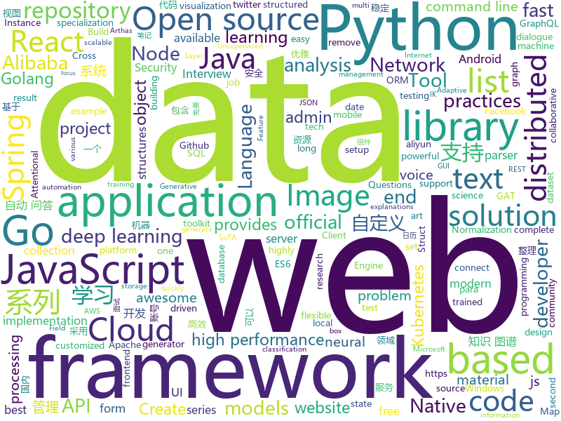

# 2019-08-04
See what the GitHub community is most excited about today.

## python
* [UGATIT](https://github.com/taki0112/UGATIT)(**115 stars today**): Official Tensorflow implementation of U-GAT-IT: Unsupervised Generative Attentional Networks with Adaptive Layer-Instance Normalization for Image-to-Image Translation
* [Real-Time-Voice-Cloning](https://github.com/CorentinJ/Real-Time-Voice-Cloning)(**69 stars today**): Clone a voice in 5 seconds to generate arbitrary speech in real-time
* [trape](https://github.com/jofpin/trape)(**38 stars today**): People tracker on the Internet: OSINT analysis and research tool by Jose Pino
* [studyFiles](https://github.com/threerocks/studyFiles)(**104 stars today**): 一些经典且高质量的电子书分享
* [DeepLearningExamples](https://github.com/NVIDIA/DeepLearningExamples)(**30 stars today**): Deep Learning Examples
* [video-object-removal](https://github.com/zllrunning/video-object-removal)(**61 stars today**): Just draw a bounding box and you can remove the object you want to remove.
* [chromego](https://github.com/killgcd/chromego)(**4 stars today**): ChromeGo 翻墙工具包
* [QASystemOnMedicalKG](https://github.com/liuhuanyong/QASystemOnMedicalKG)(**5 stars today**): A tutorial and implement of disease centered Medical knowledge graph and qa system based on it。知识图谱构建，自动问答，基于kg的自动问答。以疾病为中心的一定规模医药领域知识图谱，并以该知识图谱完成自动问答与分析服务。
* [rasa](https://github.com/RasaHQ/rasa)(**10 stars today**): 💬Open source machine learning framework to automate text- and voice-based conversations: NLU, dialogue management, connect to Slack, Facebook, and more - Create chatbots and voice assistants
* [pytorch-transformers](https://github.com/huggingface/pytorch-transformers)(**38 stars today**): 👾A library of state-of-the-art pretrained models for Natural Language Processing (NLP)
* [pywinauto](https://github.com/pywinauto/pywinauto)(**15 stars today**): Windows GUI Automation with Python (based on text properties)
* [ParlAI](https://github.com/facebookresearch/ParlAI)(**8 stars today**): A framework for training and evaluating AI models on a variety of openly available dialogue datasets.
* [chainer](https://github.com/chainer/chainer)(**4 stars today**): A flexible framework of neural networks for deep learning
* [zhao](https://github.com/programthink/zhao)(**11 stars today**): 【编程随想】整理的《太子党关系网络》，专门揭露赵国的权贵
* [httpx](https://github.com/encode/httpx)(**32 stars today**): A next generation HTTP client for Python.🦋
* [UGATIT-pytorch](https://github.com/znxlwm/UGATIT-pytorch)(**11 stars today**): Official PyTorch implementation of U-GAT-IT: Unsupervised Generative Attentional Networks with Adaptive Layer-Instance Normalization for Image-to-Image Translation
* [NeuralNLP-NeuralClassifier](https://github.com/Tencent/NeuralNLP-NeuralClassifier)(**19 stars today**): An Open-source Neural Hierarchical Multi-label Text Classification Toolkit
* [MedicalNet](https://github.com/Tencent/MedicalNet)(**14 stars today**): Many studies have shown that the performance on deep learning is significantly affected by volume of training data. The MedicalNet project provides a series of 3D-ResNet pre-trained models and relative code.
* [pandas](https://github.com/pandas-dev/pandas)(**18 stars today**): Flexible and powerful data analysis / manipulation library for Python, providing labeled data structures similar to R data.frame objects, statistical functions, and much more
* [PayloadsAllTheThings](https://github.com/swisskyrepo/PayloadsAllTheThings)(**28 stars today**): A list of useful payloads and bypass for Web Application Security and Pentest/CTF
* [models](https://github.com/PaddlePaddle/models)(**12 stars today**): Pre-trained and Reproduced Deep Learning Models （『飞桨』官方模型库，包含多种学术前沿和工业场景验证的深度学习模型）
* [apple_bleee](https://github.com/hexway/apple_bleee)(**43 stars today**): Apple BLE research
* [nni](https://github.com/microsoft/nni)(**3 stars today**): An open source AutoML toolkit for neural architecture search and hyper-parameter tuning.
* [Apfell](https://github.com/its-a-feature/Apfell)(**8 stars today**): A collaborative, multi-platform, red teaming framework
* [pytube](https://github.com/nficano/pytube)(**20 stars today**): A lightweight, dependency-free Python library (and command-line utility) for downloading YouTube Videos.

## java
* [spring-cloud-alibaba](https://github.com/alibaba/spring-cloud-alibaba)(**69 stars today**): Spring Cloud Alibaba provides a one-stop solution for application development for the distributed solutions of Alibaba middleware.
* [quickstart-android](https://github.com/firebase/quickstart-android)(**14 stars today**): Firebase Quickstart Samples for Android
* [EhViewer](https://github.com/seven332/EhViewer)(**25 stars today**): An Unofficial E-Hentai Application for Android
* [interviews](https://github.com/kdn251/interviews)(**90 stars today**): Everything you need to know to get the job.
* [thingsboard](https://github.com/thingsboard/thingsboard)(**3 stars today**): Open-source IoT Platform - Device management, data collection, processing and visualization.
* [library](https://github.com/ddd-by-examples/library)(**5 stars today**): A comprehensive Domain-Driven Design example with problem space strategic analysis and various tactical patterns.
* [CS-Notes](https://github.com/CyC2018/CS-Notes)(**64 stars today**): 📚Tech Interview Guide 技术面试必备基础知识、Leetcode 题解、Java、C++、Python、后端面试、操作系统、计算机网络、系统设计
* [arthas](https://github.com/alibaba/arthas)(**13 stars today**): Alibaba Java Diagnostic Tool Arthas/Alibaba Java诊断利器Arthas
* [TerrariaClone](https://github.com/raxod502/TerrariaClone)(**13 stars today**): 🔥An incomprehensible hellscape of spaghetti code.
* [presto](https://github.com/prestodb/presto)(**1 stars today**): The official home of the Presto distributed SQL query engine for big data
* [webmagic](https://github.com/code4craft/webmagic)(**6 stars today**): A scalable web crawler framework for Java.
* [CalendarView](https://github.com/huanghaibin-dev/CalendarView)(**4 stars today**): Android上一个优雅、万能自定义UI、支持周视图、自定义周起始、性能高效的日历控件，支持热插拔实现的UI定制！支持标记、自定义颜色、农历、自定义月视图各种显示模式等。Canvas绘制，速度快、占用内存低，你真的想不到日历居然还可以如此优雅！An elegant, highly customized and high-performance Calendar Widget on Android.
* [elasticsearch-analysis-ik](https://github.com/medcl/elasticsearch-analysis-ik)(**4 stars today**): The IK Analysis plugin integrates Lucene IK analyzer into elasticsearch, support customized dictionary.
* [antlr4](https://github.com/antlr/antlr4)(**5 stars today**): ANTLR (ANother Tool for Language Recognition) is a powerful parser generator for reading, processing, executing, or translating structured text or binary files.
* [spring-cloud-repo](https://github.com/benwang6/spring-cloud-repo)(**3 stars today**): 
* [uid-generator](https://github.com/baidu/uid-generator)(**6 stars today**): UniqueID generator
* [nifi](https://github.com/apache/nifi)(**1 stars today**): Mirror of Apache NiFi
* [flink](https://github.com/apache/flink)(**9 stars today**): Apache Flink
* [FrameworkBenchmarks](https://github.com/TechEmpower/FrameworkBenchmarks)(**4 stars today**): Source for the TechEmpower Framework Benchmarks project
* [spring-security-oauth](https://github.com/Baeldung/spring-security-oauth)(**1 stars today**): Learn more about OAuth2 via "Learn Spring Security":
* [fastjson](https://github.com/alibaba/fastjson)(**8 stars today**): 🚄A fast JSON parser/generator for Java. (Aliyun Data Lake Analytics https://www.aliyun.com/product/datalakeanalytics powered by fastjson )
* [glide](https://github.com/bumptech/glide)(**11 stars today**): An image loading and caching library for Android focused on smooth scrolling
* [camel](https://github.com/apache/camel)(**0 stars today**): Apache Camel
* [ksql](https://github.com/confluentinc/ksql)(**2 stars today**): KSQL - the Streaming SQL Engine for Apache Kafka
* [jmeter](https://github.com/apache/jmeter)(**4 stars today**): Apache JMeter

## unknown
* [technology_books](https://github.com/arpitjindal97/technology_books)(**210 stars today**): Premium eBook free for Geeks
* [learn-regex](https://github.com/ziishaned/learn-regex)(**158 stars today**): Learn regex the easy way
* [Beginner-Network-Pentesting](https://github.com/hmaverickadams/Beginner-Network-Pentesting)(**37 stars today**): Notes for Beginner Network Pentesting Course
* [You-Dont-Know-JS](https://github.com/getify/You-Dont-Know-JS)(**42 stars today**): A book series on JavaScript. @YDKJS on twitter.
* [build-your-own-x](https://github.com/danistefanovic/build-your-own-x)(**15 stars today**): 🤓Build your own (insert technology here)
* [coding-interview-university](https://github.com/jwasham/coding-interview-university)(**213 stars today**): A complete computer science study plan to become a software engineer.
* [awesome-indie](https://github.com/josephchang10/awesome-indie)(**2 stars today**): awesome-indie 中文版 - 帮助独立开发者赚钱的资源整理
* [aws-solutions-architect-associate-notes](https://github.com/SkullTech/aws-solutions-architect-associate-notes)(**26 stars today**): My notes for AWS Solutions Architect Associate.
* [Awesome-Hacking](https://github.com/Hack-with-Github/Awesome-Hacking)(**24 stars today**): A collection of various awesome lists for hackers, pentesters and security researchers
* [the-art-of-command-line](https://github.com/jlevy/the-art-of-command-line)(**52 stars today**): Master the command line, in one page
* [Free-SS-SSR](https://github.com/dxxzst/Free-SS-SSR)(**0 stars today**): 免费的SS账号、SSR账号，定期更新
* [cppbestpractices](https://github.com/lefticus/cppbestpractices)(**2 stars today**): Collaborative Collection of C++ Best Practices
* [StabilityGuide](https://github.com/StabilityMan/StabilityGuide)(**16 stars today**): 【稳定大于一切】打造国内稳定性领域知识库，让无法解决的问题少一点点，让世界的确定性多一点点。
* [state-of-the-art-result-for-machine-learning-problems](https://github.com/RedditSota/state-of-the-art-result-for-machine-learning-problems)(**3 stars today**): This repository provides state of the art (SoTA) results for all machine learning problems. We do our best to keep this repository up to date. If you do find a problem's SoTA result is out of date or missing, please raise this as an issue or submit Google form (with this information: research paper name, dataset, metric, source code and year). W…
* [chromium](https://github.com/chromium/chromium)(**12 stars today**): The official GitHub mirror of the Chromium source
* [javascript-questions](https://github.com/lydiahallie/javascript-questions)(**25 stars today**): A long list of (advanced) JavaScript questions, and their explanations✨Updated weekly!
* [Emergency-Response-Notes](https://github.com/Bypass007/Emergency-Response-Notes)(**6 stars today**): 应急响应实战笔记，一个安全工程师的自我修养。
* [CKAD-exercises](https://github.com/dgkanatsios/CKAD-exercises)(**1 stars today**): A set of exercises to prepare for Certified Kubernetes Application Developer exam by Cloud Native Computing Foundation
* [swift-best-practices](https://github.com/Lickability/swift-best-practices)(**22 stars today**): A repository that contains information related to Lickability's best practices.
* [Blog](https://github.com/mqyqingfeng/Blog)(**8 stars today**): 冴羽写博客的地方，预计写四个系列：JavaScript深入系列、JavaScript专题系列、ES6系列、React系列。
* [developer-roadmap](https://github.com/kamranahmedse/developer-roadmap)(**36 stars today**): Roadmap to becoming a web developer in 2019
* [vagas](https://github.com/backend-br/vagas)(**2 stars today**): ✌️Espaço para divulgação de vagas para backenders
* [time-as-a-friend](https://github.com/xiaolai/time-as-a-friend)(**3 stars today**): 《把时间当作朋友》
* [api-guidelines](https://github.com/microsoft/api-guidelines)(**7 stars today**): Microsoft REST API Guidelines
* [clash_for_windows_pkg](https://github.com/Fndroid/clash_for_windows_pkg)(**7 stars today**): A Windows GUI based on Clash

## javascript
* [diabloweb](https://github.com/d07RiV/diabloweb)(**73 stars today**): Diablo 1 for web browsers
* [hackathon-starter](https://github.com/sahat/hackathon-starter)(**86 stars today**): A boilerplate for Node.js web applications
* [react-beautiful-dnd](https://github.com/atlassian/react-beautiful-dnd)(**11 stars today**): Beautiful and accessible drag and drop for lists with React
* [front-end-interview-handbook](https://github.com/yangshun/front-end-interview-handbook)(**14 stars today**): 🕸Almost complete answers to "Front-end Job Interview Questions" which you can use to interview potential candidates, test yourself or completely ignore
* [puppeteer](https://github.com/GoogleChrome/puppeteer)(**22 stars today**): Headless Chrome Node API
* [Rocket.Chat](https://github.com/RocketChat/Rocket.Chat)(**10 stars today**): The ultimate Free Open Source Solution for team communications.
* [PersonalBlog](https://github.com/Nealyang/PersonalBlog)(**5 stars today**): 📝Nealyang personal blog
* [easy-mock](https://github.com/easy-mock/easy-mock)(**6 stars today**): A persistent service that generates mock data quickly and provids visualization view.
* [javascript-algorithms](https://github.com/trekhleb/javascript-algorithms)(**22 stars today**): 📝Algorithms and data structures implemented in JavaScript with explanations and links to further readings
* [nodejs-api-starter](https://github.com/kriasoft/nodejs-api-starter)(**10 stars today**): Boilerplate and tooling for authoring data API backends with Node.js and GraphQL
* [vis-timeline](https://github.com/visjs/vis-timeline)(**9 stars today**): 📈Create a fully customizable, interactive timelines and 2d-graphs with items and ranges.
* [flow-typed](https://github.com/flow-typed/flow-typed)(**1 stars today**): A central repository for Flow library definitions
* [500lines](https://github.com/aosabook/500lines)(**23 stars today**): 500 Lines or Less
* [react-admin](https://github.com/marmelab/react-admin)(**33 stars today**): A frontend Framework for building admin applications running in the browser on top of REST/GraphQL APIs, using ES6, React and Material Design
* [Spring-Cloud-Admin](https://github.com/wxiaoqi/Spring-Cloud-Admin)(**15 stars today**): Cloud-Admin是国内首个基于Spring Cloud微服务化开发平台，具有统一授权、认证后台管理系统，其中包含具备用户管理、资源权限管理、网关API管理等多个模块，支持多业务系统并行开发，可以作为后端服务的开发脚手架。代码简洁，架构清晰，适合学习和直接项目中使用。核心技术采用Spring Boot2以及Spring Cloud Gateway相关核心组件，前端采用vue-element-admin组件。
* [react-jsonschema-form](https://github.com/mozilla-services/react-jsonschema-form)(**9 stars today**): A React component for building Web forms from JSON Schema.
* [odoo](https://github.com/odoo/odoo)(**10 stars today**): Odoo. Open Source Apps To Grow Your Business.
* [fe-code](https://github.com/wuyawei/fe-code)(**7 stars today**): 🍹🍰愉快的写代码~（文章合集）
* [mvc](https://github.com/taniarascia/mvc)(**12 stars today**): A simple MVC application in plain JavaScript.
* [gridstudio](https://github.com/ricklamers/gridstudio)(**72 stars today**): Grid studio is a web-based spreadsheet application with full integration of the Python programming language.
* [style2paints](https://github.com/lllyasviel/style2paints)(**41 stars today**): sketch + style = paints🎨
* [Detox](https://github.com/wix/Detox)(**9 stars today**): Gray box end-to-end testing and automation framework for mobile apps
* [awx](https://github.com/ansible/awx)(**3 stars today**): AWX Project
* [cli](https://github.com/react-native-community/cli)(**0 stars today**): React Native command line tools
* [material-table](https://github.com/mbrn/material-table)(**6 stars today**): Datatable for React based on material-ui's table with additional features

## html
* [frontend-tech-list](https://github.com/alienzhou/frontend-tech-list)(**60 stars today**): a frontend tech list for developers
* [electron-api-demos](https://github.com/electron/electron-api-demos)(**6 stars today**): Explore the Electron APIs
* [awesome-piracy](https://github.com/Igglybuff/awesome-piracy)(**10 stars today**): A curated list of awesome warez and piracy links
* [fastText](https://github.com/facebookresearch/fastText)(**43 stars today**): Library for fast text representation and classification.
* [blog_os](https://github.com/phil-opp/blog_os)(**8 stars today**): Writing an OS in Rust
* [JavaScript30](https://github.com/wesbos/JavaScript30)(**6 stars today**): 30 Day Vanilla JS Challenge
* [zfaka](https://github.com/zlkbdotnet/zfaka)(**3 stars today**): 免费、安全、稳定、高效的发卡系统，值得拥有!
* [ru.javascript.info](https://github.com/javascript-tutorial/ru.javascript.info)(**6 stars today**): Современный учебник JavaScript
* [learning-area](https://github.com/mdn/learning-area)(**3 stars today**): Github repo for the MDN Learning Area.
* [webdevbootcamp](https://github.com/nax3t/webdevbootcamp)(**1 stars today**): All source code for back-end projects from the Web Developer Bootcamp
* [courses](https://github.com/DataScienceSpecialization/courses)(**4 stars today**): Course materials for the Data Science Specialization: https://www.coursera.org/specialization/jhudatascience/1
* [feature-engineering-for-ml-zh](https://github.com/apachecn/feature-engineering-for-ml-zh)(**5 stars today**): 📖[译] 面向机器学习的特征工程
* [djangox](https://github.com/wsvincent/djangox)(**5 stars today**): A framework for launching new Django projects quickly.
* [hugo-academic](https://github.com/gcushen/hugo-academic)(**1 stars today**): 📝The website builder for Hugo. Build and deploy a beautiful website in minutes!
* [en.javascript.info](https://github.com/javascript-tutorial/en.javascript.info)(**10 stars today**): Modern JavaScript Tutorial
* [bulma-templates](https://github.com/BulmaTemplates/bulma-templates)(**1 stars today**): free flexbox templates built with the bulma css framework
* [Coursera-ML-AndrewNg-Notes](https://github.com/fengdu78/Coursera-ML-AndrewNg-Notes)(**13 stars today**): 吴恩达老师的机器学习课程个人笔记
* [speedtest](https://github.com/adolfintel/speedtest)(**4 stars today**): Self-hosted HTML5 Speedtest. Easy setup, examples, configurable, mobile friendly. Supports PHP, Node, Multiple servers, and more
* [pcc_2e](https://github.com/ehmatthes/pcc_2e)(**2 stars today**): Online resources for Python Crash Course (Second Edition), from No Starch Press
* [design-blocks](https://github.com/froala/design-blocks)(**6 stars today**): A set of 170+ Bootstrap based design blocks ready to be used to create clean modern websites.
* [es6-features](https://github.com/rse/es6-features)(**3 stars today**): ECMAScript 6: Feature Overview & Comparison
* [WebFundamentals](https://github.com/google/WebFundamentals)(**2 stars today**): Best practices for modern web development
* [conversational-form](https://github.com/space10-community/conversational-form)(**6 stars today**): Turning web forms into conversations
* [shellphish](https://github.com/thelinuxchoice/shellphish)(**0 stars today**): Phishing Tool for 18 social media: Instagram, Facebook, Snapchat, Github, Twitter, Yahoo, Protonmail, Spotify, Netflix, Linkedin, Wordpress, Origin, Steam, Microsoft, InstaFollowers, Gitlab, Pinterest
* [python](https://github.com/Show-Me-the-Code/python)(**2 stars today**): Show Me the Code Python version.

## go
* [lazydocker](https://github.com/jesseduffield/lazydocker)(**83 stars today**): The lazier way to manage everything docker
* [mapstructure](https://github.com/mitchellh/mapstructure)(**4 stars today**): Go library for decoding generic map values into native Go structures.
* [minio](https://github.com/minio/minio)(**11 stars today**): MinIO is a high performance object storage server compatible with Amazon S3 APIs
* [gorm](https://github.com/jinzhu/gorm)(**5 stars today**): The fantastic ORM library for Golang, aims to be developer friendly
* [terraform-provider-aws](https://github.com/terraform-providers/terraform-provider-aws)(**3 stars today**): Terraform AWS provider
* [consul](https://github.com/hashicorp/consul)(**8 stars today**): Consul is a distributed, highly available, and data center aware solution to connect and configure applications across dynamic, distributed infrastructure.
* [Go-SCP](https://github.com/OWASP/Go-SCP)(**32 stars today**): Go programming language secure coding practices guide
* [zap](https://github.com/uber-go/zap)(**11 stars today**): Blazing fast, structured, leveled logging in Go.
* [traefik](https://github.com/containous/traefik)(**18 stars today**): The Cloud Native Edge Router
* [sqlx](https://github.com/jmoiron/sqlx)(**10 stars today**): general purpose extensions to golang's database/sql
* [google-cloud-go](https://github.com/googleapis/google-cloud-go)(**2 stars today**): Google Cloud Client Libraries for Go.
* [validator](https://github.com/go-playground/validator)(**4 stars today**): 💯Go Struct and Field validation, including Cross Field, Cross Struct, Map, Slice and Array diving
* [learn-go-with-tests](https://github.com/quii/learn-go-with-tests)(**20 stars today**): Learn Go with test-driven development
* [lindb](https://github.com/lindb/lindb)(**12 stars today**): LinDB is a scalable, distributed, high performance, high availability Time Series Database.
* [websocket](https://github.com/gorilla/websocket)(**6 stars today**): A WebSocket implementation for Go.
* [containerd](https://github.com/containerd/containerd)(**4 stars today**): An open and reliable container runtime
* [pgx](https://github.com/jackc/pgx)(**5 stars today**): PostgreSQL driver and toolkit for Go
* [kind](https://github.com/kubernetes-sigs/kind)(**12 stars today**): Kubernetes IN Docker - local clusters for testing Kubernetes
* [thanos](https://github.com/thanos-io/thanos)(**7 stars today**): Highly available Prometheus setup with long term storage capabilities.
* [kops](https://github.com/kubernetes/kops)(**9 stars today**): Kubernetes Operations (kops) - Production Grade K8s Installation, Upgrades, and Management
* [pg](https://github.com/go-pg/pg)(**4 stars today**): Golang ORM with focus on PostgreSQL features and performance
* [frp](https://github.com/fatedier/frp)(**31 stars today**): A fast reverse proxy to help you expose a local server behind a NAT or firewall to the internet.
* [go-plugins](https://github.com/micro/go-plugins)(**4 stars today**): Community maintained plugins
* [toml](https://github.com/BurntSushi/toml)(**2 stars today**): TOML parser for Golang with reflection.
* [community](https://github.com/kubernetes/community)(**2 stars today**): Kubernetes community content

## WordCloud

