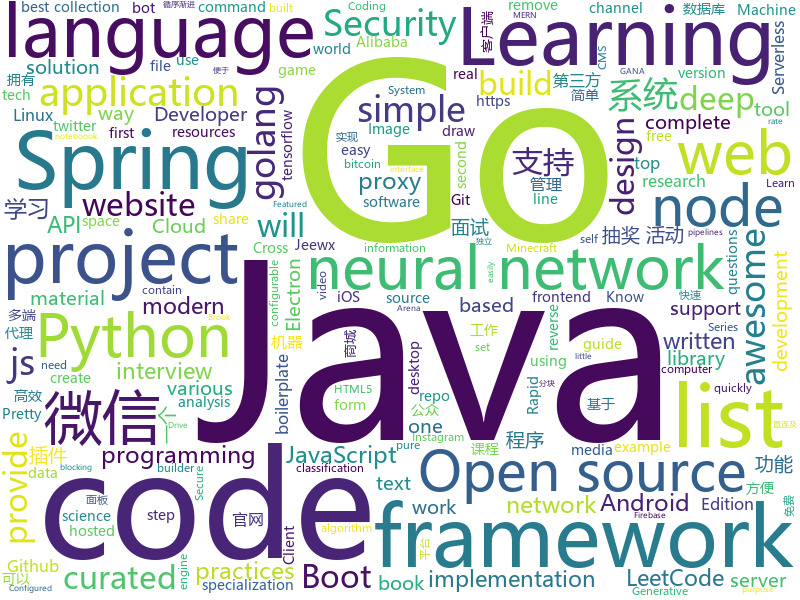

# 2019-08-05
See what the GitHub community is most excited about today.

## python
* [face_recognition](https://github.com/ageitgey/face_recognition)(**122 stars today**): The world's simplest facial recognition api for Python and the command line
* [studyFiles](https://github.com/threerocks/studyFiles)(**79 stars today**): 一些经典且高质量的电子书分享
* [pytorch-lightning](https://github.com/williamFalcon/pytorch-lightning)(**293 stars today**): Rapid research framework for PyTorch. The researcher's version of Keras
* [keras-tuner](https://github.com/keras-team/keras-tuner)(**35 stars today**): Hyperparameter tuning for humans
* [manim](https://github.com/3b1b/manim)(**101 stars today**): Animation engine for explanatory math videos
* [video-object-removal](https://github.com/zllrunning/video-object-removal)(**41 stars today**): Just draw a bounding box and you can remove the object you want to remove.
* [neural-networks-and-deep-learning](https://github.com/mnielsen/neural-networks-and-deep-learning)(**22 stars today**): Code samples for my book "Neural Networks and Deep Learning"
* [Real-Time-Voice-Cloning](https://github.com/CorentinJ/Real-Time-Voice-Cloning)(**67 stars today**): Clone a voice in 5 seconds to generate arbitrary speech in real-time
* [NeuralNLP-NeuralClassifier](https://github.com/Tencent/NeuralNLP-NeuralClassifier)(**21 stars today**): An Open-source Neural Hierarchical Multi-label Text Classification Toolkit
* [python_autocomplete](https://github.com/vpj/python_autocomplete)(**44 stars today**): A simple neural network for python autocompletion
* [goop](https://github.com/s0md3v/goop)(**43 stars today**): Google Search Scraper
* [sympy](https://github.com/sympy/sympy)(**10 stars today**): A computer algebra system written in pure Python
* [UGATIT](https://github.com/taki0112/UGATIT)(**193 stars today**): Official Tensorflow implementation of U-GAT-IT: Unsupervised Generative Attentional Networks with Adaptive Layer-Instance Normalization for Image-to-Image Translation
* [numpy-ml](https://github.com/ddbourgin/numpy-ml)(**28 stars today**): Machine learning, in numpy
* [keras](https://github.com/keras-team/keras)(**24 stars today**): Deep Learning for humans
* [trape](https://github.com/jofpin/trape)(**25 stars today**): People tracker on the Internet: OSINT analysis and research tool by Jose Pino
* [instabot.py](https://github.com/instabot-py/instabot.py)(**10 stars today**): Instagram bot. It works without instagram api, need only login and password. Write on python.
* [CheatSheetSeries](https://github.com/OWASP/CheatSheetSeries)(**35 stars today**): The OWASP Cheat Sheet Series was created to provide a concise collection of high value information on specific application security topics.
* [DeepLearningExamples](https://github.com/NVIDIA/DeepLearningExamples)(**31 stars today**): Deep Learning Examples
* [fashion-mnist](https://github.com/zalandoresearch/fashion-mnist)(**8 stars today**): A MNIST-like fashion product database. Benchmark👉
* [home-assistant](https://github.com/home-assistant/home-assistant)(**16 stars today**): 🏡Open source home automation that puts local control and privacy first
* [spacy-pytorch-transformers](https://github.com/explosion/spacy-pytorch-transformers)(**34 stars today**): 🛸 spaCy pipelines for pre-trained BERT, XLNet and GPT-2
* [TecoGAN](https://github.com/thunil/TecoGAN)(**10 stars today**): This repo will contain source code and materials for the TecoGAN project, i.e. code for a TEmporally COherent GAN
* [chainer](https://github.com/chainer/chainer)(**4 stars today**): A flexible framework of neural networks for deep learning
* [XLM](https://github.com/facebookresearch/XLM)(**13 stars today**): PyTorch original implementation of Cross-lingual Language Model Pretraining.

## java
* [JavaGuide](https://github.com/Snailclimb/JavaGuide)(**113 stars today**): 【Java学习+面试指南】 一份涵盖大部分Java程序员所需要掌握的核心知识。
* [interviews](https://github.com/kdn251/interviews)(**153 stars today**): Everything you need to know to get the job.
* [CS-Notes](https://github.com/CyC2018/CS-Notes)(**130 stars today**): 📚Tech Interview Guide 技术面试必备基础知识、Leetcode 题解、Java、C++、Python、后端面试、操作系统、计算机网络、系统设计
* [spring-cloud-alibaba](https://github.com/alibaba/spring-cloud-alibaba)(**69 stars today**): Spring Cloud Alibaba provides a one-stop solution for application development for the distributed solutions of Alibaba middleware.
* [bbs](https://github.com/diyhi/bbs)(**29 stars today**): 巡云轻论坛系统采用JAVA+MYSQL架构，自适应手机端和电脑端，界面简洁，性能高效。数据库表结构设计使用分表方案,提高系统的负载能力。后台数据库备份/还原、全站指定目录打包、一键自动升级等功能使维护简单方便。系统拥有强大的模板管理功能，布局版块支持设置输出条件，让前端页面展示方便快捷。
* [CtCI-6th-Edition](https://github.com/careercup/CtCI-6th-Edition)(**7 stars today**): Cracking the Coding Interview 6th Ed. Solutions
* [Telegram](https://github.com/DrKLO/Telegram)(**13 stars today**): Telegram for Android source
* [ghidra](https://github.com/NationalSecurityAgency/ghidra)(**41 stars today**): Ghidra is a software reverse engineering (SRE) framework
* [netbeans](https://github.com/apache/netbeans)(**1 stars today**): Apache NetBeans
* [proxyee-down](https://github.com/proxyee-down-org/proxyee-down)(**17 stars today**): http下载工具，基于http代理，支持多连接分块下载
* [libgdx](https://github.com/libgdx/libgdx)(**9 stars today**): Desktop/Android/HTML5/iOS Java game development framework
* [XQuickEnergy](https://github.com/pansong291/XQuickEnergy)(**4 stars today**): 快速收取蚂蚁森林能量
* [LeetCodeAnimation](https://github.com/MisterBooo/LeetCodeAnimation)(**63 stars today**): Demonstrate all the questions on LeetCode in the form of animation.（用动画的形式呈现解LeetCode题目的思路）
* [runelite](https://github.com/runelite/runelite)(**5 stars today**): Open source Old School RuneScape client
* [DragonProxy](https://github.com/DragonetMC/DragonProxy)(**3 stars today**): A proxy to allow Minecraft: Bedrock clients to connect to Minecraft: Java Edition servers.
* [awesome-java-leetcode](https://github.com/Blankj/awesome-java-leetcode)(**16 stars today**): 👑LeetCode of algorithms with java solution(updating).
* [library](https://github.com/ddd-by-examples/library)(**8 stars today**): A comprehensive Domain-Driven Design example with problem space strategic analysis and various tactical patterns.
* [rabbitmq-tutorials](https://github.com/rabbitmq/rabbitmq-tutorials)(**5 stars today**): Tutorials for using RabbitMQ in various ways
* [JCSprout](https://github.com/crossoverJie/JCSprout)(**18 stars today**): 👨‍🎓Java Core Sprout : basic, concurrent, algorithm
* [jeewx-boot](https://github.com/zhangdaiscott/jeewx-boot)(**29 stars today**): 基于SpringBoot的免费微信管家平台。支持微信公众号、微信第三方平台、小程序官网、小程序商城、微信抽奖活动。Jeewx-Boot实现了微信公众号管理、小程序CMS、微信抽奖活动等基础功能，便于二次开发，可以快速搭建微信应用！Jeewx-Boot独创插件开发机制，实现了每一抽奖活动（砸金蛋、刮刮乐、砍价等）、官网、商城都是一个独立的插件，对JAVA来讲就是一个JAR包，可以很方便的做插拔，最终打造像Discuz、微擎一样的插件生态圈。
* [spring-security](https://github.com/spring-projects/spring-security)(**5 stars today**): Spring Security
* [Pix-EzViewer](https://github.com/Notsfsssf/Pix-EzViewer)(**7 stars today**): 一个支持免代理直连及查看动图的第三方Pixiv android客户端
* [SpringAll](https://github.com/wuyouzhuguli/SpringAll)(**52 stars today**): 循序渐进，学习Spring Boot、Spring Boot & Shiro、Spring Cloud、Spring Security & Spring Security OAuth2，博客Spring系列源码
* [EdXposed](https://github.com/ElderDrivers/EdXposed)(**5 stars today**): Elder driver Xposed Framework.
* [order-backend](https://github.com/e-commerce-sample/order-backend)(**13 stars today**): Order backend for e-commerce.

## unknown
* [technology_books](https://github.com/arpitjindal97/technology_books)(**278 stars today**): Premium eBook free for Geeks
* [coding-interview-university](https://github.com/jwasham/coding-interview-university)(**305 stars today**): A complete computer science study plan to become a software engineer.
* [learn-regex](https://github.com/ziishaned/learn-regex)(**610 stars today**): Learn regex the easy way
* [you-dont-know-js-ru](https://github.com/azat-io/you-dont-know-js-ru)(**9 stars today**): 📚Russian translation of "You Don't Know JS" book series
* [article](https://github.com/ChenChunCamus/article)(**15 stars today**): 
* [You-Dont-Know-JS](https://github.com/getify/You-Dont-Know-JS)(**53 stars today**): A book series on JavaScript. @YDKJS on twitter.
* [955.WLB](https://github.com/formulahendry/955.WLB)(**12 stars today**): 955 不加班的公司名单 - 工作 955，work–life balance (工作与生活的平衡)
* [Unlight-Images](https://github.com/unlightcpa/Unlight-Images)(**4 stars today**): 
* [Awesome-Hacking](https://github.com/Hack-with-Github/Awesome-Hacking)(**71 stars today**): A collection of various awesome lists for hackers, pentesters and security researchers
* [awesome-tensorflow](https://github.com/jtoy/awesome-tensorflow)(**109 stars today**): TensorFlow - A curated list of dedicated resources http://tensorflow.org
* [GNNPapers](https://github.com/thunlp/GNNPapers)(**40 stars today**): Must-read papers on graph neural networks (GNN)
* [project-based-learning](https://github.com/tuvtran/project-based-learning)(**19 stars today**): Curated list of project-based tutorials
* [Python-programming-exercises](https://github.com/zhiwehu/Python-programming-exercises)(**10 stars today**): 100+ Python challenging programming exercises
* [swift-best-practices](https://github.com/Lickability/swift-best-practices)(**60 stars today**): A repository that contains information related to Lickability's best practices.
* [Learn_Machine_Learning_in_3_Months](https://github.com/llSourcell/Learn_Machine_Learning_in_3_Months)(**7 stars today**): This is the code for "Learn Machine Learning in 3 Months" by Siraj Raval on Youtube
* [stockpredictionai](https://github.com/borisbanushev/stockpredictionai)(**10 stars today**): In this noteboook I will create a complete process for predicting stock price movements. Follow along and we will achieve some pretty good results. For that purpose we will use a Generative Adversarial Network (GAN) with LSTM, a type of Recurrent Neural Network, as generator, and a Convolutional Neural Network, CNN, as a discriminator. We use L…
* [Projects](https://github.com/karan/Projects)(**12 stars today**): 📃A list of practical projects that anyone can solve in any programming language.
* [awesome](https://github.com/sindresorhus/awesome)(**73 stars today**): 😎Awesome lists about all kinds of interesting topics
* [flink-training-course](https://github.com/flink-china/flink-training-course)(**12 stars today**): Flink 中文视频课程（持续更新...）
* [learningPixi](https://github.com/kittykatattack/learningPixi)(**5 stars today**): A step-by-step introduction to making games and interactive media with the Pixi.js rendering engine.
* [gfwlist](https://github.com/gfwlist/gfwlist)(**11 stars today**): The one and only one gfwlist here
* [awesome-interview-questions](https://github.com/MaximAbramchuck/awesome-interview-questions)(**18 stars today**): A curated awesome list of lists of interview questions. Feel free to contribute!🎓
* [system-design-interview](https://github.com/checkcheckzz/system-design-interview)(**13 stars today**): System design interview for IT companies
* [docs](https://github.com/LaravelCollective/docs)(**2 stars today**): Documentation for LaravelCollective Packages
* [CKAD-exercises](https://github.com/dgkanatsios/CKAD-exercises)(**3 stars today**): A set of exercises to prepare for Certified Kubernetes Application Developer exam by Cloud Native Computing Foundation

## javascript
* [hackathon-starter](https://github.com/sahat/hackathon-starter)(**203 stars today**): A boilerplate for Node.js web applications
* [style2paints](https://github.com/lllyasviel/style2paints)(**74 stars today**): sketch + style = paints🎨
* [diabloweb](https://github.com/d07RiV/diabloweb)(**108 stars today**): Diablo 1 for web browsers
* [components](https://github.com/serverless/components)(**60 stars today**): An easier way to build and share serverless applications w/ the Serverless Framework -
* [slider-x](https://github.com/sellersmith/slider-x)(**3 stars today**): 😎🛀Simple and awesome slider
* [get-a-room-api-docs](https://github.com/hta218/get-a-room-api-docs)(**3 stars today**): 📚APIs documentation for Room Finder
* [netron](https://github.com/lutzroeder/netron)(**24 stars today**): Visualizer for neural network, deep learning and machine learning models
* [bit](https://github.com/teambit/bit)(**28 stars today**): Easily share code between projects with your team.
* [videodownloader](https://github.com/mayeaux/videodownloader)(**24 stars today**): A video and channel downloader that supports 110 websites, powered by Electron and youtube-dl
* [iptv](https://github.com/freearhey/iptv)(**26 stars today**): Collection of 7000+ publicly available IPTV channels from all over the world.
* [complete-javascript-course](https://github.com/jonasschmedtmann/complete-javascript-course)(**3 stars today**): Starter files, final projects and FAQ for my Complete JavaScript course
* [MTG-Arena-Tool](https://github.com/Manuel-777/MTG-Arena-Tool)(**3 stars today**): An MTG Arena deck and statistics manager
* [gekko](https://github.com/askmike/gekko)(**10 stars today**): A bitcoin trading bot written in node - https://gekko.wizb.it/
* [udemy-downloader-gui](https://github.com/FaisalUmair/udemy-downloader-gui)(**2 stars today**): A desktop application for downloading Udemy Courses
* [ethereumbook](https://github.com/ethereumbook/ethereumbook)(**4 stars today**): Mastering Ethereum, by Andreas M. Antonopoulos, Gavin Wood
* [BaoTa](https://github.com/aaPanel/BaoTa)(**11 stars today**): 宝塔Linux面板 - 简单好用的服务器运维面板
* [drawio-desktop](https://github.com/jgraph/drawio-desktop)(**13 stars today**): Official electron build of draw.io
* [opensource.guide](https://github.com/github/opensource.guide)(**5 stars today**): Community guides for open source creators
* [devconnector_2.0](https://github.com/bradtraversy/devconnector_2.0)(**1 stars today**): Social network for developers, built on the MERN stack
* [nginx-proxy-manager](https://github.com/jc21/nginx-proxy-manager)(**5 stars today**): Docker container for managing Nginx proxy hosts with a simple, powerful interface
* [chameleon](https://github.com/didi/chameleon)(**25 stars today**): 🦎一套代码运行多端，一端所见即多端所见
* [firebaseui-web](https://github.com/firebase/firebaseui-web)(**3 stars today**): FirebaseUI is an open-source JavaScript library for Web that provides simple, customizable UI bindings on top of Firebase SDKs to eliminate boilerplate code and promote best practices.
* [react-admin](https://github.com/marmelab/react-admin)(**25 stars today**): A frontend Framework for building admin applications running in the browser on top of REST/GraphQL APIs, using ES6, React and Material Design
* [strapi](https://github.com/strapi/strapi)(**22 stars today**): 🚀Open source Node.js Headless CMS to easily build customisable APIs
* [lossless-cut](https://github.com/mifi/lossless-cut)(**8 stars today**): Save space by quickly and losslessly trimming video and audio files

## html
* [frontend-tech-list](https://github.com/alienzhou/frontend-tech-list)(**87 stars today**): a frontend tech list for developers
* [electron-api-demos](https://github.com/electron/electron-api-demos)(**7 stars today**): Explore the Electron APIs
* [awesome-piracy](https://github.com/Igglybuff/awesome-piracy)(**9 stars today**): A curated list of awesome warez and piracy links
* [fastText](https://github.com/facebookresearch/fastText)(**44 stars today**): Library for fast text representation and classification.
* [blog_os](https://github.com/phil-opp/blog_os)(**9 stars today**): Writing an OS in Rust
* [JavaScript30](https://github.com/wesbos/JavaScript30)(**5 stars today**): 30 Day Vanilla JS Challenge
* [zfaka](https://github.com/zlkbdotnet/zfaka)(**2 stars today**): 免费、安全、稳定、高效的发卡系统，值得拥有!
* [ru.javascript.info](https://github.com/javascript-tutorial/ru.javascript.info)(**7 stars today**): Современный учебник JavaScript
* [learning-area](https://github.com/mdn/learning-area)(**0 stars today**): Github repo for the MDN Learning Area.
* [webdevbootcamp](https://github.com/nax3t/webdevbootcamp)(**1 stars today**): All source code for back-end projects from the Web Developer Bootcamp
* [courses](https://github.com/DataScienceSpecialization/courses)(**0 stars today**): Course materials for the Data Science Specialization: https://www.coursera.org/specialization/jhudatascience/1
* [feature-engineering-for-ml-zh](https://github.com/apachecn/feature-engineering-for-ml-zh)(**9 stars today**): 📖[译] 面向机器学习的特征工程
* [djangox](https://github.com/wsvincent/djangox)(**1 stars today**): A framework for launching new Django projects quickly.
* [hugo-academic](https://github.com/gcushen/hugo-academic)(**4 stars today**): 📝The website builder for Hugo. Build and deploy a beautiful website in minutes!
* [en.javascript.info](https://github.com/javascript-tutorial/en.javascript.info)(**6 stars today**): Modern JavaScript Tutorial
* [bulma-templates](https://github.com/BulmaTemplates/bulma-templates)(**0 stars today**): free flexbox templates built with the bulma css framework
* [Coursera-ML-AndrewNg-Notes](https://github.com/fengdu78/Coursera-ML-AndrewNg-Notes)(**22 stars today**): 吴恩达老师的机器学习课程个人笔记
* [speedtest](https://github.com/adolfintel/speedtest)(**3 stars today**): Self-hosted HTML5 Speedtest. Easy setup, examples, configurable, mobile friendly. Supports PHP, Node, Multiple servers, and more
* [pcc_2e](https://github.com/ehmatthes/pcc_2e)(**2 stars today**): Online resources for Python Crash Course (Second Edition), from No Starch Press
* [design-blocks](https://github.com/froala/design-blocks)(**5 stars today**): A set of 170+ Bootstrap based design blocks ready to be used to create clean modern websites.
* [es6-features](https://github.com/rse/es6-features)(**3 stars today**): ECMAScript 6: Feature Overview & Comparison
* [WebFundamentals](https://github.com/google/WebFundamentals)(**5 stars today**): Best practices for modern web development
* [conversational-form](https://github.com/space10-community/conversational-form)(**4 stars today**): Turning web forms into conversations
* [shellphish](https://github.com/thelinuxchoice/shellphish)(**0 stars today**): Phishing Tool for 18 social media: Instagram, Facebook, Snapchat, Github, Twitter, Yahoo, Protonmail, Spotify, Netflix, Linkedin, Wordpress, Origin, Steam, Microsoft, InstaFollowers, Gitlab, Pinterest
* [python](https://github.com/Show-Me-the-Code/python)(**2 stars today**): Show Me the Code Python version.

## go
* [sampler](https://github.com/sqshq/sampler)(**516 stars today**): A tool for shell commands execution, visualization and alerting. Configured with a simple YAML file.
* [Go-SCP](https://github.com/OWASP/Go-SCP)(**133 stars today**): Go programming language secure coding practices guide
* [ratelimit](https://github.com/uber-go/ratelimit)(**52 stars today**): A Golang blocking leaky-bucket rate limit implementation
* [go-git](https://github.com/src-d/go-git)(**8 stars today**): A highly extensible Git implementation in pure Go.
* [btcd](https://github.com/btcsuite/btcd)(**3 stars today**): An alternative full node bitcoin implementation written in Go (golang)
* [brook](https://github.com/txthinking/brook)(**13 stars today**): Brook is a cross-platform(Linux/MacOS/Windows/Android/iOS) proxy/vpn software
* [goquery](https://github.com/PuerkitoBio/goquery)(**10 stars today**): A little like that j-thing, only in Go.
* [colly](https://github.com/gocolly/colly)(**31 stars today**): Elegant Scraper and Crawler Framework for Golang
* [gbt](https://github.com/jtyr/gbt)(**15 stars today**): Highly configurable prompt builder for Bash and ZSH written in Go.
* [buffalo](https://github.com/gobuffalo/buffalo)(**2 stars today**): Rapid Web Development w/ Go
* [yaml](https://github.com/go-yaml/yaml)(**3 stars today**): YAML support for the Go language.
* [kcptun](https://github.com/xtaci/kcptun)(**5 stars today**): A Stable & Secure Tunnel Based On KCP with N:M Multiplexing
* [centrifugo](https://github.com/centrifugal/centrifugo)(**8 stars today**): Scalable real-time messaging in language-agnostic way
* [BoomFilters](https://github.com/tylertreat/BoomFilters)(**14 stars today**): Probabilistic data structures for processing continuous, unbounded streams.
* [go-pretty](https://github.com/jedib0t/go-pretty)(**21 stars today**): Pretty print Tables and more in golang!
* [bleve](https://github.com/blevesearch/bleve)(**7 stars today**): A modern text indexing library for go
* [GolangTraining](https://github.com/GoesToEleven/GolangTraining)(**8 stars today**): Training for Golang (go language)
* [pan-light](https://github.com/peterq/pan-light)(**41 stars today**): 百度网盘不限速客户端, golang + qt5, 跨平台图形界面
* [oauth2_proxy](https://github.com/pusher/oauth2_proxy)(**4 stars today**): A reverse proxy that provides authentication with Google, Github or other providers.
* [gogs](https://github.com/gogs/gogs)(**16 stars today**): Gogs is a painless self-hosted Git service.
* [gore](https://github.com/motemen/gore)(**5 stars today**): Yet another Go REPL that works nicely. Featured with line editing, code completion, and more.
* [chainlink](https://github.com/smartcontractkit/chainlink)(**3 stars today**): node of the decentralized oracle network, bridging on and off-chain computation
* [oauth2](https://github.com/go-oauth2/oauth2)(**13 stars today**): OAuth 2.0 server library for the Go programming language.
* [ff](https://github.com/peterbourgon/ff)(**10 stars today**): Flags-first package for configuration
* [gdrive](https://github.com/gdrive-org/gdrive)(**4 stars today**): Google Drive CLI Client

## WordCloud

