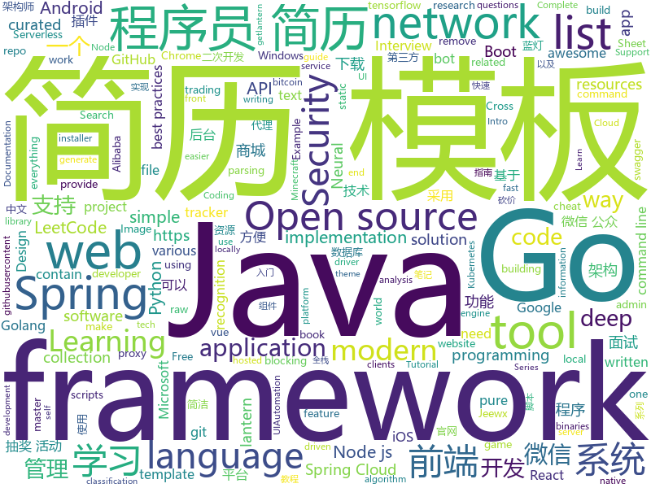

# 2019-08-06
See what the GitHub community is most excited about today.

## python
* [face_recognition](https://github.com/ageitgey/face_recognition)(**230 stars today**): The world's simplest facial recognition api for Python and the command line
* [studyFiles](https://github.com/threerocks/studyFiles)(**406 stars today**): 一些经典且高质量的电子书分享
* [pytorch-lightning](https://github.com/williamFalcon/pytorch-lightning)(**256 stars today**): Rapid research framework for PyTorch. The researcher's version of Keras
* [keras-tuner](https://github.com/keras-team/keras-tuner)(**36 stars today**): Hyperparameter tuning for humans
* [manim](https://github.com/3b1b/manim)(**124 stars today**): Animation engine for explanatory math videos
* [video-object-removal](https://github.com/zllrunning/video-object-removal)(**77 stars today**): Just draw a bounding box and you can remove the object you want to remove.
* [neural-networks-and-deep-learning](https://github.com/mnielsen/neural-networks-and-deep-learning)(**52 stars today**): Code samples for my book "Neural Networks and Deep Learning"
* [Real-Time-Voice-Cloning](https://github.com/CorentinJ/Real-Time-Voice-Cloning)(**24 stars today**): Clone a voice in 5 seconds to generate arbitrary speech in real-time
* [NeuralNLP-NeuralClassifier](https://github.com/Tencent/NeuralNLP-NeuralClassifier)(**10 stars today**): An Open-source Neural Hierarchical Multi-label Text Classification Toolkit
* [python_autocomplete](https://github.com/vpj/python_autocomplete)(**26 stars today**): A simple neural network for python autocompletion
* [goop](https://github.com/s0md3v/goop)(**34 stars today**): Google Search Scraper
* [sympy](https://github.com/sympy/sympy)(**5 stars today**): A computer algebra system written in pure Python
* [UGATIT](https://github.com/taki0112/UGATIT)(**297 stars today**): Official Tensorflow implementation of U-GAT-IT: Unsupervised Generative Attentional Networks with Adaptive Layer-Instance Normalization for Image-to-Image Translation
* [numpy-ml](https://github.com/ddbourgin/numpy-ml)(**24 stars today**): Machine learning, in numpy
* [keras](https://github.com/keras-team/keras)(**44 stars today**): Deep Learning for humans
* [trape](https://github.com/jofpin/trape)(**4 stars today**): People tracker on the Internet: OSINT analysis and research tool by Jose Pino
* [instabot.py](https://github.com/instabot-py/instabot.py)(**6 stars today**): Instagram bot. It works without instagram api, need only login and password. Write on python.
* [CheatSheetSeries](https://github.com/OWASP/CheatSheetSeries)(**29 stars today**): The OWASP Cheat Sheet Series was created to provide a concise collection of high value information on specific application security topics.
* [DeepLearningExamples](https://github.com/NVIDIA/DeepLearningExamples)(**15 stars today**): Deep Learning Examples
* [fashion-mnist](https://github.com/zalandoresearch/fashion-mnist)(**5 stars today**): A MNIST-like fashion product database. Benchmark👉
* [home-assistant](https://github.com/home-assistant/home-assistant)(**24 stars today**): 🏡Open source home automation that puts local control and privacy first
* [spacy-pytorch-transformers](https://github.com/explosion/spacy-pytorch-transformers)(**21 stars today**): 🛸 spaCy pipelines for pre-trained BERT, XLNet and GPT-2
* [TecoGAN](https://github.com/thunil/TecoGAN)(**88 stars today**): This repo will contain source code and materials for the TecoGAN project, i.e. code for a TEmporally COherent GAN
* [chainer](https://github.com/chainer/chainer)(**5 stars today**): A flexible framework of neural networks for deep learning
* [XLM](https://github.com/facebookresearch/XLM)(**7 stars today**): PyTorch original implementation of Cross-lingual Language Model Pretraining.

## java
* [JavaGuide](https://github.com/Snailclimb/JavaGuide)(**141 stars today**): 【Java学习+面试指南】 一份涵盖大部分Java程序员所需要掌握的核心知识。
* [interviews](https://github.com/kdn251/interviews)(**93 stars today**): Everything you need to know to get the job.
* [CS-Notes](https://github.com/CyC2018/CS-Notes)(**127 stars today**): 📚Tech Interview Guide 技术面试必备基础知识、Leetcode 题解、Java、C++、Python、后端面试、操作系统、计算机网络、系统设计
* [spring-cloud-alibaba](https://github.com/alibaba/spring-cloud-alibaba)(**58 stars today**): Spring Cloud Alibaba provides a one-stop solution for application development for the distributed solutions of Alibaba middleware.
* [bbs](https://github.com/diyhi/bbs)(**28 stars today**): 巡云轻论坛系统采用JAVA+MYSQL架构，自适应手机端和电脑端，界面简洁，性能高效。数据库表结构设计使用分表方案,提高系统的负载能力。后台数据库备份/还原、全站指定目录打包、一键自动升级等功能使维护简单方便。系统拥有强大的模板管理功能，布局版块支持设置输出条件，让前端页面展示方便快捷。
* [CtCI-6th-Edition](https://github.com/careercup/CtCI-6th-Edition)(**7 stars today**): Cracking the Coding Interview 6th Ed. Solutions
* [Telegram](https://github.com/DrKLO/Telegram)(**6 stars today**): Telegram for Android source
* [ghidra](https://github.com/NationalSecurityAgency/ghidra)(**23 stars today**): Ghidra is a software reverse engineering (SRE) framework
* [netbeans](https://github.com/apache/netbeans)(**4 stars today**): Apache NetBeans
* [proxyee-down](https://github.com/proxyee-down-org/proxyee-down)(**20 stars today**): http下载工具，基于http代理，支持多连接分块下载
* [libgdx](https://github.com/libgdx/libgdx)(**10 stars today**): Desktop/Android/HTML5/iOS Java game development framework
* [XQuickEnergy](https://github.com/pansong291/XQuickEnergy)(**7 stars today**): 快速收取蚂蚁森林能量
* [LeetCodeAnimation](https://github.com/MisterBooo/LeetCodeAnimation)(**92 stars today**): Demonstrate all the questions on LeetCode in the form of animation.（用动画的形式呈现解LeetCode题目的思路）
* [runelite](https://github.com/runelite/runelite)(**1 stars today**): Open source Old School RuneScape client
* [DragonProxy](https://github.com/DragonetMC/DragonProxy)(**2 stars today**): A proxy to allow Minecraft: Bedrock clients to connect to Minecraft: Java Edition servers.
* [awesome-java-leetcode](https://github.com/Blankj/awesome-java-leetcode)(**10 stars today**): 👑LeetCode of algorithms with java solution(updating).
* [library](https://github.com/ddd-by-examples/library)(**7 stars today**): A comprehensive Domain-Driven Design example with problem space strategic analysis and various tactical patterns.
* [rabbitmq-tutorials](https://github.com/rabbitmq/rabbitmq-tutorials)(**7 stars today**): Tutorials for using RabbitMQ in various ways
* [JCSprout](https://github.com/crossoverJie/JCSprout)(**20 stars today**): 👨‍🎓Java Core Sprout : basic, concurrent, algorithm
* [jeewx-boot](https://github.com/zhangdaiscott/jeewx-boot)(**17 stars today**): 基于SpringBoot的免费微信管家平台。支持微信公众号、微信第三方平台、小程序官网、小程序商城、微信抽奖活动。Jeewx-Boot实现了微信公众号管理、小程序CMS、微信抽奖活动等基础功能，便于二次开发，可以快速搭建微信应用！Jeewx-Boot独创插件开发机制，实现了每一抽奖活动（砸金蛋、刮刮乐、砍价等）、官网、商城都是一个独立的插件，对JAVA来讲就是一个JAR包，可以很方便的做插拔，最终打造像Discuz、微擎一样的插件生态圈。
* [spring-security](https://github.com/spring-projects/spring-security)(**4 stars today**): Spring Security
* [Pix-EzViewer](https://github.com/Notsfsssf/Pix-EzViewer)(**6 stars today**): 一个支持免代理直连及查看动图的第三方Pixiv android客户端
* [SpringAll](https://github.com/wuyouzhuguli/SpringAll)(**62 stars today**): 循序渐进，学习Spring Boot、Spring Boot & Shiro、Spring Cloud、Spring Security & Spring Security OAuth2，博客Spring系列源码
* [EdXposed](https://github.com/ElderDrivers/EdXposed)(**6 stars today**): Elder driver Xposed Framework.
* [order-backend](https://github.com/e-commerce-sample/order-backend)(**7 stars today**): Order backend for e-commerce.

## unknown
* [learn-regex](https://github.com/ziishaned/learn-regex)(**521 stars today**): Learn regex the easy way
* [technology_books](https://github.com/arpitjindal97/technology_books)(**443 stars today**): Premium eBook free for Geeks
* [xiaozhi](https://github.com/qq449245884/xiaozhi)(**19 stars today**): 
* [AZ-103-MicrosoftAzureAdministrator](https://github.com/MicrosoftLearning/AZ-103-MicrosoftAzureAdministrator)(**4 stars today**): AZ-103: Microsoft Azure Administrator
* [rfcs](https://github.com/vuejs/rfcs)(**9 stars today**): RFCs for substantial changes / feature additions to Vue core
* [awesome-tensorflow](https://github.com/jtoy/awesome-tensorflow)(**58 stars today**): TensorFlow - A curated list of dedicated resources http://tensorflow.org
* [article](https://github.com/ChenChunCamus/article)(**30 stars today**): 
* [awesome-tech-papers](https://github.com/hiddenzzh/awesome-tech-papers)(**20 stars today**): IT资料整理
* [modern-cpp-features](https://github.com/AnthonyCalandra/modern-cpp-features)(**6 stars today**): A cheatsheet of modern C++ language and library features.
* [Unlight-Images](https://github.com/unlightcpa/Unlight-Images)(**6 stars today**): 
* [architecture.of.internet-product](https://github.com/davideuler/architecture.of.internet-product)(**13 stars today**): 互联网公司技术架构，微信/淘宝/微博/腾讯/阿里/美团点评/百度/Google/Facebook/Amazon/eBay的架构，欢迎PR补充
* [Good-practice-tutorial-recommended](https://github.com/TencentCloudBase/Good-practice-tutorial-recommended)(**11 stars today**): 优秀实践教程推荐
* [Awesome-Hacking](https://github.com/Hack-with-Github/Awesome-Hacking)(**43 stars today**): A collection of various awesome lists for hackers, pentesters and security researchers
* [kubernetes-the-hard-way](https://github.com/kelseyhightower/kubernetes-the-hard-way)(**18 stars today**): Bootstrap Kubernetes the hard way on Google Cloud Platform. No scripts.
* [awesome-cybersecurity-blueteam](https://github.com/meitar/awesome-cybersecurity-blueteam)(**38 stars today**): 💻🛡️A curated collection of awesome resources, tools, and other shiny things for cybersecurity blue teams.
* [You-Dont-Know-JS](https://github.com/getify/You-Dont-Know-JS)(**69 stars today**): A book series on JavaScript. @YDKJS on twitter.
* [awesome-deep-text-detection-recognition](https://github.com/hwalsuklee/awesome-deep-text-detection-recognition)(**7 stars today**): A curated list of resources for text detection/recognition (optical character recognition ) with deep learning methods.
* [download](https://github.com/getlantern/download)(**34 stars today**): 蓝灯Windows下载 https://raw.githubusercontent.com/getlantern/lantern-binaries/master/lantern-installer.exe 蓝灯安卓下载 https://raw.githubusercontent.com/getlantern/lantern-binaries/master/lantern-installer.apk
* [Awesome-Crowd-Counting](https://github.com/gjy3035/Awesome-Crowd-Counting)(**4 stars today**): Awesome Crowd Counting
* [docs](https://github.com/laravel/docs)(**1 stars today**): 
* [ResumeSample](https://github.com/geekcompany/ResumeSample)(**15 stars today**): Resume template for Chinese programmers . 程序员简历模板系列。包括PHP程序员简历模板、iOS程序员简历模板、Android程序员简历模板、Web前端程序员简历模板、Java程序员简历模板、C/C++程序员简历模板、NodeJS程序员简历模板、架构师简历模板以及通用程序员简历模板
* [xray](https://github.com/chaitin/xray)(**6 stars today**): xray 安全评估工具
* [LeetCode](https://github.com/strengthen/LeetCode)(**4 stars today**): LeetCode Solutions by ALL programming language
* [swift-best-practices](https://github.com/Lickability/swift-best-practices)(**56 stars today**): A repository that contains information related to Lickability's best practices.
* [Awesome-Hacking-Resources](https://github.com/vitalysim/Awesome-Hacking-Resources)(**4 stars today**): A collection of hacking / penetration testing resources to make you better!

## javascript
* [hackathon-starter](https://github.com/sahat/hackathon-starter)(**205 stars today**): A boilerplate for Node.js web applications
* [nodeppt](https://github.com/ksky521/nodeppt)(**184 stars today**): This is probably the best web presentation tool so far!
* [diabloweb](https://github.com/d07RiV/diabloweb)(**134 stars today**): Diablo 1 for web browsers
* [livewire](https://github.com/calebporzio/livewire)(**63 stars today**): A magical front-end framework for Laravel
* [style2paints](https://github.com/lllyasviel/style2paints)(**138 stars today**): sketch + style = paints🎨
* [NeteaseCloudMusicApi](https://github.com/Binaryify/NeteaseCloudMusicApi)(**29 stars today**): 网易云音乐 Node.js API service
* [baiduyun](https://github.com/syhyz1990/baiduyun)(**29 stars today**): 🖖油猴脚本 一个脚本搞定百度网盘下载
* [Spring-Cloud-Admin](https://github.com/wxiaoqi/Spring-Cloud-Admin)(**26 stars today**): Cloud-Admin是国内首个基于Spring Cloud微服务化开发平台，具有统一授权、认证后台管理系统，其中包含具备用户管理、资源权限管理、网关API管理等多个模块，支持多业务系统并行开发，可以作为后端服务的开发脚手架。代码简洁，架构清晰，适合学习和直接项目中使用。核心技术采用Spring Boot2以及Spring Cloud Gateway相关核心组件，前端采用vue-element-admin组件。
* [components](https://github.com/serverless/components)(**28 stars today**): An easier way to build and share serverless applications w/ the Serverless Framework -
* [awesome-selfhosted](https://github.com/Kickball/awesome-selfhosted)(**37 stars today**): This is a list of Free Software network services and web applications which can be hosted locally. Selfhosting is the process of locally hosting and managing applications instead of renting from SaaS providers.
* [google-access-helper](https://github.com/haotian-wang/google-access-helper)(**77 stars today**): 谷歌访问助手破解版
* [CRMEB](https://github.com/crmeb/CRMEB)(**44 stars today**): 开源微信公众号商城 小程序商城系统，带分销、拼团、秒杀、砍价、优惠券、积分等功能，前后端全部开源，更是一套方便二次开发的框架
* [netflix-1080p](https://github.com/truedread/netflix-1080p)(**14 stars today**): Chrome extension to play Netflix in 1080p and 5.1
* [Web](https://github.com/qianguyihao/Web)(**26 stars today**): 前端入门和进阶学习笔记，超详细的Web前端学习图文教程。从零开始学前端，做一个Web全栈工程师。持续更新...
* [dribbble2react](https://github.com/react-ui-kit/dribbble2react)(**19 stars today**): Transform Dribbble designs to React-Native code & YouTube video tutorials
* [odoo](https://github.com/odoo/odoo)(**22 stars today**): Odoo. Open Source Apps To Grow Your Business.
* [fullstack-tutorial](https://github.com/frank-lam/fullstack-tutorial)(**21 stars today**): 🚀fullstack tutorial 2019，后台技术栈/架构师之路/全栈开发社区，春招/秋招/校招/面试
* [habitica](https://github.com/HabitRPG/habitica)(**5 stars today**): A habit tracker app which treats your goals like a Role Playing Game.
* [gekko](https://github.com/askmike/gekko)(**4 stars today**): A bitcoin trading bot written in node - https://gekko.wizb.it/
* [react-native](https://github.com/facebook/react-native)(**48 stars today**): A framework for building native apps with React.
* [now-examples](https://github.com/zeit/now-examples)(**9 stars today**): Examples of Now projects you can deploy yourself
* [ipfs-desktop](https://github.com/ipfs-shipyard/ipfs-desktop)(**6 stars today**): Menubar IPFS Application
* [hexo-theme-icarus](https://github.com/ppoffice/hexo-theme-icarus)(**8 stars today**): A simple, delicate, and modern theme for the static site generator Hexo.
* [complete-intro-to-react-v5](https://github.com/btholt/complete-intro-to-react-v5)(**18 stars today**): The Complete Intro to React, the fifth version
* [create-react-app](https://github.com/facebook/create-react-app)(**45 stars today**): Set up a modern web app by running one command.

## html
* [fastText](https://github.com/facebookresearch/fastText)(**68 stars today**): Library for fast text representation and classification.
* [blog_os](https://github.com/phil-opp/blog_os)(**11 stars today**): Writing an OS in Rust
* [frontend-tech-list](https://github.com/alienzhou/frontend-tech-list)(**37 stars today**): a frontend tech list for developers
* [deeplearning_ai_books](https://github.com/fengdu78/deeplearning_ai_books)(**16 stars today**): deeplearning.ai（吴恩达老师的深度学习课程笔记及资源）
* [swagger-codegen](https://github.com/swagger-api/swagger-codegen)(**10 stars today**): swagger-codegen contains a template-driven engine to generate documentation, API clients and server stubs in different languages by parsing your OpenAPI / Swagger definition.
* [sourcegraph](https://github.com/sourcegraph/sourcegraph)(**2 stars today**): Code search and navigation tool (self-hosted)
* [learning-area](https://github.com/mdn/learning-area)(**3 stars today**): Github repo for the MDN Learning Area.
* [WebFundamentals](https://github.com/google/WebFundamentals)(**3 stars today**): Best practices for modern web development
* [Front-end-Developer-Interview-Questions](https://github.com/h5bp/Front-end-Developer-Interview-Questions)(**18 stars today**): A list of helpful front-end related questions you can use to interview potential candidates, test yourself or completely ignore.
* [training-kit](https://github.com/github/training-kit)(**1 stars today**): Open source cheat sheets for Git and GitHub
* [awesome-piracy](https://github.com/Igglybuff/awesome-piracy)(**9 stars today**): A curated list of awesome warez and piracy links
* [JavaScript30](https://github.com/wesbos/JavaScript30)(**7 stars today**): 30 Day Vanilla JS Challenge
* [Home-Assistant-Config](https://github.com/JamesMcCarthy79/Home-Assistant-Config)(**1 stars today**): Home Assistant Configuration & Documentation for my Smart House.
* [learnyounode](https://github.com/workshopper/learnyounode)(**0 stars today**): Learn You The Node.js For Much Win! An intro to Node.js via a set of self-guided workshops.
* [ru.javascript.info](https://github.com/javascript-tutorial/ru.javascript.info)(**14 stars today**): Современный учебник JavaScript
* [personal-website](https://github.com/github/personal-website)(**0 stars today**): Code that'll help you kickstart a personal website that showcases your work as a software developer.
* [modern-resume-theme](https://github.com/sproogen/modern-resume-theme)(**6 stars today**): A modern static resume template and theme. Powered by Jekyll and GitHub pages.
* [ctf-wiki](https://github.com/ctf-wiki/ctf-wiki)(**10 stars today**): CTF Wiki Online. Come and join us, we need you!
* [xiaolai.github.io](https://github.com/xiaolai/xiaolai.github.io)(**1 stars today**): an ever-growing brain
* [fonts](https://github.com/google/fonts)(**3 stars today**): Font files available from Google Fonts
* [MSEdgeExplainers](https://github.com/MicrosoftEdge/MSEdgeExplainers)(**5 stars today**): Home for explainer documents originated by the Microsoft Edge team
* [zenbot](https://github.com/DeviaVir/zenbot)(**1 stars today**): Zenbot is a command-line cryptocurrency trading bot using Node.js and MongoDB.
* [Markdown-Resume](https://github.com/CyC2018/Markdown-Resume)(**2 stars today**): ⭐️Markdown 简历模版
* [DetectionLab](https://github.com/clong/DetectionLab)(**4 stars today**): Vagrant & Packer scripts to build a lab environment complete with security tooling and logging best practices
* [Python-UIAutomation-for-Windows](https://github.com/yinkaisheng/Python-UIAutomation-for-Windows)(**1 stars today**): 🐍Python 3 wrapper of Microsoft UIAutomation. Support UIAutomation for MFC, WindowsForm, WPF, Modern UI(Metro UI), Qt, IE, Firefox, Chrome ...⭐️⭐️⭐️

## go
* [sampler](https://github.com/sqshq/sampler)(**625 stars today**): A tool for shell commands execution, visualization and alerting. Configured with a simple YAML file.
* [gitomatic](https://github.com/muesli/gitomatic)(**173 stars today**): A tool to monitor git repositories and automatically pull & push changes
* [colly](https://github.com/gocolly/colly)(**16 stars today**): Elegant Scraper and Crawler Framework for Golang
* [bettercap](https://github.com/bettercap/bettercap)(**20 stars today**): The Swiss Army knife for 802.11, BLE and Ethernet networks reconnaissance and MITM attacks.
* [ratelimit](https://github.com/uber-go/ratelimit)(**36 stars today**): A Golang blocking leaky-bucket rate limit implementation
* [Go-SCP](https://github.com/OWASP/Go-SCP)(**118 stars today**): Go programming language secure coding practices guide
* [monday](https://github.com/eko/monday)(**31 stars today**): ⚡️A dev tool for microservice developers to run local applications and/or forward others from/to Kubernetes SSH or TCP
* [lazydocker](https://github.com/jesseduffield/lazydocker)(**77 stars today**): The lazier way to manage everything docker
* [hub](https://github.com/github/hub)(**14 stars today**): A command-line tool that makes git easier to use with GitHub.
* [v](https://github.com/vlang/v)(**26 stars today**): Simple, fast, safe, compiled language for developing maintainable software. Supports translation from C and (soon) C++. Compiles itself in <1s. https://vlang.io
* [brook](https://github.com/txthinking/brook)(**8 stars today**): Brook is a cross-platform(Linux/MacOS/Windows/Android/iOS) proxy/vpn software
* [quic-go](https://github.com/lucas-clemente/quic-go)(**15 stars today**): A QUIC implementation in pure go
* [hugo](https://github.com/gohugoio/hugo)(**23 stars today**): The world’s fastest framework for building websites.
* [btcd](https://github.com/btcsuite/btcd)(**6 stars today**): An alternative full node bitcoin implementation written in Go (golang)
* [go](https://github.com/golang/go)(**46 stars today**): The Go programming language
* [simple-go-rpc](https://github.com/ankur-anand/simple-go-rpc)(**35 stars today**): RPC explained by writing simple RPC framework in 300 lines of pure Golang.
* [AdGuardHome](https://github.com/AdguardTeam/AdGuardHome)(**10 stars today**): Network-wide ads & trackers blocking DNS server
* [gopl.io](https://github.com/adonovan/gopl.io)(**5 stars today**): Example programs from "The Go Programming Language"
* [go-spew](https://github.com/davecgh/go-spew)(**6 stars today**): Implements a deep pretty printer for Go data structures to aid in debugging
* [rancher](https://github.com/rancher/rancher)(**12 stars today**): Complete container management platform
* [kin-openapi](https://github.com/getkin/kin-openapi)(**9 stars today**): OpenAPI 3.0 implementation for Go (parsing, converting, validation, and more)
* [syncthing](https://github.com/syncthing/syncthing)(**10 stars today**): Open Source Continuous File Synchronization
* [the-way-to-go_ZH_CN](https://github.com/unknwon/the-way-to-go_ZH_CN)(**23 stars today**): 《The Way to Go》中文译本，中文正式名《Go 入门指南》
* [proposal](https://github.com/golang/proposal)(**3 stars today**): Go Project Design Documents
* [pgx](https://github.com/jackc/pgx)(**10 stars today**): PostgreSQL driver and toolkit for Go

## WordCloud

