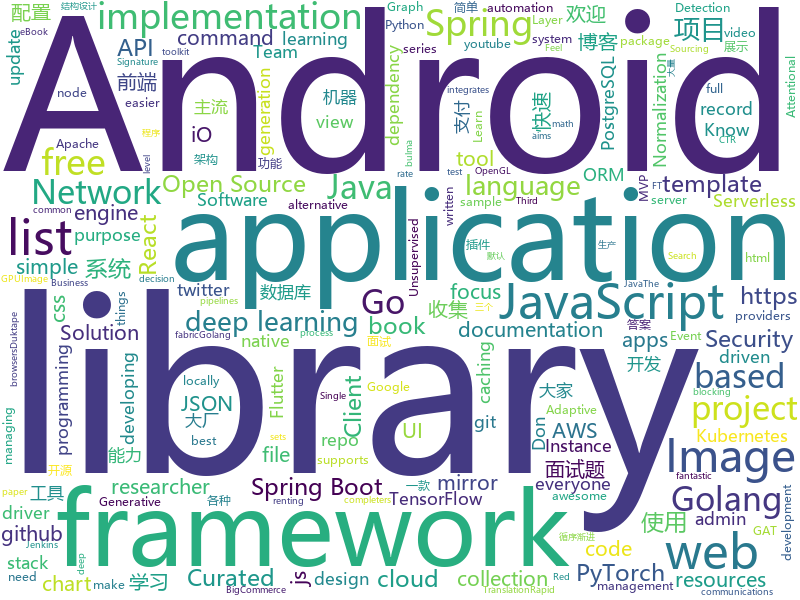

# 2019-08-07
See what the GitHub community is most excited about today.

## python
* [UGATIT-pytorch](https://github.com/znxlwm/UGATIT-pytorch)(**189 stars today**): Official PyTorch implementation of U-GAT-IT: Unsupervised Generative Attentional Networks with Adaptive Layer-Instance Normalization for Image-to-Image Translation
* [UGATIT](https://github.com/taki0112/UGATIT)(**397 stars today**): Official Tensorflow implementation of U-GAT-IT: Unsupervised Generative Attentional Networks with Adaptive Layer-Instance Normalization for Image-to-Image Translation
* [pytorch-lightning](https://github.com/williamFalcon/pytorch-lightning)(**201 stars today**): Rapid research framework for PyTorch. The researcher's version of Keras
* [interview_internal_reference](https://github.com/0voice/interview_internal_reference)(**346 stars today**): 2019年最新总结，阿里，腾讯，百度，美团，头条等技术面试题目，以及答案，专家出题人分析汇总。
* [delta](https://github.com/didi/delta)(**103 stars today**): DELTA is a deep learning based natural language and speech processing platform.
* [neural-networks-and-deep-learning](https://github.com/mnielsen/neural-networks-and-deep-learning)(**28 stars today**): Code samples for my book "Neural Networks and Deep Learning"
* [wtfpython-cn](https://github.com/leisurelicht/wtfpython-cn)(**13 stars today**): wtfpython的中文翻译/施工结束/ 能力有限，欢迎帮我改进翻译
* [face_recognition](https://github.com/ageitgey/face_recognition)(**129 stars today**): The world's simplest facial recognition api for Python and the command line
* [EfficientNet-PyTorch](https://github.com/lukemelas/EfficientNet-PyTorch)(**8 stars today**): A PyTorch implementation of EfficientNet
* [manim](https://github.com/3b1b/manim)(**76 stars today**): Animation engine for explanatory math videos
* [pytorch-tutorial](https://github.com/yunjey/pytorch-tutorial)(**35 stars today**): PyTorch Tutorial for Deep Learning Researchers
* [localstack](https://github.com/localstack/localstack)(**25 stars today**): 💻A fully functional local AWS cloud stack. Develop and test your cloud & Serverless apps offline!
* [deep_sort](https://github.com/nwojke/deep_sort)(**11 stars today**): Simple Online Realtime Tracking with a Deep Association Metric
* [ssd.pytorch](https://github.com/amdegroot/ssd.pytorch)(**6 stars today**): A PyTorch Implementation of Single Shot MultiBox Detector
* [goop](https://github.com/s0md3v/goop)(**24 stars today**): Google Search Scraper
* [gcn](https://github.com/tkipf/gcn)(**11 stars today**): Implementation of Graph Convolutional Networks in TensorFlow
* [spacy-pytorch-transformers](https://github.com/explosion/spacy-pytorch-transformers)(**15 stars today**): 🛸 spaCy pipelines for pre-trained BERT, XLNet and GPT-2
* [code_snippets](https://github.com/CoreyMSchafer/code_snippets)(**5 stars today**): 
* [DeepCTR](https://github.com/shenweichen/DeepCTR)(**10 stars today**): Easy-to-use,Modular and Extendible package of deep-learning based CTR models.
* [mmdetection](https://github.com/open-mmlab/mmdetection)(**31 stars today**): Open MMLab Detection Toolbox and Benchmark
* [sigma](https://github.com/Neo23x0/sigma)(**2 stars today**): Generic Signature Format for SIEM Systems
* [primer](https://github.com/Helpsypoo/primer)(**8 stars today**): code that makes videos for this: youtube.com/c/primerlearning
* [OneForAll](https://github.com/shmilylty/OneForAll)(**49 stars today**): OneForAll是一款功能强大的子域收集工具
* [tuya-convert](https://github.com/ct-Open-Source/tuya-convert)(**2 stars today**): A collection of scripts to flash Tuya IoT devices to alternative firmwares

## java
* [bbs](https://github.com/diyhi/bbs)(**44 stars today**): 巡云轻论坛系统采用JAVA+MYSQL架构，自适应手机端和电脑端，界面简洁，性能高效。数据库表结构设计使用分表方案,提高系统的负载能力。后台数据库备份/还原、全站指定目录打包、一键自动升级等功能使维护简单方便。系统拥有强大的模板管理功能，布局版块支持设置输出条件，让前端页面展示方便快捷。
* [interviews](https://github.com/kdn251/interviews)(**45 stars today**): Everything you need to know to get the job.
* [MPAndroidChart](https://github.com/PhilJay/MPAndroidChart)(**14 stars today**): A powerful🚀Android chart view / graph view library, supporting line- bar- pie- radar- bubble- and candlestick charts as well as scaling, dragging and animations.
* [glide](https://github.com/bumptech/glide)(**12 stars today**): An image loading and caching library for Android focused on smooth scrolling
* [tinker](https://github.com/Tencent/tinker)(**11 stars today**): Tinker is a hot-fix solution library for Android, it supports dex, library and resources update without reinstall apk.
* [easyexcel](https://github.com/alibaba/easyexcel)(**43 stars today**): 快速、简单避免OOM的java处理Excel工具
* [PictureSelector](https://github.com/LuckSiege/PictureSelector)(**43 stars today**): Picture Selector Library for Android or 多图片选择器
* [SpringAll](https://github.com/wuyouzhuguli/SpringAll)(**63 stars today**): 循序渐进，学习Spring Boot、Spring Boot & Shiro、Spring Cloud、Spring Security & Spring Security OAuth2，博客Spring系列源码
* [zxing-android-embedded](https://github.com/journeyapps/zxing-android-embedded)(**8 stars today**): Port of the ZXing Android application as an Android library project, for embedding in an Android application.
* [apollo-android](https://github.com/apollographql/apollo-android)(**7 stars today**): 📟A strongly-typed, caching GraphQL client for Android, written in Java
* [tutorials](https://github.com/eugenp/tutorials)(**26 stars today**): The "REST With Spring" Course:
* [keycloak](https://github.com/keycloak/keycloak)(**9 stars today**): Open Source Identity and Access Management For Modern Applications and Services
* [flutter_boost](https://github.com/alibaba/flutter_boost)(**9 stars today**): FlutterBoost is a Flutter plugin which enables hybrid integration of Flutter for your existing native apps with minimum efforts
* [jenkins](https://github.com/jenkinsci/jenkins)(**10 stars today**): Jenkins automation server
* [barcodescanner](https://github.com/dm77/barcodescanner)(**9 stars today**): Barcode Scanner Libraries for Android
* [guice](https://github.com/google/guice)(**11 stars today**): Guice (pronounced 'juice') is a lightweight dependency injection framework for Java 6 and above, brought to you by Google.
* [android-gpuimage](https://github.com/cats-oss/android-gpuimage)(**6 stars today**): Android filters based on OpenGL (idea from GPUImage for iOS)
* [storm](https://github.com/apache/storm)(**3 stars today**): Mirror of Apache Storm
* [solo](https://github.com/b3log/solo)(**79 stars today**): 🎸一款小而美的博客系统，专为程序员设计。
* [toBeTopJavaer](https://github.com/hollischuang/toBeTopJavaer)(**50 stars today**): To Be Top Javaer - Java工程师成神之路
* [xxpay-master](https://github.com/jmdhappy/xxpay-master)(**18 stars today**): XxPay聚合支付使用Java开发，包括spring-cloud、dubbo、spring-boot三个架构版本，已接入微信、支付宝等主流支付渠道，可直接用于生产环境
* [MVPArms](https://github.com/JessYanCoding/MVPArms)(**3 stars today**): ⚔️A common architecture for Android applications developing based on MVP, integrates many open source projects, to make your developing quicker and easier (一个整合了大量主流开源项目高度可配置化的 Android MVP 快速集成框架).
* [schemaspy](https://github.com/schemaspy/schemaspy)(**3 stars today**): SchemaSpy code home
* [apollo-use-cases](https://github.com/ctripcorp/apollo-use-cases)(**8 stars today**): 展示Apollo配置中心的各种使用场景和示例代码，欢迎大家把日常工作中的更多配置使用案例分享出来！
* [uCrop](https://github.com/Yalantis/uCrop)(**9 stars today**): Image Cropping Library for Android

## unknown
* [technology_books](https://github.com/arpitjindal97/technology_books)(**478 stars today**): Premium eBook free for Geeks
* [xiaozhi](https://github.com/qq449245884/xiaozhi)(**71 stars today**): 
* [The-Hackers-Hardware-Toolkit](https://github.com/yadox666/The-Hackers-Hardware-Toolkit)(**28 stars today**): The best hacker's gadgets for Red Team pentesters and security researchers.
* [awesome-react](https://github.com/enaqx/awesome-react)(**28 stars today**): A collection of awesome things regarding React ecosystem
* [pumpkin-book](https://github.com/datawhalechina/pumpkin-book)(**52 stars today**): 《机器学习》（西瓜书）公式推导解析，在线阅读地址：https://datawhalechina.github.io/pumpkin-book
* [free-programming-books-zh_CN](https://github.com/justjavac/free-programming-books-zh_CN)(**146 stars today**): 📚免费的计算机编程类中文书籍，欢迎投稿
* [JX3_MY_DATA](https://github.com/tinymins/JX3_MY_DATA)(**2 stars today**): 这是《剑网3》茗伊插件集自定义数据项目，通过该项目可在游戏中快速加载项目中的各种默认数据项。
* [laravel-best-practices](https://github.com/alexeymezenin/laravel-best-practices)(**10 stars today**): Laravel best practices
* [awesome-mlss](https://github.com/sshkhr/awesome-mlss)(**20 stars today**): List of summer schools in machine learning + related fields across the globe
* [FE-interview](https://github.com/qiu-deqing/FE-interview)(**7 stars today**): 收集的前端面试题和答案
* [badass-conference-talks](https://github.com/emmawedekind/badass-conference-talks)(**21 stars today**): 
* [webkit](https://github.com/WebKit/webkit)(**5 stars today**): Unofficial mirror of the WebKit SVN repository
* [Weekly-FE-Interview](https://github.com/airuikun/Weekly-FE-Interview)(**20 stars today**): 每周十道前端大厂面试题，并收集大家在大厂面试中遇到的难题，一起共同成长。
* [awesome-interview-questions](https://github.com/MaximAbramchuck/awesome-interview-questions)(**32 stars today**): A curated awesome list of lists of interview questions. Feel free to contribute!🎓
* [TimLiu-iOS](https://github.com/Tim9Liu9/TimLiu-iOS)(**5 stars today**): iOS开发常用三方库、插件、知名博客等等
* [awesome-apache-airflow](https://github.com/jghoman/awesome-apache-airflow)(**5 stars today**): Curated list of resources about Apache Airflow
* [you-dont-know-js-ru](https://github.com/azat-io/you-dont-know-js-ru)(**10 stars today**): 📚Russian translation of "You Don't Know JS" book series
* [article](https://github.com/ChenChunCamus/article)(**10 stars today**): 
* [architecture_decision_record](https://github.com/joelparkerhenderson/architecture_decision_record)(**10 stars today**): Architecture decision record (ADR) examples for software planning, IT leadership, and template documenation
* [You-Dont-Know-JS](https://github.com/getify/You-Dont-Know-JS)(**68 stars today**): A book series on JavaScript. @YDKJS on twitter.
* [awesome-ddd](https://github.com/heynickc/awesome-ddd)(**8 stars today**): A curated list of Domain-Driven Design (DDD), Command Query Responsibility Segregation (CQRS), Event Sourcing, and Event Storming resources
* [python_interview_question](https://github.com/kenwoodjw/python_interview_question)(**6 stars today**): 关于python的面试题
* [learn-regex](https://github.com/ziishaned/learn-regex)(**453 stars today**): Learn regex the easy way
* [dracula-theme](https://github.com/dracula/dracula-theme)(**13 stars today**): 😱A dark theme for all the things!
* [deep_learning_object_detection](https://github.com/hoya012/deep_learning_object_detection)(**12 stars today**): A paper list of object detection using deep learning.

## javascript
* [style2paints](https://github.com/lllyasviel/style2paints)(**199 stars today**): sketch + style = paints🎨
* [awesome-selfhosted](https://github.com/Kickball/awesome-selfhosted)(**101 stars today**): This is a list of Free Software network services and web applications which can be hosted locally. Selfhosting is the process of locally hosting and managing applications instead of renting from SaaS providers.
* [hackathon-starter](https://github.com/sahat/hackathon-starter)(**100 stars today**): A boilerplate for Node.js web applications
* [rollup](https://github.com/rollup/rollup)(**35 stars today**): Next-generation ES module bundler
* [dribbble2react](https://github.com/react-ui-kit/dribbble2react)(**19 stars today**): Transform Dribbble designs to React-Native code & YouTube video tutorials
* [diabloweb](https://github.com/d07RiV/diabloweb)(**48 stars today**): Diablo 1 for web browsers
* [duktape](https://github.com/svaarala/duktape)(**4 stars today**): Duktape - embeddable Javascript engine with a focus on portability and compact footprint
* [odoo](https://github.com/odoo/odoo)(**20 stars today**): Odoo. Open Source Apps To Grow Your Business.
* [Rocket.Chat](https://github.com/RocketChat/Rocket.Chat)(**23 stars today**): The ultimate Free Open Source Solution for team communications.
* [openlayers](https://github.com/openlayers/openlayers)(**16 stars today**): OpenLayers
* [quasar](https://github.com/quasarframework/quasar)(**20 stars today**): Quasar Framework - Build high-performance VueJS user interfaces in record time
* [hammer](https://github.com/hammerframework/hammer)(**18 stars today**): Opinionated, full stack, serverless JAMstack web application framework
* [select2](https://github.com/select2/select2)(**3 stars today**): Select2 is a jQuery based replacement for select boxes. It supports searching, remote data sets, and infinite scrolling of results.
* [jsPDF](https://github.com/MrRio/jsPDF)(**22 stars today**): Client-side JavaScript PDF generation for everyone.
* [livewire](https://github.com/calebporzio/livewire)(**46 stars today**): A magical front-end framework for Laravel
* [jest](https://github.com/facebook/jest)(**19 stars today**): Delightful JavaScript Testing.
* [umi](https://github.com/umijs/umi)(**10 stars today**): 🌋Pluggable enterprise-level react application framework.
* [google-access-helper](https://github.com/haotian-wang/google-access-helper)(**75 stars today**): 谷歌访问助手破解版
* [typescript-tutorial](https://github.com/xcatliu/typescript-tutorial)(**35 stars today**): TypeScript 入门教程
* [weui-miniprogram](https://github.com/wechat-miniprogram/weui-miniprogram)(**10 stars today**): 小程序UI组件库
* [renovate](https://github.com/renovatebot/renovate)(**9 stars today**): Multi-language dependency update automation. Flexible, so you don't need to be.
* [lerna](https://github.com/lerna/lerna)(**16 stars today**): 🐉A tool for managing JavaScript projects with multiple packages.
* [vue](https://github.com/vuejs/vue)(**105 stars today**): 🖖Vue.js is a progressive, incrementally-adoptable JavaScript framework for building UI on the web.
* [react-map-gl](https://github.com/uber/react-map-gl)(**7 stars today**): React friendly API wrapper around MapboxGL JS
* [three.js](https://github.com/mrdoob/three.js)(**34 stars today**): JavaScript 3D library.

## html
* [website](https://github.com/kubernetes/website)(**2 stars today**): Kubernetes website and documentation repo:
* [fastText](https://github.com/facebookresearch/fastText)(**39 stars today**): Library for fast text representation and classification.
* [cornerstone](https://github.com/bigcommerce/cornerstone)(**1 stars today**): The BigCommerce Cornerstone theme
* [blog_os](https://github.com/phil-opp/blog_os)(**5 stars today**): Writing an OS in Rust
* [favorites-web](https://github.com/cloudfavorites/favorites-web)(**4 stars today**): 云收藏 Spring Boot 2.X 开源项目
* [tiny-slider](https://github.com/ganlanyuan/tiny-slider)(**13 stars today**): Vanilla javascript slider for all purposes.
* [GTFOBins.github.io](https://github.com/GTFOBins/GTFOBins.github.io)(**14 stars today**): Curated list of Unix binaries that can be exploited to bypass system security restrictions
* [twemoji](https://github.com/twitter/twemoji)(**9 stars today**): Emoji for everyone. https://twemoji.twitter.com/
* [ru.javascript.info](https://github.com/javascript-tutorial/ru.javascript.info)(**57 stars today**): Современный учебник JavaScript
* [Advanced-Login-UI](https://github.com/akashyap2013/Advanced-Login-UI)(**4 stars today**): In this project we gonna learn how to create advanced login with html and css with owl-carousel.
* [patchwork](https://github.com/jlord/patchwork)(**0 stars today**): All the Git-it Workshop completers!
* [feature-engineering-for-ml-zh](https://github.com/apachecn/feature-engineering-for-ml-zh)(**9 stars today**): 📖[译] 面向机器学习的特征工程
* [chart-doctor](https://github.com/ft-interactive/chart-doctor)(**2 stars today**): Sample files to accompany the FT's Chart Doctor column
* [swagger-codegen](https://github.com/swagger-api/swagger-codegen)(**9 stars today**): swagger-codegen contains a template-driven engine to generate documentation, API clients and server stubs in different languages by parsing your OpenAPI / Swagger definition.
* [responsive-html-email-template](https://github.com/leemunroe/responsive-html-email-template)(**4 stars today**): A free simple responsive HTML email template
* [CLRS](https://github.com/walkccc/CLRS)(**0 stars today**): 📚Solutions to Introduction to Algorithms Third Edition
* [bulma-templates](https://github.com/BulmaTemplates/bulma-templates)(**1 stars today**): free flexbox templates built with the bulma css framework
* [coreui-free-bootstrap-admin-template](https://github.com/coreui/coreui-free-bootstrap-admin-template)(**4 stars today**): CoreUI is free bootstrap admin template
* [mqtt](https://github.com/mcxiaoke/mqtt)(**4 stars today**): MQTT 3.1.1 Protocol Chinese Translation
* [Home](https://github.com/NuGet/Home)(**2 stars today**): Repo for NuGet Client issues
* [game-of-life](https://github.com/wakaleo/game-of-life)(**0 stars today**): Demo application for the 'Jenkins: The Definitive Guide' book
* [learning-area](https://github.com/mdn/learning-area)(**0 stars today**): Github repo for the MDN Learning Area.
* [strapi-all-in](https://github.com/Gherciu/strapi-all-in)(**1 stars today**): Strapi starter for creating universal api's
* [docs](https://github.com/aws-amplify/docs)(**1 stars today**): Amplify Framework Documentation
* [flag-icon-css](https://github.com/lipis/flag-icon-css)(**4 stars today**): 🎏A collection of all country flags in SVG — plus the CSS for easier integration

## go
* [sampler](https://github.com/sqshq/sampler)(**378 stars today**): A tool for shell commands execution, visualization and alerting. Configured with a simple YAML file.
* [gitomatic](https://github.com/muesli/gitomatic)(**151 stars today**): A tool to monitor git repositories and automatically pull & push changes
* [go-micro](https://github.com/micro/go-micro)(**81 stars today**): A microservice development framework
* [ratelimit](https://github.com/uber-go/ratelimit)(**57 stars today**): A Golang blocking leaky-bucket rate limit implementation
* [migrate](https://github.com/golang-migrate/migrate)(**51 stars today**): Database migrations. CLI and Golang library.
* [prometheus](https://github.com/prometheus/prometheus)(**31 stars today**): The Prometheus monitoring system and time series database.
* [terraform-provider-aws](https://github.com/terraform-providers/terraform-provider-aws)(**8 stars today**): Terraform AWS provider
* [xlsx](https://github.com/tealeg/xlsx)(**41 stars today**): Google Go (golang) library for reading and writing XLSX files. You should probably also checkout: https://github.com/360EntSecGroup-Skylar/excelize
* [jwt-go](https://github.com/dgrijalva/jwt-go)(**18 stars today**): Golang implementation of JSON Web Tokens (JWT)
* [Go-SCP](https://github.com/OWASP/Go-SCP)(**92 stars today**): Go programming language secure coding practices guide
* [aws-sdk-go](https://github.com/aws/aws-sdk-go)(**5 stars today**): AWS SDK for the Go programming language.
* [pgx](https://github.com/jackc/pgx)(**12 stars today**): PostgreSQL driver and toolkit for Go
* [aws-vault](https://github.com/99designs/aws-vault)(**14 stars today**): A vault for securely storing and accessing AWS credentials in development environments
* [pg](https://github.com/go-pg/pg)(**6 stars today**): Golang ORM with focus on PostgreSQL features and performance
* [viper](https://github.com/spf13/viper)(**11 stars today**): Go configuration with fangs
* [graphql-go](https://github.com/graph-gophers/graphql-go)(**9 stars today**): GraphQL server with a focus on ease of use
* [gorm](https://github.com/jinzhu/gorm)(**8 stars today**): The fantastic ORM library for Golang, aims to be developer friendly
* [gjson](https://github.com/tidwall/gjson)(**13 stars today**): Get JSON values quickly - JSON Parser for Go
* [kruise](https://github.com/openkruise/kruise)(**7 stars today**): Automate application workloads management on Kubernetes
* [fabric](https://github.com/hyperledger/fabric)(**6 stars today**): Read-only mirror of https://gerrit.hyperledger.org/r/#/admin/projects/fabric
* [go-grpc-middleware](https://github.com/grpc-ecosystem/go-grpc-middleware)(**7 stars today**): Golang gRPC Middlewares: interceptor chaining, auth, logging, retries and more.
* [mongo-go-driver](https://github.com/mongodb/mongo-go-driver)(**9 stars today**): The Go driver for MongoDB
* [dashboard](https://github.com/kubernetes/dashboard)(**19 stars today**): General-purpose web UI for Kubernetes clusters
* [btcd](https://github.com/btcsuite/btcd)(**2 stars today**): An alternative full node bitcoin implementation written in Go (golang)
* [oauth2_proxy](https://github.com/pusher/oauth2_proxy)(**11 stars today**): A reverse proxy that provides authentication with Google, Github or other providers.

## WordCloud

