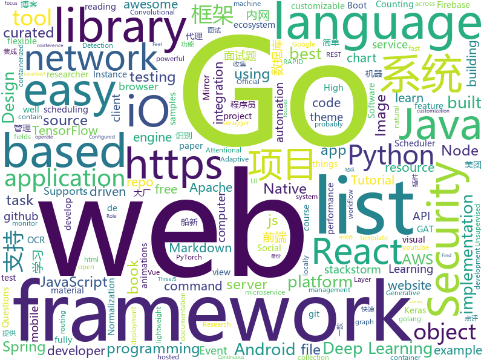

# 2019-08-08
See what the GitHub community is most excited about today.

## python
* [UGATIT](https://github.com/taki0112/UGATIT)(**425 stars today**): Official Tensorflow implementation of U-GAT-IT: Unsupervised Generative Attentional Networks with Adaptive Layer-Instance Normalization for Image-to-Image Translation
* [UGATIT-pytorch](https://github.com/znxlwm/UGATIT-pytorch)(**186 stars today**): Official PyTorch implementation of U-GAT-IT: Unsupervised Generative Attentional Networks with Adaptive Layer-Instance Normalization for Image-to-Image Translation
* [handout](https://github.com/danijar/handout)(**214 stars today**): Turn Python scripts into handouts with Markdown and figures
* [pyBlazing](https://github.com/BlazingDB/pyBlazing)(**102 stars today**): BlazingSQL is a lightweight, GPU accelerated, SQL engine built on RAPIDS.
* [ZeroNet](https://github.com/HelloZeroNet/ZeroNet)(**61 stars today**): ZeroNet - Decentralized websites using Bitcoin crypto and BitTorrent network
* [TecoGAN](https://github.com/thunil/TecoGAN)(**109 stars today**): This repo will contain source code and materials for the TecoGAN project, i.e. code for a TEmporally COherent GAN
* [delta](https://github.com/didi/delta)(**163 stars today**): DELTA is a deep learning based natural language and speech processing platform.
* [sherlock](https://github.com/sherlock-project/sherlock)(**54 stars today**): 🔎Find usernames across social networks
* [face_recognition](https://github.com/ageitgey/face_recognition)(**93 stars today**): The world's simplest facial recognition api for Python and the command line
* [cloudgoat](https://github.com/RhinoSecurityLabs/cloudgoat)(**6 stars today**): CloudGoat is Rhino Security Labs' "Vulnerable by Design" AWS deployment tool
* [compose](https://github.com/docker/compose)(**18 stars today**): Define and run multi-container applications with Docker
* [jumpcutter](https://github.com/carykh/jumpcutter)(**7 stars today**): Automatically edits vidx. Explanation here: https://www.youtube.com/watch?v=DQ8orIurGxw
* [airflow](https://github.com/apache/airflow)(**28 stars today**): Apache Airflow
* [pytorch-tutorial](https://github.com/yunjey/pytorch-tutorial)(**32 stars today**): PyTorch Tutorial for Deep Learning Researchers
* [neural-networks-and-deep-learning](https://github.com/mnielsen/neural-networks-and-deep-learning)(**12 stars today**): Code samples for my book "Neural Networks and Deep Learning"
* [pytorch-lightning](https://github.com/williamFalcon/pytorch-lightning)(**118 stars today**): Rapid research framework for PyTorch. The researcher's version of Keras
* [tensorflow_object_counting_api](https://github.com/ahmetozlu/tensorflow_object_counting_api)(**22 stars today**): 🚀The TensorFlow Object Counting API is an open source framework built on top of TensorFlow and Keras that makes it easy to develop object counting systems!
* [st2](https://github.com/StackStorm/st2)(**3 stars today**): StackStorm (aka "IFTTT for Ops") is event-driven automation for auto-remediation, security responses, troubleshooting, deployments, and more. Includes rules engine, workflow, 160 integration packs with 6000+ actions (see https://exchange.stackstorm.org) and ChatOps. Installer at https://docs.stackstorm.com/install/index.html. Questions? https://…
* [pysot](https://github.com/STVIR/pysot)(**3 stars today**): SenseTime Research platform for single object tracking, implementing algorithms like SiamRPN and SiamMask.
* [APT_REPORT](https://github.com/blackorbird/APT_REPORT)(**6 stars today**): Interesting apt report collection and some special ioc express
* [FCOS](https://github.com/tianzhi0549/FCOS)(**12 stars today**): FCOS: Fully Convolutional One-Stage Object Detection (ICCV'19)
* [Deep-Learning-Papers-Reading-Roadmap](https://github.com/floodsung/Deep-Learning-Papers-Reading-Roadmap)(**18 stars today**): Deep Learning papers reading roadmap for anyone who are eager to learn this amazing tech!
* [pytext](https://github.com/facebookresearch/pytext)(**7 stars today**): A natural language modeling framework based on PyTorch
* [imgclsmob](https://github.com/osmr/imgclsmob)(**3 stars today**): Sandbox for training convolutional networks for computer vision
* [keras-tuner](https://github.com/keras-team/keras-tuner)(**15 stars today**): Hyperparameter tuning for humans

## java
* [spring-boot](https://github.com/spring-projects/spring-boot)(**48 stars today**): Spring Boot
* [flink](https://github.com/apache/flink)(**15 stars today**): Apache Flink
* [netbeans](https://github.com/apache/netbeans)(**2 stars today**): Apache NetBeans
* [solo](https://github.com/b3log/solo)(**73 stars today**): 🎸一款小而美的博客系统，专为程序员设计。
* [JavaGuide](https://github.com/Snailclimb/JavaGuide)(**123 stars today**): 【Java学习+面试指南】 一份涵盖大部分Java程序员所需要掌握的核心知识。
* [storm](https://github.com/apache/storm)(**4 stars today**): Mirror of Apache Storm
* [EasyScheduler](https://github.com/analysys/EasyScheduler)(**14 stars today**): Easy Scheduler is a distributed visual workflow scheduling system, which focuses on solving the problem of "complex task dependencies". Easy Scheduler assembles tasks in a DAG graph to monitor the running status of tasks in real time. In addition, it supports retries from specified nodes, recovery failures, suspension and termination of tasks . …
* [rabbitmq-tutorials](https://github.com/rabbitmq/rabbitmq-tutorials)(**13 stars today**): Tutorials for using RabbitMQ in various ways
* [tutorials](https://github.com/eugenp/tutorials)(**31 stars today**): The "REST With Spring" Course:
* [easyexcel](https://github.com/alibaba/easyexcel)(**23 stars today**): 快速、简单避免OOM的java处理Excel工具
* [C-OCR](https://github.com/ctripcorp/C-OCR)(**67 stars today**): C-OCR是携程自研的OCR项目，主要包括身份证、护照、火车票、签证等旅游相关证件、材料的识别。 项目包含4个部分，拒识、检测、识别、后处理。
* [PictureSelector](https://github.com/LuckSiege/PictureSelector)(**21 stars today**): Picture Selector Library for Android or 多图片选择器
* [AndResGuard](https://github.com/shwenzhang/AndResGuard)(**6 stars today**): proguard resource for Android by wechat team
* [spring-framework](https://github.com/spring-projects/spring-framework)(**34 stars today**): Spring Framework
* [alluxio](https://github.com/Alluxio/alluxio)(**0 stars today**): Alluxio, data orchestration for analytics and machine learning in the cloud
* [camel](https://github.com/apache/camel)(**3 stars today**): Apache Camel
* [lottie-android](https://github.com/airbnb/lottie-android)(**12 stars today**): Render After Effects animations natively on Android and iOS, Web, and React Native
* [selenium](https://github.com/SeleniumHQ/selenium)(**12 stars today**): A browser automation framework and ecosystem.
* [bbs](https://github.com/diyhi/bbs)(**22 stars today**): 巡云轻论坛系统采用JAVA+MYSQL架构，自适应手机端和电脑端，界面简洁，性能高效。数据库表结构设计使用分表方案,提高系统的负载能力。后台数据库备份/还原、全站指定目录打包、一键自动升级等功能使维护简单方便。系统拥有强大的模板管理功能，布局版块支持设置输出条件，让前端页面展示方便快捷。
* [rest-assured](https://github.com/rest-assured/rest-assured)(**5 stars today**): Java DSL for easy testing of REST services
* [sofa-boot](https://github.com/sofastack/sofa-boot)(**3 stars today**): SOFABoot is a framework that enhances Spring Boot and fully compatible with it, provides readiness check, class isolation, etc.
* [MPAndroidChart](https://github.com/PhilJay/MPAndroidChart)(**12 stars today**): A powerful🚀Android chart view / graph view library, supporting line- bar- pie- radar- bubble- and candlestick charts as well as scaling, dragging and animations.
* [spring-cloud-gateway](https://github.com/spring-cloud/spring-cloud-gateway)(**3 stars today**): A Gateway built on Spring Framework 5.x and Spring Boot 2.x providing routing and more.
* [mockito](https://github.com/mockito/mockito)(**10 stars today**): Most popular Mocking framework for unit tests written in Java
* [cat](https://github.com/dianping/cat)(**37 stars today**): CAT 作为服务端项目基础组件，提供了 Java, C/C++, Node.js, Python, Go 等多语言客户端，已经在美团点评的基础架构中间件框架（MVC框架，RPC框架，数据库框架，缓存框架等，消息队列，配置系统等）深度集成，为美团点评各业务线提供系统丰富的性能指标、健康状况、实时告警等。

## unknown
* [technology_books](https://github.com/arpitjindal97/technology_books)(**447 stars today**): Premium eBook free for Geeks
* [xiaozhi](https://github.com/qq449245884/xiaozhi)(**34 stars today**): 
* [The-Hackers-Hardware-Toolkit](https://github.com/yadox666/The-Hackers-Hardware-Toolkit)(**10 stars today**): The best hacker's gadgets for Red Team pentesters and security researchers.
* [awesome-react](https://github.com/enaqx/awesome-react)(**51 stars today**): A collection of awesome things regarding React ecosystem
* [pumpkin-book](https://github.com/datawhalechina/pumpkin-book)(**38 stars today**): 《机器学习》（西瓜书）公式推导解析，在线阅读地址：https://datawhalechina.github.io/pumpkin-book
* [free-programming-books-zh_CN](https://github.com/justjavac/free-programming-books-zh_CN)(**102 stars today**): 📚免费的计算机编程类中文书籍，欢迎投稿
* [JX3_MY_DATA](https://github.com/tinymins/JX3_MY_DATA)(**1 stars today**): 这是《剑网3》茗伊插件集自定义数据项目，通过该项目可在游戏中快速加载项目中的各种默认数据项。
* [laravel-best-practices](https://github.com/alexeymezenin/laravel-best-practices)(**2 stars today**): Laravel best practices
* [awesome-mlss](https://github.com/sshkhr/awesome-mlss)(**15 stars today**): List of summer schools in machine learning + related fields across the globe
* [FE-interview](https://github.com/qiu-deqing/FE-interview)(**4 stars today**): 收集的前端面试题和答案
* [badass-conference-talks](https://github.com/emmawedekind/badass-conference-talks)(**11 stars today**): 
* [webkit](https://github.com/WebKit/webkit)(**3 stars today**): Unofficial mirror of the WebKit SVN repository
* [Weekly-FE-Interview](https://github.com/airuikun/Weekly-FE-Interview)(**18 stars today**): 每周十道前端大厂面试题，并收集大家在大厂面试中遇到的难题，一起共同成长。
* [awesome-interview-questions](https://github.com/MaximAbramchuck/awesome-interview-questions)(**12 stars today**): A curated awesome list of lists of interview questions. Feel free to contribute!🎓
* [TimLiu-iOS](https://github.com/Tim9Liu9/TimLiu-iOS)(**7 stars today**): iOS开发常用三方库、插件、知名博客等等
* [awesome-apache-airflow](https://github.com/jghoman/awesome-apache-airflow)(**1 stars today**): Curated list of resources about Apache Airflow
* [you-dont-know-js-ru](https://github.com/azat-io/you-dont-know-js-ru)(**1 stars today**): 📚Russian translation of "You Don't Know JS" book series
* [article](https://github.com/ChenChunCamus/article)(**10 stars today**): 
* [architecture_decision_record](https://github.com/joelparkerhenderson/architecture_decision_record)(**7 stars today**): Architecture decision record (ADR) examples for software planning, IT leadership, and template documenation
* [You-Dont-Know-JS](https://github.com/getify/You-Dont-Know-JS)(**63 stars today**): A book series on JavaScript. @YDKJS on twitter.
* [awesome-ddd](https://github.com/heynickc/awesome-ddd)(**6 stars today**): A curated list of Domain-Driven Design (DDD), Command Query Responsibility Segregation (CQRS), Event Sourcing, and Event Storming resources
* [python_interview_question](https://github.com/kenwoodjw/python_interview_question)(**3 stars today**): 关于python的面试题
* [learn-regex](https://github.com/ziishaned/learn-regex)(**414 stars today**): Learn regex the easy way
* [dracula-theme](https://github.com/dracula/dracula-theme)(**21 stars today**): 😱A dark theme for all the things!
* [deep_learning_object_detection](https://github.com/hoya012/deep_learning_object_detection)(**9 stars today**): A paper list of object detection using deep learning.

## javascript
* [gridstudio](https://github.com/ricklamers/gridstudio)(**470 stars today**): Grid studio is a web-based spreadsheet application with full integration of the Python programming language.
* [nodeppt](https://github.com/ksky521/nodeppt)(**77 stars today**): This is probably the best web presentation tool so far!
* [react](https://github.com/facebook/react)(**84 stars today**): A declarative, efficient, and flexible JavaScript library for building user interfaces.
* [fullstack-tutorial](https://github.com/apollographql/fullstack-tutorial)(**35 stars today**): 🚀The Apollo platform tutorial app
* [vue](https://github.com/vuejs/vue)(**112 stars today**): 🖖Vue.js is a progressive, incrementally-adoptable JavaScript framework for building UI on the web.
* [blockly](https://github.com/google/blockly)(**28 stars today**): The web-based visual programming editor.
* [style2paints](https://github.com/lllyasviel/style2paints)(**92 stars today**): sketch + style = paints🎨
* [drawio-desktop](https://github.com/jgraph/drawio-desktop)(**14 stars today**): Official electron build of draw.io
* [react-boilerplate](https://github.com/react-boilerplate/react-boilerplate)(**27 stars today**): 🔥A highly scalable, offline-first foundation with the best developer experience and a focus on performance and best practices.
* [awesome-selfhosted](https://github.com/Kickball/awesome-selfhosted)(**78 stars today**): This is a list of Free Software network services and web applications which can be hosted locally. Selfhosting is the process of locally hosting and managing applications instead of renting from SaaS providers.
* [react-navigation](https://github.com/react-navigation/react-navigation)(**9 stars today**): Routing and navigation for your React Native apps
* [vuelidate](https://github.com/vuelidate/vuelidate)(**21 stars today**): Simple, lightweight model-based validation for Vue.js
* [react-final-form](https://github.com/final-form/react-final-form)(**25 stars today**): 🏁High performance subscription-based form state management for React
* [webdriverio](https://github.com/webdriverio/webdriverio)(**11 stars today**): Next-gen WebDriver test automation framework for Node.js
* [habitica](https://github.com/HabitRPG/habitica)(**12 stars today**): A habit tracker app which treats your goals like a Role Playing Game.
* [react-virtualized](https://github.com/bvaughn/react-virtualized)(**17 stars today**): React components for efficiently rendering large lists and tabular data
* [dribbble2react](https://github.com/react-ui-kit/dribbble2react)(**9 stars today**): Transform Dribbble designs to React-Native code & YouTube video tutorials
* [rollup](https://github.com/rollup/rollup)(**25 stars today**): Next-generation ES module bundler
* [WebGoat](https://github.com/WebGoat/WebGoat)(**8 stars today**): WebGoat 8.0
* [devconnector_2.0](https://github.com/bradtraversy/devconnector_2.0)(**3 stars today**): Social network for developers, built on the MERN stack
* [mapbox-gl-js](https://github.com/mapbox/mapbox-gl-js)(**5 stars today**): Interactive, thoroughly customizable maps in the browser, powered by vector tiles and WebGL
* [markdown-here](https://github.com/adam-p/markdown-here)(**35 stars today**): Google Chrome, Firefox, and Thunderbird extension that lets you write email in Markdown and render it before sending.
* [gatsby-themes](https://github.com/LekoArts/gatsby-themes)(**9 stars today**): Get high-quality and customizable Gatsby themes to quickly bootstrap your website! Choose from many professionally created and impressive designs with a wide variety of features and customization options.
* [mc.js](https://github.com/ian13456/mc.js)(**29 stars today**): Open source Minecraft clone built with ThreeJS, ReactJS, GraphQL, and NodeJS.
* [react-native-firebase](https://github.com/invertase/react-native-firebase)(**8 stars today**): 🔥A well tested feature rich modular Firebase implementation for React Native. Supports both iOS & Android platforms for over 20 Firebase services.

## html
* [awesome-piracy](https://github.com/Igglybuff/awesome-piracy)(**60 stars today**): A curated list of awesome warez and piracy links
* [website](https://github.com/kubernetes/website)(**0 stars today**): Kubernetes website and documentation repo:
* [ru.javascript.info](https://github.com/javascript-tutorial/ru.javascript.info)(**38 stars today**): Современный учебник JavaScript
* [tiny-slider](https://github.com/ganlanyuan/tiny-slider)(**7 stars today**): Vanilla javascript slider for all purposes.
* [swagger-codegen](https://github.com/swagger-api/swagger-codegen)(**12 stars today**): swagger-codegen contains a template-driven engine to generate documentation, API clients and server stubs in different languages by parsing your OpenAPI / Swagger definition.
* [Advanced-Login-UI](https://github.com/akashyap2013/Advanced-Login-UI)(**1 stars today**): In this project we gonna learn how to create advanced login with html and css with owl-carousel.
* [fastText](https://github.com/facebookresearch/fastText)(**27 stars today**): Library for fast text representation and classification.
* [blog](https://github.com/biaochenxuying/blog)(**10 stars today**): 技术为主，读书笔记、随笔、理财为辅，做个终身学习者。
* [feature-engineering-for-ml-zh](https://github.com/apachecn/feature-engineering-for-ml-zh)(**5 stars today**): 📖[译] 面向机器学习的特征工程
* [mkdocs-material](https://github.com/squidfunk/mkdocs-material)(**8 stars today**): A Material Design theme for MkDocs
* [REKCARC-TSC-UHT](https://github.com/PKUanonym/REKCARC-TSC-UHT)(**18 stars today**): 清华大学计算机系课程攻略 Guidance for courses in Department of Computer Science and Technology, Tsinghua University
* [disobey2020.github.io](https://github.com/disobey2020/disobey2020.github.io)(**1 stars today**): Can't wait!
* [cypress-example-kitchensink](https://github.com/cypress-io/cypress-example-kitchensink)(**2 stars today**): This is an example app used to showcase Cypress.io testing.
* [ai-deadlines](https://github.com/abhshkdz/ai-deadlines)(**4 stars today**): ⏰AI conference deadline countdowns
* [chart-doctor](https://github.com/ft-interactive/chart-doctor)(**1 stars today**): Sample files to accompany the FT's Chart Doctor column
* [proposal-class-fields](https://github.com/tc39/proposal-class-fields)(**4 stars today**): Orthogonally-informed combination of public and private fields proposals
* [owasp-mstg](https://github.com/OWASP/owasp-mstg)(**3 stars today**): The Mobile Security Testing Guide (MSTG) is a comprehensive manual for mobile app security development, testing and reverse engineering.
* [Berserker](https://github.com/zer0yu/Berserker)(**9 stars today**): A list of useful payloads for Web Application Security and Pentest/CTF
* [wpt](https://github.com/web-platform-tests/wpt)(**5 stars today**): Test suites for Web platform specs — including WHATWG, W3C, and others
* [learning-area](https://github.com/mdn/learning-area)(**3 stars today**): Github repo for the MDN Learning Area.
* [Markdown-Resume](https://github.com/CyC2018/Markdown-Resume)(**4 stars today**): ⭐️Markdown 简历模版
* [v2-ui](https://github.com/sprov065/v2-ui)(**15 stars today**): python 重构 sprov-ui，一个船新的 v2ray 面板，给你一种船新的体验
* [speedtest](https://github.com/adolfintel/speedtest)(**2 stars today**): Self-hosted HTML5 Speedtest. Easy setup, examples, configurable, mobile friendly. Supports PHP, Node, Multiple servers, and more
* [hyperblog](https://github.com/freddier/hyperblog)(**8 stars today**): Un blog increíble para el curso de Git y Github de Platzi
* [fastclick](https://github.com/ftlabs/fastclick)(**6 stars today**): Polyfill to remove click delays on browsers with touch UIs

## go
* [aws-lambda-go](https://github.com/aws/aws-lambda-go)(**36 stars today**): Libraries, samples and tools to help Go developers develop AWS Lambda functions.
* [nps](https://github.com/cnlh/nps)(**228 stars today**): 一款轻量级、功能强大的内网穿透代理服务器。支持tcp、udp流量转发，支持内网http代理、内网socks5代理，同时支持snappy压缩、站点保护、加密传输、多路复用、header修改等。支持web图形化管理，集成多用户模式。
* [migrate](https://github.com/golang-migrate/migrate)(**55 stars today**): Database migrations. CLI and Golang library.
* [vault](https://github.com/hashicorp/vault)(**13 stars today**): A tool for secrets management, encryption as a service, and privileged access management
* [go-ethereum](https://github.com/ethereum/go-ethereum)(**7 stars today**): Official Go implementation of the Ethereum protocol
* [sarama](https://github.com/Shopify/sarama)(**9 stars today**): Sarama is a Go library for Apache Kafka 0.8, and up.
* [xlsx](https://github.com/tealeg/xlsx)(**12 stars today**): Google Go (golang) library for reading and writing XLSX files. You should probably also checkout: https://github.com/360EntSecGroup-Skylar/excelize
* [go-micro](https://github.com/micro/go-micro)(**43 stars today**): A microservice development framework
* [nomad](https://github.com/hashicorp/nomad)(**7 stars today**): Nomad is an easy-to-use, flexible, and performant workload orchestrator that can deploy a mix of microservice, batch, containerized, and non-containerized applications. Nomad is easy to operate and scale and has native Consul and Vault integrations.
* [hcl](https://github.com/hashicorp/hcl)(**5 stars today**): HCL is the HashiCorp configuration language.
* [aws-sdk-go](https://github.com/aws/aws-sdk-go)(**7 stars today**): AWS SDK for the Go programming language.
* [sampler](https://github.com/sqshq/sampler)(**224 stars today**): A tool for shell commands execution, visualization and alerting. Configured with a simple YAML file.
* [gocv](https://github.com/hybridgroup/gocv)(**8 stars today**): Go package for computer vision using OpenCV 4 and beyond.
* [pgx](https://github.com/jackc/pgx)(**6 stars today**): PostgreSQL driver and toolkit for Go
* [kubernetes](https://github.com/kubernetes/kubernetes)(**64 stars today**): Production-Grade Container Scheduling and Management
* [syncthing](https://github.com/syncthing/syncthing)(**16 stars today**): Open Source Continuous File Synchronization
* [community](https://github.com/kubernetes/community)(**32 stars today**): Kubernetes community content
* [mux](https://github.com/gorilla/mux)(**4 stars today**): A powerful HTTP router and URL matcher for building Go web servers with🦍
* [colly](https://github.com/gocolly/colly)(**14 stars today**): Elegant Scraper and Crawler Framework for Golang
* [redis](https://github.com/go-redis/redis)(**9 stars today**): Type-safe Redis client for Golang
* [gitomatic](https://github.com/muesli/gitomatic)(**58 stars today**): A tool to monitor git repositories and automatically pull & push changes
* [external-dns](https://github.com/kubernetes-incubator/external-dns)(**6 stars today**): Configure external DNS servers (AWS Route53, Google CloudDNS and others) for Kubernetes Ingresses and Services
* [grpc-go](https://github.com/grpc/grpc-go)(**12 stars today**): The Go language implementation of gRPC. HTTP/2 based RPC
* [gocql](https://github.com/gocql/gocql)(**2 stars today**): Package gocql implements a fast and robust Cassandra client for the Go programming language.
* [tendermint](https://github.com/tendermint/tendermint)(**6 stars today**): ⟁ Tendermint Core (BFT Consensus) in Go

## WordCloud

