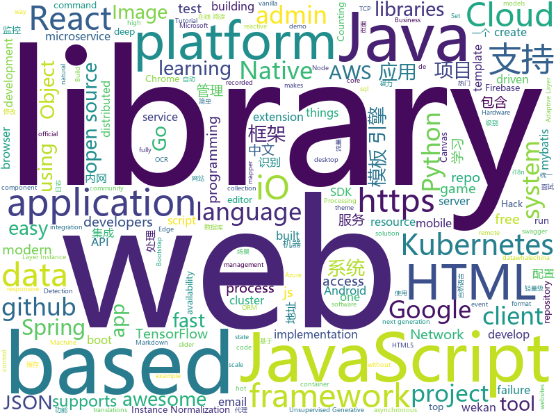

# 2019-08-09
See what the GitHub community is most excited about today.

## python
* [UGATIT](https://github.com/taki0112/UGATIT)(**332 stars today**): Official Tensorflow implementation of U-GAT-IT: Unsupervised Generative Attentional Networks with Adaptive Layer-Instance Normalization for Image-to-Image Translation
* [UGATIT-pytorch](https://github.com/znxlwm/UGATIT-pytorch)(**119 stars today**): Official PyTorch implementation of U-GAT-IT: Unsupervised Generative Attentional Networks with Adaptive Layer-Instance Normalization for Image-to-Image Translation
* [sistine](https://github.com/bijection/sistine)(**91 stars today**): Turn a MacBook into a Touchscreen with $1 of Hardware
* [nlp](https://github.com/makcedward/nlp)(**68 stars today**): 📝This repository recorded my NLP journey.
* [tensorflow_object_counting_api](https://github.com/ahmetozlu/tensorflow_object_counting_api)(**37 stars today**): 🚀The TensorFlow Object Counting API is an open source framework built on top of TensorFlow and Keras that makes it easy to develop object counting systems!
* [handout](https://github.com/danijar/handout)(**250 stars today**): Turn Python scripts into handouts with Markdown and figures
* [delta](https://github.com/didi/delta)(**147 stars today**): DELTA is a deep learning based natural language and speech processing platform.
* [mmdetection](https://github.com/open-mmlab/mmdetection)(**46 stars today**): Open MMLab Detection Toolbox and Benchmark
* [sherlock](https://github.com/sherlock-project/sherlock)(**96 stars today**): 🔎Find usernames across social networks
* [python-fire](https://github.com/google/python-fire)(**17 stars today**): Python Fire is a library for automatically generating command line interfaces (CLIs) from absolutely any Python object.
* [awesome-python](https://github.com/vinta/awesome-python)(**61 stars today**): A curated list of awesome Python frameworks, libraries, software and resources
* [compose](https://github.com/docker/compose)(**14 stars today**): Define and run multi-container applications with Docker
* [interview_internal_reference](https://github.com/0voice/interview_internal_reference)(**211 stars today**): 2019年最新总结，阿里，腾讯，百度，美团，头条等技术面试题目，以及答案，专家出题人分析汇总。
* [google-cloud-python](https://github.com/googleapis/google-cloud-python)(**3 stars today**): Google Cloud Client Library for Python
* [TecoGAN](https://github.com/thunil/TecoGAN)(**28 stars today**): This repo will contain source code and materials for the TecoGAN project, i.e. code for a TEmporally COherent GAN
* [dagster](https://github.com/dagster-io/dagster)(**7 stars today**): Dagster is an open-source system for building data applications.
* [b](https://github.com/davekch/b)(**18 stars today**): Brainfuck interpreter in a single line of Python
* [wait-for-it](https://github.com/vishnubob/wait-for-it)(**8 stars today**): Pure bash script to test and wait on the availability of a TCP host and port
* [ZeroNet](https://github.com/HelloZeroNet/ZeroNet)(**42 stars today**): ZeroNet - Decentralized websites using Bitcoin crypto and BitTorrent network
* [FCOS](https://github.com/tianzhi0549/FCOS)(**11 stars today**): FCOS: Fully Convolutional One-Stage Object Detection (ICCV'19)
* [dgl](https://github.com/dmlc/dgl)(**6 stars today**): Python package built to ease deep learning on graph, on top of existing DL frameworks.
* [nuscenes-devkit](https://github.com/nutonomy/nuscenes-devkit)(**5 stars today**): The devkit of the nuScenes dataset.
* [localstack](https://github.com/localstack/localstack)(**31 stars today**): 💻A fully functional local AWS cloud stack. Develop and test your cloud & Serverless apps offline!
* [brain-tokyo-workshop](https://github.com/google/brain-tokyo-workshop)(**8 stars today**): 🧠🗼
* [pytorch-transformers](https://github.com/huggingface/pytorch-transformers)(**43 stars today**): 👾A library of state-of-the-art pretrained models for Natural Language Processing (NLP)

## java
* [spring-boot](https://github.com/spring-projects/spring-boot)(**62 stars today**): Spring Boot
* [Hystrix](https://github.com/Netflix/Hystrix)(**17 stars today**): Hystrix is a latency and fault tolerance library designed to isolate points of access to remote systems, services and 3rd party libraries, stop cascading failure and enable resilience in complex distributed systems where failure is inevitable.
* [tutorials](https://github.com/eugenp/tutorials)(**35 stars today**): The "REST With Spring" Course:
* [guava](https://github.com/google/guava)(**28 stars today**): Google core libraries for Java
* [magnetW](https://github.com/dengyuhan/magnetW)(**328 stars today**): 磁力搜网页版 - 磁力链接聚合搜索 - https://bt.biedian.me
* [C-OCR](https://github.com/ctripcorp/C-OCR)(**57 stars today**): C-OCR是携程自研的OCR项目，主要包括身份证、护照、火车票、签证等旅游相关证件、材料的识别。 项目包含4个部分，拒识、检测、识别、后处理。
* [solo](https://github.com/b3log/solo)(**97 stars today**): 🎸一款小而美的博客系统，专为程序员设计。
* [libgdx](https://github.com/libgdx/libgdx)(**8 stars today**): Desktop/Android/HTML5/iOS Java game development framework
* [spring-boot-demo](https://github.com/xkcoding/spring-boot-demo)(**39 stars today**): spring boot demo 是一个用来学习 spring boot 的项目，总共包含 57 个集成demo，已经完成 47 个。包含集成 actuator(监控)、admin(可视化监控)、logback(日志)、aopLog(通过AOP记录web请求日志)、统一异常处理(json级别和页面级别)、freemarker(模板引擎)、thymeleaf(模板引擎)、Beetl(模板引擎)、Enjoy(模板引擎)、JdbcTemplate、JPA(ORM框架)、mybatis(ORM框架)、通用Mapper、PageHelper、mybatis-plus、BeetlSQL、upload(本地文件上传和七牛云文件上传)、redis(缓存)、ehcache(缓存)、email(发送各种类…
* [HanLP](https://github.com/hankcs/HanLP)(**30 stars today**): 自然语言处理 中文分词 词性标注 命名实体识别 依存句法分析 新词发现 关键词短语提取 自动摘要 文本分类聚类 拼音简繁
* [Sentinel](https://github.com/alibaba/Sentinel)(**32 stars today**): A lightweight powerful flow control component enabling reliability and monitoring for microservices. (轻量级的流量控制、熔断降级 Java 库)
* [bbs](https://github.com/diyhi/bbs)(**13 stars today**): 巡云轻论坛系统采用JAVA+MYSQL架构，自适应手机端和电脑端，界面简洁，性能高效。数据库表结构设计使用分表方案,提高系统的负载能力。后台数据库备份/还原、全站指定目录打包、一键自动升级等功能使维护简单方便。系统拥有强大的模板管理功能，布局版块支持设置输出条件，让前端页面展示方便快捷。
* [vert.x](https://github.com/eclipse-vertx/vert.x)(**15 stars today**): Vert.x is a tool-kit for building reactive applications on the JVM
* [spring-security](https://github.com/spring-projects/spring-security)(**9 stars today**): Spring Security
* [RxJava](https://github.com/ReactiveX/RxJava)(**11 stars today**): RxJava – Reactive Extensions for the JVM – a library for composing asynchronous and event-based programs using observable sequences for the Java VM.
* [rabbitmq-tutorials](https://github.com/rabbitmq/rabbitmq-tutorials)(**8 stars today**): Tutorials for using RabbitMQ in various ways
* [onemall](https://github.com/YunaiV/onemall)(**11 stars today**): mall 商城，基于微服务的思想，构建在 B2C 电商场景下的项目实战。核心技术栈，是 Spring Boot + Dubbo 。未来，会重构成 Spring Cloud Alibaba 。
* [Spring-Boot-Shiro](https://github.com/Smith-Cruise/Spring-Boot-Shiro)(**4 stars today**): Shiro基于SpringBoot +JWT搭建简单的restful服务
* [feign](https://github.com/OpenFeign/feign)(**10 stars today**): Feign makes writing java http clients easier
* [react-native-device-info](https://github.com/react-native-community/react-native-device-info)(**3 stars today**): Device Information for React Native iOS and Android
* [netty](https://github.com/netty/netty)(**19 stars today**): Netty project - an event-driven asynchronous network application framework
* [Activiti](https://github.com/Activiti/Activiti)(**14 stars today**): Activiti is a light-weight workflow and Business Process Management (BPM) Platform targeted at business people, developers and system admins. Its core is a super-fast and rock-solid BPMN 2 process engine for Java. It's open-source and distributed under the Apache license. Activiti runs in any Java application, on a server, on a cluster or in the…
* [tinker](https://github.com/Tencent/tinker)(**3 stars today**): Tinker is a hot-fix solution library for Android, it supports dex, library and resources update without reinstall apk.
* [mybatis-3](https://github.com/mybatis/mybatis-3)(**14 stars today**): MyBatis SQL mapper framework for Java
* [apollo](https://github.com/ctripcorp/apollo)(**26 stars today**): Apollo（阿波罗）是携程框架部门研发的分布式配置中心，能够集中化管理应用不同环境、不同集群的配置，配置修改后能够实时推送到应用端，并且具备规范的权限、流程治理等特性，适用于微服务配置管理场景。

## unknown
* [leeml-notes](https://github.com/datawhalechina/leeml-notes)(**507 stars today**): 李宏毅《机器学习》笔记，在线阅读地址：https://datawhalechina.github.io/leeml-notes
* [LiteratureDL4Graph](https://github.com/DeepGraphLearning/LiteratureDL4Graph)(**41 stars today**): 
* [free-programming-books-zh_CN](https://github.com/justjavac/free-programming-books-zh_CN)(**209 stars today**): 📚免费的计算机编程类中文书籍，欢迎投稿
* [technology_books](https://github.com/arpitjindal97/technology_books)(**500 stars today**): Premium eBook free for Geeks
* [awesome-react](https://github.com/enaqx/awesome-react)(**89 stars today**): A collection of awesome things regarding React ecosystem
* [docker-cheat-sheet](https://github.com/wsargent/docker-cheat-sheet)(**8 stars today**): Docker Cheat Sheet
* [awesome-javascript](https://github.com/sorrycc/awesome-javascript)(**8 stars today**): 🐢A collection of awesome browser-side JavaScript libraries, resources and shiny things.
* [technology-budgeting](https://github.com/18F/technology-budgeting)(**13 stars today**): 10x project to pilot a process to educate state stakeholders about alternatives to legacy software development practices.
* [xdown](https://github.com/lib-xdown/xdown)(**20 stars today**): 免费的idm+torrent
* [gdpr](https://github.com/lknik/gdpr)(**8 stars today**): 
* [xiaozhi](https://github.com/qq449245884/xiaozhi)(**12 stars today**): 
* [proposals](https://github.com/tc39/proposals)(**13 stars today**): Tracking ECMAScript Proposals
* [AZ-103-MicrosoftAzureAdministrator](https://github.com/MicrosoftLearning/AZ-103-MicrosoftAzureAdministrator)(**5 stars today**): AZ-103: Microsoft Azure Administrator
* [pumpkin-book](https://github.com/datawhalechina/pumpkin-book)(**19 stars today**): 《机器学习》（西瓜书）公式推导解析，在线阅读地址：https://datawhalechina.github.io/pumpkin-book
* [javascript-interview-questions](https://github.com/sudheerj/javascript-interview-questions)(**2 stars today**): List of 1000 JavaScript Interview Questions
* [Data-Science-Competitions](https://github.com/interviewBubble/Data-Science-Competitions)(**1 stars today**): Goal of this repo is to provide solutions of all Data Science Competitions(Kaggle, Data Hack, Machine Hack, Driven Data etc...).
* [IntelliJ-IDEA-Tutorial](https://github.com/judasn/IntelliJ-IDEA-Tutorial)(**18 stars today**): IntelliJ IDEA 简体中文专题教程
* [build-your-own-x](https://github.com/danistefanovic/build-your-own-x)(**34 stars today**): 🤓Build your own (insert technology here)
* [kubernetes-the-hard-way](https://github.com/kelseyhightower/kubernetes-the-hard-way)(**25 stars today**): Bootstrap Kubernetes the hard way on Google Cloud Platform. No scripts.
* [The-Hackers-Hardware-Toolkit](https://github.com/yadox666/The-Hackers-Hardware-Toolkit)(**7 stars today**): The best hacker's gadgets for Red Team pentesters and security researchers.
* [learn-regex](https://github.com/ziishaned/learn-regex)(**364 stars today**): Learn regex the easy way
* [dracula-theme](https://github.com/dracula/dracula-theme)(**7 stars today**): 😱A dark theme for all the things!
* [azure-pipelines-yaml](https://github.com/microsoft/azure-pipelines-yaml)(**2 stars today**): Azure Pipelines YAML examples, templates, and community interaction
* [3D-Machine-Learning](https://github.com/timzhang642/3D-Machine-Learning)(**7 stars today**): A resource repository for 3D machine learning
* [nlp_chinese_corpus](https://github.com/brightmart/nlp_chinese_corpus)(**2 stars today**): 大规模中文自然语言处理语料 Large Scale Chinese Corpus for NLP

## javascript
* [dsa.js-data-structures-algorithms-javascript](https://github.com/amejiarosario/dsa.js-data-structures-algorithms-javascript)(**267 stars today**): Data Structures and Algorithms explained and implemented in JavaScript
* [blockly](https://github.com/google/blockly)(**125 stars today**): The web-based visual programming editor.
* [markdown-here](https://github.com/adam-p/markdown-here)(**38 stars today**): Google Chrome, Firefox, and Thunderbird extension that lets you write email in Markdown and render it before sending.
* [style2paints](https://github.com/lllyasviel/style2paints)(**36 stars today**): sketch + style = paints🎨
* [babel](https://github.com/babel/babel)(**14 stars today**): 🐠Babel is a compiler for writing next generation JavaScript.
* [select2](https://github.com/select2/select2)(**8 stars today**): Select2 is a jQuery based replacement for select boxes. It supports searching, remote data sets, and infinite scrolling of results.
* [gatsby](https://github.com/gatsbyjs/gatsby)(**30 stars today**): Build blazing fast, modern apps and websites with React
* [phaser](https://github.com/photonstorm/phaser)(**16 stars today**): Phaser is a fun, free and fast 2D game framework for making HTML5 games for desktop and mobile web browsers, supporting Canvas and WebGL rendering.
* [wekan](https://github.com/wekan/wekan)(**7 stars today**): The open-source kanban (built with Meteor). Keep variable/table/field names camelCase. For translations, only add PR changes to wekan/i18n/en.i18n.json , other translations are done at https://transifex.com/wekan/wekan only.
* [fullstack-tutorial](https://github.com/apollographql/fullstack-tutorial)(**34 stars today**): 🚀The Apollo platform tutorial app
* [d3](https://github.com/d3/d3)(**29 stars today**): Bring data to life with SVG, Canvas and HTML.📊📈🎉
* [aws-sdk-js](https://github.com/aws/aws-sdk-js)(**8 stars today**): AWS SDK for JavaScript in the browser and Node.js
* [deck.gl](https://github.com/uber/deck.gl)(**14 stars today**): WebGL2 powered geospatial visualization layers
* [bootstrap](https://github.com/twbs/bootstrap)(**26 stars today**): The most popular HTML, CSS, and JavaScript framework for developing responsive, mobile first projects on the web.
* [jsoneditor](https://github.com/josdejong/jsoneditor)(**20 stars today**): A web-based tool to view, edit, format, and validate JSON
* [react-native-firebase](https://github.com/invertase/react-native-firebase)(**8 stars today**): 🔥A well tested feature rich modular Firebase implementation for React Native. Supports both iOS & Android platforms for over 20 Firebase services.
* [swiper](https://github.com/nolimits4web/swiper)(**15 stars today**): Most modern mobile touch slider with hardware accelerated transitions
* [vue-router](https://github.com/vuejs/vue-router)(**18 stars today**): 🚦The official router for Vue.js.
* [create-react-app](https://github.com/facebook/create-react-app)(**50 stars today**): Set up a modern web app by running one command.
* [openlayers](https://github.com/openlayers/openlayers)(**9 stars today**): OpenLayers
* [Administrative-divisions-of-China](https://github.com/modood/Administrative-divisions-of-China)(**27 stars today**): 中华人民共和国行政区划：省级（省份直辖市自治区）、 地级（城市）、 县级（区县）、 乡级（乡镇街道）、 村级（村委会居委会） ，中国省市区镇村二级三级四级五级联动地址数据 Node.js 爬虫。
* [three.js](https://github.com/mrdoob/three.js)(**28 stars today**): JavaScript 3D library.
* [taro](https://github.com/NervJS/taro)(**38 stars today**): 多端统一开发框架，支持用 React 的开发方式编写一次代码，生成能运行在微信/百度/支付宝/字节跳动/ QQ 小程序、快应用、H5、React Native 等的应用。 https://taro.jd.com/
* [NativeBase](https://github.com/GeekyAnts/NativeBase)(**9 stars today**): Essential cross-platform UI components for React Native
* [gridstudio](https://github.com/ricklamers/gridstudio)(**248 stars today**): Grid studio is a web-based spreadsheet application with full integration of the Python programming language.

## html
* [awesome-piracy](https://github.com/Igglybuff/awesome-piracy)(**76 stars today**): A curated list of awesome warez and piracy links
* [ru.javascript.info](https://github.com/javascript-tutorial/ru.javascript.info)(**29 stars today**): Современный учебник JavaScript
* [kubernetes-failure-stories](https://github.com/hjacobs/kubernetes-failure-stories)(**7 stars today**): Compilation of public failure/horror stories related to Kubernetes
* [Java-Interview-Advanced](https://github.com/shishan100/Java-Interview-Advanced)(**8 stars today**): 中华石杉--互联网Java进阶面试训练营
* [swagger-codegen](https://github.com/swagger-api/swagger-codegen)(**8 stars today**): swagger-codegen contains a template-driven engine to generate documentation, API clients and server stubs in different languages by parsing your OpenAPI / Swagger definition.
* [wpt](https://github.com/web-platform-tests/wpt)(**2 stars today**): Test suites for Web platform specs — including WHATWG, W3C, and others
* [hyperblog](https://github.com/freddier/hyperblog)(**5 stars today**): Un blog increíble para el curso de Git y Github de Platzi
* [Moon](https://github.com/TaylanTatli/Moon)(**3 stars today**): Moon is a minimal, one column jekyll theme.
* [foundation-emails](https://github.com/zurb/foundation-emails)(**3 stars today**): Quickly create responsive HTML emails that work on any device and client. Even Outlook.
* [sass-loader](https://github.com/webpack-contrib/sass-loader)(**1 stars today**): Compiles Sass to CSS
* [wysiwyg-editor](https://github.com/froala/wysiwyg-editor)(**1 stars today**): The next generation Javascript WYSIWYG HTML Editor.
* [StarAdmin-Free-Angular-Admin-Template](https://github.com/BootstrapDash/StarAdmin-Free-Angular-Admin-Template)(**1 stars today**): Star Admin Angular Admin is a free admin template based on Bootstrap 4 and AngularJS
* [rellax](https://github.com/dixonandmoe/rellax)(**3 stars today**): Lightweight, vanilla javascript parallax library
* [tiny-slider](https://github.com/ganlanyuan/tiny-slider)(**7 stars today**): Vanilla javascript slider for all purposes.
* [fireMessages](https://github.com/AllStarCodeOrg/fireMessages)(**1 stars today**): 
* [fonts](https://github.com/google/fonts)(**2 stars today**): Font files available from Google Fonts
* [json-viewer](https://github.com/tulios/json-viewer)(**2 stars today**): It is a Chrome extension for printing JSON and JSONP.
* [JavaScript30](https://github.com/wesbos/JavaScript30)(**7 stars today**): 30 Day Vanilla JS Challenge
* [fastText](https://github.com/facebookresearch/fastText)(**26 stars today**): Library for fast text representation and classification.
* [sql-formatter](https://github.com/jdorn/sql-formatter)(**3 stars today**): A lightweight php class for formatting sql statements. Handles automatic indentation and syntax highlighting.
* [learning-area](https://github.com/mdn/learning-area)(**0 stars today**): Github repo for the MDN Learning Area.
* [pdf2htmlEX](https://github.com/coolwanglu/pdf2htmlEX)(**5 stars today**): Convert PDF to HTML without losing text or format.
* [Advanced-Login-UI](https://github.com/akashyap2013/Advanced-Login-UI)(**0 stars today**): In this project we gonna learn how to create advanced login with html and css with owl-carousel.
* [MSEdgeExplainers](https://github.com/MicrosoftEdge/MSEdgeExplainers)(**2 stars today**): Home for explainer documents originated by the Microsoft Edge team
* [cypress-example-kitchensink](https://github.com/cypress-io/cypress-example-kitchensink)(**2 stars today**): This is an example app used to showcase Cypress.io testing.

## go
* [TopList](https://github.com/timeromantic/TopList)(**296 stars today**): 今日热榜，一个获取各大热门网站热门头条的聚合网站，使用Go语言编写，多协程异步快速抓取信息，预览:https://www.printf520.com/hot.html
* [nps](https://github.com/cnlh/nps)(**356 stars today**): 一款轻量级、功能强大的内网穿透代理服务器。支持tcp、udp流量转发，支持内网http代理、内网socks5代理，同时支持snappy压缩、站点保护、加密传输、多路复用、header修改等。支持web图形化管理，集成多用户模式。
* [rget](https://github.com/merklecounty/rget)(**35 stars today**): download URLs and verify the contents against a publicly recorded cryptographic log
* [kubernetes](https://github.com/kubernetes/kubernetes)(**93 stars today**): Production-Grade Container Scheduling and Management
* [migrate](https://github.com/golang-migrate/migrate)(**33 stars today**): Database migrations. CLI and Golang library.
* [kops](https://github.com/kubernetes/kops)(**12 stars today**): Kubernetes Operations (kops) - Production Grade K8s Installation, Upgrades, and Management
* [postgres-operator](https://github.com/zalando/postgres-operator)(**5 stars today**): Postgres operator creates and manages PostgreSQL clusters running in Kubernetes
* [viper](https://github.com/spf13/viper)(**27 stars today**): Go configuration with fangs
* [aws-sdk-go](https://github.com/aws/aws-sdk-go)(**6 stars today**): AWS SDK for the Go programming language.
* [gqlgen](https://github.com/99designs/gqlgen)(**11 stars today**): go generate based graphql server library
* [vault](https://github.com/hashicorp/vault)(**11 stars today**): A tool for secrets management, encryption as a service, and privileged access management
* [traefik](https://github.com/containous/traefik)(**28 stars today**): The Cloud Native Edge Router
* [community](https://github.com/kubernetes/community)(**28 stars today**): Kubernetes community content
* [cortex](https://github.com/cortexproject/cortex)(**23 stars today**): A multitenant, horizontally scalable Prometheus as a Service
* [octant](https://github.com/vmware/octant)(**217 stars today**): A web-based, highly extensible platform for developers to better understand the complexity of Kubernetes clusters.
* [datadog-agent](https://github.com/DataDog/datadog-agent)(**4 stars today**): Datadog Agent
* [aws-lambda-go](https://github.com/aws/aws-lambda-go)(**17 stars today**): Libraries, samples and tools to help Go developers develop AWS Lambda functions.
* [gh-ost](https://github.com/github/gh-ost)(**13 stars today**): GitHub's Online Schema Migrations for MySQL
* [resty](https://github.com/go-resty/resty)(**10 stars today**): Simple HTTP and REST client library for Go
* [go-micro](https://github.com/micro/go-micro)(**23 stars today**): A microservice development framework
* [terraform-provider-aws](https://github.com/terraform-providers/terraform-provider-aws)(**4 stars today**): Terraform AWS provider
* [kubebuilder](https://github.com/kubernetes-sigs/kubebuilder)(**8 stars today**): Kubebuilder - SDK for building Kubernetes APIs using CRDs
* [casbin](https://github.com/casbin/casbin)(**15 stars today**): An authorization library that supports access control models like ACL, RBAC, ABAC in Golang
* [nomad](https://github.com/hashicorp/nomad)(**13 stars today**): Nomad is an easy-to-use, flexible, and performant workload orchestrator that can deploy a mix of microservice, batch, containerized, and non-containerized applications. Nomad is easy to operate and scale and has native Consul and Vault integrations.
* [lindb](https://github.com/lindb/lindb)(**45 stars today**): LinDB is a scalable, high performance, high availability distributed time series database.

## WordCloud

