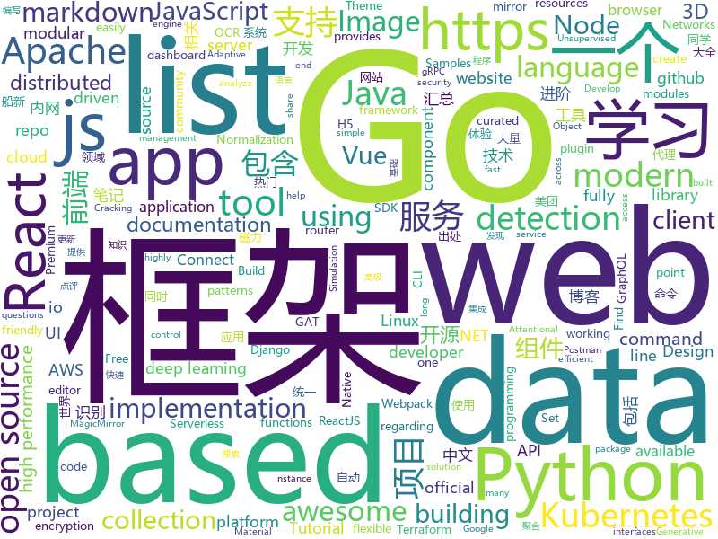

# 2019-08-10
See what the GitHub community is most excited about today.

## python
* [sherlock](https://github.com/sherlock-project/sherlock)(**98 stars today**): 🔎Find usernames across social networks
* [MedicalNet](https://github.com/Tencent/MedicalNet)(**41 stars today**): Many studies have shown that the performance on deep learning is significantly affected by volume of training data. The MedicalNet project provides a series of 3D-ResNet pre-trained models and relative code.
* [delta](https://github.com/didi/delta)(**61 stars today**): DELTA is a deep learning based natural language and speech processing platform.
* [tlroadmap](https://github.com/tlbootcamp/tlroadmap)(**39 stars today**): 👩🏼‍💻👨🏻‍💻Карта навыков и модель развития тимлидов
* [UGATIT-pytorch](https://github.com/znxlwm/UGATIT-pytorch)(**43 stars today**): Official PyTorch implementation of U-GAT-IT: Unsupervised Generative Attentional Networks with Adaptive Layer-Instance Normalization for Image-to-Image Translation
* [celery](https://github.com/celery/celery)(**7 stars today**): Distributed Task Queue (development branch)
* [redash](https://github.com/getredash/redash)(**7 stars today**): Make Your Company Data Driven. Connect to any data source, easily visualize, dashboard and share your data.
* [mmdetection](https://github.com/open-mmlab/mmdetection)(**28 stars today**): Open MMLab Detection Toolbox and Benchmark
* [pytorch-tutorial](https://github.com/yunjey/pytorch-tutorial)(**14 stars today**): PyTorch Tutorial for Deep Learning Researchers
* [saleor](https://github.com/mirumee/saleor)(**7 stars today**): A modular, high performance e-commerce storefront built with Python, GraphQL, Django, and ReactJS.
* [handout](https://github.com/danijar/handout)(**75 stars today**): Turn Python scripts into handouts with Markdown and figures
* [python-fire](https://github.com/google/python-fire)(**11 stars today**): Python Fire is a library for automatically generating command line interfaces (CLIs) from absolutely any Python object.
* [django-rest-framework](https://github.com/encode/django-rest-framework)(**12 stars today**): Web APIs for Django.⚡️
* [WiFiBroot](https://github.com/hash3liZer/WiFiBroot)(**16 stars today**): A WiFi Pentest Cracking tool for WPA/WPA2 (Handshake, PMKID, Cracking, EAPOL, Deauthentication)
* [airflow](https://github.com/apache/airflow)(**12 stars today**): Apache Airflow
* [fuzzDicts](https://github.com/TheKingOfDuck/fuzzDicts)(**7 stars today**): Web Pentesting Fuzz 字典,一个就够了。
* [Python-100-Days](https://github.com/ZiniuLu/Python-100-Days)(**10 stars today**): 出处：https://github.com/jackfrued/Python-100-Days.git
* [UGATIT](https://github.com/taki0112/UGATIT)(**155 stars today**): Official Tensorflow implementation of U-GAT-IT: Unsupervised Generative Attentional Networks with Adaptive Layer-Instance Normalization for Image-to-Image Translation
* [ZeroNet](https://github.com/HelloZeroNet/ZeroNet)(**29 stars today**): ZeroNet - Decentralized websites using Bitcoin crypto and BitTorrent network
* [CenterNet](https://github.com/xingyizhou/CenterNet)(**4 stars today**): Object detection, 3D detection, and pose estimation using center point detection:
* [folium](https://github.com/python-visualization/folium)(**5 stars today**): Python Data. Leaflet.js Maps.
* [FCOS](https://github.com/tianzhi0549/FCOS)(**5 stars today**): FCOS: Fully Convolutional One-Stage Object Detection (ICCV'19)
* [localstack](https://github.com/localstack/localstack)(**17 stars today**): 💻A fully functional local AWS cloud stack. Develop and test your cloud & Serverless apps offline!
* [nlp](https://github.com/makcedward/nlp)(**37 stars today**): 📝This repository recorded my NLP journey.
* [google-research](https://github.com/google-research/google-research)(**38 stars today**): Google AI Research

## java
* [magnetW](https://github.com/dengyuhan/magnetW)(**231 stars today**): 磁力搜网页版 - 磁力链接聚合搜索 - https://bt.biedian.me
* [gpmall](https://github.com/2227324689/gpmall)(**51 stars today**): 基于SpringBoot+Dubbo构建的电商平台-微服务架构
* [rabbitmq-tutorials](https://github.com/rabbitmq/rabbitmq-tutorials)(**33 stars today**): Tutorials for using RabbitMQ in various ways
* [hutool](https://github.com/looly/hutool)(**17 stars today**): A set of tools that keep Java sweet.
* [cat](https://github.com/dianping/cat)(**33 stars today**): CAT 作为服务端项目基础组件，提供了 Java, C/C++, Node.js, Python, Go 等多语言客户端，已经在美团点评的基础架构中间件框架（MVC框架，RPC框架，数据库框架，缓存框架等，消息队列，配置系统等）深度集成，为美团点评各业务线提供系统丰富的性能指标、健康状况、实时告警等。
* [advanced-java](https://github.com/doocs/advanced-java)(**52 stars today**): 😮互联网 Java 工程师进阶知识完全扫盲：涵盖高并发、分布式、高可用、微服务等领域知识，后端同学必看，前端同学也可学习
* [HanLP](https://github.com/hankcs/HanLP)(**25 stars today**): 自然语言处理 中文分词 词性标注 命名实体识别 依存句法分析 新词发现 关键词短语提取 自动摘要 文本分类聚类 拼音简繁
* [pulsar](https://github.com/apache/pulsar)(**3 stars today**): Apache Pulsar - distributed pub-sub messaging system
* [react-native-camera](https://github.com/react-native-community/react-native-camera)(**1 stars today**): A Camera component for React Native. Also supports barcode scanning!
* [seata](https://github.com/seata/seata)(**11 stars today**): 🔥Seata is an easy-to-use, high-performance, open source distributed transaction solution.
* [piggymetrics](https://github.com/sqshq/piggymetrics)(**5 stars today**): Microservice Architecture with Spring Boot, Spring Cloud and Docker
* [kubernetes-client](https://github.com/fabric8io/kubernetes-client)(**0 stars today**): Java client for Kubernetes & OpenShift
* [zeppelin](https://github.com/apache/zeppelin)(**1 stars today**): Mirror of Apache Zeppelin
* [SoloPi](https://github.com/alipay/SoloPi)(**44 stars today**): Soloπ 自动化测试工具
* [sia-gateway](https://github.com/siaorg/sia-gateway)(**21 stars today**): 微服务路由网关（zuul-plus）
* [aviator](https://github.com/killme2008/aviator)(**2 stars today**): A high performance expression evaluator for java
* [flink](https://github.com/apache/flink)(**5 stars today**): Apache Flink
* [spring-boot](https://github.com/spring-projects/spring-boot)(**31 stars today**): Spring Boot
* [C-OCR](https://github.com/ctripcorp/C-OCR)(**37 stars today**): C-OCR是携程自研的OCR项目，主要包括身份证、护照、火车票、签证等旅游相关证件、材料的识别。 项目包含4个部分，拒识、检测、识别、后处理。
* [canal](https://github.com/alibaba/canal)(**5 stars today**): 阿里巴巴 MySQL binlog 增量订阅&消费组件
* [keycloak](https://github.com/keycloak/keycloak)(**6 stars today**): Open Source Identity and Access Management For Modern Applications and Services
* [storm](https://github.com/apache/storm)(**1 stars today**): Mirror of Apache Storm
* [zalenium](https://github.com/zalando/zalenium)(**1 stars today**): A flexible and scalable container based Selenium Grid with video recording, live preview, basic auth & dashboard.
* [grpc-java](https://github.com/grpc/grpc-java)(**4 stars today**): The Java gRPC implementation. HTTP/2 based RPC
* [selenium](https://github.com/SeleniumHQ/selenium)(**12 stars today**): A browser automation framework and ecosystem.

## unknown
* [technology_books](https://github.com/arpitjindal97/technology_books)(**24 stars today**): Premium eBook free for Geeks
* [leeml-notes](https://github.com/datawhalechina/leeml-notes)(**240 stars today**): 李宏毅《机器学习》笔记，在线阅读地址：https://datawhalechina.github.io/leeml-notes
* [free-programming-books-zh_CN](https://github.com/justjavac/free-programming-books-zh_CN)(**142 stars today**): 📚免费的计算机编程类中文书籍，欢迎投稿
* [StabilityGuide](https://github.com/StabilityMan/StabilityGuide)(**15 stars today**): 【稳定大于一切】打造国内稳定性领域知识库，让无法解决的问题少一点点，让世界的确定性多一点点。
* [corteza-docs](https://github.com/cortezaproject/corteza-docs)(**3 stars today**): 
* [build-your-own-x](https://github.com/danistefanovic/build-your-own-x)(**35 stars today**): 🤓Build your own (insert technology here)
* [petition](https://github.com/otvorete/petition)(**50 stars today**): ПОКАЖЕТЕ НИ КОДА!
* [LiteratureDL4Graph](https://github.com/DeepGraphLearning/LiteratureDL4Graph)(**31 stars today**): 
* [architect-awesome](https://github.com/xingshaocheng/architect-awesome)(**23 stars today**): 后端架构师技术图谱
* [YCBlogs](https://github.com/yangchong211/YCBlogs)(**3 stars today**): 技术博客笔记大汇总【15年10月到至今】，包括Java基础及深入知识点，Android技术博客，Python，Go学习笔记等等，还包括平时开发中遇到的bug汇总，当然也在工作之余收集了大量的面试题，长期更新维护并且修正，持续完善……开源的文件是markdown格式的！同时也开源了生活博客，从12年起，积累共计N篇[近100万字]，转载请注明出处，谢谢！
* [react-bits](https://github.com/vasanthk/react-bits)(**23 stars today**): ✨React patterns, techniques, tips and tricks✨
* [awesome-react](https://github.com/enaqx/awesome-react)(**71 stars today**): A collection of awesome things regarding React ecosystem
* [awesome-github-vue](https://github.com/opendigg/awesome-github-vue)(**1 stars today**): Vue相关开源项目库汇总
* [ru-test-assignments](https://github.com/Hexlet/ru-test-assignments)(**2 stars today**): Тестовые задания для самостоятельного выполнения от разных it компаний
* [Specs](https://github.com/CocoaPods/Specs)(**0 stars today**): The CocoaPods Master Repo
* [awesome-go-cn](https://github.com/yinggaozhen/awesome-go-cn)(**7 stars today**): 一个很棒的Go框架、库和软件的中文收录大全。⏰脚本定期与英文文档同步，包含了各工程star数/最近更新时间，助您快速发现优质项目。Awesome Go~
* [app-ideas](https://github.com/florinpop17/app-ideas)(**10 stars today**): A Collection of application ideas which can be used to improve your coding skills.
* [awesome-gog-galaxy](https://github.com/Mixaill/awesome-gog-galaxy)(**4 stars today**): A list of packages and resources regarding GOG Galaxy 2.0
* [postman-app-support](https://github.com/postmanlabs/postman-app-support)(**2 stars today**): Postman helps you be more efficient while working with APIs. Using Postman, you can construct complex HTTP requests quickly, organize them in collections and share them with your co-workers.
* [blog](https://github.com/yygmind/blog)(**10 stars today**): 我是木易杨，公众号「高级前端进阶」作者，跟着我每周重点攻克一个前端面试重难点。接下来让我带你走进高级前端的世界，在进阶的路上，共勉！
* [awesome-readme](https://github.com/matiassingers/awesome-readme)(**1 stars today**): A curated list of awesome READMEs
* [javascript-questions](https://github.com/lydiahallie/javascript-questions)(**25 stars today**): A long list of (advanced) JavaScript questions, and their explanations✨Updated weekly!
* [bbr](https://github.com/google/bbr)(**6 stars today**): 
* [Fuck-XueXiQiangGuo](https://github.com/fuck-xuexiqiangguo/Fuck-XueXiQiangGuo)(**4 stars today**): 学习强国 懒人刷分工具 自动学习
* [120-Data-Science-Interview-Questions](https://github.com/kojino/120-Data-Science-Interview-Questions)(**3 stars today**): Answers to 120 commonly asked data science interview questions.

## javascript
* [dsa.js-data-structures-algorithms-javascript](https://github.com/amejiarosario/dsa.js-data-structures-algorithms-javascript)(**180 stars today**): Data Structures and Algorithms explained and implemented in JavaScript
* [remote-jobs](https://github.com/remoteintech/remote-jobs)(**91 stars today**): A list of semi to fully remote-friendly companies in tech.
* [create-react-app](https://github.com/facebook/create-react-app)(**58 stars today**): Set up a modern web app by running one command.
* [uni-app](https://github.com/dcloudio/uni-app)(**41 stars today**): uni-app 是使用 Vue 语法开发小程序、H5、App的统一框架
* [cosmoscout-vr](https://github.com/cosmoscout/cosmoscout-vr)(**13 stars today**): A virtual universe which lets you explore, analyze and present huge planetary datasets and large simulation data in real-time.
* [next.js](https://github.com/zeit/next.js)(**35 stars today**): The React Framework
* [fullPage.js](https://github.com/alvarotrigo/fullPage.js)(**19 stars today**): fullPage plugin by Alvaro Trigo. Create full screen pages fast and simple
* [mc.js](https://github.com/ian13456/mc.js)(**109 stars today**): Open source Minecraft clone built with ThreeJS, ReactJS, GraphQL, and NodeJS.
* [MagicMirror](https://github.com/MichMich/MagicMirror)(**55 stars today**): MagicMirror² is an open source modular smart mirror platform. With a growing list of installable modules, the MagicMirror² allows you to convert your hallway or bathroom mirror into your personal assistant.
* [react](https://github.com/facebook/react)(**62 stars today**): A declarative, efficient, and flexible JavaScript library for building user interfaces.
* [incubator-superset](https://github.com/apache/incubator-superset)(**11 stars today**): Apache Superset (incubating) is a modern, enterprise-ready business intelligence web application
* [hospitalrun-frontend](https://github.com/HospitalRun/hospitalrun-frontend)(**8 stars today**): Front end for HospitalRun
* [vue](https://github.com/vuejs/vue)(**64 stars today**): 🖖Vue.js is a progressive, incrementally-adoptable JavaScript framework for building UI on the web.
* [blockly](https://github.com/google/blockly)(**64 stars today**): The web-based visual programming editor.
* [mui](https://github.com/dcloudio/mui)(**6 stars today**): 最接近原生APP体验的高性能框架
* [piano](https://github.com/Wscats/piano)(**12 stars today**): 🎹用键盘8个键演奏一首蒲公英的约定送给自己或月亮代表我的心给她
* [material-components-web](https://github.com/material-components/material-components-web)(**8 stars today**): Modular and customizable Material Design UI components for the web
* [marktext](https://github.com/marktext/marktext)(**21 stars today**): 📝A simple and elegant markdown editor, available for Linux, macOS and Windows.
* [axios](https://github.com/axios/axios)(**37 stars today**): Promise based HTTP client for the browser and node.js
* [zdog](https://github.com/metafizzy/zdog)(**18 stars today**): Flat, round, designer-friendly pseudo-3D engine for canvas & SVG
* [vxe-table](https://github.com/xuliangzhan/vxe-table)(**14 stars today**): 🐬一个功能齐全的 Vue 表组件，与任意组件库完美兼容
* [strapi](https://github.com/strapi/strapi)(**20 stars today**): 🚀Open source Node.js Headless CMS to easily build customisable APIs
* [aws-sdk-js](https://github.com/aws/aws-sdk-js)(**5 stars today**): AWS SDK for JavaScript in the browser and Node.js
* [taro](https://github.com/NervJS/taro)(**15 stars today**): 多端统一开发框架，支持用 React 的开发方式编写一次代码，生成能运行在微信/百度/支付宝/字节跳动/ QQ 小程序、快应用、H5、React Native 等的应用。 https://taro.jd.com/
* [vue-router](https://github.com/vuejs/vue-router)(**11 stars today**): 🚦The official router for Vue.js.

## html
* [awesome-piracy](https://github.com/Igglybuff/awesome-piracy)(**31 stars today**): A curated list of awesome warez and piracy links
* [GTFOBins.github.io](https://github.com/GTFOBins/GTFOBins.github.io)(**35 stars today**): Curated list of Unix binaries that can be exploited to bypass system security restrictions
* [Phishing-Simulation](https://github.com/jenyraval/Phishing-Simulation)(**4 stars today**): Phishing Simulation mainly aims to increase phishing awareness by providing an intuitive tutorial and customized assessment
* [swagger-codegen](https://github.com/swagger-api/swagger-codegen)(**6 stars today**): swagger-codegen contains a template-driven engine to generate documentation, API clients and server stubs in different languages by parsing your OpenAPI / Swagger definition.
* [kubernetes-failure-stories](https://github.com/hjacobs/kubernetes-failure-stories)(**4 stars today**): Compilation of public failure/horror stories related to Kubernetes
* [glTF](https://github.com/KhronosGroup/glTF)(**1 stars today**): glTF – Runtime 3D Asset Delivery
* [styleguide](https://github.com/google/styleguide)(**7 stars today**): Style guides for Google-originated open-source projects
* [v2-ui](https://github.com/sprov065/v2-ui)(**6 stars today**): python 重构 sprov-ui，一个船新的 v2ray 面板，给你一种船新的体验
* [webdevbootcamp](https://github.com/nax3t/webdevbootcamp)(**2 stars today**): All source code for back-end projects from the Web Developer Bootcamp
* [website](https://github.com/letsencrypt/website)(**3 stars today**): Let's Encrypt Website and Documentation
* [mkdocs-material](https://github.com/squidfunk/mkdocs-material)(**1 stars today**): A Material Design theme for MkDocs
* [quickstart-js](https://github.com/firebase/quickstart-js)(**2 stars today**): Firebase Quickstart Samples for Web
* [privacytools.io](https://github.com/privacytoolsIO/privacytools.io)(**0 stars today**): 🛡️encryption against global mass surveillance
* [500LineorLess_CN](https://github.com/HT524/500LineorLess_CN)(**0 stars today**): 500 line or less 中文翻译计划。
* [Markdown-Resume](https://github.com/CyC2018/Markdown-Resume)(**4 stars today**): ⭐️Markdown 简历模版
* [lottie](https://github.com/airbnb/lottie)(**4 stars today**): Lottie documentation for http://airbnb.io/lottie
* [awesome-modern-cpp](https://github.com/rigtorp/awesome-modern-cpp)(**2 stars today**): A collection of resources on modern C++
* [linux-command](https://github.com/jaywcjlove/linux-command)(**8 stars today**): Linux命令大全搜索工具，内容包含Linux命令手册、详解、学习、搜集。https://git.io/linux
* [foundation-emails](https://github.com/zurb/foundation-emails)(**2 stars today**): Quickly create responsive HTML emails that work on any device and client. Even Outlook.
* [website](https://github.com/kubernetes/website)(**1 stars today**): Kubernetes website and documentation repo:
* [AdminLTE](https://github.com/ColorlibHQ/AdminLTE)(**20 stars today**): AdminLTE - Free Premium Admin control Panel Theme Based On Bootstrap 3.x
* [simple-icons](https://github.com/simple-icons/simple-icons)(**2 stars today**): SVG icons for popular brands
* [docs](https://github.com/knative/docs)(**0 stars today**): User documentation for Knative components
* [dive-into-webpack](https://github.com/gwuhaolin/dive-into-webpack)(**1 stars today**): 全面的Webpack教程《深入浅出Webpack》电子书
* [dotnet](https://github.com/microsoft/dotnet)(**1 stars today**): This repo is the official home of .NET on GitHub. It's a great starting point to find many .NET OSS projects from Microsoft and the community, including many that are part of the .NET Foundation.

## go
* [octant](https://github.com/vmware/octant)(**170 stars today**): A web-based, highly extensible platform for developers to better understand the complexity of Kubernetes clusters.
* [nps](https://github.com/cnlh/nps)(**164 stars today**): 一款轻量级、功能强大的内网穿透代理服务器。支持tcp、udp流量转发，支持内网http代理、内网socks5代理，同时支持snappy压缩、站点保护、加密传输、多路复用、header修改等。支持web图形化管理，集成多用户模式。
* [istio](https://github.com/istio/istio)(**18 stars today**): Connect, secure, control, and observe services.
* [TopList](https://github.com/timeromantic/TopList)(**150 stars today**): 今日热榜，一个获取各大热门网站热门头条的聚合网站，使用Go语言编写，多协程异步快速抓取信息，预览:https://www.printf520.com/hot.html
* [mux](https://github.com/gorilla/mux)(**8 stars today**): A powerful HTTP router and URL matcher for building Go web servers with🦍
* [kratos](https://github.com/bilibili/kratos)(**7 stars today**): Kratos是bilibili开源的一套Go微服务框架，包含大量微服务相关框架及工具。
* [grpc-go](https://github.com/grpc/grpc-go)(**11 stars today**): The Go language implementation of gRPC. HTTP/2 based RPC
* [aws-lambda-go](https://github.com/aws/aws-lambda-go)(**6 stars today**): Libraries, samples and tools to help Go developers develop AWS Lambda functions.
* [community](https://github.com/kubernetes/community)(**59 stars today**): Kubernetes community content
* [tendermint](https://github.com/tendermint/tendermint)(**4 stars today**): ⟁ Tendermint Core (BFT Consensus) in Go
* [sarama](https://github.com/Shopify/sarama)(**3 stars today**): Sarama is a Go library for Apache Kafka 0.8, and up.
* [vault](https://github.com/hashicorp/vault)(**6 stars today**): A tool for secrets management, encryption as a service, and privileged access management
* [faas](https://github.com/openfaas/faas)(**18 stars today**): OpenFaaS - Serverless Functions Made Simple
* [telegraf](https://github.com/influxdata/telegraf)(**9 stars today**): The plugin-driven server agent for collecting & reporting metrics.
* [argo](https://github.com/argoproj/argo)(**8 stars today**): Argo Workflows: Get stuff done with Kubernetes.
* [fwanalyzer](https://github.com/cruise-automation/fwanalyzer)(**18 stars today**): a tool to analyze filesystem images
* [thanos](https://github.com/thanos-io/thanos)(**7 stars today**): Highly available Prometheus setup with long term storage capabilities.
* [cli](https://github.com/urfave/cli)(**14 stars today**): A simple, fast, and fun package for building command line apps in Go
* [go-patterns](https://github.com/tmrts/go-patterns)(**12 stars today**): Curated list of Go design patterns, recipes and idioms
* [consul](https://github.com/hashicorp/consul)(**5 stars today**): Consul is a distributed, highly available, and data center aware solution to connect and configure applications across dynamic, distributed infrastructure.
* [aws-sdk-go](https://github.com/aws/aws-sdk-go)(**2 stars today**): AWS SDK for the Go programming language.
* [terragrunt](https://github.com/gruntwork-io/terragrunt)(**3 stars today**): Terragrunt is a thin wrapper for Terraform that provides extra tools for working with multiple Terraform modules.
* [gosec](https://github.com/securego/gosec)(**1 stars today**): Golang security checker
* [cobra](https://github.com/spf13/cobra)(**18 stars today**): A Commander for modern Go CLI interactions
* [errors](https://github.com/pkg/errors)(**4 stars today**): Simple error handling primitives

## WordCloud

