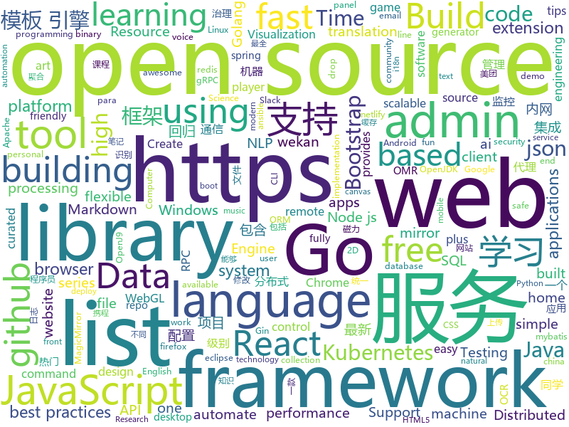

# 2019-08-11
See what the GitHub community is most excited about today.

## python
* [sherlock](https://github.com/sherlock-project/sherlock)(**115 stars today**): 🔎Find usernames across social networks
* [AttackSurfaceMapper](https://github.com/superhedgy/AttackSurfaceMapper)(**48 stars today**): AttackSurfaceMapper is a tool that aims to automate the reconnaissance process.
* [interview_internal_reference](https://github.com/0voice/interview_internal_reference)(**228 stars today**): 2019年最新总结，阿里，腾讯，百度，美团，头条等技术面试题目，以及答案，专家出题人分析汇总。
* [nlp](https://github.com/makcedward/nlp)(**22 stars today**): 📝This repository recorded my NLP journey.
* [inter](https://github.com/rsms/inter)(**23 stars today**): The Inter font family
* [rasa](https://github.com/RasaHQ/rasa)(**10 stars today**): 💬Open source machine learning framework to automate text- and voice-based conversations: NLU, dialogue management, connect to Slack, Facebook, and more - Create chatbots and voice assistants
* [MoGA](https://github.com/xiaomi-automl/MoGA)(**3 stars today**): MoGA: Searching Beyond MobileNetV3
* [python](https://github.com/kubernetes-client/python)(**4 stars today**): Official Python client library for kubernetes
* [Shadowsocks](https://github.com/xiaobei2008/Shadowsocks)(**13 stars today**): 史上最全科学上网教程（最新）
* [gluon-ts](https://github.com/awslabs/gluon-ts)(**1 stars today**): GluonTS - Probabilistic Time Series Modeling in Python
* [openshift-ansible](https://github.com/openshift/openshift-ansible)(**1 stars today**): OpenShift Installation and Configuration Management
* [google-research](https://github.com/google-research/google-research)(**18 stars today**): Google AI Research
* [chinese-xinhua](https://github.com/pwxcoo/chinese-xinhua)(**26 stars today**): 📙中华新华字典数据库。包括歇后语，成语，词语，汉字。
* [dagster](https://github.com/dagster-io/dagster)(**4 stars today**): Dagster is an open-source system for building data applications.
* [delta](https://github.com/didi/delta)(**24 stars today**): DELTA is a deep learning based natural language and speech processing platform.
* [home-assistant](https://github.com/home-assistant/home-assistant)(**16 stars today**): 🏡Open source home automation that puts local control and privacy first
* [allennlp](https://github.com/allenai/allennlp)(**9 stars today**): An open-source NLP research library, built on PyTorch.
* [mmdetection](https://github.com/open-mmlab/mmdetection)(**8 stars today**): Open MMLab Detection Toolbox and Benchmark
* [Fantasy-Premier-League](https://github.com/vaastav/Fantasy-Premier-League)(**3 stars today**): Creates a .csv file of all players in the English Player League with their respective team and total fantasy points
* [pytorch-transformers](https://github.com/huggingface/pytorch-transformers)(**29 stars today**): 👾A library of state-of-the-art pretrained models for Natural Language Processing (NLP)
* [DeepFaceLab](https://github.com/iperov/DeepFaceLab)(**21 stars today**): DeepFaceLab is a tool that utilizes machine learning to replace faces in videos. Includes prebuilt ready to work standalone Windows 7,8,10 binary (look readme.md).
* [bokeh](https://github.com/bokeh/bokeh)(**10 stars today**): Interactive Data Visualization in the browser, from Python
* [mycroft-core](https://github.com/MycroftAI/mycroft-core)(**6 stars today**): Mycroft Core, the Mycroft Artificial Intelligence platform.
* [black](https://github.com/psf/black)(**9 stars today**): The uncompromising Python code formatter
* [ansible](https://github.com/ansible/ansible)(**9 stars today**): Ansible is a radically simple IT automation platform that makes your applications and systems easier to deploy. Avoid writing scripts or custom code to deploy and update your applications — automate in a language that approaches plain English, using SSH, with no agents to install on remote systems. https://docs.ansible.com/ansible/

## java
* [magnetW](https://github.com/dengyuhan/magnetW)(**142 stars today**): 磁力搜网页版 - 磁力链接聚合搜索 - https://bt.biedian.me
* [SoloPi](https://github.com/alipay/SoloPi)(**29 stars today**): Soloπ 自动化测试工具
* [spring-boot-demo](https://github.com/xkcoding/spring-boot-demo)(**72 stars today**): spring boot demo 是一个用来学习 spring boot 的项目，总共包含 57 个集成demo，已经完成 47 个。包含集成 actuator(监控)、admin(可视化监控)、logback(日志)、aopLog(通过AOP记录web请求日志)、统一异常处理(json级别和页面级别)、freemarker(模板引擎)、thymeleaf(模板引擎)、Beetl(模板引擎)、Enjoy(模板引擎)、JdbcTemplate、JPA(ORM框架)、mybatis(ORM框架)、通用Mapper、PageHelper、mybatis-plus、BeetlSQL、upload(本地文件上传和七牛云文件上传)、redis(缓存)、ehcache(缓存)、email(发送各种类…
* [octo-rpc](https://github.com/Meituan-Dianping/octo-rpc)(**9 stars today**): OCTO-RPC 是支持Java和C++的企业级通信框架，在RPC服务之上扩展了丰富的服务治理功能，为美团各业务线提供高效、统一的通信服务。
* [apollo](https://github.com/ctripcorp/apollo)(**16 stars today**): Apollo（阿波罗）是携程框架部门研发的分布式配置中心，能够集中化管理应用不同环境、不同集群的配置，配置修改后能够实时推送到应用端，并且具备规范的权限、流程治理等特性，适用于微服务配置管理场景。
* [sia-gateway](https://github.com/siaorg/sia-gateway)(**10 stars today**): 微服务路由网关（zuul-plus）
* [gpmall](https://github.com/2227324689/gpmall)(**55 stars today**): 基于SpringBoot+Dubbo构建的电商平台-微服务架构
* [C-OCR](https://github.com/ctripcorp/C-OCR)(**49 stars today**): C-OCR是携程自研的OCR项目，主要包括身份证、护照、火车票、签证等旅游相关证件、材料的识别。 项目包含4个部分，拒识、检测、识别、后处理。
* [antlr4](https://github.com/antlr/antlr4)(**4 stars today**): ANTLR (ANother Tool for Language Recognition) is a powerful parser generator for reading, processing, executing, or translating structured text or binary files.
* [advanced-java](https://github.com/doocs/advanced-java)(**36 stars today**): 😮互联网 Java 工程师进阶知识完全扫盲：涵盖高并发、分布式、高可用、微服务等领域知识，后端同学必看，前端同学也可学习
* [sms-backup-plus](https://github.com/jberkel/sms-backup-plus)(**1 stars today**): Backup Android SMS, MMS and call log to Gmail / Gcal / IMAP
* [openj9](https://github.com/eclipse/openj9)(**1 stars today**): Eclipse OpenJ9: A Java Virtual Machine for OpenJDK that's optimized for small footprint, fast start-up, and high throughput. Builds on Eclipse OMR (https://github.com/eclipse/omr) and combines with the Extensions for OpenJDK for OpenJ9 repo.
* [kafka-tutorials](https://github.com/confluentinc/kafka-tutorials)(**10 stars today**): Kafka Tutorials microsite
* [jacoco](https://github.com/jacoco/jacoco)(**4 stars today**): 🔬JaCoCo - Java Code Coverage Library
* [ghidra](https://github.com/NationalSecurityAgency/ghidra)(**18 stars today**): Ghidra is a software reverse engineering (SRE) framework
* [BaseRecyclerViewAdapterHelper](https://github.com/CymChad/BaseRecyclerViewAdapterHelper)(**3 stars today**): BRVAH:Powerful and flexible RecyclerAdapter
* [micronaut-data](https://github.com/micronaut-projects/micronaut-data)(**1 stars today**): Ahead of Time Data Repositories
* [kafka](https://github.com/apache/kafka)(**5 stars today**): Mirror of Apache Kafka
* [JsonPath](https://github.com/json-path/JsonPath)(**6 stars today**): Java JsonPath implementation
* [solo](https://github.com/b3log/solo)(**42 stars today**): 🎸一款小而美的博客系统，专为程序员设计。
* [incubator-shardingsphere](https://github.com/apache/incubator-shardingsphere)(**5 stars today**): Distributed database middleware
* [rabbitmq-tutorials](https://github.com/rabbitmq/rabbitmq-tutorials)(**18 stars today**): Tutorials for using RabbitMQ in various ways
* [elasticsearch](https://github.com/elastic/elasticsearch)(**11 stars today**): Open Source, Distributed, RESTful Search Engine
* [ksql](https://github.com/confluentinc/ksql)(**1 stars today**): KSQL - the Streaming SQL Engine for Apache Kafka
* [zuul](https://github.com/Netflix/zuul)(**6 stars today**): Zuul is a gateway service that provides dynamic routing, monitoring, resiliency, security, and more.

## unknown
* [starter-workflows](https://github.com/actions/starter-workflows)(**45 stars today**): Accelerating new GitHub Actions workflows
* [free-programming-books-zh_CN](https://github.com/justjavac/free-programming-books-zh_CN)(**122 stars today**): 📚免费的计算机编程类中文书籍，欢迎投稿
* [awesome-react](https://github.com/enaqx/awesome-react)(**48 stars today**): A collection of awesome things regarding React ecosystem
* [leeml-notes](https://github.com/datawhalechina/leeml-notes)(**140 stars today**): 李宏毅《机器学习》笔记，在线阅读地址：https://datawhalechina.github.io/leeml-notes
* [open-cdk](https://github.com/kevinslin/open-cdk)(**3 stars today**): This guide is an opinionated set of tips and best practices for working with the AWS Cloud Development Kit
* [petition](https://github.com/otvorete/petition)(**5 stars today**): ПОКАЖЕТЕ НИ КОДА!
* [SwiftPMLibrary](https://github.com/daveverwer/SwiftPMLibrary)(**1 stars today**): The source list of repositories for the SwiftPM Library.
* [speedchallenge](https://github.com/commaai/speedchallenge)(**2 stars today**): The comma.ai Speed Prediction Challenge!
* [LiteratureDL4Graph](https://github.com/DeepGraphLearning/LiteratureDL4Graph)(**7 stars today**): 
* [react-bits](https://github.com/vasanthk/react-bits)(**13 stars today**): ✨React patterns, techniques, tips and tricks✨
* [javascript-testing-best-practices](https://github.com/goldbergyoni/javascript-testing-best-practices)(**9 stars today**): 📗🌐🚢Comprehensive and exhaustive JavaScript & Node.js testing best practices (August 2019)
* [FuchsiaOS-docs-zh_CN](https://github.com/FuchsiaOS/FuchsiaOS-docs-zh_CN)(**3 stars today**): Fuchsia OS 简体中文文档
* [developer-roadmap](https://github.com/kamranahmedse/developer-roadmap)(**68 stars today**): Roadmap to becoming a web developer in 2019
* [proposals](https://github.com/tc39/proposals)(**1 stars today**): Tracking ECMAScript Proposals
* [intellij-community](https://github.com/JetBrains/intellij-community)(**6 stars today**): IntelliJ IDEA Community Edition
* [computer-science](https://github.com/ossu/computer-science)(**18 stars today**): 🎓Path to a free self-taught education in Computer Science!
* [new-pac](https://github.com/Alvin9999/new-pac)(**16 stars today**): 
* [the-book-of-secret-knowledge](https://github.com/trimstray/the-book-of-secret-knowledge)(**16 stars today**): A collection of inspiring lists, manuals, cheatsheets, blogs, hacks, one-liners, cli/web tools and more.
* [vagas](https://github.com/backend-br/vagas)(**4 stars today**): ✌️Espaço para divulgação de vagas para backenders
* [You-Dont-Know-JS](https://github.com/getify/You-Dont-Know-JS)(**35 stars today**): A book series on JavaScript. @YDKJS on twitter.
* [iCSS](https://github.com/chokcoco/iCSS)(**6 stars today**): 不止于 CSS
* [curriculum](https://github.com/cncf/curriculum)(**4 stars today**): 📚Open Source Curriculum for CNCF Certification Courses
* [awesome-sre](https://github.com/dastergon/awesome-sre)(**6 stars today**): A curated list of Site Reliability and Production Engineering resources.
* [The-Economist](https://github.com/nailperry-zd/The-Economist)(**2 stars today**): The Economist 经济学人，持续更新
* [build-your-own-x](https://github.com/danistefanovic/build-your-own-x)(**22 stars today**): 🤓Build your own (insert technology here)

## javascript
* [mc.js](https://github.com/ian13456/mc.js)(**124 stars today**): Open source Minecraft clone built with ThreeJS, ReactJS, GraphQL, and NodeJS.
* [remote-jobs](https://github.com/remoteintech/remote-jobs)(**117 stars today**): A list of semi to fully remote-friendly companies in tech.
* [MagicMirror](https://github.com/MichMich/MagicMirror)(**46 stars today**): MagicMirror² is an open source modular smart mirror platform. With a growing list of installable modules, the MagicMirror² allows you to convert your hallway or bathroom mirror into your personal assistant.
* [RSSHub-Radar](https://github.com/DIYgod/RSSHub-Radar)(**26 stars today**): 🍰Browser extension that simplifies finding and subscribing RSS and RSSHub
* [RSSHub](https://github.com/DIYgod/RSSHub)(**19 stars today**): 🍰万物皆可 RSS
* [react](https://github.com/facebook/react)(**38 stars today**): A declarative, efficient, and flexible JavaScript library for building user interfaces.
* [china_regions](https://github.com/wecatch/china_regions)(**13 stars today**): 最全最新中国省，市，地区json及sql数据
* [wekan](https://github.com/wekan/wekan)(**9 stars today**): The open-source kanban (built with Meteor). Keep variable/table/field names camelCase. For translations, only add PR changes to wekan/i18n/en.i18n.json , other translations are done at https://transifex.com/wekan/wekan only.
* [styled-system](https://github.com/styled-system/styled-system)(**8 stars today**): ⬢ Style props for rapid UI development
* [zdog](https://github.com/metafizzy/zdog)(**7 stars today**): Flat, round, designer-friendly pseudo-3D engine for canvas & SVG
* [VvvebJs](https://github.com/givanz/VvvebJs)(**19 stars today**): Drag and drop website builder javascript library.
* [markdown-here](https://github.com/adam-p/markdown-here)(**20 stars today**): Google Chrome, Firefox, and Thunderbird extension that lets you write email in Markdown and render it before sending.
* [next.js](https://github.com/zeit/next.js)(**23 stars today**): The React Framework
* [marktext](https://github.com/marktext/marktext)(**11 stars today**): 📝A simple and elegant markdown editor, available for Linux, macOS and Windows.
* [listen1_chrome_extension](https://github.com/listen1/listen1_chrome_extension)(**5 stars today**): one for all free music in china (chrome extension, also works for firefox)
* [hospitalrun-frontend](https://github.com/HospitalRun/hospitalrun-frontend)(**7 stars today**): Front end for HospitalRun
* [uppy](https://github.com/transloadit/uppy)(**7 stars today**): The next open source file uploader for web browsers🐶
* [gatsby](https://github.com/gatsbyjs/gatsby)(**14 stars today**): Build blazing fast, modern apps and websites with React
* [nodebestpractices](https://github.com/goldbergyoni/nodebestpractices)(**21 stars today**): ✅The largest Node.js best practices list (July 2019)
* [listen1_desktop](https://github.com/listen1/listen1_desktop)(**7 stars today**): one for all free music in china (Windows, Mac, Linux desktop)
* [curso-javascript-ninja](https://github.com/da2k/curso-javascript-ninja)(**3 stars today**): Curso Javascript Ninja
* [CodeceptJS](https://github.com/Codeception/CodeceptJS)(**3 stars today**): Modern Era Acceptance Testing Framework for NodeJS
* [pixi.js](https://github.com/pixijs/pixi.js)(**13 stars today**): The HTML5 Creation Engine: Create beautiful digital content with the fastest, most flexible 2D WebGL renderer.
* [phaser](https://github.com/photonstorm/phaser)(**6 stars today**): Phaser is a fun, free and fast 2D game framework for making HTML5 games for desktop and mobile web browsers, supporting Canvas and WebGL rendering.
* [fullcalendar](https://github.com/fullcalendar/fullcalendar)(**10 stars today**): Full-sized drag & drop event calendar

## html
* [GTFOBins.github.io](https://github.com/GTFOBins/GTFOBins.github.io)(**13 stars today**): Curated list of Unix binaries that can be exploited to bypass system security restrictions
* [stisla](https://github.com/stisla/stisla)(**1 stars today**): Free Bootstrap Admin Template
* [github-markdown-css](https://github.com/sindresorhus/github-markdown-css)(**2 stars today**): The minimal amount of CSS to replicate the GitHub Markdown style
* [aws-well-architected-labs](https://github.com/awslabs/aws-well-architected-labs)(**1 stars today**): Hands on labs and code to help you learn, measure, and build using architectural best practices.
* [REKCARC-TSC-UHT](https://github.com/PKUanonym/REKCARC-TSC-UHT)(**27 stars today**): 清华大学计算机系课程攻略 Guidance for courses in Department of Computer Science and Technology, Tsinghua University
* [Topaz](https://github.com/Naresh1318/Topaz)(**7 stars today**): A configurable, easy to maintain personal website
* [HiddenEye](https://github.com/DarkSecDevelopers/HiddenEye)(**2 stars today**): Modern Phishing Tool With Advanced Functionality [ Android-Support-Available ]
* [luavela](https://github.com/iponweb/luavela)(**1 stars today**): 
* [BlazorStrap](https://github.com/chanan/BlazorStrap)(**0 stars today**): Bootstrap 4 Components for Blazor Framework
* [gentelella](https://github.com/ColorlibHQ/gentelella)(**4 stars today**): Free Bootstrap 3 Admin Template
* [antd-mobile-samples](https://github.com/ant-design/antd-mobile-samples)(**0 stars today**): antd-mobile samples
* [skill-map](https://github.com/TeamStuQ/skill-map)(**3 stars today**): 程序员技能图谱
* [deeplearning_ai_books](https://github.com/fengdu78/deeplearning_ai_books)(**8 stars today**): deeplearning.ai（吴恩达老师的深度学习课程笔记及资源）
* [awesome-competitive-programming](https://github.com/lnishan/awesome-competitive-programming)(**6 stars today**): 💎A curated list of awesome Competitive Programming, Algorithm and Data Structure resources
* [ng-alain](https://github.com/ng-alain/ng-alain)(**2 stars today**): NG-ZORRO admin panel front-end framework (netlify mirror https://netlify.ng-alain.com/)
* [awesome-creative-coding](https://github.com/terkelg/awesome-creative-coding)(**15 stars today**): Creative Coding: Generative Art, Data visualization, Interaction Design, Resources.
* [mxgraph](https://github.com/jgraph/mxgraph)(**3 stars today**): mxGraph is a fully client side JavaScript diagramming library
* [blog](https://github.com/lifesinger/blog)(**2 stars today**): 岁月如歌
* [Terminus2049.github.io](https://github.com/Terminus2049/Terminus2049.github.io)(**1 stars today**): No more 404
* [Machine-Learning](https://github.com/Jack-Cherish/Machine-Learning)(**3 stars today**): ⚡️机器学习实战（Python3）：kNN、决策树、贝叶斯、逻辑回归、SVM、线性回归、树回归
* [Adminator-admin-dashboard](https://github.com/puikinsh/Adminator-admin-dashboard)(**5 stars today**): Adminator is a easy to use and well design admin dashboard template for web apps, websites, services and more
* [home](https://github.com/rime/home)(**1 stars today**): Rime::Home is home to Rime users and developers
* [zenbot](https://github.com/DeviaVir/zenbot)(**3 stars today**): Zenbot is a command-line cryptocurrency trading bot using Node.js and MongoDB.
* [learning-area](https://github.com/mdn/learning-area)(**1 stars today**): Github repo for the MDN Learning Area.
* [AdminLTE](https://github.com/ColorlibHQ/AdminLTE)(**7 stars today**): AdminLTE - Free Premium Admin control Panel Theme Based On Bootstrap 3.x

## go
* [TopList](https://github.com/timeromantic/TopList)(**93 stars today**): 今日热榜，一个获取各大热门网站热门头条的聚合网站，使用Go语言编写，多协程异步快速抓取信息，预览:https://www.printf520.com/hot.html
* [nps](https://github.com/cnlh/nps)(**108 stars today**): 一款轻量级、功能强大的内网穿透代理服务器。支持tcp、udp流量转发，支持内网http代理、内网socks5代理，同时支持snappy压缩、站点保护、加密传输、多路复用、header修改等。支持web图形化管理，集成多用户模式。
* [gin](https://github.com/gin-gonic/gin)(**38 stars today**): Gin is a HTTP web framework written in Go (Golang). It features a Martini-like API with much better performance -- up to 40 times faster. If you need smashing performance, get yourself some Gin.
* [community](https://github.com/kubernetes/community)(**31 stars today**): Kubernetes community content
* [v](https://github.com/vlang/v)(**21 stars today**): Simple, fast, safe, compiled language for developing maintainable software. Supports translation from C and (soon) C++. Compiles itself in <1s. https://vlang.io
* [lindb](https://github.com/lindb/lindb)(**8 stars today**): LinDB is a scalable, high performance, high availability distributed time series database.
* [build-web-application-with-golang](https://github.com/astaxie/build-web-application-with-golang)(**13 stars today**): A golang ebook intro how to build a web with golang
* [faas](https://github.com/openfaas/faas)(**10 stars today**): OpenFaaS - Serverless Functions Made Simple
* [go](https://github.com/golang/go)(**27 stars today**): The Go programming language
* [grpc-gateway](https://github.com/grpc-ecosystem/grpc-gateway)(**6 stars today**): gRPC to JSON proxy generator following the gRPC HTTP spec
* [kubebuilder](https://github.com/kubernetes-sigs/kubebuilder)(**2 stars today**): Kubebuilder - SDK for building Kubernetes APIs using CRDs
* [cobra](https://github.com/spf13/cobra)(**13 stars today**): A Commander for modern Go CLI interactions
* [cortex](https://github.com/cortexproject/cortex)(**21 stars today**): A multitenant, horizontally scalable Prometheus as a Service
* [fwanalyzer](https://github.com/cruise-automation/fwanalyzer)(**10 stars today**): a tool to analyze filesystem images
* [cli](https://github.com/urfave/cli)(**33 stars today**): A simple, fast, and fun package for building command line apps in Go
* [kubernetes](https://github.com/kubernetes/kubernetes)(**25 stars today**): Production-Grade Container Scheduling and Management
* [redis](https://github.com/go-redis/redis)(**7 stars today**): Type-safe Redis client for Golang
* [operator-sdk](https://github.com/operator-framework/operator-sdk)(**8 stars today**): SDK for building Kubernetes applications. Provides high level APIs, useful abstractions, and project scaffolding.
* [soar](https://github.com/XiaoMi/soar)(**2 stars today**): SQL Optimizer And Rewriter
* [grpc-go](https://github.com/grpc/grpc-go)(**7 stars today**): The Go language implementation of gRPC. HTTP/2 based RPC
* [logrus](https://github.com/sirupsen/logrus)(**6 stars today**): Structured, pluggable logging for Go.
* [mattermost-server](https://github.com/mattermost/mattermost-server)(**7 stars today**): Open source Slack-alternative in Golang and React - Mattermost
* [terraform-provider-azurerm](https://github.com/terraform-providers/terraform-provider-azurerm)(**2 stars today**): Terraform provider for Azure Resource Manager
* [ginkgo](https://github.com/onsi/ginkgo)(**10 stars today**): BDD Testing Framework for Go
* [protobuf](https://github.com/golang/protobuf)(**4 stars today**): Go support for Google's protocol buffers

## WordCloud

