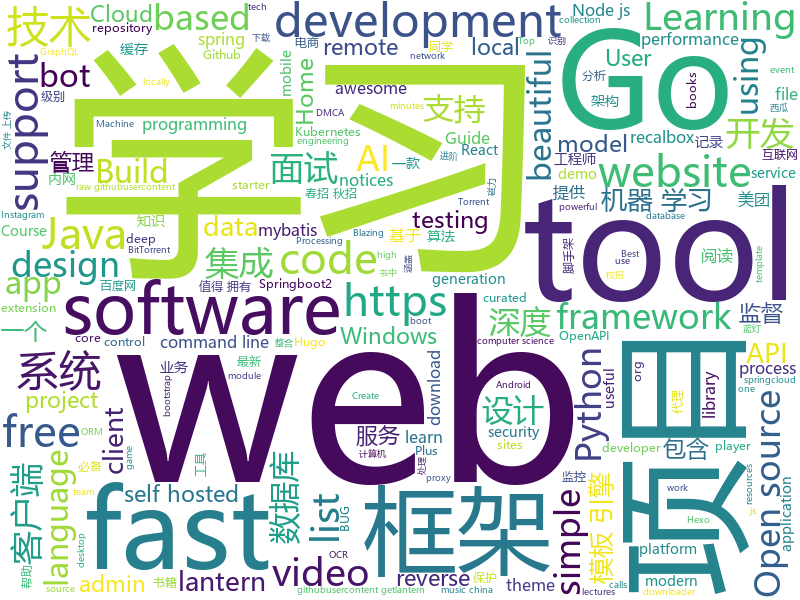

# 2019-08-12
See what the GitHub community is most excited about today.

## python
* [youtube-dl](https://github.com/ytdl-org/youtube-dl)(**134 stars today**): Command-line program to download videos from YouTube.com and other video sites
* [sherlock](https://github.com/sherlock-project/sherlock)(**102 stars today**): 🔎Find usernames across social networks
* [AttackSurfaceMapper](https://github.com/superhedgy/AttackSurfaceMapper)(**48 stars today**): AttackSurfaceMapper is a tool that aims to automate the reconnaissance process.
* [favorite-link](https://github.com/guanguans/favorite-link)(**192 stars today**): ❤️每日收集喜欢的开源项目
* [interview_internal_reference](https://github.com/0voice/interview_internal_reference)(**227 stars today**): 2019年最新总结，阿里，腾讯，百度，美团，头条等技术面试题目，以及答案，专家出题人分析汇总。
* [DeepFaceLab](https://github.com/iperov/DeepFaceLab)(**15 stars today**): DeepFaceLab is a tool that utilizes machine learning to replace faces in videos. Includes prebuilt ready to work standalone Windows 7,8,10 binary (look readme.md).
* [chinese-xinhua](https://github.com/pwxcoo/chinese-xinhua)(**72 stars today**): 📙中华新华字典数据库。包括歇后语，成语，词语，汉字。
* [home-assistant](https://github.com/home-assistant/home-assistant)(**19 stars today**): 🏡Open source home automation that puts local control and privacy first
* [MedicalNet](https://github.com/Tencent/MedicalNet)(**29 stars today**): Many studies have shown that the performance on deep learning is significantly affected by volume of training data. The MedicalNet project provides a series of 3D-ResNet pre-trained models and relative code.
* [you-get](https://github.com/soimort/you-get)(**24 stars today**): ⏬Dumb downloader that scrapes the web
* [RustPython](https://github.com/RustPython/RustPython)(**4 stars today**): A Python Interpreter written in Rust
* [public-apis](https://github.com/public-apis/public-apis)(**29 stars today**): A collective list of free APIs for use in software and web development.
* [XX-Net](https://github.com/XX-net/XX-Net)(**8 stars today**): a web proxy tool
* [faceswap](https://github.com/deepfakes/faceswap)(**31 stars today**): Deepfakes Software For All
* [syllabus](https://github.com/IIC2233/syllabus)(**1 stars today**): Repositorio oficial del curso IIC2233 Programación Avanzada🎉🎊
* [Fantasy-Premier-League](https://github.com/vaastav/Fantasy-Premier-League)(**4 stars today**): Creates a .csv file of all players in the English Player League with their respective team and total fantasy points
* [InstaPy](https://github.com/timgrossmann/InstaPy)(**9 stars today**): 📷Instagram Bot - Tool for automated Instagram interactions
* [WiFiBroot](https://github.com/hash3liZer/WiFiBroot)(**4 stars today**): A WiFi Pentest Cracking tool for WPA/WPA2 (Handshake, PMKID, Cracking, EAPOL, Deauthentication)
* [Algorithm_Interview_Notes-Chinese](https://github.com/imhuay/Algorithm_Interview_Notes-Chinese)(**44 stars today**): 2018/2019/校招/春招/秋招/算法/机器学习(Machine Learning)/深度学习(Deep Learning)/自然语言处理(NLP)/C/C++/Python/面试笔记
* [wagtail](https://github.com/wagtail/wagtail)(**9 stars today**): A Django content management system focused on flexibility and user experience
* [google-research](https://github.com/google-research/google-research)(**22 stars today**): Google AI Research
* [eeeeeeeeeeeeeeeeeeeeeeeeeeeeeeeeeeeeeeeeeeeeeeeeeeeeeeeeeeeeeeeeeeeeeeeeeeeeeeeeeeeeeeeeeeeeeeeeeeee](https://github.com/eeeeeeeeeeeeeeeeeeeeeeeeeeeeeeee/eeeeeeeeeeeeeeeeeeeeeeeeeeeeeeeeeeeeeeeeeeeeeeeeeeeeeeeeeeeeeeeeeeeeeeeeeeeeeeeeeeeeeeeeeeeeeeeeeeee)(**3 stars today**): eeeeeeeeeeeeeeeeeeeeeeeeeeeeeeeeeeeeeeeeeeeeeeeeeeeeeeeeeeeeeeeeeeeee
* [pyTelegramBotAPI](https://github.com/eternnoir/pyTelegramBotAPI)(**5 stars today**): Python Telegram bot api.
* [NEAT-Flappy-Bird](https://github.com/techwithtim/NEAT-Flappy-Bird)(**5 stars today**): An AI that plays flappy bird! Using the NEAT python module.
* [hacs](https://github.com/custom-components/hacs)(**2 stars today**): Manage (Install, track, upgrade) and discover custom elements for Home Assistant.

## java
* [gpmall](https://github.com/2227324689/gpmall)(**245 stars today**): 【咕泡学院实战项目】-基于SpringBoot+Dubbo构建的电商平台-微服务架构
* [hope-boot](https://github.com/hope-for/hope-boot)(**183 stars today**): 🌱🚀一款现代化的脚手架项目。企业开发？接外包？赚外快？还是学习？这都能满足你，居家必备，值得拥有🍻整合Springboot2，单点登陆+tk.mybatis+shiro+redis+thymeleaf+maven+swagger前后端分离接口管理+代码生成+定时任务+数据库版本管理flyway+hutool工具包，等实用技术。
* [toBeTopJavaer](https://github.com/hollischuang/toBeTopJavaer)(**159 stars today**): To Be Top Javaer - Java工程师成神之路
* [magnetW](https://github.com/dengyuhan/magnetW)(**172 stars today**): 磁力搜网页版 - 磁力链接聚合搜索 - https://bt.biedian.me
* [miaosha](https://github.com/qiurunze123/miaosha)(**123 stars today**): ⭐⭐⭐⭐秒杀系统设计与实现.互联网工程师进阶与分析🙋🐓
* [CS-Notes](https://github.com/CyC2018/CS-Notes)(**127 stars today**): 📚Tech Interview Guide 技术面试必备基础知识、Leetcode 题解、Java、C++、Python、后端面试、操作系统、计算机网络、系统设计
* [C-OCR](https://github.com/ctripcorp/C-OCR)(**182 stars today**): C-OCR是携程自研的OCR项目，主要包括身份证、护照、火车票、签证等旅游相关证件、材料的识别。 项目包含4个部分，拒识、检测、识别、后处理。
* [mall-learning](https://github.com/macrozheng/mall-learning)(**54 stars today**): mall学习教程，架构、业务、技术要点全方位解析。mall项目（18k+star）是一套电商系统，使用现阶段主流技术实现。 涵盖了SpringBoot2.1.3、MyBatis3.4.6、Elasticsearch6.2.2、RabbitMQ3.7.15、Redis3.2、Mongodb3.2、Mysql5.7等技术，采用Docker容器化部署。
* [openapi-generator](https://github.com/OpenAPITools/openapi-generator)(**17 stars today**): OpenAPI Generator allows generation of API client libraries (SDK generation), server stubs, documentation and configuration automatically given an OpenAPI Spec (v2, v3)
* [cat](https://github.com/dianping/cat)(**29 stars today**): CAT 作为服务端项目基础组件，提供了 Java, C/C++, Node.js, Python, Go 等多语言客户端，已经在美团点评的基础架构中间件框架（MVC框架，RPC框架，数据库框架，缓存框架等，消息队列，配置系统等）深度集成，为美团点评各业务线提供系统丰富的性能指标、健康状况、实时告警等。
* [MyBookshelf](https://github.com/gedoor/MyBookshelf)(**18 stars today**): 阅读是一款可以自定义来源阅读网络内容的工具，为广大网络文学爱好者提供一种方便、快捷舒适的试读体验。
* [spring-boot-demo](https://github.com/xkcoding/spring-boot-demo)(**57 stars today**): spring boot demo 是一个用来学习 spring boot 的项目，总共包含 57 个集成demo，已经完成 47 个。包含集成 actuator(监控)、admin(可视化监控)、logback(日志)、aopLog(通过AOP记录web请求日志)、统一异常处理(json级别和页面级别)、freemarker(模板引擎)、thymeleaf(模板引擎)、Beetl(模板引擎)、Enjoy(模板引擎)、JdbcTemplate、JPA(ORM框架)、mybatis(ORM框架)、通用Mapper、PageHelper、mybatis-plus、BeetlSQL、upload(本地文件上传和七牛云文件上传)、redis(缓存)、ehcache(缓存)、email(发送各种类…
* [ribbon](https://github.com/Netflix/ribbon)(**4 stars today**): Ribbon is a Inter Process Communication (remote procedure calls) library with built in software load balancers. The primary usage model involves REST calls with various serialization scheme support.
* [bistoury](https://github.com/qunarcorp/bistoury)(**31 stars today**): 生产问题诊断工具
* [ghidra](https://github.com/NationalSecurityAgency/ghidra)(**23 stars today**): Ghidra is a software reverse engineering (SRE) framework
* [advanced-java](https://github.com/doocs/advanced-java)(**56 stars today**): 😮互联网 Java 工程师进阶知识完全扫盲：涵盖高并发、分布式、高可用、微服务等领域知识，后端同学必看，前端同学也可学习
* [SoloPi](https://github.com/alipay/SoloPi)(**48 stars today**): Soloπ 自动化测试工具
* [a14-made-labs2](https://github.com/dicodingacademy/a14-made-labs2)(**1 stars today**): 
* [EhViewer](https://github.com/seven332/EhViewer)(**5 stars today**): [DEPRECATED] An Unofficial E-Hentai Application for Android
* [SpringCloud](https://github.com/zhoutaoo/SpringCloud)(**32 stars today**): 基于SpringCloud2.0的微服务开发脚手架，整合了spring-security-oauth2、apollo、eureka、feign、hystrix、springcloud-gateway、springcloud-bus等。治理方面引入elasticsearch、skywalking、springboot-admin、zipkin等，让项目开发快速进入业务开发，而不需过多时间花费在架构搭建上。持续更新中
* [ZXBlog](https://github.com/ZXZxin/ZXBlog)(**27 stars today**): 记录各种学习笔记(算法、Java、数据库、并发......)
* [libgdx](https://github.com/libgdx/libgdx)(**6 stars today**): Desktop/Android/HTML5/iOS Java game development framework
* [runelite](https://github.com/runelite/runelite)(**4 stars today**): Open source Old School RuneScape client
* [nifi](https://github.com/apache/nifi)(**1 stars today**): Mirror of Apache NiFi
* [rabbitmq-tutorials](https://github.com/rabbitmq/rabbitmq-tutorials)(**4 stars today**): Tutorials for using RabbitMQ in various ways

## unknown
* [Shift-AI-models-to-real-world-products](https://github.com/lonelygo/Shift-AI-models-to-real-world-products)(**69 stars today**): Share some useful guides and references about how to shift AI models to real world products or projects.
* [trackerslist](https://github.com/ngosang/trackerslist)(**53 stars today**): Updated list of public BitTorrent trackers
* [regular-investing-in-box](https://github.com/xiaolai/regular-investing-in-box)(**165 stars today**): 定投改变命运 —— 让时间陪你慢慢变富
* [coding-interview-university](https://github.com/jwasham/coding-interview-university)(**231 stars today**): A complete computer science study plan to become a software engineer.
* [Machine-learning-learning-notes](https://github.com/Vay-keen/Machine-learning-learning-notes)(**36 stars today**): 周志华《机器学习》又称西瓜书是一本较为全面的书籍，书中详细介绍了机器学习领域不同类型的算法(例如：监督学习、无监督学习、半监督学习、强化学习、集成降维、特征选择等)，记录了本人在学习过程中的理解思路与扩展知识点，希望对新人阅读西瓜书有所帮助！
* [free-programming-books-zh_CN](https://github.com/justjavac/free-programming-books-zh_CN)(**81 stars today**): 📚免费的计算机编程类中文书籍，欢迎投稿
* [DeepLearning-500-questions](https://github.com/scutan90/DeepLearning-500-questions)(**63 stars today**): 深度学习500问，以问答形式对常用的概率知识、线性代数、机器学习、深度学习、计算机视觉等热点问题进行阐述，以帮助自己及有需要的读者。 全书分为18个章节，50余万字。由于水平有限，书中不妥之处恳请广大读者批评指正。 未完待续............ 如有意合作，联系scutjy2015@163.com 版权所有，违权必究 Tan 2018.06
* [book](https://github.com/KeKe-Li/book)(**1 stars today**): 📚All programming languages books
* [Digital-Privacy](https://github.com/No-Github/Digital-Privacy)(**35 stars today**): 一个关于数字隐私搜集、保护、清理集一体的方案
* [new-pac](https://github.com/Alvin9999/new-pac)(**30 stars today**): 
* [gitignore](https://github.com/github/gitignore)(**44 stars today**): A collection of useful .gitignore templates
* [Artificial-Intelligence](https://github.com/Niraj-Lunavat/Artificial-Intelligence)(**18 stars today**): Awesome AI Learning with +100 AI Cheat-Sheets, Free online Books, Top Courses, Best Videos and Lectures, Papers, Tutorials, +99 Researchers, Premium Websites, +121 Datasets, Conferences, Frameworks, Tools
* [tom](https://github.com/tangmu6626/tom)(**0 stars today**): 
* [fig-standards](https://github.com/php-fig/fig-standards)(**15 stars today**): Standards either proposed or approved by the Framework Interop Group
* [fourelements](https://github.com/maim-lain/fourelements)(**0 stars today**): Four Elements Trainer Walkthrough
* [v2ba](https://github.com/v2ba/v2ba)(**0 stars today**): v2ba最新地址
* [awesome-pentest](https://github.com/enaqx/awesome-pentest)(**7 stars today**): A collection of awesome penetration testing resources, tools and other shiny things
* [ConPresentations](https://github.com/maddiestone/ConPresentations)(**4 stars today**): Slide decks from my conference presentations
* [MotherVR](https://github.com/Nibre/MotherVR)(**1 stars today**): This Mod brings current generation VR support to the game Alien: Isolation
* [CTRPF-AR-CHEAT-CODES](https://github.com/JourneyOver/CTRPF-AR-CHEAT-CODES)(**1 stars today**): [Database] CTRPF AR CHEAT CODES TO BE USED WITH CTRPF WITH ACTION REPLAY SUPPORT
* [tangmu](https://github.com/tom45261/tangmu)(**0 stars today**): 汤姆永久发布地址
* [dmca](https://github.com/github/dmca)(**3 stars today**): Repository with text of DMCA takedown notices as received. GitHub does not endorse or adopt any assertion contained in the following notices. Users identified in the notices are presumed innocent until proven guilty. Additional information about our DMCA policy can be found at
* [1024app-android](https://github.com/yuuwill/1024app-android)(**2 stars today**): 草榴官方客户端，小草客户端，Android
* [recalbox-os](https://github.com/recalbox/recalbox-os)(**0 stars today**): The recalbox repository moved to https://gitlab.com/recalbox/recalbox
* [pwp-R18-collection](https://github.com/momoziw/pwp-R18-collection)(**0 stars today**): 是藕饼pwp/纯R向作品合集的补档

## javascript
* [awesome-selfhosted](https://github.com/Kickball/awesome-selfhosted)(**101 stars today**): This is a list of Free Software network services and web applications which can be hosted locally. Selfhosting is the process of locally hosting and managing applications instead of renting from SaaS providers.
* [remote-jobs](https://github.com/remoteintech/remote-jobs)(**142 stars today**): A list of semi to fully remote-friendly companies in tech.
* [mc.js](https://github.com/ian13456/mc.js)(**205 stars today**): Open source Minecraft clone built with ThreeJS, ReactJS, GraphQL, and NodeJS.
* [fullstack-tutorial](https://github.com/frank-lam/fullstack-tutorial)(**205 stars today**): 🚀fullstack tutorial 2019，后台技术栈/架构师之路/全栈开发社区，春招/秋招/校招/面试
* [listen1_chrome_extension](https://github.com/listen1/listen1_chrome_extension)(**13 stars today**): one for all free music in china (chrome extension, also works for firefox)
* [graphql-engine](https://github.com/hasura/graphql-engine)(**10 stars today**): Blazing fast, instant realtime GraphQL APIs on Postgres with fine grained access control, also trigger webhooks on database events.
* [fullPage.js](https://github.com/alvarotrigo/fullPage.js)(**57 stars today**): fullPage plugin by Alvaro Trigo. Create full screen pages fast and simple
* [hexo](https://github.com/hexojs/hexo)(**12 stars today**): A fast, simple & powerful blog framework, powered by Node.js.
* [WBOT](https://github.com/vasani-arpit/WBOT)(**12 stars today**): A simple Web based BOT for WhatsApp™ in NodeJS😜. Working as of📅Aug 9th, 2019
* [react-native-starter](https://github.com/flatlogic/react-native-starter)(**10 stars today**): 🚀A powerful react native starter template that bootstraps development of your mobile application
* [Mellow](https://github.com/eycorsican/Mellow)(**20 stars today**): A V2Ray client with TUN support.
* [RSSHub-Radar](https://github.com/DIYgod/RSSHub-Radar)(**18 stars today**): 🍰Browser extension that simplifies finding and subscribing RSS and RSSHub
* [curso-javascript-ninja](https://github.com/da2k/curso-javascript-ninja)(**2 stars today**): Curso Javascript Ninja
* [listen1_desktop](https://github.com/listen1/listen1_desktop)(**7 stars today**): one for all free music in china (Windows, Mac, Linux desktop)
* [weui-wxss](https://github.com/Tencent/weui-wxss)(**20 stars today**): A UI library by WeChat official design team, includes the most useful widgets/modules.
* [website](https://github.com/CodingTrain/website)(**2 stars today**): Coding Train website
* [p5.js](https://github.com/processing/p5.js)(**7 stars today**): p5.js is a client-side JS platform that empowers artists, designers, students, and anyone to learn to code and express themselves creatively on the web. It is based on the core principles of Processing. http://twitter.com/p5xjs —
* [Motrix](https://github.com/agalwood/Motrix)(**29 stars today**): A full-featured download manager.
* [create-react-app](https://github.com/facebook/create-react-app)(**37 stars today**): Set up a modern web app by running one command.
* [udemy-docker-mastery](https://github.com/BretFisher/udemy-docker-mastery)(**4 stars today**): Udemy Course to build, compose, deploy, and manage containers from local development to high-availability in the cloud
* [freeCodeCamp](https://github.com/freeCodeCamp/freeCodeCamp)(**23 stars today**): The https://www.freeCodeCamp.org open source codebase and curriculum. Learn to code for free together with millions of people.
* [RSSHub](https://github.com/DIYgod/RSSHub)(**20 stars today**): 🍰万物皆可 RSS
* [gatsby-starter-blog](https://github.com/gatsbyjs/gatsby-starter-blog)(**7 stars today**): Gatsby starter for creating a blog
* [gatsby](https://github.com/gatsbyjs/gatsby)(**21 stars today**): Build blazing fast, modern apps and websites with React
* [yarn](https://github.com/yarnpkg/yarn)(**13 stars today**): 📦🐈Fast, reliable, and secure dependency management.

## html
* [REKCARC-TSC-UHT](https://github.com/PKUanonym/REKCARC-TSC-UHT)(**31 stars today**): 清华大学计算机系课程攻略 Guidance for courses in Department of Computer Science and Technology, Tsinghua University
* [awesome-creative-coding](https://github.com/terkelg/awesome-creative-coding)(**6 stars today**): Creative Coding: Generative Art, Data visualization, Interaction Design, Resources.
* [awesome-piracy](https://github.com/Igglybuff/awesome-piracy)(**5 stars today**): A curated list of awesome warez and piracy links
* [zfaka](https://github.com/zlkbdotnet/zfaka)(**3 stars today**): 免费、安全、稳定、高效的发卡系统，值得拥有!
* [fluxion](https://github.com/FluxionNetwork/fluxion)(**2 stars today**): Fluxion is a remake of linset by vk496 with less bugs and enhanced functionality.
* [hugo-academic](https://github.com/gcushen/hugo-academic)(**6 stars today**): 📝The website builder for Hugo. Build and deploy a beautiful website in minutes!
* [zenbot](https://github.com/DeviaVir/zenbot)(**0 stars today**): Zenbot is a command-line cryptocurrency trading bot using Node.js and MongoDB.
* [glTF](https://github.com/KhronosGroup/glTF)(**1 stars today**): glTF – Runtime 3D Asset Delivery
* [gohugo-theme-ananke](https://github.com/budparr/gohugo-theme-ananke)(**2 stars today**): Ananke: A theme for Hugo Sites
* [edx-dl](https://github.com/coursera-dl/edx-dl)(**1 stars today**): A simple tool to download video lectures from edx.org (and other openedx sites)
* [hexo-theme-matery](https://github.com/blinkfox/hexo-theme-matery)(**5 stars today**): A beautiful hexo blog theme with material design and responsive design.一个基于材料设计和响应式设计而成的全面、美观的Hexo主题。
* [learning-area](https://github.com/mdn/learning-area)(**2 stars today**): Github repo for the MDN Learning Area.
* [Adminator-admin-dashboard](https://github.com/puikinsh/Adminator-admin-dashboard)(**2 stars today**): Adminator is a easy to use and well design admin dashboard template for web apps, websites, services and more
* [startbootstrap-resume](https://github.com/BlackrockDigital/startbootstrap-resume)(**0 stars today**): A Bootstrap 4 resume/CV theme created by Start Bootstrap
* [sourcegraph](https://github.com/sourcegraph/sourcegraph)(**0 stars today**): Code search and navigation tool (self-hosted)
* [awesome-competitive-programming](https://github.com/lnishan/awesome-competitive-programming)(**1 stars today**): 💎A curated list of awesome Competitive Programming, Algorithm and Data Structure resources
* [fonts](https://github.com/google/fonts)(**1 stars today**): Font files available from Google Fonts
* [webdevbootcamp](https://github.com/nax3t/webdevbootcamp)(**1 stars today**): All source code for back-end projects from the Web Developer Bootcamp
* [simple-icons](https://github.com/simple-icons/simple-icons)(**5 stars today**): SVG icons for popular brands
* [owasp-mstg](https://github.com/OWASP/owasp-mstg)(**3 stars today**): The Mobile Security Testing Guide (MSTG) is a comprehensive manual for mobile app security development, testing and reverse engineering.
* [Dism-Multi-language](https://github.com/Chuyu-Team/Dism-Multi-language)(**2 stars today**): Dism++ Multi-language Support & BUG Report
* [home-assistant.io](https://github.com/home-assistant/home-assistant.io)(**2 stars today**): 📘Home Assistant User documentation
* [beautiful-jekyll](https://github.com/daattali/beautiful-jekyll)(**2 stars today**): ✨Build a beautiful and simple website in literally minutes. Demo at http://deanattali.com/beautiful-jekyll
* [NGINX-Demos](https://github.com/nginxinc/NGINX-Demos)(**1 stars today**): NGINX and NGINX Plus demos
* [aws-well-architected-labs](https://github.com/awslabs/aws-well-architected-labs)(**3 stars today**): Hands on labs and code to help you learn, measure, and build using architectural best practices.

## go
* [octant](https://github.com/vmware/octant)(**157 stars today**): A web-based, highly extensible platform for developers to better understand the complexity of Kubernetes clusters.
* [BaiduPCS-Go](https://github.com/iikira/BaiduPCS-Go)(**29 stars today**): 百度网盘客户端 - Go语言编写
* [frp](https://github.com/fatedier/frp)(**41 stars today**): A fast reverse proxy to help you expose a local server behind a NAT or firewall to the internet.
* [nps](https://github.com/cnlh/nps)(**125 stars today**): 一款轻量级、功能强大的内网穿透代理服务器。支持tcp、udp流量转发，支持内网http代理、内网socks5代理，同时支持snappy压缩、站点保护、加密传输、多路复用、header修改等。支持web图形化管理，集成多用户模式。
* [pan-light](https://github.com/peterq/pan-light)(**53 stars today**): 百度网盘不限速客户端, golang + qt5, 跨平台图形界面
* [cortex](https://github.com/cortexproject/cortex)(**16 stars today**): A multitenant, horizontally scalable Prometheus as a Service
* [clash](https://github.com/Dreamacro/clash)(**15 stars today**): A rule-based tunnel in Go.
* [gobuster](https://github.com/OJ/gobuster)(**5 stars today**): Directory/File, DNS and VHost busting tool written in Go
* [tinygo](https://github.com/tinygo-org/tinygo)(**8 stars today**): Go compiler for small places. Microcontrollers, WebAssembly, and command-line tools. Based on LLVM.
* [annie](https://github.com/iawia002/annie)(**22 stars today**): 👾Fast, simple and clean video downloader
* [lantern](https://github.com/getlantern/lantern)(**27 stars today**): 蓝灯Windows下载 https://raw.githubusercontent.com/getlantern/lantern-binaries/master/lantern-installer.exe 蓝灯安卓下载 https://raw.githubusercontent.com/getlantern/lantern-binaries/master/lantern-installer.apk
* [nuclio](https://github.com/nuclio/nuclio)(**12 stars today**): High-Performance Serverless event and data processing platform
* [v2ray-core](https://github.com/v2ray/v2ray-core)(**18 stars today**): A platform for building proxies to bypass network restrictions.
* [beego](https://github.com/astaxie/beego)(**10 stars today**): beego is an open-source, high-performance web framework for the Go programming language.
* [cloud-torrent](https://github.com/jpillora/cloud-torrent)(**15 stars today**): ☁️Cloud Torrent: a self-hosted remote torrent client
* [v](https://github.com/vlang/v)(**29 stars today**): Simple, fast, safe, compiled language for developing maintainable software. Supports translation from C and (soon) C++. Compiles itself in <1s. https://vlang.io
* [harmony](https://github.com/harmony-one/harmony)(**7 stars today**): The core protocol of harmony
* [k3s](https://github.com/rancher/k3s)(**20 stars today**): Lightweight Kubernetes. 5 less than k8s.
* [cobra](https://github.com/spf13/cobra)(**13 stars today**): A Commander for modern Go CLI interactions
* [jaeger](https://github.com/jaegertracing/jaeger)(**7 stars today**): CNCF Jaeger, a Distributed Tracing Platform
* [torrent](https://github.com/anacrolix/torrent)(**7 stars today**): Full-featured BitTorrent-client package and utilities
* [golang-web-dev](https://github.com/GoesToEleven/golang-web-dev)(**6 stars today**): 
* [gogs](https://github.com/gogs/gogs)(**19 stars today**): Gogs is a painless self-hosted Git service.
* [go-cloud](https://github.com/google/go-cloud)(**7 stars today**): The Go Cloud Development Kit (Go CDK): A library and tools for open cloud development in Go.
* [mattermost-server](https://github.com/mattermost/mattermost-server)(**13 stars today**): Open source Slack-alternative in Golang and React - Mattermost

## WordCloud

