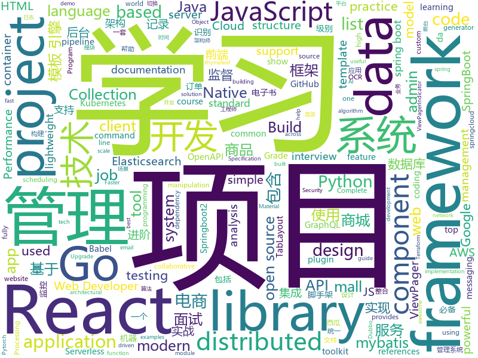

# 2019-08-14
See what the GitHub community is most excited about today.

## python
* [AbsoluteZero](https://github.com/TheSph1nx/AbsoluteZero)(**30 stars today**): Python APT Backdoor
* [favorite-link](https://github.com/guanguans/favorite-link)(**136 stars today**): ❤️每日收集喜欢的开源项目
* [thefuck](https://github.com/nvbn/thefuck)(**208 stars today**): Magnificent app which corrects your previous console command.
* [serverless-application-model](https://github.com/awslabs/serverless-application-model)(**12 stars today**): AWS Serverless Application Model (SAM) is an open-source framework for building serverless applications
* [HelloGitHub](https://github.com/521xueweihan/HelloGitHub)(**81 stars today**): Find pearls on open-source seashore 分享 GitHub 上有趣、入门级的开源项目
* [audio](https://github.com/pytorch/audio)(**5 stars today**): Data manipulation and transformation for audio signal processing, powered by PyTorch
* [google-research](https://github.com/google-research/google-research)(**37 stars today**): Google AI Research
* [hacs](https://github.com/custom-components/hacs)(**3 stars today**): Manage (Install, track, upgrade) and discover custom elements for Home Assistant.
* [scipy](https://github.com/scipy/scipy)(**10 stars today**): Scipy library main repository
* [pandas](https://github.com/pandas-dev/pandas)(**24 stars today**): Flexible and powerful data analysis / manipulation library for Python, providing labeled data structures similar to R data.frame objects, statistical functions, and much more
* [django-rest-framework](https://github.com/encode/django-rest-framework)(**17 stars today**): Web APIs for Django.⚡️
* [pytorch-transformers](https://github.com/huggingface/pytorch-transformers)(**48 stars today**): 👾A library of state-of-the-art pretrained models for Natural Language Processing (NLP)
* [AttackSurfaceMapper](https://github.com/superhedgy/AttackSurfaceMapper)(**47 stars today**): AttackSurfaceMapper is a tool that aims to automate the reconnaissance process.
* [system-design-primer](https://github.com/donnemartin/system-design-primer)(**54 stars today**): Learn how to design large-scale systems. Prep for the system design interview. Includes Anki flashcards.
* [Firmware_Slap](https://github.com/ChrisTheCoolHut/Firmware_Slap)(**22 stars today**): Discovering vulnerabilities in firmware through concolic analysis and function clustering.
* [defcon_27_windbg_workshop](https://github.com/hugsy/defcon_27_windbg_workshop)(**18 stars today**): DEFCON 27 workshop - Modern Debugging with WinDbg Preview
* [luigi](https://github.com/spotify/luigi)(**12 stars today**): Luigi is a Python module that helps you build complex pipelines of batch jobs. It handles dependency resolution, workflow management, visualization etc. It also comes with Hadoop support built in.
* [Pytorch-UNet](https://github.com/milesial/Pytorch-UNet)(**6 stars today**): Pytorch implementation of the U-Net for image semantic segmentation, with dense CRF post-processing
* [A-Light-and-Fast-Face-Detector-for-Edge-Devices](https://github.com/YonghaoHe/A-Light-and-Fast-Face-Detector-for-Edge-Devices)(**14 stars today**): The repo is still under construction. The formal release is coming soon.
* [sherlock](https://github.com/sherlock-project/sherlock)(**85 stars today**): 🔎Find usernames across social networks
* [foolbox](https://github.com/bethgelab/foolbox)(**5 stars today**): Python toolbox to create adversarial examples that fool neural networks in PyTorch, TensorFlow, Keras, …
* [gym](https://github.com/openai/gym)(**20 stars today**): A toolkit for developing and comparing reinforcement learning algorithms.
* [poetry](https://github.com/sdispater/poetry)(**49 stars today**): Python dependency management and packaging made easy.
* [monkey](https://github.com/guardicore/monkey)(**5 stars today**): Infection Monkey - An automated pentest tool
* [youtube-dl](https://github.com/ytdl-org/youtube-dl)(**93 stars today**): Command-line program to download videos from YouTube.com and other video sites

## java
* [miaosha](https://github.com/qiurunze123/miaosha)(**142 stars today**): ⭐⭐⭐⭐秒杀系统设计与实现.互联网工程师进阶与分析🙋🐓
* [toBeTopJavaer](https://github.com/hollischuang/toBeTopJavaer)(**167 stars today**): To Be Top Javaer - Java工程师成神之路
* [hope-boot](https://github.com/hope-for/hope-boot)(**146 stars today**): 🌱🚀一款现代化的脚手架项目。企业开发？接外包？赚外快？还是学习？这都能满足你，居家必备，值得拥有🍻整合Springboot2，单点登陆+tk.mybatis+shiro+redis+thymeleaf+maven+swagger前后端分离接口管理+代码生成+定时任务+数据库版本管理flyway+hutool工具包，等实用技术。
* [spring-boot-demo](https://github.com/xkcoding/spring-boot-demo)(**149 stars today**): spring boot demo 是一个用来学习 spring boot 的项目，总共包含 57 个集成demo，已经完成 47 个。包含集成 actuator(监控)、admin(可视化监控)、logback(日志)、aopLog(通过AOP记录web请求日志)、统一异常处理(json级别和页面级别)、freemarker(模板引擎)、thymeleaf(模板引擎)、Beetl(模板引擎)、Enjoy(模板引擎)、JdbcTemplate、JPA(ORM框架)、mybatis(ORM框架)、通用Mapper、PageHelper、mybatis-plus、BeetlSQL、upload(本地文件上传和七牛云文件上传)、redis(缓存)、ehcache(缓存)、email(发送各种类…
* [skywalking](https://github.com/apache/skywalking)(**65 stars today**): APM, Application Performance Monitoring System
* [C-OCR](https://github.com/ctripcorp/C-OCR)(**176 stars today**): C-OCR是携程自研的OCR项目，主要包括身份证、护照、火车票、签证等旅游相关证件、材料的识别。 项目包含4个部分，拒识、检测、识别、后处理。
* [gpmall](https://github.com/2227324689/gpmall)(**101 stars today**): 【咕泡学院实战项目】-基于SpringBoot+Dubbo构建的电商平台-微服务架构、商城、电商、微服务、高并发、kafka
* [fullstack-tutorial](https://github.com/frank-lam/fullstack-tutorial)(**85 stars today**): 🚀fullstack tutorial 2019，后台技术栈/架构师之路/全栈开发社区，春招/秋招/校招/面试
* [ZXBlog](https://github.com/ZXZxin/ZXBlog)(**23 stars today**): 记录各种学习笔记(算法、Java、数据库、并发......)
* [wwa](https://github.com/warofants/wwa)(**21 stars today**): World War of Ants
* [DataX](https://github.com/alibaba/DataX)(**20 stars today**): 
* [aws-doc-sdk-examples](https://github.com/awsdocs/aws-doc-sdk-examples)(**3 stars today**): Code examples used in the official AWS SDK documentation.
* [SpringCloud](https://github.com/zhoutaoo/SpringCloud)(**23 stars today**): 基于SpringCloud2.0的微服务开发脚手架，整合了spring-security-oauth2、apollo、eureka、feign、hystrix、springcloud-gateway、springcloud-bus等。治理方面引入elasticsearch、skywalking、springboot-admin、zipkin等，让项目开发快速进入业务开发，而不需过多时间花费在架构搭建上。持续更新中
* [mall](https://github.com/macrozheng/mall)(**74 stars today**): mall项目是一套电商系统，包括前台商城系统及后台管理系统，基于SpringBoot+MyBatis实现。 前台商城系统包含首页门户、商品推荐、商品搜索、商品展示、购物车、订单流程、会员中心、客户服务、帮助中心等模块。 后台管理系统包含商品管理、订单管理、会员管理、促销管理、运营管理、内容管理、统计报表、财务管理、权限管理、设置等模块。
* [graal](https://github.com/oracle/graal)(**17 stars today**): GraalVM: Run Programs Faster Anywhere🚀
* [onemall](https://github.com/YunaiV/onemall)(**10 stars today**): mall 商城，基于微服务的思想，构建在 B2C 电商场景下的项目实战。核心技术栈，是 Spring Boot + Dubbo 。未来，会重构成 Spring Cloud Alibaba 。
* [xxl-job](https://github.com/xuxueli/xxl-job)(**13 stars today**): A lightweight distributed task scheduling framework.（分布式任务调度平台XXL-JOB）
* [mall-learning](https://github.com/macrozheng/mall-learning)(**32 stars today**): mall学习教程，架构、业务、技术要点全方位解析。mall项目（18k+star）是一套电商系统，使用现阶段主流技术实现。 涵盖了SpringBoot2.1.3、MyBatis3.4.6、Elasticsearch6.2.2、RabbitMQ3.7.15、Redis3.2、Mongodb3.2、Mysql5.7等技术，采用Docker容器化部署。
* [CS-Notes](https://github.com/CyC2018/CS-Notes)(**112 stars today**): 📚Tech Interview Guide 技术面试必备基础知识、Leetcode 题解、Java、C++、Python、后端面试、操作系统、计算机网络、系统设计
* [elastic-job-lite](https://github.com/elasticjob/elastic-job-lite)(**10 stars today**): Elastic-Job is a distributed scheduled job framework, based on Quartz and Zookeeper.
* [MagicIndicator](https://github.com/hackware1993/MagicIndicator)(**11 stars today**): A powerful, customizable and extensible ViewPager indicator framework. As the best alternative of ViewPagerIndicator, TabLayout and PagerSlidingTabStrip —— 强大、可定制、易扩展的 ViewPager 指示器框架。是ViewPagerIndicator、TabLayout、PagerSlidingTabStrip的最佳替代品。支持角标，更支持在非ViewPager场景下使用（使用hide()、show()切换Fragment或使用setVisibility切换FrameLayout里的View等），http://www.jianshu…
* [NewPipe](https://github.com/TeamNewPipe/NewPipe)(**8 stars today**): A libre lightweight streaming front-end for Android.
* [elasticsearch](https://github.com/elastic/elasticsearch)(**43 stars today**): Open Source, Distributed, RESTful Search Engine
* [disruptor](https://github.com/LMAX-Exchange/disruptor)(**6 stars today**): High Performance Inter-Thread Messaging Library
* [grpc-java](https://github.com/grpc/grpc-java)(**8 stars today**): The Java gRPC implementation. HTTP/2 based RPC

## unknown
* [regular-investing-in-box](https://github.com/xiaolai/regular-investing-in-box)(**119 stars today**): 定投改变命运 —— 让时间陪你慢慢变富
* [slides](https://github.com/TritonHo/slides)(**17 stars today**): it is a repository to store all slides used by Triton Ho's public presentation and course.
* [badass-conference-talks](https://github.com/emmawedekind/badass-conference-talks)(**46 stars today**): 
* [Machine-learning-learning-notes](https://github.com/Vay-keen/Machine-learning-learning-notes)(**188 stars today**): 周志华《机器学习》又称西瓜书是一本较为全面的书籍，书中详细介绍了机器学习领域不同类型的算法(例如：监督学习、无监督学习、半监督学习、强化学习、集成降维、特征选择等)，记录了本人在学习过程中的理解思路与扩展知识点，希望对新人阅读西瓜书有所帮助！
* [starter-workflows](https://github.com/actions/starter-workflows)(**26 stars today**): Accelerating new GitHub Actions workflows
* [AZ-300-MicrosoftAzureArchitectTechnologies](https://github.com/MicrosoftLearning/AZ-300-MicrosoftAzureArchitectTechnologies)(**1 stars today**): 
* [Shift-AI-models-to-real-world-products](https://github.com/lonelygo/Shift-AI-models-to-real-world-products)(**38 stars today**): Share some useful guides and references about how to shift AI models to real world products or projects.
* [rfcs](https://github.com/vuejs/rfcs)(**2 stars today**): RFCs for substantial changes / feature additions to Vue core
* [architect-awesome](https://github.com/xingshaocheng/architect-awesome)(**28 stars today**): 后端架构师技术图谱
* [developer-roadmap](https://github.com/kamranahmedse/developer-roadmap)(**82 stars today**): Roadmap to becoming a web developer in 2019
* [the-book-of-secret-knowledge](https://github.com/trimstray/the-book-of-secret-knowledge)(**87 stars today**): A collection of inspiring lists, manuals, cheatsheets, blogs, hacks, one-liners, cli/web tools and more.
* [Awesome-Interview](https://github.com/Awesome-Interview/Awesome-Interview)(**28 stars today**): Collection of awesome interview references.
* [fig-standards](https://github.com/php-fig/fig-standards)(**9 stars today**): Standards either proposed or approved by the Framework Interop Group
* [solr-injection](https://github.com/artsploit/solr-injection)(**15 stars today**): Apache Solr Injection Research
* [Beginner-Network-Pentesting](https://github.com/hmaverickadams/Beginner-Network-Pentesting)(**19 stars today**): Notes for Beginner Network Pentesting Course
* [awesome-production-machine-learning](https://github.com/EthicalML/awesome-production-machine-learning)(**11 stars today**): A curated list of awesome open source libraries to deploy, monitor, version and scale your machine learning
* [babel-handbook](https://github.com/jamiebuilds/babel-handbook)(**6 stars today**): 📘A guided handbook on how to use Babel and how to create plugins for Babel.
* [blog](https://github.com/yygmind/blog)(**25 stars today**): 我是木易杨，公众号「高级前端进阶」作者，跟着我每周重点攻克一个前端面试重难点。接下来让我带你走进高级前端的世界，在进阶的路上，共勉！
* [new-pac](https://github.com/Alvin9999/new-pac)(**21 stars today**): 
* [DemonSeed](https://github.com/O-MG/DemonSeed)(**26 stars today**): 
* [You-Dont-Know-JS](https://github.com/getify/You-Dont-Know-JS)(**53 stars today**): A book series on JavaScript. @YDKJS on twitter.
* [OpenAPI-Specification](https://github.com/OAI/OpenAPI-Specification)(**12 stars today**): The OpenAPI Specification Repository
* [ganhacks](https://github.com/soumith/ganhacks)(**11 stars today**): starter from "How to Train a GAN?" at NIPS2016
* [app-ideas](https://github.com/florinpop17/app-ideas)(**16 stars today**): A Collection of application ideas which can be used to improve your coding skills.
* [Data-Science--Cheat-Sheet](https://github.com/abhat222/Data-Science--Cheat-Sheet)(**11 stars today**): Cheat Sheets

## javascript
* [gatsby](https://github.com/gatsbyjs/gatsby)(**55 stars today**): Build blazing fast, modern apps and websites with React
* [mc.js](https://github.com/ian13456/mc.js)(**323 stars today**): Open source Minecraft clone built with ThreeJS, ReactJS, GraphQL, and NodeJS.
* [taro](https://github.com/NervJS/taro)(**36 stars today**): 多端统一开发框架，支持用 React 的开发方式编写一次代码，生成能运行在微信/百度/支付宝/字节跳动/ QQ 小程序、快应用、H5、React Native 等的应用。 https://taro.jd.com/
* [three.js](https://github.com/mrdoob/three.js)(**38 stars today**): JavaScript 3D library.
* [complete-javascript-course](https://github.com/jonasschmedtmann/complete-javascript-course)(**7 stars today**): Starter files, final projects and FAQ for my Complete JavaScript course
* [fullstack-course4](https://github.com/jhu-ep-coursera/fullstack-course4)(**1 stars today**): Example code for HTML, CSS, and Javascript for Web Developers Coursera Course
* [You-Dont-Know-JS](https://github.com/cezaraugusto/You-Dont-Know-JS)(**44 stars today**): 📗📒(PT-BR translation) JS Book Series.
* [semana-omnistack-8](https://github.com/Rocketseat/semana-omnistack-8)(**19 stars today**): Código da aplicação da Semana OmniStack 8.0
* [next.js](https://github.com/zeit/next.js)(**36 stars today**): The React Framework
* [quasar](https://github.com/quasarframework/quasar)(**14 stars today**): Quasar Framework - Build high-performance VueJS user interfaces in record time
* [react-router](https://github.com/ReactTraining/react-router)(**18 stars today**): Declarative routing for React
* [yup](https://github.com/jquense/yup)(**17 stars today**): Dead simple Object schema validation
* [remote-jobs](https://github.com/remoteintech/remote-jobs)(**21 stars today**): A list of semi to fully remote-friendly companies in tech.
* [react-admin](https://github.com/marmelab/react-admin)(**16 stars today**): A frontend Framework for building admin applications running in the browser on top of REST/GraphQL APIs, using ES6, React and Material Design
* [Task-App-Refactored-Custom-Auth](https://github.com/JamieCorkhill/Task-App-Refactored-Custom-Auth)(**4 stars today**): A Node.js API utilizing clean architectural and design patterns with a custom JWT-based authentication system.
* [ckeditor5](https://github.com/ckeditor/ckeditor5)(**14 stars today**): Powerful rich text editor framework with a modular architecture, modern integrations and features like collaborative editing.
* [material-ui](https://github.com/mui-org/material-ui)(**48 stars today**): React components for faster and easier web development. Build your own design system, or start with Material Design.
* [react-slick](https://github.com/akiran/react-slick)(**8 stars today**): React carousel component
* [chinese-poetry](https://github.com/chinese-poetry/chinese-poetry)(**76 stars today**): 最全中华古诗词数据库, 唐宋两朝近一万四千古诗人, 接近5.5万首唐诗加26万宋诗. 两宋时期1564位词人，21050首词。
* [react-virtualized](https://github.com/bvaughn/react-virtualized)(**12 stars today**): React components for efficiently rendering large lists and tabular data
* [react-styleguidist](https://github.com/styleguidist/react-styleguidist)(**9 stars today**): Isolated React component development environment with a living style guide
* [2019-talks](https://github.com/gophercon/2019-talks)(**28 stars today**): Slides and links for 2019 talks
* [react-native-ui-lib](https://github.com/wix/react-native-ui-lib)(**2 stars today**): UI Components Library for React Native
* [react-testing-library](https://github.com/testing-library/react-testing-library)(**36 stars today**): 🐐Simple and complete React DOM testing utilities that encourage good testing practices.
* [angular.js](https://github.com/angular/angular.js)(**6 stars today**): AngularJS - HTML enhanced for web apps!

## html
* [webdevbootcamp](https://github.com/nax3t/webdevbootcamp)(**4 stars today**): All source code for back-end projects from the Web Developer Bootcamp
* [awesome-modern-cpp](https://github.com/rigtorp/awesome-modern-cpp)(**8 stars today**): A collection of resources on modern C++
* [stisla](https://github.com/stisla/stisla)(**3 stars today**): Free Bootstrap Admin Template
* [country-list](https://github.com/umpirsky/country-list)(**5 stars today**): 🌐List of all countries with names and ISO 3166-1 codes in all languages and data formats.
* [aws-well-architected-labs](https://github.com/awslabs/aws-well-architected-labs)(**2 stars today**): Hands on labs and code to help you learn, measure, and build using architectural best practices.
* [quickstart-js](https://github.com/firebase/quickstart-js)(**4 stars today**): Firebase Quickstart Samples for Web
* [webcomponents](https://github.com/w3c/webcomponents)(**9 stars today**): Web Components specifications
* [flexboxgrid](https://github.com/kristoferjoseph/flexboxgrid)(**3 stars today**): Grid based on CSS3 flexbox
* [professional-services](https://github.com/GoogleCloudPlatform/professional-services)(**2 stars today**): Common solutions and tools developed by Google Cloud's Professional Services team
* [ASVS](https://github.com/OWASP/ASVS)(**1 stars today**): Application Security Verification Standard
* [swagger-codegen](https://github.com/swagger-api/swagger-codegen)(**3 stars today**): swagger-codegen contains a template-driven engine to generate documentation, API clients and server stubs in different languages by parsing your OpenAPI / Swagger definition.
* [proposal-pipeline-operator](https://github.com/tc39/proposal-pipeline-operator)(**4 stars today**): A proposal for adding the simple-but-useful pipeline operator to JavaScript.
* [typedoc](https://github.com/TypeStrong/typedoc)(**5 stars today**): Documentation generator for TypeScript projects.
* [stickyfill](https://github.com/wilddeer/stickyfill)(**1 stars today**): Polyfill for CSS `position: sticky`
* [flutter-in-action](https://github.com/flutterchina/flutter-in-action)(**16 stars today**): 《Flutter实战》电子书
* [mxgraph](https://github.com/jgraph/mxgraph)(**4 stars today**): mxGraph is a fully client side JavaScript diagramming library
* [postmark-templates](https://github.com/wildbit/postmark-templates)(**4 stars today**): Rock-solid email templates for applications.
* [studyFiles](https://github.com/guanhui07/studyFiles)(**1 stars today**): 一些电子书pdf
* [kryo](https://github.com/EsotericSoftware/kryo)(**1 stars today**): Java binary serialization and cloning: fast, efficient, automatic
* [jsr](https://github.com/mercyblitz/jsr)(**3 stars today**): Java Specification Requests
* [computer-science-flash-cards](https://github.com/jwasham/computer-science-flash-cards)(**3 stars today**): Mini website for testing both general CS knowledge and enforce coding practice and common algorithm/data structure memorization.
* [js-xss](https://github.com/leizongmin/js-xss)(**1 stars today**): Sanitize untrusted HTML (to prevent XSS) with a configuration specified by a Whitelist
* [antd-mobile-samples](https://github.com/ant-design/antd-mobile-samples)(**0 stars today**): antd-mobile samples
* [web-moderno](https://github.com/cod3rcursos/web-moderno)(**2 stars today**): 
* [JavaScript30](https://github.com/wesbos/JavaScript30)(**9 stars today**): 30 Day Vanilla JS Challenge

## go
* [telegraf](https://github.com/influxdata/telegraf)(**16 stars today**): The plugin-driven server agent for collecting & reporting metrics.
* [kingpin](https://github.com/alecthomas/kingpin)(**7 stars today**): A Go (golang) command line and flag parser
* [sarama](https://github.com/Shopify/sarama)(**9 stars today**): Sarama is a Go library for Apache Kafka 0.8, and up.
* [consul](https://github.com/hashicorp/consul)(**9 stars today**): Consul is a distributed, highly available, and data center aware solution to connect and configure applications across dynamic, distributed infrastructure.
* [kops](https://github.com/kubernetes/kops)(**5 stars today**): Kubernetes Operations (kops) - Production Grade K8s Installation, Upgrades, and Management
* [go-kill-mysql-query](https://github.com/mugli/go-kill-mysql-query)(**8 stars today**): Interactively shows long running queries in MySQL server and provides option to kill them one by one
* [golang-samples](https://github.com/GoogleCloudPlatform/golang-samples)(**11 stars today**): Sample apps and code written for Google Cloud in the Go programming language.
* [torrent](https://github.com/anacrolix/torrent)(**7 stars today**): Full-featured BitTorrent-client package and utilities
* [protobuf](https://github.com/golang/protobuf)(**9 stars today**): Go support for Google's protocol buffers
* [kubernetes](https://github.com/kubernetes/kubernetes)(**51 stars today**): Production-Grade Container Scheduling and Management
* [beats](https://github.com/elastic/beats)(**14 stars today**): 🐠Beats - Lightweight shippers for Elasticsearch & Logstash
* [compress](https://github.com/klauspost/compress)(**9 stars today**): Optimized compression packages
* [mapstructure](https://github.com/mitchellh/mapstructure)(**18 stars today**): Go library for decoding generic map values into native Go structures.
* [testify](https://github.com/stretchr/testify)(**16 stars today**): A toolkit with common assertions and mocks that plays nicely with the standard library
* [kubeedge](https://github.com/kubeedge/kubeedge)(**4 stars today**): Kubernetes Native Edge Computing Framework (project under CNCF)
* [elastic](https://github.com/olivere/elastic)(**3 stars today**): Elasticsearch client for Go.
* [flux](https://github.com/fluxcd/flux)(**11 stars today**): The GitOps Kubernetes operator
* [terraform-provider-aws](https://github.com/terraform-providers/terraform-provider-aws)(**8 stars today**): Terraform AWS provider
* [terragrunt](https://github.com/gruntwork-io/terragrunt)(**2 stars today**): Terragrunt is a thin wrapper for Terraform that provides extra tools for working with multiple Terraform modules.
* [nsq](https://github.com/nsqio/nsq)(**31 stars today**): A realtime distributed messaging platform
* [go](https://github.com/golang/go)(**59 stars today**): The Go programming language
* [moby](https://github.com/moby/moby)(**30 stars today**): Moby Project - a collaborative project for the container ecosystem to assemble container-based systems
* [clair](https://github.com/coreos/clair)(**14 stars today**): Vulnerability Static Analysis for Containers
* [gofpdf](https://github.com/jung-kurt/gofpdf)(**7 stars today**): A PDF document generator with high level support for text, drawing and images
* [kit](https://github.com/go-kit/kit)(**12 stars today**): A standard library for microservices.

## WordCloud

