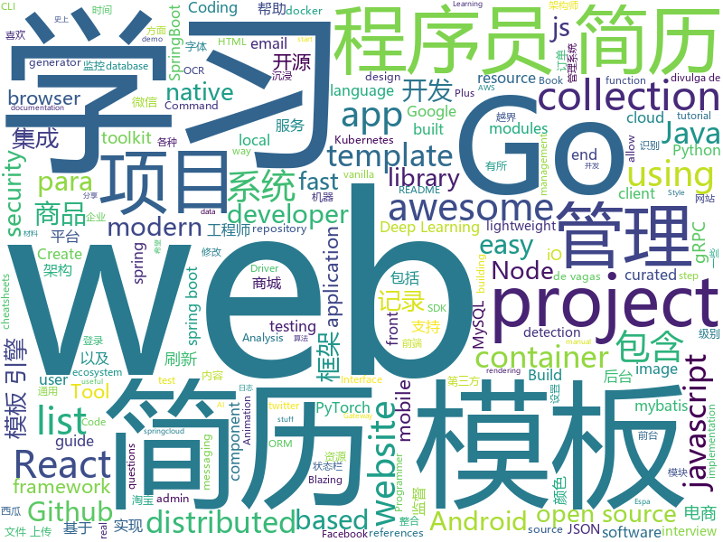

# 2019-08-15
See what the GitHub community is most excited about today.

## python
* [tlroadmap](https://github.com/tlbootcamp/tlroadmap)(**73 stars today**): 👩🏼‍💻👨🏻‍💻Карта навыков и модель развития тимлидов
* [localstack](https://github.com/localstack/localstack)(**77 stars today**): 💻A fully functional local AWS cloud stack. Develop and test your cloud & Serverless apps offline!
* [matplotlib-cheatsheet](https://github.com/rougier/matplotlib-cheatsheet)(**80 stars today**): Matplotlib 3.1 cheat sheet
* [favorite-link](https://github.com/guanguans/favorite-link)(**74 stars today**): ❤️每日收集喜欢的开源项目
* [Firmware_Slap](https://github.com/ChrisTheCoolHut/Firmware_Slap)(**14 stars today**): Discovering vulnerabilities in firmware through concolic analysis and function clustering.
* [DeepLearningExamples](https://github.com/NVIDIA/DeepLearningExamples)(**51 stars today**): Deep Learning Examples
* [gym](https://github.com/openai/gym)(**15 stars today**): A toolkit for developing and comparing reinforcement learning algorithms.
* [code_snippets](https://github.com/CoreyMSchafer/code_snippets)(**7 stars today**): 
* [HelloGitHub](https://github.com/521xueweihan/HelloGitHub)(**37 stars today**): Find pearls on open-source seashore 分享 GitHub 上有趣、入门级的开源项目
* [insightface](https://github.com/deepinsight/insightface)(**13 stars today**): Face Analysis Project on MXNet
* [heartrate](https://github.com/alexmojaki/heartrate)(**33 stars today**): Simple real time visualisation of the execution of a Python program.
* [aws-cli](https://github.com/aws/aws-cli)(**9 stars today**): Universal Command Line Interface for Amazon Web Services
* [tvm](https://github.com/dmlc/tvm)(**8 stars today**): Open deep learning compiler stack for cpu, gpu and specialized accelerators
* [thefuck](https://github.com/nvbn/thefuck)(**160 stars today**): Magnificent app which corrects your previous console command.
* [CenterNet](https://github.com/xingyizhou/CenterNet)(**11 stars today**): Object detection, 3D detection, and pose estimation using center point detection:
* [google-research](https://github.com/google-research/google-research)(**50 stars today**): Google AI Research
* [facenet](https://github.com/davidsandberg/facenet)(**13 stars today**): Face recognition using Tensorflow
* [AutoXue](https://github.com/kessil/AutoXue)(**8 stars today**): 学习强国 自动学习 答题 视听 每天积41分
* [pandas-profiling](https://github.com/pandas-profiling/pandas-profiling)(**25 stars today**): Create HTML profiling reports from pandas DataFrame objects
* [RustPython](https://github.com/RustPython/RustPython)(**18 stars today**): A Python Interpreter written in Rust
* [apex](https://github.com/NVIDIA/apex)(**18 stars today**): A PyTorch Extension: Tools for easy mixed precision and distributed training in Pytorch
* [awesome-python-login-model](https://github.com/CriseLYJ/awesome-python-login-model)(**19 stars today**): 😮python模拟登陆一些大型网站，还有一些简单的爬虫，希望对你们有所帮助❤️，如果喜欢记得给个star哦🌟
* [anchore-engine](https://github.com/anchore/anchore-engine)(**4 stars today**): A service that analyzes docker images and applies user-defined acceptance policies to allow automated container image validation and certification
* [workshops](https://github.com/ansible/workshops)(**5 stars today**): Training Course for Ansible Automation
* [allennlp](https://github.com/allenai/allennlp)(**10 stars today**): An open-source NLP research library, built on PyTorch.

## java
* [spring-boot-demo](https://github.com/xkcoding/spring-boot-demo)(**317 stars today**): spring boot demo 是一个用来学习 spring boot 的项目，总共包含 57 个集成demo，已经完成 47 个。包含集成 actuator(监控)、admin(可视化监控)、logback(日志)、aopLog(通过AOP记录web请求日志)、统一异常处理(json级别和页面级别)、freemarker(模板引擎)、thymeleaf(模板引擎)、Beetl(模板引擎)、Enjoy(模板引擎)、JdbcTemplate、JPA(ORM框架)、mybatis(ORM框架)、通用Mapper、PageHelper、mybatis-plus、BeetlSQL、upload(本地文件上传和七牛云文件上传)、redis(缓存)、ehcache(缓存)、email(发送各种类…
* [C-OCR](https://github.com/ctripcorp/C-OCR)(**173 stars today**): C-OCR是携程自研的OCR项目，主要包括身份证、护照、火车票、签证等旅游相关证件、材料的识别。 项目包含4个部分，拒识、检测、识别、后处理。
* [fullstack-tutorial](https://github.com/frank-lam/fullstack-tutorial)(**99 stars today**): 🚀fullstack tutorial 2019，后台技术栈/架构师之路/全栈开发社区，春招/秋招/校招/面试
* [gpmall](https://github.com/2227324689/gpmall)(**74 stars today**): 【咕泡学院实战项目】-基于SpringBoot+Dubbo构建的电商平台-微服务架构、商城、电商、微服务、高并发、kafka
* [toBeTopJavaer](https://github.com/hollischuang/toBeTopJavaer)(**166 stars today**): To Be Top Javaer - Java工程师成神之路
* [ZXBlog](https://github.com/ZXZxin/ZXBlog)(**31 stars today**): 记录各种学习笔记(算法、Java、数据库、并发......)
* [elasticsearch](https://github.com/elastic/elasticsearch)(**32 stars today**): Open Source, Distributed, RESTful Search Engine
* [wwa](https://github.com/warofants/wwa)(**5 stars today**): World War of Ants
* [miaosha](https://github.com/qiurunze123/miaosha)(**98 stars today**): ⭐⭐⭐⭐秒杀系统设计与实现.互联网工程师进阶与分析🙋🐓
* [mall](https://github.com/macrozheng/mall)(**65 stars today**): mall项目是一套电商系统，包括前台商城系统及后台管理系统，基于SpringBoot+MyBatis实现。 前台商城系统包含首页门户、商品推荐、商品搜索、商品展示、购物车、订单流程、会员中心、客户服务、帮助中心等模块。 后台管理系统包含商品管理、订单管理、会员管理、促销管理、运营管理、内容管理、统计报表、财务管理、权限管理、设置等模块。
* [lucene-solr](https://github.com/apache/lucene-solr)(**5 stars today**): Mirror of Apache Lucene + Solr
* [pulsar](https://github.com/apache/pulsar)(**10 stars today**): Apache Pulsar - distributed pub-sub messaging system
* [ImmersionBar](https://github.com/gyf-dev/ImmersionBar)(**15 stars today**): android 4.4以上沉浸式状态栏和沉浸式导航栏管理，适配横竖屏切换、刘海屏、软键盘弹出等问题，可以修改状态栏字体颜色和导航栏图标颜色，以及不可修改字体颜色手机的适配，适用于Activity、Fragment、DialogFragment、Dialog，PopupWindow，一句代码轻松实现，以及对bar的其他设置，详见README。简书请参考：http://www.jianshu.com/p/2a884e211a62
* [bazel](https://github.com/bazelbuild/bazel)(**5 stars today**): a fast, scalable, multi-language and extensible build system
* [selenium](https://github.com/SeleniumHQ/selenium)(**12 stars today**): A browser automation framework and ecosystem.
* [SmartRefreshLayout](https://github.com/scwang90/SmartRefreshLayout)(**13 stars today**): 🔥下拉刷新、上拉加载、二级刷新、淘宝二楼、RefreshLayout、OverScroll，Android智能下拉刷新框架，支持越界回弹、越界拖动，具有极强的扩展性，集成了几十种炫酷的Header和 Footer。
* [recyclerview-animators](https://github.com/wasabeef/recyclerview-animators)(**11 stars today**): An Android Animation library which easily add itemanimator to RecyclerView items.
* [grpc-java](https://github.com/grpc/grpc-java)(**8 stars today**): The Java gRPC implementation. HTTP/2 based RPC
* [SpringCloud](https://github.com/zhoutaoo/SpringCloud)(**21 stars today**): 基于SpringCloud2.0的微服务开发脚手架，整合了spring-security-oauth2、apollo、eureka、feign、hystrix、springcloud-gateway、springcloud-bus等。治理方面引入elasticsearch、skywalking、springboot-admin、zipkin等，让项目开发快速进入业务开发，而不需过多时间花费在架构搭建上。持续更新中
* [JustAuth](https://github.com/justauth/JustAuth)(**29 stars today**): 💯史上最全的整合第三方登录的开源库。目前已支持Github、Gitee、微博、钉钉、百度、Coding、腾讯云开发者平台、OSChina、支付宝、QQ、微信、淘宝、Google、Facebook、抖音、领英、小米、微软、今日头条、Teambition、StackOverflow、Pinterest、人人、华为和企业微信等第三方平台的授权登录。 Login, so easy!
* [SpringCloudLearning](https://github.com/forezp/SpringCloudLearning)(**25 stars today**): 《史上最简单的Spring Cloud教程源码》
* [p3c](https://github.com/alibaba/p3c)(**30 stars today**): Alibaba Java Coding Guidelines pmd implements and IDE plugin
* [react-native-push-notification](https://github.com/zo0r/react-native-push-notification)(**2 stars today**): React Native Local and Remote Notifications
* [DataX](https://github.com/alibaba/DataX)(**20 stars today**): 
* [spring-cloud-gateway](https://github.com/spring-cloud/spring-cloud-gateway)(**6 stars today**): A Gateway built on Spring Framework 5.x and Spring Boot 2.x providing routing and more.

## unknown
* [Machine-learning-learning-notes](https://github.com/Vay-keen/Machine-learning-learning-notes)(**191 stars today**): 周志华《机器学习》又称西瓜书是一本较为全面的书籍，书中详细介绍了机器学习领域不同类型的算法(例如：监督学习、无监督学习、半监督学习、强化学习、集成降维、特征选择等)，记录了本人在学习过程中的理解思路与扩展知识点，希望对新人阅读西瓜书有所帮助！
* [learn-regex](https://github.com/ziishaned/learn-regex)(**633 stars today**): Learn regex the easy way
* [javascript-testing-best-practices](https://github.com/goldbergyoni/javascript-testing-best-practices)(**112 stars today**): 📗🌐🚢Comprehensive and exhaustive JavaScript & Node.js testing best practices (August 2019)
* [the-book-of-secret-knowledge](https://github.com/trimstray/the-book-of-secret-knowledge)(**70 stars today**): A collection of inspiring lists, manuals, cheatsheets, blogs, hacks, one-liners, cli/web tools and more.
* [regular-investing-in-box](https://github.com/xiaolai/regular-investing-in-box)(**81 stars today**): 定投改变命运 —— 让时间陪你慢慢变富
* [awesome-deep-learning](https://github.com/ChristosChristofidis/awesome-deep-learning)(**6 stars today**): A curated list of awesome Deep Learning tutorials, projects and communities.
* [The-Documentation-Compendium](https://github.com/kylelobo/The-Documentation-Compendium)(**13 stars today**): 📢Various README templates & tips on writing high-quality documentation that people want to read.
* [golang-developer-roadmap](https://github.com/Alikhll/golang-developer-roadmap)(**21 stars today**): Roadmap to becoming a Go developer in 2019
* [vagas](https://github.com/frontendbr/vagas)(**10 stars today**): 🔬Espaço para divulgação de vagas para front-enders.
* [awesome-interview-questions](https://github.com/MaximAbramchuck/awesome-interview-questions)(**14 stars today**): A curated awesome list of lists of interview questions. Feel free to contribute!🎓
* [awesome-security](https://github.com/sbilly/awesome-security)(**3 stars today**): A collection of awesome software, libraries, documents, books, resources and cools stuffs about security.
* [ResumeSample](https://github.com/geekcompany/ResumeSample)(**12 stars today**): Resume template for Chinese programmers . 程序员简历模板系列。包括PHP程序员简历模板、iOS程序员简历模板、Android程序员简历模板、Web前端程序员简历模板、Java程序员简历模板、C/C++程序员简历模板、NodeJS程序员简历模板、架构师简历模板以及通用程序员简历模板
* [awesome-react-hooks](https://github.com/rehooks/awesome-react-hooks)(**6 stars today**): Awesome React Hooks
* [Shift-AI-models-to-real-world-products](https://github.com/lonelygo/Shift-AI-models-to-real-world-products)(**8 stars today**): Share some useful guides and references about how to shift AI models to real world products or projects.
* [Awesome-Interview](https://github.com/Awesome-Interview/Awesome-Interview)(**12 stars today**): Collection of awesome interview references.
* [one-python-craftsman](https://github.com/piglei/one-python-craftsman)(**10 stars today**): 来自一位 Pythonista 的编程经验分享，内容涵盖编码技巧、最佳实践与思维模式等方面。
* [vagas](https://github.com/backend-br/vagas)(**7 stars today**): ✌️Espaço para divulgação de vagas para backenders
* [gitignore](https://github.com/github/gitignore)(**54 stars today**): A collection of useful .gitignore templates
* [medical-data](https://github.com/beamandrew/medical-data)(**4 stars today**): 
* [awesome-wechat-weapp](https://github.com/justjavac/awesome-wechat-weapp)(**51 stars today**): 微信小程序开发资源汇总💯
* [app-ideas](https://github.com/florinpop17/app-ideas)(**24 stars today**): A Collection of application ideas which can be used to improve your coding skills.
* [free-resources](https://github.com/abc-club/free-resources)(**12 stars today**): 前端资源合集
* [coding-interview-university](https://github.com/jwasham/coding-interview-university)(**178 stars today**): A complete computer science study plan to become a software engineer.
* [jstraining](https://github.com/ruanyf/jstraining)(**9 stars today**): 全栈工程师培训材料
* [stanford-cs-229-machine-learning](https://github.com/afshinea/stanford-cs-229-machine-learning)(**10 stars today**): VIP cheatsheets for Stanford's CS 229 Machine Learning

## javascript
* [mc.js](https://github.com/ian13456/mc.js)(**195 stars today**): Open source Minecraft clone built with ThreeJS, ReactJS, GraphQL, and NodeJS.
* [gatsby](https://github.com/gatsbyjs/gatsby)(**81 stars today**): Build blazing fast, modern apps and websites with React
* [You-Dont-Know-JS](https://github.com/cezaraugusto/You-Dont-Know-JS)(**56 stars today**): 📗📒(PT-BR translation) JS Book Series.
* [baidu-netdisk-downloaderx](https://github.com/b3log/baidu-netdisk-downloaderx)(**180 stars today**): ⚡️一款图形界面的百度网盘不限速下载器，支持 Windows、Linux 和 Mac。
* [lottie-web](https://github.com/airbnb/lottie-web)(**42 stars today**): Render After Effects animations natively on Web, Android and iOS, and React Native. http://airbnb.io/lottie/
* [axios](https://github.com/axios/axios)(**44 stars today**): Promise based HTTP client for the browser and node.js
* [juice-shop](https://github.com/bkimminich/juice-shop)(**20 stars today**): OWASP Juice Shop: Probably the most modern and sophisticated insecure web application
* [puppeteer](https://github.com/GoogleChrome/puppeteer)(**32 stars today**): Headless Chrome Node API
* [javascript](https://github.com/airbnb/javascript)(**38 stars today**): JavaScript Style Guide
* [vue-multiselect](https://github.com/shentao/vue-multiselect)(**14 stars today**): Universal select/multiselect/tagging component for Vue.js
* [aws-sdk-js](https://github.com/aws/aws-sdk-js)(**6 stars today**): AWS SDK for JavaScript in the browser and Node.js
* [parcel](https://github.com/parcel-bundler/parcel)(**30 stars today**): 📦🚀Blazing fast, zero configuration web application bundler
* [bpmn-js](https://github.com/bpmn-io/bpmn-js)(**14 stars today**): A BPMN 2.0 rendering toolkit and web modeler.
* [pixi.js](https://github.com/pixijs/pixi.js)(**35 stars today**): The HTML5 Creation Engine: Create beautiful digital content with the fastest, most flexible 2D WebGL renderer.
* [cloud-music](https://github.com/sanyuan0704/cloud-music)(**40 stars today**): React 16.8打造精美音乐WebApp
* [internships](https://github.com/Zackhardtoname/internships)(**37 stars today**): A collection of internship applications for the summer of 2020
* [mjml](https://github.com/mjmlio/mjml)(**22 stars today**): MJML: the only framework that makes responsive-email easy
* [pdf.js](https://github.com/mozilla/pdf.js)(**22 stars today**): PDF Reader in JavaScript
* [react-native](https://github.com/facebook/react-native)(**41 stars today**): A framework for building native apps with React.
* [vConsole](https://github.com/Tencent/vConsole)(**15 stars today**): A lightweight, extendable front-end developer tool for mobile web page.
* [VvvebJs](https://github.com/givanz/VvvebJs)(**38 stars today**): Drag and drop website builder javascript library.
* [flipper](https://github.com/facebook/flipper)(**17 stars today**): A desktop debugging platform for mobile developers.
* [material-ui](https://github.com/mui-org/material-ui)(**63 stars today**): React components for faster and easier web development. Build your own design system, or start with Material Design.
* [style2paints](https://github.com/lllyasviel/style2paints)(**68 stars today**): sketch + style = paints🎨
* [webpack](https://github.com/webpack/webpack)(**24 stars today**): A bundler for javascript and friends. Packs many modules into a few bundled assets. Code Splitting allows for loading parts of the application on demand. Through "loaders", modules can be CommonJs, AMD, ES6 modules, CSS, Images, JSON, Coffeescript, LESS, ... and your custom stuff.

## html
* [Front-end-Developer-Interview-Questions](https://github.com/h5bp/Front-end-Developer-Interview-Questions)(**10 stars today**): A list of helpful front-end related questions you can use to interview potential candidates, test yourself or completely ignore.
* [rellax](https://github.com/dixonandmoe/rellax)(**2 stars today**): Lightweight, vanilla javascript parallax library
* [owasp-mstg](https://github.com/OWASP/owasp-mstg)(**1 stars today**): The Mobile Security Testing Guide (MSTG) is a comprehensive manual for mobile app security development, testing and reverse engineering.
* [shiro-example](https://github.com/zhangkaitao/shiro-example)(**3 stars today**): 跟我学Shiro（我的公众号：kaitao-1234567，我的新书：《亿级流量网站架构核心技术》）
* [web-moderno](https://github.com/cod3rcursos/web-moderno)(**6 stars today**): 
* [learning-area](https://github.com/mdn/learning-area)(**9 stars today**): Github repo for the MDN Learning Area.
* [portainer](https://github.com/portainer/portainer)(**9 stars today**): Making Docker management easy.
* [startbootstrap-resume](https://github.com/BlackrockDigital/startbootstrap-resume)(**1 stars today**): A Bootstrap 4 resume/CV theme created by Start Bootstrap
* [intro.js](https://github.com/usablica/intro.js)(**7 stars today**): A better way for new feature introduction and step-by-step users guide for your website and project.
* [webcomponents](https://github.com/w3c/webcomponents)(**10 stars today**): Web Components specifications
* [NGINX-Demos](https://github.com/nginxinc/NGINX-Demos)(**1 stars today**): NGINX and NGINX Plus demos
* [embeddedsw](https://github.com/Xilinx/embeddedsw)(**0 stars today**): Xilinx Embedded Software (embeddedsw) Development
* [typedoc](https://github.com/TypeStrong/typedoc)(**5 stars today**): Documentation generator for TypeScript projects.
* [webdevbootcamp](https://github.com/nax3t/webdevbootcamp)(**3 stars today**): All source code for back-end projects from the Web Developer Bootcamp
* [csswg-drafts](https://github.com/w3c/csswg-drafts)(**2 stars today**): CSS Working Group Editor Drafts
* [awesome-modern-cpp](https://github.com/rigtorp/awesome-modern-cpp)(**7 stars today**): A collection of resources on modern C++
* [shellphish](https://github.com/thelinuxchoice/shellphish)(**0 stars today**): Phishing Tool for 18 social media: Instagram, Facebook, Snapchat, Github, Twitter, Yahoo, Protonmail, Spotify, Netflix, Linkedin, Wordpress, Origin, Steam, Microsoft, InstaFollowers, Gitlab, Pinterest
* [ChineseNLP](https://github.com/didi/ChineseNLP)(**58 stars today**): Datasets, SOTA results of every fields of Chinese NLP
* [fastclick](https://github.com/ftlabs/fastclick)(**2 stars today**): Polyfill to remove click delays on browsers with touch UIs
* [awesome-angular](https://github.com/PatrickJS/awesome-angular)(**7 stars today**): 📄A curated list of awesome Angular resources
* [tstp](https://github.com/calthoff/tstp)(**0 stars today**): This is an old repository for the exercises in "The Self-Taught Programmer." Please see /selftaught.
* [JavaScript30](https://github.com/wesbos/JavaScript30)(**9 stars today**): 30 Day Vanilla JS Challenge
* [learn-to-send-email-via-google-script-html-no-server](https://github.com/dwyl/learn-to-send-email-via-google-script-html-no-server)(**2 stars today**): ✉️An Example of using an HTML form (e.g: "Contact Us" on a website) to send Email without a Backend Server (using a Google Script) perfect for static websites that need to collect data.
* [docs](https://github.com/knative/docs)(**2 stars today**): User documentation for Knative components
* [twemoji](https://github.com/twitter/twemoji)(**11 stars today**): Emoji for everyone. https://twemoji.twitter.com/

## go
* [HFish](https://github.com/hacklcx/HFish)(**168 stars today**): 扩展企业安全测试主动诱导型开源蜜罐框架系统，记录黑客攻击手段
* [moby](https://github.com/moby/moby)(**35 stars today**): Moby Project - a collaborative project for the container ecosystem to assemble container-based systems
* [zap](https://github.com/uber-go/zap)(**10 stars today**): Blazing fast, structured, leveled logging in Go.
* [kubernetes](https://github.com/kubernetes/kubernetes)(**57 stars today**): Production-Grade Container Scheduling and Management
* [redigo](https://github.com/gomodule/redigo)(**7 stars today**): Go client for Redis
* [consul-template](https://github.com/hashicorp/consul-template)(**2 stars today**): Template rendering, notifier, and supervisor for @hashicorp Consul and Vault data.
* [testify](https://github.com/stretchr/testify)(**12 stars today**): A toolkit with common assertions and mocks that plays nicely with the standard library
* [tidb](https://github.com/pingcap/tidb)(**23 stars today**): TiDB is an open source distributed HTAP database compatible with the MySQL protocol
* [redis](https://github.com/go-redis/redis)(**12 stars today**): Type-safe Redis client for Golang
* [aws-sdk-go](https://github.com/aws/aws-sdk-go)(**9 stars today**): AWS SDK for the Go programming language.
* [chi](https://github.com/go-chi/chi)(**22 stars today**): lightweight, idiomatic and composable router for building Go HTTP services
* [kubernetes-ingress-controller](https://github.com/Kong/kubernetes-ingress-controller)(**5 stars today**): Use Kong for Kubernetes Ingress
* [prometheus-operator](https://github.com/coreos/prometheus-operator)(**10 stars today**): Prometheus Operator creates/configures/manages Prometheus clusters atop Kubernetes
* [grpc-gateway](https://github.com/grpc-ecosystem/grpc-gateway)(**15 stars today**): gRPC to JSON proxy generator following the gRPC HTTP spec
* [grpc-go](https://github.com/grpc/grpc-go)(**8 stars today**): The Go language implementation of gRPC. HTTP/2 based RPC
* [amazon-vpc-cni-k8s](https://github.com/aws/amazon-vpc-cni-k8s)(**4 stars today**): Networking plugin repository for pod networking in Kubernetes using Elastic Network Interfaces on AWS
* [terraform-provider-aws](https://github.com/terraform-providers/terraform-provider-aws)(**5 stars today**): Terraform AWS provider
* [inlets](https://github.com/alexellis/inlets)(**5 stars today**): Expose your local endpoints to the Internet
* [sprig](https://github.com/Masterminds/sprig)(**8 stars today**): Useful template functions for Go templates.
* [cobra](https://github.com/spf13/cobra)(**23 stars today**): A Commander for modern Go CLI interactions
* [mysql](https://github.com/go-sql-driver/mysql)(**7 stars today**): Go MySQL Driver is a MySQL driver for Go's (golang) database/sql package
* [rancher](https://github.com/rancher/rancher)(**6 stars today**): Complete container management platform
* [terraform-provider-azurerm](https://github.com/terraform-providers/terraform-provider-azurerm)(**0 stars today**): Terraform provider for Azure Resource Manager
* [nsq](https://github.com/nsqio/nsq)(**7 stars today**): A realtime distributed messaging platform
* [mapstructure](https://github.com/mitchellh/mapstructure)(**9 stars today**): Go library for decoding generic map values into native Go structures.

## WordCloud

