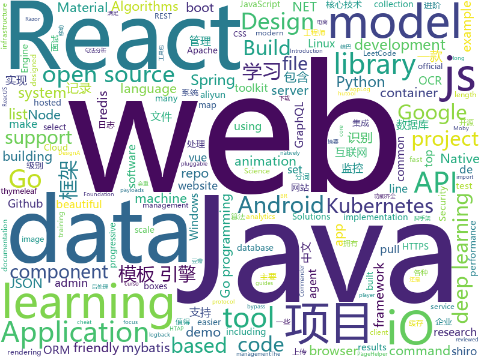

# 2019-08-16
See what the GitHub community is most excited about today.

## python
* [Megatron-LM](https://github.com/NVIDIA/Megatron-LM)(**91 stars today**): Ongoing research training transformer language models at scale, including: BERT
* [bsuite](https://github.com/deepmind/bsuite)(**81 stars today**): bsuite is a collection of carefully-designed experiments that investigate core capabilities of a reinforcement learning (RL) agent
* [tlroadmap](https://github.com/tlbootcamp/tlroadmap)(**44 stars today**): 👩🏼‍💻👨🏻‍💻Карта навыков и модель развития тимлидов
* [matplotlib](https://github.com/matplotlib/matplotlib)(**34 stars today**): matplotlib: plotting with Python
* [public-apis](https://github.com/public-apis/public-apis)(**56 stars today**): A collective list of free APIs for use in software and web development.
* [algo](https://github.com/wangzheng0822/algo)(**50 stars today**): 数据结构和算法必知必会的50个代码实现
* [bert-as-service](https://github.com/hanxiao/bert-as-service)(**15 stars today**): Mapping a variable-length sentence to a fixed-length vector using BERT model
* [favorite-link](https://github.com/guanguans/favorite-link)(**28 stars today**): ❤️每日收集喜欢的开源项目
* [jieba](https://github.com/fxsjy/jieba)(**19 stars today**): 结巴中文分词
* [bert](https://github.com/google-research/bert)(**26 stars today**): TensorFlow code and pre-trained models for BERT
* [DeepLearningExamples](https://github.com/NVIDIA/DeepLearningExamples)(**44 stars today**): Deep Learning Examples
* [pyforest](https://github.com/8080labs/pyforest)(**58 stars today**): Lazy-import of all popular Python Data Science libraries
* [Reddit-GitHub-Team](https://github.com/alexanderklarge/Reddit-GitHub-Team)(**3 stars today**): WE'RE ABANDONING THIS! Migrating to a Group instead to make teamwork easier!
* [PayloadsAllTheThings](https://github.com/swisskyrepo/PayloadsAllTheThings)(**12 stars today**): A list of useful payloads and bypass for Web Application Security and Pentest/CTF
* [ML-From-Scratch](https://github.com/eriklindernoren/ML-From-Scratch)(**10 stars today**): Machine Learning From Scratch. Bare bones NumPy implementations of machine learning models and algorithms with a focus on accessibility. Aims to cover everything from linear regression to deep learning.
* [CVE-2018-13379](https://github.com/milo2012/CVE-2018-13379)(**20 stars today**): CVE-2018-13379
* [tensor2tensor](https://github.com/tensorflow/tensor2tensor)(**8 stars today**): Library of deep learning models and datasets designed to make deep learning more accessible and accelerate ML research.
* [dlrm](https://github.com/facebookresearch/dlrm)(**0 stars today**): An implementation of a deep learning recommendation model (DLRM)
* [airflow](https://github.com/apache/airflow)(**11 stars today**): Apache Airflow
* [matplotlib-cheatsheet](https://github.com/rougier/matplotlib-cheatsheet)(**77 stars today**): Matplotlib 3.1 cheat sheet
* [kedro](https://github.com/quantumblacklabs/kedro)(**5 stars today**): A Python library for building robust production-ready data and analytics pipelines.
* [SegLoss](https://github.com/JunMa11/SegLoss)(**10 stars today**): A collection of loss functions for medical image segmentation
* [snorkel](https://github.com/snorkel-team/snorkel)(**25 stars today**): A system for quickly generating training data with weak supervision
* [examples-of-web-crawlers](https://github.com/shengqiangzhang/examples-of-web-crawlers)(**63 stars today**): 一些有趣的python爬虫例子,对新手比较友好,主要爬取淘宝、天猫、微信、豆瓣、QQ等网站。(Some interesting examples of python crawlers that are friendly to beginners. )
* [scikit-learn](https://github.com/scikit-learn/scikit-learn)(**24 stars today**): scikit-learn: machine learning in Python

## java
* [skywalking](https://github.com/apache/skywalking)(**90 stars today**): APM, Application Performance Monitoring System
* [spring-boot-demo](https://github.com/xkcoding/spring-boot-demo)(**307 stars today**): spring boot demo 是一个用来学习 spring boot 的项目，总共包含 57 个集成demo，已经完成 47 个。包含集成 actuator(监控)、admin(可视化监控)、logback(日志)、aopLog(通过AOP记录web请求日志)、统一异常处理(json级别和页面级别)、freemarker(模板引擎)、thymeleaf(模板引擎)、Beetl(模板引擎)、Enjoy(模板引擎)、JdbcTemplate、JPA(ORM框架)、mybatis(ORM框架)、通用Mapper、PageHelper、mybatis-plus、BeetlSQL、upload(本地文件上传和七牛云文件上传)、redis(缓存)、ehcache(缓存)、email(发送各种类…
* [baritone](https://github.com/cabaletta/baritone)(**24 stars today**): google maps for block game
* [miaosha](https://github.com/qiurunze123/miaosha)(**120 stars today**): ⭐⭐⭐⭐秒杀系统设计与实现.互联网工程师进阶与分析🙋🐓
* [toBeTopJavaer](https://github.com/hollischuang/toBeTopJavaer)(**115 stars today**): To Be Top Javaer - Java工程师成神之路
* [hope-boot](https://github.com/hope-for/hope-boot)(**31 stars today**): 🌱🚀一款现代化的脚手架项目。企业开发？接外包？赚外快？还是学习？这都能满足你，居家必备，值得拥有🍻整合Springboot2，单点登陆+tk.mybatis+shiro+redis+thymeleaf+maven+swagger前后端分离接口管理+代码生成+定时任务+数据库版本管理flyway+hutool工具包，等实用技术。
* [HikariCP](https://github.com/brettwooldridge/HikariCP)(**16 stars today**): 光 HikariCP・A solid, high-performance, JDBC connection pool at last.
* [LeetCodeAnimation](https://github.com/MisterBooo/LeetCodeAnimation)(**98 stars today**): Demonstrate all the questions on LeetCode in the form of animation.（用动画的形式呈现解LeetCode题目的思路）
* [ExoPlayer](https://github.com/google/ExoPlayer)(**11 stars today**): An extensible media player for Android
* [DataX](https://github.com/alibaba/DataX)(**17 stars today**): 
* [HanLP](https://github.com/hankcs/HanLP)(**30 stars today**): 自然语言处理 中文分词 词性标注 命名实体识别 依存句法分析 新词发现 关键词短语提取 自动摘要 文本分类聚类 拼音简繁
* [DoraemonKit](https://github.com/didi/DoraemonKit)(**35 stars today**): 简称 "DoKit" 。一款功能齐全的客户端（ iOS 、Android ）研发助手，你值得拥有。
* [pentaho-kettle](https://github.com/pentaho/pentaho-kettle)(**6 stars today**): Pentaho Data Integration ( ETL ) a.k.a Kettle
* [C-OCR](https://github.com/ctripcorp/C-OCR)(**67 stars today**): C-OCR是携程自研的OCR项目，主要包括身份证、护照、火车票、签证等旅游相关证件、材料的识别。 项目包含4个部分，拒识、检测、识别、后处理。
* [testcontainers-java](https://github.com/testcontainers/testcontainers-java)(**4 stars today**): Testcontainers is a Java library that supports JUnit tests, providing lightweight, throwaway instances of common databases, Selenium web browsers, or anything else that can run in a Docker container.
* [onemall](https://github.com/YunaiV/onemall)(**13 stars today**): mall 商城，基于微服务的思想，构建在 B2C 电商场景下的项目实战。核心技术栈，是 Spring Boot + Dubbo 。未来，会重构成 Spring Cloud Alibaba 。
* [JavaGuide](https://github.com/Snailclimb/JavaGuide)(**103 stars today**): 【Java学习+面试指南】 一份涵盖大部分Java程序员所需要掌握的核心知识。
* [java](https://github.com/kubernetes-client/java)(**4 stars today**): Official Java client library for kubernetes
* [ZXBlog](https://github.com/ZXZxin/ZXBlog)(**10 stars today**): 记录各种学习笔记(算法、Java、数据库、并发......)
* [angel](https://github.com/Angel-ML/angel)(**3 stars today**): A Flexible and Powerful Parameter Server for large-scale machine learning
* [tutorials](https://github.com/eugenp/tutorials)(**20 stars today**): The "REST With Spring" Course:
* [fastjson](https://github.com/alibaba/fastjson)(**7 stars today**): 🚄A fast JSON parser/generator for Java. (Aliyun Data Lake Analytics https://www.aliyun.com/product/datalakeanalytics powered by fastjson )
* [springfox](https://github.com/springfox/springfox)(**5 stars today**): Automated JSON API documentation for API's built with Spring
* [rocketmq](https://github.com/apache/rocketmq)(**15 stars today**): Mirror of Apache RocketMQ
* [animation](https://github.com/android/animation)(**17 stars today**): Multiple samples showing the best practices in animation on Android.

## javascript
* [baidu-netdisk-downloaderx](https://github.com/b3log/baidu-netdisk-downloaderx)(**563 stars today**): ⚡️一款图形界面的百度网盘不限速下载器，支持 Windows、Linux 和 Mac。
* [reactide](https://github.com/reactide/reactide)(**156 stars today**): Reactide is the first dedicated IDE for React web application development.
* [label-studio](https://github.com/heartexlabs/label-studio)(**141 stars today**): Label Studio is a multi-domain data labeling tool with standardized output format
* [algorithm-visualizer](https://github.com/algorithm-visualizer/algorithm-visualizer)(**60 stars today**): 🎆Interactive Online Platform that Visualizes Algorithms from Code
* [mc.js](https://github.com/ian13456/mc.js)(**365 stars today**): Open source Minecraft clone built with ThreeJS, ReactJS, GraphQL, and NodeJS.
* [uppy](https://github.com/transloadit/uppy)(**28 stars today**): The next open source file uploader for web browsers🐶
* [material-ui](https://github.com/mui-org/material-ui)(**35 stars today**): React components for faster and easier web development. Build your own design system, or start with Material Design.
* [react-admin](https://github.com/marmelab/react-admin)(**19 stars today**): A frontend Framework for building admin applications running in the browser on top of REST/GraphQL APIs, using ES6, React and Material Design
* [wtfjs](https://github.com/denysdovhan/wtfjs)(**30 stars today**): A list of funny and tricky JavaScript examples
* [aws-serverless-workshops](https://github.com/aws-samples/aws-serverless-workshops)(**6 stars today**): Code and walkthrough labs to set up serverless applications for Wild Rydes workshops
* [nve](https://github.com/ehmicky/nve)(**73 stars today**): Run any Node.js version
* [gatsby](https://github.com/gatsbyjs/gatsby)(**53 stars today**): Build blazing fast, modern apps and websites with React
* [You-Dont-Know-JS](https://github.com/cezaraugusto/You-Dont-Know-JS)(**31 stars today**): 📗📒(PT-BR translation) JS Book Series.
* [pwa-studio](https://github.com/magento/pwa-studio)(**4 stars today**): 🛠Development tools to build, optimize and deploy Progressive Web Applications for Magento 2.
* [svgo](https://github.com/svg/svgo)(**28 stars today**): 🐯Node.js tool for optimizing SVG files
* [css_tricks](https://github.com/QiShaoXuan/css_tricks)(**49 stars today**): Some CSS tricks,一些 CSS 常用样式
* [APT_CyberCriminal_Campagin_Collections](https://github.com/CyberMonitor/APT_CyberCriminal_Campagin_Collections)(**2 stars today**): APT & CyberCriminal Campaign Collection
* [whistle](https://github.com/avwo/whistle)(**11 stars today**): HTTP, HTTPS, WebSocket debugging proxy
* [slate](https://github.com/lord/slate)(**11 stars today**): Beautiful static documentation for your API
* [vue](https://github.com/vuejs/vue)(**79 stars today**): 🖖Vue.js is a progressive, incrementally-adoptable JavaScript framework for building UI on the web.
* [bpmn-js](https://github.com/bpmn-io/bpmn-js)(**23 stars today**): A BPMN 2.0 rendering toolkit and web modeler.
* [baseui](https://github.com/uber-web/baseui)(**16 stars today**): A React Component library implementing the Base design language
* [select2](https://github.com/select2/select2)(**5 stars today**): Select2 is a jQuery based replacement for select boxes. It supports searching, remote data sets, and infinite scrolling of results.
* [lottie-web](https://github.com/airbnb/lottie-web)(**23 stars today**): Render After Effects animations natively on Web, Android and iOS, and React Native. http://airbnb.io/lottie/
* [cli](https://github.com/react-native-community/cli)(**7 stars today**): React Native command line tools

## html
* [ChineseNLP](https://github.com/didi/ChineseNLP)(**17 stars today**): Datasets, SOTA results of every fields of Chinese NLP
* [learning-area](https://github.com/mdn/learning-area)(**2 stars today**): Github repo for the MDN Learning Area.
* [proposal-optional-chaining](https://github.com/tc39/proposal-optional-chaining)(**17 stars today**): 
* [keep-a-changelog](https://github.com/olivierlacan/keep-a-changelog)(**3 stars today**): If you build software, keep a changelog.
* [styleguide](https://github.com/google/styleguide)(**12 stars today**): Style guides for Google-originated open-source projects
* [cypress-example-kitchensink](https://github.com/cypress-io/cypress-example-kitchensink)(**1 stars today**): This is an example app used to showcase Cypress.io testing.
* [dotnet](https://github.com/microsoft/dotnet)(**4 stars today**): This repo is the official home of .NET on GitHub. It's a great starting point to find many .NET OSS projects from Microsoft and the community, including many that are part of the .NET Foundation.
* [Java-Interview-Advanced](https://github.com/shishan100/Java-Interview-Advanced)(**6 stars today**): 中华石杉--互联网Java进阶面试训练营
* [webcomponents](https://github.com/w3c/webcomponents)(**5 stars today**): Web Components specifications
* [mescroll](https://github.com/mescroll/mescroll)(**5 stars today**): 精致的下拉刷新和上拉加载 js框架.支持vue,完美运行于移动端和主流PC浏览器 (JS framework for pull-refresh and pull-up-loading)
* [shiro-example](https://github.com/zhangkaitao/shiro-example)(**1 stars today**): 跟我学Shiro（我的公众号：kaitao-1234567，我的新书：《亿级流量网站架构核心技术》）
* [sourcegraph](https://github.com/sourcegraph/sourcegraph)(**3 stars today**): Code search and navigation tool (self-hosted)
* [awesome-angular](https://github.com/PatrickJS/awesome-angular)(**1 stars today**): 📄A curated list of awesome Angular resources
* [MatBlazor](https://github.com/SamProf/MatBlazor)(**5 stars today**): Material Design components for Blazor and Razor Components
* [data-science-at-the-command-line](https://github.com/jeroenjanssens/data-science-at-the-command-line)(**1 stars today**): Data Science at the Command Line
* [hyperblog](https://github.com/freddier/hyperblog)(**3 stars today**): Un blog increíble para el curso de Git y Github de Platzi
* [web-moderno](https://github.com/cod3rcursos/web-moderno)(**3 stars today**): 
* [filament](https://github.com/google/filament)(**6 stars today**): Filament is a real-time physically based rendering engine for Android, iOS, Windows, Linux, macOS and WASM/WebGL
* [css-grid](https://github.com/wesbos/css-grid)(**0 stars today**): Starter Files + Solutions to my CSSGrid.io Course
* [mkdocs-material](https://github.com/squidfunk/mkdocs-material)(**2 stars today**): A Material Design theme for MkDocs
* [speedtest](https://github.com/adolfintel/speedtest)(**3 stars today**): Self-hosted HTML5 Speedtest. Easy setup, examples, configurable, mobile friendly. Supports PHP, Node, Multiple servers, and more
* [CLRS](https://github.com/walkccc/CLRS)(**2 stars today**): 📚Solutions to Introduction to Algorithms Third Edition
* [Spoon-Knife](https://github.com/octocat/Spoon-Knife)(**1 stars today**): This repo is for demonstration purposes only.
* [chosen](https://github.com/harvesthq/chosen)(**2 stars today**): Chosen is a library for making long, unwieldy select boxes more friendly.
* [beautiful-jekyll](https://github.com/daattali/beautiful-jekyll)(**4 stars today**): ✨Build a beautiful and simple website in literally minutes. Demo at http://deanattali.com/beautiful-jekyll

## go
* [HFish](https://github.com/hacklcx/HFish)(**120 stars today**): Extend the enterprise security test open source honeypot system , Record hacker attacks. 扩展企业安全测试主动诱导型开源蜜罐框架系统，记录黑客攻击手段
* [testify](https://github.com/stretchr/testify)(**17 stars today**): A toolkit with common assertions and mocks that plays nicely with the standard library
* [vault](https://github.com/hashicorp/vault)(**15 stars today**): A tool for secrets management, encryption as a service, and privileged access management
* [telegraf](https://github.com/influxdata/telegraf)(**12 stars today**): The plugin-driven server agent for collecting & reporting metrics.
* [redis](https://github.com/go-redis/redis)(**18 stars today**): Type-safe Redis client for Golang
* [terraform](https://github.com/hashicorp/terraform)(**28 stars today**): Terraform enables you to safely and predictably create, change, and improve infrastructure. It is an open source tool that codifies APIs into declarative configuration files that can be shared amongst team members, treated as code, edited, reviewed, and versioned.
* [tidb](https://github.com/pingcap/tidb)(**20 stars today**): TiDB is an open source distributed HTAP database compatible with the MySQL protocol
* [ingress-nginx](https://github.com/kubernetes/ingress-nginx)(**14 stars today**): NGINX Ingress Controller for Kubernetes
* [test-infra](https://github.com/kubernetes/test-infra)(**4 stars today**): Test infrastructure for the Kubernetes project.
* [aks-engine](https://github.com/Azure/aks-engine)(**3 stars today**): AKS Engine: Units of Kubernetes on Azure!
* [cobra](https://github.com/spf13/cobra)(**21 stars today**): A Commander for modern Go CLI interactions
* [istio](https://github.com/istio/istio)(**15 stars today**): Connect, secure, control, and observe services.
* [moby](https://github.com/moby/moby)(**27 stars today**): Moby Project - a collaborative project for the container ecosystem to assemble container-based systems
* [Dragonfly](https://github.com/dragonflyoss/Dragonfly)(**10 stars today**): Dragonfly is an intelligent P2P based image and file distribution system.
* [logrus](https://github.com/sirupsen/logrus)(**16 stars today**): Structured, pluggable logging for Go.
* [loki](https://github.com/grafana/loki)(**23 stars today**): Like Prometheus, but for logs.
* [go](https://github.com/golang/go)(**72 stars today**): The Go programming language
* [golang-samples](https://github.com/GoogleCloudPlatform/golang-samples)(**3 stars today**): Sample apps and code written for Google Cloud in the Go programming language.
* [helm](https://github.com/helm/helm)(**15 stars today**): The Kubernetes Package Manager
* [mapstructure](https://github.com/mitchellh/mapstructure)(**13 stars today**): Go library for decoding generic map values into native Go structures.
* [protobuf](https://github.com/golang/protobuf)(**10 stars today**): Go support for Google's protocol buffers
* [orchestrator](https://github.com/github/orchestrator)(**10 stars today**): MySQL replication topology management and HA
* [kingpin](https://github.com/alecthomas/kingpin)(**7 stars today**): A Go (golang) command line and flag parser
* [cert-manager](https://github.com/jetstack/cert-manager)(**13 stars today**): Automatically provision and manage TLS certificates in Kubernetes
* [aws-sdk-go](https://github.com/aws/aws-sdk-go)(**5 stars today**): AWS SDK for the Go programming language.

## WordCloud

