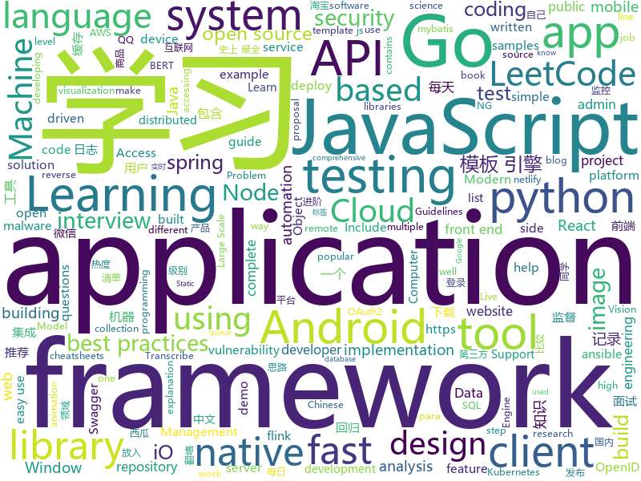

# 2019-08-21
See what the GitHub community is most excited about today.

## python
* [system-design-primer](https://github.com/donnemartin/system-design-primer)(**130 stars today**): Learn how to design large-scale systems. Prep for the system design interview. Includes Anki flashcards.
* [numpy-ml](https://github.com/ddbourgin/numpy-ml)(**60 stars today**): Machine learning, in numpy
* [wifiphisher](https://github.com/wifiphisher/wifiphisher)(**41 stars today**): The Rogue Access Point Framework
* [CppCoreGuidelines](https://github.com/isocpp/CppCoreGuidelines)(**14 stars today**): The C++ Core Guidelines are a set of tried-and-true guidelines, rules, and best practices about coding in C++
* [RAdam](https://github.com/LiyuanLucasLiu/RAdam)(**70 stars today**): On The Variance Of The Adaptive Learning Rate And Beyond
* [ImageAI](https://github.com/OlafenwaMoses/ImageAI)(**15 stars today**): A python library built to empower developers to build applications and systems with self-contained Computer Vision capabilities
* [bert](https://github.com/google-research/bert)(**26 stars today**): TensorFlow code and pre-trained models for BERT
* [DeepFaceLab](https://github.com/iperov/DeepFaceLab)(**58 stars today**): DeepFaceLab is a tool that utilizes machine learning to replace faces in videos. Includes prebuilt ready to work standalone Windows 7,8,10 binary (look readme.md).
* [pocsuite3](https://github.com/knownsec/pocsuite3)(**15 stars today**): pocsuite3 is an open-sourced remote vulnerability testing framework developed by the Knownsec 404 Team.
* [robotframework](https://github.com/robotframework/robotframework)(**3 stars today**): Generic automation framework for acceptance testing and RPA
* [mitogen](https://github.com/dw/mitogen)(**8 stars today**): Distributed self-replicating programs in Python
* [Chinese-BERT-wwm](https://github.com/ymcui/Chinese-BERT-wwm)(**18 stars today**): Pre-Training with Whole Word Masking for Chinese BERT（中文BERT-wwm预训练模型）
* [hue](https://github.com/cloudera/hue)(**4 stars today**): Hue is an open source SQL Cloud Assistant for developing and accessing SQL/Data Apps.
* [androguard](https://github.com/androguard/androguard)(**10 stars today**): Reverse engineering, Malware and goodware analysis of Android applications ... and more (ninja !)
* [scrapy](https://github.com/scrapy/scrapy)(**20 stars today**): Scrapy, a fast high-level web crawling & scraping framework for Python.
* [pytorch-CycleGAN-and-pix2pix](https://github.com/junyanz/pytorch-CycleGAN-and-pix2pix)(**13 stars today**): Image-to-Image Translation in PyTorch
* [models](https://github.com/tensorflow/models)(**52 stars today**): Models and examples built with TensorFlow
* [marshmallow](https://github.com/marshmallow-code/marshmallow)(**7 stars today**): A lightweight library for converting complex objects to and from simple Python datatypes.
* [ansible](https://github.com/ansible/ansible)(**17 stars today**): Ansible is a radically simple IT automation platform that makes your applications and systems easier to deploy. Avoid writing scripts or custom code to deploy and update your applications — automate in a language that approaches plain English, using SSH, with no agents to install on remote systems. https://docs.ansible.com/ansible/
* [XLM](https://github.com/facebookresearch/XLM)(**52 stars today**): PyTorch original implementation of Cross-lingual Language Model Pretraining.
* [examples-of-web-crawlers](https://github.com/shengqiangzhang/examples-of-web-crawlers)(**94 stars today**): 一些有趣的python爬虫例子,对新手比较友好,主要爬取淘宝、天猫、微信、豆瓣、QQ等网站。(Some interesting examples of python crawlers that are friendly to beginners. )
* [FoveaBox](https://github.com/taokong/FoveaBox)(**14 stars today**): FoveaBox: Beyond Anchor-based Object Detector
* [theZoo](https://github.com/ytisf/theZoo)(**4 stars today**): A repository of LIVE malwares for your own joy and pleasure. theZoo is a project created to make the possibility of malware analysis open and available to the public.
* [talos](https://github.com/autonomio/talos)(**6 stars today**): Hyperparameter Optimization for Keras Models
* [aws-sam-cli](https://github.com/awslabs/aws-sam-cli)(**6 stars today**): CLI tool to build, test, debug, and deploy Serverless applications using AWS SAM

## java
* [live-transcribe-speech-engine](https://github.com/google/live-transcribe-speech-engine)(**113 stars today**): Live Transcribe is an Android application that provides real-time captioning for people who are deaf or hard of hearing. This repository contains the Android client libraries for communicating with Google's Cloud Speech API that are used in Live Transcribe.
* [LeetCodeAnimation](https://github.com/MisterBooo/LeetCodeAnimation)(**262 stars today**): Demonstrate all the questions on LeetCode in the form of animation.（用动画的形式呈现解LeetCode题目的思路）
* [JustAuth](https://github.com/justauth/JustAuth)(**279 stars today**): 💯史上最全的整合第三方登录的开源库。目前已支持Github、Gitee、微博、钉钉、百度、Coding、腾讯云开发者平台、OSChina、支付宝、QQ、微信、淘宝、Google、Facebook、抖音、领英、小米、微软、今日头条、Teambition、StackOverflow、Pinterest、人人、华为和企业微信等第三方平台的授权登录。 Login, so easy!
* [spring-boot-demo](https://github.com/xkcoding/spring-boot-demo)(**421 stars today**): spring boot demo 是一个用来学习 spring boot 的项目，总共包含 57 个集成demo，已经完成 47 个。包含集成 actuator(监控)、admin(可视化监控)、logback(日志)、aopLog(通过AOP记录web请求日志)、统一异常处理(json级别和页面级别)、freemarker(模板引擎)、thymeleaf(模板引擎)、Beetl(模板引擎)、Enjoy(模板引擎)、JdbcTemplate、JPA(ORM框架)、mybatis(ORM框架)、通用Mapper、PageHelper、mybatis-plus、BeetlSQL、upload(本地文件上传和七牛云文件上传)、redis(缓存)、ehcache(缓存)、email(发送各种类…
* [animation](https://github.com/android/animation)(**43 stars today**): Multiple samples showing the best practices in animation on Android.
* [flink-recommandSystem-demo](https://github.com/CheckChe0803/flink-recommandSystem-demo)(**58 stars today**): 🚁🚀基于Flink实现的商品实时推荐系统。flink统计商品热度，放入redis缓存，分析日志信息，将画像标签和实时记录放入Hbase。在用户发起推荐请求后，根据用户画像重排序热度榜，并结合协同过滤和标签两个推荐模块为新生成的榜单的每一个产品添加关联产品，最后返回新的用户列表。
* [kubernetes-client](https://github.com/fabric8io/kubernetes-client)(**2 stars today**): Java client for Kubernetes & OpenShift
* [chucker](https://github.com/ChuckerTeam/chucker)(**6 stars today**): 🔎An HTTP inspector for Android & OkHTTP (like Charles but on device) - More Chucker than Chuck
* [mockito](https://github.com/mockito/mockito)(**9 stars today**): Most popular Mocking framework for unit tests written in Java
* [incubator-shardingsphere](https://github.com/apache/incubator-shardingsphere)(**13 stars today**): Distributed database middleware
* [seata](https://github.com/seata/seata)(**27 stars today**): 🔥Seata is an easy-to-use, high-performance, open source distributed transaction solution.
* [android-testing](https://github.com/googlesamples/android-testing)(**1 stars today**): A collection of samples demonstrating different frameworks and techniques for automated testing
* [advanced-java](https://github.com/doocs/advanced-java)(**79 stars today**): 😮互联网 Java 工程师进阶知识完全扫盲：涵盖高并发、分布式、高可用、微服务等领域知识，后端同学必看，前端同学也可学习
* [spring-framework](https://github.com/spring-projects/spring-framework)(**38 stars today**): Spring Framework
* [spring-security-oauth](https://github.com/spring-projects/spring-security-oauth)(**3 stars today**): Support for adding OAuth1(a) and OAuth2 features (consumer and provider) for Spring web applications.
* [Matisse](https://github.com/zhihu/Matisse)(**8 stars today**): 🎆A well-designed local image and video selector for Android
* [constellation](https://github.com/constellation-app/constellation)(**2 stars today**): A graph-focused data visualisation and interactive analysis application.
* [elasticsearch](https://github.com/elastic/elasticsearch)(**28 stars today**): Open Source, Distributed, RESTful Search Engine
* [react-native-image-picker](https://github.com/react-native-community/react-native-image-picker)(**6 stars today**): 🌄A React Native module that allows you to use native UI to select media from the device library or directly from the camera.
* [hibernate-orm](https://github.com/hibernate/hibernate-orm)(**4 stars today**): Hibernate's core Object/Relational Mapping functionality
* [nacos](https://github.com/alibaba/nacos)(**20 stars today**): an easy-to-use dynamic service discovery, configuration and service management platform for building cloud native applications.
* [flink-learning](https://github.com/zhisheng17/flink-learning)(**20 stars today**): flink learning blog. http://www.54tianzhisheng.cn
* [fastdfs-client-java](https://github.com/happyfish100/fastdfs-client-java)(**8 stars today**): FastDFS java client SDK
* [FloatingActionButton](https://github.com/Clans/FloatingActionButton)(**3 stars today**): Android Floating Action Button based on Material Design specification
* [keycloak](https://github.com/keycloak/keycloak)(**10 stars today**): Open Source Identity and Access Management For Modern Applications and Services

## unknown
* [awesome-scalability](https://github.com/binhnguyennus/awesome-scalability)(**91 stars today**): The Patterns of Scalable, Reliable, and Performant Large-Scale Systems
* [books](https://github.com/programthink/books)(**84 stars today**): 【编程随想】收藏的电子书清单（多个学科，含下载链接）
* [javascript-testing-best-practices](https://github.com/goldbergyoni/javascript-testing-best-practices)(**333 stars today**): 📗🌐🚢Comprehensive and exhaustive JavaScript & Node.js testing best practices (August 2019)
* [You-Dont-Know-JS](https://github.com/getify/You-Dont-Know-JS)(**76 stars today**): A book series on JavaScript. @YDKJS on twitter.
* [design-patterns-for-humans](https://github.com/kamranahmedse/design-patterns-for-humans)(**9 stars today**): An ultra-simplified explanation to design patterns
* [leetcode](https://github.com/grandyang/leetcode)(**11 stars today**): Provide all my solutions and explanations in Chinese for all the Leetcode coding problems.
* [awesome-hyper-v-exploitation](https://github.com/shogunlab/awesome-hyper-v-exploitation)(**18 stars today**): A curated list of Hyper-V exploitation resources, fuzzing and vulnerability research.
* [Machine-learning-learning-notes](https://github.com/Vay-keen/Machine-learning-learning-notes)(**43 stars today**): 周志华《机器学习》又称西瓜书是一本较为全面的书籍，书中详细介绍了机器学习领域不同类型的算法(例如：监督学习、无监督学习、半监督学习、强化学习、集成降维、特征选择等)，记录了本人在学习过程中的理解思路与扩展知识点，希望对新人阅读西瓜书有所帮助！
* [Index](https://github.com/HowProgrammingWorks/Index)(**4 stars today**): Repositories Index
* [stanford-cs-229-machine-learning](https://github.com/afshinea/stanford-cs-229-machine-learning)(**33 stars today**): VIP cheatsheets for Stanford's CS 229 Machine Learning
* [Specs](https://github.com/CocoaPods/Specs)(**3 stars today**): The CocoaPods Master Repo
* [wg](https://github.com/rust-gamedev/wg)(**2 stars today**): Coordination repository of the Game Development Working Group
* [kexueshangwang](https://github.com/xiaoming2028/kexueshangwang)(**4 stars today**): 翻墙-科学上网 史上最全教程
* [weekly](https://github.com/ruanyf/weekly)(**30 stars today**): 科技爱好者周刊，每周五发布
* [petition](https://github.com/otvorete/petition)(**10 stars today**): ПОКАЖЕТЕ НИ КОДА!
* [deep-learning-drizzle](https://github.com/kmario23/deep-learning-drizzle)(**29 stars today**): Drench yourself in Deep Learning, Reinforcement Learning, Machine Learning, Computer Vision, and NLP by learning from these exciting lectures!!
* [coding-interview-university](https://github.com/jwasham/coding-interview-university)(**128 stars today**): A complete computer science study plan to become a software engineer.
* [OI-wiki](https://github.com/OI-wiki/OI-wiki)(**11 stars today**): 🌟Wiki for OI / ICPC. （某大型游戏线上攻略，内含炫酷算术魔法）
* [30-seconds-zh_CN](https://github.com/b3log/30-seconds-zh_CN)(**46 stars today**): 📙前端知识精选集，包含 HTML、CSS、JavaScript、React、Node、安全等方面，每天仅需 30 秒。
* [scientific-visualization-book](https://github.com/rougier/scientific-visualization-book)(**15 stars today**): An open access book on scientific visualization using python and matplotlib
* [vagas](https://github.com/frontendbr/vagas)(**8 stars today**): 🔬Espaço para divulgação de vagas para front-enders.
* [git-for-win](https://github.com/waylau/git-for-win)(**6 stars today**): Git for Windows. 国内直接从官网下载比较困难，需要翻墙。这里提供一个国内的下载站，方便网友下载
* [article](https://github.com/ChenChunCamus/article)(**3 stars today**): 
* [swift-style-guide](https://github.com/raywenderlich/swift-style-guide)(**4 stars today**): The official Swift style guide for raywenderlich.com.
* [new-grads-2020](https://github.com/cmackenzie1/new-grads-2020)(**30 stars today**): A collection of new grad roles for 2020

## javascript
* [UnblockNeteaseMusic](https://github.com/nondanee/UnblockNeteaseMusic)(**189 stars today**): Revive unavailable songs for Netease Cloud Music
* [tech-interview-handbook](https://github.com/yangshun/tech-interview-handbook)(**453 stars today**): 💯Materials to help you rock your next coding interview
* [fe-interview](https://github.com/haizlin/fe-interview)(**169 stars today**): 前端面试每日 3+1，以面试题来驱动学习，提倡每日学习与思考，每天进步一点！每天早上5点纯手工发布面试题（死磕自己，愉悦大家）
* [front-end-interview-handbook](https://github.com/yangshun/front-end-interview-handbook)(**83 stars today**): 🕸Almost complete answers to "Front-end Job Interview Questions" which you can use to interview potential candidates, test yourself or completely ignore
* [react-table](https://github.com/tannerlinsley/react-table)(**21 stars today**): ⚛️Hooks for building fast and extendable tables and datagrids for React
* [acorn](https://github.com/acornjs/acorn)(**21 stars today**): A small, fast, JavaScript-based JavaScript parser
* [api-platform](https://github.com/api-platform/api-platform)(**21 stars today**): REST and GraphQL framework to build modern API-driven projects (server-side and client-side)
* [slick](https://github.com/kenwheeler/slick)(**15 stars today**): the last carousel you'll ever need
* [react](https://github.com/facebook/react)(**84 stars today**): A declarative, efficient, and flexible JavaScript library for building user interfaces.
* [react-native](https://github.com/facebook/react-native)(**53 stars today**): A framework for building native apps with React.
* [500lines](https://github.com/aosabook/500lines)(**24 stars today**): 500 Lines or Less
* [puppeteer](https://github.com/GoogleChrome/puppeteer)(**33 stars today**): Headless Chrome Node API
* [xiangxuema](https://github.com/xland/xiangxuema)(**35 stars today**): “想学吗”个人知识管理与自媒体营销工具
* [luban-h5](https://github.com/ly525/luban-h5)(**39 stars today**): en: A mobile page builder/editor, similar with amolink. zh: 类似易企秀的H5制作、建站工具.
* [leetcode](https://github.com/azl397985856/leetcode)(**72 stars today**): LeetCode Solutions: A Record of My Problem Solving Journey.( leetcode题解，记录自己的leetcode解题之路。)
* [zoid](https://github.com/krakenjs/zoid)(**23 stars today**): Cross domain components
* [front-end-interview](https://github.com/xiaomuzhu/front-end-interview)(**85 stars today**): A list of interview for front-end developer(前端开发者面试清单)
* [awesome-cheatsheets](https://github.com/LeCoupa/awesome-cheatsheets)(**17 stars today**): 👩‍💻👨‍💻Awesome cheatsheets for popular programming languages, frameworks and development tools. They include everything you should know in one single file.
* [nodebestpractices](https://github.com/goldbergyoni/nodebestpractices)(**50 stars today**): ✅The largest Node.js best practices list (July 2019)
* [kibana](https://github.com/elastic/kibana)(**10 stars today**): Your window into the Elastic Stack
* [samples](https://github.com/webrtc/samples)(**16 stars today**): WebRTC Web demos and samples
* [ccxt](https://github.com/ccxt/ccxt)(**40 stars today**): A JavaScript / Python / PHP cryptocurrency trading API with support for more than 120 bitcoin/altcoin exchanges
* [appium](https://github.com/appium/appium)(**19 stars today**): 📱Automation for iOS, Android, and Windows Apps.
* [Detox](https://github.com/wix/Detox)(**12 stars today**): Gray box end-to-end testing and automation framework for mobile apps
* [react-native-firebase](https://github.com/invertase/react-native-firebase)(**42 stars today**): 🔥A well tested feature rich modular Firebase implementation for React Native. Supports both iOS & Android platforms for over 20 Firebase services.

## html
* [blackeye](https://github.com/thelinuxchoice/blackeye)(**45 stars today**): The most complete Phishing Tool, with 32 templates +1 customizable
* [fastText](https://github.com/facebookresearch/fastText)(**14 stars today**): Library for fast text representation and classification.
* [kubernetes-failure-stories](https://github.com/hjacobs/kubernetes-failure-stories)(**3 stars today**): Compilation of public failure/horror stories related to Kubernetes
* [mxgraph](https://github.com/jgraph/mxgraph)(**3 stars today**): mxGraph is a fully client side JavaScript diagramming library
* [blog](https://github.com/biaochenxuying/blog)(**15 stars today**): 技术为主，读书笔记、随笔、理财为辅，做个终身学习者。
* [cypress-example-kitchensink](https://github.com/cypress-io/cypress-example-kitchensink)(**0 stars today**): This is an example app used to showcase Cypress.io testing.
* [owasp-mstg](https://github.com/OWASP/owasp-mstg)(**3 stars today**): The Mobile Security Testing Guide (MSTG) is a comprehensive manual for mobile app security development, testing and reverse engineering.
* [aws-well-architected-labs](https://github.com/awslabs/aws-well-architected-labs)(**3 stars today**): Hands on labs and code to help you learn, measure, and build using architectural best practices.
* [zh.javascript.info](https://github.com/javascript-tutorial/zh.javascript.info)(**9 stars today**): Modern JavaScript Tutorial
* [Screenshot-to-code](https://github.com/emilwallner/Screenshot-to-code)(**10 stars today**): A neural network that transforms a design mock-up into a static website.
* [canijailbreak.com](https://github.com/cj123/canijailbreak.com)(**0 stars today**): a website which tells you whether you can jailbreak your iOS device.
* [ng-alain](https://github.com/ng-alain/ng-alain)(**6 stars today**): NG-ZORRO admin panel front-end framework (netlify mirror https://netlify.ng-alain.com/)
* [swagger-codegen](https://github.com/swagger-api/swagger-codegen)(**7 stars today**): swagger-codegen contains a template-driven engine to generate documentation, API clients and server stubs in different languages by parsing your OpenAPI / Swagger definition.
* [datasciencecoursera](https://github.com/mGalarnyk/datasciencecoursera)(**2 stars today**): Data Science Repo and blog for John Hopkins Coursera Courses. Please let me know if you have any questions.
* [intro.js](https://github.com/usablica/intro.js)(**5 stars today**): A better way for new feature introduction and step-by-step users guide for your website and project.
* [500LineorLess_CN](https://github.com/HT524/500LineorLess_CN)(**12 stars today**): 500 line or less 中文翻译计划。
* [proposal-nullish-coalescing](https://github.com/tc39/proposal-nullish-coalescing)(**6 stars today**): Nullish coalescing proposal x ?? y
* [fluxion](https://github.com/FluxionNetwork/fluxion)(**5 stars today**): Fluxion is a remake of linset by vk496 with less bugs and enhanced functionality.
* [Java-Interview-Advanced](https://github.com/shishan100/Java-Interview-Advanced)(**9 stars today**): 中华石杉--互联网Java进阶面试训练营
* [imglab](https://github.com/NaturalIntelligence/imglab)(**3 stars today**): To speedup and simplify image labeling/ annotation process with multiple supported formats.
* [InOneWeekend](https://github.com/RayTracing/InOneWeekend)(**2 stars today**): The source for the ebook Ray Tracing in One Weekend by Peter Shirley. This work is in the public domain.
* [school-management-system](https://github.com/hrshadhin/school-management-system)(**0 stars today**): Another School Management System http://sms.hrshadhin.me
* [SB-Admin-BS4-Angular-8](https://github.com/start-angular/SB-Admin-BS4-Angular-8)(**0 stars today**): Simple Dashboard Admin App built using Angular 8 and Bootstrap 4
* [proposal-top-level-await](https://github.com/tc39/proposal-top-level-await)(**0 stars today**): top-level `await` proposal for ECMAScript (stage 3)
* [Machine-Learning](https://github.com/Jack-Cherish/Machine-Learning)(**3 stars today**): ⚡️机器学习实战（Python3）：kNN、决策树、贝叶斯、逻辑回归、SVM、线性回归、树回归

## go
* [sampler](https://github.com/sqshq/sampler)(**224 stars today**): A tool for shell commands execution, visualization and alerting. Configured with a simple YAML file.
* [learn-go-with-tests](https://github.com/quii/learn-go-with-tests)(**321 stars today**): Learn Go with test-driven development
* [go-filecoin](https://github.com/filecoin-project/go-filecoin)(**5 stars today**): Filecoin Full Node Implementation in Go
* [dive](https://github.com/wagoodman/dive)(**18 stars today**): A tool for exploring each layer in a docker image
* [the-way-to-go_ZH_CN](https://github.com/unknwon/the-way-to-go_ZH_CN)(**65 stars today**): 《The Way to Go》中文译本，中文正式名《Go 入门指南》
* [clair](https://github.com/coreos/clair)(**11 stars today**): Vulnerability Static Analysis for Containers
* [elastic](https://github.com/olivere/elastic)(**6 stars today**): Elasticsearch client for Go.
* [distri](https://github.com/distr1/distri)(**33 stars today**): a Linux distribution to research fast package management
* [kops](https://github.com/kubernetes/kops)(**10 stars today**): Kubernetes Operations (kops) - Production Grade K8s Installation, Upgrades, and Management
* [node_exporter](https://github.com/prometheus/node_exporter)(**10 stars today**): Exporter for machine metrics
* [v](https://github.com/vlang/v)(**30 stars today**): Simple, fast, safe, compiled language for developing maintainable software. Supports translation from C and (soon) C++. Compiles itself in <1s. https://vlang.io
* [velero](https://github.com/heptio/velero)(**18 stars today**): Backup and migrate Kubernetes applications and their persistent volumes
* [ReverseProxy](https://github.com/ilanyu/ReverseProxy)(**8 stars today**): ReverseProxy in golang
* [sqlx](https://github.com/jmoiron/sqlx)(**7 stars today**): general purpose extensions to golang's database/sql
* [chaosblade](https://github.com/chaosblade-io/chaosblade)(**13 stars today**): An easy to use and powerful chaos engineering experiment toolkit.（阿里巴巴开源的一款简单易用、功能强大的混沌实验注入工具）
* [go-swagger](https://github.com/go-swagger/go-swagger)(**10 stars today**): Swagger 2.0 implementation for go
* [k3sup](https://github.com/alexellis/k3sup)(**45 stars today**): k3sup: from Zero to KUBECONFIG in < 1 min
* [slack](https://github.com/nlopes/slack)(**5 stars today**): Slack API in Go
* [go](https://github.com/golang/go)(**46 stars today**): The Go programming language
* [concourse](https://github.com/concourse/concourse)(**9 stars today**): Concourse is a container-based continuous thing-doer written in Go and Elm.
* [machinery](https://github.com/RichardKnop/machinery)(**7 stars today**): Machinery is an asynchronous task queue/job queue based on distributed message passing.
* [aws-lambda-go](https://github.com/aws/aws-lambda-go)(**5 stars today**): Libraries, samples and tools to help Go developers develop AWS Lambda functions.
* [hydra](https://github.com/ory/hydra)(**13 stars today**): OpenID Certified™ OpenID Connect & OAuth2 Server (OP, OpenID Provider) - cloud native, security-first, open source API security for your infrastructure. Written in Go. SDKs for any language.
* [gosec](https://github.com/securego/gosec)(**5 stars today**): Golang security checker
* [go-github](https://github.com/google/go-github)(**7 stars today**): Go library for accessing the GitHub API

## WordCloud

