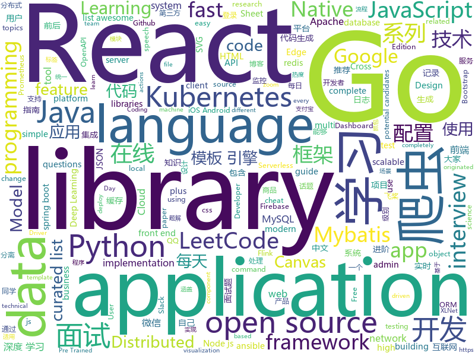

# 2019-08-23
See what the GitHub community is most excited about today.

## python
* [Real-Time-Voice-Cloning](https://github.com/CorentinJ/Real-Time-Voice-Cloning)(**386 stars today**): Clone a voice in 5 seconds to generate arbitrary speech in real-time
* [gpt-2](https://github.com/openai/gpt-2)(**55 stars today**): Code for the paper "Language Models are Unsupervised Multitask Learners"
* [A-Light-and-Fast-Face-Detector-for-Edge-Devices](https://github.com/YonghaoHe/A-Light-and-Fast-Face-Detector-for-Edge-Devices)(**50 stars today**): a light and fast face detector for edge devices
* [kubernetes-workshop](https://github.com/eon01/kubernetes-workshop)(**90 stars today**): ⚙️A Gentle introduction to Kubernetes with more than just the basics.🌟Give it a star if you like it.
* [Chinese-PreTrained-XLNet](https://github.com/ymcui/Chinese-PreTrained-XLNet)(**17 stars today**): Pre-Trained Chinese XLNet（中文XLNet预训练模型）
* [ShuffleNet-Series](https://github.com/megvii-model/ShuffleNet-Series)(**30 stars today**): 
* [ansible](https://github.com/ansible/ansible)(**27 stars today**): Ansible is a radically simple IT automation platform that makes your applications and systems easier to deploy. Avoid writing scripts or custom code to deploy and update your applications — automate in a language that approaches plain English, using SSH, with no agents to install on remote systems. https://docs.ansible.com/ansible/
* [compose](https://github.com/docker/compose)(**16 stars today**): Define and run multi-container applications with Docker
* [numpy-ml](https://github.com/ddbourgin/numpy-ml)(**15 stars today**): Machine learning, in numpy
* [django-rest-framework](https://github.com/encode/django-rest-framework)(**20 stars today**): Web APIs for Django.⚡️
* [Concert_Ticket](https://github.com/Oliver0047/Concert_Ticket)(**5 stars today**): 大麦网演唱会抢票程序
* [waveglow](https://github.com/NVIDIA/waveglow)(**10 stars today**): A Flow-based Generative Network for Speech Synthesis
* [scrapy](https://github.com/scrapy/scrapy)(**24 stars today**): Scrapy, a fast high-level web crawling & scraping framework for Python.
* [celery](https://github.com/celery/celery)(**9 stars today**): Distributed Task Queue (development branch)
* [serverless-application-model](https://github.com/awslabs/serverless-application-model)(**11 stars today**): AWS Serverless Application Model (SAM) is an open-source framework for building serverless applications
* [fastapi](https://github.com/tiangolo/fastapi)(**27 stars today**): FastAPI framework, high performance, easy to learn, fast to code, ready for production
* [paramiko](https://github.com/paramiko/paramiko)(**11 stars today**): The leading native Python SSHv2 protocol library.
* [dagster](https://github.com/dagster-io/dagster)(**15 stars today**): Dagster is an open-source Python library for building data applications.
* [models](https://github.com/PaddlePaddle/models)(**11 stars today**): Pre-trained and Reproduced Deep Learning Models （『飞桨』官方模型库，包含多种学术前沿和工业场景验证的深度学习模型）
* [netmiko](https://github.com/ktbyers/netmiko)(**11 stars today**): Multi-vendor library to simplify Paramiko SSH connections to network devices
* [XLM](https://github.com/facebookresearch/XLM)(**29 stars today**): PyTorch original implementation of Cross-lingual Language Model Pretraining.
* [Detectron](https://github.com/facebookresearch/Detectron)(**15 stars today**): FAIR's research platform for object detection research, implementing popular algorithms like Mask R-CNN and RetinaNet.
* [keras](https://github.com/keras-team/keras)(**24 stars today**): Deep Learning for humans
* [learn_python3_spider](https://github.com/wistbean/learn_python3_spider)(**15 stars today**): python爬虫教程系列、从0到1学习python爬虫，包括浏览器抓包，手机APP抓包，如 fiddler、mitmproxy，各种爬虫涉及的模块的使用，如：requests、beautifulSoup、selenium、appium、scrapy等，以及IP代理，验证码识别，Mysql，MongoDB数据库的python使用，多线程多进程爬虫的使用，css 爬虫加密逆向破解，JS爬虫逆向，爬虫项目实战实例等
* [marshmallow](https://github.com/marshmallow-code/marshmallow)(**10 stars today**): A lightweight library for converting complex objects to and from simple Python datatypes.

## java
* [LeetCodeAnimation](https://github.com/MisterBooo/LeetCodeAnimation)(**254 stars today**): Demonstrate all the questions on LeetCode in the form of animation.（用动画的形式呈现解LeetCode题目的思路）
* [JustAuth](https://github.com/justauth/JustAuth)(**377 stars today**): 💯史上最全的整合第三方登录的开源库。目前已支持Github、Gitee、微博、钉钉、百度、Coding、腾讯云开发者平台、OSChina、支付宝、QQ、微信、淘宝、Google、Facebook、抖音、领英、小米、微软、今日头条、Teambition、StackOverflow、Pinterest、人人、华为和企业微信等第三方平台的授权登录。 Login, so easy!
* [advanced-java](https://github.com/doocs/advanced-java)(**84 stars today**): 😮互联网 Java 工程师进阶知识完全扫盲：涵盖高并发、分布式、高可用、微服务等领域知识，后端同学必看，前端同学也可学习
* [apollo](https://github.com/ctripcorp/apollo)(**30 stars today**): Apollo（阿波罗）是携程框架部门研发的分布式配置中心，能够集中化管理应用不同环境、不同集群的配置，配置修改后能够实时推送到应用端，并且具备规范的权限、流程治理等特性，适用于微服务配置管理场景。
* [CS-Notes](https://github.com/CyC2018/CS-Notes)(**100 stars today**): 📚Tech Interview Guide 技术面试必备基础知识、Leetcode 题解、Java、C++、Python、后端面试、操作系统、计算机网络、系统设计
* [tutorials](https://github.com/eugenp/tutorials)(**20 stars today**): The "REST With Spring" Course:
* [JavaGuide](https://github.com/Snailclimb/JavaGuide)(**100 stars today**): 【Java学习+面试指南】 一份涵盖大部分Java程序员所需要掌握的核心知识。
* [holer](https://github.com/wisdom-projects/holer)(**12 stars today**): Holer exposes local servers behind NATs and firewalls to the public internet over secure tunnels.
* [cim](https://github.com/crossoverJie/cim)(**16 stars today**): 📲cim(cross IM) 适用于开发者的即时通讯系统
* [bazel](https://github.com/bazelbuild/bazel)(**8 stars today**): a fast, scalable, multi-language and extensible build system
* [flink-recommandSystem-demo](https://github.com/CheckChe0803/flink-recommandSystem-demo)(**58 stars today**): 🚁🚀基于Flink实现的商品实时推荐系统。flink统计商品热度，放入redis缓存，分析日志信息，将画像标签和实时记录放入Hbase。在用户发起推荐请求后，根据用户画像重排序热度榜，并结合协同过滤和标签两个推荐模块为新生成的榜单的每一个产品添加关联产品，最后返回新的用户列表。
* [storm](https://github.com/apache/storm)(**2 stars today**): Mirror of Apache Storm
* [jeecg-boot](https://github.com/zhangdaiscott/jeecg-boot)(**41 stars today**): 一款基于代码生成器的JAVA快速开发平台！采用最新技术，前后端分离架构：SpringBoot 2.x，Ant Design&Vue，Mybatis，Shiro，JWT。强大的代码生成器让前后端代码一键生成，无需写任何代码，绝对是全栈开发福音！！ JeecgBoot的宗旨是提高UI能力的同时,降低前后分离的开发成本，JeecgBoot还独创在线开发模式，No代码概念，一系列在线智能开发：在线配置表单、在线配置报表、在线设计流程等等。
* [pulsar](https://github.com/apache/pulsar)(**13 stars today**): Apache Pulsar - distributed pub-sub messaging system
* [lucene-solr](https://github.com/apache/lucene-solr)(**4 stars today**): Mirror of Apache Lucene + Solr
* [spring-analysis](https://github.com/seaswalker/spring-analysis)(**34 stars today**): Spring源码阅读
* [guava](https://github.com/google/guava)(**17 stars today**): Google core libraries for Java
* [calcite](https://github.com/apache/calcite)(**4 stars today**): Mirror of Apache Calcite
* [kubernetes-client](https://github.com/fabric8io/kubernetes-client)(**3 stars today**): Java client for Kubernetes & OpenShift
* [wiremock](https://github.com/tomakehurst/wiremock)(**6 stars today**): A tool for mocking HTTP services
* [resilience4j](https://github.com/resilience4j/resilience4j)(**10 stars today**): Resilience4j is a fault tolerance library designed for Java8 and functional programming
* [spring-boot-plus](https://github.com/geekidea/spring-boot-plus)(**14 stars today**): 🔥spring-boot-plus集成Spring Boot 2.1.7,Mybatis,Mybatis Plus,Druid,FastJson,Redis,Rabbit MQ,Kafka等，可使用代码生成器快速开发项目🚀
* [Sentinel](https://github.com/alibaba/Sentinel)(**15 stars today**): A lightweight powerful flow control component enabling reliability and monitoring for microservices. (轻量级的流量控制、熔断降级 Java 库)
* [Mindustry](https://github.com/Anuken/Mindustry)(**6 stars today**): A sandbox tower defense game
* [spring-boot-demo](https://github.com/xkcoding/spring-boot-demo)(**229 stars today**): spring boot demo 是一个用来学习 spring boot 的项目，总共包含 57 个集成demo，已经完成 47 个。包含集成 actuator(监控)、admin(可视化监控)、logback(日志)、aopLog(通过AOP记录web请求日志)、统一异常处理(json级别和页面级别)、freemarker(模板引擎)、thymeleaf(模板引擎)、Beetl(模板引擎)、Enjoy(模板引擎)、JdbcTemplate、JPA(ORM框架)、mybatis(ORM框架)、通用Mapper、PageHelper、mybatis-plus、BeetlSQL、upload(本地文件上传和七牛云文件上传)、redis(缓存)、ehcache(缓存)、email(发送各种类…

## unknown
* [google-cloud-4-words](https://github.com/gregsramblings/google-cloud-4-words)(**85 stars today**): The Google Cloud Developer's Cheat Sheet
* [free-books](https://github.com/ruanyf/free-books)(**482 stars today**): 互联网上的免费书籍
* [awesome-actions](https://github.com/sdras/awesome-actions)(**38 stars today**): A curated list of awesome actions to use on GitHub
* [docs](https://github.com/laravel/docs)(**2 stars today**): 
* [awesome-scalability](https://github.com/binhnguyennus/awesome-scalability)(**17 stars today**): The Patterns of Scalable, Reliable, and Performant Large-Scale Systems
* [industry-machine-learning](https://github.com/firmai/industry-machine-learning)(**104 stars today**): A curated list of applied machine learning and data science notebooks and libraries across different industries.
* [starter-workflows](https://github.com/actions/starter-workflows)(**12 stars today**): Accelerating new GitHub Actions workflows
* [awesome-coding-js](https://github.com/ConardLi/awesome-coding-js)(**39 stars today**): 用JavaScript实现的算法和数据结构，附详细解释和刷题指南
* [Deep-Learning-Interview-Book](https://github.com/amusi/Deep-Learning-Interview-Book)(**5 stars today**): 深度学习面试宝典（含数学、机器学习、深度学习、计算机视觉、自然语言处理和SLAM等方向）
* [business-machine-learning](https://github.com/firmai/business-machine-learning)(**9 stars today**): A curated list of practical business machine learning (BML) and business data science (BDS) applications for Accounting, Customer, Employee, Legal, Management and Operations.
* [linux-network-performance-parameters](https://github.com/leandromoreira/linux-network-performance-parameters)(**8 stars today**): Learn where some of the network sysctl variables fit into the Linux/Kernel network flow
* [gitignore](https://github.com/github/gitignore)(**85 stars today**): A collection of useful .gitignore templates
* [awesome-point-cloud-analysis](https://github.com/Yochengliu/awesome-point-cloud-analysis)(**8 stars today**): A list of papers and datasets about point cloud analysis (processing)
* [OpenAPI-Specification](https://github.com/OAI/OpenAPI-Specification)(**8 stars today**): The OpenAPI Specification Repository
* [awesome-for-beginners](https://github.com/MunGell/awesome-for-beginners)(**20 stars today**): A list of awesome beginners-friendly projects.
* [the-art-of-command-line](https://github.com/jlevy/the-art-of-command-line)(**39 stars today**): Master the command line, in one page
* [Awesome-Crowd-Counting](https://github.com/gjy3035/Awesome-Crowd-Counting)(**3 stars today**): Awesome Crowd Counting
* [Flutter-Course-Resources](https://github.com/londonappbrewery/Flutter-Course-Resources)(**1 stars today**): 
* [architect-awesome](https://github.com/xingshaocheng/architect-awesome)(**37 stars today**): 后端架构师技术图谱
* [datasharing](https://github.com/jtleek/datasharing)(**0 stars today**): The Leek group guide to data sharing
* [Blog](https://github.com/mqyqingfeng/Blog)(**18 stars today**): 冴羽写博客的地方，预计写四个系列：JavaScript深入系列、JavaScript专题系列、ES6系列、React系列。
* [modern-cpp-features](https://github.com/AnthonyCalandra/modern-cpp-features)(**10 stars today**): A cheatsheet of modern C++ language and library features.
* [Interview_Question_for_Beginner](https://github.com/JaeYeopHan/Interview_Question_for_Beginner)(**3 stars today**): 👦👧Technical-Interview guidelines written for those who started studying programming. I wish you all the best.👾
* [blog](https://github.com/EDDYCJY/blog)(**1 stars today**): 煎鱼的博客，有点忙。
* [rfcs](https://github.com/vuejs/rfcs)(**8 stars today**): RFCs for substantial changes / feature additions to Vue core

## javascript
* [d3](https://github.com/d3/d3)(**80 stars today**): Bring data to life with SVG, Canvas and HTML.📊📈🎉
* [airframe-react](https://github.com/0wczar/airframe-react)(**177 stars today**): Free Open Source High Quality Dashboard based on Bootstrap 4 & React 16: http://dashboards.webkom.co/react/airframe
* [admin-bro](https://github.com/SoftwareBrothers/admin-bro)(**114 stars today**): AdminBro is an admin panel for apps written in node.js
* [fe-interview](https://github.com/haizlin/fe-interview)(**145 stars today**): 前端面试每日 3+1，以面试题来驱动学习，提倡每日学习与思考，每天进步一点！每天早上5点纯手工发布面试题（死磕自己，愉悦大家）
* [front-end-interview-handbook](https://github.com/yangshun/front-end-interview-handbook)(**60 stars today**): 🕸Almost complete answers to "Front-end Job Interview Questions" which you can use to interview potential candidates, test yourself or completely ignore
* [UnblockNeteaseMusic](https://github.com/nondanee/UnblockNeteaseMusic)(**111 stars today**): Revive unavailable songs for Netease Cloud Music
* [incubator-superset](https://github.com/apache/incubator-superset)(**61 stars today**): Apache Superset (incubating) is a modern, enterprise-ready business intelligence web application
* [js-xlsx](https://github.com/SheetJS/js-xlsx)(**30 stars today**): 📗SheetJS Community Edition -- Spreadsheet Toolkit
* [Daily-Interview-Question](https://github.com/Advanced-Frontend/Daily-Interview-Question)(**47 stars today**): 我是木易杨，公众号「高级前端进阶」作者，每天搞定一道前端大厂面试题，祝大家天天进步，一年后会看到不一样的自己。
* [mapbox-gl-js](https://github.com/mapbox/mapbox-gl-js)(**15 stars today**): Interactive, thoroughly customizable maps in the browser, powered by vector tiles and WebGL
* [Rocket.Chat](https://github.com/RocketChat/Rocket.Chat)(**30 stars today**): The ultimate Free Open Source Solution for team communications.
* [zoid](https://github.com/krakenjs/zoid)(**36 stars today**): Cross domain components
* [faker.js](https://github.com/Marak/faker.js)(**34 stars today**): generate massive amounts of realistic fake data in Node.js and the browser
* [fabric.js](https://github.com/fabricjs/fabric.js)(**20 stars today**): Javascript Canvas Library, SVG-to-Canvas (& canvas-to-SVG) Parser
* [gatsby](https://github.com/gatsbyjs/gatsby)(**28 stars today**): Build blazing fast, modern apps and websites with React
* [taro](https://github.com/NervJS/taro)(**29 stars today**): 多端统一开发框架，支持用 React 的开发方式编写一次代码，生成能运行在微信/百度/支付宝/字节跳动/ QQ 小程序、快应用、H5、React Native 等的应用。 https://taro.jd.com/
* [flv.js](https://github.com/bilibili/flv.js)(**48 stars today**): HTML5 FLV Player
* [tindev](https://github.com/filipedeschamps/tindev)(**7 stars today**): Projeto resultado da Semana OmniStack #8
* [react-native-firebase](https://github.com/invertase/react-native-firebase)(**12 stars today**): 🔥A well tested feature rich modular Firebase implementation for React Native. Supports both iOS & Android platforms for over 20 Firebase services.
* [leetcode](https://github.com/azl397985856/leetcode)(**58 stars today**): LeetCode Solutions: A Record of My Problem Solving Journey.( leetcode题解，记录自己的leetcode解题之路。)
* [complete-intro-to-react-v5](https://github.com/btholt/complete-intro-to-react-v5)(**9 stars today**): The Complete Intro to React, the fifth version
* [Modernizr](https://github.com/Modernizr/Modernizr)(**6 stars today**): Modernizr is a JavaScript library that detects HTML5 and CSS3 features in the user’s browser.
* [appium](https://github.com/appium/appium)(**15 stars today**): 📱Automation for iOS, Android, and Windows Apps.
* [react-big-calendar](https://github.com/intljusticemission/react-big-calendar)(**16 stars today**): gcal/outlook like calendar component
* [react-native](https://github.com/facebook/react-native)(**47 stars today**): A framework for building native apps with React.

## html
* [JSSDK-Demo](https://github.com/Cocos-BCX/JSSDK-Demo)(**9 stars today**): JSSDK Demo
* [book](https://github.com/PaddlePaddle/book)(**3 stars today**): Deep Learning 101 with PaddlePaddle （『飞桨』深度学习框架入门教程）
* [blackeye](https://github.com/thelinuxchoice/blackeye)(**2 stars today**): The most complete Phishing Tool, with 32 templates +1 customizable
* [training-kit](https://github.com/github/training-kit)(**4 stars today**): Open source cheat sheets for Git and GitHub
* [Front-end-Developer-Interview-Questions](https://github.com/h5bp/Front-end-Developer-Interview-Questions)(**16 stars today**): A list of helpful front-end related questions you can use to interview potential candidates, test yourself or completely ignore.
* [Java-Interview-Advanced](https://github.com/shishan100/Java-Interview-Advanced)(**10 stars today**): 中华石杉--互联网Java进阶面试训练营
* [webdevbootcamp](https://github.com/nax3t/webdevbootcamp)(**2 stars today**): All source code for back-end projects from the Web Developer Bootcamp
* [ppts](https://github.com/iv-web/ppts)(**57 stars today**): 团队对外分享ppt
* [MatBlazor](https://github.com/SamProf/MatBlazor)(**2 stars today**): Material Design components for Blazor and Razor Components
* [gentelella](https://github.com/ColorlibHQ/gentelella)(**7 stars today**): Free Bootstrap 3 Admin Template
* [wysiwyg-editor](https://github.com/froala/wysiwyg-editor)(**1 stars today**): The next generation Javascript WYSIWYG HTML Editor.
* [blog](https://github.com/biaochenxuying/blog)(**4 stars today**): 技术为主，读书笔记、随笔、理财为辅，做个终身学习者。
* [DIGITS](https://github.com/NVIDIA/DIGITS)(**2 stars today**): Deep Learning GPU Training System
* [node-interview](https://github.com/ElemeFE/node-interview)(**8 stars today**): How to pass the Node.js interview of ElemeFE.
* [styleguide](https://github.com/google/styleguide)(**16 stars today**): Style guides for Google-originated open-source projects
* [simpl](https://github.com/samdutton/simpl)(**4 stars today**): Simplest possible examples of HTML, CSS and Javascript:
* [docs](https://github.com/knative/docs)(**2 stars today**): User documentation for Knative components
* [swagger-codegen](https://github.com/swagger-api/swagger-codegen)(**11 stars today**): swagger-codegen contains a template-driven engine to generate documentation, API clients and server stubs in different languages by parsing your OpenAPI / Swagger definition.
* [ImportJSON](https://github.com/bradjasper/ImportJSON)(**3 stars today**): Import JSON into Google Sheets, this library adds various ImportJSON functions to your spreadsheet
* [MSEdgeExplainers](https://github.com/MicrosoftEdge/MSEdgeExplainers)(**0 stars today**): Home for explainer documents originated by the Microsoft Edge team
* [awesome-creative-coding](https://github.com/terkelg/awesome-creative-coding)(**6 stars today**): Creative Coding: Generative Art, Data visualization, Interaction Design, Resources.
* [ASVS](https://github.com/OWASP/ASVS)(**0 stars today**): Application Security Verification Standard
* [front-end-handbook-2019](https://github.com/FrontendMasters/front-end-handbook-2019)(**6 stars today**): [Book] 2019 edition of our front-end development handbook
* [JavaScript30](https://github.com/wesbos/JavaScript30)(**13 stars today**): 30 Day Vanilla JS Challenge
* [learning-area](https://github.com/mdn/learning-area)(**0 stars today**): Github repo for the MDN Learning Area.

## go
* [tidb](https://github.com/pingcap/tidb)(**21 stars today**): TiDB is an open source distributed HTAP database compatible with the MySQL protocol
* [cilium](https://github.com/cilium/cilium)(**19 stars today**): API Aware Networking and Security using BPF and XDP
* [learn-go-with-tests](https://github.com/quii/learn-go-with-tests)(**232 stars today**): Learn Go with test-driven development
* [dgraph](https://github.com/dgraph-io/dgraph)(**19 stars today**): Fast, Distributed Graph DB
* [sampler](https://github.com/sqshq/sampler)(**129 stars today**): A tool for shell commands execution, visualization and alerting. Configured with a simple YAML file.
* [reading-go](https://github.com/developer-learning/reading-go)(**18 stars today**): Go 夜读 > Share the related technical topics of Go every week through zoom online live broadcast, every day on the WeChat/Slack to communicate programming technology topics. 每周通过 zoom 在线直播的方式分享 Go 相关的技术话题，每天大家在 微信/Slack 上及时沟通交流编程技术话题。
* [go](https://github.com/golang/go)(**54 stars today**): The Go programming language
* [flagger](https://github.com/weaveworks/flagger)(**12 stars today**): Progressive delivery Kubernetes operator (Canary, A/B Testing and Blue/Green deployments)
* [mysql](https://github.com/go-sql-driver/mysql)(**10 stars today**): Go MySQL Driver is a MySQL driver for Go's (golang) database/sql package
* [terraform-provider-azurerm](https://github.com/terraform-providers/terraform-provider-azurerm)(**4 stars today**): Terraform provider for Azure Resource Manager
* [dex](https://github.com/dexidp/dex)(**14 stars today**): OpenID Connect Identity (OIDC) and OAuth 2.0 Provider with Pluggable Connectors
* [prometheus](https://github.com/prometheus/prometheus)(**27 stars today**): The Prometheus monitoring system and time series database.
* [the-way-to-go_ZH_CN](https://github.com/unknwon/the-way-to-go_ZH_CN)(**69 stars today**): 《The Way to Go》中文译本，中文正式名《Go 入门指南》
* [cortex](https://github.com/cortexproject/cortex)(**11 stars today**): A multitenant, horizontally scalable Prometheus as a Service
* [easyjson](https://github.com/mailru/easyjson)(**14 stars today**): Fast JSON serializer for golang.
* [go-ethereum](https://github.com/ethereum/go-ethereum)(**14 stars today**): Official Go implementation of the Ethereum protocol
* [traefik](https://github.com/containous/traefik)(**22 stars today**): The Cloud Native Edge Router
* [go-swagger](https://github.com/go-swagger/go-swagger)(**10 stars today**): Swagger 2.0 implementation for go
* [aws-sdk-go](https://github.com/aws/aws-sdk-go)(**2 stars today**): AWS SDK for the Go programming language.
* [kind](https://github.com/kubernetes-sigs/kind)(**20 stars today**): Kubernetes IN Docker - local clusters for testing Kubernetes
* [coredns](https://github.com/coredns/coredns)(**13 stars today**): CoreDNS is a DNS server that chains plugins
* [client-go](https://github.com/kubernetes/client-go)(**7 stars today**): Go client for Kubernetes.
* [awesome-go](https://github.com/avelino/awesome-go)(**46 stars today**): A curated list of awesome Go frameworks, libraries and software
* [terraform](https://github.com/hashicorp/terraform)(**23 stars today**): Terraform enables you to safely and predictably create, change, and improve infrastructure. It is an open source tool that codifies APIs into declarative configuration files that can be shared amongst team members, treated as code, edited, reviewed, and versioned.
* [ingress-nginx](https://github.com/kubernetes/ingress-nginx)(**16 stars today**): NGINX Ingress Controller for Kubernetes

## WordCloud

