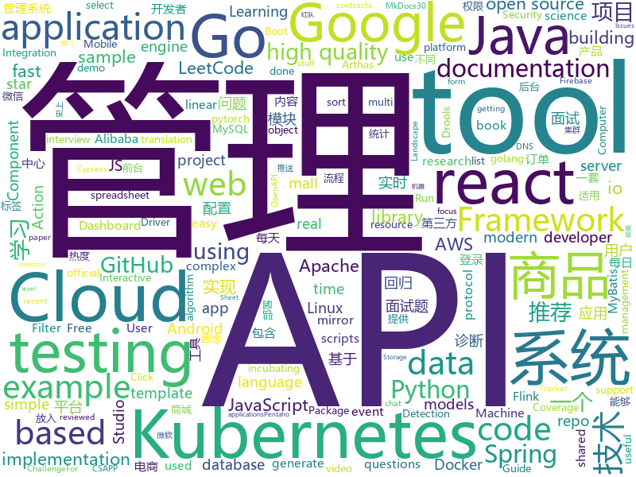

# 2019-08-24
See what the GitHub community is most excited about today.

## python
* [Real-Time-Voice-Cloning](https://github.com/CorentinJ/Real-Time-Voice-Cloning)(**409 stars today**): Clone a voice in 5 seconds to generate arbitrary speech in real-time
* [HungaBunga](https://github.com/ypeleg/HungaBunga)(**40 stars today**): HungaBunga: Brute-Force all sklearn models with all parameters using .fit .predict!
* [kubernetes-workshop](https://github.com/eon01/kubernetes-workshop)(**45 stars today**): ⚙️A Gentle introduction to Kubernetes with more than just the basics.🌟Give it a star if you like it.
* [mmdetection](https://github.com/open-mmlab/mmdetection)(**19 stars today**): Open MMLab Detection Toolbox and Benchmark
* [stylegan](https://github.com/NVlabs/stylegan)(**6 stars today**): StyleGAN - Official TensorFlow Implementation
* [open_model_zoo](https://github.com/opencv/open_model_zoo)(**11 stars today**): Pre-trained Deep Learning models and samples (high quality and extremely fast)
* [prophet](https://github.com/facebook/prophet)(**9 stars today**): Tool for producing high quality forecasts for time series data that has multiple seasonality with linear or non-linear growth.
* [gcn](https://github.com/tkipf/gcn)(**5 stars today**): Implementation of Graph Convolutional Networks in TensorFlow
* [former](https://github.com/pbloem/former)(**38 stars today**): Simple transformer implementation from scratch in pytorch.
* [hacktronian](https://github.com/thehackingsage/hacktronian)(**20 stars today**): All in One Hacking Tool for Linux & Android
* [translationCSAPP](https://github.com/EugeneLiu/translationCSAPP)(**8 stars today**): 为 CSAPP 视频课程提供字幕，翻译 PPT，Lab。
* [bcc](https://github.com/iovisor/bcc)(**6 stars today**): BCC - Tools for BPF-based Linux IO analysis, networking, monitoring, and more
* [SlimYOLOv3](https://github.com/PengyiZhang/SlimYOLOv3)(**10 stars today**): This page is for the SlimYOLOv3: Narrower, Faster and Better for UAV Real-Time Applications
* [gpt-2](https://github.com/openai/gpt-2)(**40 stars today**): Code for the paper "Language Models are Unsupervised Multitask Learners"
* [scikit-learn](https://github.com/scikit-learn/scikit-learn)(**10 stars today**): scikit-learn: machine learning in Python
* [GPT2-Chinese](https://github.com/Morizeyao/GPT2-Chinese)(**13 stars today**): Chinese version of GPT2 training code, using BERT or BPE tokenizer.
* [jupyterhub](https://github.com/jupyterhub/jupyterhub)(**3 stars today**): Multi-user server for Jupyter notebooks
* [SickZil-Machine](https://github.com/KUR-creative/SickZil-Machine)(**20 stars today**): Manga/Comics Translation Helper Tool
* [process-wallpaper](https://github.com/anirudhajith/process-wallpaper)(**12 stars today**): Shell and python scripts that set the desktop wallpaper to a word cloud of the most resource-hungry processes
* [code_snippets](https://github.com/CoreyMSchafer/code_snippets)(**3 stars today**): 
* [models](https://github.com/tensorflow/models)(**30 stars today**): Models and examples built with TensorFlow
* [PyTorch-YOLOv3](https://github.com/eriklindernoren/PyTorch-YOLOv3)(**7 stars today**): Minimal PyTorch implementation of YOLOv3
* [Detectron](https://github.com/facebookresearch/Detectron)(**11 stars today**): FAIR's research platform for object detection research, implementing popular algorithms like Mask R-CNN and RetinaNet.
* [dagster](https://github.com/dagster-io/dagster)(**7 stars today**): Dagster is an open-source Python library for building data applications.
* [marshmallow](https://github.com/marshmallow-code/marshmallow)(**5 stars today**): A lightweight library for converting complex objects to and from simple Python datatypes.

## java
* [JustAuth](https://github.com/justauth/JustAuth)(**153 stars today**): 💯史上最全的整合第三方登录的开源库。目前已支持Github、Gitee、微博、钉钉、百度、Coding、腾讯云开发者平台、OSChina、支付宝、QQ、微信、淘宝、Google、Facebook、抖音、领英、小米、微软、今日头条、Teambition、StackOverflow、Pinterest、人人、华为和企业微信等第三方平台的授权登录。 Login, so easy!
* [LeetCodeAnimation](https://github.com/MisterBooo/LeetCodeAnimation)(**164 stars today**): Demonstrate all the questions on LeetCode in the form of animation.（用动画的形式呈现解LeetCode题目的思路）
* [arthas](https://github.com/alibaba/arthas)(**40 stars today**): Alibaba Java Diagnostic Tool Arthas/Alibaba Java诊断利器Arthas
* [cim](https://github.com/crossoverJie/cim)(**45 stars today**): 📲cim(cross IM) 适用于开发者的即时通讯系统
* [mall](https://github.com/macrozheng/mall)(**62 stars today**): mall项目是一套电商系统，包括前台商城系统及后台管理系统，基于SpringBoot+MyBatis实现。 前台商城系统包含首页门户、商品推荐、商品搜索、商品展示、购物车、订单流程、会员中心、客户服务、帮助中心等模块。 后台管理系统包含商品管理、订单管理、会员管理、促销管理、运营管理、内容管理、统计报表、财务管理、权限管理、设置等模块。
* [piggymetrics](https://github.com/sqshq/piggymetrics)(**6 stars today**): Microservice Architecture with Spring Boot, Spring Cloud and Docker
* [flink-recommandSystem-demo](https://github.com/CheckChe0803/flink-recommandSystem-demo)(**12 stars today**): 🚁🚀基于Flink实现的商品实时推荐系统。flink统计商品热度，放入redis缓存，分析日志信息，将画像标签和实时记录放入Hbase。在用户发起推荐请求后，根据用户画像重排序热度榜，并结合协同过滤和标签两个推荐模块为新生成的榜单的每一个产品添加关联产品，最后返回新的用户列表。
* [flink](https://github.com/apache/flink)(**20 stars today**): Apache Flink
* [spring-boot](https://github.com/spring-projects/spring-boot)(**24 stars today**): Spring Boot
* [bistoury](https://github.com/qunarcorp/bistoury)(**13 stars today**): Bistoury是去哪儿网的java应用生产问题诊断工具，提供了一站式的问题诊断方案
* [mall-learning](https://github.com/macrozheng/mall-learning)(**21 stars today**): mall学习教程，架构、业务、技术要点全方位解析。mall项目（18k+star）是一套电商系统，使用现阶段主流技术实现。 涵盖了SpringBoot2.1.3、MyBatis3.4.6、Elasticsearch6.2.2、RabbitMQ3.7.15、Redis3.2、Mongodb3.2、Mysql5.7等技术，采用Docker容器化部署。
* [spring-analysis](https://github.com/seaswalker/spring-analysis)(**18 stars today**): Spring源码阅读
* [incubator-druid](https://github.com/apache/incubator-druid)(**8 stars today**): Apache Druid (Incubating) - Column oriented distributed data store ideal for powering interactive applications
* [android-Camera2Basic](https://github.com/googlesamples/android-Camera2Basic)(**2 stars today**): 
* [pentaho-kettle](https://github.com/pentaho/pentaho-kettle)(**3 stars today**): Pentaho Data Integration ( ETL ) a.k.a Kettle
* [jdk](https://github.com/openjdk/jdk)(**7 stars today**): Read-only mirror of https://hg.openjdk.java.net/jdk/jdk
* [graphql-java](https://github.com/graphql-java/graphql-java)(**0 stars today**): GraphQL Java implementation
* [apollo](https://github.com/ctripcorp/apollo)(**13 stars today**): Apollo（阿波罗）是携程框架部门研发的分布式配置中心，能够集中化管理应用不同环境、不同集群的配置，配置修改后能够实时推送到应用端，并且具备规范的权限、流程治理等特性，适用于微服务配置管理场景。
* [drools](https://github.com/kiegroup/drools)(**1 stars today**): Drools Expert is the rule engine and Drools Fusion does complex event processing (CEP).
* [CS-Notes](https://github.com/CyC2018/CS-Notes)(**83 stars today**): 📚Tech Interview Guide 技术面试必备基础知识、Leetcode 题解、Java、C++、Python、后端面试、操作系统、计算机网络、系统设计
* [spring-boot-api-project-seed](https://github.com/lihengming/spring-boot-api-project-seed)(**5 stars today**): 🌱🚀一个基于Spring Boot & MyBatis的种子项目，用于快速构建中小型API、RESTful API项目~
* [kafka-streams-examples](https://github.com/confluentinc/kafka-streams-examples)(**1 stars today**): Demo applications and code examples for Apache Kafka's Streams API.
* [react-native-video](https://github.com/react-native-community/react-native-video)(**1 stars today**): A <Video /> component for react-native
* [aws-doc-sdk-examples](https://github.com/awsdocs/aws-doc-sdk-examples)(**2 stars today**): Code examples used in the official AWS SDK documentation.
* [spring-framework](https://github.com/spring-projects/spring-framework)(**24 stars today**): Spring Framework

## unknown
* [free-books](https://github.com/ruanyf/free-books)(**241 stars today**): 互联网上的免费书籍
* [awesome-coding-js](https://github.com/ConardLi/awesome-coding-js)(**58 stars today**): 用JavaScript实现的算法和数据结构，附详细解释和刷题指南
* [coding-interview-university](https://github.com/jwasham/coding-interview-university)(**103 stars today**): A complete computer science study plan to become a software engineer.
* [gitignore](https://github.com/github/gitignore)(**36 stars today**): A collection of useful .gitignore templates
* [RedTeam-BCS](https://github.com/Mel0day/RedTeam-BCS)(**21 stars today**): BCS（北京网络安全大会）2019 红队行动会议重点内容
* [StabilityGuide](https://github.com/StabilityMan/StabilityGuide)(**8 stars today**): 【稳定大于一切】打造国内稳定性领域知识库，让无法解决的问题少一点点，让世界的确定性多一点点。
* [react-typescript-cheatsheet](https://github.com/typescript-cheatsheets/react-typescript-cheatsheet)(**12 stars today**): Cheatsheets for experienced React developers getting started with TypeScript
* [awesome-actions](https://github.com/sdras/awesome-actions)(**26 stars today**): A curated list of awesome actions to use on GitHub
* [webkit](https://github.com/WebKit/webkit)(**1 stars today**): Unofficial mirror of the WebKit SVN repository
* [Raytracer-In-Excel](https://github.com/s0lly/Raytracer-In-Excel)(**19 stars today**): Raytracer in our favourite spreadsheet application!
* [you-dont-know-js-ru](https://github.com/azat-io/you-dont-know-js-ru)(**1 stars today**): 📚Russian translation of "You Don't Know JS" book series
* [aws-cloudformation-coverage-roadmap](https://github.com/aws-cloudformation/aws-cloudformation-coverage-roadmap)(**4 stars today**): The AWS CloudFormation Public Coverage Roadmap
* [The-Documentation-Compendium](https://github.com/kylelobo/The-Documentation-Compendium)(**6 stars today**): 📢Various README templates & tips on writing high-quality documentation that people want to read.
* [Specs](https://github.com/CocoaPods/Specs)(**0 stars today**): The CocoaPods Master Repo
* [landscape](https://github.com/cncf/landscape)(**3 stars today**): 🌄The Cloud Native Interactive Landscape filters and sorts hundreds of projects and products, and shows details including GitHub stars, funding or market cap, first and last commits, contributor counts, headquarters location, and recent tweets.
* [WSL](https://github.com/microsoft/WSL)(**0 stars today**): Issues found on WSL
* [docs](https://github.com/laravel/docs)(**4 stars today**): 
* [Android-Daily-Interview](https://github.com/Moosphan/Android-Daily-Interview)(**3 stars today**): 每工作日更新一道 Android 面试题，小聚成河，大聚成江，共勉之～
* [starter-workflows](https://github.com/actions/starter-workflows)(**7 stars today**): Accelerating new GitHub Actions workflows
* [learn-regex](https://github.com/ziishaned/learn-regex)(**182 stars today**): Learn regex the easy way
* [kubernetes-the-hard-way](https://github.com/kelseyhightower/kubernetes-the-hard-way)(**7 stars today**): Bootstrap Kubernetes the hard way on Google Cloud Platform. No scripts.
* [AD-Attack-Defense](https://github.com/infosecn1nja/AD-Attack-Defense)(**8 stars today**): Attack and defend active directory using modern post exploitation adversary tradecraft activity
* [google-cloud-4-words](https://github.com/gregsramblings/google-cloud-4-words)(**36 stars today**): The Google Cloud Developer's Cheat Sheet
* [computer-science](https://github.com/ossu/computer-science)(**20 stars today**): 🎓Path to a free self-taught education in Computer Science!
* [architect-awesome](https://github.com/xingshaocheng/architect-awesome)(**10 stars today**): 后端架构师技术图谱

## javascript
* [incubator-superset](https://github.com/apache/incubator-superset)(**55 stars today**): Apache Superset (incubating) is a modern, enterprise-ready business intelligence web application
* [flv.js](https://github.com/bilibili/flv.js)(**43 stars today**): HTML5 FLV Player
* [admin-bro](https://github.com/SoftwareBrothers/admin-bro)(**80 stars today**): AdminBro is an admin panel for apps written in node.js
* [yapi](https://github.com/YMFE/yapi)(**46 stars today**): YApi 是一个可本地部署的、打通前后端及QA的、可视化的接口管理平台
* [gridstudio](https://github.com/ricklamers/gridstudio)(**22 stars today**): Grid studio is a web-based spreadsheet application with full integration of the Python programming language.
* [fe-interview](https://github.com/haizlin/fe-interview)(**55 stars today**): 前端面试每日 3+1，以面试题来驱动学习，提倡每日学习与思考，每天进步一点！每天早上5点纯手工发布面试题（死磕自己，愉悦大家）
* [grapesjs](https://github.com/artf/grapesjs)(**12 stars today**): Free and Open source Web Builder Framework. Next generation tool for building templates without coding
* [react-select](https://github.com/JedWatson/react-select)(**7 stars today**): The Select Component for React.js
* [label-studio](https://github.com/heartexlabs/label-studio)(**23 stars today**): Label Studio is a multi-type data labeling and annotation tool with standardized output format
* [cypress-example-recipes](https://github.com/cypress-io/cypress-example-recipes)(**5 stars today**): Various recipes for testing common scenarios with Cypress
* [graphql-engine](https://github.com/hasura/graphql-engine)(**14 stars today**): Blazing fast, instant realtime GraphQL APIs on Postgres with fine grained access control, also trigger webhooks on database events.
* [reveal.js](https://github.com/hakimel/reveal.js)(**19 stars today**): The HTML Presentation Framework
* [vue](https://github.com/vuejs/vue)(**85 stars today**): 🖖Vue.js is a progressive, incrementally-adoptable JavaScript framework for building UI on the web.
* [snabbdom](https://github.com/snabbdom/snabbdom)(**10 stars today**): A virtual DOM library with focus on simplicity, modularity, powerful features and performance.
* [jstree](https://github.com/vakata/jstree)(**3 stars today**): jquery tree plugin
* [jscodeshift](https://github.com/facebook/jscodeshift)(**8 stars today**): A JavaScript codemod toolkit.
* [truffle](https://github.com/trufflesuite/truffle)(**5 stars today**): A tool for developing smart contracts. Crafted with the finest cacaos.
* [fiora](https://github.com/yinxin630/fiora)(**6 stars today**): An interesting chat application power by socket.io, koa, mongodb and react
* [MikuTools](https://github.com/Ice-Hazymoon/MikuTools)(**9 stars today**): 一个轻量的工具集合
* [UnblockNeteaseMusic](https://github.com/nondanee/UnblockNeteaseMusic)(**58 stars today**): Revive unavailable songs for Netease Cloud Music
* [react-i18next](https://github.com/i18next/react-i18next)(**3 stars today**): Internationalization for react done right. Using the i18next i18n ecosystem.
* [oidc-client-js](https://github.com/IdentityModel/oidc-client-js)(**4 stars today**): OpenID Connect (OIDC) and OAuth2 protocol support for browser-based JavaScript applications
* [airframe-react](https://github.com/0wczar/airframe-react)(**122 stars today**): Free Open Source High Quality Dashboard based on Bootstrap 4 & React 16: http://dashboards.webkom.co/react/airframe
* [pouchdb](https://github.com/pouchdb/pouchdb)(**14 stars today**): 🐨- PouchDB is a pocket-sized database.
* [Viewers](https://github.com/OHIF/Viewers)(**2 stars today**): OHIF zero-footprint DICOM viewer and oncology specific Lesion Tracker, plus shared extension packages

## html
* [ppts](https://github.com/iv-web/ppts)(**60 stars today**): 团队对外分享ppt
* [swagger-codegen](https://github.com/swagger-api/swagger-codegen)(**8 stars today**): swagger-codegen contains a template-driven engine to generate documentation, API clients and server stubs in different languages by parsing your OpenAPI / Swagger definition.
* [owasp-mstg](https://github.com/OWASP/owasp-mstg)(**4 stars today**): The Mobile Security Testing Guide (MSTG) is a comprehensive manual for mobile app security development, testing and reverse engineering.
* [mkdocs-material](https://github.com/squidfunk/mkdocs-material)(**1 stars today**): A Material Design theme for MkDocs
* [JavaScript30](https://github.com/wesbos/JavaScript30)(**6 stars today**): 30 Day Vanilla JS Challenge
* [Disease-detection-using-chest-xrays](https://github.com/SGNovice/Disease-detection-using-chest-xrays)(**1 stars today**): For the demo. Click on the link.
* [WebFundamentals](https://github.com/google/WebFundamentals)(**3 stars today**): Best practices for modern web development
* [Front-end-Developer-Interview-Questions](https://github.com/h5bp/Front-end-Developer-Interview-Questions)(**12 stars today**): A list of helpful front-end related questions you can use to interview potential candidates, test yourself or completely ignore.
* [cloud-run-hello](https://github.com/GoogleCloudPlatform/cloud-run-hello)(**3 stars today**): Sample Cloud Run application
* [core](https://github.com/stackblitz/core)(**5 stars today**): Online IDE powered by Visual Studio Code⚡️
* [ionic-preview-app](https://github.com/ionic-team/ionic-preview-app)(**0 stars today**): The Ionic Component Demos
* [website](https://github.com/kubernetes/website)(**2 stars today**): Kubernetes website and documentation repo:
* [docs](https://github.com/knative/docs)(**0 stars today**): User documentation for Knative components
* [stickyfill](https://github.com/wilddeer/stickyfill)(**0 stars today**): Polyfill for CSS `position: sticky`
* [elements-examples](https://github.com/stripe/elements-examples)(**1 stars today**): Stripe Elements examples.
* [Machine-Learning](https://github.com/Jack-Cherish/Machine-Learning)(**1 stars today**): ⚡️机器学习实战（Python3）：kNN、决策树、贝叶斯、逻辑回归、SVM、线性回归、树回归
* [quickstart-js](https://github.com/firebase/quickstart-js)(**1 stars today**): Firebase Quickstart Samples for Web
* [chosen](https://github.com/harvesthq/chosen)(**1 stars today**): Chosen is a library for making long, unwieldy select boxes more friendly.
* [machinelearninginaction](https://github.com/pbharrin/machinelearninginaction)(**1 stars today**): Source Code for the book: Machine Learning in Action published by Manning
* [isotope](https://github.com/metafizzy/isotope)(**1 stars today**): 💞Filter & sort magical layouts
* [cypress-example-kitchensink](https://github.com/cypress-io/cypress-example-kitchensink)(**1 stars today**): This is an example app used to showcase Cypress.io testing.
* [boost](https://github.com/boostorg/boost)(**6 stars today**): Super-project for modularized Boost
* [filament](https://github.com/google/filament)(**5 stars today**): Filament is a real-time physically based rendering engine for Android, iOS, Windows, Linux, macOS and WASM/WebGL
* [fastText](https://github.com/facebookresearch/fastText)(**9 stars today**): Library for fast text representation and classification.
* [jsonplaceholder](https://github.com/typicode/jsonplaceholder)(**7 stars today**): A simple online fake REST API server

## go
* [go-ethereum](https://github.com/ethereum/go-ethereum)(**19 stars today**): Official Go implementation of the Ethereum protocol
* [kubernetes](https://github.com/kubernetes/kubernetes)(**41 stars today**): Production-Grade Container Scheduling and Management
* [govalidator](https://github.com/asaskevich/govalidator)(**8 stars today**): [Go] Package of validators and sanitizers for strings, numerics, slices and structs
* [mysql](https://github.com/go-sql-driver/mysql)(**8 stars today**): Go MySQL Driver is a MySQL driver for Go's (golang) database/sql package
* [protobuf](https://github.com/golang/protobuf)(**5 stars today**): Go support for Google's protocol buffers
* [external-dns](https://github.com/kubernetes-incubator/external-dns)(**8 stars today**): Configure external DNS servers (AWS Route53, Google CloudDNS and others) for Kubernetes Ingresses and Services
* [terraform](https://github.com/hashicorp/terraform)(**7 stars today**): Terraform enables you to safely and predictably create, change, and improve infrastructure. It is an open source tool that codifies APIs into declarative configuration files that can be shared amongst team members, treated as code, edited, reviewed, and versioned.
* [cloud-run-button](https://github.com/GoogleCloudPlatform/cloud-run-button)(**18 stars today**): Let anyone deploy your GitHub repos to Google Cloud Run with a single click
* [annie](https://github.com/iawia002/annie)(**41 stars today**): 👾Fast, simple and clean video downloader
* [ginkgo](https://github.com/onsi/ginkgo)(**17 stars today**): BDD Testing Framework for Go
* [LeetCode-in-Go](https://github.com/aQuaYi/LeetCode-in-Go)(**9 stars today**): 🎓Go Solution for LeetCode algorithm problems, 100% coverage, continually updating.
* [flux](https://github.com/fluxcd/flux)(**12 stars today**): The GitOps Kubernetes operator
* [k3s](https://github.com/rancher/k3s)(**21 stars today**): Lightweight Kubernetes. 5 less than k8s.
* [glog](https://github.com/golang/glog)(**9 stars today**): Leveled execution logs for Go
* [argo](https://github.com/argoproj/argo)(**6 stars today**): Argo Workflows: Get stuff done with Kubernetes.
* [aws-lambda-go](https://github.com/aws/aws-lambda-go)(**6 stars today**): Libraries, samples and tools to help Go developers develop AWS Lambda functions.
* [kind](https://github.com/kubernetes-sigs/kind)(**25 stars today**): Kubernetes IN Docker - local clusters for testing Kubernetes
* [terraform-provider-azurerm](https://github.com/terraform-providers/terraform-provider-azurerm)(**4 stars today**): Terraform provider for Azure Resource Manager
* [dep](https://github.com/golang/dep)(**2 stars today**): Go dependency management tool
* [slack](https://github.com/nlopes/slack)(**3 stars today**): Slack API in Go
* [operator-sdk](https://github.com/operator-framework/operator-sdk)(**5 stars today**): SDK for building Kubernetes applications. Provides high level APIs, useful abstractions, and project scaffolding.
* [rook](https://github.com/rook/rook)(**5 stars today**): Storage Orchestration for Kubernetes
* [ingress-nginx](https://github.com/kubernetes/ingress-nginx)(**10 stars today**): NGINX Ingress Controller for Kubernetes
* [gopsutil](https://github.com/shirou/gopsutil)(**6 stars today**): psutil for golang
* [easyjson](https://github.com/mailru/easyjson)(**10 stars today**): Fast JSON serializer for golang.

## WordCloud

