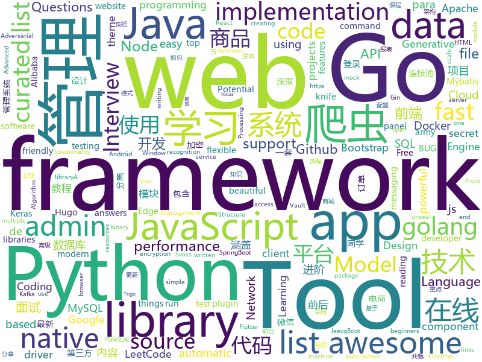

# 2019-08-25
See what the GitHub community is most excited about today.

## python
* [Real-Time-Voice-Cloning](https://github.com/CorentinJ/Real-Time-Voice-Cloning)(**246 stars today**): Clone a voice in 5 seconds to generate arbitrary speech in real-time
* [awesome-python](https://github.com/vinta/awesome-python)(**139 stars today**): A curated list of awesome Python frameworks, libraries, software and resources
* [former](https://github.com/pbloem/former)(**14 stars today**): Simple transformer implementation from scratch in pytorch.
* [spotify-downloader](https://github.com/ritiek/spotify-downloader)(**7 stars today**): Download Spotify playlists with albumart and meta-tags
* [mlflow](https://github.com/mlflow/mlflow)(**7 stars today**): Open source platform for the machine learning lifecycle
* [keras-yolo3](https://github.com/qqwweee/keras-yolo3)(**7 stars today**): A Keras implementation of YOLOv3 (Tensorflow backend)
* [qiling](https://github.com/qilingframework/qiling)(**16 stars today**): Qiling Advanced Binary Emulation framework
* [image-super-resolution](https://github.com/idealo/image-super-resolution)(**4 stars today**): Super-scale your images and run experiments with Residual Dense and Adversarial Networks.
* [gpt-2](https://github.com/openai/gpt-2)(**10 stars today**): Code for the paper "Language Models are Unsupervised Multitask Learners"
* [GPT2-Chinese](https://github.com/Morizeyao/GPT2-Chinese)(**25 stars today**): Chinese version of GPT2 training code, using BERT or BPE tokenizer.
* [docker-py](https://github.com/docker/docker-py)(**3 stars today**): A Python library for the Docker Engine API
* [pipelines](https://github.com/kubeflow/pipelines)(**2 stars today**): Machine Learning Pipelines for Kubeflow
* [hacktronian](https://github.com/thehackingsage/hacktronian)(**12 stars today**): All in One Hacking Tool for Linux & Android
* [MelNet](https://github.com/fatchord/MelNet)(**6 stars today**): WIP: Open Source Implementation of "MelNet: A Generative Model for Audio in the Frequency Domain"
* [django](https://github.com/django/django)(**23 stars today**): The Web framework for perfectionists with deadlines.
* [A-Light-and-Fast-Face-Detector-for-Edge-Devices](https://github.com/YonghaoHe/A-Light-and-Fast-Face-Detector-for-Edge-Devices)(**2 stars today**): a light and fast face detector for edge devices
* [face_recognition](https://github.com/ageitgey/face_recognition)(**20 stars today**): The world's simplest facial recognition api for Python and the command line
* [PyTorch-GAN](https://github.com/eriklindernoren/PyTorch-GAN)(**3 stars today**): PyTorch implementations of Generative Adversarial Networks.
* [Mask_RCNN](https://github.com/matterport/Mask_RCNN)(**8 stars today**): Mask R-CNN for object detection and instance segmentation on Keras and TensorFlow
* [learn_python3_spider](https://github.com/wistbean/learn_python3_spider)(**13 stars today**): python爬虫教程系列、从0到1学习python爬虫，包括浏览器抓包，手机APP抓包，如 fiddler、mitmproxy，各种爬虫涉及的模块的使用，如：requests、beautifulSoup、selenium、appium、scrapy等，以及IP代理，验证码识别，Mysql，MongoDB数据库的python使用，多线程多进程爬虫的使用，css 爬虫加密逆向破解，JS爬虫逆向，爬虫项目实战实例等
* [evillimiter](https://github.com/bitbrute/evillimiter)(**8 stars today**): Tool that limits bandwidth of devices on the same network without access.
* [spaCy](https://github.com/explosion/spaCy)(**8 stars today**): 💫Industrial-strength Natural Language Processing (NLP) with Python and Cython
* [connexion](https://github.com/zalando/connexion)(**4 stars today**): Swagger/OpenAPI First framework for Python on top of Flask with automatic endpoint validation & OAuth2 support
* [cpython](https://github.com/python/cpython)(**21 stars today**): The Python programming language
* [open_model_zoo](https://github.com/opencv/open_model_zoo)(**5 stars today**): Pre-trained Deep Learning models and samples (high quality and extremely fast)

## java
* [LeetCodeAnimation](https://github.com/MisterBooo/LeetCodeAnimation)(**109 stars today**): Demonstrate all the questions on LeetCode in the form of animation.（用动画的形式呈现解LeetCode题目的思路）
* [JustAuth](https://github.com/justauth/JustAuth)(**107 stars today**): 💯史上最全的整合第三方登录的开源库。目前已支持Github、Gitee、微博、钉钉、百度、Coding、腾讯云开发者平台、OSChina、支付宝、QQ、微信、淘宝、Google、Facebook、抖音、领英、小米、微软、今日头条、Teambition、StackOverflow、Pinterest、人人、华为和企业微信等第三方平台的授权登录。 Login, so easy!
* [spring-analysis](https://github.com/seaswalker/spring-analysis)(**24 stars today**): Spring源码阅读
* [arthas](https://github.com/alibaba/arthas)(**12 stars today**): Alibaba Java Diagnostic Tool Arthas/Alibaba Java诊断利器Arthas
* [vertx-examples](https://github.com/vert-x3/vertx-examples)(**4 stars today**): Vert.x examples
* [flutter_boost](https://github.com/alibaba/flutter_boost)(**4 stars today**): FlutterBoost is a Flutter plugin which enables hybrid integration of Flutter for your existing native apps with minimum efforts
* [angel](https://github.com/Angel-ML/angel)(**131 stars today**): A Flexible and Powerful Parameter Server for large-scale machine learning
* [RxJava](https://github.com/ReactiveX/RxJava)(**13 stars today**): RxJava – Reactive Extensions for the JVM – a library for composing asynchronous and event-based programs using observable sequences for the Java VM.
* [resilience4j](https://github.com/resilience4j/resilience4j)(**3 stars today**): Resilience4j is a fault tolerance library designed for Java8 and functional programming
* [mall](https://github.com/macrozheng/mall)(**38 stars today**): mall项目是一套电商系统，包括前台商城系统及后台管理系统，基于SpringBoot+MyBatis实现。 前台商城系统包含首页门户、商品推荐、商品搜索、商品展示、购物车、订单流程、会员中心、客户服务、帮助中心等模块。 后台管理系统包含商品管理、订单管理、会员管理、促销管理、运营管理、内容管理、统计报表、财务管理、权限管理、设置等模块。
* [jenkins](https://github.com/jenkinsci/jenkins)(**10 stars today**): Jenkins automation server
* [pulsar](https://github.com/apache/pulsar)(**2 stars today**): Apache Pulsar - distributed pub-sub messaging system
* [selenium](https://github.com/SeleniumHQ/selenium)(**7 stars today**): A browser automation framework and ecosystem.
* [react-native-camera](https://github.com/react-native-community/react-native-camera)(**3 stars today**): A Camera component for React Native. Also supports barcode scanning!
* [antlr4](https://github.com/antlr/antlr4)(**7 stars today**): ANTLR (ANother Tool for Language Recognition) is a powerful parser generator for reading, processing, executing, or translating structured text or binary files.
* [CS-Notes](https://github.com/CyC2018/CS-Notes)(**52 stars today**): 📚Tech Interview Guide 技术面试必备基础知识、Leetcode 题解、Java、C++、Python、后端面试、操作系统、计算机网络、系统设计
* [ksql](https://github.com/confluentinc/ksql)(**2 stars today**): KSQL - the Streaming SQL Engine for Apache Kafka
* [mall-learning](https://github.com/macrozheng/mall-learning)(**12 stars today**): mall学习教程，架构、业务、技术要点全方位解析。mall项目（18k+star）是一套电商系统，使用现阶段主流技术实现。 涵盖了SpringBoot2.1.3、MyBatis3.4.6、Elasticsearch6.2.2、RabbitMQ3.7.15、Redis3.2、Mongodb3.2、Mysql5.7等技术，采用Docker容器化部署。
* [druid](https://github.com/alibaba/druid)(**5 stars today**): 阿里巴巴数据库事业部出品，为监控而生的数据库连接池。阿里云Data Lake Analytics(https://www.aliyun.com/product/datalakeanalytics )、DRDS、TDDL 连接池powered by Druid
* [schema-registry](https://github.com/confluentinc/schema-registry)(**0 stars today**): Confluent Schema Registry for Kafka
* [advanced-java](https://github.com/doocs/advanced-java)(**26 stars today**): 😮互联网 Java 工程师进阶知识完全扫盲：涵盖高并发、分布式、高可用、微服务等领域知识，后端同学必看，前端同学也可学习
* [kafka-rest](https://github.com/confluentinc/kafka-rest)(**2 stars today**): Confluent REST Proxy for Kafka
* [jeecg-boot](https://github.com/zhangdaiscott/jeecg-boot)(**15 stars today**): 一款基于代码生成器的JAVA快速开发平台！采用最新技术，前后端分离架构：SpringBoot 2.x，Ant Design&Vue，Mybatis，Shiro，JWT。强大的代码生成器让前后端代码一键生成，无需写任何代码，绝对是全栈开发福音！！ JeecgBoot的宗旨是提高UI能力的同时,降低前后分离的开发成本，JeecgBoot还独创在线开发模式，No代码概念，一系列在线智能开发：在线配置表单、在线配置报表、在线设计流程等等。
* [FluentJPA](https://github.com/streamx-co/FluentJPA)(**6 stars today**): Fluent API for writing typesafe SQL queries in Java for JPA.
* [nifi](https://github.com/apache/nifi)(**4 stars today**): Mirror of Apache NiFi

## unknown
* [learn-regex](https://github.com/ziishaned/learn-regex)(**125 stars today**): Learn regex the easy way
* [Deep-Learning-Interview-Book](https://github.com/amusi/Deep-Learning-Interview-Book)(**48 stars today**): 深度学习面试宝典（含数学、机器学习、深度学习、计算机视觉、自然语言处理和SLAM等方向）
* [weekly](https://github.com/ruanyf/weekly)(**17 stars today**): 科技爱好者周刊，每周五发布
* [RedTeam-BCS](https://github.com/Mel0day/RedTeam-BCS)(**15 stars today**): BCS（北京网络安全大会）2019 红队行动会议重点内容
* [Index](https://github.com/HowProgrammingWorks/Index)(**4 stars today**): Repositories Index
* [one-python-craftsman](https://github.com/piglei/one-python-craftsman)(**5 stars today**): 来自一位 Pythonista 的编程经验分享，内容涵盖编码技巧、最佳实践与思维模式等方面。
* [Behinder](https://github.com/rebeyond/Behinder)(**12 stars today**): “冰蝎”动态二进制加密网站管理客户端
* [privacy-model](https://github.com/michaelkleber/privacy-model)(**0 stars today**): A Potential Privacy Model for the Web: Sharding Web Identity
* [first-contributions](https://github.com/firstcontributions/first-contributions)(**8 stars today**): 🚀✨Help beginners to contribute to open source projects
* [Flutter-Course-Resources](https://github.com/londonappbrewery/Flutter-Course-Resources)(**2 stars today**): 
* [IntelliJ-IDEA-Tutorial](https://github.com/judasn/IntelliJ-IDEA-Tutorial)(**9 stars today**): IntelliJ IDEA 简体中文专题教程
* [awesome-vue](https://github.com/vuejs/awesome-vue)(**16 stars today**): 🎉A curated list of awesome things related to Vue.js
* [awesome-electron](https://github.com/sindresorhus/awesome-electron)(**4 stars today**): Useful resources for creating apps with Electron
* [blog](https://github.com/yygmind/blog)(**1 stars today**): 我是木易杨，公众号「高级前端进阶」作者，跟着我每周重点攻克一个前端面试重难点。接下来让我带你走进高级前端的世界，在进阶的路上，共勉！
* [vagas](https://github.com/frontendbr/vagas)(**2 stars today**): 🔬Espaço para divulgação de vagas para front-enders.
* [reactjs-interview-questions](https://github.com/sudheerj/reactjs-interview-questions)(**10 stars today**): List of top 500 ReactJS Interview Questions & Answers....Coding exercise questions are coming soon!!
* [flink-training-course](https://github.com/flink-china/flink-training-course)(**4 stars today**): Flink 中文视频课程（持续更新...）
* [iCSS](https://github.com/chokcoco/iCSS)(**1 stars today**): 不止于 CSS
* [every-programmer-should-know](https://github.com/mtdvio/every-programmer-should-know)(**7 stars today**): A collection of (mostly) technical things every software developer should know
* [1](https://github.com/1jie/1)(**4 stars today**): 这里是直播平台永久回家页，有最新app下载地址。
* [Android-Daily-Interview](https://github.com/Moosphan/Android-Daily-Interview)(**2 stars today**): 每工作日更新一道 Android 面试题，小聚成河，大聚成江，共勉之～
* [Raytracer-In-Excel](https://github.com/s0lly/Raytracer-In-Excel)(**4 stars today**): Raytracer in our favourite spreadsheet application!
* [the-art-of-command-line](https://github.com/jlevy/the-art-of-command-line)(**27 stars today**): Master the command line, in one page
* [ganhacks](https://github.com/soumith/ganhacks)(**2 stars today**): starter from "How to Train a GAN?" at NIPS2016
* [awesome-for-beginners](https://github.com/MunGell/awesome-for-beginners)(**22 stars today**): A list of awesome beginners-friendly projects.

## javascript
* [node](https://github.com/nodejs/node)(**58 stars today**): Node.js JavaScript runtime✨🐢🚀✨
* [the-super-tiny-compiler](https://github.com/jamiebuilds/the-super-tiny-compiler)(**63 stars today**): ⛄️Possibly the smallest compiler ever
* [csgo-crash-exploit](https://github.com/BeepFelix/csgo-crash-exploit)(**20 stars today**): Allows you to crash any Windows user
* [admin-bro](https://github.com/SoftwareBrothers/admin-bro)(**45 stars today**): AdminBro is an admin panel for apps written in node.js
* [date-fns](https://github.com/date-fns/date-fns)(**52 stars today**): ⏳Modern JavaScript date utility library⌛️
* [reveal.js](https://github.com/hakimel/reveal.js)(**18 stars today**): The HTML Presentation Framework
* [react-dates](https://github.com/airbnb/react-dates)(**5 stars today**): An easily internationalizable, mobile-friendly datepicker library for the web
* [snabbdom](https://github.com/snabbdom/snabbdom)(**10 stars today**): A virtual DOM library with focus on simplicity, modularity, powerful features and performance.
* [javascript-algorithms](https://github.com/trekhleb/javascript-algorithms)(**27 stars today**): 📝Algorithms and data structures implemented in JavaScript with explanations and links to further readings
* [rollup](https://github.com/rollup/rollup)(**13 stars today**): Next-generation ES module bundler
* [CyberChef](https://github.com/gchq/CyberChef)(**31 stars today**): The Cyber Swiss Army Knife - a web app for encryption, encoding, compression and data analysis
* [d3](https://github.com/d3/d3)(**15 stars today**): Bring data to life with SVG, Canvas and HTML.📊📈🎉
* [filepond](https://github.com/pqina/filepond)(**35 stars today**): 🌊A flexible and fun JavaScript file upload library
* [monaco-editor](https://github.com/microsoft/monaco-editor)(**11 stars today**): A browser based code editor
* [puppeteer](https://github.com/GoogleChrome/puppeteer)(**16 stars today**): Headless Chrome Node API
* [front-end-interview-handbook](https://github.com/yangshun/front-end-interview-handbook)(**12 stars today**): 🕸Almost complete answers to "Front-end Job Interview Questions" which you can use to interview potential candidates, test yourself or completely ignore
* [lerna](https://github.com/lerna/lerna)(**10 stars today**): 🐉A tool for managing JavaScript projects with multiple packages.
* [incubator-superset](https://github.com/apache/incubator-superset)(**20 stars today**): Apache Superset (incubating) is a modern, enterprise-ready business intelligence web application
* [particles.js](https://github.com/VincentGarreau/particles.js)(**11 stars today**): A lightweight JavaScript library for creating particles
* [fullPage.js](https://github.com/alvarotrigo/fullPage.js)(**17 stars today**): fullPage plugin by Alvaro Trigo. Create full screen pages fast and simple
* [eslint](https://github.com/eslint/eslint)(**7 stars today**): A fully pluggable tool for identifying and reporting on patterns in JavaScript
* [amphtml](https://github.com/ampproject/amphtml)(**4 stars today**): The AMP web component framework.
* [kibana](https://github.com/elastic/kibana)(**6 stars today**): Your window into the Elastic Stack
* [fastify](https://github.com/fastify/fastify)(**21 stars today**): Fast and low overhead web framework, for Node.js
* [react-native](https://github.com/facebook/react-native)(**20 stars today**): A framework for building native apps with React.

## html
* [web-moderno](https://github.com/cod3rcursos/web-moderno)(**2 stars today**): 
* [Dism-Multi-language](https://github.com/Chuyu-Team/Dism-Multi-language)(**4 stars today**): Dism++ Multi-language Support & BUG Report
* [fluxion](https://github.com/FluxionNetwork/fluxion)(**2 stars today**): Fluxion is a remake of linset by vk496 with less bugs and enhanced functionality.
* [hyperblog](https://github.com/freddier/hyperblog)(**6 stars today**): Un blog increíble para el curso de Git y Github de Platzi
* [ppts](https://github.com/iv-web/ppts)(**61 stars today**): 团队对外分享ppt
* [awesome-competitive-programming](https://github.com/lnishan/awesome-competitive-programming)(**7 stars today**): 💎A curated list of awesome Competitive Programming, Algorithm and Data Structure resources
* [svelte-material-ui](https://github.com/hperrin/svelte-material-ui)(**15 stars today**): Svelte Material UI Components
* [home-assistant.io](https://github.com/home-assistant/home-assistant.io)(**0 stars today**): 📘Home Assistant User documentation
* [wallets-recovery](https://github.com/nvk/wallets-recovery)(**2 stars today**): Information about wallet defaults for external recovery
* [hermit](https://github.com/Track3/hermit)(**2 stars today**): A minimal & fast Hugo theme for bloggers
* [1000php](https://github.com/Xyntax/1000php)(**1 stars today**): 1000个PHP代码审计案例(2016.7以前乌云公开漏洞)
* [webdevbootcamp](https://github.com/nax3t/webdevbootcamp)(**3 stars today**): All source code for back-end projects from the Web Developer Bootcamp
* [Keka](https://github.com/aonez/Keka)(**1 stars today**): The macOS file archiver
* [html](https://github.com/whatwg/html)(**3 stars today**): HTML Standard
* [HiddenEye](https://github.com/DarkSecDevelopers/HiddenEye)(**0 stars today**): Modern Phishing Tool With Advanced Functionality [ Android-Support-Available ]
* [AdminLTE](https://github.com/ColorlibHQ/AdminLTE)(**3 stars today**): AdminLTE - Free Premium Admin control Panel Theme Based On Bootstrap 3.x
* [awesome-piracy](https://github.com/Igglybuff/awesome-piracy)(**5 stars today**): A curated list of awesome warez and piracy links
* [REKCARC-TSC-UHT](https://github.com/PKUanonym/REKCARC-TSC-UHT)(**12 stars today**): 清华大学计算机系课程攻略 Guidance for courses in Department of Computer Science and Technology, Tsinghua University
* [coreui-free-bootstrap-admin-template](https://github.com/coreui/coreui-free-bootstrap-admin-template)(**0 stars today**): CoreUI is free bootstrap admin template
* [Adminator-admin-dashboard](https://github.com/puikinsh/Adminator-admin-dashboard)(**2 stars today**): Adminator is a easy to use and well design admin dashboard template for web apps, websites, services and more
* [electron-api-demos](https://github.com/electron/electron-api-demos)(**5 stars today**): Explore the Electron APIs
* [stisla](https://github.com/stisla/stisla)(**1 stars today**): Free Bootstrap Admin Template
* [awesome-creative-coding](https://github.com/terkelg/awesome-creative-coding)(**7 stars today**): Creative Coding: Generative Art, Data visualization, Interaction Design, Resources.
* [beautiful-jekyll](https://github.com/daattali/beautiful-jekyll)(**1 stars today**): ✨Build a beautiful and simple website in literally minutes. Demo at http://deanattali.com/beautiful-jekyll
* [gohugo-theme-ananke](https://github.com/budparr/gohugo-theme-ananke)(**1 stars today**): Ananke: A theme for Hugo Sites

## go
* [kind](https://github.com/kubernetes-sigs/kind)(**34 stars today**): Kubernetes IN Docker - local clusters for testing Kubernetes
* [annie](https://github.com/iawia002/annie)(**34 stars today**): 👾Fast, simple and clean video downloader
* [nats-server](https://github.com/nats-io/nats-server)(**1 stars today**): High-Performance server for NATS, the cloud native messaging system.
* [traefik](https://github.com/containous/traefik)(**16 stars today**): The Cloud Native Edge Router
* [torrent](https://github.com/anacrolix/torrent)(**21 stars today**): Full-featured BitTorrent-client package and utilities
* [protobuf](https://github.com/golang/protobuf)(**2 stars today**): Go support for Google's protocol buffers
* [elastic](https://github.com/olivere/elastic)(**2 stars today**): Elasticsearch client for Go.
* [gin](https://github.com/gin-gonic/gin)(**16 stars today**): Gin is a HTTP web framework written in Go (Golang). It features a Martini-like API with much better performance -- up to 40 times faster. If you need smashing performance, get yourself some Gin.
* [ginkgo](https://github.com/onsi/ginkgo)(**16 stars today**): BDD Testing Framework for Go
* [easyjson](https://github.com/mailru/easyjson)(**5 stars today**): Fast JSON serializer for golang.
* [cloud-run-button](https://github.com/GoogleCloudPlatform/cloud-run-button)(**9 stars today**): Let anyone deploy your GitHub repos to Google Cloud Run with a single click
* [awesome-go](https://github.com/avelino/awesome-go)(**24 stars today**): A curated list of awesome Go frameworks, libraries and software
* [bank-vaults](https://github.com/banzaicloud/bank-vaults)(**3 stars today**): A Vault swiss-army knife: a K8s operator, Go client with automatic token renewal, automatic configuration, multiple unseal options and more. A CLI tool to init, unseal and configure Vault (auth methods, secret engines). Direct secret injection into Pods.
* [terraform-provider-aws](https://github.com/terraform-providers/terraform-provider-aws)(**3 stars today**): Terraform AWS provider
* [mysql](https://github.com/go-sql-driver/mysql)(**3 stars today**): Go MySQL Driver is a MySQL driver for Go's (golang) database/sql package
* [ingress-nginx](https://github.com/kubernetes/ingress-nginx)(**6 stars today**): NGINX Ingress Controller for Kubernetes
* [testify](https://github.com/stretchr/testify)(**5 stars today**): A toolkit with common assertions and mocks that plays nicely with the standard library
* [athens](https://github.com/gomods/athens)(**3 stars today**): A Go module datastore and proxy
* [go-ethereum](https://github.com/ethereum/go-ethereum)(**12 stars today**): Official Go implementation of the Ethereum protocol
* [cilium](https://github.com/cilium/cilium)(**6 stars today**): API Aware Networking and Security using BPF and XDP
* [vault](https://github.com/hashicorp/vault)(**6 stars today**): A tool for secrets management, encryption as a service, and privileged access management
* [xlsx](https://github.com/tealeg/xlsx)(**2 stars today**): Google Go (golang) library for reading and writing XLSX files. You should probably also checkout: https://github.com/360EntSecGroup-Skylar/excelize
* [go](https://github.com/golang/go)(**35 stars today**): The Go programming language
* [go-sqlmock](https://github.com/DATA-DOG/go-sqlmock)(**4 stars today**): Sql mock driver for golang to test database interactions
* [kubernetes](https://github.com/kubernetes/kubernetes)(**21 stars today**): Production-Grade Container Scheduling and Management

## WordCloud

