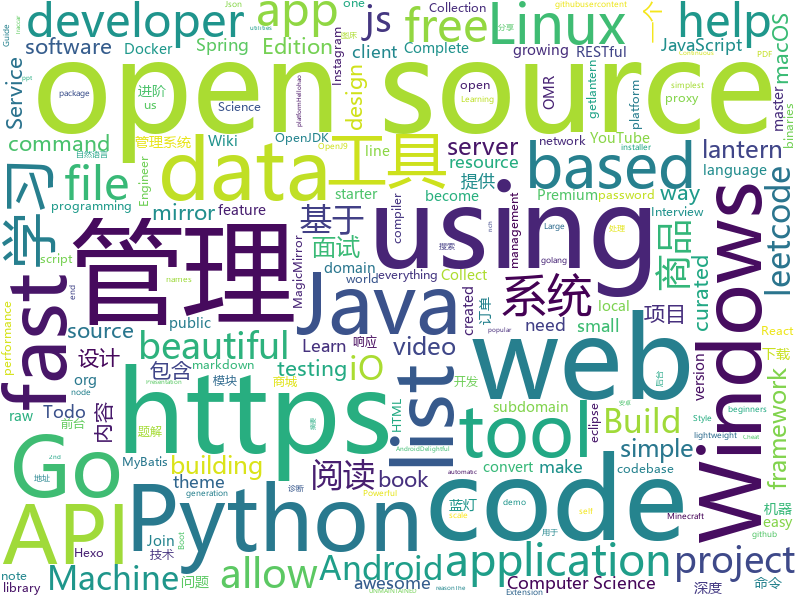

# 2019-08-27
See what the GitHub community is most excited about today.

## python
* [Real-Time-Voice-Cloning](https://github.com/CorentinJ/Real-Time-Voice-Cloning)(**373 stars today**): Clone a voice in 5 seconds to generate arbitrary speech in real-time
* [awesome-python](https://github.com/vinta/awesome-python)(**196 stars today**): A curated list of awesome Python frameworks, libraries, software and resources
* [AutoTimer](https://github.com/KalleHallden/AutoTimer)(**23 stars today**): 
* [100-Days-Of-ML-Code](https://github.com/Avik-Jain/100-Days-Of-ML-Code)(**91 stars today**): 100 Days of ML Coding
* [GPT2-Chinese](https://github.com/Morizeyao/GPT2-Chinese)(**58 stars today**): Chinese version of GPT2 training code, using BERT or BPE tokenizer.
* [youtube-dl](https://github.com/ytdl-org/youtube-dl)(**27 stars today**): Command-line program to download videos from YouTube.com and other video sites
* [Ranger-Deep-Learning-Optimizer](https://github.com/lessw2020/Ranger-Deep-Learning-Optimizer)(**24 stars today**): Ranger - a synergistic optimizer using RAdam (Rectified Adam) and LookAhead in one codebase
* [Shadowrocket-ADBlock-Rules](https://github.com/h2y/Shadowrocket-ADBlock-Rules)(**15 stars today**): 提供多款 Shadowrocket 规则，带广告过滤功能。用于 iOS 未越狱设备选择性地自动翻墙。
* [manim](https://github.com/3b1b/manim)(**37 stars today**): Animation engine for explanatory math videos
* [causalml](https://github.com/uber/causalml)(**42 stars today**): Uplift modeling and causal inference with machine learning algorithms
* [pytorch-vfi-cft](https://github.com/MortenHannemose/pytorch-vfi-cft)(**6 stars today**): Generate slow-motion videos by interpolating more frames
* [dagster](https://github.com/dagster-io/dagster)(**13 stars today**): Dagster is an open-source Python library for building data applications.
* [InstaPy](https://github.com/timgrossmann/InstaPy)(**9 stars today**): 📷Instagram Bot - Tool for automated Instagram interactions
* [seeker](https://github.com/thewhiteh4t/seeker)(**8 stars today**): Accurately Locate Smartphones using Social Engineering
* [gtfo](https://github.com/mzfr/gtfo)(**24 stars today**): Search gtfobins and lolbas files from your terminal
* [ImageAI](https://github.com/OlafenwaMoses/ImageAI)(**18 stars today**): A python library built to empower developers to build applications and systems with self-contained Computer Vision capabilities
* [code_snippets](https://github.com/CoreyMSchafer/code_snippets)(**7 stars today**): 
* [bitcoinbook](https://github.com/bitcoinbook/bitcoinbook)(**7 stars today**): Mastering Bitcoin 2nd Edition - Programming the Open Blockchain
* [oppia](https://github.com/oppia/oppia)(**0 stars today**): Tool for collaboratively building interactive lessons.
* [pygta5](https://github.com/Sentdex/pygta5)(**3 stars today**): Explorations of Using Python to play Grand Theft Auto 5.
* [WeasyPrint](https://github.com/Kozea/WeasyPrint)(**10 stars today**): WeasyPrint converts web documents (HTML with CSS, SVG, …) to PDF.
* [face_recognition](https://github.com/ageitgey/face_recognition)(**49 stars today**): The world's simplest facial recognition api for Python and the command line
* [votenet](https://github.com/facebookresearch/votenet)(**50 stars today**): Deep Hough Voting for 3D Object Detection in Point Clouds
* [fast-style-transfer](https://github.com/lengstrom/fast-style-transfer)(**5 stars today**): TensorFlow CNN for fast style transfer ⚡🖥🎨🖼
* [youtube](https://github.com/engineer-man/youtube)(**8 stars today**): Code from the Engineer Man YouTube channel

## java
* [angel](https://github.com/Angel-ML/angel)(**140 stars today**): A Flexible and Powerful Parameter Server for large-scale machine learning
* [spring-analysis](https://github.com/seaswalker/spring-analysis)(**73 stars today**): Spring源码阅读
* [Mindustry](https://github.com/Anuken/Mindustry)(**7 stars today**): A sandbox tower defense game
* [CS-Notes](https://github.com/CyC2018/CS-Notes)(**106 stars today**): 📚Tech Interview Guide 技术面试必备基础知识、Leetcode 题解、Java、C++、Python、后端面试、操作系统、计算机网络、系统设计
* [runelite](https://github.com/runelite/runelite)(**3 stars today**): Open source Old School RuneScape client
* [SkyStone](https://github.com/FIRST-Tech-Challenge/SkyStone)(**3 stars today**): FTC SDK
* [spring-boot-api-project-seed](https://github.com/lihengming/spring-boot-api-project-seed)(**52 stars today**): 🌱🚀一个基于Spring Boot & MyBatis的种子项目，用于快速构建中小型API、RESTful API项目~
* [DragonProxy](https://github.com/DragonetMC/DragonProxy)(**3 stars today**): A proxy to allow Minecraft: Bedrock clients to connect to Minecraft: Java Edition servers.
* [NewPipe](https://github.com/TeamNewPipe/NewPipe)(**12 stars today**): A libre lightweight streaming front-end for Android.
* [traccar](https://github.com/traccar/traccar)(**2 stars today**): Traccar GPS Tracking System
* [openj9](https://github.com/eclipse/openj9)(**1 stars today**): Eclipse OpenJ9: A Java Virtual Machine for OpenJDK that's optimized for small footprint, fast start-up, and high throughput. Builds on Eclipse OMR (https://github.com/eclipse/omr) and combines with the Extensions for OpenJDK for OpenJ9 repo.
* [interview](https://github.com/mission-peace/interview)(**6 stars today**): Interview questions
* [mall](https://github.com/macrozheng/mall)(**105 stars today**): mall项目是一套电商系统，包括前台商城系统及后台管理系统，基于SpringBoot+MyBatis实现。 前台商城系统包含首页门户、商品推荐、商品搜索、商品展示、购物车、订单流程、会员中心、客户服务、帮助中心等模块。 后台管理系统包含商品管理、订单管理、会员管理、促销管理、运营管理、内容管理、统计报表、财务管理、权限管理、设置等模块。
* [interviews](https://github.com/kdn251/interviews)(**32 stars today**): Everything you need to know to get the job.
* [bistoury](https://github.com/qunarcorp/bistoury)(**74 stars today**): Bistoury是去哪儿网的java应用生产问题诊断工具，提供了一站式的问题诊断方案
* [MyBookshelf](https://github.com/gedoor/MyBookshelf)(**15 stars today**): 阅读是一款可以自定义来源阅读网络内容的工具，为广大网络文学爱好者提供一种方便、快捷舒适的试读体验。
* [Java](https://github.com/TheAlgorithms/Java)(**25 stars today**): All Algorithms implemented in Java
* [appinventor-sources](https://github.com/mit-cml/appinventor-sources)(**2 stars today**): MIT App Inventor Public Open Source
* [jwt-spring-security-demo](https://github.com/szerhusenBC/jwt-spring-security-demo)(**10 stars today**): A small demo for using JWT (Json Web Token) with Spring Security and Spring Boot 2
* [eureka](https://github.com/Netflix/eureka)(**9 stars today**): AWS Service registry for resilient mid-tier load balancing and failover.
* [shopizer](https://github.com/shopizer-ecommerce/shopizer)(**5 stars today**): Shopizer java e-commerce software
* [Conversations](https://github.com/siacs/Conversations)(**7 stars today**): Conversations is an open source XMPP/Jabber client for the Android platform
* [Tbed](https://github.com/Hello-hao/Tbed)(**16 stars today**): Hellohao图床：基于Spingboot开发的响应式图床站、多家对象存储、纯粹的图片存放驿站。http://tc.hellohao.cn
* [markor](https://github.com/gsantner/markor)(**3 stars today**): Text editor - Notes & ToDo (for Android). Supporting Markdown and todo.txt

## unknown
* [Privilege-Escalation](https://github.com/Ignitetechnologies/Privilege-Escalation)(**81 stars today**): This cheasheet is aimed at the CTF Players and Beginners to help them understand the fundamentals of Privilege Escalation with examples.
* [coding-interview-university](https://github.com/jwasham/coding-interview-university)(**241 stars today**): A complete computer science study plan to become a software engineer.
* [Deep-Learning-Interview-Book](https://github.com/amusi/Deep-Learning-Interview-Book)(**89 stars today**): 深度学习面试宝典（含数学、机器学习、深度学习、计算机视觉、自然语言处理和SLAM等方向）
* [Data-Science--Cheat-Sheet](https://github.com/abhat222/Data-Science--Cheat-Sheet)(**29 stars today**): Cheat Sheets
* [developer-roadmap](https://github.com/kamranahmedse/developer-roadmap)(**56 stars today**): Roadmap to becoming a web developer in 2019
* [go](https://github.com/datasciencemasters/go)(**10 stars today**): The Open Source Data Science Masters
* [apple-terminated-my-dev-account](https://github.com/cyanzhong/apple-terminated-my-dev-account)(**48 stars today**): Apple terminated my developer account for no reason
* [The-Economist](https://github.com/nailperry-zd/The-Economist)(**4 stars today**): The Economist 经济学人，持续更新
* [computer-science](https://github.com/ossu/computer-science)(**23 stars today**): 🎓Path to a free self-taught education in Computer Science!
* [Probable-Wordlists](https://github.com/berzerk0/Probable-Wordlists)(**5 stars today**): Version 2 is live! Wordlists sorted by probability originally created for password generation and testing - make sure your passwords aren't popular!
* [English-level-up-tips-for-Chinese](https://github.com/byoungd/English-level-up-tips-for-Chinese)(**29 stars today**): 可能是让你受益匪浅的英语进阶指南
* [Python-programming-exercises](https://github.com/zhiwehu/Python-programming-exercises)(**20 stars today**): 100+ Python challenging programming exercises
* [frontend-dev-bookmarks](https://github.com/dypsilon/frontend-dev-bookmarks)(**4 stars today**): Manually curated collection of resources for frontend web developers.
* [learn-regex](https://github.com/ziishaned/learn-regex)(**326 stars today**): Learn regex the easy way
* [pumpkin-book](https://github.com/datawhalechina/pumpkin-book)(**86 stars today**): 《机器学习》（西瓜书）公式推导解析，在线阅读地址：https://datawhalechina.github.io/pumpkin-book
* [awesome](https://github.com/sindresorhus/awesome)(**76 stars today**): 😎Awesome lists about all kinds of interesting topics
* [Learn_Machine_Learning_in_3_Months](https://github.com/llSourcell/Learn_Machine_Learning_in_3_Months)(**3 stars today**): This is the code for "Learn Machine Learning in 3 Months" by Siraj Raval on Youtube
* [project-based-learning](https://github.com/tuvtran/project-based-learning)(**39 stars today**): Curated list of project-based tutorials
* [download](https://github.com/getlantern/download)(**21 stars today**): 蓝灯Windows下载 https://raw.githubusercontent.com/getlantern/lantern-binaries/master/lantern-installer.exe 蓝灯安卓下载 https://raw.githubusercontent.com/getlantern/lantern-binaries/master/lantern-installer.apk
* [regular-investing-in-box](https://github.com/xiaolai/regular-investing-in-box)(**44 stars today**): 定投改变命运 —— 让时间陪你慢慢变富
* [clash_for_windows_pkg](https://github.com/Fndroid/clash_for_windows_pkg)(**7 stars today**): A Windows GUI based on Clash
* [first-contributions](https://github.com/firstcontributions/first-contributions)(**29 stars today**): 🚀✨Help beginners to contribute to open source projects
* [nlp_chinese_corpus](https://github.com/brightmart/nlp_chinese_corpus)(**16 stars today**): 大规模中文自然语言处理语料 Large Scale Chinese Corpus for NLP
* [You-Dont-Know-JS](https://github.com/getify/You-Dont-Know-JS)(**73 stars today**): A book series on JavaScript. @YDKJS on twitter.
* [download](https://github.com/getfotiaoqiang/download)(**1 stars today**): 佛跳墙下载页

## javascript
* [MagicMirror](https://github.com/MichMich/MagicMirror)(**95 stars today**): MagicMirror² is an open source modular smart mirror platform. With a growing list of installable modules, the MagicMirror² allows you to convert your hallway or bathroom mirror into your personal assistant.
* [bank](https://github.com/pietrzakadrian/bank)(**169 stars today**): Full Stack Web Application using ReactJS+Redux with NodeJS (Express+TypeORM), WebSocket, RESTful API and MySQL
* [standard](https://github.com/standard/standard)(**142 stars today**): 🌟JavaScript Style Guide, with linter & automatic code fixer
* [the-super-tiny-compiler](https://github.com/jamiebuilds/the-super-tiny-compiler)(**143 stars today**): ⛄️Possibly the smallest compiler ever
* [freeCodeCamp](https://github.com/freeCodeCamp/freeCodeCamp)(**68 stars today**): The https://www.freeCodeCamp.org open source codebase and curriculum. Learn to code for free together with millions of people.
* [awesome-mac](https://github.com/jaywcjlove/awesome-mac)(**129 stars today**):  Now we have become very big, Different from the original idea. Collect premium software in various categories.
* [leetcode](https://github.com/azl397985856/leetcode)(**188 stars today**): LeetCode Solutions: A Record of My Problem Solving Journey.( leetcode题解，记录自己的leetcode解题之路。)
* [outline](https://github.com/outline/outline)(**82 stars today**): The fastest wiki and knowledge base for growing teams. Beautiful, feature rich, markdown compatible and open source.
* [MikuTools](https://github.com/Ice-Hazymoon/MikuTools)(**57 stars today**): 一个轻量的工具集合
* [todomvc](https://github.com/tastejs/todomvc)(**6 stars today**): Helping you select an MV* framework - Todo apps for React.js, Ember.js, Angular, and many more
* [node-express-realworld-example-app](https://github.com/gothinkster/node-express-realworld-example-app)(**4 stars today**): 
* [termpage](https://github.com/tautvilas/termpage)(**31 stars today**): Termpage allows you to create neat functional webpages that behave like a terminal
* [iptv](https://github.com/freearhey/iptv)(**20 stars today**): Collection of 6000+ publicly available IPTV channels from all over the world.
* [thegreatsuspender](https://github.com/deanoemcke/thegreatsuspender)(**34 stars today**): A chrome extension for suspending all tabs to free up memory
* [listen1_desktop](https://github.com/listen1/listen1_desktop)(**7 stars today**): one for all free music in china (Windows, Mac, Linux desktop)
* [joplin](https://github.com/laurent22/joplin)(**15 stars today**): Joplin - a note taking and to-do application with synchronization capabilities for Windows, macOS, Linux, Android and iOS. Forum: https://discourse.joplinapp.org/
* [wxappUnpacker](https://github.com/qwerty472123/wxappUnpacker)(**11 stars today**): Wechat App(微信小程序,.wxapkg)解包及相关文件(.wxss,.json,.wxs,.wxml)还原工具
* [csgo-crash-exploit](https://github.com/BeepFelix/csgo-crash-exploit)(**6 stars today**): Allows you to crash any Windows user
* [gatsby-starter-blog](https://github.com/gatsbyjs/gatsby-starter-blog)(**5 stars today**): Gatsby starter for creating a blog
* [react-native](https://github.com/facebook/react-native)(**39 stars today**): A framework for building native apps with React.
* [complete-node-bootcamp](https://github.com/jonasschmedtmann/complete-node-bootcamp)(**4 stars today**): Starter files, final projects and FAQ for my Complete Node.js Bootcamp
* [reveal.js](https://github.com/hakimel/reveal.js)(**33 stars today**): The HTML Presentation Framework
* [discord-api-docs](https://github.com/discordapp/discord-api-docs)(**3 stars today**): Official Discord API Documentation
* [brave-browser](https://github.com/brave/brave-browser)(**23 stars today**): Next generation Brave browser for macOS, Windows, Linux, and eventually Android
* [jest](https://github.com/facebook/jest)(**23 stars today**): Delightful JavaScript Testing.

## html
* [REKCARC-TSC-UHT](https://github.com/PKUanonym/REKCARC-TSC-UHT)(**19 stars today**): 清华大学计算机系课程攻略 Guidance for courses in Department of Computer Science and Technology, Tsinghua University
* [ppts](https://github.com/iv-web/ppts)(**19 stars today**): 团队对外分享ppt
* [beautiful-jekyll](https://github.com/daattali/beautiful-jekyll)(**4 stars today**): ✨Build a beautiful and simple website in literally minutes. Demo at http://deanattali.com/beautiful-jekyll
* [ctf-wiki](https://github.com/ctf-wiki/ctf-wiki)(**2 stars today**): CTF Wiki Online. Come and join us, we need you!
* [blog_os](https://github.com/phil-opp/blog_os)(**1 stars today**): Writing an OS in Rust
* [Sudomy](https://github.com/Screetsec/Sudomy)(**6 stars today**): Sudomy is a subdomain enumeration tool, created using a bash script, to analyze domains and collect subdomains in fast and comprehensive way ( Easy, light, fast and powerful )
* [open-quant-live-book](https://github.com/souzatharsis/open-quant-live-book)(**1 stars today**): An open source, hands-on and fully reproducible book in quantitative finance, data science and econophysics. Join us and help Make Wall Street Great Again!
* [Dism-Multi-language](https://github.com/Chuyu-Team/Dism-Multi-language)(**4 stars today**): Dism++ Multi-language Support & BUG Report
* [android_interview](https://github.com/LRH1993/android_interview)(**0 stars today**): gitbook地址
* [FantasyFootballAnalyticsR](https://github.com/FantasyFootballAnalytics/FantasyFootballAnalyticsR)(**0 stars today**): R scripts and data files for the Fantasy Football Analytics website
* [DnDAppFiles](https://github.com/ceryliae/DnDAppFiles)(**0 stars today**): Files for the Fifth Edition apps by Lion's Den
* [Java-Interview-Advanced](https://github.com/shishan100/Java-Interview-Advanced)(**6 stars today**): 中华石杉--互联网Java进阶面试训练营
* [country-list](https://github.com/umpirsky/country-list)(**0 stars today**): 🌐List of all countries with names and ISO 3166-1 codes in all languages and data formats.
* [linux-command](https://github.com/jaywcjlove/linux-command)(**18 stars today**): Linux命令大全搜索工具，内容包含Linux命令手册、详解、学习、搜集。https://git.io/linux
* [hexo-theme-matery](https://github.com/blinkfox/hexo-theme-matery)(**7 stars today**): A beautiful hexo blog theme with material design and responsive design.一个基于材料设计和响应式设计而成的全面、美观的Hexo主题。
* [AdminLTE](https://github.com/ColorlibHQ/AdminLTE)(**16 stars today**): AdminLTE - Free Premium Admin control Panel Theme Based On Bootstrap 3.x
* [gohugo-theme-ananke](https://github.com/budparr/gohugo-theme-ananke)(**2 stars today**): Ananke: A theme for Hugo Sites
* [java-bible](https://github.com/biezhi/java-bible)(**1 stars today**): 🍌我的技术摘要
* [webdevbootcamp](https://github.com/nax3t/webdevbootcamp)(**4 stars today**): All source code for back-end projects from the Web Developer Bootcamp
* [awesome-piracy](https://github.com/Igglybuff/awesome-piracy)(**4 stars today**): A curated list of awesome warez and piracy links
* [InOneWeekend](https://github.com/RayTracing/InOneWeekend)(**3 stars today**): The source for the ebook Ray Tracing in One Weekend by Peter Shirley. This work is in the public domain.
* [pdfs](https://github.com/tpn/pdfs)(**2 stars today**): Technically-oriented PDF Collection (Papers, Specs, Decks, Manuals, etc)
* [Keka](https://github.com/aonez/Keka)(**2 stars today**): The macOS file archiver
* [18.06-linalg-notes](https://github.com/apachecn/18.06-linalg-notes)(**3 stars today**): MIT-18.06-线性代数-完整笔记
* [awesome-creative-coding](https://github.com/terkelg/awesome-creative-coding)(**3 stars today**): Creative Coding: Generative Art, Data visualization, Interaction Design, Resources.

## go
* [tinygo](https://github.com/tinygo-org/tinygo)(**39 stars today**): Go compiler for small places. Microcontrollers, WebAssembly, and command-line tools. Based on LLVM.
* [vault](https://github.com/hashicorp/vault)(**14 stars today**): A tool for secrets management, encryption as a service, and privileged access management
* [annie](https://github.com/iawia002/annie)(**66 stars today**): 👾Fast, simple and clean video downloader
* [kind](https://github.com/kubernetes-sigs/kind)(**22 stars today**): Kubernetes IN Docker - local clusters for testing Kubernetes
* [webhook](https://github.com/adnanh/webhook)(**13 stars today**): webhook is a lightweight incoming webhook server to run shell commands
* [mkcert](https://github.com/FiloSottile/mkcert)(**26 stars today**): A simple zero-config tool to make locally trusted development certificates with any names you'd like.
* [v2ray-core](https://github.com/v2ray/v2ray-core)(**31 stars today**): A platform for building proxies to bypass network restrictions.
* [golang123](https://github.com/shen100/golang123)(**3 stars today**): golang123 是使用 vue、nuxt、node.js 和 golang 开发的知识分享系统
* [ecs](https://github.com/elastic/ecs)(**7 stars today**): Elastic Common Schema
* [gin](https://github.com/gin-gonic/gin)(**40 stars today**): Gin is a HTTP web framework written in Go (Golang). It features a Martini-like API with much better performance -- up to 40 times faster. If you need smashing performance, get yourself some Gin.
* [kpack](https://github.com/pivotal/kpack)(**13 stars today**): Build Service resource controllers
* [torrent](https://github.com/anacrolix/torrent)(**13 stars today**): Full-featured BitTorrent-client package and utilities
* [BaiduPCS-Go](https://github.com/iikira/BaiduPCS-Go)(**19 stars today**): 百度网盘客户端 - Go语言编写
* [chaosmonkey](https://github.com/Netflix/chaosmonkey)(**11 stars today**): Chaos Monkey is a resiliency tool that helps applications tolerate random instance failures.
* [ai-simplest-network](https://github.com/gokadin/ai-simplest-network)(**5 stars today**): The simplest form of an artificial neural network explained and demonstrated.
* [frp](https://github.com/fatedier/frp)(**63 stars today**): A fast reverse proxy to help you expose a local server behind a NAT or firewall to the internet.
* [clash](https://github.com/Dreamacro/clash)(**11 stars today**): A rule-based tunnel in Go.
* [atlas](https://github.com/stellarproject/atlas)(**9 stars today**): Simple DNS Service
* [lumberjack](https://github.com/natefinch/lumberjack)(**6 stars today**): lumberjack is a log rolling package for Go
* [gofumpt](https://github.com/mvdan/gofumpt)(**20 stars today**): A stricter gofmt
* [mgo](https://github.com/go-mgo/mgo)(**4 stars today**): The MongoDB driver for Go. UNMAINTAINED - SEE BELOW
* [goquery](https://github.com/PuerkitoBio/goquery)(**10 stars today**): A little like that j-thing, only in Go.
* [sync](https://github.com/golang/sync)(**2 stars today**): [mirror] concurrency primitives
* [syncthing](https://github.com/syncthing/syncthing)(**17 stars today**): Open Source Continuous File Synchronization
* [lazydocker](https://github.com/jesseduffield/lazydocker)(**24 stars today**): The lazier way to manage everything docker

## WordCloud

