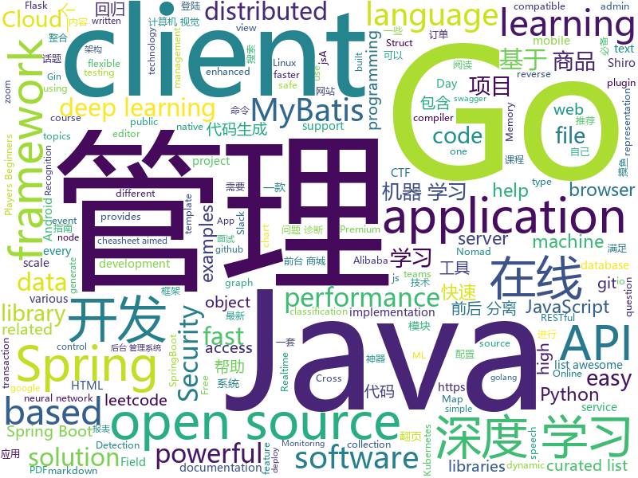

# 2019-08-28
See what the GitHub community is most excited about today.

## python
* [100-Days-Of-ML-Code](https://github.com/Avik-Jain/100-Days-Of-ML-Code)(**122 stars today**): 100 Days of ML Coding
* [cowrie](https://github.com/cowrie/cowrie)(**43 stars today**): Cowrie SSH/Telnet Honeypot http://cowrie.readthedocs.io
* [models](https://github.com/tensorflow/models)(**79 stars today**): Models and examples built with TensorFlow
* [google-cloud-python](https://github.com/googleapis/google-cloud-python)(**6 stars today**): Google Cloud Client Library for Python
* [awesome-python](https://github.com/vinta/awesome-python)(**110 stars today**): A curated list of awesome Python frameworks, libraries, software and resources
* [gtfo](https://github.com/mzfr/gtfo)(**11 stars today**): Search gtfobins and lolbas files from your terminal
* [tensor2tensor](https://github.com/tensorflow/tensor2tensor)(**11 stars today**): Library of deep learning models and datasets designed to make deep learning more accessible and accelerate ML research.
* [Real-Time-Voice-Cloning](https://github.com/CorentinJ/Real-Time-Voice-Cloning)(**383 stars today**): Clone a voice in 5 seconds to generate arbitrary speech in real-time
* [Ranger-Deep-Learning-Optimizer](https://github.com/lessw2020/Ranger-Deep-Learning-Optimizer)(**26 stars today**): Ranger - a synergistic optimizer using RAdam (Rectified Adam) and LookAhead in one codebase
* [pandas](https://github.com/pandas-dev/pandas)(**25 stars today**): Flexible and powerful data analysis / manipulation library for Python, providing labeled data structures similar to R data.frame objects, statistical functions, and much more
* [celery](https://github.com/celery/celery)(**8 stars today**): Distributed Task Queue (development branch)
* [AutoTimer](https://github.com/KalleHallden/AutoTimer)(**16 stars today**): 
* [causalml](https://github.com/uber/causalml)(**21 stars today**): Uplift modeling and causal inference with machine learning algorithms
* [tvm](https://github.com/dmlc/tvm)(**9 stars today**): Open deep learning compiler stack for cpu, gpu and specialized accelerators
* [adaptive-span](https://github.com/facebookresearch/adaptive-span)(**11 stars today**): Adaptive Attention Span in Transformers
* [ignite](https://github.com/pytorch/ignite)(**7 stars today**): High-level library to help with training neural networks in PyTorch
* [votenet](https://github.com/facebookresearch/votenet)(**16 stars today**): Deep Hough Voting for 3D Object Detection in Point Clouds
* [deep_sort](https://github.com/nwojke/deep_sort)(**2 stars today**): Simple Online Realtime Tracking with a Deep Association Metric
* [awesome-python-login-model](https://github.com/Kr1s77/awesome-python-login-model)(**53 stars today**): 😮python模拟登陆一些大型网站，还有一些简单的爬虫，希望对你们有所帮助❤️，如果喜欢记得给个star哦🌟
* [microblog](https://github.com/miguelgrinberg/microblog)(**1 stars today**): A microblogging web application written in Python and Flask that I developed as part of my Flask Mega-Tutorial series.
* [ssd.pytorch](https://github.com/amdegroot/ssd.pytorch)(**6 stars today**): A PyTorch Implementation of Single Shot MultiBox Detector
* [gensim](https://github.com/RaRe-Technologies/gensim)(**6 stars today**): Topic Modelling for Humans
* [requests](https://github.com/psf/requests)(**17 stars today**): Python HTTP Requests for Humans™✨🍰✨
* [ASRT_SpeechRecognition](https://github.com/nl8590687/ASRT_SpeechRecognition)(**11 stars today**): A Deep-Learning-Based Chinese Speech Recognition System 基于深度学习的中文语音识别系统
* [Mask_RCNN](https://github.com/matterport/Mask_RCNN)(**22 stars today**): Mask R-CNN for object detection and instance segmentation on Keras and TensorFlow

## java
* [angel](https://github.com/Angel-ML/angel)(**120 stars today**): A Flexible and Powerful Parameter Server for large-scale machine learning
* [spring-boot-api-project-seed](https://github.com/lihengming/spring-boot-api-project-seed)(**83 stars today**): 🌱🚀一个基于Spring Boot & MyBatis的种子项目，用于快速构建中小型API、RESTful API项目~
* [jeecg-boot](https://github.com/zhangdaiscott/jeecg-boot)(**66 stars today**): 一款基于代码生成器的JAVA快速开发平台！采用最新技术，前后端分离架构：SpringBoot 2.x，Ant Design&Vue，Mybatis，Shiro，JWT。强大的代码生成器让前后端代码一键生成，无需写任何代码，绝对是全栈开发福音！！ JeecgBoot的宗旨是提高UI能力的同时,降低前后分离的开发成本，JeecgBoot还独创在线开发模式，No代码概念，一系列在线智能开发：在线配置表单、在线配置报表、在线设计流程等等。
* [mall](https://github.com/macrozheng/mall)(**63 stars today**): mall项目是一套电商系统，包括前台商城系统及后台管理系统，基于SpringBoot+MyBatis实现。 前台商城系统包含首页门户、商品推荐、商品搜索、商品展示、购物车、订单流程、会员中心、客户服务、帮助中心等模块。 后台管理系统包含商品管理、订单管理、会员管理、促销管理、运营管理、内容管理、统计报表、财务管理、权限管理、设置等模块。
* [spring-analysis](https://github.com/seaswalker/spring-analysis)(**68 stars today**): Spring源码阅读
* [retrofit](https://github.com/square/retrofit)(**16 stars today**): Type-safe HTTP client for Android and Java by Square, Inc.
* [hope-boot](https://github.com/hope-for/hope-boot)(**40 stars today**): 🌱🚀一款现代化的脚手架项目。企业开发？接外包？赚外快？还是学习？这都能满足你，居家必备，值得拥有🍻整合Springboot2，单点登陆+tk.mybatis+shiro+redis+thymeleaf+maven+swagger前后端分离接口管理+代码生成+定时任务+数据库版本管理flyway+hutool工具包，等实用技术。
* [bistoury](https://github.com/qunarcorp/bistoury)(**68 stars today**): Bistoury是去哪儿网的java应用生产问题诊断工具，提供了一站式的问题诊断方案
* [strimzi-kafka-operator](https://github.com/strimzi/strimzi-kafka-operator)(**0 stars today**): Apache Kafka running on Kubernetes and OpenShift
* [skywalking](https://github.com/apache/skywalking)(**23 stars today**): APM, Application Performance Monitoring System
* [spring-cloud-alibaba](https://github.com/alibaba/spring-cloud-alibaba)(**37 stars today**): Spring Cloud Alibaba provides a one-stop solution for application development for the distributed solutions of Alibaba middleware.
* [mybatis-plus](https://github.com/baomidou/mybatis-plus)(**21 stars today**): An powerful enhanced toolkit of MyBatis for simplify development
* [mybatis-plus-samples](https://github.com/baomidou/mybatis-plus-samples)(**8 stars today**): MyBatis-Plus Samples
* [tutorials](https://github.com/eugenp/tutorials)(**27 stars today**): The "REST With Spring" Course:
* [zuul](https://github.com/Netflix/zuul)(**4 stars today**): Zuul is a gateway service that provides dynamic routing, monitoring, resiliency, security, and more.
* [JavaGuide](https://github.com/Snailclimb/JavaGuide)(**141 stars today**): 【Java学习+面试指南】 一份涵盖大部分Java程序员所需要掌握的核心知识。
* [hazelcast](https://github.com/hazelcast/hazelcast)(**12 stars today**): Open Source In-Memory Data Grid
* [seata](https://github.com/seata/seata)(**36 stars today**): 🔥Seata is an easy-to-use, high-performance, open source distributed transaction solution.
* [MVVMHabit](https://github.com/goldze/MVVMHabit)(**12 stars today**): 👕基于谷歌最新AAC架构，MVVM设计模式的一套快速开发库，整合Okhttp+RxJava+Retrofit+Glide等主流模块，满足日常开发需求。使用该框架可以快速开发一个高质量、易维护的Android应用。
* [tx-lcn](https://github.com/codingapi/tx-lcn)(**12 stars today**): LCN distributed transaction framework, compatible with dubbo, spring cloud and Motan framework, supports various relational databases
* [SpringAll](https://github.com/wuyouzhuguli/SpringAll)(**40 stars today**): 循序渐进，学习Spring Boot、Spring Boot & Shiro、Spring Cloud、Spring Security & Spring Security OAuth2，博客Spring系列源码
* [keycloak](https://github.com/keycloak/keycloak)(**7 stars today**): Open Source Identity and Access Management For Modern Applications and Services
* [antlr4](https://github.com/antlr/antlr4)(**7 stars today**): ANTLR (ANother Tool for Language Recognition) is a powerful parser generator for reading, processing, executing, or translating structured text or binary files.
* [MPAndroidChart](https://github.com/PhilJay/MPAndroidChart)(**14 stars today**): A powerful🚀Android chart view / graph view library, supporting line- bar- pie- radar- bubble- and candlestick charts as well as scaling, dragging and animations.
* [shopizer](https://github.com/shopizer-ecommerce/shopizer)(**6 stars today**): Shopizer java e-commerce software

## unknown
* [pumpkin-book](https://github.com/datawhalechina/pumpkin-book)(**102 stars today**): 《机器学习》（西瓜书）公式推导解析，在线阅读地址：https://datawhalechina.github.io/pumpkin-book
* [awesome-graph-classification](https://github.com/benedekrozemberczki/awesome-graph-classification)(**51 stars today**): A collection of important graph embedding, classification and representation learning papers with implementations.
* [Privilege-Escalation](https://github.com/Ignitetechnologies/Privilege-Escalation)(**163 stars today**): This cheasheet is aimed at the CTF Players and Beginners to help them understand the fundamentals of Privilege Escalation with examples.
* [TL-TROJAN](https://github.com/threatland/TL-TROJAN)(**49 stars today**): A collection of source code for various RATs, Stealers, and other Trojans.
* [Behinder](https://github.com/rebeyond/Behinder)(**10 stars today**): “冰蝎”动态二进制加密网站管理客户端
* [Awesome-design-tools](https://github.com/phh95/Awesome-design-tools)(**140 stars today**): 
* [Data-Science--Cheat-Sheet](https://github.com/abhat222/Data-Science--Cheat-Sheet)(**17 stars today**): Cheat Sheets
* [Deep-Learning-Interview-Book](https://github.com/amusi/Deep-Learning-Interview-Book)(**36 stars today**): 深度学习面试宝典（含数学、机器学习、深度学习、计算机视觉、自然语言处理和SLAM等方向）
* [go-advanced](https://github.com/zalopay-oss/go-advanced)(**23 stars today**): A small Vietnamese Go book compiled by ZaloPay teams.
* [weekly](https://github.com/dt-fe/weekly)(**40 stars today**): 前端精读周刊
* [CTF-Difficulty](https://github.com/Ignitetechnologies/CTF-Difficulty)(**25 stars today**): This cheasheet is aimed at the CTF Players and Beginners to help them sort the CTF Challenges on the basis of Difficulties.
* [English-level-up-tips-for-Chinese](https://github.com/byoungd/English-level-up-tips-for-Chinese)(**13 stars today**): 可能是让你受益匪浅的英语进阶指南
* [Best-App](https://github.com/hzlzh/Best-App)(**5 stars today**): 收集&推荐优秀的 Apps/硬件/技巧/周边等
* [awesome-production-machine-learning](https://github.com/EthicalML/awesome-production-machine-learning)(**12 stars today**): A curated list of awesome open source libraries to deploy, monitor, version and scale your machine learning
* [sysmon-config](https://github.com/SwiftOnSecurity/sysmon-config)(**5 stars today**): Sysmon configuration file template with default high-quality event tracing
* [awesome-java](https://github.com/akullpp/awesome-java)(**22 stars today**): A curated list of awesome frameworks, libraries and software for the Java programming language.
* [summer2020internships](https://github.com/elaine-zheng/summer2020internships)(**14 stars today**): Keep track of internships for Summer 2020 for undergraduates interested in tech./SWE/related fields
* [javascript-questions](https://github.com/lydiahallie/javascript-questions)(**30 stars today**): A long list of (advanced) JavaScript questions, and their explanations✨Updated weekly!
* [what-happens-when](https://github.com/alex/what-happens-when)(**10 stars today**): An attempt to answer the age old interview question "What happens when you type google.com into your browser and press enter?"
* [git-flight-rules](https://github.com/k88hudson/git-flight-rules)(**18 stars today**): Flight rules for git
* [regular-investing-in-box](https://github.com/xiaolai/regular-investing-in-box)(**33 stars today**): 定投改变命运 —— 让时间陪你慢慢变富
* [AZ-103-MicrosoftAzureAdministrator](https://github.com/MicrosoftLearning/AZ-103-MicrosoftAzureAdministrator)(**2 stars today**): AZ-103: Microsoft Azure Administrator
* [trackerslist](https://github.com/ngosang/trackerslist)(**24 stars today**): Updated list of public BitTorrent trackers
* [DeepLearning-500-questions](https://github.com/scutan90/DeepLearning-500-questions)(**34 stars today**): 深度学习500问，以问答形式对常用的概率知识、线性代数、机器学习、深度学习、计算机视觉等热点问题进行阐述，以帮助自己及有需要的读者。 全书分为18个章节，50余万字。由于水平有限，书中不妥之处恳请广大读者批评指正。 未完待续............ 如有意合作，联系scutjy2015@163.com 版权所有，违权必究 Tan 2018.06
* [OnJava8](https://github.com/LingCoder/OnJava8)(**38 stars today**): 《On Java 8》中文版，又名《Java编程思想》 第5版

## javascript
* [outline](https://github.com/outline/outline)(**180 stars today**): The fastest wiki and knowledge base for growing teams. Beautiful, feature rich, markdown compatible and open source.
* [awesome-mac](https://github.com/jaywcjlove/awesome-mac)(**190 stars today**):  Now we have become very big, Different from the original idea. Collect premium software in various categories.
* [leetcode](https://github.com/azl397985856/leetcode)(**161 stars today**): LeetCode Solutions: A Record of My Problem Solving Journey.( leetcode题解，记录自己的leetcode解题之路。)
* [composition-api](https://github.com/vuejs/composition-api)(**23 stars today**): Vue2 plugin for the Composition API.
* [tfjs-examples](https://github.com/tensorflow/tfjs-examples)(**12 stars today**): Examples built with TensorFlow.js
* [Mellow](https://github.com/eycorsican/Mellow)(**11 stars today**): A V2Ray client that can handle all TCP/UDP/ICMP traffic.
* [complete-javascript-course](https://github.com/jonasschmedtmann/complete-javascript-course)(**12 stars today**): Starter files, final projects and FAQ for my Complete JavaScript course
* [bank](https://github.com/pietrzakadrian/bank)(**104 stars today**): Full Stack Web Application using ReactJS+Redux with NodeJS (Express+TypeORM), WebSocket, RESTful API and MySQL
* [funding](https://github.com/feross/funding)(**21 stars today**): Let's get open source maintainers paid✨
* [MikuTools](https://github.com/Ice-Hazymoon/MikuTools)(**21 stars today**): 一个轻量的工具集合
* [monaco-editor](https://github.com/microsoft/monaco-editor)(**32 stars today**): A browser based code editor
* [the-super-tiny-compiler](https://github.com/jamiebuilds/the-super-tiny-compiler)(**69 stars today**): ⛄️Possibly the smallest compiler ever
* [standard](https://github.com/standard/standard)(**75 stars today**): 🌟JavaScript Style Guide, with linter & automatic code fixer
* [Thief-Book](https://github.com/cteamx/Thief-Book)(**26 stars today**): 一款可以在任务栏、桌面、TouchBar上进行摸鱼的最强的跨平台摸鱼神器，支持小说、股票、按键翻页、鼠标翻页、自动翻页让你体验不同的工作 996，上班族必备神器
* [axios](https://github.com/axios/axios)(**59 stars today**): Promise based HTTP client for the browser and node.js
* [Boostnote](https://github.com/BoostIO/Boostnote)(**35 stars today**): A markdown editor for developers on Mac, Windows and Linux.
* [github-do-not-ban-us](https://github.com/1995parham/github-do-not-ban-us)(**21 stars today**): GitHub do not ban us from open source world🇮🇷
* [react-redux](https://github.com/reduxjs/react-redux)(**12 stars today**): Official React bindings for Redux
* [mapbox-gl-js](https://github.com/mapbox/mapbox-gl-js)(**6 stars today**): Interactive, thoroughly customizable maps in the browser, powered by vector tiles and WebGL
* [graphql-engine](https://github.com/hasura/graphql-engine)(**21 stars today**): Blazing fast, instant realtime GraphQL APIs on Postgres with fine grained access control, also trigger webhooks on database events.
* [netron](https://github.com/lutzroeder/netron)(**19 stars today**): Visualizer for neural network, deep learning and machine learning models
* [octicons](https://github.com/primer/octicons)(**18 stars today**): A scalable set of icons handcrafted with <3 by GitHub
* [jsPDF](https://github.com/MrRio/jsPDF)(**16 stars today**): Client-side JavaScript PDF generation for everyone.
* [fullPage.js](https://github.com/alvarotrigo/fullPage.js)(**43 stars today**): fullPage plugin by Alvaro Trigo. Create full screen pages fast and simple
* [video.js](https://github.com/videojs/video.js)(**14 stars today**): Video.js - open source HTML5 & Flash video player

## html
* [speedtest](https://github.com/adolfintel/speedtest)(**10 stars today**): Self-hosted HTML5 Speedtest. Easy setup, examples, configurable, mobile friendly. Supports PHP, Node, Multiple servers, and more
* [linux-command](https://github.com/jaywcjlove/linux-command)(**20 stars today**): Linux命令大全搜索工具，内容包含Linux命令手册、详解、学习、搜集。https://git.io/linux
* [ChineseNLP](https://github.com/didi/ChineseNLP)(**8 stars today**): Datasets, SOTA results of every fields of Chinese NLP
* [fastText](https://github.com/facebookresearch/fastText)(**20 stars today**): Library for fast text representation and classification.
* [REKCARC-TSC-UHT](https://github.com/PKUanonym/REKCARC-TSC-UHT)(**22 stars today**): 清华大学计算机系课程攻略 Guidance for courses in Department of Computer Science and Technology, Tsinghua University
* [JavaScript30](https://github.com/wesbos/JavaScript30)(**9 stars today**): 30 Day Vanilla JS Challenge
* [fluxion](https://github.com/FluxionNetwork/fluxion)(**4 stars today**): Fluxion is a remake of linset by vk496 with less bugs and enhanced functionality.
* [responsive-html-email-template](https://github.com/leemunroe/responsive-html-email-template)(**5 stars today**): A free simple responsive HTML email template
* [kubernetes-failure-stories](https://github.com/hjacobs/kubernetes-failure-stories)(**4 stars today**): Compilation of public failure/horror stories related to Kubernetes
* [website](https://github.com/kubernetes/website)(**3 stars today**): Kubernetes website and documentation repo:
* [AdminLTE](https://github.com/ColorlibHQ/AdminLTE)(**23 stars today**): AdminLTE - Free Premium Admin control Panel Theme Based On Bootstrap 3.x
* [polyfills](https://github.com/webcomponents/polyfills)(**2 stars today**): Webcomponents polyfills monorepo
* [Machine-Learning](https://github.com/Jack-Cherish/Machine-Learning)(**3 stars today**): ⚡️机器学习实战（Python3）：kNN、决策树、贝叶斯、逻辑回归、SVM、线性回归、树回归
* [patchwork](https://github.com/jlord/patchwork)(**0 stars today**): All the Git-it Workshop completers!
* [embeddedsw](https://github.com/Xilinx/embeddedsw)(**0 stars today**): Xilinx Embedded Software (embeddedsw) Development
* [glTF](https://github.com/KhronosGroup/glTF)(**1 stars today**): glTF – Runtime 3D Asset Delivery
* [owasp-mstg](https://github.com/OWASP/owasp-mstg)(**3 stars today**): The Mobile Security Testing Guide (MSTG) is a comprehensive manual for mobile app security development, testing and reverse engineering.
* [phantomjs](https://github.com/ariya/phantomjs)(**3 stars today**): Scriptable Headless Browser
* [book](https://github.com/PaddlePaddle/book)(**2 stars today**): Deep Learning 101 with PaddlePaddle （『飞桨』深度学习框架入门教程）
* [docs](https://github.com/knative/docs)(**1 stars today**): User documentation for Knative components
* [ecma262](https://github.com/tc39/ecma262)(**5 stars today**): Status, process, and documents for ECMA-262
* [swagger-codegen](https://github.com/swagger-api/swagger-codegen)(**7 stars today**): swagger-codegen contains a template-driven engine to generate documentation, API clients and server stubs in different languages by parsing your OpenAPI / Swagger definition.
* [pdf2htmlEX](https://github.com/coolwanglu/pdf2htmlEX)(**2 stars today**): Convert PDF to HTML without losing text or format.
* [RestApiTutorial.com](https://github.com/tfredrich/RestApiTutorial.com)(**0 stars today**): HTML Source code for www.RestApiTutorial.com
* [deeplearning_ai_books](https://github.com/fengdu78/deeplearning_ai_books)(**13 stars today**): deeplearning.ai（吴恩达老师的深度学习课程笔记及资源）

## go
* [gin](https://github.com/gin-gonic/gin)(**101 stars today**): Gin is a HTTP web framework written in Go (Golang). It features a Martini-like API with much better performance -- up to 40 times faster. If you need smashing performance, get yourself some Gin.
* [vault](https://github.com/hashicorp/vault)(**55 stars today**): A tool for secrets management, encryption as a service, and privileged access management
* [logrus](https://github.com/sirupsen/logrus)(**17 stars today**): Structured, pluggable logging for Go.
* [aws-sdk-go](https://github.com/aws/aws-sdk-go)(**2 stars today**): AWS SDK for the Go programming language.
* [annie](https://github.com/iawia002/annie)(**50 stars today**): 👾Fast, simple and clean video downloader
* [grpc-go](https://github.com/grpc/grpc-go)(**12 stars today**): The Go language implementation of gRPC. HTTP/2 based RPC
* [redis](https://github.com/go-redis/redis)(**24 stars today**): Type-safe Redis client for Golang
* [compress](https://github.com/klauspost/compress)(**8 stars today**): Optimized compression packages
* [fasthttp](https://github.com/valyala/fasthttp)(**14 stars today**): Fast HTTP package for Go. Tuned for high performance. Zero memory allocations in hot paths. Up to 10x faster than net/http
* [reading-go](https://github.com/developer-learning/reading-go)(**13 stars today**): Go 夜读 > Share the related technical topics of Go every week through zoom online live broadcast, every day on the WeChat/Slack to communicate programming technology topics. 每周通过 zoom 在线直播的方式分享 Go 相关的技术话题，每天大家在微信/Slack 上及时沟通交流编程技术话题。
* [validator](https://github.com/go-playground/validator)(**18 stars today**): 💯Go Struct and Field validation, including Cross Field, Cross Struct, Map, Slice and Array diving
* [redigo](https://github.com/gomodule/redigo)(**11 stars today**): Go client for Redis
* [elastic](https://github.com/olivere/elastic)(**6 stars today**): Elasticsearch client for Go.
* [chi](https://github.com/go-chi/chi)(**8 stars today**): lightweight, idiomatic and composable router for building Go HTTP services
* [consul](https://github.com/hashicorp/consul)(**13 stars today**): Consul is a distributed, highly available, and data center aware solution to connect and configure applications across dynamic, distributed infrastructure.
* [go-sqlmock](https://github.com/DATA-DOG/go-sqlmock)(**5 stars today**): Sql mock driver for golang to test database interactions
* [kpack](https://github.com/pivotal/kpack)(**13 stars today**): Build Service resource controllers
* [protobuf](https://github.com/golang/protobuf)(**9 stars today**): Go support for Google's protocol buffers
* [kubeedge](https://github.com/kubeedge/kubeedge)(**8 stars today**): Kubernetes Native Edge Computing Framework (project under CNCF)
* [nomad](https://github.com/hashicorp/nomad)(**4 stars today**): Nomad is an easy-to-use, flexible, and performant workload orchestrator that can deploy a mix of microservice, batch, containerized, and non-containerized applications. Nomad is easy to operate and scale and has native Consul and Vault integrations.
* [kops](https://github.com/kubernetes/kops)(**2 stars today**): Kubernetes Operations (kops) - Production Grade K8s Installation, Upgrades, and Management
* [frp](https://github.com/fatedier/frp)(**41 stars today**): A fast reverse proxy to help you expose a local server behind a NAT or firewall to the internet.
* [fabric](https://github.com/hyperledger/fabric)(**5 stars today**): Read-only mirror of https://gerrit.hyperledger.org/r/#/admin/projects/fabric
* [runtime](https://github.com/kata-containers/runtime)(**5 stars today**): Kata Containers runtime
* [ecs](https://github.com/elastic/ecs)(**5 stars today**): Elastic Common Schema

## WordCloud

