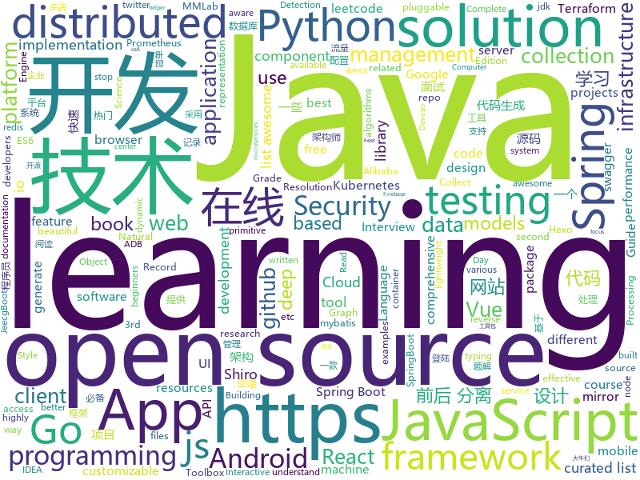

# 2019-08-30
See what the GitHub community is most excited about today.

## python
* [nlp](https://github.com/microsoft/nlp)(**239 stars today**): Natural Language Processing Best Practices & Examples
* [ML-From-Scratch](https://github.com/eriklindernoren/ML-From-Scratch)(**253 stars today**): Machine Learning From Scratch. Bare bones NumPy implementations of machine learning models and algorithms with a focus on accessibility. Aims to cover everything from linear regression to deep learning.
* [pytorch-transformers](https://github.com/huggingface/pytorch-transformers)(**70 stars today**): 👾A library of state-of-the-art pretrained models for Natural Language Processing (NLP)
* [models](https://github.com/tensorflow/models)(**65 stars today**): Models and examples built with TensorFlow
* [awesome-python-login-model](https://github.com/Kr1s77/awesome-python-login-model)(**29 stars today**): 😮python模拟登陆一些大型网站，还有一些简单的爬虫，希望对你们有所帮助❤️，如果喜欢记得给个star哦🌟
* [100-Days-Of-ML-Code](https://github.com/Avik-Jain/100-Days-Of-ML-Code)(**31 stars today**): 100 Days of ML Coding
* [mmsr](https://github.com/open-mmlab/mmsr)(**37 stars today**): Open MMLab Image and Video Super-Resolution Toolbox, , including SRResNet, SRGAN, ESRGAN, EDVR, etc.
* [mmdetection](https://github.com/open-mmlab/mmdetection)(**26 stars today**): Open MMLab Detection Toolbox and Benchmark
* [netbox](https://github.com/netbox-community/netbox)(**15 stars today**): IP address management (IPAM) and data center infrastructure management (DCIM) tool.
* [gensim](https://github.com/RaRe-Technologies/gensim)(**4 stars today**): Topic Modelling for Humans
* [wttr.in](https://github.com/chubin/wttr.in)(**125 stars today**): ⛅️The right way to check the weather
* [football](https://github.com/google-research/football)(**8 stars today**): 
* [robotframework](https://github.com/robotframework/robotframework)(**35 stars today**): Generic automation framework for acceptance testing and RPA
* [HRNet-Semantic-Segmentation](https://github.com/HRNet/HRNet-Semantic-Segmentation)(**8 stars today**): High-resolution representation learning (HRNets) for Semantic Segmentation
* [d2l-en](https://github.com/d2l-ai/d2l-en)(**11 stars today**): Dive into Deep Learning: an interactive deep learning book with code, math, and discussions
* [airflow](https://github.com/apache/airflow)(**21 stars today**): Apache Airflow
* [Detectron](https://github.com/facebookresearch/Detectron)(**18 stars today**): FAIR's research platform for object detection research, implementing popular algorithms like Mask R-CNN and RetinaNet.
* [wtfpython](https://github.com/satwikkansal/wtfpython)(**17 stars today**): A collection of surprising Python snippets and lesser-known features.
* [OpenNMT-py](https://github.com/OpenNMT/OpenNMT-py)(**4 stars today**): Open Source Neural Machine Translation in PyTorch
* [face_recognition](https://github.com/ageitgey/face_recognition)(**31 stars today**): The world's simplest facial recognition api for Python and the command line
* [mlflow](https://github.com/mlflow/mlflow)(**9 stars today**): Open source platform for the machine learning lifecycle
* [walle-web](https://github.com/meolu/walle-web)(**15 stars today**): walle - 瓦力 Devops开源项目代码部署平台
* [mypy](https://github.com/python/mypy)(**6 stars today**): Optional static typing for Python 3 and 2 (PEP 484)
* [PySyft](https://github.com/OpenMined/PySyft)(**9 stars today**): A library for encrypted, privacy preserving deep learning
* [salt](https://github.com/saltstack/salt)(**5 stars today**): Software to automate the management and configuration of any infrastructure or application at scale. Get access to the Salt software package repository here:

## java
* [hope-boot](https://github.com/hope-for/hope-boot)(**129 stars today**): 🌱🚀一款现代化的脚手架项目。企业开发？接外包？赚外快？还是学习？这都能满足你，居家必备，值得拥有🍻整合Springboot2，单点登陆+tk.mybatis+shiro+redis+thymeleaf+maven+swagger前后端分离接口管理+代码生成+定时任务+数据库版本管理flyway+hutool工具包，等实用技术。
* [spring-analysis](https://github.com/seaswalker/spring-analysis)(**124 stars today**): Spring源码阅读
* [rocketmq-externals](https://github.com/apache/rocketmq-externals)(**7 stars today**): Mirror of Apache RocketMQ (Incubating)
* [spring-boot](https://github.com/spring-projects/spring-boot)(**29 stars today**): Spring Boot
* [jeecg-boot](https://github.com/zhangdaiscott/jeecg-boot)(**50 stars today**): 一款基于代码生成器的JAVA快速开发平台！采用最新技术，前后端分离架构：SpringBoot 2.x，Ant Design&Vue，Mybatis，Shiro，JWT。强大的代码生成器让前后端代码一键生成，无需写任何代码，绝对是全栈开发福音！！ JeecgBoot的宗旨是提高UI能力的同时,降低前后分离的开发成本，JeecgBoot还独创在线开发模式，No代码概念，一系列在线智能开发：在线配置表单、在线配置报表、在线设计流程等等。
* [vhr](https://github.com/lenve/vhr)(**38 stars today**): 微人事是一个前后端分离的人力资源管理系统，项目采用SpringBoot+Vue开发。
* [elasticsearch](https://github.com/elastic/elasticsearch)(**55 stars today**): Open Source, Distributed, RESTful Search Engine
* [SpringAll](https://github.com/wuyouzhuguli/SpringAll)(**43 stars today**): 循序渐进，学习Spring Boot、Spring Boot & Shiro、Spring Cloud、Spring Security & Spring Security OAuth2，博客Spring系列源码
* [HanLP](https://github.com/hankcs/HanLP)(**29 stars today**): 自然语言处理 中文分词 词性标注 命名实体识别 依存句法分析 新词发现 关键词短语提取 自动摘要 文本分类聚类 拼音简繁
* [jdk](https://github.com/openjdk/jdk)(**3 stars today**): Read-only mirror of https://hg.openjdk.java.net/jdk/jdk
* [Shadow](https://github.com/Tencent/Shadow)(**31 stars today**): 零反射全动态Android插件框架
* [seata](https://github.com/seata/seata)(**29 stars today**): 🔥Seata is an easy-to-use, high-performance, open source distributed transaction solution.
* [AndroidUtilCode](https://github.com/Blankj/AndroidUtilCode)(**18 stars today**): 🔥Android developers should collect the following utils(updating).
* [easyexcel](https://github.com/alibaba/easyexcel)(**36 stars today**): 快速、简单避免OOM的java处理Excel工具
* [JavaGuide](https://github.com/Snailclimb/JavaGuide)(**125 stars today**): 【Java学习+面试指南】 一份涵盖大部分Java程序员所需要掌握的核心知识。
* [spring-cloud-alibaba](https://github.com/alibaba/spring-cloud-alibaba)(**66 stars today**): Spring Cloud Alibaba provides a one-stop solution for application development for the distributed solutions of Alibaba middleware.
* [COLA](https://github.com/alibaba/COLA)(**18 stars today**): Clean Object-oriented & Layered Architecture
* [CS-Notes](https://github.com/CyC2018/CS-Notes)(**104 stars today**): 📚Tech Interview Guide 技术面试必备基础知识、Leetcode 题解、Java、C++、Python、后端面试、操作系统、计算机网络、系统设计
* [quarkus](https://github.com/quarkusio/quarkus)(**3 stars today**): Quarkus: Supersonic Subatomic Java.
* [okhttp](https://github.com/square/okhttp)(**29 stars today**): An HTTP client for Android, Kotlin, and Java.
* [Intro-to-Java-Programming](https://github.com/jsquared21/Intro-to-Java-Programming)(**3 stars today**): Solutions to Programming Exercises in Introduction to Java Programming, Comprehensive Version (10th Edition) by Y. Daniel Liang
* [Sentinel](https://github.com/alibaba/Sentinel)(**26 stars today**): A lightweight powerful flow control component enabling reliability and monitoring for microservices. (轻量级的流量控制、熔断降级 Java 库)
* [react-native-camera](https://github.com/react-native-community/react-native-camera)(**7 stars today**): A Camera component for React Native. Also supports barcode scanning!
* [PlayWithCompiler](https://github.com/RichardGong/PlayWithCompiler)(**6 stars today**): A GeekTime course about constructing a compiler.
* [neo4j](https://github.com/neo4j/neo4j)(**8 stars today**): Graphs for Everyone

## unknown
* [fsharp-companies](https://github.com/Kavignon/fsharp-companies)(**23 stars today**): Community curated list of companies that use F#
* [renzhengfei](https://github.com/debitCrossBlockchain/renzhengfei)(**31 stars today**): https://github.com/benmahr/RenZhengfei
* [free-programming-books](https://github.com/EbookFoundation/free-programming-books)(**138 stars today**): 📚Freely available programming books
* [pumpkin-book](https://github.com/datawhalechina/pumpkin-book)(**45 stars today**): 《机器学习》（西瓜书）公式推导解析，在线阅读地址：https://datawhalechina.github.io/pumpkin-book
* [computer-science](https://github.com/ossu/computer-science)(**39 stars today**): 🎓Path to a free self-taught education in Computer Science!
* [awesome-vue](https://github.com/vuejs/awesome-vue)(**51 stars today**): 🎉A curated list of awesome things related to Vue.js
* [TL-TROJAN](https://github.com/threatland/TL-TROJAN)(**7 stars today**): A collection of source code for various RATs, Stealers, and other Trojans.
* [You-Dont-Know-JS](https://github.com/getify/You-Dont-Know-JS)(**79 stars today**): A book series on JavaScript. @YDKJS on twitter.
* [awesome-interview-questions](https://github.com/MaximAbramchuck/awesome-interview-questions)(**28 stars today**): A curated awesome list of lists of interview questions. Feel free to contribute!🎓
* [git-tips](https://github.com/521xueweihan/git-tips)(**20 stars today**): Git的奇技淫巧
* [Awesome-design-tools](https://github.com/phh95/Awesome-design-tools)(**30 stars today**): 
* [Interview_Question_for_Beginner](https://github.com/JaeYeopHan/Interview_Question_for_Beginner)(**4 stars today**): 👦👧Technical-Interview guidelines written for those who started studying programming. I wish you all the best.👾
* [Privilege-Escalation](https://github.com/Ignitetechnologies/Privilege-Escalation)(**119 stars today**): This cheasheet is aimed at the CTF Players and Beginners to help them understand the fundamentals of Privilege Escalation with examples.
* [awesome-architecture](https://github.com/toutiaoio/awesome-architecture)(**18 stars today**): 架构师技术图谱，助你早日成为架构师
* [crack](https://github.com/Gleans/crack)(**10 stars today**): 激活一些工具
* [awesome-graph-classification](https://github.com/benedekrozemberczki/awesome-graph-classification)(**14 stars today**): A collection of important graph embedding, classification and representation learning papers with implementations.
* [awesome-adb](https://github.com/mzlogin/awesome-adb)(**6 stars today**): 🍭ADB Usage Complete / ADB 用法大全
* [IntelliJ-IDEA-Tutorial](https://github.com/judasn/IntelliJ-IDEA-Tutorial)(**22 stars today**): IntelliJ IDEA 简体中文专题教程
* [effective-java-3rd-chinese](https://github.com/sjsdfg/effective-java-3rd-chinese)(**5 stars today**): effective-java-3rd 中文版 https://sjsdfg.github.io/effective-java-3rd-chinese
* [awesome-pentest](https://github.com/enaqx/awesome-pentest)(**5 stars today**): A collection of awesome penetration testing resources, tools and other shiny things
* [kubernetes-the-hard-way](https://github.com/kelseyhightower/kubernetes-the-hard-way)(**14 stars today**): Bootstrap Kubernetes the hard way on Google Cloud Platform. No scripts.
* [Awesome-pytorch-list](https://github.com/bharathgs/Awesome-pytorch-list)(**12 stars today**): A comprehensive list of pytorch related content on github,such as different models,implementations,helper libraries,tutorials etc.
* [awesome-for-beginners](https://github.com/MunGell/awesome-for-beginners)(**20 stars today**): A list of awesome beginners-friendly projects.
* [Specs](https://github.com/CocoaPods/Specs)(**1 stars today**): The CocoaPods Master Repo
* [awesome-actions](https://github.com/sdras/awesome-actions)(**95 stars today**): A curated list of awesome actions to use on GitHub

## javascript
* [WebGL-Fluid-Simulation](https://github.com/PavelDoGreat/WebGL-Fluid-Simulation)(**401 stars today**): Play with fluids in your browser (works even on mobile)
* [outline](https://github.com/outline/outline)(**195 stars today**): The fastest wiki and knowledge base for growing teams. Beautiful, feature rich, markdown compatible and open source.
* [awesome-mac](https://github.com/jaywcjlove/awesome-mac)(**109 stars today**):  Now we have become very big, Different from the original idea. Collect premium software in various categories.
* [todoist](https://github.com/karlhadwen/todoist)(**64 stars today**): Building Todoist Using React (Custom Hooks, Context), Firebase & React Testing Library
* [rebass](https://github.com/rebassjs/rebass)(**9 stars today**): ⚛️React primitive UI components built with styled-system.
* [nuxt.js](https://github.com/nuxt/nuxt.js)(**23 stars today**): The Vue.js Framework
* [vis-network](https://github.com/visjs/vis-network)(**15 stars today**): 💫Display dynamic, automatically organised, customizable network views.
* [aos](https://github.com/michalsnik/aos)(**58 stars today**): Animate on scroll library
* [styled-components](https://github.com/styled-components/styled-components)(**27 stars today**): Visual primitives for the component age. Use the best bits of ES6 and CSS to style your apps without stress💅
* [odoo](https://github.com/odoo/odoo)(**15 stars today**): Odoo. Open Source Apps To Grow Your Business.
* [complete-javascript-course](https://github.com/jonasschmedtmann/complete-javascript-course)(**6 stars today**): Starter files, final projects and FAQ for my Complete JavaScript course
* [leetcode](https://github.com/azl397985856/leetcode)(**100 stars today**): LeetCode Solutions: A Record of My Problem Solving Journey.( leetcode题解，记录自己的leetcode解题之路。)
* [axios](https://github.com/axios/axios)(**53 stars today**): Promise based HTTP client for the browser and node.js
* [vue](https://github.com/vuejs/vue)(**96 stars today**): 🖖Vue.js is a progressive, incrementally-adoptable JavaScript framework for building UI on the web.
* [reactide](https://github.com/reactide/reactide)(**17 stars today**): Reactide is the first dedicated IDE for React web application development.
* [themostdangerouswritingapp](https://github.com/maebert/themostdangerouswritingapp)(**36 stars today**): If you stop typing for more than five seconds, all progress will be lost.
* [livewire](https://github.com/calebporzio/livewire)(**11 stars today**): A magical front-end framework for Laravel
* [Recorder](https://github.com/xiangyuecn/Recorder)(**18 stars today**): html5 js 录音 mp3 wav ogg webm amr 格式，支持pc和Android、ios部分浏览器、和Hybrid App（提供Android IOS App源码），微信也是支持的，提供H5版语音通话聊天示例
* [svelte](https://github.com/sveltejs/svelte)(**36 stars today**): Cybernetically enhanced web apps
* [chameleon](https://github.com/didi/chameleon)(**58 stars today**): 🦎一套代码运行多端，一端所见即多端所见
* [jsPDF](https://github.com/MrRio/jsPDF)(**14 stars today**): Client-side JavaScript PDF generation for everyone.
* [mapbox-gl-js](https://github.com/mapbox/mapbox-gl-js)(**12 stars today**): Interactive, thoroughly customizable maps in the browser, powered by vector tiles and WebGL
* [dat.gui](https://github.com/dataarts/dat.gui)(**11 stars today**): dat.gui is a lightweight controller library for JavaScript.
* [aws-serverless-workshops](https://github.com/aws-samples/aws-serverless-workshops)(**8 stars today**): Code and walkthrough labs to set up serverless applications for Wild Rydes workshops
* [entropic](https://github.com/entropic-dev/entropic)(**5 stars today**): 🦝📦a package registry for anything, but mostly javascript 🦝 🦝 🦝

## html
* [meu-primeiro-jogo-multiplayer](https://github.com/filipedeschamps/meu-primeiro-jogo-multiplayer)(**24 stars today**): Um jogo multiplayer bastante simples para testarmos o Socket.io
* [free-for-dev](https://github.com/ripienaar/free-for-dev)(**90 stars today**): A list of SaaS, PaaS and IaaS offerings that have free tiers of interest to devops and infradev
* [shiro-example](https://github.com/zhangkaitao/shiro-example)(**1 stars today**): 跟我学Shiro（我的公众号：kaitao-1234567，我的新书：《亿级流量网站架构核心技术》）
* [awesome-piracy](https://github.com/Igglybuff/awesome-piracy)(**7 stars today**): A curated list of awesome warez and piracy links
* [proposal-optional-chaining](https://github.com/tc39/proposal-optional-chaining)(**11 stars today**): 
* [JavaScript30](https://github.com/wesbos/JavaScript30)(**8 stars today**): 30 Day Vanilla JS Challenge
* [proposal-decorators](https://github.com/tc39/proposal-decorators)(**1 stars today**): Decorators for ES6 classes
* [web-moderno](https://github.com/cod3rcursos/web-moderno)(**1 stars today**): 
* [skill-map](https://github.com/TeamStuQ/skill-map)(**12 stars today**): 程序员技能图谱
* [swagger-codegen](https://github.com/swagger-api/swagger-codegen)(**5 stars today**): swagger-codegen contains a template-driven engine to generate documentation, API clients and server stubs in different languages by parsing your OpenAPI / Swagger definition.
* [learning-area](https://github.com/mdn/learning-area)(**2 stars today**): Github repo for the MDN Learning Area.
* [blog](https://github.com/biaochenxuying/blog)(**6 stars today**): 技术为主，读书笔记、随笔、理财为辅，做个终身学习者。
* [awesome-modern-cpp](https://github.com/rigtorp/awesome-modern-cpp)(**8 stars today**): A collection of resources on modern C++
* [owasp-mstg](https://github.com/OWASP/owasp-mstg)(**4 stars today**): The Mobile Security Testing Guide (MSTG) is a comprehensive manual for mobile app security development, testing and reverse engineering.
* [pcc_2e](https://github.com/ehmatthes/pcc_2e)(**1 stars today**): Online resources for Python Crash Course (Second Edition), from No Starch Press
* [hexo-theme-matery](https://github.com/blinkfox/hexo-theme-matery)(**5 stars today**): A beautiful hexo blog theme with material design and responsive design.一个基于材料设计和响应式设计而成的全面、美观的Hexo主题。
* [technical-books](https://github.com/doocs/technical-books)(**5 stars today**): 😆国内外互联网技术大牛们都写了哪些书籍：计算机基础、网络、前端、后端、数据库、架构、大数据、...
* [proposal-nullish-coalescing](https://github.com/tc39/proposal-nullish-coalescing)(**1 stars today**): Nullish coalescing proposal x ?? y
* [bootstrap-multiselect](https://github.com/davidstutz/bootstrap-multiselect)(**0 stars today**): JQuery multiselect plugin based on Twitter Bootstrap.
* [REKCARC-TSC-UHT](https://github.com/PKUanonym/REKCARC-TSC-UHT)(**13 stars today**): 清华大学计算机系课程攻略 Guidance for courses in Department of Computer Science and Technology, Tsinghua University
* [keep-a-changelog](https://github.com/olivierlacan/keep-a-changelog)(**2 stars today**): If you build software, keep a changelog.
* [json-viewer](https://github.com/tulios/json-viewer)(**4 stars today**): It is a Chrome extension for printing JSON and JSONP.
* [styleguide](https://github.com/google/styleguide)(**18 stars today**): Style guides for Google-originated open-source projects
* [website](https://github.com/kubernetes/website)(**9 stars today**): Kubernetes website and documentation repo:
* [books](https://github.com/Thinkgamer/books)(**2 stars today**): 技术资料分享

## go
* [TopList](https://github.com/tophubs/TopList)(**204 stars today**): 今日热榜，一个获取各大热门网站热门头条的聚合网站，使用Go语言编写，多协程异步快速抓取信息，预览:https://www.printf520.com/hot.html
* [vault](https://github.com/hashicorp/vault)(**36 stars today**): A tool for secrets management, encryption as a service, and privileged access management
* [presidio](https://github.com/microsoft/presidio)(**89 stars today**): Context aware, pluggable and customizable data protection and PII data anonymization service for text and images
* [rancher](https://github.com/rancher/rancher)(**14 stars today**): Complete container management platform
* [go](https://github.com/golang/go)(**59 stars today**): The Go programming language
* [gin](https://github.com/gin-gonic/gin)(**43 stars today**): Gin is a HTTP web framework written in Go (Golang). It features a Martini-like API with much better performance -- up to 40 times faster. If you need smashing performance, get yourself some Gin.
* [alertmanager](https://github.com/prometheus/alertmanager)(**4 stars today**): Prometheus Alertmanager
* [helm](https://github.com/helm/helm)(**32 stars today**): The Kubernetes Package Manager
* [logrus](https://github.com/sirupsen/logrus)(**19 stars today**): Structured, pluggable logging for Go.
* [wtf](https://github.com/wtfutil/wtf)(**130 stars today**): The personal information dashboard for your terminal.
* [redis](https://github.com/go-redis/redis)(**13 stars today**): Type-safe Redis client for Golang
* [consul](https://github.com/hashicorp/consul)(**16 stars today**): Consul is a distributed, highly available, and data center aware solution to connect and configure applications across dynamic, distributed infrastructure.
* [fabric](https://github.com/hyperledger/fabric)(**5 stars today**): Read-only mirror of https://gerrit.hyperledger.org/r/#/admin/projects/fabric
* [aws-vault](https://github.com/99designs/aws-vault)(**3 stars today**): A vault for securely storing and accessing AWS credentials in development environments
* [kops](https://github.com/kubernetes/kops)(**11 stars today**): Kubernetes Operations (kops) - Production Grade K8s Installation, Upgrades, and Management
* [octant](https://github.com/vmware/octant)(**42 stars today**): A web-based, highly extensible platform for developers to better understand the complexity of Kubernetes clusters.
* [terraform-provider-google](https://github.com/terraform-providers/terraform-provider-google)(**2 stars today**): Terraform Google Cloud Platform provider
* [etcd](https://github.com/etcd-io/etcd)(**28 stars today**): Distributed reliable key-value store for the most critical data of a distributed system
* [gqlgen](https://github.com/99designs/gqlgen)(**6 stars today**): go generate based graphql server library
* [HFish](https://github.com/hacklcx/HFish)(**12 stars today**): Extend the enterprise security test open source honeypot system , Record hacker attacks. 扩展企业安全测试主动诱导型开源蜜罐框架系统，记录黑客攻击手段
* [terraformer](https://github.com/GoogleCloudPlatform/terraformer)(**13 stars today**): CLI tool to generate terraform files from existing infrastructure (reverse Terraform). Infrastructure to Code
* [loki](https://github.com/grafana/loki)(**11 stars today**): Like Prometheus, but for logs.
* [mysqld_exporter](https://github.com/prometheus/mysqld_exporter)(**11 stars today**): Exporter for MySQL server metrics
* [kubernetes](https://github.com/kubernetes/kubernetes)(**63 stars today**): Production-Grade Container Scheduling and Management
* [go-filecoin](https://github.com/filecoin-project/go-filecoin)(**2 stars today**): Filecoin Full Node Implementation in Go

## WordCloud

