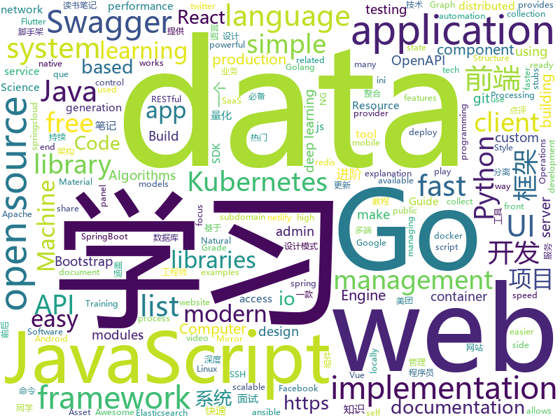

# 2019-08-31
See what the GitHub community is most excited about today.

## python
* [nlp](https://github.com/microsoft/nlp)(**228 stars today**): Natural Language Processing Best Practices & Examples
* [brain-tokyo-workshop](https://github.com/google/brain-tokyo-workshop)(**47 stars today**): 🧠🗼
* [ML-From-Scratch](https://github.com/eriklindernoren/ML-From-Scratch)(**82 stars today**): Machine Learning From Scratch. Bare bones NumPy implementations of machine learning models and algorithms with a focus on accessibility. Aims to cover everything from linear regression to deep learning.
* [spider_python](https://github.com/xingag/spider_python)(**48 stars today**): python爬虫
* [buffalo](https://github.com/kakao/buffalo)(**40 stars today**): TOROS Buffalo: A fast and scalable production-ready open source project for recommender systems
* [pytorch-transformers](https://github.com/huggingface/pytorch-transformers)(**54 stars today**): 👾A library of state-of-the-art pretrained models for Natural Language Processing (NLP)
* [football](https://github.com/google-research/football)(**23 stars today**): 
* [robotframework](https://github.com/robotframework/robotframework)(**8 stars today**): Generic automation framework for acceptance testing and RPA
* [ckan](https://github.com/ckan/ckan)(**2 stars today**): CKAN is an open-source DMS (data management system) for powering data hubs and data portals. CKAN makes it easy to publish, share and use data. It powers datahub.io, catalog.data.gov and europeandataportal.eu/data/en/dataset among many other sites.
* [abu](https://github.com/bbfamily/abu)(**5 stars today**): 阿布量化交易系统(股票，期权，期货，比特币，机器学习) 基于python的开源量化交易，量化投资架构
* [wttr.in](https://github.com/chubin/wttr.in)(**53 stars today**): ⛅️The right way to check the weather
* [public-apis](https://github.com/public-apis/public-apis)(**45 stars today**): A collective list of free APIs for use in software and web development.
* [openbmc](https://github.com/openbmc/openbmc)(**1 stars today**): OpenBMC Distribution
* [airflow](https://github.com/apache/airflow)(**11 stars today**): Apache Airflow
* [pyTelegramBotAPI](https://github.com/eternnoir/pyTelegramBotAPI)(**4 stars today**): Python Telegram bot api.
* [httpx](https://github.com/encode/httpx)(**9 stars today**): A next generation HTTP client for Python.🦋
* [DeepLabCut](https://github.com/AlexEMG/DeepLabCut)(**3 stars today**): Markerless pose estimation of user-defined features with deep learning for all animals, including humans
* [docker-pi-hole](https://github.com/pi-hole/docker-pi-hole)(**12 stars today**): Pi-hole in a docker container
* [12306](https://github.com/testerSunshine/12306)(**11 stars today**): 12306智能刷票，订票
* [tensorpack](https://github.com/tensorpack/tensorpack)(**3 stars today**): A Neural Net Training Interface on TensorFlow, with focus on speed + flexibility
* [baselines](https://github.com/openai/baselines)(**6 stars today**): OpenAI Baselines: high-quality implementations of reinforcement learning algorithms
* [imgclsmob](https://github.com/osmr/imgclsmob)(**5 stars today**): Sandbox for training convolutional networks for computer vision
* [ansible](https://github.com/ansible/ansible)(**17 stars today**): Ansible is a radically simple IT automation platform that makes your applications and systems easier to deploy. Avoid writing scripts or custom code to deploy and update your applications — automate in a language that approaches plain English, using SSH, with no agents to install on remote systems. https://docs.ansible.com/ansible/
* [dask](https://github.com/dask/dask)(**6 stars today**): Parallel computing with task scheduling
* [pytorch_geometric](https://github.com/rusty1s/pytorch_geometric)(**7 stars today**): Geometric Deep Learning Extension Library for PyTorch

## java
* [spring-analysis](https://github.com/seaswalker/spring-analysis)(**129 stars today**): Spring源码阅读
* [elasticsearch](https://github.com/elastic/elasticsearch)(**31 stars today**): Open Source, Distributed, RESTful Search Engine
* [AndroidUtilCode](https://github.com/Blankj/AndroidUtilCode)(**11 stars today**): 🔥Android developers should collect the following utils(updating).
* [canal](https://github.com/alibaba/canal)(**22 stars today**): 阿里巴巴 MySQL binlog 增量订阅&消费组件
* [JavaGuide](https://github.com/Snailclimb/JavaGuide)(**74 stars today**): 【Java学习+面试指南】 一份涵盖大部分Java程序员所需要掌握的核心知识。
* [cat](https://github.com/dianping/cat)(**8 stars today**): CAT 作为服务端项目基础组件，提供了 Java, C/C++, Node.js, Python, Go 等多语言客户端，已经在美团点评的基础架构中间件框架（MVC框架，RPC框架，数据库框架，缓存框架等，消息队列，配置系统等）深度集成，为美团点评各业务线提供系统丰富的性能指标、健康状况、实时告警等。
* [CS-Notes](https://github.com/CyC2018/CS-Notes)(**82 stars today**): 📚Tech Interview Guide 技术面试必备基础知识、Leetcode 题解、Java、C++、Python、后端面试、操作系统、计算机网络、系统设计
* [Sentinel](https://github.com/alibaba/Sentinel)(**7 stars today**): A lightweight powerful flow control component enabling reliability and monitoring for microservices. (轻量级的流量控制、熔断降级 Java 库)
* [vhr](https://github.com/lenve/vhr)(**28 stars today**): 微人事是一个前后端分离的人力资源管理系统，项目采用SpringBoot+Vue开发。
* [hope-boot](https://github.com/hope-for/hope-boot)(**48 stars today**): 🌱🚀一款现代化的脚手架项目。企业开发？接外包？赚外快？还是学习？这都能满足你，居家必备，值得拥有🍻整合Springboot2，单点登陆+tk.mybatis+shiro+redis+thymeleaf+maven+swagger前后端分离接口管理+代码生成+定时任务+数据库版本管理flyway+hutool工具包，等实用技术。
* [ignite](https://github.com/apache/ignite)(**1 stars today**): Mirror of Apache Ignite
* [nifi](https://github.com/apache/nifi)(**1 stars today**): Mirror of Apache NiFi
* [HanLP](https://github.com/hankcs/HanLP)(**7 stars today**): 自然语言处理 中文分词 词性标注 命名实体识别 依存句法分析 新词发现 关键词短语提取 自动摘要 文本分类聚类 拼音简繁
* [solo](https://github.com/b3log/solo)(**26 stars today**): 🎸一款小而美的博客系统，专为程序员设计。
* [advanced-java](https://github.com/doocs/advanced-java)(**26 stars today**): 😮互联网 Java 工程师进阶知识完全扫盲：涵盖高并发、分布式、高可用、微服务等领域知识，后端同学必看，前端同学也可学习
* [spring-framework](https://github.com/spring-projects/spring-framework)(**21 stars today**): Spring Framework
* [react-native-fbsdk](https://github.com/facebook/react-native-fbsdk)(**0 stars today**): A React Native wrapper around the Facebook SDKs for Android and iOS. Provides access to Facebook login, sharing, graph requests, app events etc.
* [SpringCloud](https://github.com/zhoutaoo/SpringCloud)(**7 stars today**): 基于SpringCloud2.0的微服务开发脚手架，整合了spring-security-oauth2、apollo、eureka、feign、hystrix、springcloud-gateway、springcloud-bus等。治理方面引入elasticsearch、skywalking、springboot-admin、zipkin等，让项目开发快速进入业务开发，而不需过多时间花费在架构搭建上。持续更新中
* [openapi-generator](https://github.com/OpenAPITools/openapi-generator)(**8 stars today**): OpenAPI Generator allows generation of API client libraries (SDK generation), server stubs, documentation and configuration automatically given an OpenAPI Spec (v2, v3)
* [aws-doc-sdk-examples](https://github.com/awsdocs/aws-doc-sdk-examples)(**6 stars today**): Code examples used in the official AWS SDK documentation.
* [keycloak](https://github.com/keycloak/keycloak)(**4 stars today**): Open Source Identity and Access Management For Modern Applications and Services
* [dropwizard](https://github.com/dropwizard/dropwizard)(**1 stars today**): A damn simple library for building production-ready RESTful web services.
* [guava](https://github.com/google/guava)(**10 stars today**): Google core libraries for Java
* [rest-assured](https://github.com/rest-assured/rest-assured)(**3 stars today**): Java DSL for easy testing of REST services
* [react-native-share](https://github.com/react-native-community/react-native-share)(**4 stars today**): Social share, sending simple data to other apps.

## unknown
* [open-source-cs](https://github.com/ForrestKnight/open-source-cs)(**92 stars today**): Video discussing this curriculum:
* [Data-Science--Cheat-Sheet](https://github.com/abhat222/Data-Science--Cheat-Sheet)(**130 stars today**): Cheat Sheets
* [git-flight-rules](https://github.com/k88hudson/git-flight-rules)(**86 stars today**): Flight rules for git
* [new-pac](https://github.com/Alvin9999/new-pac)(**32 stars today**): 
* [free-programming-books](https://github.com/EbookFoundation/free-programming-books)(**95 stars today**): 📚Freely available programming books
* [Beginner-Network-Pentesting](https://github.com/hmaverickadams/Beginner-Network-Pentesting)(**12 stars today**): Notes for Beginner Network Pentesting Course
* [data-science-career](https://github.com/firmai/data-science-career)(**54 stars today**): Career Resources for Data Science, Machine Learning, Big Data and Business Analytics Career Repository
* [empresas-que-usam-flutter-no-brasil](https://github.com/FlutterComunidadeBR/empresas-que-usam-flutter-no-brasil)(**19 stars today**): Repositório que mostra empresas e projetos que utilizam Flutter no Brasil
* [summer2020internships](https://github.com/elaine-zheng/summer2020internships)(**10 stars today**): Keep track of internships for Summer 2020 for undergraduates interested in tech./SWE/related fields
* [computer-science](https://github.com/ossu/computer-science)(**42 stars today**): 🎓Path to a free self-taught education in Computer Science!
* [trackerslist](https://github.com/ngosang/trackerslist)(**38 stars today**): Updated list of public BitTorrent trackers
* [new-grads-2020](https://github.com/cmackenzie1/new-grads-2020)(**25 stars today**): A collection of new grad roles for 2020
* [cs-video-courses](https://github.com/Developer-Y/cs-video-courses)(**3 stars today**): List of Computer Science courses with video lectures.
* [git-tips](https://github.com/521xueweihan/git-tips)(**16 stars today**): Git的奇技淫巧
* [You-Dont-Know-JS](https://github.com/getify/You-Dont-Know-JS)(**50 stars today**): A book series on JavaScript. @YDKJS on twitter.
* [clash_for_windows_pkg](https://github.com/Fndroid/clash_for_windows_pkg)(**13 stars today**): A Windows GUI based on Clash
* [weekly](https://github.com/ruanyf/weekly)(**10 stars today**): 科技爱好者周刊，每周五发布
* [xuexiqiangguo_tiku](https://github.com/zzsdoo/xuexiqiangguo_tiku)(**1 stars today**): 学习强国 挑战答题 题库
* [Red-Teaming-Toolkit](https://github.com/infosecn1nja/Red-Teaming-Toolkit)(**3 stars today**): A collection of open source and commercial tools that aid in red team operations.
* [design-patterns-for-humans](https://github.com/kamranahmedse/design-patterns-for-humans)(**8 stars today**): An ultra-simplified explanation to design patterns
* [xiaozhi](https://github.com/qq449245884/xiaozhi)(**4 stars today**): 
* [awesome-scalability](https://github.com/binhnguyennus/awesome-scalability)(**16 stars today**): The Patterns of Scalable, Reliable, and Performant Large-Scale Systems
* [ddia](https://github.com/Vonng/ddia)(**2 stars today**): 《Designing Data-Intensive Application》DDIA中文翻译
* [awesome-graphql](https://github.com/chentsulin/awesome-graphql)(**10 stars today**): Awesome list of GraphQL & Relay
* [awesome-php](https://github.com/ziadoz/awesome-php)(**11 stars today**): A curated list of amazingly awesome PHP libraries, resources and shiny things.

## javascript
* [WebGL-Fluid-Simulation](https://github.com/PavelDoGreat/WebGL-Fluid-Simulation)(**247 stars today**): Play with fluids in your browser (works even on mobile)
* [aos](https://github.com/michalsnik/aos)(**71 stars today**): Animate on scroll library
* [Daily-Interview-Question](https://github.com/Advanced-Frontend/Daily-Interview-Question)(**18 stars today**): 我是木易杨，公众号「高级前端进阶」作者，每天搞定一道前端大厂面试题，祝大家天天进步，一年后会看到不一样的自己。
* [vue](https://github.com/vuejs/vue)(**55 stars today**): 🖖Vue.js is a progressive, incrementally-adoptable JavaScript framework for building UI on the web.
* [g6](https://github.com/antvis/g6)(**11 stars today**): A Graph Visualization Framework in JavaScript
* [javascript-algorithms](https://github.com/trekhleb/javascript-algorithms)(**36 stars today**): 📝Algorithms and data structures implemented in JavaScript with explanations and links to further readings
* [webpack](https://github.com/webpack/webpack)(**24 stars today**): A bundler for javascript and friends. Packs many modules into a few bundled assets. Code Splitting allows for loading parts of the application on demand. Through "loaders", modules can be CommonJs, AMD, ES6 modules, CSS, Images, JSON, Coffeescript, LESS, ... and your custom stuff.
* [gatsby](https://github.com/gatsbyjs/gatsby)(**31 stars today**): Build blazing fast, modern apps and websites with React
* [marked](https://github.com/markedjs/marked)(**14 stars today**): A markdown parser and compiler. Built for speed.
* [todoist](https://github.com/karlhadwen/todoist)(**35 stars today**): Building Todoist Using React (Custom Hooks, Context), Firebase & React Testing Library
* [awesome-selfhosted](https://github.com/Kickball/awesome-selfhosted)(**31 stars today**): This is a list of Free Software network services and web applications which can be hosted locally. Selfhosting is the process of locally hosting and managing applications instead of renting from SaaS providers.
* [chameleon](https://github.com/didi/chameleon)(**52 stars today**): 🦎一套代码运行多端，一端所见即多端所见
* [Web](https://github.com/qianguyihao/Web)(**16 stars today**): 前端入门和进阶学习笔记，超详细的Web前端学习图文教程。从零开始学前端，做一个Web全栈工程师。持续更新...
* [redux](https://github.com/reduxjs/redux)(**15 stars today**): Predictable state container for JavaScript apps
* [react-native](https://github.com/facebook/react-native)(**45 stars today**): A framework for building native apps with React.
* [swagger-bootstrap-ui](https://github.com/xiaoymin/swagger-bootstrap-ui)(**2 stars today**): Swagger-bootstrap-ui is the Swagger front-end UI implementation, the purpose is to replace the Swagger default UI implementation Swagger-UI, make the document more friendly....
* [swiper](https://github.com/nolimits4web/swiper)(**12 stars today**): Most modern mobile touch slider with hardware accelerated transitions
* [material-ui](https://github.com/mui-org/material-ui)(**25 stars today**): React components for faster and easier web development. Build your own design system, or start with Material Design.
* [react-datepicker](https://github.com/Hacker0x01/react-datepicker)(**5 stars today**): A simple and reusable datepicker component for React
* [pdfmake](https://github.com/bpampuch/pdfmake)(**8 stars today**): Client/server side PDF printing in pure JavaScript
* [slick](https://github.com/kenwheeler/slick)(**5 stars today**): the last carousel you'll ever need
* [themostdangerouswritingapp](https://github.com/maebert/themostdangerouswritingapp)(**27 stars today**): If you stop typing for more than five seconds, all progress will be lost.
* [pixi.js](https://github.com/pixijs/pixi.js)(**31 stars today**): The HTML5 Creation Engine: Create beautiful digital content with the fastest, most flexible 2D WebGL renderer.
* [styled-system](https://github.com/styled-system/styled-system)(**7 stars today**): ⬢ Style props for rapid UI development
* [flv.js](https://github.com/bilibili/flv.js)(**41 stars today**): HTML5 FLV Player

## html
* [styleguide](https://github.com/google/styleguide)(**8 stars today**): Style guides for Google-originated open-source projects
* [website](https://github.com/kubernetes/website)(**0 stars today**): Kubernetes website and documentation repo:
* [free-for-dev](https://github.com/ripienaar/free-for-dev)(**102 stars today**): A list of SaaS, PaaS and IaaS offerings that have free tiers of interest to devops and infradev
* [deeplearning_ai_books](https://github.com/fengdu78/deeplearning_ai_books)(**10 stars today**): deeplearning.ai（吴恩达老师的深度学习课程笔记及资源）
* [glTF](https://github.com/KhronosGroup/glTF)(**2 stars today**): glTF – Runtime 3D Asset Delivery
* [ecma262](https://github.com/tc39/ecma262)(**4 stars today**): Status, process, and documents for ECMA-262
* [bootstrap-multiselect](https://github.com/davidstutz/bootstrap-multiselect)(**0 stars today**): JQuery multiselect plugin based on Twitter Bootstrap.
* [flutter-in-action](https://github.com/flutterchina/flutter-in-action)(**3 stars today**): 《Flutter实战》电子书
* [portainer](https://github.com/portainer/portainer)(**6 stars today**): Making Docker management easy.
* [swagger-codegen](https://github.com/swagger-api/swagger-codegen)(**3 stars today**): swagger-codegen contains a template-driven engine to generate documentation, API clients and server stubs in different languages by parsing your OpenAPI / Swagger definition.
* [linux-command](https://github.com/jaywcjlove/linux-command)(**9 stars today**): Linux命令大全搜索工具，内容包含Linux命令手册、详解、学习、搜集。https://git.io/linux
* [AdminLTE](https://github.com/ColorlibHQ/AdminLTE)(**15 stars today**): AdminLTE - Free Premium Admin control Panel Theme Based On Bootstrap 3.x
* [qiubaiying.github.io](https://github.com/qiubaiying/qiubaiying.github.io)(**1 stars today**): BY Blog ->
* [Sudomy](https://github.com/Screetsec/Sudomy)(**9 stars today**): Sudomy is a subdomain enumeration tool, created using a bash script, to analyze domains and collect subdomains in fast and comprehensive way ( Easy, light, fast and powerful )
* [ng-alain](https://github.com/ng-alain/ng-alain)(**1 stars today**): NG-ZORRO admin panel front-end framework (netlify mirror https://netlify.ng-alain.com/)
* [elasticsearch-definitive-guide](https://github.com/elastic/elasticsearch-definitive-guide)(**1 stars today**): The Definitive Guide to Elasticsearch
* [blog](https://github.com/biaochenxuying/blog)(**2 stars today**): 技术为主，读书笔记、随笔、理财为辅，做个终身学习者。
* [geektime-ELK](https://github.com/onebirdrocks/geektime-ELK)(**1 stars today**): ELK Training
* [2019-20-Classes](https://github.com/CC-MNNIT/2019-20-Classes)(**1 stars today**): https://cc-mnnit.github.io/2019-20-Classes/ -🎒💻Material for Computer Club Classes
* [kubernetes-failure-stories](https://github.com/hjacobs/kubernetes-failure-stories)(**4 stars today**): Compilation of public failure/horror stories related to Kubernetes
* [linuxtools_rst](https://github.com/me115/linuxtools_rst)(**0 stars today**): Linux工具快速教程
* [mxgraph](https://github.com/jgraph/mxgraph)(**2 stars today**): mxGraph is a fully client side JavaScript diagramming library
* [zepto](https://github.com/madrobby/zepto)(**1 stars today**): Zepto.js is a minimalist JavaScript library for modern browsers, with a jQuery-compatible API
* [18.06-linalg-notes](https://github.com/apachecn/18.06-linalg-notes)(**3 stars today**): MIT-18.06-线性代数-完整笔记
* [ckeditor5-build-classic](https://github.com/ckeditor/ckeditor5-build-classic)(**1 stars today**): The classic editor build of CKEditor 5.

## go
* [wtf](https://github.com/wtfutil/wtf)(**162 stars today**): The personal information dashboard for your terminal.
* [beego](https://github.com/astaxie/beego)(**17 stars today**): beego is an open-source, high-performance web framework for the Go programming language.
* [consul](https://github.com/hashicorp/consul)(**19 stars today**): Consul is a distributed, highly available, and data center aware solution to connect and configure applications across dynamic, distributed infrastructure.
* [kubernetes](https://github.com/kubernetes/kubernetes)(**36 stars today**): Production-Grade Container Scheduling and Management
* [origin](https://github.com/openshift/origin)(**10 stars today**): The self-managing, auto-upgrading, Kubernetes distribution for everyone
* [testify](https://github.com/stretchr/testify)(**5 stars today**): A toolkit with common assertions and mocks that plays nicely with the standard library
* [websocket](https://github.com/gorilla/websocket)(**18 stars today**): A fast, well-tested and widely used WebSocket implementation for Go.
* [rancher](https://github.com/rancher/rancher)(**6 stars today**): Complete container management platform
* [gin](https://github.com/gin-gonic/gin)(**26 stars today**): Gin is a HTTP web framework written in Go (Golang). It features a Martini-like API with much better performance -- up to 40 times faster. If you need smashing performance, get yourself some Gin.
* [kops](https://github.com/kubernetes/kops)(**4 stars today**): Kubernetes Operations (kops) - Production Grade K8s Installation, Upgrades, and Management
* [algorithms](https://github.com/x899/algorithms)(**13 stars today**): Data Structure Libraries and Algorithms implementation
* [TopList](https://github.com/tophubs/TopList)(**73 stars today**): 今日热榜，一个获取各大热门网站热门头条的聚合网站，使用Go语言编写，多协程异步快速抓取信息，预览:https://www.printf520.com/hot.html
* [golang-design-pattern](https://github.com/senghoo/golang-design-pattern)(**20 stars today**): 设计模式 Golang实现－《研磨设计模式》读书笔记
* [vault](https://github.com/hashicorp/vault)(**26 stars today**): A tool for secrets management, encryption as a service, and privileged access management
* [redis](https://github.com/go-redis/redis)(**7 stars today**): Type-safe Redis client for Golang
* [terraform-provider-azurerm](https://github.com/terraform-providers/terraform-provider-azurerm)(**1 stars today**): Terraform provider for Azure Resource Manager
* [grpc-go](https://github.com/grpc/grpc-go)(**7 stars today**): The Go language implementation of gRPC. HTTP/2 based RPC
* [autoscaler](https://github.com/kubernetes/autoscaler)(**6 stars today**): Autoscaling components for Kubernetes
* [logrus](https://github.com/sirupsen/logrus)(**11 stars today**): Structured, pluggable logging for Go.
* [k9s](https://github.com/derailed/k9s)(**9 stars today**): 🐶Kubernetes CLI To Manage Your Clusters In Style!
* [rke](https://github.com/rancher/rke)(**5 stars today**): Rancher Kubernetes Engine, an extremely simple, lightning fast Kubernetes installer that works everywhere.
* [cloud-on-k8s](https://github.com/elastic/cloud-on-k8s)(**3 stars today**): Elastic Cloud on Kubernetes
* [node_exporter](https://github.com/prometheus/node_exporter)(**2 stars today**): Exporter for machine metrics
* [ini](https://github.com/go-ini/ini)(**5 stars today**): Package ini provides INI file read and write functionality in Go.
* [sshcode](https://github.com/cdr/sshcode)(**15 stars today**): Run VS Code on any server over SSH.

## WordCloud

