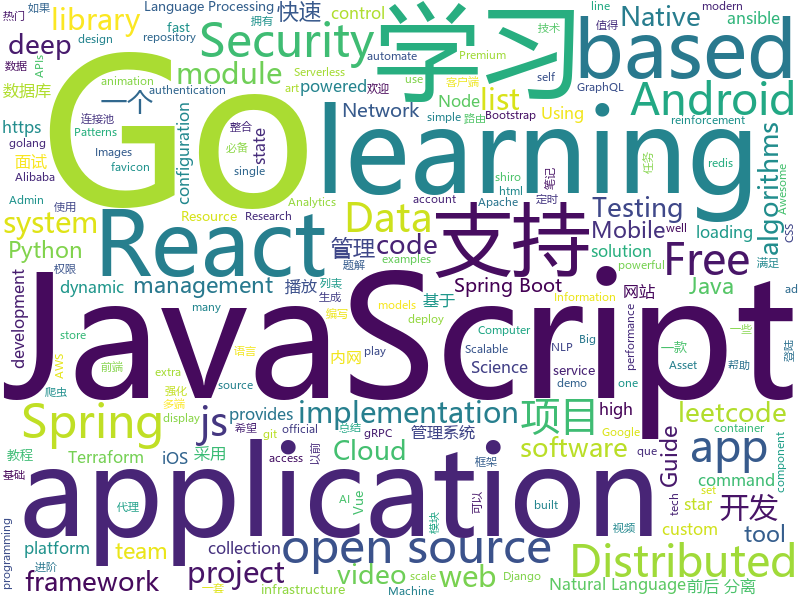

# 2019-09-01
See what the GitHub community is most excited about today.

## python
* [nlp](https://github.com/microsoft/nlp)(**173 stars today**): Natural Language Processing Best Practices & Examples
* [faceswap](https://github.com/deepfakes/faceswap)(**173 stars today**): Deepfakes Software For All
* [ML-From-Scratch](https://github.com/eriklindernoren/ML-From-Scratch)(**100 stars today**): Machine Learning From Scratch. Bare bones NumPy implementations of machine learning models and algorithms with a focus on accessibility. Aims to cover everything from linear regression to deep learning.
* [baselines](https://github.com/openai/baselines)(**5 stars today**): OpenAI Baselines: high-quality implementations of reinforcement learning algorithms
* [brain-tokyo-workshop](https://github.com/google/brain-tokyo-workshop)(**25 stars today**): 🧠🗼
* [public-apis](https://github.com/public-apis/public-apis)(**29 stars today**): A collective list of free APIs for use in software and web development.
* [gym](https://github.com/openai/gym)(**2 stars today**): A toolkit for developing and comparing reinforcement learning algorithms.
* [ansible](https://github.com/ansible/ansible)(**10 stars today**): Ansible is a radically simple IT automation platform that makes your applications and systems easier to deploy. Avoid writing scripts or custom code to deploy and update your applications — automate in a language that approaches plain English, using SSH, with no agents to install on remote systems. https://docs.ansible.com/ansible/
* [flair](https://github.com/zalandoresearch/flair)(**6 stars today**): A very simple framework for state-of-the-art Natural Language Processing (NLP)
* [awesome-python-login-model](https://github.com/Kr1s77/awesome-python-login-model)(**23 stars today**): 😮python模拟登陆一些大型网站，还有一些简单的爬虫，希望对你们有所帮助❤️，如果喜欢记得给个star哦🌟
* [PyTorchDocs](https://github.com/fendouai/PyTorchDocs)(**12 stars today**): PyTorch 官方中文教程包含 60 分钟快速入门教程，强化教程，计算机视觉，自然语言处理，生成对抗网络，强化学习。欢迎 Star，Fork！
* [django-allauth](https://github.com/pennersr/django-allauth)(**2 stars today**): Integrated set of Django applications addressing authentication, registration, account management as well as 3rd party (social) account authentication.
* [docker-pi-hole](https://github.com/pi-hole/docker-pi-hole)(**6 stars today**): Pi-hole in a docker container
* [tvm](https://github.com/dmlc/tvm)(**11 stars today**): Open deep learning compiler stack for cpu, gpu and specialized accelerators
* [google-research](https://github.com/google-research/google-research)(**12 stars today**): Google AI Research
* [football](https://github.com/google-research/football)(**15 stars today**): 
* [pytorch-transformers](https://github.com/huggingface/pytorch-transformers)(**31 stars today**): 👾A library of state-of-the-art pretrained models for Natural Language Processing (NLP)
* [airflow](https://github.com/apache/airflow)(**3 stars today**): Apache Airflow
* [NEAT-Flappy-Bird](https://github.com/techwithtim/NEAT-Flappy-Bird)(**3 stars today**): An AI that plays flappy bird! Using the NEAT python module.
* [incubator-mxnet](https://github.com/apache/incubator-mxnet)(**5 stars today**): Lightweight, Portable, Flexible Distributed/Mobile Deep Learning with Dynamic, Mutation-aware Dataflow Dep Scheduler; for Python, R, Julia, Scala, Go, Javascript and more
* [salt](https://github.com/saltstack/salt)(**5 stars today**): Software to automate the management and configuration of any infrastructure or application at scale. Get access to the Salt software package repository here:
* [calibre](https://github.com/kovidgoyal/calibre)(**4 stars today**): The official source code repository for the calibre ebook manager
* [pysot](https://github.com/STVIR/pysot)(**2 stars today**): SenseTime Research platform for single object tracking, implementing algorithms like SiamRPN and SiamMask.
* [InvisibilityCloak](https://github.com/eeshashetty/InvisibilityCloak)(**3 stars today**): An OpenCV project for creating an Invisibility Cloak
* [addons](https://github.com/tensorflow/addons)(**0 stars today**): Useful extra functionality for TensorFlow 2.0 maintained by SIG-addons

## java
* [hope-boot](https://github.com/hope-for/hope-boot)(**70 stars today**): 🌱🚀一款现代化的脚手架项目。企业开发？接外包？赚外快？还是学习？这都能满足你，居家必备，值得拥有🍻整合Springboot2，单点登陆+tk.mybatis+shiro+redis+thymeleaf+maven+swagger前后端分离接口管理+代码生成+定时任务+数据库版本管理flyway+hutool工具包，等实用技术。
* [CS-Notes](https://github.com/CyC2018/CS-Notes)(**78 stars today**): 📚Tech Interview Guide 技术面试必备基础知识、Leetcode 题解、Java、C++、Python、后端面试、操作系统、计算机网络、系统设计
* [spring-analysis](https://github.com/seaswalker/spring-analysis)(**72 stars today**): Spring源码阅读
* [react-native-webview](https://github.com/react-native-community/react-native-webview)(**3 stars today**): React Native Cross-Platform WebView
* [dubbo](https://github.com/apache/dubbo)(**15 stars today**): Apache Dubbo is a high-performance, java based, open source RPC framework.
* [eladmin](https://github.com/elunez/eladmin)(**14 stars today**): 项目基于 Spring Boot 2.1.0 、 Jpa、 Spring Security、redis、Vue的前后端分离的后台管理系统，项目采用分模块开发方式， 权限控制采用 RBAC，支持数据字典与数据权限管理，支持一键生成前后端代码，支持动态路由
* [java-design-patterns](https://github.com/iluwatar/java-design-patterns)(**21 stars today**): Design patterns implemented in Java
* [spring-cloud-alibaba](https://github.com/alibaba/spring-cloud-alibaba)(**13 stars today**): Spring Cloud Alibaba provides a one-stop solution for application development for the distributed solutions of Alibaba middleware.
* [DoraemonKit](https://github.com/didi/DoraemonKit)(**2 stars today**): 简称 "DoKit" 。一款功能齐全的客户端（ iOS 、Android ）研发助手，你值得拥有。
* [MVVMHabit](https://github.com/goldze/MVVMHabit)(**6 stars today**): 👕基于谷歌最新AAC架构，MVVM设计模式的一套快速开发库，整合Okhttp+RxJava+Retrofit+Glide等主流模块，满足日常开发需求。使用该框架可以快速开发一个高质量、易维护的Android应用。
* [spring-boot](https://github.com/spring-projects/spring-boot)(**24 stars today**): Spring Boot
* [elasticsearch](https://github.com/elastic/elasticsearch)(**34 stars today**): Open Source, Distributed, RESTful Search Engine
* [druid](https://github.com/alibaba/druid)(**4 stars today**): 阿里巴巴数据库事业部出品，为监控而生的数据库连接池。阿里云Data Lake Analytics(https://www.aliyun.com/product/datalakeanalytics )、DRDS、TDDL 连接池powered by Druid
* [vhr](https://github.com/lenve/vhr)(**19 stars today**): 微人事是一个前后端分离的人力资源管理系统，项目采用SpringBoot+Vue开发。
* [SpringAll](https://github.com/wuyouzhuguli/SpringAll)(**15 stars today**): 循序渐进，学习Spring Boot、Spring Boot & Shiro、Spring Cloud、Spring Security & Spring Security OAuth2，博客Spring系列源码
* [java-faker](https://github.com/DiUS/java-faker)(**2 stars today**): Brings the popular ruby faker gem to Java
* [zuul](https://github.com/Netflix/zuul)(**2 stars today**): Zuul is a gateway service that provides dynamic routing, monitoring, resiliency, security, and more.
* [fresco](https://github.com/facebook/fresco)(**0 stars today**): An Android library for managing images and the memory they use.
* [hbase](https://github.com/apache/hbase)(**2 stars today**): Mirror of Apache HBase
* [DKVideoPlayer](https://github.com/dueeeke/DKVideoPlayer)(**3 stars today**): Android Video Player. 安卓视频播放器，封装MediaPlayer、ExoPlayer、IjkPlayer。模仿抖音，悬浮播放，广告播放，列表播放，弹幕
* [react-native-device-info](https://github.com/react-native-community/react-native-device-info)(**1 stars today**): Device Information for React Native iOS and Android
* [quickstart-android](https://github.com/firebase/quickstart-android)(**3 stars today**): Firebase Quickstart Samples for Android
* [caffeine](https://github.com/ben-manes/caffeine)(**3 stars today**): A high performance caching library for Java 8
* [lottie-android](https://github.com/airbnb/lottie-android)(**9 stars today**): Render After Effects animations natively on Android and iOS, Web, and React Native
* [ARouter](https://github.com/alibaba/ARouter)(**2 stars today**): 💪A framework for assisting in the renovation of Android componentization (帮助 Android App 进行组件化改造的路由框架)

## unknown
* [open-source-cs](https://github.com/ForrestKnight/open-source-cs)(**131 stars today**): Video discussing this curriculum:
* [Data-Science--Cheat-Sheet](https://github.com/abhat222/Data-Science--Cheat-Sheet)(**122 stars today**): Cheat Sheets
* [git-flight-rules](https://github.com/k88hudson/git-flight-rules)(**66 stars today**): Flight rules for git
* [new-pac](https://github.com/Alvin9999/new-pac)(**33 stars today**): 
* [free-programming-books](https://github.com/EbookFoundation/free-programming-books)(**70 stars today**): 📚Freely available programming books
* [Beginner-Network-Pentesting](https://github.com/hmaverickadams/Beginner-Network-Pentesting)(**5 stars today**): Notes for Beginner Network Pentesting Course
* [data-science-career](https://github.com/firmai/data-science-career)(**13 stars today**): Career Resources for Data Science, Machine Learning, Big Data and Business Analytics Career Repository
* [empresas-que-usam-flutter-no-brasil](https://github.com/FlutterComunidadeBR/empresas-que-usam-flutter-no-brasil)(**4 stars today**): Repositório que mostra empresas e projetos que utilizam Flutter no Brasil
* [summer2020internships](https://github.com/elaine-zheng/summer2020internships)(**4 stars today**): Keep track of internships for Summer 2020 for undergraduates interested in tech./SWE/related fields
* [computer-science](https://github.com/ossu/computer-science)(**47 stars today**): 🎓Path to a free self-taught education in Computer Science!
* [trackerslist](https://github.com/ngosang/trackerslist)(**35 stars today**): Updated list of public BitTorrent trackers
* [new-grads-2020](https://github.com/cmackenzie1/new-grads-2020)(**13 stars today**): A collection of new grad roles for 2020
* [cs-video-courses](https://github.com/Developer-Y/cs-video-courses)(**6 stars today**): List of Computer Science courses with video lectures.
* [git-tips](https://github.com/521xueweihan/git-tips)(**9 stars today**): Git的奇技淫巧
* [You-Dont-Know-JS](https://github.com/getify/You-Dont-Know-JS)(**51 stars today**): A book series on JavaScript. @YDKJS on twitter.
* [clash_for_windows_pkg](https://github.com/Fndroid/clash_for_windows_pkg)(**5 stars today**): A Windows GUI based on Clash
* [weekly](https://github.com/ruanyf/weekly)(**13 stars today**): 科技爱好者周刊，每周五发布
* [xuexiqiangguo_tiku](https://github.com/zzsdoo/xuexiqiangguo_tiku)(**0 stars today**): 学习强国 挑战答题 题库
* [Red-Teaming-Toolkit](https://github.com/infosecn1nja/Red-Teaming-Toolkit)(**1 stars today**): A collection of open source and commercial tools that aid in red team operations.
* [design-patterns-for-humans](https://github.com/kamranahmedse/design-patterns-for-humans)(**5 stars today**): An ultra-simplified explanation to design patterns
* [xiaozhi](https://github.com/qq449245884/xiaozhi)(**3 stars today**): 
* [awesome-scalability](https://github.com/binhnguyennus/awesome-scalability)(**7 stars today**): The Patterns of Scalable, Reliable, and Performant Large-Scale Systems
* [ddia](https://github.com/Vonng/ddia)(**1 stars today**): 《Designing Data-Intensive Application》DDIA中文翻译
* [awesome-graphql](https://github.com/chentsulin/awesome-graphql)(**6 stars today**): Awesome list of GraphQL & Relay
* [awesome-php](https://github.com/ziadoz/awesome-php)(**5 stars today**): A curated list of amazingly awesome PHP libraries, resources and shiny things.

## javascript
* [outline](https://github.com/outline/outline)(**81 stars today**): The fastest wiki and knowledge base for growing teams. Beautiful, feature rich, markdown compatible and open source.
* [WebGL-Fluid-Simulation](https://github.com/PavelDoGreat/WebGL-Fluid-Simulation)(**222 stars today**): Play with fluids in your browser (works even on mobile)
* [KCon](https://github.com/knownsec/KCon)(**26 stars today**): KCon is a famous Hacker Con powered by Knownsec Team.
* [leetcode](https://github.com/azl397985856/leetcode)(**162 stars today**): LeetCode Solutions: A Record of My Problem Solving Journey.( leetcode题解，记录自己的leetcode解题之路。)
* [gatsby](https://github.com/gatsbyjs/gatsby)(**29 stars today**): Build blazing fast, modern apps and websites with React
* [examples](https://github.com/serverless/examples)(**42 stars today**): Serverless Examples – A collection of boilerplates and examples of serverless architectures built with the Serverless Framework on AWS Lambda, Microsoft Azure, Google Cloud Functions, and more.
* [33-js-concepts](https://github.com/leonardomso/33-js-concepts)(**20 stars today**): 📜33 concepts every JavaScript developer should know.
* [awesome-mac](https://github.com/jaywcjlove/awesome-mac)(**21 stars today**):  Now we have become very big, Different from the original idea. Collect premium software in various categories.
* [chameleon](https://github.com/didi/chameleon)(**14 stars today**): 🦎一套代码运行多端，一端所见即多端所见
* [incubator-echarts](https://github.com/apache/incubator-echarts)(**7 stars today**): A powerful, interactive charting and visualization library for browser
* [create-react-app](https://github.com/facebook/create-react-app)(**15 stars today**): Set up a modern web app by running one command.
* [pai](https://github.com/microsoft/pai)(**4 stars today**): Resource scheduling and cluster management for AI
* [nuxt.js](https://github.com/nuxt/nuxt.js)(**7 stars today**): The Vue.js Framework
* [flv.js](https://github.com/bilibili/flv.js)(**14 stars today**): HTML5 FLV Player
* [todoist](https://github.com/karlhadwen/todoist)(**13 stars today**): Building Todoist Using React (Custom Hooks, Context), Firebase & React Testing Library
* [vis-network](https://github.com/visjs/vis-network)(**3 stars today**): 💫Display dynamic, automatically organised, customizable network views.
* [GGEditor](https://github.com/alibaba/GGEditor)(**13 stars today**): A visual graph editor based on G6 and React
* [jest](https://github.com/facebook/jest)(**9 stars today**): Delightful JavaScript Testing.
* [square-loading-favicon](https://github.com/rpsthecoder/square-loading-favicon)(**3 stars today**): Square loading favicon.
* [no-cli-ads](https://github.com/kethinov/no-cli-ads)(**22 stars today**): Ad blocker for command line interface ads.
* [rebass](https://github.com/rebassjs/rebass)(**3 stars today**): ⚛️React primitive UI components built with styled-system.
* [effector](https://github.com/zerobias/effector)(**10 stars today**): The state manager☄️
* [webpack](https://github.com/webpack/webpack)(**12 stars today**): A bundler for javascript and friends. Packs many modules into a few bundled assets. Code Splitting allows for loading parts of the application on demand. Through "loaders", modules can be CommonJs, AMD, ES6 modules, CSS, Images, JSON, Coffeescript, LESS, ... and your custom stuff.
* [Blog](https://github.com/YvetteLau/Blog)(**4 stars today**): 【前端进阶】优质博文
* [realworld](https://github.com/gothinkster/realworld)(**17 stars today**): "The mother of all demo apps" — Exemplary fullstack Medium.com clone powered by React, Angular, Node, Django, and many more🏅

## html
* [free-for-dev](https://github.com/ripienaar/free-for-dev)(**62 stars today**): A list of SaaS, PaaS and IaaS offerings that have free tiers of interest to devops and infradev
* [Java-Interview-Advanced](https://github.com/shishan100/Java-Interview-Advanced)(**4 stars today**): 中华石杉--互联网Java进阶面试训练营
* [Coursera-ML-AndrewNg-Notes](https://github.com/fengdu78/Coursera-ML-AndrewNg-Notes)(**12 stars today**): 吴恩达老师的机器学习课程个人笔记
* [postmark-templates](https://github.com/wildbit/postmark-templates)(**0 stars today**): Rock-solid email templates for applications.
* [glTF](https://github.com/KhronosGroup/glTF)(**1 stars today**): glTF – Runtime 3D Asset Delivery
* [favicon-canvas-loader](https://github.com/rpsthecoder/favicon-canvas-loader)(**0 stars today**): Create and display a circular loading <canvas> animation as a webpage favicon.
* [AdminLTE](https://github.com/ColorlibHQ/AdminLTE)(**12 stars today**): AdminLTE - Free Premium Admin control Panel Theme Based On Bootstrap 3.x
* [TheHive](https://github.com/TheHive-Project/TheHive)(**2 stars today**): TheHive: a Scalable, Open Source and Free Security Incident Response Platform
* [styleguide](https://github.com/google/styleguide)(**8 stars today**): Style guides for Google-originated open-source projects
* [javascript-notes](https://github.com/anbang/javascript-notes)(**2 stars today**): 安邦的JavaScript学习笔记；JavaScript学习总结；前端变化太快，只有把JS基础打扎实了，才能游刃有余；为了让我的JavaScript基础异常牢固，思路更加清晰，我会把以前总结过的知识和平时看到的资料放在这里，把以前零零散散的知识点全部串起来！这个项目也许写到最后会是一个非常不错的JavaScript教程，希望可以帮到更多的人；收藏请点star；如果发现我有写错误的，欢迎随时帮我改正，或者增加新的观点，谢谢！
* [electron-api-demos](https://github.com/electron/electron-api-demos)(**4 stars today**): Explore the Electron APIs
* [fastText](https://github.com/facebookresearch/fastText)(**5 stars today**): Library for fast text representation and classification.
* [game-of-life](https://github.com/wakaleo/game-of-life)(**0 stars today**): Demo application for the 'Jenkins: The Definitive Guide' book
* [tagify](https://github.com/yairEO/tagify)(**0 stars today**): lightweight, efficient Tags input component in Vanilla JS / React / Angular
* [ecma262](https://github.com/tc39/ecma262)(**2 stars today**): Status, process, and documents for ECMA-262
* [nndl.github.io](https://github.com/nndl/nndl.github.io)(**12 stars today**): 《神经网络与深度学习》 Neural Network and Deep Learning
* [node-ytdl-core](https://github.com/fent/node-ytdl-core)(**2 stars today**): YouTube video downloader in javascript.
* [stickyfill](https://github.com/wilddeer/stickyfill)(**1 stars today**): Polyfill for CSS `position: sticky`
* [gentelella](https://github.com/ColorlibHQ/gentelella)(**5 stars today**): Free Bootstrap 3 Admin Template
* [flexboxgrid](https://github.com/kristoferjoseph/flexboxgrid)(**2 stars today**): Grid based on CSS3 flexbox
* [skill-map](https://github.com/TeamStuQ/skill-map)(**3 stars today**): 程序员技能图谱
* [mxgraph](https://github.com/jgraph/mxgraph)(**2 stars today**): mxGraph is a fully client side JavaScript diagramming library
* [learnyounode](https://github.com/workshopper/learnyounode)(**0 stars today**): Learn You The Node.js For Much Win! An intro to Node.js via a set of self-guided workshops.
* [html](https://github.com/whatwg/html)(**0 stars today**): HTML Standard
* [owasp-mstg](https://github.com/OWASP/owasp-mstg)(**2 stars today**): The Mobile Security Testing Guide (MSTG) is a comprehensive manual for mobile app security development, testing and reverse engineering.

## go
* [TopList](https://github.com/tophubs/TopList)(**61 stars today**): 今日热榜，一个获取各大热门网站热门头条的聚合网站，使用Go语言编写，多协程异步快速抓取信息，预览:https://www.printf520.com/hot.html
* [douyin](https://github.com/cnbattle/douyin)(**25 stars today**): 抖音推荐列表视频爬虫方案,基于app(虚拟机或真机) 相关技术 golang adb nodejs anyproxy
* [vault](https://github.com/hashicorp/vault)(**16 stars today**): A tool for secrets management, encryption as a service, and privileged access management
* [go](https://github.com/golang/go)(**59 stars today**): The Go programming language
* [eksctl](https://github.com/weaveworks/eksctl)(**1 stars today**): The official CLI for Amazon EKS
* [terragrunt](https://github.com/gruntwork-io/terragrunt)(**1 stars today**): Terragrunt is a thin wrapper for Terraform that provides extra tools for working with multiple Terraform modules.
* [terraform](https://github.com/hashicorp/terraform)(**2 stars today**): Terraform enables you to safely and predictably create, change, and improve infrastructure. It is an open source tool that codifies APIs into declarative configuration files that can be shared amongst team members, treated as code, edited, reviewed, and versioned.
* [istio](https://github.com/istio/istio)(**9 stars today**): Connect, secure, control, and observe services.
* [viper](https://github.com/spf13/viper)(**5 stars today**): Go configuration with fangs
* [grpc-go](https://github.com/grpc/grpc-go)(**3 stars today**): The Go language implementation of gRPC. HTTP/2 based RPC
* [ingress-nginx](https://github.com/kubernetes/ingress-nginx)(**5 stars today**): NGINX Ingress Controller for Kubernetes
* [grpc-gateway](https://github.com/grpc-ecosystem/grpc-gateway)(**3 stars today**): gRPC to JSON proxy generator following the gRPC HTTP spec
* [wtf](https://github.com/wtfutil/wtf)(**101 stars today**): The personal information dashboard for your terminal.
* [awsctl](https://github.com/omerh/awsctl)(**5 stars today**): Control AWS infrastructure easily from a single command line written in Go
* [gocron](https://github.com/ouqiang/gocron)(**7 stars today**): 定时任务管理系统
* [jaeger](https://github.com/jaegertracing/jaeger)(**2 stars today**): CNCF Jaeger, a Distributed Tracing Platform
* [graphql](https://github.com/graphql-go/graphql)(**5 stars today**): An implementation of GraphQL for Go / Golang
* [BaiduPCS-Go](https://github.com/iikira/BaiduPCS-Go)(**17 stars today**): 百度网盘客户端 - Go语言编写
* [websocket](https://github.com/gorilla/websocket)(**12 stars today**): A fast, well-tested and widely used WebSocket implementation for Go.
* [moby](https://github.com/moby/moby)(**8 stars today**): Moby Project - a collaborative project for the container ecosystem to assemble container-based systems
* [mux](https://github.com/gorilla/mux)(**10 stars today**): A powerful HTTP router and URL matcher for building Go web servers with🦍
* [etcd](https://github.com/etcd-io/etcd)(**10 stars today**): Distributed reliable key-value store for the most critical data of a distributed system
* [nps](https://github.com/cnlh/nps)(**18 stars today**): 一款轻量级、功能强大的内网穿透代理服务器。支持tcp、udp流量转发，支持内网http代理、内网socks5代理，同时支持snappy压缩、站点保护、加密传输、多路复用、header修改等。支持web图形化管理，集成多用户模式。
* [logrus](https://github.com/sirupsen/logrus)(**8 stars today**): Structured, pluggable logging for Go.
* [harbor](https://github.com/goharbor/harbor)(**4 stars today**): An open source trusted cloud native registry project that stores, signs, and scans content.

## WordCloud

