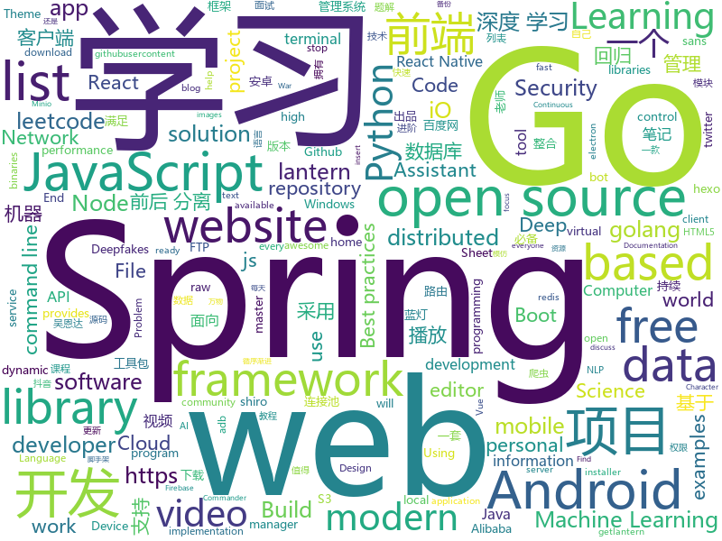

# 2019-09-02
See what the GitHub community is most excited about today.

## python
* [faceswap](https://github.com/deepfakes/faceswap)(**396 stars today**): Deepfakes Software For All
* [DeepFaceLab](https://github.com/iperov/DeepFaceLab)(**175 stars today**): DeepFaceLab is a tool that utilizes machine learning to replace faces in videos. Includes prebuilt ready to work standalone Windows 7,8,10 binary (look readme.md).
* [spider_python](https://github.com/xingag/spider_python)(**44 stars today**): python爬虫
* [craftassist](https://github.com/facebookresearch/craftassist)(**49 stars today**): A virtual assistant bot in Minecraft
* [nlp](https://github.com/microsoft/nlp)(**122 stars today**): Natural Language Processing Best Practices & Examples
* [home-assistant](https://github.com/home-assistant/home-assistant)(**22 stars today**): 🏡Open source home automation that puts local control and privacy first
* [you-get](https://github.com/soimort/you-get)(**43 stars today**): ⏬Dumb downloader that scrapes the web
* [public-apis](https://github.com/public-apis/public-apis)(**37 stars today**): A collective list of free APIs for use in software and web development.
* [ML-From-Scratch](https://github.com/eriklindernoren/ML-From-Scratch)(**43 stars today**): Machine Learning From Scratch. Bare bones NumPy implementations of machine learning models and algorithms with a focus on accessibility. Aims to cover everything from linear regression to deep learning.
* [RemoteFileTransfer](https://github.com/1061700625/RemoteFileTransfer)(**5 stars today**): 远程文件传输程序，以知网为例
* [youtube-dl](https://github.com/ytdl-org/youtube-dl)(**30 stars today**): Command-line program to download videos from YouTube.com and other video sites
* [PhoneSploit](https://github.com/metachar/PhoneSploit)(**6 stars today**): Using open Adb ports we can exploit a Andriod Device
* [buffalo](https://github.com/kakao/buffalo)(**21 stars today**): TOROS Buffalo: A fast and scalable production-ready open source project for recommender systems
* [freqtrade](https://github.com/freqtrade/freqtrade)(**5 stars today**): Free, open source crypto trading bot
* [12306](https://github.com/testerSunshine/12306)(**38 stars today**): 12306智能刷票，订票
* [HelloGitHub](https://github.com/521xueweihan/HelloGitHub)(**40 stars today**): Find pearls on open-source seashore 分享 GitHub 上有趣、入门级的开源项目
* [Learning-to-See-in-the-Dark](https://github.com/cchen156/Learning-to-See-in-the-Dark)(**6 stars today**): Learning to See in the Dark. CVPR 2018
* [docker-pi-hole](https://github.com/pi-hole/docker-pi-hole)(**7 stars today**): Pi-hole in a docker container
* [Telethon](https://github.com/LonamiWebs/Telethon)(**2 stars today**): Pure Python 3 MTProto API Telegram client library, for bots too!
* [rally](https://github.com/elastic/rally)(**2 stars today**): Macrobenchmarking framework for Elasticsearch
* [chromego](https://github.com/killgcd/chromego)(**3 stars today**): ChromeGo 翻墙工具包
* [face_recognition](https://github.com/ageitgey/face_recognition)(**37 stars today**): The world's simplest facial recognition api for Python and the command line
* [d2l-zh](https://github.com/d2l-ai/d2l-zh)(**18 stars today**): 《动手学深度学习》：面向中文读者、能运行、可讨论。英文版即伯克利“深度学习导论”教材。
* [NEAT-Flappy-Bird](https://github.com/techwithtim/NEAT-Flappy-Bird)(**5 stars today**): An AI that plays flappy bird! Using the NEAT python module.

## java
* [hope-boot](https://github.com/hope-for/hope-boot)(**153 stars today**): 🌱🚀一款现代化的脚手架项目。企业开发？接外包？赚外快？还是学习？这都能满足你，居家必备，值得拥有🍻整合Springboot2，单点登陆+tk.mybatis+shiro+redis+thymeleaf+maven+swagger前后端分离接口管理+代码生成+定时任务+数据库版本管理flyway+hutool工具包，等实用技术。
* [CS-Notes](https://github.com/CyC2018/CS-Notes)(**115 stars today**): 📚Tech Interview Guide 技术面试必备基础知识、Leetcode 题解、Java、C++、Python、后端面试、操作系统、计算机网络、系统设计
* [spring-analysis](https://github.com/seaswalker/spring-analysis)(**116 stars today**): Spring源码阅读
* [react-native-webview](https://github.com/react-native-community/react-native-webview)(**7 stars today**): React Native Cross-Platform WebView
* [dubbo](https://github.com/apache/dubbo)(**28 stars today**): Apache Dubbo is a high-performance, java based, open source RPC framework.
* [eladmin](https://github.com/elunez/eladmin)(**47 stars today**): 项目基于 Spring Boot 2.1.0 、 Jpa、 Spring Security、redis、Vue的前后端分离的后台管理系统，项目采用分模块开发方式， 权限控制采用 RBAC，支持数据字典与数据权限管理，支持一键生成前后端代码，支持动态路由
* [java-design-patterns](https://github.com/iluwatar/java-design-patterns)(**24 stars today**): Design patterns implemented in Java
* [spring-cloud-alibaba](https://github.com/alibaba/spring-cloud-alibaba)(**31 stars today**): Spring Cloud Alibaba provides a one-stop solution for application development for the distributed solutions of Alibaba middleware.
* [DoraemonKit](https://github.com/didi/DoraemonKit)(**17 stars today**): 简称 "DoKit" 。一款功能齐全的客户端（ iOS 、Android ）研发助手，你值得拥有。
* [MVVMHabit](https://github.com/goldze/MVVMHabit)(**15 stars today**): 👕基于谷歌最新AAC架构，MVVM设计模式的一套快速开发库，整合Okhttp+RxJava+Retrofit+Glide等主流模块，满足日常开发需求。使用该框架可以快速开发一个高质量、易维护的Android应用。
* [spring-boot](https://github.com/spring-projects/spring-boot)(**22 stars today**): Spring Boot
* [elasticsearch](https://github.com/elastic/elasticsearch)(**21 stars today**): Open Source, Distributed, RESTful Search Engine
* [druid](https://github.com/alibaba/druid)(**26 stars today**): 阿里巴巴数据库事业部出品，为监控而生的数据库连接池。阿里云Data Lake Analytics(https://www.aliyun.com/product/datalakeanalytics )、DRDS、TDDL 连接池powered by Druid
* [vhr](https://github.com/lenve/vhr)(**27 stars today**): 微人事是一个前后端分离的人力资源管理系统，项目采用SpringBoot+Vue开发。
* [SpringAll](https://github.com/wuyouzhuguli/SpringAll)(**26 stars today**): 循序渐进，学习Spring Boot、Spring Boot & Shiro、Spring Cloud、Spring Security & Spring Security OAuth2，博客Spring系列源码
* [java-faker](https://github.com/DiUS/java-faker)(**3 stars today**): Brings the popular ruby faker gem to Java
* [zuul](https://github.com/Netflix/zuul)(**4 stars today**): Zuul is a gateway service that provides dynamic routing, monitoring, resiliency, security, and more.
* [fresco](https://github.com/facebook/fresco)(**3 stars today**): An Android library for managing images and the memory they use.
* [hbase](https://github.com/apache/hbase)(**4 stars today**): Mirror of Apache HBase
* [DKVideoPlayer](https://github.com/dueeeke/DKVideoPlayer)(**2 stars today**): Android Video Player. 安卓视频播放器，封装MediaPlayer、ExoPlayer、IjkPlayer。模仿抖音，悬浮播放，广告播放，列表播放，弹幕
* [react-native-device-info](https://github.com/react-native-community/react-native-device-info)(**5 stars today**): Device Information for React Native iOS and Android
* [quickstart-android](https://github.com/firebase/quickstart-android)(**8 stars today**): Firebase Quickstart Samples for Android
* [caffeine](https://github.com/ben-manes/caffeine)(**8 stars today**): A high performance caching library for Java 8
* [lottie-android](https://github.com/airbnb/lottie-android)(**11 stars today**): Render After Effects animations natively on Android and iOS, Web, and React Native
* [ARouter](https://github.com/alibaba/ARouter)(**8 stars today**): 💪A framework for assisting in the renovation of Android componentization (帮助 Android App 进行组件化改造的路由框架)

## unknown
* [open-source-cs](https://github.com/ForrestKnight/open-source-cs)(**145 stars today**): Video discussing this curriculum:
* [Data-Science--Cheat-Sheet](https://github.com/abhat222/Data-Science--Cheat-Sheet)(**274 stars today**): Cheat Sheets
* [regular-investing-in-box](https://github.com/xiaolai/regular-investing-in-box)(**59 stars today**): 定投改变命运 —— 让时间陪你慢慢变富
* [build-your-own-x](https://github.com/danistefanovic/build-your-own-x)(**68 stars today**): 🤓Build your own (insert technology here)
* [new-pac](https://github.com/Alvin9999/new-pac)(**91 stars today**): 
* [computer-science](https://github.com/ossu/computer-science)(**38 stars today**): 🎓Path to a free self-taught education in Computer Science!
* [new-grads-2020](https://github.com/cmackenzie1/new-grads-2020)(**6 stars today**): A collection of new grad roles for 2020
* [awesome-datascience](https://github.com/academic/awesome-datascience)(**8 stars today**): 📝An awesome Data Science repository to learn and apply for real world problems.
* [dl-notes](https://github.com/jianzhu/dl-notes)(**59 stars today**): 
* [safeside](https://github.com/google/safeside)(**27 stars today**): A project to understand and mitigate software-observable side-channels
* [trackerslist](https://github.com/ngosang/trackerslist)(**30 stars today**): Updated list of public BitTorrent trackers
* [hosts](https://github.com/googlehosts/hosts)(**21 stars today**): 镜像：https://coding.net/u/scaffrey/p/hosts/git
* [Beginner-Network-Pentesting](https://github.com/hmaverickadams/Beginner-Network-Pentesting)(**5 stars today**): Notes for Beginner Network Pentesting Course
* [p1xt-guides](https://github.com/P1xt/p1xt-guides)(**4 stars today**): Programming curricula
* [Scene-Text-End2end](https://github.com/HCIILAB/Scene-Text-End2end)(**5 stars today**): 
* [deep-learning-drizzle](https://github.com/kmario23/deep-learning-drizzle)(**15 stars today**): Drench yourself in Deep Learning, Reinforcement Learning, Machine Learning, Computer Vision, and NLP by learning from these exciting lectures!!
* [electron-ssr-backup](https://github.com/qingshuisiyuan/electron-ssr-backup)(**12 stars today**): electron-ssr原作者删除了这个伟大的项目，故备份了下来，不继续开发,且用且珍惜
* [papers-we-love](https://github.com/papers-we-love/papers-we-love)(**17 stars today**): Papers from the computer science community to read and discuss.
* [url](https://github.com/baacloud/url)(**1 stars today**): Baacloud官网
* [Xiaomi_Kernel_OpenSource](https://github.com/MiCode/Xiaomi_Kernel_OpenSource)(**1 stars today**): Xiaomi Mobile Phone Kernel OpenSource
* [awesome-deepfakes](https://github.com/aerophile/awesome-deepfakes)(**7 stars today**): Everything Deepfakes
* [optifine](https://github.com/sp614x/optifine)(**2 stars today**): 
* [udacity-nanodegrees](https://github.com/mikesprague/udacity-nanodegrees)(**2 stars today**): 🎓List of Udacity Nanodegree programs with links to the free courses in their curricula
* [You-Dont-Know-JS](https://github.com/getify/You-Dont-Know-JS)(**42 stars today**): A book series on JavaScript. @YDKJS on twitter.
* [developer-roadmap](https://github.com/kamranahmedse/developer-roadmap)(**40 stars today**): Roadmap to becoming a web developer in 2019

## javascript
* [WebGL-Fluid-Simulation](https://github.com/PavelDoGreat/WebGL-Fluid-Simulation)(**135 stars today**): Play with fluids in your browser (works even on mobile)
* [leetcode](https://github.com/azl397985856/leetcode)(**203 stars today**): LeetCode Solutions: A Record of My Problem Solving Journey.( leetcode题解，记录自己的leetcode解题之路。)
* [Web](https://github.com/qianguyihao/Web)(**27 stars today**): 前端入门和进阶学习笔记，超详细的Web前端学习图文教程。从零开始学前端，做一个Web全栈工程师。持续更新...
* [aos](https://github.com/michalsnik/aos)(**28 stars today**): Animate on scroll library
* [themostdangerouswritingapp](https://github.com/maebert/themostdangerouswritingapp)(**33 stars today**): If you stop typing for more than five seconds, all progress will be lost.
* [leonsans](https://github.com/cmiscm/leonsans)(**1,295 stars today**): Leon Sans is a geometric sans-serif typeface made with code in 2019 by Jongmin Kim.
* [appwrite](https://github.com/appwrite/appwrite)(**24 stars today**): End to end backend server for frontend and mobile developers.👩‍💻👨‍💻
* [isucon8-qualify](https://github.com/isucon/isucon8-qualify)(**1 stars today**): 
* [33-js-concepts](https://github.com/leonardomso/33-js-concepts)(**34 stars today**): 📜33 concepts every JavaScript developer should know.
* [flv.js](https://github.com/bilibili/flv.js)(**30 stars today**): HTML5 FLV Player
* [complete-javascript-course](https://github.com/jonasschmedtmann/complete-javascript-course)(**2 stars today**): Starter files, final projects and FAQ for my Complete JavaScript course
* [effector](https://github.com/zerobias/effector)(**22 stars today**): The state manager☄️
* [discord.js](https://github.com/discordjs/discord.js)(**5 stars today**): A powerful JavaScript library for interacting with the Discord API
* [todoist](https://github.com/karlhadwen/todoist)(**15 stars today**): Building Todoist Using React (Custom Hooks, Context), Firebase & React Testing Library
* [hexo-theme-yilia](https://github.com/litten/hexo-theme-yilia)(**9 stars today**): 一个简洁优雅的hexo主题 A simple and elegant theme for hexo.
* [gatsby](https://github.com/gatsbyjs/gatsby)(**47 stars today**): Build blazing fast, modern apps and websites with React
* [node-jvm](https://github.com/YaroslavGaponov/node-jvm)(**31 stars today**): java virtual machine in pure node.js
* [home-assistant-config](https://github.com/frenck/home-assistant-config)(**4 stars today**): 🏠My Home Assistant config & docs (Hass.io based). Be sure to🌟this repository for updates!
* [sw-exporter](https://github.com/Xzandro/sw-exporter)(**4 stars today**): This tool will parse intercepted data from Summoners War and extract information on the monsters and runes of the user.
* [next.js](https://github.com/zeit/next.js)(**19 stars today**): The React Framework
* [RSSHub](https://github.com/DIYgod/RSSHub)(**10 stars today**): 🍰万物皆可 RSS
* [nodebestpractices](https://github.com/goldbergyoni/nodebestpractices)(**23 stars today**): ✅The largest Node.js best practices list (July 2019)
* [atom](https://github.com/atom/atom)(**9 stars today**): The hackable text editor
* [Daily-Interview-Question](https://github.com/Advanced-Frontend/Daily-Interview-Question)(**37 stars today**): 我是木易杨，公众号「高级前端进阶」作者，每天搞定一道前端大厂面试题，祝大家天天进步，一年后会看到不一样的自己。
* [Trumbowyg](https://github.com/Alex-D/Trumbowyg)(**17 stars today**): A lightweight and amazing WYSIWYG JavaScript editor - 20kB only (8kB gzip)

## html
* [free-for-dev](https://github.com/ripienaar/free-for-dev)(**107 stars today**): A list of SaaS, PaaS and IaaS offerings that have free tiers of interest to devops and infradev
* [ChineseNLP](https://github.com/didi/ChineseNLP)(**9 stars today**): Datasets, SOTA results of every fields of Chinese NLP
* [Coursera-ML-AndrewNg-Notes](https://github.com/fengdu78/Coursera-ML-AndrewNg-Notes)(**22 stars today**): 吴恩达老师的机器学习课程个人笔记
* [personal-website](https://github.com/github/personal-website)(**0 stars today**): Code that'll help you kickstart a personal website that showcases your work as a software developer.
* [privacytools.io](https://github.com/privacytoolsIO/privacytools.io)(**0 stars today**): 🛡️encryption against global mass surveillance
* [electron-api-demos](https://github.com/electron/electron-api-demos)(**3 stars today**): Explore the Electron APIs
* [awesome-piracy](https://github.com/Igglybuff/awesome-piracy)(**15 stars today**): A curated list of awesome warez and piracy links
* [AdminLTE](https://github.com/ColorlibHQ/AdminLTE)(**20 stars today**): AdminLTE - Free Premium Admin control Panel Theme Based On Bootstrap 3.x
* [shellphish](https://github.com/thelinuxchoice/shellphish)(**0 stars today**): Phishing Tool for 18 social media: Instagram, Facebook, Snapchat, Github, Twitter, Yahoo, Protonmail, Spotify, Netflix, Linkedin, Wordpress, Origin, Steam, Microsoft, InstaFollowers, Gitlab, Pinterest
* [deeplearning_ai_books](https://github.com/fengdu78/deeplearning_ai_books)(**11 stars today**): deeplearning.ai（吴恩达老师的深度学习课程笔记及资源）
* [nndl.github.io](https://github.com/nndl/nndl.github.io)(**22 stars today**): 《神经网络与深度学习》 Neural Network and Deep Learning
* [speedtest](https://github.com/adolfintel/speedtest)(**4 stars today**): Self-hosted HTML5 Speedtest. Easy setup, examples, configurable, mobile friendly. Supports PHP, Node, Multiple servers, and more
* [cs231n.github.io](https://github.com/cs231n/cs231n.github.io)(**7 stars today**): Public facing notes page
* [material-design-lite](https://github.com/google/material-design-lite)(**2 stars today**): Material Design Components in HTML/CSS/JS
* [Markdown-Resume](https://github.com/CyC2018/Markdown-Resume)(**1 stars today**): ⭐️Markdown 简历模版
* [fluxion](https://github.com/FluxionNetwork/fluxion)(**3 stars today**): Fluxion is a remake of linset by vk496 with less bugs and enhanced functionality.
* [hexo-blog-fly](https://github.com/shw2018/hexo-blog-fly)(**0 stars today**): This is my personal blog repository. Now,it is open for everyone to download and modify. If it can help you to build your blog or you like the repo, could you give me a star ! Thank you!
* [DnDAppFiles](https://github.com/ceryliae/DnDAppFiles)(**1 stars today**): Files for the Fifth Edition apps by Lion's Den
* [Machine-Learning](https://github.com/Jack-Cherish/Machine-Learning)(**1 stars today**): ⚡️机器学习实战（Python3）：kNN、决策树、贝叶斯、逻辑回归、SVM、线性回归、树回归
* [WebFundamentals](https://github.com/google/WebFundamentals)(**4 stars today**): Best practices for modern web development
* [Home-Assistant-Config](https://github.com/JamesMcCarthy79/Home-Assistant-Config)(**0 stars today**): Home Assistant Configuration & Documentation for my Smart House.
* [roll20-character-sheets](https://github.com/Roll20/roll20-character-sheets)(**1 stars today**): Character sheet templates created by the community for use in Roll20.
* [hugo-academic](https://github.com/gcushen/hugo-academic)(**5 stars today**): 📝The website builder for Hugo. Build and deploy a beautiful website in minutes!
* [node-js-getting-started](https://github.com/heroku/node-js-getting-started)(**0 stars today**): Getting Started with Node on Heroku
* [fe4ml-zh](https://github.com/apachecn/fe4ml-zh)(**4 stars today**): 📖[译] 面向机器学习的特征工程

## go
* [wtf](https://github.com/wtfutil/wtf)(**83 stars today**): The personal information dashboard for your terminal.
* [consul](https://github.com/hashicorp/consul)(**13 stars today**): Consul is a distributed, highly available, and data center aware solution to connect and configure applications across dynamic, distributed infrastructure.
* [bettercap](https://github.com/bettercap/bettercap)(**10 stars today**): The Swiss Army knife for 802.11, BLE and Ethernet networks reconnaissance and MITM attacks.
* [pan-light](https://github.com/peterq/pan-light)(**19 stars today**): 百度网盘不限速客户端, golang + qt5, 跨平台图形界面
* [syncthing](https://github.com/syncthing/syncthing)(**11 stars today**): Open Source Continuous File Synchronization
* [BaiduPCS-Go](https://github.com/iikira/BaiduPCS-Go)(**39 stars today**): 百度网盘客户端 - Go语言编写
* [otto](https://github.com/robertkrimen/otto)(**6 stars today**): A JavaScript interpreter in Go (golang)
* [go-ethereum](https://github.com/ethereum/go-ethereum)(**8 stars today**): Official Go implementation of the Ethereum protocol
* [cobra](https://github.com/spf13/cobra)(**14 stars today**): A Commander for modern Go CLI interactions
* [lantern](https://github.com/getlantern/lantern)(**17 stars today**): 蓝灯Windows下载 https://raw.githubusercontent.com/getlantern/lantern-binaries/master/lantern-installer.exe 蓝灯安卓下载 https://raw.githubusercontent.com/getlantern/lantern-binaries/master/lantern-installer.apk
* [kcptun](https://github.com/xtaci/kcptun)(**5 stars today**): A Stable & Secure Tunnel based on KCP with N:M multiplexing and FEC. Available for ARM, MIPS, 386 and AMD64
* [baetyl](https://github.com/baetyl/baetyl)(**10 stars today**): Extend cloud computing, data and service seamlessly to edge devices.
* [hugo](https://github.com/gohugoio/hugo)(**26 stars today**): The world’s fastest framework for building websites.
* [termui](https://github.com/gizak/termui)(**3 stars today**): Golang terminal dashboard
* [micro](https://github.com/zyedidia/micro)(**4 stars today**): A modern and intuitive terminal-based text editor
* [filestash](https://github.com/mickael-kerjean/filestash)(**16 stars today**): 🦄A modern web client for SFTP, S3, FTP, WebDAV, Git, S3, FTPS, Minio, LDAP, Caldav, Carddav, Mysql, Backblaze, ...
* [douyin](https://github.com/cnbattle/douyin)(**81 stars today**): 抖音推荐列表视频爬虫方案,基于app(虚拟机或真机) 相关技术 golang adb nodejs anyproxy
* [code](https://github.com/goinaction/code)(**6 stars today**): Source Code for Go In Action examples
* [gopay](https://github.com/iGoogle-ink/gopay)(**18 stars today**): 微信（WeChat）、支付宝（Alipay）的Go版本SDK。【持续更新，望开发者及时升级】
* [tilt](https://github.com/windmilleng/tilt)(**9 stars today**): Local Kubernetes development with no stress
* [gonum](https://github.com/gonum/gonum)(**9 stars today**): Gonum is a set of numeric libraries for the Go programming language. It contains libraries for matrices, statistics, optimization, and more
* [pkgtop](https://github.com/keylo99/pkgtop)(**9 stars today**): Interactive package manager and resource monitor designed for the GNU/Linux.
* [go](https://github.com/golang/go)(**77 stars today**): The Go programming language
* [arduino-cli](https://github.com/arduino/arduino-cli)(**2 stars today**): Arduino command line interface
* [go-fundamental-programming](https://github.com/unknwon/go-fundamental-programming)(**6 stars today**): 《Go 编程基础》是一套针对 Google 出品的 Go 语言的视频语音教程，主要面向新手级别的学习者。

## WordCloud

