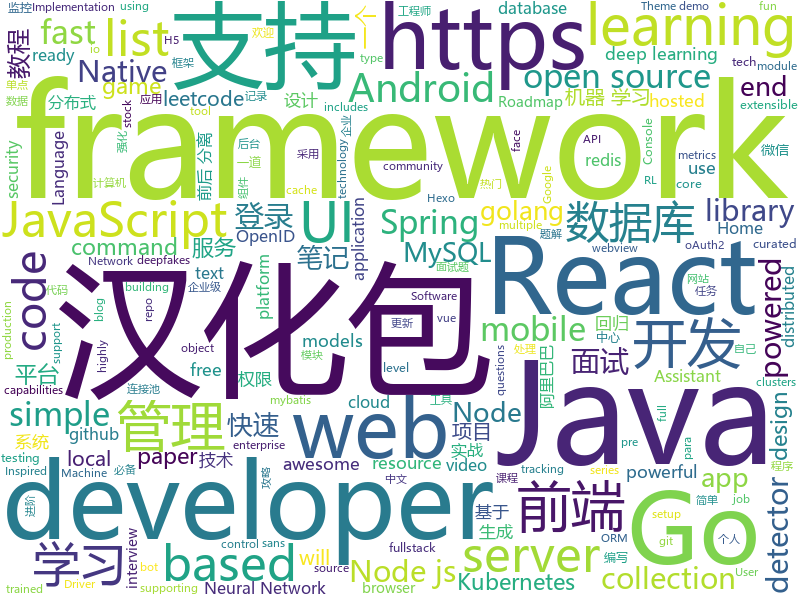

# 2019-09-04
See what the GitHub community is most excited about today.

## python
* [mlcourse.ai](https://github.com/Yorko/mlcourse.ai)(**4,899 stars today**): Open Machine Learning Course
* [faceswap](https://github.com/deepfakes/faceswap)(**23,919 stars today**): Deepfakes Software For All
* [12306](https://github.com/testerSunshine/12306)(**7,705 stars today**): 12306智能刷票，订票
* [DeepFaceLab](https://github.com/iperov/DeepFaceLab)(**7,825 stars today**): DeepFaceLab is a tool that utilizes machine learning to replace faces in videos. Includes prebuilt ready to work standalone Windows 7,8,10 binary (look readme.md).
* [chainer](https://github.com/chainer/chainer)(**5,022 stars today**): A flexible framework of neural networks for deep learning
* [pytorch-transformers](https://github.com/huggingface/pytorch-transformers)(**11,728 stars today**): 👾A library of state-of-the-art pretrained models for Natural Language Processing (NLP)
* [bert](https://github.com/google-research/bert)(**17,816 stars today**): TensorFlow code and pre-trained models for BERT
* [keras](https://github.com/keras-team/keras)(**43,844 stars today**): Deep Learning for humans
* [craftassist](https://github.com/facebookresearch/craftassist)(**302 stars today**): A virtual assistant bot in Minecraft
* [erpnext](https://github.com/frappe/erpnext)(**5,152 stars today**): Open Source ERP built for the web
* [rally](https://github.com/elastic/rally)(**884 stars today**): Macrobenchmarking framework for Elasticsearch
* [PyTorchDocs](https://github.com/fendouai/PyTorchDocs)(**184 stars today**): PyTorch 官方中文教程包含 60 分钟快速入门教程，强化教程，计算机视觉，自然语言处理，生成对抗网络，强化学习。欢迎 Star，Fork！
* [deepfakes_faceswap](https://github.com/joshua-wu/deepfakes_faceswap)(**2,636 stars today**): from deekfakes' faceswap: https://www.reddit.com/user/deepfakes/
* [thefuck](https://github.com/nvbn/thefuck)(**46,551 stars today**): Magnificent app which corrects your previous console command.
* [icecaps](https://github.com/microsoft/icecaps)(**102 stars today**): Intelligent Conversation Engine: Code and Pre-trained Systems
* [HungaBunga](https://github.com/ypeleg/HungaBunga)(**394 stars today**): HungaBunga: Brute-Force all sklearn models with all parameters using .fit .predict!
* [A-Light-and-Fast-Face-Detector-for-Edge-Devices](https://github.com/YonghaoHe/A-Light-and-Fast-Face-Detector-for-Edge-Devices)(**410 stars today**): A light and fast one class detection framework for edge devices. We provide face detector, head detector, pedestrian detector, vehicle detector......
* [trump2cash](https://github.com/maxbbraun/trump2cash)(**5,035 stars today**): A stock trading bot powered by Trump tweets
* [bsuite](https://github.com/deepmind/bsuite)(**585 stars today**): bsuite is a collection of carefully-designed experiments that investigate core capabilities of a reinforcement learning (RL) agent
* [home-assistant](https://github.com/home-assistant/home-assistant)(**26,162 stars today**): 🏡Open source home automation that puts local control and privacy first
* [Kashgari](https://github.com/BrikerMan/Kashgari)(**995 stars today**): Kashgari is a Production-ready NLP Transfer learning framework for text-labeling and text-classification, includes Word2Vec, BERT, and GPT2 Language Embedding.
* [catalyst](https://github.com/catalyst-team/catalyst)(**839 stars today**): Reproducible and fast DL & RL.
* [sort](https://github.com/abewley/sort)(**1,106 stars today**): Simple, online, and realtime tracking of multiple objects in a video sequence.
* [Deep-Learning-Papers-Reading-Roadmap](https://github.com/floodsung/Deep-Learning-Papers-Reading-Roadmap)(**23,922 stars today**): Deep Learning papers reading roadmap for anyone who are eager to learn this amazing tech!

## java
* [JavaGuide](https://github.com/Snailclimb/JavaGuide)(**53,598 stars today**): 【Java学习+面试指南】 一份涵盖大部分Java程序员所需要掌握的核心知识。
* [eladmin](https://github.com/elunez/eladmin)(**2,727 stars today**): 项目基于 Spring Boot 2.1.0 、 Jpa、 Spring Security、redis、Vue的前后端分离的后台管理系统，项目采用分模块开发方式， 权限控制采用 RBAC，支持数据字典与数据权限管理，支持一键生成前后端代码，支持动态路由
* [easyexcel](https://github.com/alibaba/easyexcel)(**8,548 stars today**): 快速、简单避免OOM的java处理Excel工具
* [xxl-job](https://github.com/xuxueli/xxl-job)(**9,822 stars today**): A lightweight distributed task scheduling framework.（分布式任务调度平台XXL-JOB）
* [CS-Notes](https://github.com/CyC2018/CS-Notes)(**76,102 stars today**): 📚Tech Interview Guide 技术面试必备基础知识、Leetcode 题解、Java、C++、Python、后端面试、操作系统、计算机网络、系统设计
* [hope-boot](https://github.com/hope-for/hope-boot)(**2,563 stars today**): 🌱🚀一款现代化的脚手架项目。企业开发？接外包？赚外快？还是学习？这都能满足你，居家必备，值得拥有🍻整合Springboot2，单点登陆+tk.mybatis+shiro+redis+thymeleaf+maven+swagger前后端分离接口管理+代码生成+定时任务+数据库版本管理flyway+hutool工具包，等实用技术。
* [SpringCloudLearning](https://github.com/forezp/SpringCloudLearning)(**10,074 stars today**): 《史上最简单的Spring Cloud教程源码》
* [QMUI_Android](https://github.com/Tencent/QMUI_Android)(**8,931 stars today**): 提高 Android UI 开发效率的 UI 库
* [fullstack-tutorial](https://github.com/frank-lam/fullstack-tutorial)(**5,408 stars today**): 🚀fullstack tutorial 2019，后台技术栈/架构师之路/全栈开发社区，春招/秋招/校招/面试
* [react-native-webview](https://github.com/react-native-community/react-native-webview)(**1,645 stars today**): React Native Cross-Platform WebView
* [Mindustry](https://github.com/Anuken/Mindustry)(**716 stars today**): A sandbox tower defense game
* [zheng](https://github.com/shuzheng/zheng)(**14,180 stars today**): 基于Spring+SpringMVC+Mybatis分布式敏捷开发系统架构，提供整套公共微服务服务模块：集中权限管理（单点登录）、内容管理、支付中心、用户管理（支持第三方登录）、微信平台、存储系统、配置中心、日志分析、任务和通知等，支持服务治理、监控和追踪，努力为中小型企业打造全方位J2EE企业级开发解决方案。
* [ZXBlog](https://github.com/ZXZxin/ZXBlog)(**3,307 stars today**): 记录各种学习笔记(算法、Java、数据库、并发......)
* [Interview-Questions](https://github.com/rishabh115/Interview-Questions)(**1,170 stars today**): Most comprehensive list📋of interview questions📘of companies scraped from Geeksforgeeks, CareerCup and Glassdoor.
* [canal](https://github.com/alibaba/canal)(**10,268 stars today**): 阿里巴巴 MySQL binlog 增量订阅&消费组件
* [java-design-patterns](https://github.com/iluwatar/java-design-patterns)(**50,992 stars today**): Design patterns implemented in Java
* [otter](https://github.com/alibaba/otter)(**4,903 stars today**): 阿里巴巴分布式数据库同步系统(解决中美异地机房)
* [quarkus](https://github.com/quarkusio/quarkus)(**2,425 stars today**): Quarkus: Supersonic Subatomic Java.
* [AgentWeb](https://github.com/Justson/AgentWeb)(**6,222 stars today**): AgentWeb is a powerful library based on Android WebView.
* [FlycoTabLayout](https://github.com/H07000223/FlycoTabLayout)(**9,049 stars today**): An Android TabLayout Lib
* [JsBridge](https://github.com/lzyzsd/JsBridge)(**7,017 stars today**): android java and javascript bridge, inspired by wechat webview jsbridge
* [druid](https://github.com/alibaba/druid)(**18,400 stars today**): 阿里巴巴数据库事业部出品，为监控而生的数据库连接池。阿里云Data Lake Analytics(https://www.aliyun.com/product/datalakeanalytics )、DRDS、TDDL 连接池powered by Druid
* [JiaoZiVideoPlayer](https://github.com/lipangit/JiaoZiVideoPlayer)(**9,626 stars today**): Android VideoPlayer MediaPlayer VideoView MediaView Float View And Fullscreen.高度自定义的开源安卓视频框架
* [paascloud-master](https://github.com/paascloud/paascloud-master)(**5,046 stars today**): spring cloud + vue + oAuth2.0全家桶实战，前后端分离模拟商城，完整的购物流程、后端运营平台，可以实现快速搭建企业级微服务项目。支持微信登录等三方登录。
* [react-native-push-notification](https://github.com/zo0r/react-native-push-notification)(**4,212 stars today**): React Native Local and Remote Notifications

## unknown
* [Data-Science--Cheat-Sheet](https://github.com/abhat222/Data-Science--Cheat-Sheet)(**10,518 stars today**): Cheat Sheets
* [Nodejs-Developer-Roadmap](https://github.com/aliyr/Nodejs-Developer-Roadmap)(**1,501 stars today**): A Developer Roadmap to becoming a Node.js developer in 2019
* [javascript-testing-best-practices](https://github.com/goldbergyoni/javascript-testing-best-practices)(**4,796 stars today**): 📗🌐🚢Comprehensive and exhaustive JavaScript & Node.js testing best practices (August 2019)
* [You-Dont-Know-JS](https://github.com/getify/You-Dont-Know-JS)(**107,817 stars today**): A book series on JavaScript. @YDKJS on twitter.
* [open-source-cs](https://github.com/ForrestKnight/open-source-cs)(**9,166 stars today**): Video discussing this curriculum:
* [deep_learning_object_detection](https://github.com/hoya012/deep_learning_object_detection)(**5,879 stars today**): A paper list of object detection using deep learning.
* [awesome-remote-job](https://github.com/lukasz-madon/awesome-remote-job)(**14,724 stars today**): A curated list of awesome remote jobs and resources. Inspired by https://github.com/vinta/awesome-python
* [BitTigerLab](https://github.com/Fabsqrt/BitTigerLab)(**1,186 stars today**): 沁原的硅谷创新课
* [build-your-own-x](https://github.com/danistefanovic/build-your-own-x)(**47,101 stars today**): 🤓Build your own (insert technology here)
* [beyond-lennon-walls](https://github.com/hongkonggong/beyond-lennon-walls)(**106 stars today**): Ways to support the Hong Kong protests from afar
* [every-programmer-should-know](https://github.com/mtdvio/every-programmer-should-know)(**39,511 stars today**): A collection of (mostly) technical things every software developer should know
* [new-pac](https://github.com/Alvin9999/new-pac)(**15,762 stars today**): 
* [android-developer-roadmap](https://github.com/mobile-roadmap/android-developer-roadmap)(**1,918 stars today**): Android Developer Roadmap 2019
* [free-programming-books-zh_CN](https://github.com/justjavac/free-programming-books-zh_CN)(**55,105 stars today**): 📚免费的计算机编程类中文书籍，欢迎投稿
* [OI-wiki](https://github.com/OI-wiki/OI-wiki)(**2,944 stars today**): 🌟Wiki for OI / ICPC. （某大型游戏线上攻略，内含炫酷算术魔法）
* [Android-Daily-Interview](https://github.com/Moosphan/Android-Daily-Interview)(**2,435 stars today**): 每工作日更新一道 Android 面试题，小聚成河，大聚成江，共勉之～
* [blog](https://github.com/brickspert/blog)(**2,126 stars today**): 个人技术博客，博文写在 Issues 里。
* [vagas](https://github.com/backend-br/vagas)(**1,652 stars today**): ✌️Espaço para divulgação de vagas para backenders
* [dl-notes](https://github.com/jianzhu/dl-notes)(**295 stars today**): 
* [leeml-notes](https://github.com/datawhalechina/leeml-notes)(**3,556 stars today**): 李宏毅《机器学习》笔记，在线阅读地址：https://datawhalechina.github.io/leeml-notes
* [regular-investing-in-box](https://github.com/xiaolai/regular-investing-in-box)(**2,985 stars today**): 定投改变命运 —— 让时间陪你慢慢变富
* [stockpredictionai](https://github.com/borisbanushev/stockpredictionai)(**1,537 stars today**): In this noteboook I will create a complete process for predicting stock price movements. Follow along and we will achieve some pretty good results. For that purpose we will use a Generative Adversarial Network (GAN) with LSTM, a type of Recurrent Neural Network, as generator, and a Convolutional Neural Network, CNN, as a discriminator. We use L…
* [benchmark_results](https://github.com/foolwood/benchmark_results)(**2,478 stars today**): Visual Tracking Paper List
* [awesome-deepfakes](https://github.com/aerophile/awesome-deepfakes)(**328 stars today**): Everything Deepfakes
* [free-resources](https://github.com/abc-club/free-resources)(**160 stars today**): 前端资源合集

## javascript
* [leonsans](https://github.com/cmiscm/leonsans)(**3,958 stars today**): Leon Sans is a geometric sans-serif typeface made with code in 2019 by Jongmin Kim.
* [Web](https://github.com/qianguyihao/Web)(**5,905 stars today**): 前端入门和进阶学习笔记，超详细的Web前端学习图文教程。从零开始学前端，做一个Web全栈工程师。持续更新...
* [taro](https://github.com/NervJS/taro)(**21,471 stars today**): 多端统一开发框架，支持用 React 的开发方式编写一次代码，生成能运行在微信/百度/支付宝/字节跳动/ QQ 小程序、快应用、H5、React Native 等的应用。 https://taro.jd.com/
* [appwrite](https://github.com/appwrite/appwrite)(**182 stars today**): End to end backend server for frontend and mobile developers.👩‍💻👨‍💻
* [tech-interview-handbook](https://github.com/yangshun/tech-interview-handbook)(**33,334 stars today**): 💯Materials to help you rock your next coding interview
* [atom](https://github.com/atom/atom)(**49,762 stars today**): The hackable text editor
* [openlayers](https://github.com/openlayers/openlayers)(**5,417 stars today**): OpenLayers
* [33-js-concepts](https://github.com/stephentian/33-js-concepts)(**9,249 stars today**): 📜每个 JavaScript 工程师都应懂的33个概念 @leonardomso
* [phaser](https://github.com/photonstorm/phaser)(**25,568 stars today**): Phaser is a fun, free and fast 2D game framework for making HTML5 games for desktop and mobile web browsers, supporting Canvas and WebGL rendering.
* [umi](https://github.com/umijs/umi)(**5,822 stars today**): 🌋Pluggable enterprise-level react application framework.
* [luban-h5](https://github.com/ly525/luban-h5)(**370 stars today**): en: A mobile page builder/editor, similar with amolink. zh: 类似易企秀的H5制作、建站工具.
* [node](https://github.com/nodejs/node)(**64,006 stars today**): Node.js JavaScript runtime✨🐢🚀✨
* [parse-server](https://github.com/parse-community/parse-server)(**16,678 stars today**): API server module for Node/Express
* [hexo](https://github.com/hexojs/hexo)(**27,874 stars today**): A fast, simple & powerful blog framework, powered by Node.js.
* [eruda](https://github.com/liriliri/eruda)(**6,463 stars today**): Console for mobile browsers
* [mdx-deck](https://github.com/jxnblk/mdx-deck)(**7,862 stars today**): ♠️React MDX-based presentation decks
* [leetcode](https://github.com/azl397985856/leetcode)(**17,536 stars today**): LeetCode Solutions: A Record of My Problem Solving Journey.( leetcode题解，记录自己的leetcode解题之路。)
* [incubator-echarts](https://github.com/apache/incubator-echarts)(**36,253 stars today**): A powerful, interactive charting and visualization library for browser
* [vant-weapp](https://github.com/youzan/vant-weapp)(**10,300 stars today**): 轻量、可靠的小程序 UI 组件库
* [Daily-Interview-Question](https://github.com/Advanced-Frontend/Daily-Interview-Question)(**14,016 stars today**): 我是木易杨，公众号「高级前端进阶」作者，每天搞定一道前端大厂面试题，祝大家天天进步，一年后会看到不一样的自己。
* [eui](https://github.com/elastic/eui)(**917 stars today**): Elastic UI Framework🙌
* [react-demos](https://github.com/ruanyf/react-demos)(**14,528 stars today**): a collection of simple demos of React.js
* [odoo](https://github.com/odoo/odoo)(**14,848 stars today**): Odoo. Open Source Apps To Grow Your Business.
* [Fomantic-UI](https://github.com/fomantic/Fomantic-UI)(**1,022 stars today**): Fomantic-UI is a community fork of Semantic-UI
* [realworld](https://github.com/gothinkster/realworld)(**30,740 stars today**): "The mother of all demo apps" — Exemplary fullstack Medium.com clone powered by React, Angular, Node, Django, and many more🏅

## html
* [free-for-dev](https://github.com/ripienaar/free-for-dev)(**23,901 stars today**): A list of SaaS, PaaS and IaaS offerings that have free tiers of interest to devops and infradev
* [HADotNet.CommandCenter](https://github.com/qJake/HADotNet.CommandCenter)(**67 stars today**): 📱A web-based, wall-mountable command center for Home Assistant.
* [Front-end-Developer-Interview-Questions](https://github.com/h5bp/Front-end-Developer-Interview-Questions)(**42,015 stars today**): A list of helpful front-end related questions you can use to interview potential candidates, test yourself or completely ignore.
* [curso-react-redux](https://github.com/cod3rcursos/curso-react-redux)(**598 stars today**): 
* [java-2019](https://github.com/njuics/java-2019)(**15 stars today**): Java 2019 https://njuics.github.io/java-2019/
* [sourcegraph](https://github.com/sourcegraph/sourcegraph)(**2,601 stars today**): Code search and navigation tool (self-hosted)
* [webdevbootcamp](https://github.com/nax3t/webdevbootcamp)(**723 stars today**): All source code for back-end projects from the Web Developer Bootcamp
* [stickyfill](https://github.com/wilddeer/stickyfill)(**1,890 stars today**): Polyfill for CSS `position: sticky`
* [boost](https://github.com/boostorg/boost)(**2,947 stars today**): Super-project for modularized Boost
* [AdminLTE](https://github.com/ColorlibHQ/AdminLTE)(**29,976 stars today**): AdminLTE - Free Premium Admin control Panel Theme Based On Bootstrap 3.x
* [learning-area](https://github.com/mdn/learning-area)(**1,998 stars today**): Github repo for the MDN Learning Area.
* [Coursera-ML-AndrewNg-Notes](https://github.com/fengdu78/Coursera-ML-AndrewNg-Notes)(**11,295 stars today**): 吴恩达老师的机器学习课程个人笔记
* [REKCARC-TSC-UHT](https://github.com/PKUanonym/REKCARC-TSC-UHT)(**10,221 stars today**): 清华大学计算机系课程攻略 Guidance for courses in Department of Computer Science and Technology, Tsinghua University
* [fonts](https://github.com/google/fonts)(**12,598 stars today**): Font files available from Google Fonts
* [speedtest](https://github.com/adolfintel/speedtest)(**2,560 stars today**): Self-hosted HTML5 Speedtest. Easy setup, examples, configurable, mobile friendly. Supports PHP, Node, Multiple servers, and more
* [mqtt](https://github.com/mcxiaoke/mqtt)(**2,662 stars today**): MQTT 3.1.1 Protocol Chinese Translation
* [home-assistant.io](https://github.com/home-assistant/home-assistant.io)(**865 stars today**): 📘Home Assistant User documentation
* [hexo-theme-matery](https://github.com/blinkfox/hexo-theme-matery)(**900 stars today**): A beautiful hexo blog theme with material design and responsive design.一个基于材料设计和响应式设计而成的全面、美观的Hexo主题。
* [proposal-pipeline-operator](https://github.com/tc39/proposal-pipeline-operator)(**4,322 stars today**): A proposal for adding the simple-but-useful pipeline operator to JavaScript.
* [hr](https://github.com/OCA/hr)(**89 stars today**): Odoo Human Resources Addons
* [indigo](https://github.com/sergiokopplin/indigo)(**1,555 stars today**): 🍜Minimalist Jekyll Template
* [Machine-Learning](https://github.com/Jack-Cherish/Machine-Learning)(**2,136 stars today**): ⚡️机器学习实战（Python3）：kNN、决策树、贝叶斯、逻辑回归、SVM、线性回归、树回归
* [samples](https://github.com/GoogleChrome/samples)(**4,459 stars today**): A repo containing samples tied to new functionality in each release of Google Chrome.
* [TranslatorX](https://github.com/pingfangx/TranslatorX)(**2,665 stars today**): JetBrains 系列软件汉化包 关键字: Android Studio 3.5 汉化包 CLion 2019.2 汉化包 DataGrip 2019.2 汉化包 GoLand 2019.2 汉化包 IntelliJ IDEA 2019.2 汉化包 PhpStorm 2019.2 汉化包 PyCharm 2019.2 汉化包 Rider 2019.2 汉化包 RubyMine 2019.2 汉化包 WebStorm 2019.2 汉化包
* [flutter-in-action](https://github.com/flutterchina/flutter-in-action)(**5,870 stars today**): 《Flutter实战》电子书

## go
* [telegraf](https://github.com/influxdata/telegraf)(**7,302 stars today**): The plugin-driven server agent for collecting & reporting metrics.
* [golang-lru](https://github.com/hashicorp/golang-lru)(**1,305 stars today**): Golang LRU cache
* [TopList](https://github.com/tophubs/TopList)(**2,283 stars today**): 今日热榜，一个获取各大热门网站热门头条的聚合网站，使用Go语言编写，多协程异步快速抓取信息，预览:https://www.printf520.com/hot.html
* [thanos](https://github.com/thanos-io/thanos)(**4,216 stars today**): Highly available Prometheus setup with long term storage capabilities.
* [hydra](https://github.com/ory/hydra)(**7,030 stars today**): OpenID Certified™ OpenID Connect & OAuth2 Server (OP, OpenID Provider) - cloud native, security-first, open source API security for your infrastructure. Written in Go. SDKs for any language.
* [tidb](https://github.com/pingcap/tidb)(**20,440 stars today**): TiDB is an open source distributed HTAP database compatible with the MySQL protocol
* [v2ray-core](https://github.com/v2ray/v2ray-core)(**20,117 stars today**): A platform for building proxies to bypass network restrictions.
* [redis](https://github.com/go-redis/redis)(**6,776 stars today**): Type-safe Redis client for Golang
* [go-filecoin](https://github.com/filecoin-project/go-filecoin)(**1,170 stars today**): Filecoin Full Node Implementation in Go
* [gitea](https://github.com/go-gitea/gitea)(**15,733 stars today**): Git with a cup of tea, painless self-hosted git service
* [opencensus-go](https://github.com/census-instrumentation/opencensus-go)(**1,563 stars today**): A stats collection and distributed tracing framework
* [fx](https://github.com/uber-go/fx)(**835 stars today**): A dependency injection based application framework for Go.
* [mysql](https://github.com/go-sql-driver/mysql)(**8,260 stars today**): Go MySQL Driver is a MySQL driver for Go's (golang) database/sql package
* [go-git](https://github.com/src-d/go-git)(**4,360 stars today**): A highly extensible Git implementation in pure Go.
* [cli](https://github.com/urfave/cli)(**11,754 stars today**): A simple, fast, and fun package for building command line apps in Go
* [octant](https://github.com/vmware/octant)(**2,362 stars today**): A web-based, highly extensible platform for developers to better understand the complexity of Kubernetes clusters.
* [helmfile](https://github.com/roboll/helmfile)(**1,298 stars today**): Deploy Kubernetes Helm Charts
* [falcon-plus](https://github.com/open-falcon/falcon-plus)(**5,004 stars today**): An open-source and enterprise-level monitoring system.
* [gf](https://github.com/gogf/gf)(**1,321 stars today**): GoFrame is a modular, full-featured and production-ready application development framework of golang. Providing a series of core components and dozens of practical modules, such as: cache, logging, containers, timer, resource, validator, database orm, etc. Supporting web server integrated with router, cookie, session, middleware, logger, configu…
* [go-plugins](https://github.com/micro/go-plugins)(**862 stars today**): Community maintained plugins for micro
* [gorm](https://github.com/jinzhu/gorm)(**15,043 stars today**): The fantastic ORM library for Golang, aims to be developer friendly
* [ReverseProxy](https://github.com/ilanyu/ReverseProxy)(**1,985 stars today**): ReverseProxy in golang
* [awesome-go](https://github.com/avelino/awesome-go)(**47,491 stars today**): A curated list of awesome Go frameworks, libraries and software
* [influxdb](https://github.com/influxdata/influxdb)(**17,298 stars today**): Scalable datastore for metrics, events, and real-time analytics
* [kind](https://github.com/kubernetes-sigs/kind)(**2,981 stars today**): Kubernetes IN Docker - local clusters for testing Kubernetes

## WordCloud

