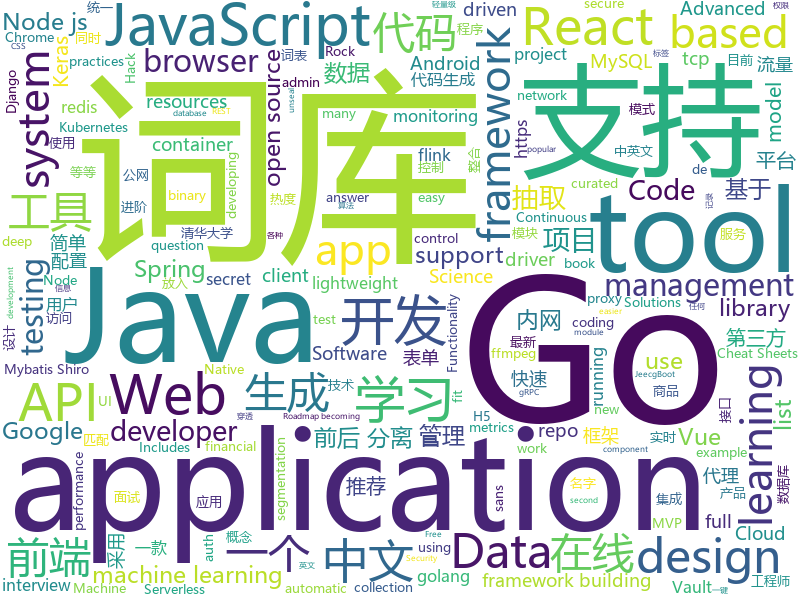

# 2019-09-05
See what the GitHub community is most excited about today.

## python
* [DeepFaceLab](https://github.com/iperov/DeepFaceLab)(**838 stars today**): DeepFaceLab is a tool that utilizes machine learning to replace faces in videos. Includes prebuilt ready to work standalone Windows 7,8,10 binary (look readme.md).
* [faceswap](https://github.com/deepfakes/faceswap)(**506 stars today**): Deepfakes Software For All
* [mlcourse.ai](https://github.com/Yorko/mlcourse.ai)(**459 stars today**): Open Machine Learning Course
* [pwn_jenkins](https://github.com/gquere/pwn_jenkins)(**57 stars today**): Notes about attacking Jenkins servers
* [mne-python](https://github.com/mne-tools/mne-python)(**9 stars today**): MNE : Magnetoencephalography (MEG) and Electroencephalography (EEG) in Python
* [system-design-primer](https://github.com/donnemartin/system-design-primer)(**91 stars today**): Learn how to design large-scale systems. Prep for the system design interview. Includes Anki flashcards.
* [qiling](https://github.com/qilingframework/qiling)(**4 stars today**): Qiling Advanced Binary Emulation framework
* [ckiptagger](https://github.com/ckiplab/ckiptagger)(**323 stars today**): CKIP Neural Chinese Word Segmentation, POS Tagging, and NER
* [public-apis](https://github.com/public-apis/public-apis)(**68 stars today**): A collective list of free APIs for use in software and web development.
* [mlfinlab](https://github.com/hudson-and-thames/mlfinlab)(**58 stars today**): Package based on the work of Dr Marcos Lopez de Prado regarding his research with respect to Advances in Financial Machine Learning
* [12306](https://github.com/testerSunshine/12306)(**499 stars today**): 12306智能刷票，订票
* [barq](https://github.com/Voulnet/barq)(**12 stars today**): barq: The AWS Cloud Post Exploitation framework!
* [GENTRL](https://github.com/insilicomedicine/GENTRL)(**50 stars today**): Generative Tensorial Reinforcement Learning (GENTRL) model
* [HungaBunga](https://github.com/ypeleg/HungaBunga)(**12 stars today**): HungaBunga: Brute-Force all sklearn models with all parameters using .fit .predict!
* [craftassist](https://github.com/facebookresearch/craftassist)(**20 stars today**): A virtual assistant bot in Minecraft
* [airflow](https://github.com/apache/airflow)(**13 stars today**): Apache Airflow
* [wagtail](https://github.com/wagtail/wagtail)(**10 stars today**): A Django content management system focused on flexibility and user experience
* [serverless-application-model](https://github.com/awslabs/serverless-application-model)(**8 stars today**): AWS Serverless Application Model (SAM) is an open-source framework for building serverless applications
* [netbox](https://github.com/netbox-community/netbox)(**4 stars today**): IP address management (IPAM) and data center infrastructure management (DCIM) tool.
* [pyforest](https://github.com/8080labs/pyforest)(**8 stars today**): Lazy-import of all popular Python Data Science libraries
* [django-cms](https://github.com/divio/django-cms)(**6 stars today**): The easy-to-use and developer-friendly CMS
* [segmentation_models](https://github.com/qubvel/segmentation_models)(**5 stars today**): Segmentation models with pretrained backbones. Keras and TensorFlow Keras.
* [Mask_RCNN](https://github.com/matterport/Mask_RCNN)(**26 stars today**): Mask R-CNN for object detection and instance segmentation on Keras and TensorFlow
* [ScoutSuite](https://github.com/nccgroup/ScoutSuite)(**9 stars today**): Multi-Cloud Security Auditing Tool
* [funNLP](https://github.com/fighting41love/funNLP)(**50 stars today**): 中英文敏感词、语言检测、中外手机/电话归属地/运营商查询、名字推断性别、手机号抽取、身份证抽取、邮箱抽取、中日文人名库、中文缩写库、拆字词典、词汇情感值、停用词、反动词表、暴恐词表、繁简体转换、英文模拟中文发音、汪峰歌词生成器、职业名称词库、同义词库、反义词库、否定词库、汽车品牌词库、汽车零件词库、连续英文切割、各种中文词向量、公司名字大全、古诗词库、IT词库、财经词库、成语词库、地名词库、历史名人词库、诗词词库、医学词库、饮食词库、法律词库、汽车词库、动物词库、中文聊天语料、中文谣言数据、百度中文问答数据集、句子相似度匹配算法集合、bert资源、文本生成&摘要相关工具、cocoNLP信息抽取工具、国内电话号码正则匹配、清华大学XLORE:中英文跨语言百科知识图谱、清华大学人工智能技术…

## java
* [eladmin](https://github.com/elunez/eladmin)(**136 stars today**): 项目基于 Spring Boot 2.1.0 、 Jpa、 Spring Security、redis、Vue的前后端分离的后台管理系统，项目采用分模块开发方式， 权限控制采用 RBAC，支持数据字典与数据权限管理，支持一键生成前后端代码，支持动态路由
* [JavaGuide](https://github.com/Snailclimb/JavaGuide)(**262 stars today**): 【Java学习+面试指南】 一份涵盖大部分Java程序员所需要掌握的核心知识。
* [easyexcel](https://github.com/alibaba/easyexcel)(**75 stars today**): 快速、简单避免OOM的java处理Excel工具
* [hope-boot](https://github.com/hope-for/hope-boot)(**49 stars today**): 🌱🚀一款现代化的脚手架项目。企业开发？接外包？赚外快？还是学习？这都能满足你，居家必备，值得拥有🍻整合Springboot2，单点登陆+tk.mybatis+shiro+redis+thymeleaf+maven+swagger前后端分离接口管理+代码生成+定时任务+数据库版本管理flyway+hutool工具包，等实用技术。
* [jeecg-boot](https://github.com/zhangdaiscott/jeecg-boot)(**65 stars today**): 一款基于代码生成器的JAVA快速开发平台！采用最新技术，前后端分离架构：SpringBoot 2.x，Ant Design&Vue，Mybatis，Shiro，JWT。强大的代码生成器让前后端代码一键生成，无需写任何代码，绝对是全栈开发福音！！ JeecgBoot的宗旨是提高UI能力的同时,降低前后分离的开发成本，JeecgBoot还独创在线开发模式，No代码概念，一系列在线智能开发：在线配置表单、在线配置报表、在线设计流程等等。
* [skywalking](https://github.com/apache/skywalking)(**26 stars today**): APM, Application Performance Monitoring System
* [canal](https://github.com/alibaba/canal)(**38 stars today**): 阿里巴巴 MySQL binlog 增量订阅&消费组件
* [flink-learning](https://github.com/zhisheng17/flink-learning)(**26 stars today**): flink learning blog. http://www.54tianzhisheng.cn
* [hive](https://github.com/apache/hive)(**2 stars today**): Apache Hive
* [SpringCloudLearning](https://github.com/forezp/SpringCloudLearning)(**40 stars today**): 《史上最简单的Spring Cloud教程源码》
* [flink-recommandSystem-demo](https://github.com/CheckChe0803/flink-recommandSystem-demo)(**34 stars today**): 🚁🚀基于Flink实现的商品实时推荐系统。flink统计商品热度，放入redis缓存，分析日志信息，将画像标签和实时记录放入Hbase。在用户发起推荐请求后，根据用户画像重排序热度榜，并结合协同过滤和标签两个推荐模块为新生成的榜单的每一个产品添加关联产品，最后返回新的用户列表。
* [lanproxy](https://github.com/ffay/lanproxy)(**7 stars today**): lanproxy是一个将局域网个人电脑、服务器代理到公网的内网穿透工具，目前仅支持tcp流量转发，可支持任何tcp上层协议（访问内网网站、本地支付接口调试、ssh访问、远程桌面...）。目前市面上提供类似服务的有花生壳、TeamView、GoToMyCloud等等，但要使用第三方的公网服务器就必须为第三方付费，并且这些服务都有各种各样的限制，此外，由于数据包会流经第三方，因此对数据安全也是一大隐患。
* [spring-boot-admin](https://github.com/codecentric/spring-boot-admin)(**6 stars today**): Admin UI for administration of spring boot applications
* [jetty.project](https://github.com/eclipse/jetty.project)(**5 stars today**): Eclipse Jetty® - Web Container & Clients - supports HTTP/2, HTTP/1.1, HTTP/1.0, websocket, servlets, and more
* [zaproxy](https://github.com/zaproxy/zaproxy)(**7 stars today**): The OWASP ZAP core project
* [selenium](https://github.com/SeleniumHQ/selenium)(**13 stars today**): A browser automation framework and ecosystem.
* [netty](https://github.com/netty/netty)(**22 stars today**): Netty project - an event-driven asynchronous network application framework
* [micrometer](https://github.com/micrometer-metrics/micrometer)(**4 stars today**): An application metrics facade for the most popular monitoring tools. Think SLF4J, but for metrics.
* [xxl-job](https://github.com/xuxueli/xxl-job)(**39 stars today**): A lightweight distributed task scheduling framework.（分布式任务调度平台XXL-JOB）
* [ZXBlog](https://github.com/ZXZxin/ZXBlog)(**27 stars today**): 记录各种学习笔记(算法、Java、数据库、并发......)
* [JsonPath](https://github.com/json-path/JsonPath)(**6 stars today**): Java JsonPath implementation
* [keycloak](https://github.com/keycloak/keycloak)(**12 stars today**): Open Source Identity and Access Management For Modern Applications and Services
* [Sentinel](https://github.com/alibaba/Sentinel)(**20 stars today**): A lightweight powerful flow control component enabling reliability and monitoring for microservices. (轻量级的流量控制、熔断降级 Java 库)
* [MVPArms](https://github.com/JessYanCoding/MVPArms)(**3 stars today**): ⚔️A common architecture for Android applications developing based on MVP, integrates many open source projects, to make your developing quicker and easier (一个整合了大量主流开源项目高度可配置化的 Android MVP 快速集成框架).
* [jabel](https://github.com/bsideup/jabel)(**13 stars today**): Jabel - unlock Javac 12+ syntax when targeting Java 8

## unknown
* [OnJava8](https://github.com/LingCoder/OnJava8)(**34 stars today**): 《On Java 8》中文版，又名《Java编程思想》 第5版
* [You-Dont-Know-JS](https://github.com/getify/You-Dont-Know-JS)(**120 stars today**): A book series on JavaScript. @YDKJS on twitter.
* [Data-Science--Cheat-Sheet](https://github.com/abhat222/Data-Science--Cheat-Sheet)(**128 stars today**): Cheat Sheets
* [javascript-testing-best-practices](https://github.com/goldbergyoni/javascript-testing-best-practices)(**151 stars today**): 📗🌐🚢Comprehensive and exhaustive JavaScript & Node.js testing best practices (August 2019)
* [Data-Science-Competitions](https://github.com/interviewBubble/Data-Science-Competitions)(**52 stars today**): Goal of this repo is to provide solutions of all Data Science Competitions(Kaggle, Data Hack, Machine Hack, Driven Data etc...).
* [developer-roadmap](https://github.com/kamranahmedse/developer-roadmap)(**89 stars today**): Roadmap to becoming a web developer in 2019
* [intuitive-advanced-cryptography](https://github.com/cryptosubtlety/intuitive-advanced-cryptography)(**9 stars today**): Intuitive Advanced Cryptography
* [cheatsheets-ai](https://github.com/kailashahirwar/cheatsheets-ai)(**13 stars today**): Essential Cheat Sheets for deep learning and machine learning researchers
* [git-flight-rules](https://github.com/k88hudson/git-flight-rules)(**41 stars today**): Flight rules for git
* [1](https://github.com/1jie/1)(**8 stars today**): 这里是直播平台永久回家页，有最新app下载地址。
* [ConardLi.github.io](https://github.com/ConardLi/ConardLi.github.io)(**12 stars today**): ConardLi 写blog的地方
* [financial-machine-learning](https://github.com/firmai/financial-machine-learning)(**4 stars today**): A curated list of practical financial machine learning (FinML) tools and applications in Python.
* [My-blog](https://github.com/markyun/My-blog)(**3 stars today**): 马云云在Github的学习片段 https://www.yuque.com/markyun
* [cvpr2019](https://github.com/extreme-assistant/cvpr2019)(**11 stars today**): cvpr2019／cvpr2018/cvpr2019 papers，极市团队整理
* [awesome-malware-analysis](https://github.com/rshipp/awesome-malware-analysis)(**7 stars today**): A curated list of awesome malware analysis tools and resources.
* [vagas](https://github.com/react-brasil/vagas)(**2 stars today**): Espaço para divulgação de vagas relacionadas com React
* [what-happens-when](https://github.com/alex/what-happens-when)(**29 stars today**): An attempt to answer the age old interview question "What happens when you type google.com into your browser and press enter?"
* [chromium](https://github.com/jjqqkk/chromium)(**5 stars today**): Chromium browser with SSL VPN. Use this browser to unblock websites.
* [Announcements](https://github.com/aspnet/Announcements)(**1 stars today**): Subscribe to this repo to be notified about major changes in ASP.NET Core and Entity Framework Core
* [webkit](https://github.com/WebKit/webkit)(**1 stars today**): Unofficial mirror of the WebKit SVN repository
* [Nodejs-Developer-Roadmap](https://github.com/aliyr/Nodejs-Developer-Roadmap)(**160 stars today**): A Developer Roadmap to becoming a Node.js developer in 2019
* [Python-Books](https://github.com/manash-biswal/Python-Books)(**3 stars today**): 
* [system_design](https://github.com/shashank88/system_design)(**4 stars today**): Preparation links and resources for system design questions
* [papers-we-love](https://github.com/papers-we-love/papers-we-love)(**20 stars today**): Papers from the computer science community to read and discuss.
* [Become-A-Full-Stack-Web-Developer](https://github.com/bmorelli25/Become-A-Full-Stack-Web-Developer)(**3 stars today**): Free resources for learning Full Stack Web Development

## javascript
* [leonsans](https://github.com/cmiscm/leonsans)(**867 stars today**): Leon Sans is a geometric sans-serif typeface made with code in 2019 by Jongmin Kim.
* [realworld](https://github.com/gothinkster/realworld)(**152 stars today**): "The mother of all demo apps" — Exemplary fullstack Medium.com clone powered by React, Angular, Node, Django, and many more🏅
* [tech-interview-handbook](https://github.com/yangshun/tech-interview-handbook)(**135 stars today**): 💯Materials to help you rock your next coding interview
* [flow-typed](https://github.com/flow-typed/flow-typed)(**19 stars today**): A central repository for Flow library definitions
* [taro](https://github.com/NervJS/taro)(**115 stars today**): 多端统一开发框架，支持用 React 的开发方式编写一次代码，生成能运行在微信/百度/支付宝/字节跳动/ QQ 小程序、快应用、H5、React Native 等的应用。 https://taro.jd.com/
* [uni-app](https://github.com/dcloudio/uni-app)(**56 stars today**): uni-app 是使用 Vue 语法开发小程序、H5、App的统一框架
* [umi](https://github.com/umijs/umi)(**18 stars today**): 🌋Pluggable enterprise-level react application framework.
* [chart.xkcd](https://github.com/timqian/chart.xkcd)(**80 stars today**): xkcd styled chart lib
* [Web](https://github.com/qianguyihao/Web)(**196 stars today**): 前端入门和进阶学习笔记，超详细的Web前端学习图文教程。从零开始学前端，做一个Web全栈工程师。持续更新...
* [react-testing-library](https://github.com/testing-library/react-testing-library)(**22 stars today**): 🐐Simple and complete React DOM testing utilities that encourage good testing practices.
* [reveal.js](https://github.com/hakimel/reveal.js)(**27 stars today**): The HTML Presentation Framework
* [jest](https://github.com/facebook/jest)(**30 stars today**): Delightful JavaScript Testing.
* [openlayers](https://github.com/openlayers/openlayers)(**9 stars today**): OpenLayers
* [three.js](https://github.com/mrdoob/three.js)(**36 stars today**): JavaScript 3D library.
* [relay](https://github.com/facebook/relay)(**4 stars today**): Relay is a JavaScript framework for building data-driven React applications.
* [noUiSlider](https://github.com/leongersen/noUiSlider)(**3 stars today**): noUiSlider is a lightweight JavaScript range slider library with full multi-touch support. It fits wonderfully in responsive designs and has no dependencies.
* [puppeteer-examples](https://github.com/checkly/puppeteer-examples)(**6 stars today**): Puppeteer example scripts for running Headless Chrome from Node. Run them at https://puppeteersandbox.com
* [json-server](https://github.com/typicode/json-server)(**25 stars today**): Get a full fake REST API with zero coding in less than 30 seconds (seriously)
* [33-js-concepts](https://github.com/stephentian/33-js-concepts)(**52 stars today**): 📜每个 JavaScript 工程师都应懂的33个概念 @leonardomso
* [cli](https://github.com/react-native-community/cli)(**2 stars today**): React Native command line tools
* [web3.js](https://github.com/ethereum/web3.js)(**7 stars today**): Ethereum JavaScript API
* [vue-form-making](https://github.com/GavinZhuLei/vue-form-making)(**5 stars today**): 基于Vue的表单设计器，让表单开发简单而高效。
* [clean-code-javascript](https://github.com/ryanmcdermott/clean-code-javascript)(**17 stars today**): 🛁Clean Code concepts adapted for JavaScript
* [react-admin](https://github.com/marmelab/react-admin)(**13 stars today**): A frontend Framework for building admin applications running in the browser on top of REST/GraphQL APIs, using ES6, React and Material Design
* [Blog](https://github.com/ljianshu/Blog)(**14 stars today**): 关注基础知识，打造优质前端博客，公众号[前端工匠]的作者

## html
* [cypress-example-kitchensink](https://github.com/cypress-io/cypress-example-kitchensink)(**0 stars today**): This is an example app used to showcase Cypress.io testing.
* [Java-Interview-Advanced](https://github.com/shishan100/Java-Interview-Advanced)(**12 stars today**): 中华石杉--互联网Java进阶面试训练营
* [postmark-templates](https://github.com/wildbit/postmark-templates)(**2 stars today**): Rock-solid email templates for applications.
* [catapult](https://github.com/catapult-project/catapult)(**0 stars today**): Catapult
* [dragon-book-exercise-answers](https://github.com/fool2fish/dragon-book-exercise-answers)(**8 stars today**): Compilers Principles, Techniques, & Tools (purple dragon book) second edition exercise answers. 编译原理（紫龙书）第2版习题答案。
* [dropcss](https://github.com/leeoniya/dropcss)(**14 stars today**): An exceptionally fast, thorough and tiny unused-CSS cleaner
* [learnyounode](https://github.com/workshopper/learnyounode)(**2 stars today**): Learn You The Node.js For Much Win! An intro to Node.js via a set of self-guided workshops.
* [web-moderno](https://github.com/cod3rcursos/web-moderno)(**4 stars today**): 
* [portainer](https://github.com/portainer/portainer)(**20 stars today**): Making Docker management easy.
* [fuzzdb](https://github.com/tennc/fuzzdb)(**8 stars today**): 一个fuzzdb扩展库
* [webcomponents](https://github.com/w3c/webcomponents)(**5 stars today**): Web Components specifications
* [styleguide](https://github.com/google/styleguide)(**11 stars today**): Style guides for Google-originated open-source projects
* [wow_api](https://github.com/illidan33/wow_api)(**1 stars today**): Documents of wow API -- 魔兽世界API资料以及宏工具
* [embeddedsw](https://github.com/Xilinx/embeddedsw)(**1 stars today**): Xilinx Embedded Software (embeddedsw) Development
* [nndl.github.io](https://github.com/nndl/nndl.github.io)(**7 stars today**): 《神经网络与深度学习》 Neural Network and Deep Learning
* [flag-icon-css](https://github.com/lipis/flag-icon-css)(**5 stars today**): 🎏A collection of all country flags in SVG — plus the CSS for easier integration
* [HiddenEye](https://github.com/DarkSecDevelopers/HiddenEye)(**12 stars today**): Modern Phishing Tool With Advanced Functionality [ Android-Support-Available ]
* [webinars](https://github.com/rstudio/webinars)(**0 stars today**): Code and slides for RStudio webinars
* [Front-end-Developer-Interview-Questions](https://github.com/h5bp/Front-end-Developer-Interview-Questions)(**9 stars today**): A list of helpful front-end related questions you can use to interview potential candidates, test yourself or completely ignore.
* [node-fluent-ffmpeg](https://github.com/fluent-ffmpeg/node-fluent-ffmpeg)(**2 stars today**): A fluent API to FFMPEG (http://www.ffmpeg.org)
* [CLRS](https://github.com/walkccc/CLRS)(**2 stars today**): 📚Solutions to Introduction to Algorithms Third Edition
* [mxgraph](https://github.com/jgraph/mxgraph)(**8 stars today**): mxGraph is a fully client side JavaScript diagramming library
* [samples](https://github.com/GoogleChrome/samples)(**1 stars today**): A repo containing samples tied to new functionality in each release of Google Chrome.
* [compat-table](https://github.com/kangax/compat-table)(**2 stars today**): ECMAScript 5/6/7 compatibility tables
* [ecma262](https://github.com/tc39/ecma262)(**8 stars today**): Status, process, and documents for ECMA-262

## go
* [nps](https://github.com/cnlh/nps)(**76 stars today**): 一款轻量级、功能强大的内网穿透代理服务器。支持tcp、udp流量转发，支持内网http代理、内网socks5代理，同时支持snappy压缩、站点保护、加密传输、多路复用、header修改等。支持web图形化管理，集成多用户模式。
* [golangci-lint](https://github.com/golangci/golangci-lint)(**11 stars today**): Linters Runner for Go. 5x faster than gometalinter. Nice colored output. Can report only new issues. Fewer false-positives. Yaml/toml config.
* [golang-lru](https://github.com/hashicorp/golang-lru)(**24 stars today**): Golang LRU cache
* [sqlx](https://github.com/jmoiron/sqlx)(**8 stars today**): general purpose extensions to golang's database/sql
* [mysql](https://github.com/go-sql-driver/mysql)(**12 stars today**): Go MySQL Driver is a MySQL driver for Go's (golang) database/sql package
* [go](https://github.com/golang/go)(**80 stars today**): The Go programming language
* [bank-vaults](https://github.com/banzaicloud/bank-vaults)(**4 stars today**): A Vault swiss-army knife: a K8s operator, Go client with automatic token renewal, automatic configuration, multiple unseal options and more. A CLI tool to init, unseal and configure Vault (auth methods, secret engines). Direct secret injection into Pods.
* [grpc-go](https://github.com/grpc/grpc-go)(**12 stars today**): The Go language implementation of gRPC. HTTP/2 based RPC
* [goproxy.cn](https://github.com/goproxy/goproxy.cn)(**186 stars today**): The most trusted Go module proxy in China.
* [syncthing](https://github.com/syncthing/syncthing)(**35 stars today**): Open Source Continuous File Synchronization
* [opencensus-go](https://github.com/census-instrumentation/opencensus-go)(**8 stars today**): A stats collection and distributed tracing framework
* [protobuf](https://github.com/golang/protobuf)(**11 stars today**): Go support for Google's protocol buffers
* [gopherjs](https://github.com/gopherjs/gopherjs)(**11 stars today**): A compiler from Go to JavaScript for running Go code in a browser
* [errors](https://github.com/pkg/errors)(**11 stars today**): Simple error handling primitives
* [goproxy](https://github.com/goproxyio/goproxy)(**32 stars today**): A global proxy for Go modules.
* [mongo-go-driver](https://github.com/mongodb/mongo-go-driver)(**8 stars today**): The Go driver for MongoDB
* [vault-secrets-operator](https://github.com/ricoberger/vault-secrets-operator)(**23 stars today**): Create Kubernetes secrets from Vault for a secure GitOps based workflow.
* [sarama](https://github.com/Shopify/sarama)(**10 stars today**): Sarama is a Go library for Apache Kafka 0.8, and up.
* [singularity](https://github.com/sylabs/singularity)(**6 stars today**): Singularity: Application containers for Linux
* [concourse](https://github.com/concourse/concourse)(**8 stars today**): Concourse is a container-based continuous thing-doer written in Go and Elm.
* [go](https://github.com/json-iterator/go)(**12 stars today**): A high-performance 100% compatible drop-in replacement of "encoding/json"
* [kafka_exporter](https://github.com/danielqsj/kafka_exporter)(**3 stars today**): Kafka exporter for Prometheus
* [go-grpc-middleware](https://github.com/grpc-ecosystem/go-grpc-middleware)(**7 stars today**): Golang gRPC Middlewares: interceptor chaining, auth, logging, retries and more.
* [test-infra](https://github.com/kubernetes/test-infra)(**1 stars today**): Test infrastructure for the Kubernetes project.
* [istio](https://github.com/istio/istio)(**29 stars today**): Connect, secure, control, and observe services.

## WordCloud

