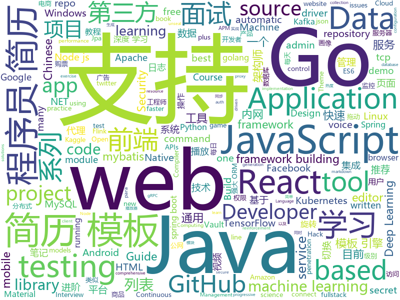

# 2019-09-06
See what the GitHub community is most excited about today.

## python
* [12306](https://github.com/testerSunshine/12306)(**508 stars today**): 12306智能刷票，订票
* [neural-structured-learning](https://github.com/tensorflow/neural-structured-learning)(**72 stars today**): 
* [ckiptagger](https://github.com/ckiplab/ckiptagger)(**251 stars today**): CKIP Neural Chinese Word Segmentation, POS Tagging, and NER
* [mlcourse.ai](https://github.com/Yorko/mlcourse.ai)(**222 stars today**): Open Machine Learning Course
* [py12306](https://github.com/pjialin/py12306)(**33 stars today**): 🚂12306 购票助手，支持分布式，多账号，多任务购票以及 Web 页面管理
* [HungaBunga](https://github.com/ypeleg/HungaBunga)(**14 stars today**): HungaBunga: Brute-Force all sklearn models with all parameters using .fit .predict!
* [spinningup](https://github.com/openai/spinningup)(**7 stars today**): An educational resource to help anyone learn deep reinforcement learning.
* [keras](https://github.com/keras-team/keras)(**41 stars today**): Deep Learning for humans
* [sagemaker-python-sdk](https://github.com/aws/sagemaker-python-sdk)(**2 stars today**): A library for training and deploying machine learning models on Amazon SageMaker
* [ceviche](https://github.com/twhughes/ceviche)(**15 stars today**): 🦐Electromagnetic Simulation + Automatic Differentiation
* [Real-Time-Voice-Cloning](https://github.com/CorentinJ/Real-Time-Voice-Cloning)(**182 stars today**): Clone a voice in 5 seconds to generate arbitrary speech in real-time
* [gitGraber](https://github.com/hisxo/gitGraber)(**52 stars today**): gitGraber is a tool developed in Python3 to monitor GitHub to search and find sensitive data for different online services such as: Google, Amazon, Paypal, Github, Mailgun, Facebook, Twitter, Heroku, Stripe...
* [data-science-ipython-notebooks](https://github.com/donnemartin/data-science-ipython-notebooks)(**20 stars today**): Data science Python notebooks: Deep learning (TensorFlow, Theano, Caffe, Keras), scikit-learn, Kaggle, big data (Spark, Hadoop MapReduce, HDFS), matplotlib, pandas, NumPy, SciPy, Python essentials, AWS, and various command lines.
* [SC-SfMLearner-Release](https://github.com/JiawangBian/SC-SfMLearner-Release)(**21 stars today**): Unsupervised Scale-consistent Depth and Ego-motion Learning from Monocular Video (NeurIPS 2019)
* [mne-python](https://github.com/mne-tools/mne-python)(**18 stars today**): MNE : Magnetoencephalography (MEG) and Electroencephalography (EEG) in Python
* [models](https://github.com/tensorflow/models)(**46 stars today**): Models and examples built with TensorFlow
* [d2l-zh](https://github.com/d2l-ai/d2l-zh)(**30 stars today**): 《动手学深度学习》：面向中文读者、能运行、可讨论。英文版即伯克利“深度学习导论”教材。
* [stanford-tensorflow-tutorials](https://github.com/chiphuyen/stanford-tensorflow-tutorials)(**18 stars today**): This repository contains code examples for the Stanford's course: TensorFlow for Deep Learning Research.
* [chineseocr](https://github.com/chineseocr/chineseocr)(**11 stars today**): yolo3+ocr
* [awesome-data-comp-solution](https://github.com/apachecn/awesome-data-comp-solution)(**38 stars today**): 数据科学/人工智能比赛解决方案汇总
* [rasa](https://github.com/RasaHQ/rasa)(**14 stars today**): 💬Open source machine learning framework to automate text- and voice-based conversations: NLU, dialogue management, connect to Slack, Facebook, and more - Create chatbots and voice assistants
* [The-Neural-Qubit](https://github.com/llSourcell/The-Neural-Qubit)(**8 stars today**): This is the code "The Neural Qubit", the quantum machine learning research paper & video by Siraj Raval
* [keras-retinanet](https://github.com/fizyr/keras-retinanet)(**5 stars today**): Keras implementation of RetinaNet object detection.
* [bsuite](https://github.com/deepmind/bsuite)(**15 stars today**): bsuite is a collection of carefully-designed experiments that investigate core capabilities of a reinforcement learning (RL) agent
* [xlnet](https://github.com/zihangdai/xlnet)(**17 stars today**): XLNet: Generalized Autoregressive Pretraining for Language Understanding

## java
* [eladmin](https://github.com/elunez/eladmin)(**177 stars today**): 项目基于 Spring Boot 2.1.0 、 Jpa、 Spring Security、redis、Vue的前后端分离的后台管理系统，项目采用分模块开发方式， 权限控制采用 RBAC，支持数据字典与数据权限管理，支持一键生成前后端代码，支持动态路由
* [JavaGuide](https://github.com/Snailclimb/JavaGuide)(**321 stars today**): 【Java学习+面试指南】 一份涵盖大部分Java程序员所需要掌握的核心知识。
* [JustAuth](https://github.com/justauth/JustAuth)(**57 stars today**): 💯史上最全的整合第三方登录的开源库。目前已支持Github、Gitee、微博、钉钉、百度、Coding、腾讯云开发者平台、OSChina、支付宝、QQ、微信、淘宝、Google、Facebook、抖音、领英、小米、微软、今日头条、Teambition、StackOverflow、Pinterest、人人、华为、企业微信、酷家乐和Gitlab等第三方平台的授权登录。 Login, so easy!
* [tutorials](https://github.com/eugenp/tutorials)(**29 stars today**): The "REST With Spring" Course:
* [easyexcel](https://github.com/alibaba/easyexcel)(**114 stars today**): 快速、简单避免OOM的java处理Excel工具
* [mockito](https://github.com/mockito/mockito)(**8 stars today**): Most popular Mocking framework for unit tests written in Java
* [gpmall](https://github.com/2227324689/gpmall)(**15 stars today**): 【咕泡学院实战项目】-基于SpringBoot+Dubbo构建的电商平台-微服务架构、商城、电商、微服务、高并发、kafka、Elasticsearch
* [flink-recommandSystem-demo](https://github.com/CheckChe0803/flink-recommandSystem-demo)(**39 stars today**): 🚁🚀基于Flink实现的商品实时推荐系统。flink统计商品热度，放入redis缓存，分析日志信息，将画像标签和实时记录放入Hbase。在用户发起推荐请求后，根据用户画像重排序热度榜，并结合协同过滤和标签两个推荐模块为新生成的榜单的每一个产品添加关联产品，最后返回新的用户列表。
* [skywalking](https://github.com/apache/skywalking)(**28 stars today**): APM, Application Performance Monitoring System
* [GSYVideoPlayer](https://github.com/CarGuo/GSYVideoPlayer)(**17 stars today**): 视频播放器（IJKplayer、ExoPlayer、MediaPlayer），HTTPS，支持弹幕，支持滤镜、水印、gif截图，片头广告、中间广告，多个同时播放，支持基本的拖动，声音、亮度调节，支持边播边缓存，支持视频自带rotation的旋转（90,270之类），重力旋转与手动旋转的同步支持，支持列表播放 ，列表全屏动画，视频加载速度，列表小窗口支持拖动，动画效果，调整比例，多分辨率切换，支持切换播放器，进度条小窗口预览，列表切换详情页面无缝播放，rtsp、concat、mpeg。
* [beam](https://github.com/apache/beam)(**5 stars today**): Apache Beam
* [hive](https://github.com/apache/hive)(**5 stars today**): Apache Hive
* [SpringCloudLearning](https://github.com/forezp/SpringCloudLearning)(**46 stars today**): 《史上最简单的Spring Cloud教程源码》
* [platform_frameworks_base](https://github.com/aosp-mirror/platform_frameworks_base)(**7 stars today**): 
* [apm-agent-java](https://github.com/elastic/apm-agent-java)(**0 stars today**): Elastic APM Java Agent
* [keycloak](https://github.com/keycloak/keycloak)(**10 stars today**): Open Source Identity and Access Management For Modern Applications and Services
* [canal](https://github.com/alibaba/canal)(**43 stars today**): 阿里巴巴 MySQL binlog 增量订阅&消费组件
* [fullstack-tutorial](https://github.com/frank-lam/fullstack-tutorial)(**20 stars today**): 🚀fullstack tutorial 2019，后台技术栈/架构师之路/全栈开发社区，春招/秋招/校招/面试
* [spring-boot-demo](https://github.com/xkcoding/spring-boot-demo)(**68 stars today**): spring boot demo 是一个用来深度学习并实战 spring boot 的项目，目前总共包含 59 个集成demo，已经完成 49 个。 该项目已成功集成 actuator(监控)、admin(可视化监控)、logback(日志)、aopLog(通过AOP记录web请求日志)、统一异常处理(json级别和页面级别)、freemarker(模板引擎)、thymeleaf(模板引擎)、Beetl(模板引擎)、Enjoy(模板引擎)、JdbcTemplate(通用JDBC操作数据库)、JPA(强大的ORM框架)、mybatis(强大的ORM框架)、通用Mapper(快速操作Mybatis)、PageHelper(通用的Mybatis分页插件)、mybatis-plus(快速操作M…
* [otter](https://github.com/alibaba/otter)(**9 stars today**): 阿里巴巴分布式数据库同步系统(解决中美异地机房)
* [lanproxy](https://github.com/ffay/lanproxy)(**40 stars today**): lanproxy是一个将局域网个人电脑、服务器代理到公网的内网穿透工具，目前仅支持tcp流量转发，可支持任何tcp上层协议（访问内网网站、本地支付接口调试、ssh访问、远程桌面...）。目前市面上提供类似服务的有花生壳、TeamView、GoToMyCloud等等，但要使用第三方的公网服务器就必须为第三方付费，并且这些服务都有各种各样的限制，此外，由于数据包会流经第三方，因此对数据安全也是一大隐患。
* [hbase](https://github.com/apache/hbase)(**2 stars today**): Mirror of Apache HBase
* [FlycoTabLayout](https://github.com/H07000223/FlycoTabLayout)(**7 stars today**): An Android TabLayout Lib
* [CS-Notes](https://github.com/CyC2018/CS-Notes)(**124 stars today**): 📚Tech Interview Guide 技术面试必备基础知识、Leetcode 题解、Java、C++、Python、后端面试、操作系统、计算机网络、系统设计
* [JsonPath](https://github.com/json-path/JsonPath)(**11 stars today**): Java JsonPath implementation

## unknown
* [Index](https://github.com/HowProgrammingWorks/Index)(**8 stars today**): Repositories Index
* [Data-Science-Competitions](https://github.com/interviewBubble/Data-Science-Competitions)(**19 stars today**): Goal of this repo is to provide solutions of all Data Science Competitions(Kaggle, Data Hack, Machine Hack, Driven Data etc...).
* [starter-workflows](https://github.com/actions/starter-workflows)(**20 stars today**): Accelerating new GitHub Actions workflows
* [awesome-architecture](https://github.com/toutiaoio/awesome-architecture)(**22 stars today**): 架构师技术图谱，助你早日成为架构师
* [You-Dont-Know-JS](https://github.com/getify/You-Dont-Know-JS)(**70 stars today**): A book series on JavaScript. @YDKJS on twitter.
* [aws-cloudformation-coverage-roadmap](https://github.com/aws-cloudformation/aws-cloudformation-coverage-roadmap)(**4 stars today**): The AWS CloudFormation Public Coverage Roadmap
* [Conference-Acceptance-Rate](https://github.com/lixin4ever/Conference-Acceptance-Rate)(**7 stars today**): Statistics of acceptance rate for the main AI conference
* [roberta_zh](https://github.com/brightmart/roberta_zh)(**101 stars today**): RoBERTa for Chinese
* [DevMoneySharing](https://github.com/loonggg/DevMoneySharing)(**45 stars today**): 独立开发者赚钱经验分享
* [vagas](https://github.com/frontendbr/vagas)(**4 stars today**): 🔬Espaço para divulgação de vagas para front-enders.
* [weekly](https://github.com/dt-fe/weekly)(**12 stars today**): 前端精读周刊
* [Nodejs-Developer-Roadmap](https://github.com/aliyr/Nodejs-Developer-Roadmap)(**120 stars today**): A Developer Roadmap to becoming a Node.js developer in 2019
* [Blog](https://github.com/mqyqingfeng/Blog)(**26 stars today**): 冴羽写博客的地方，预计写四个系列：JavaScript深入系列、JavaScript专题系列、ES6系列、React系列。
* [javascript-testing-best-practices](https://github.com/goldbergyoni/javascript-testing-best-practices)(**58 stars today**): 📗🌐🚢Comprehensive and exhaustive JavaScript & Node.js testing best practices (August 2019)
* [Interview_Question_for_Beginner](https://github.com/JaeYeopHan/Interview_Question_for_Beginner)(**14 stars today**): 👦👧Technical-Interview guidelines written for those who started studying programming. I wish you all the best.👾
* [OWASP-Testing-Guide-v5](https://github.com/OWASP/OWASP-Testing-Guide-v5)(**3 stars today**): The OWASP Testing Guide includes a "best practice" penetration testing framework which users can implement in their own organizations and a "low level" penetration testing guide that describes techniques for testing most common web application and web service security issues.
* [3D-Machine-Learning](https://github.com/timzhang642/3D-Machine-Learning)(**16 stars today**): A resource repository for 3D machine learning
* [awesome-satellite-imagery-datasets](https://github.com/chrieke/awesome-satellite-imagery-datasets)(**1 stars today**): List of satellite imagery datasets with annotations for computer vision and deep learning
* [koa2-note](https://github.com/chenshenhai/koa2-note)(**6 stars today**): 《Koa2进阶学习笔记》已完结🎄🎄🎄
* [awesome-incident-response](https://github.com/meirwah/awesome-incident-response)(**1 stars today**): A curated list of tools for incident response
* [OnJava8](https://github.com/LingCoder/OnJava8)(**18 stars today**): 《On Java 8》中文版，又名《Java编程思想》 第5版
* [ResumeSample](https://github.com/geekcompany/ResumeSample)(**86 stars today**): Resume template for Chinese programmers . 程序员简历模板系列。包括PHP程序员简历模板、iOS程序员简历模板、Android程序员简历模板、Web前端程序员简历模板、Java程序员简历模板、C/C++程序员简历模板、NodeJS程序员简历模板、架构师简历模板以及通用程序员简历模板
* [binance-official-api-docs](https://github.com/binance-exchange/binance-official-api-docs)(**1 stars today**): Official Documentation for the Binance APIs and Streams
* [leetcode](https://github.com/grandyang/leetcode)(**15 stars today**): Provide all my solutions and explanations in Chinese for all the Leetcode coding problems.
* [CKAD-exercises](https://github.com/dgkanatsios/CKAD-exercises)(**9 stars today**): A set of exercises to prepare for Certified Kubernetes Application Developer exam by Cloud Native Computing Foundation

## javascript
* [flow-typed](https://github.com/flow-typed/flow-typed)(**17 stars today**): A central repository for Flow library definitions
* [Web](https://github.com/qianguyihao/Web)(**64 stars today**): 前端入门和进阶学习笔记，超详细的Web前端学习图文教程。从零开始学前端，做一个Web全栈工程师。持续更新...
* [realworld](https://github.com/gothinkster/realworld)(**356 stars today**): "The mother of all demo apps" — Exemplary fullstack Medium.com clone powered by React, Angular, Node, Django, and many more🏅
* [Ackee](https://github.com/electerious/Ackee)(**94 stars today**): Self-hosted, Node.js based analytics tool for those who care about privacy.
* [appium](https://github.com/appium/appium)(**10 stars today**): 📱Automation for iOS, Android, and Windows Apps.
* [react](https://github.com/facebook/react)(**80 stars today**): A declarative, efficient, and flexible JavaScript library for building user interfaces.
* [junior-recruit-scheduler](https://github.com/jojoldu/junior-recruit-scheduler)(**7 stars today**): 주니어 개발자 채용 정보
* [material-ui](https://github.com/mui-org/material-ui)(**44 stars today**): React components for faster and easier web development. Build your own design system, or start with Material Design.
* [fe-interview](https://github.com/haizlin/fe-interview)(**26 stars today**): 前端面试每日 3+1，以面试题来驱动学习，提倡每日学习与思考，每天进步一点！每天早上5点纯手工发布面试题（死磕自己，愉悦大家）
* [cli](https://github.com/react-native-community/cli)(**4 stars today**): React Native command line tools
* [create-react-app](https://github.com/facebook/create-react-app)(**37 stars today**): Set up a modern web app by running one command.
* [Boostnote](https://github.com/BoostIO/Boostnote)(**39 stars today**): A markdown editor for developers on Mac, Windows and Linux.
* [relay](https://github.com/facebook/relay)(**8 stars today**): Relay is a JavaScript framework for building data-driven React applications.
* [phaser](https://github.com/photonstorm/phaser)(**14 stars today**): Phaser is a fun, free and fast 2D game framework for making HTML5 games for desktop and mobile web browsers, supporting Canvas and WebGL rendering.
* [vue](https://github.com/vuejs/vue)(**89 stars today**): 🖖Vue.js is a progressive, incrementally-adoptable JavaScript framework for building UI on the web.
* [felipefialho.com](https://github.com/felipefialho/felipefialho.com)(**16 stars today**): 😺My personal website
* [react-router](https://github.com/ReactTraining/react-router)(**19 stars today**): Declarative routing for React
* [react-admin](https://github.com/marmelab/react-admin)(**21 stars today**): A frontend Framework for building admin applications running in the browser on top of REST/GraphQL APIs, using ES6, React and Material Design
* [33-js-concepts](https://github.com/stephentian/33-js-concepts)(**29 stars today**): 📜每个 JavaScript 工程师都应懂的33个概念 @leonardomso
* [parse-server](https://github.com/parse-community/parse-server)(**9 stars today**): API server module for Node/Express
* [react-native](https://github.com/facebook/react-native)(**37 stars today**): A framework for building native apps with React.
* [react-static](https://github.com/react-static/react-static)(**18 stars today**): ⚛️🚀A progressive static site generator for React.
* [Viewers](https://github.com/OHIF/Viewers)(**0 stars today**): OHIF zero-footprint DICOM viewer and oncology specific Lesion Tracker, plus shared extension packages
* [brave-browser](https://github.com/brave/brave-browser)(**19 stars today**): Next generation Brave browser for macOS, Windows, Linux, and eventually Android
* [luban-h5](https://github.com/ly525/luban-h5)(**14 stars today**): en: A mobile page builder/editor, similar with amolink. zh: 类似易企秀的H5制作、建站工具.

## html
* [Java-Interview-Advanced](https://github.com/shishan100/Java-Interview-Advanced)(**5 stars today**): 中华石杉--互联网Java进阶面试训练营
* [AdminLTE](https://github.com/ColorlibHQ/AdminLTE)(**30 stars today**): AdminLTE - Free Premium Admin control Panel Theme Based On Bootstrap 3.x
* [Coursera-ML-AndrewNg-Notes](https://github.com/fengdu78/Coursera-ML-AndrewNg-Notes)(**13 stars today**): 吴恩达老师的机器学习课程个人笔记
* [js-xss](https://github.com/leizongmin/js-xss)(**3 stars today**): Sanitize untrusted HTML (to prevent XSS) with a configuration specified by a Whitelist
* [owasp-mstg](https://github.com/OWASP/owasp-mstg)(**5 stars today**): The Mobile Security Testing Guide (MSTG) is a comprehensive manual for mobile app security development, testing and reverse engineering.
* [webdevbootcamp](https://github.com/nax3t/webdevbootcamp)(**4 stars today**): All source code for back-end projects from the Web Developer Bootcamp
* [mxgraph](https://github.com/jgraph/mxgraph)(**4 stars today**): mxGraph is a fully client side JavaScript diagramming library
* [all-contributors](https://github.com/all-contributors/all-contributors)(**8 stars today**): ✨Recognize all contributors, not just the ones who push code✨
* [zTree_v3](https://github.com/zTree/zTree_v3)(**1 stars today**): jQuery Tree Plugin
* [fastText](https://github.com/facebookresearch/fastText)(**15 stars today**): Library for fast text representation and classification.
* [jsr](https://github.com/mercyblitz/jsr)(**8 stars today**): Java Specification Requests
* [awesome-quantum-machine-learning](https://github.com/krishnakumarsekar/awesome-quantum-machine-learning)(**6 stars today**): Here you can get all the Quantum Machine learning Basics, Algorithms ,Study Materials ,Projects and the descriptions of the projects around the web
* [18337](https://github.com/mitmath/18337)(**41 stars today**): 18.337 - Parallel Computing and Scientific Machine Learning
* [wysiwyg-editor](https://github.com/froala/wysiwyg-editor)(**3 stars today**): The next generation Javascript WYSIWYG HTML Editor.
* [linuxtools_rst](https://github.com/me115/linuxtools_rst)(**2 stars today**): Linux工具快速教程
* [selfie2anime-site](https://github.com/SilentByte/selfie2anime-site)(**2 stars today**): What do YOU look like in Anime? Here's the source of selfie2anime.com
* [responsive-html-email-template](https://github.com/leemunroe/responsive-html-email-template)(**5 stars today**): A free simple responsive HTML email template
* [csswg-drafts](https://github.com/w3c/csswg-drafts)(**3 stars today**): CSS Working Group Editor Drafts
* [learning-area](https://github.com/mdn/learning-area)(**2 stars today**): Github repo for the MDN Learning Area.
* [Moon](https://github.com/TaylanTatli/Moon)(**1 stars today**): Moon is a minimal, one column jekyll theme.
* [dragon-book-exercise-answers](https://github.com/fool2fish/dragon-book-exercise-answers)(**2 stars today**): Compilers Principles, Techniques, & Tools (purple dragon book) second edition exercise answers. 编译原理（紫龙书）第2版习题答案。
* [dotnet](https://github.com/microsoft/dotnet)(**5 stars today**): This repo is the official home of .NET on GitHub. It's a great starting point to find many .NET OSS projects from Microsoft and the community, including many that are part of the .NET Foundation.
* [gradle-profiler](https://github.com/gradle/gradle-profiler)(**0 stars today**): A tool for gathering profiling and benchmarking information for Gradle builds
* [Markdown-Resume](https://github.com/CyC2018/Markdown-Resume)(**4 stars today**): ⭐️Markdown 简历模版
* [hugo-academic](https://github.com/gcushen/hugo-academic)(**2 stars today**): 📝The website builder for Hugo. Build and deploy a beautiful website in minutes!

## go
* [nps](https://github.com/cnlh/nps)(**48 stars today**): 一款轻量级、功能强大的内网穿透代理服务器。支持tcp、udp流量转发，支持内网http代理、内网socks5代理，同时支持snappy压缩、站点保护、加密传输、多路复用、header修改等。支持web图形化管理，集成多用户模式。
* [golangci-lint](https://github.com/golangci/golangci-lint)(**14 stars today**): Linters Runner for Go. 5x faster than gometalinter. Nice colored output. Can report only new issues. Fewer false-positives. Yaml/toml config.
* [golang-lru](https://github.com/hashicorp/golang-lru)(**18 stars today**): Golang LRU cache
* [sqlx](https://github.com/jmoiron/sqlx)(**4 stars today**): general purpose extensions to golang's database/sql
* [mysql](https://github.com/go-sql-driver/mysql)(**9 stars today**): Go MySQL Driver is a MySQL driver for Go's (golang) database/sql package
* [go](https://github.com/golang/go)(**80 stars today**): The Go programming language
* [bank-vaults](https://github.com/banzaicloud/bank-vaults)(**2 stars today**): A Vault swiss-army knife: a K8s operator, Go client with automatic token renewal, automatic configuration, multiple unseal options and more. A CLI tool to init, unseal and configure Vault (auth methods, secret engines). Direct secret injection into Pods.
* [grpc-go](https://github.com/grpc/grpc-go)(**11 stars today**): The Go language implementation of gRPC. HTTP/2 based RPC
* [goproxy.cn](https://github.com/goproxy/goproxy.cn)(**182 stars today**): The most trusted Go module proxy in China.
* [syncthing](https://github.com/syncthing/syncthing)(**37 stars today**): Open Source Continuous File Synchronization
* [opencensus-go](https://github.com/census-instrumentation/opencensus-go)(**4 stars today**): A stats collection and distributed tracing framework
* [protobuf](https://github.com/golang/protobuf)(**4 stars today**): Go support for Google's protocol buffers
* [gopherjs](https://github.com/gopherjs/gopherjs)(**9 stars today**): A compiler from Go to JavaScript for running Go code in a browser
* [errors](https://github.com/pkg/errors)(**11 stars today**): Simple error handling primitives
* [goproxy](https://github.com/goproxyio/goproxy)(**20 stars today**): A global proxy for Go modules.
* [mongo-go-driver](https://github.com/mongodb/mongo-go-driver)(**5 stars today**): The Go driver for MongoDB
* [vault-secrets-operator](https://github.com/ricoberger/vault-secrets-operator)(**14 stars today**): Create Kubernetes secrets from Vault for a secure GitOps based workflow.
* [sarama](https://github.com/Shopify/sarama)(**11 stars today**): Sarama is a Go library for Apache Kafka 0.8, and up.
* [singularity](https://github.com/sylabs/singularity)(**6 stars today**): Singularity: Application containers for Linux
* [concourse](https://github.com/concourse/concourse)(**17 stars today**): Concourse is a container-based continuous thing-doer written in Go and Elm.
* [go](https://github.com/json-iterator/go)(**8 stars today**): A high-performance 100% compatible drop-in replacement of "encoding/json"
* [kafka_exporter](https://github.com/danielqsj/kafka_exporter)(**3 stars today**): Kafka exporter for Prometheus
* [go-grpc-middleware](https://github.com/grpc-ecosystem/go-grpc-middleware)(**9 stars today**): Golang gRPC Middlewares: interceptor chaining, auth, logging, retries and more.
* [test-infra](https://github.com/kubernetes/test-infra)(**6 stars today**): Test infrastructure for the Kubernetes project.
* [istio](https://github.com/istio/istio)(**23 stars today**): Connect, secure, control, and observe services.

## WordCloud

