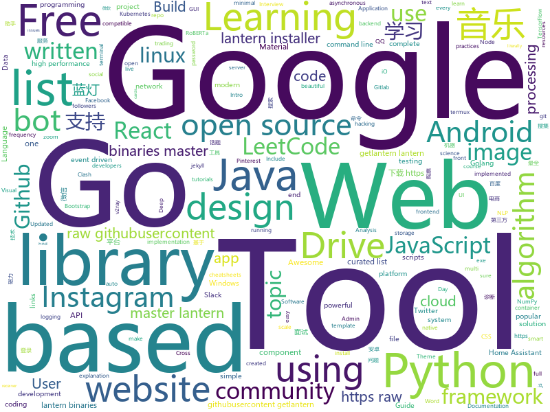

# 2019-09-10
See what the GitHub community is most excited about today.

## python
* [12306](https://github.com/testerSunshine/12306)(**937 stars today**): 12306智能刷票，订票
* [py12306](https://github.com/pjialin/py12306)(**269 stars today**): 🚂12306 购票助手，支持分布式，多账号，多任务购票以及 Web 页面管理
* [tiler](https://github.com/nuno-faria/tiler)(**563 stars today**): 👷Build images with images
* [instabot](https://github.com/instagrambot/instabot)(**29 stars today**): 🐙Free Instagram scripts, bots and Python API wrapper. Get free instagram followers with our auto like, auto follow and other scripts!
* [tf-quant-finance](https://github.com/google/tf-quant-finance)(**168 stars today**): High-performance TensorFlow library for quantitative finance.
* [data-science-ipython-notebooks](https://github.com/donnemartin/data-science-ipython-notebooks)(**155 stars today**): Data science Python notebooks: Deep learning (TensorFlow, Theano, Caffe, Keras), scikit-learn, Kaggle, big data (Spark, Hadoop MapReduce, HDFS), matplotlib, pandas, NumPy, SciPy, Python essentials, AWS, and various command lines.
* [roberta_zh](https://github.com/brightmart/roberta_zh)(**63 stars today**): RoBERTa中文预训练模型: RoBERTa for Chinese
* [system-design-primer](https://github.com/donnemartin/system-design-primer)(**66 stars today**): Learn how to design large-scale systems. Prep for the system design interview. Includes Anki flashcards.
* [numpy-ml](https://github.com/ddbourgin/numpy-ml)(**44 stars today**): Machine learning, in numpy
* [sherlock](https://github.com/sherlock-project/sherlock)(**8 stars today**): 🔎Find usernames across social networks
* [easy12306](https://github.com/zhaipro/easy12306)(**69 stars today**): 使用机器学习算法完成对12306验证码的自动识别
* [twint](https://github.com/twintproject/twint)(**30 stars today**): An advanced Twitter scraping & OSINT tool written in Python that doesn't use Twitter's API, allowing you to scrape a user's followers, following, Tweets and more while evading most API limitations.
* [InstaPy](https://github.com/timgrossmann/InstaPy)(**8 stars today**): 📷Instagram Bot - Tool for automated Instagram interactions
* [FreeAnchor](https://github.com/zhangxiaosong18/FreeAnchor)(**37 stars today**): FreeAnchor: Learning to Match Anchors for Visual Object Detection (NeurIPS 2019)
* [RustPython](https://github.com/RustPython/RustPython)(**17 stars today**): A Python Interpreter written in Rust
* [lutris](https://github.com/lutris/lutris)(**17 stars today**): Lutris client - Open Source gaming platform for GNU/Linux
* [ctf](https://github.com/p4-team/ctf)(**12 stars today**): Ctf solutions from p4 team
* [rlpyt](https://github.com/astooke/rlpyt)(**45 stars today**): Reinforcement Learning in PyTorch
* [youtube-dl-gui](https://github.com/MrS0m30n3/youtube-dl-gui)(**6 stars today**): A cross platform front-end GUI of the popular youtube-dl written in wxPython.
* [CCF-BDCI-Sentiment-Analysis-Baseline](https://github.com/guoday/CCF-BDCI-Sentiment-Analysis-Baseline)(**22 stars today**): The code for CCF-BDCI-Sentiment-Analysis-Baseline
* [Tool-X](https://github.com/Rajkumrdusad/Tool-X)(**5 stars today**): Tool-X is a kali linux hacking Tool installer. Tool-X developed for termux and other android terminals. using Tool-X you can install almost 263 hacking tools in termux app and other linux based distributions.
* [freqtrade](https://github.com/freqtrade/freqtrade)(**6 stars today**): Free, open source crypto trading bot
* [AutoRouterIP](https://github.com/testerSunshine/AutoRouterIP)(**5 stars today**): 自动切换家庭对外出口ip
* [hacs](https://github.com/custom-components/hacs)(**4 stars today**): Manage (Install, track, upgrade) and discover custom elements for Home Assistant.
* [gym](https://github.com/openai/gym)(**6 stars today**): A toolkit for developing and comparing reinforcement learning algorithms.

## java
* [bistoury](https://github.com/qunarcorp/bistoury)(**56 stars today**): Bistoury是去哪儿网的java应用生产问题诊断工具，提供了一站式的问题诊断方案
* [SkyStone](https://github.com/FIRST-Tech-Challenge/SkyStone)(**13 stars today**): FTC SDK
* [magnetW](https://github.com/dengyuhan/magnetW)(**91 stars today**): 磁力搜网页版 - 磁力链接聚合搜索 - https://bt.biedian.me
* [LeetCodeAnimation](https://github.com/MisterBooo/LeetCodeAnimation)(**96 stars today**): Demonstrate all the questions on LeetCode in the form of animation.（用动画的形式呈现解LeetCode题目的思路）
* [Java](https://github.com/TheAlgorithms/Java)(**31 stars today**): All Algorithms implemented in Java
* [antlr4](https://github.com/antlr/antlr4)(**9 stars today**): ANTLR (ANother Tool for Language Recognition) is a powerful parser generator for reading, processing, executing, or translating structured text or binary files.
* [EhViewer](https://github.com/seven332/EhViewer)(**6 stars today**): [DEPRECATED] An Unofficial E-Hentai Application for Android
* [JustAuth](https://github.com/justauth/JustAuth)(**95 stars today**): 💯史上最全的整合第三方登录的开源库。目前已支持Github、Gitee、微博、钉钉、百度、Coding、腾讯云开发者平台、OSChina、支付宝、QQ、微信、淘宝、Google、Facebook、抖音、领英、小米、微软、今日头条、Teambition、StackOverflow、Pinterest、人人、华为、企业微信、酷家乐和Gitlab等第三方平台的授权登录。 Login, so easy!
* [libgdx](https://github.com/libgdx/libgdx)(**3 stars today**): Desktop/Android/HTML5/iOS Java game development framework
* [MusicLake](https://github.com/caiyonglong/MusicLake)(**23 stars today**): 音乐播放器，可播在线音乐，qq音乐，百度音乐，虾米音乐，网易云音乐，YouTuBe
* [spring-framework](https://github.com/spring-projects/spring-framework)(**40 stars today**): Spring Framework
* [proxyee-down](https://github.com/proxyee-down-org/proxyee-down)(**11 stars today**): http下载工具，基于http代理，支持多连接分块下载
* [NewPipe](https://github.com/TeamNewPipe/NewPipe)(**4 stars today**): A libre lightweight streaming front-end for Android.
* [CS-Notes](https://github.com/CyC2018/CS-Notes)(**121 stars today**): 📚Tech Interview Guide 技术面试必备基础知识、Leetcode 题解、Java、C++、Python、后端面试、操作系统、计算机网络、系统设计
* [java-design-patterns](https://github.com/iluwatar/java-design-patterns)(**35 stars today**): Design patterns implemented in Java
* [netty](https://github.com/netty/netty)(**21 stars today**): Netty project - an event-driven asynchronous network application framework
* [gpmall](https://github.com/2227324689/gpmall)(**15 stars today**): 【咕泡学院实战项目】-基于SpringBoot+Dubbo构建的电商平台-微服务架构、商城、电商、微服务、高并发、kafka、Elasticsearch
* [Telegram](https://github.com/DrKLO/Telegram)(**6 stars today**): Telegram for Android source
* [community](https://github.com/GoogleCloudPlatform/community)(**1 stars today**): This repository holds the content submitted to https://cloud.google.com/community. Files added to the tutorials/ will appear at https://cloud.google.com/community/tutorials.
* [awesome-java-leetcode](https://github.com/Blankj/awesome-java-leetcode)(**7 stars today**): 👑LeetCode of algorithms with java solution(updating).
* [caffeine](https://github.com/ben-manes/caffeine)(**7 stars today**): A high performance caching library for Java 8
* [Nukkit](https://github.com/NukkitX/Nukkit)(**0 stars today**): Nuclear-Powered Server Software for Minecraft: Bedrock Edition.
* [Mindustry](https://github.com/Anuken/Mindustry)(**8 stars today**): A sandbox tower defense game
* [spring5webapp](https://github.com/springframeworkguru/spring5webapp)(**0 stars today**): Example Spring 5 Web Application
* [VirtualXposed](https://github.com/android-hacker/VirtualXposed)(**11 stars today**): A simple app to use Xposed without root, unlock the bootloader or modify system image, etc.

## unknown
* [eng-practices](https://github.com/google/eng-practices)(**1,535 stars today**): Google's Engineering Practices documentation
* [backend](https://github.com/kottans/backend)(**29 stars today**): Kottans backend course🎓
* [Java-Interview](https://github.com/gzc426/Java-Interview)(**49 stars today**): Java 面试必会 直通BAT
* [the-book-of-secret-knowledge](https://github.com/trimstray/the-book-of-secret-knowledge)(**36 stars today**): A collection of inspiring lists, manuals, cheatsheets, blogs, hacks, one-liners, cli/web tools and more.
* [coding-interview-university](https://github.com/jwasham/coding-interview-university)(**130 stars today**): A complete computer science study plan to become a software engineer.
* [awesome-public-datasets](https://github.com/awesomedata/awesome-public-datasets)(**31 stars today**): A topic-centric list of HQ open datasets. PR ☛☛☛
* [trackerslist](https://github.com/ngosang/trackerslist)(**23 stars today**): Updated list of public BitTorrent trackers
* [Index](https://github.com/HowProgrammingWorks/Index)(**12 stars today**): Repositories Index
* [vscode-icons](https://github.com/microsoft/vscode-icons)(**10 stars today**): Icons for Visual Studio Code
* [Best-App](https://github.com/hzlzh/Best-App)(**10 stars today**): 收集&推荐优秀的 Apps/硬件/技巧/周边等
* [awesome-nlp](https://github.com/keon/awesome-nlp)(**7 stars today**): 📖A curated list of resources dedicated to Natural Language Processing (NLP)
* [3y](https://github.com/ZhongFuCheng3y/3y)(**11 stars today**): Java3y
* [Probable-Wordlists](https://github.com/berzerk0/Probable-Wordlists)(**2 stars today**): Version 2 is live! Wordlists sorted by probability originally created for password generation and testing - make sure your passwords aren't popular!
* [design-patterns-for-humans](https://github.com/kamranahmedse/design-patterns-for-humans)(**12 stars today**): An ultra-simplified explanation to design patterns
* [android](https://github.com/LineageOS/android)(**5 stars today**): 
* [google-10000-english](https://github.com/first20hours/google-10000-english)(**5 stars today**): This repo contains a list of the 10,000 most common English words in order of frequency, as determined by n-gram frequency analysis of the Google's Trillion Word Corpus.
* [download](https://github.com/getlantern/download)(**26 stars today**): 蓝灯Windows下载 https://raw.githubusercontent.com/getlantern/lantern-binaries/master/lantern-installer.exe 蓝灯安卓下载 https://raw.githubusercontent.com/getlantern/lantern-binaries/master/lantern-installer.apk
* [SS-Rule-Snippet](https://github.com/Hackl0us/SS-Rule-Snippet)(**5 stars today**): 搜集、整理、维护 Surge / Quantumult / Shadowrocket / Surfboard / clash(X) 实用规则。
* [udacity-nanodegrees](https://github.com/mikesprague/udacity-nanodegrees)(**3 stars today**): 🎓List of Udacity Nanodegree programs with links to the free courses in their curricula
* [awesome](https://github.com/sindresorhus/awesome)(**72 stars today**): 😎Awesome lists about all kinds of interesting topics
* [A-to-Z-Resources-for-Students](https://github.com/dipakkr/A-to-Z-Resources-for-Students)(**8 stars today**): ✅Curated list of resources for college students
* [leetcode](https://github.com/grandyang/leetcode)(**8 stars today**): Provide all my solutions and explanations in Chinese for all the Leetcode coding problems.
* [nlp-beginner](https://github.com/FudanNLP/nlp-beginner)(**3 stars today**): NLP上手教程
* [YubiKey-Guide](https://github.com/drduh/YubiKey-Guide)(**5 stars today**): Guide to using YubiKey for GPG and SSH
* [clash_for_windows_pkg](https://github.com/Fndroid/clash_for_windows_pkg)(**8 stars today**): A Windows GUI based on Clash

## javascript
* [tech-interview-handbook](https://github.com/yangshun/tech-interview-handbook)(**221 stars today**): 💯Materials to help you rock your next coding interview
* [appwrite](https://github.com/appwrite/appwrite)(**90 stars today**): End to end backend server for frontend and mobile developers.👩‍💻👨‍💻
* [goindex](https://github.com/donwa/goindex)(**30 stars today**): Google Drive Directory Index
* [Motrix](https://github.com/agalwood/Motrix)(**26 stars today**): A full-featured download manager.
* [Home-AssistantConfig](https://github.com/CCOSTAN/Home-AssistantConfig)(**7 stars today**): 🏠Home Assistant configuration & Documentation for my Smart House. Write ups, videos, part lists and links throughout. Be sure to⭐️it. Updated FREQUENTLY!
* [google-access-helper](https://github.com/haotian-wang/google-access-helper)(**41 stars today**): 谷歌访问助手破解版
* [opencti](https://github.com/OpenCTI-Platform/opencti)(**16 stars today**): Open Cyber Threat Intelligence Platform
* [complete-intro-to-react-v5](https://github.com/btholt/complete-intro-to-react-v5)(**8 stars today**): The Complete Intro to React, the fifth version
* [freeCodeCamp](https://github.com/freeCodeCamp/freeCodeCamp)(**74 stars today**): The https://www.freeCodeCamp.org open source codebase and curriculum. Learn to code for free together with millions of people.
* [discord.js](https://github.com/discordjs/discord.js)(**2 stars today**): A powerful JavaScript library for interacting with the Discord API
* [opensource.guide](https://github.com/github/opensource.guide)(**7 stars today**): 📚Community guides for open source creators
* [chakra-ui](https://github.com/chakra-ui/chakra-ui)(**209 stars today**): ⚡️Simple, Modular & Accessible UI Components for your React Applications
* [fullstack-course4](https://github.com/jhu-ep-coursera/fullstack-course4)(**5 stars today**): Example code for HTML, CSS, and Javascript for Web Developers Coursera Course
* [jimp](https://github.com/oliver-moran/jimp)(**34 stars today**): An image processing library written entirely in JavaScript for Node, with zero external or native dependencies.
* [awesome-cheatsheets](https://github.com/LeCoupa/awesome-cheatsheets)(**25 stars today**): 👩‍💻👨‍💻Awesome cheatsheets for popular programming languages, frameworks and development tools. They include everything you should know in one single file.
* [scratch-gui](https://github.com/LLK/scratch-gui)(**10 stars today**): Graphical User Interface for creating and running Scratch 3.0 projects.
* [Wappalyzer](https://github.com/AliasIO/Wappalyzer)(**25 stars today**): Cross-platform utility that uncovers the technologies used on websites.
* [WatermelonDB](https://github.com/Nozbe/WatermelonDB)(**16 stars today**): 🍉Reactive & asynchronous database for powerful React and React Native apps⚡️
* [chinese-poetry](https://github.com/chinese-poetry/chinese-poetry)(**33 stars today**): 最全中华古诗词数据库, 唐宋两朝近一万四千古诗人, 接近5.5万首唐诗加26万宋诗. 两宋时期1564位词人，21050首词。
* [fanqiang](https://github.com/bannedbook/fanqiang)(**65 stars today**): 翻墙-科学上网
* [etcher](https://github.com/balena-io/etcher)(**7 stars today**): Flash OS images to SD cards & USB drives, safely and easily.
* [academicpages.github.io](https://github.com/academicpages/academicpages.github.io)(**12 stars today**): Github Pages template for academic personal websites, forked from mmistakes/minimal-mistakes
* [jest](https://github.com/facebook/jest)(**16 stars today**): Delightful JavaScript Testing.
* [bitcore](https://github.com/bitpay/bitcore)(**4 stars today**): A full stack for bitcoin and blockchain-based applications
* [three.js](https://github.com/mrdoob/three.js)(**27 stars today**): JavaScript 3D library.

## html
* [nndl.github.io](https://github.com/nndl/nndl.github.io)(**23 stars today**): 《神经网络与深度学习》 Neural Network and Deep Learning
* [gentelella](https://github.com/ColorlibHQ/gentelella)(**33 stars today**): Free Bootstrap 3 Admin Template
* [tailwindcss](https://github.com/laravel-frontend-presets/tailwindcss)(**4 stars today**): A Tailwind CSS frontend preset for the Laravel Framework
* [JavaScript30](https://github.com/wesbos/JavaScript30)(**13 stars today**): 30 Day Vanilla JS Challenge
* [WebFundamentals](https://github.com/google/WebFundamentals)(**20 stars today**): Best practices for modern web development
* [beautiful-jekyll](https://github.com/daattali/beautiful-jekyll)(**1 stars today**): ✨Build a beautiful and simple website in literally minutes. Demo at http://deanattali.com/beautiful-jekyll
* [awesome-competitive-programming](https://github.com/lnishan/awesome-competitive-programming)(**3 stars today**): 💎A curated list of awesome Competitive Programming, Algorithm and Data Structure resources
* [boost](https://github.com/boostorg/boost)(**4 stars today**): Super-project for modularized Boost
* [shellphish](https://github.com/thelinuxchoice/shellphish)(**3 stars today**): Phishing Tool for 18 social media: Instagram, Facebook, Snapchat, Github, Twitter, Yahoo, Protonmail, Spotify, Netflix, Linkedin, Wordpress, Origin, Steam, Microsoft, InstaFollowers, Gitlab, Pinterest
* [v2-ui](https://github.com/sprov065/v2-ui)(**8 stars today**): 支持多协议多用户的 v2ray 面板，Support multi-protocol multi-user v2ray panel
* [AdminLTE](https://github.com/ColorlibHQ/AdminLTE)(**68 stars today**): AdminLTE - Free Premium Admin control Panel Theme Based On Bootstrap 3.x
* [roll20-character-sheets](https://github.com/Roll20/roll20-character-sheets)(**1 stars today**): Character sheet templates created by the community for use in Roll20.
* [linux-command](https://github.com/jaywcjlove/linux-command)(**5 stars today**): Linux命令大全搜索工具，内容包含Linux命令手册、详解、学习、搜集。https://git.io/linux
* [devopsdays-web](https://github.com/devopsdays/devopsdays-web)(**0 stars today**): This is the website for devopsdays
* [Moon](https://github.com/TaylanTatli/Moon)(**2 stars today**): Moon is a minimal, one column jekyll theme.
* [home-assistant.io](https://github.com/home-assistant/home-assistant.io)(**1 stars today**): 📘Home Assistant User documentation
* [Coursera-ML-AndrewNg-Notes](https://github.com/fengdu78/Coursera-ML-AndrewNg-Notes)(**25 stars today**): 吴恩达老师的机器学习课程个人笔记
* [DetectionLab](https://github.com/clong/DetectionLab)(**3 stars today**): Vagrant & Packer scripts to build a lab environment complete with security tooling and logging best practices
* [svelte-material-ui](https://github.com/hperrin/svelte-material-ui)(**10 stars today**): Svelte Material UI Components
* [learning-area](https://github.com/mdn/learning-area)(**6 stars today**): Github repo for the MDN Learning Area.
* [py4e](https://github.com/csev/py4e)(**1 stars today**): Web site for www.py4e.com and source to the Python 3.0 textbook
* [zenbot](https://github.com/DeviaVir/zenbot)(**2 stars today**): Zenbot is a command-line cryptocurrency trading bot using Node.js and MongoDB.
* [MatBlazor](https://github.com/SamProf/MatBlazor)(**0 stars today**): Material Design components for Blazor and Razor Components
* [3d-force-graph](https://github.com/vasturiano/3d-force-graph)(**3 stars today**): 3D force-directed graph component using ThreeJS/WebGL
* [awesome-piracy](https://github.com/Igglybuff/awesome-piracy)(**4 stars today**): A curated list of awesome warez and piracy links

## go
* [rclone](https://github.com/rclone/rclone)(**21 stars today**): "rsync for cloud storage" - Google Drive, Amazon Drive, S3, Dropbox, Backblaze B2, One Drive, Swift, Hubic, Cloudfiles, Google Cloud Storage, Yandex Files
* [xxhash](https://github.com/cespare/xxhash)(**11 stars today**): A Go implementation of the 64-bit xxHash algorithm (XXH64)
* [kubesphere](https://github.com/kubesphere/kubesphere)(**24 stars today**): Easy-to-use Production Ready Container Management Platform
* [joe](https://github.com/go-joe/joe)(**37 stars today**): A general-purpose bot library inspired by Hubot but written in Go.
* [mattermost-server](https://github.com/mattermost/mattermost-server)(**12 stars today**): Open source Slack-alternative in Golang and React - Mattermost
* [gotraining](https://github.com/ardanlabs/gotraining)(**2 stars today**): Go Training Class Material :
* [community](https://github.com/kubernetes/community)(**24 stars today**): Kubernetes community content
* [reading-go](https://github.com/developer-learning/reading-go)(**9 stars today**): Go 夜读 > Share the related technical topics of Go every week through zoom online live broadcast, every day on the WeChat/Slack to communicate programming technology topics. 每周通过 zoom 在线直播的方式分享 Go 相关的技术话题，每天大家在微信/Slack 上及时沟通交流编程技术话题。
* [hugo](https://github.com/gohugoio/hugo)(**38 stars today**): The world’s fastest framework for building websites.
* [dns](https://github.com/miekg/dns)(**5 stars today**): DNS library in Go
* [quic-go](https://github.com/lucas-clemente/quic-go)(**9 stars today**): A QUIC implementation in pure go
* [logrus](https://github.com/sirupsen/logrus)(**13 stars today**): Structured, pluggable logging for Go.
* [k6](https://github.com/loadimpact/k6)(**11 stars today**): A modern load testing tool, using Go and JavaScript - https://k6.io
* [GolangTraining](https://github.com/GoesToEleven/GolangTraining)(**8 stars today**): Training for Golang (go language)
* [keda](https://github.com/kedacore/keda)(**6 stars today**): KEDA is a Kubernetes-based Event Driven Autoscaling component. It provides event driven scale for any container running in Kubernetes
* [go](https://github.com/json-iterator/go)(**11 stars today**): A high-performance 100% compatible drop-in replacement of "encoding/json"
* [micro](https://github.com/zyedidia/micro)(**12 stars today**): A modern and intuitive terminal-based text editor
* [rtlamr](https://github.com/bemasher/rtlamr)(**1 stars today**): An rtl-sdr receiver for Itron ERT compatible smart meters operating in the 900MHz ISM band.
* [build-web-application-with-golang](https://github.com/astaxie/build-web-application-with-golang)(**20 stars today**): A golang ebook intro how to build a web with golang
* [gopacket](https://github.com/google/gopacket)(**2 stars today**): Provides packet processing capabilities for Go
* [kubeadm](https://github.com/kubernetes/kubeadm)(**3 stars today**): Aggregator for issues filed against kubeadm
* [lantern](https://github.com/getlantern/lantern)(**24 stars today**): 蓝灯Windows下载 https://raw.githubusercontent.com/getlantern/lantern-binaries/master/lantern-installer.exe 蓝灯安卓下载 https://raw.githubusercontent.com/getlantern/lantern-binaries/master/lantern-installer.apk
* [v2ray-plugin](https://github.com/shadowsocks/v2ray-plugin)(**2 stars today**): A SIP003 plugin based on v2ray
* [giligili](https://github.com/bydmm/giligili)(**6 stars today**): gin+gorm开发的视频网站示例
* [hub](https://github.com/github/hub)(**16 stars today**): A command-line tool that makes git easier to use with GitHub.

## WordCloud

