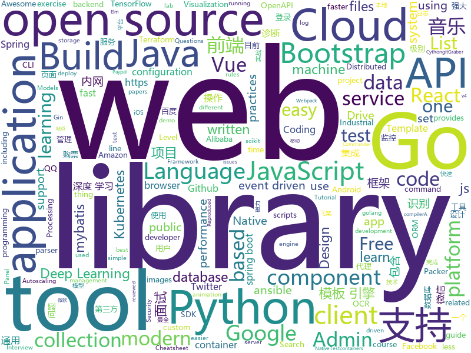

# 2019-09-11
See what the GitHub community is most excited about today.

## python
* [py12306](https://github.com/pjialin/py12306)(**281 stars today**): 🚂12306 购票助手，支持分布式，多账号，多任务购票以及 Web 页面管理
* [12306](https://github.com/testerSunshine/12306)(**1,229 stars today**): 12306智能刷票，订票
* [tiler](https://github.com/nuno-faria/tiler)(**425 stars today**): 👷Build images with images
* [tf-quant-finance](https://github.com/google/tf-quant-finance)(**98 stars today**): High-performance TensorFlow library for quantitative finance.
* [easy12306](https://github.com/zhaipro/easy12306)(**96 stars today**): 使用机器学习算法完成对12306验证码的自动识别
* [cython](https://github.com/cython/cython)(**35 stars today**): The most widely used Python to C compiler
* [stringsifter](https://github.com/fireeye/stringsifter)(**43 stars today**): A machine learning tool that automatically ranks strings based on their relevance for malware analysis.
* [data-science-ipython-notebooks](https://github.com/donnemartin/data-science-ipython-notebooks)(**100 stars today**): Data science Python notebooks: Deep learning (TensorFlow, Theano, Caffe, Keras), scikit-learn, Kaggle, big data (Spark, Hadoop MapReduce, HDFS), matplotlib, pandas, NumPy, SciPy, Python essentials, AWS, and various command lines.
* [numpy-ml](https://github.com/ddbourgin/numpy-ml)(**76 stars today**): Machine learning, in numpy
* [AirGesture](https://github.com/vietnguyen1991/AirGesture)(**21 stars today**): Play games without touching keyboard
* [FATE](https://github.com/FederatedAI/FATE)(**6 stars today**): An Industrial Level Federated Learning Framework
* [spaCy](https://github.com/explosion/spaCy)(**12 stars today**): 💫Industrial-strength Natural Language Processing (NLP) with Python and Cython
* [gitGraber](https://github.com/hisxo/gitGraber)(**32 stars today**): gitGraber: monitor GitHub to search and find sensitive data in real time for different online services such as: Google, Amazon, Paypal, Github, Mailgun, Facebook, Twitter, Heroku, Stripe...
* [mypy](https://github.com/python/mypy)(**7 stars today**): Optional static typing for Python 3 and 2 (PEP 484)
* [DeepCTR](https://github.com/shenweichen/DeepCTR)(**12 stars today**): Easy-to-use,Modular and Extendible package of deep-learning based CTR models.
* [ansible](https://github.com/ansible/ansible)(**20 stars today**): Ansible is a radically simple IT automation platform that makes your applications and systems easier to deploy. Avoid writing scripts or custom code to deploy and update your applications — automate in a language that approaches plain English, using SSH, with no agents to install on remote systems. https://docs.ansible.com/ansible/
* [lutris](https://github.com/lutris/lutris)(**10 stars today**): Lutris client - Open Source gaming platform for GNU/Linux
* [r2con2019](https://github.com/radareorg/r2con2019)(**36 stars today**): 
* [elasticsearch-py](https://github.com/elastic/elasticsearch-py)(**6 stars today**): Official Python low-level client for Elasticsearch.
* [twint](https://github.com/twintproject/twint)(**30 stars today**): An advanced Twitter scraping & OSINT tool written in Python that doesn't use Twitter's API, allowing you to scrape a user's followers, following, Tweets and more while evading most API limitations.
* [models](https://github.com/PaddlePaddle/models)(**13 stars today**): Pre-trained and Reproduced Deep Learning Models （『飞桨』官方模型库，包含多种学术前沿和工业场景验证的深度学习模型）
* [celery](https://github.com/celery/celery)(**6 stars today**): Distributed Task Queue (development branch)
* [kubectl-aliases](https://github.com/ahmetb/kubectl-aliases)(**5 stars today**): Programmatically generated handy kubectl aliases.
* [scikit-learn](https://github.com/scikit-learn/scikit-learn)(**16 stars today**): scikit-learn: machine learning in Python
* [AV_Data_Capture](https://github.com/yoshiko2/AV_Data_Capture)(**6 stars today**): 日本电影元数据抓取工具，配合kodi,emby等本地媒体管理工具使用

## java
* [nacos](https://github.com/alibaba/nacos)(**36 stars today**): an easy-to-use dynamic service discovery, configuration and service management platform for building cloud native applications.
* [litemall](https://github.com/linlinjava/litemall)(**41 stars today**): 又一个小商城。litemall = Spring Boot后端 + Vue管理员前端 + 微信小程序用户前端 + Vue用户移动端
* [spring-boot-demo](https://github.com/xkcoding/spring-boot-demo)(**101 stars today**): spring boot demo 是一个用来深度学习并实战 spring boot 的项目，目前总共包含 59 个集成demo，已经完成 49 个。 该项目已成功集成 actuator(监控)、admin(可视化监控)、logback(日志)、aopLog(通过AOP记录web请求日志)、统一异常处理(json级别和页面级别)、freemarker(模板引擎)、thymeleaf(模板引擎)、Beetl(模板引擎)、Enjoy(模板引擎)、JdbcTemplate(通用JDBC操作数据库)、JPA(强大的ORM框架)、mybatis(强大的ORM框架)、通用Mapper(快速操作Mybatis)、PageHelper(通用的Mybatis分页插件)、mybatis-plus(快速操作M…
* [bistoury](https://github.com/qunarcorp/bistoury)(**203 stars today**): Bistoury是去哪儿网的java应用生产问题诊断工具，提供了一站式的问题诊断方案
* [SkyStone](https://github.com/FIRST-Tech-Challenge/SkyStone)(**10 stars today**): FTC SDK
* [fullstack-tutorial](https://github.com/frank-lam/fullstack-tutorial)(**55 stars today**): 🚀fullstack tutorial 2019，后台技术栈/架构师之路/全栈开发社区，春招/秋招/校招/面试
* [antlr4](https://github.com/antlr/antlr4)(**15 stars today**): ANTLR (ANother Tool for Language Recognition) is a powerful parser generator for reading, processing, executing, or translating structured text or binary files.
* [graylog2-server](https://github.com/Graylog2/graylog2-server)(**3 stars today**): Free and open source log management
* [C-OCR](https://github.com/ctripcorp/C-OCR)(**35 stars today**): C-OCR是携程自研的OCR项目，主要包括身份证、护照、火车票、签证等旅游相关证件、材料的识别。 项目包含4个部分，拒识、检测、识别、后处理。
* [magnetW](https://github.com/dengyuhan/magnetW)(**63 stars today**): 磁力搜网页版 - 磁力链接聚合搜索 - https://bt.biedian.me
* [FEBS-Cloud](https://github.com/wuyouzhuguli/FEBS-Cloud)(**20 stars today**): 基于Spring Cloud Greenwich.SR1、Spring Cloud OAuth2 & Spring Cloud Security 构建的微服务权限管理系统
* [ballerina-lang](https://github.com/ballerina-platform/ballerina-lang)(**61 stars today**): The Ballerina Programming Language
* [JustAuth](https://github.com/justauth/JustAuth)(**85 stars today**): 💯史上最全的整合第三方登录的开源库。目前已支持Github、Gitee、微博、钉钉、百度、Coding、腾讯云开发者平台、OSChina、支付宝、QQ、微信、淘宝、Google、Facebook、抖音、领英、小米、微软、今日头条、Teambition、StackOverflow、Pinterest、人人、华为、企业微信、酷家乐和Gitlab等第三方平台的授权登录。 Login, so easy!
* [Head-First-Design-Patterns](https://github.com/bethrobson/Head-First-Design-Patterns)(**2 stars today**): Code for Head First Design Patterns book (2014)
* [elasticsearch](https://github.com/elastic/elasticsearch)(**36 stars today**): Open Source, Distributed, RESTful Search Engine
* [dbeaver](https://github.com/dbeaver/dbeaver)(**15 stars today**): Free universal database tool and SQL client
* [lottie-android](https://github.com/airbnb/lottie-android)(**18 stars today**): Render After Effects animations natively on Android and iOS, Web, and React Native
* [testcontainers-java](https://github.com/testcontainers/testcontainers-java)(**4 stars today**): Testcontainers is a Java library that supports JUnit tests, providing lightweight, throwaway instances of common databases, Selenium web browsers, or anything else that can run in a Docker container.
* [MusicLake](https://github.com/caiyonglong/MusicLake)(**28 stars today**): 音乐播放器，可播在线音乐，qq音乐，百度音乐，虾米音乐，网易云音乐，YouTuBe
* [CS-Notes](https://github.com/CyC2018/CS-Notes)(**103 stars today**): 📚Tech Interview Guide 技术面试必备基础知识、Leetcode 题解、Java、C++、Python、后端面试、操作系统、计算机网络、系统设计
* [arthas](https://github.com/alibaba/arthas)(**56 stars today**): Alibaba Java Diagnostic Tool Arthas/Alibaba Java诊断利器Arthas
* [netty](https://github.com/netty/netty)(**25 stars today**): Netty project - an event-driven asynchronous network application framework
* [easy-rules](https://github.com/j-easy/easy-rules)(**4 stars today**): The simple, stupid rules engine for Java
* [spring-security](https://github.com/spring-projects/spring-security)(**9 stars today**): Spring Security
* [incubator-shardingsphere](https://github.com/apache/incubator-shardingsphere)(**10 stars today**): Distributed database middleware

## unknown
* [eng-practices](https://github.com/google/eng-practices)(**928 stars today**): Google's Engineering Practices documentation
* [dumb-password-rules](https://github.com/dumb-password-rules/dumb-password-rules)(**247 stars today**): Shaming sites with dumb password rules.
* [backend](https://github.com/kottans/backend)(**60 stars today**): Kottans backend course🎓
* [ObjectDetectionImbalance](https://github.com/kemaloksuz/ObjectDetectionImbalance)(**28 stars today**): Lists the papers related to imbalance problems in object detection
* [postman-app-support](https://github.com/postmanlabs/postman-app-support)(**1 stars today**): Postman helps you be more efficient while working with APIs. Using Postman, you can construct complex HTTP requests quickly, organize them in collections and share them with your co-workers.
* [new-grads-2020](https://github.com/cmackenzie1/new-grads-2020)(**10 stars today**): A collection of new grad roles for 2020
* [learn-regex](https://github.com/ziishaned/learn-regex)(**115 stars today**): Learn regex the easy way
* [the-book-of-secret-knowledge](https://github.com/trimstray/the-book-of-secret-knowledge)(**152 stars today**): A collection of inspiring lists, manuals, cheatsheets, blogs, hacks, one-liners, cli/web tools and more.
* [Java-Interview](https://github.com/gzc426/Java-Interview)(**85 stars today**): Java 面试必会 直通BAT
* [interesting-papers](https://github.com/jarikoi/interesting-papers)(**23 stars today**): Jari's collection of interesting papers.
* [lectures](https://github.com/rolling-scopes-school/lectures)(**7 stars today**): 
* [Awesome-Red-Teaming](https://github.com/yeyintminthuhtut/Awesome-Red-Teaming)(**5 stars today**): List of Awesome Red Teaming Resources
* [reactjs-interview-questions](https://github.com/sudheerj/reactjs-interview-questions)(**10 stars today**): List of top 500 ReactJS Interview Questions & Answers....Coding exercise questions are coming soon!!
* [keiko](https://github.com/keikoproj/keiko)(**19 stars today**): 
* [NLP101](https://github.com/Huffon/NLP101)(**4 stars today**): 딥러닝과 자연어 처리 학습을 위해 참고하면 좋은 자료들을 저장하는 자료소
* [12306model](https://github.com/testerSunshine/12306model)(**4 stars today**): 本地识别模型下载
* [weekly](https://github.com/dt-fe/weekly)(**23 stars today**): 前端精读周刊
* [angular-performance-checklist](https://github.com/mgechev/angular-performance-checklist)(**1 stars today**): Cheatsheet for developing ⚡lightning⚡ fast progressive Angular applications.
* [vue-admin](https://github.com/vue-bulma/vue-admin)(**5 stars today**): We are refactoring it, using the latest Vue and Bulma. WIP
* [Index](https://github.com/HowProgrammingWorks/Index)(**6 stars today**): Repositories Index
* [slides](https://github.com/TritonHo/slides)(**6 stars today**): it is a repository to store all slides used by Triton Ho's public presentation and course.
* [OpenAPI-Specification](https://github.com/OAI/OpenAPI-Specification)(**14 stars today**): The OpenAPI Specification Repository
* [microservices](https://github.com/DocsHome/microservices)(**20 stars today**): Microservices from Design to Deployment 中文版 《微服务：从设计到部署》
* [CKAD-exercises](https://github.com/dgkanatsios/CKAD-exercises)(**6 stars today**): A set of exercises to prepare for Certified Kubernetes Application Developer exam by Cloud Native Computing Foundation
* [awsome-domain-adaptation](https://github.com/zhaoxin94/awsome-domain-adaptation)(**2 stars today**): A collection of AWESOME things about domian adaptation

## javascript
* [appwrite](https://github.com/appwrite/appwrite)(**179 stars today**): End to end backend server for frontend and mobile developers.👩‍💻👨‍💻
* [freeCodeCamp](https://github.com/freeCodeCamp/freeCodeCamp)(**54 stars today**): The https://www.freeCodeCamp.org open source codebase and curriculum. Learn to code for free together with millions of people.
* [chinese-poetry](https://github.com/chinese-poetry/chinese-poetry)(**29 stars today**): 最全中华古诗词数据库, 唐宋两朝近一万四千古诗人, 接近5.5万首唐诗加26万宋诗. 两宋时期1564位词人，21050首词。
* [create-react-app](https://github.com/facebook/create-react-app)(**57 stars today**): Set up a modern web app by running one command.
* [material-ui](https://github.com/mui-org/material-ui)(**48 stars today**): React components for faster and easier web development. Build your own design system, or start with Material Design.
* [bootstrap-vue](https://github.com/bootstrap-vue/bootstrap-vue)(**11 stars today**): BootstrapVue, with over 40 plugins and more than 80 custom components, provides one of the most comprehensive implementations of Bootstrap v4 components and grid system for Vue.js. With extensive and automated WAI-ARIA accessibility markup.
* [cesium](https://github.com/AnalyticalGraphicsInc/cesium)(**7 stars today**): An open-source JavaScript library for world-class 3D globes and maps🌎
* [webpack-boilerplate](https://github.com/taniarascia/webpack-boilerplate)(**15 stars today**): 📦A sensible Webpack 4 boilerplate.
* [Sortable](https://github.com/SortableJS/Sortable)(**19 stars today**): Sortable — is a JavaScript library for reorderable drag-and-drop lists on modern browsers and touch devices. No jQuery required. Supports Meteor, AngularJS, React, Polymer, Vue, Ember, Knockout and any CSS library, e.g. Bootstrap.
* [Daily-Interview-Question](https://github.com/Advanced-Frontend/Daily-Interview-Question)(**36 stars today**): 我是木易杨，公众号「高级前端进阶」作者，每天搞定一道前端大厂面试题，祝大家天天进步，一年后会看到不一样的自己。
* [strapi](https://github.com/strapi/strapi)(**23 stars today**): 🚀Open source Node.js Headless CMS to easily build customisable APIs
* [json-server](https://github.com/typicode/json-server)(**24 stars today**): Get a full fake REST API with zero coding in less than 30 seconds (seriously)
* [gatsby](https://github.com/gatsbyjs/gatsby)(**33 stars today**): Build blazing fast, modern apps and websites with React
* [tabler](https://github.com/tabler/tabler)(**48 stars today**): Tabler is free and open-source HTML Dashboard UI Kit built on Bootstrap
* [react-vis](https://github.com/uber/react-vis)(**6 stars today**): Data Visualization Components
* [bowser](https://github.com/lancedikson/bowser)(**4 stars today**): a browser detector
* [rollup](https://github.com/rollup/rollup)(**11 stars today**): Next-generation ES module bundler
* [terser](https://github.com/terser/terser)(**13 stars today**): 🗜JavaScript parser, mangler and compressor toolkit for ES6+
* [ogl](https://github.com/oframe/ogl)(**6 stars today**): Minimal WebGL framework
* [elasticsearch-dump](https://github.com/taskrabbit/elasticsearch-dump)(**7 stars today**): Import and export tools for elasticsearch
* [reactotron](https://github.com/infinitered/reactotron)(**8 stars today**): A desktop app for inspecting your React JS and React Native projects. macOS, Linux, and Windows.
* [GreenSock-JS](https://github.com/greensock/GreenSock-JS)(**2 stars today**): GreenSock's GSAP JavaScript animation library (including Draggable).
* [UnblockNeteaseMusic](https://github.com/nondanee/UnblockNeteaseMusic)(**37 stars today**): Revive unavailable songs for Netease Cloud Music
* [aws-serverless-workshops](https://github.com/aws-samples/aws-serverless-workshops)(**4 stars today**): Code and walkthrough labs to set up serverless applications for Wild Rydes workshops
* [blur-admin](https://github.com/akveo/blur-admin)(**26 stars today**): AngularJS Bootstrap Admin Panel Framework

## html
* [AdminLTE](https://github.com/ColorlibHQ/AdminLTE)(**68 stars today**): AdminLTE - Free Premium Admin control Panel Theme Based On Bootstrap 3.x
* [WebFundamentals](https://github.com/google/WebFundamentals)(**10 stars today**): Best practices for modern web development
* [gentelella](https://github.com/ColorlibHQ/gentelella)(**33 stars today**): Free Bootstrap 3 Admin Template
* [swagger-codegen](https://github.com/swagger-api/swagger-codegen)(**9 stars today**): swagger-codegen contains a template-driven engine to generate documentation, API clients and server stubs in different languages by parsing your OpenAPI / Swagger definition.
* [polymer](https://github.com/Polymer/polymer)(**2 stars today**): Our original Web Component library.
* [styleguide](https://github.com/google/styleguide)(**21 stars today**): Style guides for Google-originated open-source projects
* [kubernetes-failure-stories](https://github.com/hjacobs/kubernetes-failure-stories)(**3 stars today**): Compilation of public failure/horror stories related to Kubernetes
* [mxgraph](https://github.com/jgraph/mxgraph)(**3 stars today**): mxGraph is a fully client side JavaScript diagramming library
* [chosen](https://github.com/harvesthq/chosen)(**2 stars today**): Chosen is a library for making long, unwieldy select boxes more friendly.
* [senior-engineer-checklist](https://github.com/littleblah/senior-engineer-checklist)(**64 stars today**): Senior Engineer CheckList
* [keep-a-changelog](https://github.com/olivierlacan/keep-a-changelog)(**4 stars today**): If you build software, keep a changelog.
* [FLY_US](https://github.com/hot13399/FLY_US)(**28 stars today**): 美国大学备考资料 How to apply US colleges
* [stisla](https://github.com/stisla/stisla)(**1 stars today**): Free Bootstrap Admin Template
* [flutter-in-action](https://github.com/flutterchina/flutter-in-action)(**18 stars today**): 《Flutter实战》电子书
* [book](https://github.com/PaddlePaddle/book)(**0 stars today**): Deep Learning 101 with PaddlePaddle （『飞桨』深度学习框架入门教程）
* [cs231n.github.io](https://github.com/cs231n/cs231n.github.io)(**6 stars today**): Public facing notes page
* [nflscrapR-data](https://github.com/ryurko/nflscrapR-data)(**2 stars today**): Data files (.csv) accessed with nflscrapR and summarized at the player-level
* [500LineorLess_CN](https://github.com/HT524/500LineorLess_CN)(**4 stars today**): 500 line or less 中文翻译计划。
* [fastText](https://github.com/facebookresearch/fastText)(**12 stars today**): Library for fast text representation and classification.
* [d3-book](https://github.com/alignedleft/d3-book)(**4 stars today**): Code examples for “Interactive Data Visualization for the Web”
* [DetectionLab](https://github.com/clong/DetectionLab)(**3 stars today**): Vagrant & Packer scripts to build a lab environment complete with security tooling and logging best practices
* [JavaScript30](https://github.com/wesbos/JavaScript30)(**9 stars today**): 30 Day Vanilla JS Challenge
* [en.javascript.info](https://github.com/javascript-tutorial/en.javascript.info)(**7 stars today**): Modern JavaScript Tutorial
* [jocs.github.io](https://github.com/Jocs/jocs.github.io)(**3 stars today**): 💯Jocs 的个人博客，所有的文章都在 issues 里面
* [wpt](https://github.com/web-platform-tests/wpt)(**4 stars today**): Test suites for Web platform specs — including WHATWG, W3C, and others

## go
* [community](https://github.com/kubernetes/community)(**17 stars today**): Kubernetes community content
* [rclone](https://github.com/rclone/rclone)(**21 stars today**): "rsync for cloud storage" - Google Drive, Amazon Drive, S3, Dropbox, Backblaze B2, One Drive, Swift, Hubic, Cloudfiles, Google Cloud Storage, Yandex Files
* [nps](https://github.com/cnlh/nps)(**60 stars today**): 一款轻量级、功能强大的内网穿透代理服务器。支持tcp、udp流量转发，支持内网http代理、内网socks5代理，同时支持snappy压缩、站点保护、加密传输、多路复用、header修改等。支持web图形化管理，集成多用户模式。
* [learn-go-with-tests](https://github.com/quii/learn-go-with-tests)(**61 stars today**): Learn Go with test-driven development
* [elastic](https://github.com/olivere/elastic)(**6 stars today**): Elasticsearch client for Go.
* [vault](https://github.com/hashicorp/vault)(**9 stars today**): A tool for secrets management, encryption as a service, and privileged access management
* [terraform](https://github.com/hashicorp/terraform)(**12 stars today**): Terraform enables you to safely and predictably create, change, and improve infrastructure. It is an open source tool that codifies APIs into declarative configuration files that can be shared amongst team members, treated as code, edited, reviewed, and versioned.
* [autoscaler](https://github.com/kubernetes/autoscaler)(**4 stars today**): Autoscaling components for Kubernetes
* [client](https://github.com/keybase/client)(**89 stars today**): Keybase Go Library, Client, Service, OS X, iOS, Android, Electron
* [joe](https://github.com/go-joe/joe)(**38 stars today**): A general-purpose bot library inspired by Hubot but written in Go.
* [gin](https://github.com/gin-gonic/gin)(**39 stars today**): Gin is a HTTP web framework written in Go (Golang). It features a Martini-like API with much better performance -- up to 40 times faster. If you need smashing performance, get yourself some Gin.
* [consul-template](https://github.com/hashicorp/consul-template)(**2 stars today**): Template rendering, notifier, and supervisor for @hashicorp Consul and Vault data.
* [keda](https://github.com/kedacore/keda)(**9 stars today**): KEDA is a Kubernetes-based Event Driven Autoscaling component. It provides event driven scale for any container running in Kubernetes
* [tflint](https://github.com/wata727/tflint)(**7 stars today**): TFLint is a Terraform linter focused on possible errors, best practices, etc. (Terraform >= 0.12)
* [glog](https://github.com/golang/glog)(**3 stars today**): Leveled execution logs for Go
* [minikube](https://github.com/kubernetes/minikube)(**21 stars today**): Run Kubernetes locally
* [charts](https://github.com/helm/charts)(**16 stars today**): Curated applications for Kubernetes
* [terraform-provider-azurerm](https://github.com/terraform-providers/terraform-provider-azurerm)(**5 stars today**): Terraform provider for Azure Resource Manager
* [aws-sdk-go](https://github.com/aws/aws-sdk-go)(**3 stars today**): AWS SDK for the Go programming language.
* [cobra](https://github.com/spf13/cobra)(**18 stars today**): A Commander for modern Go CLI interactions
* [origin](https://github.com/openshift/origin)(**4 stars today**): The self-managing, auto-upgrading, Kubernetes distribution for everyone
* [go-sqlmock](https://github.com/DATA-DOG/go-sqlmock)(**1 stars today**): Sql mock driver for golang to test database interactions
* [concourse](https://github.com/concourse/concourse)(**3 stars today**): Concourse is a container-based continuous thing-doer written in Go and Elm.
* [packer](https://github.com/hashicorp/packer)(**4 stars today**): Packer is a tool for creating identical machine images for multiple platforms from a single source configuration.
* [protobuf](https://github.com/golang/protobuf)(**10 stars today**): Go support for Google's protocol buffers

## WordCloud

