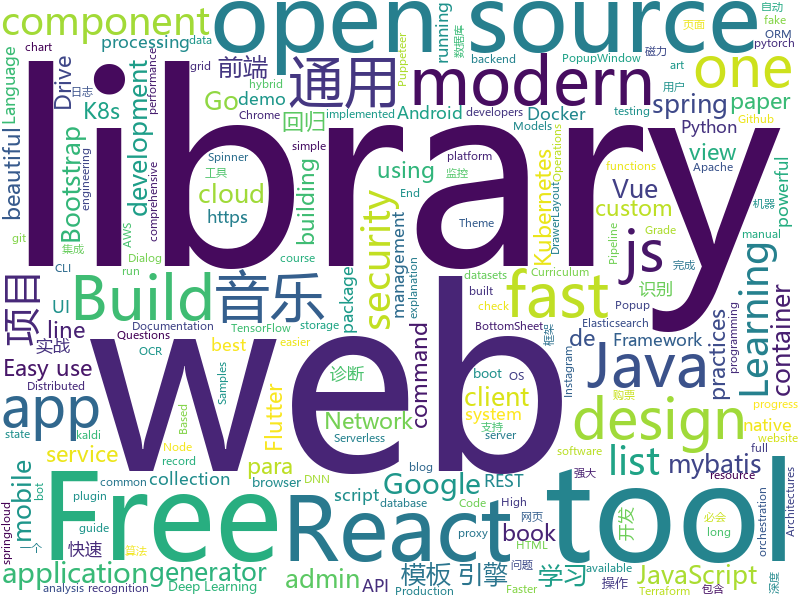

# 2019-09-12
See what the GitHub community is most excited about today.

## python
* [12306](https://github.com/testerSunshine/12306)(**951 stars today**): 12306智能刷票，订票
* [py12306](https://github.com/pjialin/py12306)(**397 stars today**): 🚂12306 购票助手，支持集群，多账号，多任务购票以及 Web 页面管理
* [easy12306](https://github.com/zhaipro/easy12306)(**166 stars today**): 使用机器学习算法完成对12306验证码的自动识别
* [numpy-ml](https://github.com/ddbourgin/numpy-ml)(**60 stars today**): Machine learning, in numpy
* [rlpyt](https://github.com/astooke/rlpyt)(**102 stars today**): Reinforcement Learning in PyTorch
* [FreeAnchor](https://github.com/zhangxiaosong18/FreeAnchor)(**84 stars today**): FreeAnchor: Learning to Match Anchors for Visual Object Detection (NeurIPS 2019)
* [GeneralNewsExtractor](https://github.com/kingname/GeneralNewsExtractor)(**48 stars today**): 新闻网页正文通用抽取器 Alpha 版.
* [instabot](https://github.com/instagrambot/instabot)(**56 stars today**): 🐙Free Instagram scripts, bots and Python API wrapper. Get free instagram followers with our auto like, auto follow and other scripts!
* [freqtrade](https://github.com/freqtrade/freqtrade)(**5 stars today**): Free, open source crypto trading bot
* [PKUAutoElective](https://github.com/zhongxinghong/PKUAutoElective)(**6 stars today**): 北大选课网补退选阶段自动选课小工具
* [proxy_pool](https://github.com/jhao104/proxy_pool)(**22 stars today**): Python爬虫代理IP池(proxy pool)
* [tf-quant-finance](https://github.com/google/tf-quant-finance)(**79 stars today**): High-performance TensorFlow library for quantitative finance.
* [NLP-progress](https://github.com/sebastianruder/NLP-progress)(**28 stars today**): Repository to track the progress in Natural Language Processing (NLP), including the datasets and the current state-of-the-art for the most common NLP tasks.
* [keras](https://github.com/keras-team/keras)(**32 stars today**): Deep Learning for humans
* [tf-pose-estimation](https://github.com/ildoonet/tf-pose-estimation)(**3 stars today**): Deep Pose Estimation implemented using Tensorflow with Custom Architectures for fast inference.
* [tiler](https://github.com/nuno-faria/tiler)(**415 stars today**): 👷Build images with images
* [pytorch-kaldi](https://github.com/mravanelli/pytorch-kaldi)(**8 stars today**): pytorch-kaldi is a project for developing state-of-the-art DNN/RNN hybrid speech recognition systems. The DNN part is managed by pytorch, while feature extraction, label computation, and decoding are performed with the kaldi toolkit.
* [full-stack-fastapi-postgresql](https://github.com/tiangolo/full-stack-fastapi-postgresql)(**4 stars today**): Full stack, modern web application generator. Using FastAPI, PostgreSQL as database, Docker, automatic HTTPS and more.
* [cython](https://github.com/cython/cython)(**67 stars today**): The most widely used Python to C compiler
* [pipelines](https://github.com/kubeflow/pipelines)(**4 stars today**): Machine Learning Pipelines for Kubeflow
* [AutoRouterIP](https://github.com/testerSunshine/AutoRouterIP)(**13 stars today**): 自动切换家庭对外出口ip
* [gpt-2](https://github.com/openai/gpt-2)(**17 stars today**): Code for the paper "Language Models are Unsupervised Multitask Learners"
* [pointer-generator](https://github.com/abisee/pointer-generator)(**3 stars today**): Code for the ACL 2017 paper "Get To The Point: Summarization with Pointer-Generator Networks"
* [algo](https://github.com/wangzheng0822/algo)(**21 stars today**): 数据结构和算法必知必会的50个代码实现
* [DeepCTR-PyTorch](https://github.com/shenweichen/DeepCTR-PyTorch)(**11 stars today**): 【In progress,call for contributers!!】Easy-to-use,Modular and Extendible package of deep-learning based CTR models with PyTorch.

## java
* [bistoury](https://github.com/qunarcorp/bistoury)(**92 stars today**): Bistoury是去哪儿网的java应用生产问题诊断工具，提供了一站式的问题诊断方案
* [flutter_boost](https://github.com/alibaba/flutter_boost)(**24 stars today**): FlutterBoost is a Flutter plugin which enables hybrid integration of Flutter for your existing native apps with minimum efforts
* [SkyStone](https://github.com/FIRST-Tech-Challenge/SkyStone)(**5 stars today**): FTC SDK
* [nacos](https://github.com/alibaba/nacos)(**96 stars today**): an easy-to-use dynamic service discovery, configuration and service management platform for building cloud native applications.
* [kubernetes-client](https://github.com/fabric8io/kubernetes-client)(**18 stars today**): Java client for Kubernetes & OpenShift
* [arthas](https://github.com/alibaba/arthas)(**41 stars today**): Alibaba Java Diagnostic Tool Arthas/Alibaba Java诊断利器Arthas
* [lucene-solr](https://github.com/apache/lucene-solr)(**3 stars today**): Mirror of Apache Lucene + Solr
* [litemall](https://github.com/linlinjava/litemall)(**98 stars today**): 又一个小商城。litemall = Spring Boot后端 + Vue管理员前端 + 微信小程序用户前端 + Vue用户移动端
* [Java](https://github.com/TheAlgorithms/Java)(**23 stars today**): All Algorithms implemented in Java
* [spring-boot-demo](https://github.com/xkcoding/spring-boot-demo)(**186 stars today**): spring boot demo 是一个用来深度学习并实战 spring boot 的项目，目前总共包含 62 个集成demo，已经完成 50 个。 该项目已成功集成 actuator(监控)、admin(可视化监控)、logback(日志)、aopLog(通过AOP记录web请求日志)、统一异常处理(json级别和页面级别)、freemarker(模板引擎)、thymeleaf(模板引擎)、Beetl(模板引擎)、Enjoy(模板引擎)、JdbcTemplate(通用JDBC操作数据库)、JPA(强大的ORM框架)、mybatis(强大的ORM框架)、通用Mapper(快速操作Mybatis)、PageHelper(通用的Mybatis分页插件)、mybatis-plus(快速操作M…
* [rocketmq](https://github.com/apache/rocketmq)(**7 stars today**): Mirror of Apache RocketMQ
* [SpringCloud](https://github.com/zhoutaoo/SpringCloud)(**48 stars today**): 基于SpringCloud2.0的微服务开发脚手架，整合了spring-security-oauth2、apollo、eureka、feign、hystrix、springcloud-gateway、springcloud-bus等。治理方面引入elasticsearch、skywalking、springboot-admin、zipkin等，让项目开发快速进入业务开发，而不需过多时间花费在架构搭建上。持续更新中
* [tutorials](https://github.com/eugenp/tutorials)(**28 stars today**): The "REST With Spring" Course:
* [C-OCR](https://github.com/ctripcorp/C-OCR)(**30 stars today**): C-OCR是携程自研的OCR项目，主要包括身份证、护照、火车票、签证等旅游相关证件、材料的识别。 项目包含4个部分，拒识、检测、识别、后处理。
* [graal](https://github.com/oracle/graal)(**18 stars today**): GraalVM: Run Programs Faster Anywhere🚀
* [testcontainers-java](https://github.com/testcontainers/testcontainers-java)(**7 stars today**): Testcontainers is a Java library that supports JUnit tests, providing lightweight, throwaway instances of common databases, Selenium web browsers, or anything else that can run in a Docker container.
* [magnetW](https://github.com/dengyuhan/magnetW)(**17 stars today**): 磁力搜网页版 - 磁力链接聚合搜索 - https://biedian.me
* [XPopup](https://github.com/li-xiaojun/XPopup)(**51 stars today**): 🔥功能强大，UI简洁，交互优雅的通用弹窗！可以替代Dialog，PopupWindow，PopupMenu，BottomSheet，DrawerLayout，Spinner等组件，自带十几种效果良好的动画， 支持完全的UI和动画自定义！(Powerful and Beautiful Popup，can absolutely replace Dialog，PopupWindow，PopupMenu，BottomSheet，DrawerLayout，Spinner. With built-in animators , very easy to custom popup view.)
* [quarkus](https://github.com/quarkusio/quarkus)(**9 stars today**): Quarkus: Supersonic Subatomic Java.
* [antlr4](https://github.com/antlr/antlr4)(**8 stars today**): ANTLR (ANother Tool for Language Recognition) is a powerful parser generator for reading, processing, executing, or translating structured text or binary files.
* [wiremock](https://github.com/tomakehurst/wiremock)(**3 stars today**): A tool for mocking HTTP services
* [DependencyCheck](https://github.com/jeremylong/DependencyCheck)(**3 stars today**): OWASP dependency-check is a software composition analysis utility that detects publicly disclosed vulnerabilities in application dependencies.
* [Telegram](https://github.com/DrKLO/Telegram)(**5 stars today**): Telegram for Android source
* [MusicLake](https://github.com/caiyonglong/MusicLake)(**18 stars today**): 音乐播放器，可播在线音乐，qq音乐，百度音乐，虾米音乐，网易云音乐，YouTuBe
* [MPAndroidChart](https://github.com/PhilJay/MPAndroidChart)(**19 stars today**): A powerful🚀Android chart view / graph view library, supporting line- bar- pie- radar- bubble- and candlestick charts as well as scaling, dragging and animations.

## unknown
* [reverse-interview](https://github.com/viraptor/reverse-interview)(**856 stars today**): Questions to ask the company during your interview
* [the-book-of-secret-knowledge](https://github.com/trimstray/the-book-of-secret-knowledge)(**59 stars today**): A collection of inspiring lists, manuals, cheatsheets, blogs, hacks, one-liners, cli/web tools and more.
* [free-programming-books](https://github.com/EbookFoundation/free-programming-books)(**76 stars today**): 📚Freely available programming books
* [Java-Interview](https://github.com/gzc426/Java-Interview)(**35 stars today**): Java 面试必会 直通BAT
* [Hacking-Security-Ebooks](https://github.com/yeahhub/Hacking-Security-Ebooks)(**21 stars today**): Top 100 Hacking & Security E-Books (Free Download) - Powered by Yeahhub.com
* [Red-Teaming-Toolkit](https://github.com/infosecn1nja/Red-Teaming-Toolkit)(**11 stars today**): A collection of open source and commercial tools that aid in red team operations.
* [lectures](https://github.com/rolling-scopes-school/lectures)(**5 stars today**): 
* [backend](https://github.com/kottans/backend)(**61 stars today**): Kottans backend course🎓
* [API](https://github.com/HackerNews/API)(**5 stars today**): Documentation and Samples for the Official HN API
* [javascript-questions](https://github.com/lydiahallie/javascript-questions)(**21 stars today**): A long list of (advanced) JavaScript questions, and their explanations✨Updated weekly!
* [12306model](https://github.com/testerSunshine/12306model)(**1 stars today**): 本地识别模型下载
* [Interview_Question_for_Beginner](https://github.com/JaeYeopHan/Interview_Question_for_Beginner)(**8 stars today**): 👦👧Technical-Interview guidelines written for those who started studying programming. I wish you all the best.👾
* [awesome-point-cloud-analysis](https://github.com/Yochengliu/awesome-point-cloud-analysis)(**0 stars today**): A list of papers and datasets about point cloud analysis (processing)
* [you-dont-know-js-ru](https://github.com/azat-io/you-dont-know-js-ru)(**2 stars today**): 📚Russian translation of "You Don't Know JS" book series
* [awesome-laravel](https://github.com/chiraggude/awesome-laravel)(**4 stars today**): A curated list of bookmarks, packages, tutorials, videos and other cool resources from the Laravel ecosystem
* [curriculum](https://github.com/cncf/curriculum)(**0 stars today**): 📚Open Source Curriculum for CNCF Certification Courses
* [You-Dont-Know-JS](https://github.com/getify/You-Dont-Know-JS)(**62 stars today**): A book series on JavaScript. @YDKJS on twitter.
* [eng-practices](https://github.com/google/eng-practices)(**599 stars today**): Google's Engineering Practices documentation
* [the-best-docker-books](https://github.com/eduleboss/the-best-docker-books)(**2 stars today**): Free Docker eBooks
* [Beginner-Network-Pentesting](https://github.com/hmaverickadams/Beginner-Network-Pentesting)(**8 stars today**): Notes for Beginner Network Pentesting Course
* [nlp-beginner](https://github.com/FudanNLP/nlp-beginner)(**18 stars today**): NLP上手教程
* [vagas](https://github.com/frontendbr/vagas)(**3 stars today**): 🔬Espaço para divulgação de vagas para front-enders.
* [new-grads-2020](https://github.com/cmackenzie1/new-grads-2020)(**8 stars today**): A collection of new grad roles for 2020
* [MITM-cheatsheet](https://github.com/Sab0tag3d/MITM-cheatsheet)(**10 stars today**): All MITM attacks in one place.
* [design-patterns-for-humans](https://github.com/kamranahmedse/design-patterns-for-humans)(**16 stars today**): An ultra-simplified explanation to design patterns

## javascript
* [puppeteer](https://github.com/GoogleChrome/puppeteer)(**46 stars today**): Headless Chrome Node.js API
* [opendatacam](https://github.com/opendatacam/opendatacam)(**10 stars today**): An open source tool to quantify the world
* [chinese-poetry](https://github.com/chinese-poetry/chinese-poetry)(**144 stars today**): 最全中华古诗词数据库, 唐宋两朝近一万四千古诗人, 接近5.5万首唐诗加26万宋诗. 两宋时期1564位词人，21050首词。
* [appwrite](https://github.com/appwrite/appwrite)(**79 stars today**): End to end backend server for frontend and mobile developers.👩‍💻👨‍💻
* [faker.js](https://github.com/Marak/faker.js)(**20 stars today**): generate massive amounts of realistic fake data in Node.js and the browser
* [gatsby](https://github.com/gatsbyjs/gatsby)(**34 stars today**): Build blazing fast, modern apps and websites with React
* [Daily-Interview-Question](https://github.com/Advanced-Frontend/Daily-Interview-Question)(**46 stars today**): 我是木易杨，公众号「高级前端进阶」作者，每天搞定一道前端大厂面试题，祝大家天天进步，一年后会看到不一样的自己。
* [next.js](https://github.com/zeit/next.js)(**27 stars today**): The React Framework
* [react-table](https://github.com/tannerlinsley/react-table)(**5 stars today**): ⚛️Hooks for building fast and extendable tables and datagrids for React
* [d3](https://github.com/d3/d3)(**27 stars today**): Bring data to life with SVG, Canvas and HTML.📊📈🎉
* [quasar](https://github.com/quasarframework/quasar)(**15 stars today**): Quasar Framework - Build high-performance VueJS user interfaces in record time
* [bootstrap-vue](https://github.com/bootstrap-vue/bootstrap-vue)(**21 stars today**): BootstrapVue, with over 40 plugins and more than 80 custom components, provides one of the most comprehensive implementations of Bootstrap v4 components and grid system for Vue.js. With extensive and automated WAI-ARIA accessibility markup.
* [puppeteer-recorder](https://github.com/checkly/puppeteer-recorder)(**26 stars today**): Puppeteer recorder is a Chrome extension that records your browser interactions and generates a Puppeteer script.
* [baseui](https://github.com/uber-web/baseui)(**2 stars today**): A React Component library implementing the Base design language
* [BackstopJS](https://github.com/garris/BackstopJS)(**3 stars today**): Catch CSS curve balls.
* [tabler](https://github.com/tabler/tabler)(**27 stars today**): Tabler is free and open-source HTML Dashboard UI Kit built on Bootstrap
* [freeCodeCamp](https://github.com/freeCodeCamp/freeCodeCamp)(**60 stars today**): The https://www.freeCodeCamp.org open source codebase and curriculum. Learn to code for free together with millions of people.
* [Sortable](https://github.com/SortableJS/Sortable)(**33 stars today**): Sortable — is a JavaScript library for reorderable drag-and-drop lists on modern browsers and touch devices. No jQuery required. Supports Meteor, AngularJS, React, Polymer, Vue, Ember, Knockout and any CSS library, e.g. Bootstrap.
* [material-ui](https://github.com/mui-org/material-ui)(**34 stars today**): React components for faster and easier web development. Build your own design system, or start with Material Design.
* [serverless](https://github.com/serverless/serverless)(**17 stars today**): Serverless Framework – Build web, mobile and IoT applications with serverless architectures using AWS Lambda, Azure Functions, Google CloudFunctions & more! –
* [preact](https://github.com/preactjs/preact)(**15 stars today**): ⚛️Fast 3kB React alternative with the same modern API. Components & Virtual DOM.
* [json-server](https://github.com/typicode/json-server)(**38 stars today**): Get a full fake REST API with zero coding in less than 30 seconds (seriously)
* [create-react-app](https://github.com/facebook/create-react-app)(**42 stars today**): Set up a modern web app by running one command.
* [react-grid-layout](https://github.com/STRML/react-grid-layout)(**8 stars today**): A draggable and resizable grid layout with responsive breakpoints, for React.
* [openzeppelin-contracts](https://github.com/OpenZeppelin/openzeppelin-contracts)(**7 stars today**): OpenZeppelin Contracts is a library for secure smart contract development.

## html
* [Testimo](https://github.com/EvotecIT/Testimo)(**9 stars today**): Testimo is PowerShell module for running health checks for Active Directory (and later on any other server type) against a bunch of different tests
* [AdminLTE](https://github.com/ColorlibHQ/AdminLTE)(**42 stars today**): AdminLTE - Free Premium Admin control Panel Theme Based On Bootstrap 3.x
* [wpt](https://github.com/web-platform-tests/wpt)(**5 stars today**): Test suites for Web platform specs — including WHATWG, W3C, and others
* [blog_os](https://github.com/phil-opp/blog_os)(**11 stars today**): Writing an OS in Rust
* [styleguide](https://github.com/google/styleguide)(**19 stars today**): Style guides for Google-originated open-source projects
* [owasp-mstg](https://github.com/OWASP/owasp-mstg)(**3 stars today**): The Mobile Security Testing Guide (MSTG) is a comprehensive manual for mobile app security development, testing and reverse engineering.
* [beautiful-jekyll](https://github.com/daattali/beautiful-jekyll)(**1 stars today**): ✨Build a beautiful and simple website in literally minutes. Demo at http://deanattali.com/beautiful-jekyll
* [hyperblog](https://github.com/freddier/hyperblog)(**4 stars today**): Un blog increíble para el curso de Git y Github de Platzi
* [nndl.github.io](https://github.com/nndl/nndl.github.io)(**13 stars today**): 《神经网络与深度学习》 Neural Network and Deep Learning
* [flutter-in-action](https://github.com/flutterchina/flutter-in-action)(**19 stars today**): 《Flutter实战》电子书
* [senior-engineer-checklist](https://github.com/littleblah/senior-engineer-checklist)(**12 stars today**): Senior Engineer CheckList
* [docs](https://github.com/knative/docs)(**0 stars today**): User documentation for Knative components
* [learning-area](https://github.com/mdn/learning-area)(**2 stars today**): Github repo for the MDN Learning Area.
* [JavaScript30](https://github.com/wesbos/JavaScript30)(**9 stars today**): 30 Day Vanilla JS Challenge
* [EIPs](https://github.com/ethereum/EIPs)(**2 stars today**): The Ethereum Improvement Proposal repository
* [django-DefectDojo](https://github.com/DefectDojo/django-DefectDojo)(**1 stars today**): DefectDojo is an open-source application vulnerability correlation and security orchestration tool.
* [coreui-free-bootstrap-admin-template](https://github.com/coreui/coreui-free-bootstrap-admin-template)(**5 stars today**): CoreUI is free bootstrap admin template
* [mkdocs-material](https://github.com/squidfunk/mkdocs-material)(**5 stars today**): A Material Design theme for MkDocs
* [glTF](https://github.com/KhronosGroup/glTF)(**4 stars today**): glTF – Runtime 3D Asset Delivery
* [keep-a-changelog](https://github.com/olivierlacan/keep-a-changelog)(**3 stars today**): If you build software, keep a changelog.
* [fastText](https://github.com/facebookresearch/fastText)(**6 stars today**): Library for fast text representation and classification.
* [ru.javascript.info](https://github.com/javascript-tutorial/ru.javascript.info)(**7 stars today**): Современный учебник JavaScript
* [FLY_US](https://github.com/hot13399/FLY_US)(**4 stars today**): 美国大学备考资料 How to apply US colleges
* [Machine-Learning](https://github.com/Jack-Cherish/Machine-Learning)(**0 stars today**): ⚡️机器学习实战（Python3）：kNN、决策树、贝叶斯、逻辑回归、SVM、线性回归、树回归
* [WebFundamentals](https://github.com/google/WebFundamentals)(**4 stars today**): Best practices for modern web development

## go
* [client](https://github.com/keybase/client)(**88 stars today**): Keybase Go Library, Client, Service, OS X, iOS, Android, Electron
* [rclone](https://github.com/rclone/rclone)(**85 stars today**): "rsync for cloud storage" - Google Drive, Amazon Drive, S3, Dropbox, Backblaze B2, One Drive, Swift, Hubic, Cloudfiles, Google Cloud Storage, Yandex Files
* [k3s](https://github.com/rancher/k3s)(**28 stars today**): Lightweight Kubernetes. 5 less than k8s.
* [cobra](https://github.com/spf13/cobra)(**23 stars today**): A Commander for modern Go CLI interactions
* [resty](https://github.com/go-resty/resty)(**7 stars today**): Simple HTTP and REST client library for Go
* [rancher](https://github.com/rancher/rancher)(**5 stars today**): Complete container management platform
* [kops](https://github.com/kubernetes/kops)(**5 stars today**): Kubernetes Operations (kops) - Production Grade K8s Installation, Upgrades, and Management
* [kubernetes](https://github.com/kubernetes/kubernetes)(**46 stars today**): Production-Grade Container Scheduling and Management
* [jaeger](https://github.com/jaegertracing/jaeger)(**9 stars today**): CNCF Jaeger, a Distributed Tracing Platform
* [cadence](https://github.com/uber/cadence)(**44 stars today**): Cadence is a distributed, scalable, durable, and highly available orchestration engine to execute asynchronous long-running business logic in a scalable and resilient way.
* [hub](https://github.com/github/hub)(**11 stars today**): A command-line tool that makes git easier to use with GitHub.
* [tflint](https://github.com/wata727/tflint)(**13 stars today**): TFLint is a Terraform linter focused on possible errors, best practices, etc. (Terraform >= 0.12)
* [kubesphere](https://github.com/kubesphere/kubesphere)(**41 stars today**): Easy-to-use Production Ready Container Management Platform
* [cli](https://github.com/urfave/cli)(**11 stars today**): A simple, fast, and fun package for building command line apps in Go
* [grpc-gateway](https://github.com/grpc-ecosystem/grpc-gateway)(**9 stars today**): gRPC to JSON proxy generator following the gRPC HTTP spec
* [paho.mqtt.golang](https://github.com/eclipse/paho.mqtt.golang)(**0 stars today**): 
* [kustomize](https://github.com/kubernetes-sigs/kustomize)(**11 stars today**): Customization of kubernetes YAML configurations
* [loki](https://github.com/grafana/loki)(**9 stars today**): Like Prometheus, but for logs.
* [elastic](https://github.com/olivere/elastic)(**9 stars today**): Elasticsearch client for Go.
* [kafka-go](https://github.com/segmentio/kafka-go)(**8 stars today**): Kafka library in Go
* [pipeline](https://github.com/tektoncd/pipeline)(**17 stars today**): A K8s-native Pipeline resource.
* [go-micro](https://github.com/micro/go-micro)(**9 stars today**): A microservice development framework
* [aws-lambda-go](https://github.com/aws/aws-lambda-go)(**10 stars today**): Libraries, samples and tools to help Go developers develop AWS Lambda functions.
* [blackfriday](https://github.com/russross/blackfriday)(**2 stars today**): Blackfriday: a markdown processor for Go
* [isucon9-qualify](https://github.com/isucon/isucon9-qualify)(**18 stars today**): ISUCON9予選

## WordCloud

