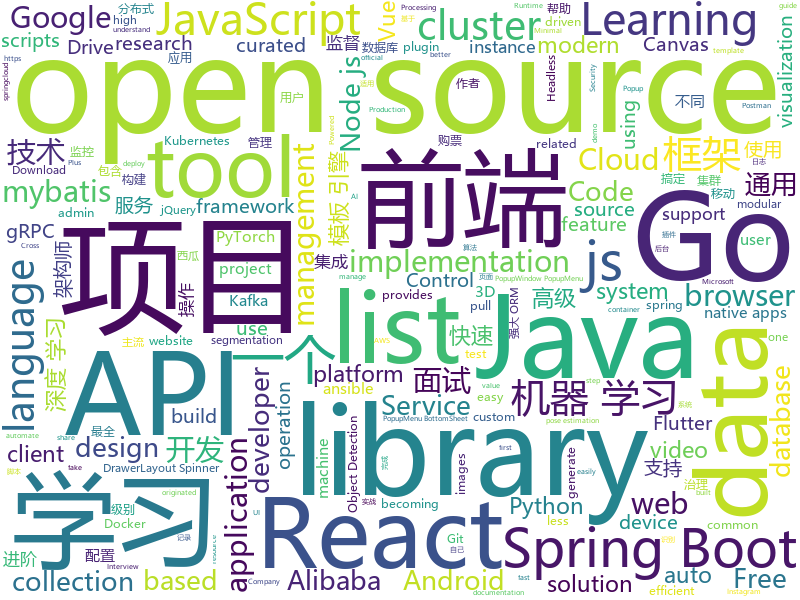

# 2019-09-13
See what the GitHub community is most excited about today.

## python
* [youtube-dl](https://github.com/ytdl-org/youtube-dl)(**73 stars today**): Command-line program to download videos from YouTube.com and other video sites
* [py12306](https://github.com/pjialin/py12306)(**246 stars today**): 🚂12306 购票助手，支持集群，多账号，多任务购票以及 Web 页面管理
* [12306](https://github.com/testerSunshine/12306)(**808 stars today**): 12306智能刷票，订票
* [instabot](https://github.com/instagrambot/instabot)(**64 stars today**): 🐙Free Instagram scripts, bots and Python API wrapper. Get free instagram followers with our auto like, auto follow and other scripts!
* [easy12306](https://github.com/zhaipro/easy12306)(**127 stars today**): 使用机器学习算法完成对12306验证码的自动识别
* [ansible](https://github.com/ansible/ansible)(**17 stars today**): Ansible is a radically simple IT automation platform that makes your applications and systems easier to deploy. Avoid writing scripts or custom code to deploy and update your applications — automate in a language that approaches plain English, using SSH, with no agents to install on remote systems. https://docs.ansible.com/ansible/
* [numpy-ml](https://github.com/ddbourgin/numpy-ml)(**67 stars today**): Machine learning, in numpy
* [redash](https://github.com/getredash/redash)(**12 stars today**): Make Your Company Data Driven. Connect to any data source, easily visualize, dashboard and share your data.
* [pythia](https://github.com/facebookresearch/pythia)(**4 stars today**): A modular framework for vision & language multimodal research from Facebook AI Research (FAIR)
* [TcloudServer](https://github.com/bigbaser/TcloudServer)(**36 stars today**): Tcloud云测平台后端服务
* [spaCy](https://github.com/explosion/spaCy)(**10 stars today**): 💫Industrial-strength Natural Language Processing (NLP) with Python and Cython
* [black](https://github.com/psf/black)(**13 stars today**): The uncompromising Python code formatter
* [DeepLearningExamples](https://github.com/NVIDIA/DeepLearningExamples)(**10 stars today**): Deep Learning Examples
* [maskrcnn-benchmark](https://github.com/facebookresearch/maskrcnn-benchmark)(**9 stars today**): Fast, modular reference implementation of Instance Segmentation and Object Detection algorithms in PyTorch.
* [rlpyt](https://github.com/astooke/rlpyt)(**64 stars today**): Reinforcement Learning in PyTorch
* [VideoPose3D](https://github.com/facebookresearch/VideoPose3D)(**13 stars today**): Efficient 3D human pose estimation in video using 2D keypoint trajectories
* [tiler](https://github.com/nuno-faria/tiler)(**136 stars today**): 👷Build images with images
* [30-seconds-of-python](https://github.com/30-seconds/30-seconds-of-python)(**12 stars today**): A curated collection of useful Python snippets that you can understand in 30 seconds or less.
* [PyTorch-YOLOv3](https://github.com/eriklindernoren/PyTorch-YOLOv3)(**8 stars today**): Minimal PyTorch implementation of YOLOv3
* [DeepLabCut](https://github.com/AlexEMG/DeepLabCut)(**1 stars today**): Markerless pose estimation of user-defined features with deep learning for all animals, including humans
* [transferlearning](https://github.com/jindongwang/transferlearning)(**8 stars today**): Everything about Transfer Learning and Domain Adaptation--迁移学习
* [system-design-primer](https://github.com/donnemartin/system-design-primer)(**62 stars today**): Learn how to design large-scale systems. Prep for the system design interview. Includes Anki flashcards.
* [AiLearning](https://github.com/apachecn/AiLearning)(**34 stars today**): AiLearning: 机器学习 - MachineLearning - ML、深度学习 - DeepLearning - DL、自然语言处理 NLP
* [allennlp](https://github.com/allenai/allennlp)(**17 stars today**): An open-source NLP research library, built on PyTorch.
* [Mask_RCNN](https://github.com/matterport/Mask_RCNN)(**20 stars today**): Mask R-CNN for object detection and instance segmentation on Keras and TensorFlow

## java
* [litemall](https://github.com/linlinjava/litemall)(**38 stars today**): 又一个小商城。litemall = Spring Boot后端 + Vue管理员前端 + 微信小程序用户前端 + Vue用户移动端
* [spring-boot-demo](https://github.com/xkcoding/spring-boot-demo)(**154 stars today**): spring boot demo 是一个用来深度学习并实战 spring boot 的项目，目前总共包含 62 个集成demo，已经完成 50 个。 该项目已成功集成 actuator(监控)、admin(可视化监控)、logback(日志)、aopLog(通过AOP记录web请求日志)、统一异常处理(json级别和页面级别)、freemarker(模板引擎)、thymeleaf(模板引擎)、Beetl(模板引擎)、Enjoy(模板引擎)、JdbcTemplate(通用JDBC操作数据库)、JPA(强大的ORM框架)、mybatis(强大的ORM框架)、通用Mapper(快速操作Mybatis)、PageHelper(通用的Mybatis分页插件)、mybatis-plus(快速操作M…
* [SpringCloud](https://github.com/zhoutaoo/SpringCloud)(**64 stars today**): 基于SpringCloud2.0的微服务开发脚手架，整合了spring-security-oauth2、apollo、eureka、feign、hystrix、springcloud-gateway、springcloud-bus等。治理方面引入elasticsearch、skywalking、springboot-admin、zipkin等，让项目开发快速进入业务开发，而不需过多时间花费在架构搭建上。持续更新中
* [spring-boot-plus](https://github.com/geekidea/spring-boot-plus)(**45 stars today**): 🔥Spring-Boot-Plus is a easy-to-use, high-speed, high-efficient,feature-rich, open source spring boot scaffolding.🚀
* [easy-rules](https://github.com/j-easy/easy-rules)(**7 stars today**): The simple, stupid rules engine for Java
* [fullstack-tutorial](https://github.com/frank-lam/fullstack-tutorial)(**46 stars today**): 🚀fullstack tutorial 2019，后台技术栈/架构师之路/全栈开发社区，春招/秋招/校招/面试
* [C-OCR](https://github.com/ctripcorp/C-OCR)(**28 stars today**): C-OCR是携程自研的OCR项目，主要包括身份证、护照、火车票、签证等旅游相关证件、材料的识别。 项目包含4个部分，拒识、检测、识别、后处理。
* [testcontainers-java](https://github.com/testcontainers/testcontainers-java)(**3 stars today**): Testcontainers is a Java library that supports JUnit tests, providing lightweight, throwaway instances of common databases, Selenium web browsers, or anything else that can run in a Docker container.
* [spring-cloud-alibaba](https://github.com/alibaba/spring-cloud-alibaba)(**33 stars today**): Spring Cloud Alibaba provides a one-stop solution for application development for the distributed solutions of Alibaba middleware.
* [thingsboard](https://github.com/thingsboard/thingsboard)(**16 stars today**): Open-source IoT Platform - Device management, data collection, processing and visualization.
* [dbeaver](https://github.com/dbeaver/dbeaver)(**20 stars today**): Free universal database tool and SQL client
* [keycloak](https://github.com/keycloak/keycloak)(**12 stars today**): Open Source Identity and Access Management For Modern Applications and Services
* [flutter_boost](https://github.com/alibaba/flutter_boost)(**27 stars today**): FlutterBoost is a Flutter plugin which enables hybrid integration of Flutter for your existing native apps with minimum efforts
* [XPopup](https://github.com/li-xiaojun/XPopup)(**41 stars today**): 🔥功能强大，UI简洁，交互优雅的通用弹窗！可以替代Dialog，PopupWindow，PopupMenu，BottomSheet，DrawerLayout，Spinner等组件，自带十几种效果良好的动画， 支持完全的UI和动画自定义！(Powerful and Beautiful Popup，can absolutely replace Dialog，PopupWindow，PopupMenu，BottomSheet，DrawerLayout，Spinner. With built-in animators , very easy to custom popup view.)
* [cim](https://github.com/crossoverJie/cim)(**17 stars today**): 📲cim(cross IM) 适用于开发者的分布式即时通讯系统
* [aws-doc-sdk-examples](https://github.com/awsdocs/aws-doc-sdk-examples)(**8 stars today**): Code examples used in the official AWS SDK documentation.
* [arthas](https://github.com/alibaba/arthas)(**36 stars today**): Alibaba Java Diagnostic Tool Arthas/Alibaba Java诊断利器Arthas
* [quarkus](https://github.com/quarkusio/quarkus)(**26 stars today**): Quarkus: Supersonic Subatomic Java.
* [Shadow](https://github.com/Tencent/Shadow)(**9 stars today**): 零反射全动态Android插件框架
* [cruise-control](https://github.com/linkedin/cruise-control)(**3 stars today**): Cruise-control is the first of its kind to fully automate the dynamic workload rebalance and self-healing of a kafka cluster. It provides great value to Kafka users by simplifying the operation of Kafka clusters.
* [ballerina-lang](https://github.com/ballerina-platform/ballerina-lang)(**15 stars today**): The Ballerina Programming Language
* [apollo](https://github.com/ctripcorp/apollo)(**28 stars today**): Apollo（阿波罗）是携程框架部门研发的分布式配置中心，能够集中化管理应用不同环境、不同集群的配置，配置修改后能够实时推送到应用端，并且具备规范的权限、流程治理等特性，适用于微服务配置管理场景。
* [NewPipe](https://github.com/TeamNewPipe/NewPipe)(**13 stars today**): A libre lightweight streaming front-end for Android.
* [spring-boot-api-project-seed](https://github.com/lihengming/spring-boot-api-project-seed)(**32 stars today**): 🌱🚀一个基于Spring Boot & MyBatis的种子项目，用于快速构建中小型API、RESTful API项目~
* [mall-learning](https://github.com/macrozheng/mall-learning)(**35 stars today**): mall学习教程，架构、业务、技术要点全方位解析。mall项目（20k+star）是一套电商系统，使用现阶段主流技术实现。 涵盖了SpringBoot2.1.3、MyBatis3.4.6、Elasticsearch6.2.2、RabbitMQ3.7.15、Redis3.2、Mongodb3.2、Mysql5.7等技术，采用Docker容器化部署。

## unknown
* [Machine-learning-learning-notes](https://github.com/Vay-keen/Machine-learning-learning-notes)(**30 stars today**): 周志华《机器学习》又称西瓜书是一本较为全面的书籍，书中详细介绍了机器学习领域不同类型的算法(例如：监督学习、无监督学习、半监督学习、强化学习、集成降维、特征选择等)，记录了本人在学习过程中的理解思路与扩展知识点，希望对新人阅读西瓜书有所帮助！
* [Specs](https://github.com/CocoaPods/Specs)(**3 stars today**): The CocoaPods Master Repo
* [Hacking-Security-Ebooks](https://github.com/yeahhub/Hacking-Security-Ebooks)(**135 stars today**): Top 100 Hacking & Security E-Books (Free Download) - Powered by Yeahhub.com
* [summer2020internships](https://github.com/elaine-zheng/summer2020internships)(**15 stars today**): Keep track of internships for Summer 2020 for undergraduates interested in tech./SWE/related fields
* [AZ-103-MicrosoftAzureAdministrator](https://github.com/MicrosoftLearning/AZ-103-MicrosoftAzureAdministrator)(**0 stars today**): AZ-103: Microsoft Azure Administrator
* [reverse-interview](https://github.com/viraptor/reverse-interview)(**705 stars today**): Questions to ask the company during your interview
* [Red-Teaming-Toolkit](https://github.com/infosecn1nja/Red-Teaming-Toolkit)(**41 stars today**): A collection of open source and commercial tools that aid in red team operations.
* [aws-solutions-architect-associate-notes](https://github.com/SkullTech/aws-solutions-architect-associate-notes)(**1 stars today**): My notes for AWS Solutions Architect Associate.
* [lectures](https://github.com/rolling-scopes-school/lectures)(**15 stars today**): 
* [awesome-architecture](https://github.com/toutiaoio/awesome-architecture)(**32 stars today**): 架构师技术图谱，助你早日成为架构师
* [angular-interview-questions](https://github.com/sudheerj/angular-interview-questions)(**2 stars today**): List of 300 Angular Interview Questions and answers[WIP]
* [Java-Interview](https://github.com/xbox1994/Java-Interview)(**5 stars today**): 经历BAT面试后总结的【高级Java后台开发面试指南】，纯净干货无废话，针对高频面试点
* [tasks](https://github.com/rolling-scopes-school/tasks)(**5 stars today**): 
* [postman-app-support](https://github.com/postmanlabs/postman-app-support)(**2 stars today**): Postman helps you be more efficient while working with APIs. Using Postman, you can construct complex HTTP requests quickly, organize them in collections and share them with your co-workers.
* [OnJava8](https://github.com/LingCoder/OnJava8)(**7 stars today**): 《On Java 8》中文版，又名《Java编程思想》 第5版
* [awesome-actions](https://github.com/sdras/awesome-actions)(**65 stars today**): A curated list of awesome actions to use on GitHub
* [GitHubDaily](https://github.com/GitHubDaily/GitHubDaily)(**9 stars today**): GitHubDaily 分享内容定期整理与分类。欢迎推荐、自荐项目，让更多人知道你的项目。
* [DeepLearning-500-questions](https://github.com/scutan90/DeepLearning-500-questions)(**31 stars today**): 深度学习500问，以问答形式对常用的概率知识、线性代数、机器学习、深度学习、计算机视觉等热点问题进行阐述，以帮助自己及有需要的读者。 全书分为18个章节，50余万字。由于水平有限，书中不妥之处恳请广大读者批评指正。 未完待续............ 如有意合作，联系scutjy2015@163.com 版权所有，违权必究 Tan 2018.06
* [awesome-apache-airflow](https://github.com/jghoman/awesome-apache-airflow)(**6 stars today**): Curated list of resources about Apache Airflow
* [kexueshangwang](https://github.com/xiaoming2028/kexueshangwang)(**3 stars today**): 翻墙-科学上网 史上最全教程
* [developer-roadmap](https://github.com/kamranahmedse/developer-roadmap)(**62 stars today**): Roadmap to becoming a web developer in 2019
* [golang-developer-roadmap](https://github.com/Alikhll/golang-developer-roadmap)(**6 stars today**): Roadmap to becoming a Go developer in 2019
* [blog](https://github.com/yygmind/blog)(**18 stars today**): 我是木易杨，公众号「高级前端进阶」作者，跟着我每周重点攻克一个前端面试重难点。接下来让我带你走进高级前端的世界，在进阶的路上，共勉！
* [react-typescript-cheatsheet](https://github.com/typescript-cheatsheets/react-typescript-cheatsheet)(**18 stars today**): Cheatsheets for experienced React developers getting started with TypeScript
* [git-tips](https://github.com/521xueweihan/git-tips)(**3 stars today**): Git的奇技淫巧

## javascript
* [chinese-poetry](https://github.com/chinese-poetry/chinese-poetry)(**107 stars today**): 最全中华古诗词数据库, 唐宋两朝近一万四千古诗人, 接近5.5万首唐诗加26万宋诗. 两宋时期1564位词人，21050首词。
* [deck.gl](https://github.com/uber/deck.gl)(**8 stars today**): WebGL2 powered geospatial visualization layers
* [strapi](https://github.com/strapi/strapi)(**31 stars today**): 🚀Open source Node.js Headless CMS to easily build customisable APIs
* [Daily-Interview-Question](https://github.com/Advanced-Frontend/Daily-Interview-Question)(**50 stars today**): 我是木易杨，公众号「高级前端进阶」作者，每天搞定一道前端大厂面试题，祝大家天天进步，一年后会看到不一样的自己。
* [puppeteer](https://github.com/GoogleChrome/puppeteer)(**108 stars today**): Headless Chrome Node.js API
* [nodebestpractices](https://github.com/goldbergyoni/nodebestpractices)(**29 stars today**): ✅The largest Node.js best practices list (September 2019)
* [axios](https://github.com/axios/axios)(**32 stars today**): Promise based HTTP client for the browser and node.js
* [react-native](https://github.com/facebook/react-native)(**45 stars today**): A framework for building native apps with React.
* [stf](https://github.com/openstf/stf)(**10 stars today**): Control and manage Android devices from your browser.
* [json-server](https://github.com/typicode/json-server)(**24 stars today**): Get a full fake REST API with zero coding in less than 30 seconds (seriously)
* [fabric.js](https://github.com/fabricjs/fabric.js)(**14 stars today**): Javascript Canvas Library, SVG-to-Canvas (& canvas-to-SVG) Parser
* [opendatacam](https://github.com/opendatacam/opendatacam)(**149 stars today**): An open source tool to quantify the world
* [react-native-router-flux](https://github.com/aksonov/react-native-router-flux)(**2 stars today**): The first declarative React Native router
* [baiduyun](https://github.com/syhyz1990/baiduyun)(**69 stars today**): 🖖油猴脚本 一个脚本搞定百度网盘下载
* [pai](https://github.com/microsoft/pai)(**4 stars today**): Resource scheduling and cluster management for AI
* [WatermelonDB](https://github.com/Nozbe/WatermelonDB)(**10 stars today**): 🍉Reactive & asynchronous database for powerful React and React Native apps⚡️
* [Sortable](https://github.com/SortableJS/Sortable)(**27 stars today**): Sortable — is a JavaScript library for reorderable drag-and-drop lists on modern browsers and touch devices. No jQuery required. Supports Meteor, AngularJS, React, Polymer, Vue, Ember, Knockout and any CSS library, e.g. Bootstrap.
* [graphql-js](https://github.com/graphql/graphql-js)(**6 stars today**): A reference implementation of GraphQL for JavaScript
* [gutenberg](https://github.com/WordPress/gutenberg)(**4 stars today**): The Block Editor project for WordPress and beyond. Plugin is available from the official repository.
* [react-vis](https://github.com/uber/react-vis)(**8 stars today**): Data Visualization Components
* [video.js](https://github.com/videojs/video.js)(**16 stars today**): Video.js - open source HTML5 & Flash video player
* [cesium](https://github.com/AnalyticalGraphicsInc/cesium)(**7 stars today**): An open-source JavaScript library for world-class 3D globes and maps🌎
* [odoo](https://github.com/odoo/odoo)(**16 stars today**): Odoo. Open Source Apps To Grow Your Business.
* [faker.js](https://github.com/Marak/faker.js)(**43 stars today**): generate massive amounts of realistic fake data in Node.js and the browser
* [node](https://github.com/nodejs/node)(**41 stars today**): Node.js JavaScript runtime✨🐢🚀✨

## html
* [universal-resume](https://github.com/WebPraktikos/universal-resume)(**33 stars today**): Minimal and formal résumé (CV) website template for print, mobile, and desktop. https://bit.ly/2kEzgt8
* [swagger-codegen](https://github.com/swagger-api/swagger-codegen)(**6 stars today**): swagger-codegen contains a template-driven engine to generate documentation, API clients and server stubs in different languages by parsing your OpenAPI / Swagger definition.
* [flutter-in-action](https://github.com/flutterchina/flutter-in-action)(**13 stars today**): 《Flutter实战》电子书
* [mkdocs-material](https://github.com/squidfunk/mkdocs-material)(**3 stars today**): A Material Design theme for MkDocs
* [fastText](https://github.com/facebookresearch/fastText)(**6 stars today**): Library for fast text representation and classification.
* [hyperblog](https://github.com/freddier/hyperblog)(**4 stars today**): Un blog increíble para el curso de Git y Github de Platzi
* [JavaScript30](https://github.com/wesbos/JavaScript30)(**4 stars today**): 30 Day Vanilla JS Challenge
* [mescroll](https://github.com/mescroll/mescroll)(**1 stars today**): 精致的下拉刷新和上拉加载 js框架.支持vue,完美运行于移动端和主流PC浏览器 (JS framework for pull-refresh and pull-up-loading)
* [glTF](https://github.com/KhronosGroup/glTF)(**1 stars today**): glTF – Runtime 3D Asset Delivery
* [kubernetes-failure-stories](https://github.com/hjacobs/kubernetes-failure-stories)(**3 stars today**): Compilation of public failure/horror stories related to Kubernetes
* [styleguide](https://github.com/google/styleguide)(**23 stars today**): Style guides for Google-originated open-source projects
* [qcloud-documents](https://github.com/tencentyun/qcloud-documents)(**0 stars today**): 腾讯云官方文档 使用Markdown自动构建
* [keep-a-changelog](https://github.com/olivierlacan/keep-a-changelog)(**4 stars today**): If you build software, keep a changelog.
* [xss-payload-list](https://github.com/payloadbox/xss-payload-list)(**12 stars today**): 🎯Cross Site Scripting ( XSS ) Vulnerability Payload List
* [fuzzdb](https://github.com/tennc/fuzzdb)(**0 stars today**): 一个fuzzdb扩展库
* [intro.js](https://github.com/usablica/intro.js)(**5 stars today**): A better way for new feature introduction and step-by-step users guide for your website and project.
* [patchwork](https://github.com/jlord/patchwork)(**0 stars today**): All the Git-it Workshop completers!
* [professional-services](https://github.com/GoogleCloudPlatform/professional-services)(**1 stars today**): Common solutions and tools developed by Google Cloud's Professional Services team
* [proposal-top-level-await](https://github.com/tc39/proposal-top-level-await)(**4 stars today**): top-level `await` proposal for ECMAScript (stage 3)
* [MSEdgeExplainers](https://github.com/MicrosoftEdge/MSEdgeExplainers)(**1 stars today**): Home for explainer documents originated by the Microsoft Edge team
* [tiny-slider](https://github.com/ganlanyuan/tiny-slider)(**5 stars today**): Vanilla javascript slider for all purposes.
* [zepto](https://github.com/madrobby/zepto)(**1 stars today**): Zepto.js is a minimalist JavaScript library for modern browsers, with a jQuery-compatible API
* [learning-area](https://github.com/mdn/learning-area)(**4 stars today**): Github repo for the MDN Learning Area.
* [nflscrapR-data](https://github.com/ryurko/nflscrapR-data)(**0 stars today**): Data files (.csv) accessed with nflscrapR and summarized at the player-level
* [web-moderno](https://github.com/cod3rcursos/web-moderno)(**4 stars today**): 

## go
* [client](https://github.com/keybase/client)(**103 stars today**): Keybase Go Library, Client, Service, OS X, iOS, Android, Electron
* [kuma](https://github.com/Kong/kuma)(**92 stars today**): 🐻The Universal Control Plane for Service Mesh
* [go-patterns](https://github.com/tmrts/go-patterns)(**24 stars today**): Curated list of Go design patterns, recipes and idioms
* [packer](https://github.com/hashicorp/packer)(**4 stars today**): Packer is a tool for creating identical machine images for multiple platforms from a single source configuration.
* [cobra](https://github.com/spf13/cobra)(**20 stars today**): A Commander for modern Go CLI interactions
* [vault](https://github.com/hashicorp/vault)(**7 stars today**): A tool for secrets management, encryption as a service, and privileged access management
* [blackbox_exporter](https://github.com/prometheus/blackbox_exporter)(**2 stars today**): Blackbox prober exporter
* [octant](https://github.com/vmware/octant)(**19 stars today**): A web-based, highly extensible platform for developers to better understand the complexity of Kubernetes clusters.
* [zap](https://github.com/uber-go/zap)(**13 stars today**): Blazing fast, structured, leveled logging in Go.
* [go-cache](https://github.com/patrickmn/go-cache)(**4 stars today**): An in-memory key:value store/cache (similar to Memcached) library for Go, suitable for single-machine applications.
* [mattermost-server](https://github.com/mattermost/mattermost-server)(**8 stars today**): Open source Slack-alternative in Golang and React - Mattermost
* [go-ethereum](https://github.com/ethereum/go-ethereum)(**7 stars today**): Official Go implementation of the Ethereum protocol
* [bl3_auto_vip](https://github.com/matt1484/bl3_auto_vip)(**6 stars today**): Borderlands3 Auto VIP Code Redemption System
* [kubesphere](https://github.com/kubesphere/kubesphere)(**20 stars today**): Easy-to-use Production Ready Container Management Platform
* [cloud-game](https://github.com/giongto35/cloud-game)(**18 stars today**): Web-based Cloud Gaming Service
* [prometheus-operator](https://github.com/coreos/prometheus-operator)(**4 stars today**): Prometheus Operator creates/configures/manages Prometheus clusters atop Kubernetes
* [go-sqlmock](https://github.com/DATA-DOG/go-sqlmock)(**2 stars today**): Sql mock driver for golang to test database interactions
* [protobuf](https://github.com/golang/protobuf)(**12 stars today**): Go support for Google's protocol buffers
* [glog](https://github.com/golang/glog)(**3 stars today**): Leveled execution logs for Go
* [kops](https://github.com/kubernetes/kops)(**10 stars today**): Kubernetes Operations (kops) - Production Grade K8s Installation, Upgrades, and Management
* [elastic](https://github.com/olivere/elastic)(**4 stars today**): Elasticsearch client for Go.
* [grpc-gateway](https://github.com/grpc-ecosystem/grpc-gateway)(**11 stars today**): gRPC to JSON proxy generator following the gRPC HTTP spec
* [origin](https://github.com/openshift/origin)(**6 stars today**): The self-managing, auto-upgrading, Kubernetes distribution for everyone
* [rclone](https://github.com/rclone/rclone)(**77 stars today**): "rsync for cloud storage" - Google Drive, Amazon Drive, S3, Dropbox, Backblaze B2, One Drive, Swift, Hubic, Cloudfiles, Google Cloud Storage, Yandex Files
* [grpc-go](https://github.com/grpc/grpc-go)(**13 stars today**): The Go language implementation of gRPC. HTTP/2 based RPC

## WordCloud

