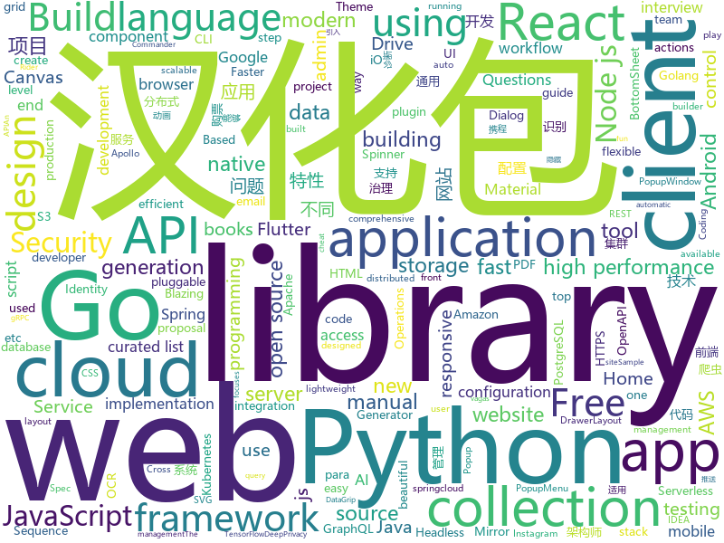

# 2019-09-14
See what the GitHub community is most excited about today.

## python
* [ctrl](https://github.com/salesforce/ctrl)(**96 stars today**): Conditional Transformer Language Model for Controllable Generation (https://einstein.ai/presentations/ctrl.pdf)
* [30-seconds-of-python](https://github.com/30-seconds/30-seconds-of-python)(**23 stars today**): A curated collection of useful Python snippets that you can understand in 30 seconds or less.
* [elasticdl](https://github.com/sql-machine-learning/elasticdl)(**20 stars today**): Kubernetes-native Deep Learning Framework
* [models](https://github.com/tensorflow/models)(**21 stars today**): Models and examples built with TensorFlow
* [DeepPrivacy](https://github.com/hukkelas/DeepPrivacy)(**13 stars today**): DeepPrivacy: A Generative Adversarial Network for Face Anonymization
* [localstack](https://github.com/localstack/localstack)(**23 stars today**): 💻A fully functional local AWS cloud stack. Develop and test your cloud & Serverless apps offline!
* [elasticsearch-dsl-py](https://github.com/elastic/elasticsearch-dsl-py)(**2 stars today**): High level Python client for Elasticsearch
* [mypy](https://github.com/python/mypy)(**11 stars today**): Optional static typing for Python 3 and 2 (PEP 484)
* [py12306](https://github.com/pjialin/py12306)(**106 stars today**): 🚂12306 购票助手，支持集群，多账号，多任务购票以及 Web 页面管理
* [algo](https://github.com/wangzheng0822/algo)(**7 stars today**): 数据结构和算法必知必会的50个代码实现
* [AirGesture](https://github.com/vietnguyen1991/AirGesture)(**9 stars today**): Play games without touching keyboard
* [tfx](https://github.com/tensorflow/tfx)(**3 stars today**): TFX is an end-to-end platform for deploying production ML pipelines
* [VideoPose3D](https://github.com/facebookresearch/VideoPose3D)(**13 stars today**): Efficient 3D human pose estimation in video using 2D keypoint trajectories
* [helm-charts](https://github.com/elastic/helm-charts)(**0 stars today**): You know, for Kubernetes
* [findrpc](https://github.com/lucasg/findrpc)(**6 stars today**): Idapython script to carve binary for internal RPC structures
* [ScoutSuite](https://github.com/nccgroup/ScoutSuite)(**5 stars today**): Multi-Cloud Security Auditing Tool
* [cpython](https://github.com/python/cpython)(**20 stars today**): The Python programming language
* [black](https://github.com/psf/black)(**10 stars today**): The uncompromising Python code formatter
* [GeneralNewsExtractor](https://github.com/kingname/GeneralNewsExtractor)(**13 stars today**): 新闻网页正文通用抽取器 Alpha 版.
* [instabot](https://github.com/instagrambot/instabot)(**69 stars today**): 🐙Free Instagram scripts, bots and Python API wrapper. Get free instagram followers with our auto like, auto follow and other scripts!
* [full-stack-fastapi-postgresql](https://github.com/tiangolo/full-stack-fastapi-postgresql)(**2 stars today**): Full stack, modern web application generator. Using FastAPI, PostgreSQL as database, Docker, automatic HTTPS and more.
* [NEAT-Flappy-Bird](https://github.com/techwithtim/NEAT-Flappy-Bird)(**0 stars today**): An AI that plays flappy bird! Using the NEAT python module.
* [bokeh](https://github.com/bokeh/bokeh)(**8 stars today**): Interactive Data Visualization in the browser, from Python
* [fairseq](https://github.com/pytorch/fairseq)(**10 stars today**): Facebook AI Research Sequence-to-Sequence Toolkit written in Python.
* [scikit-image](https://github.com/scikit-image/scikit-image)(**1 stars today**): Image processing in Python

## java
* [NewPipe](https://github.com/TeamNewPipe/NewPipe)(**12 stars today**): A libre lightweight streaming front-end for Android.
* [bistoury](https://github.com/qunarcorp/bistoury)(**13 stars today**): Bistoury是去哪儿网的java应用生产问题诊断工具，提供了一站式的问题诊断方案
* [TubeMQ](https://github.com/Tencent/TubeMQ)(**12 stars today**): TubeMQ focuses on high-performance storage and transmission of massive data in large data scenarios
* [dddsample-core](https://github.com/citerus/dddsample-core)(**8 stars today**): This is the new home of the original DDD Sample app (previously hosted at sf.net)..
* [nifi](https://github.com/apache/nifi)(**2 stars today**): Mirror of Apache NiFi
* [spring-cloud-config](https://github.com/spring-cloud/spring-cloud-config)(**9 stars today**): External configuration (server and client) for Spring Cloud
* [keycloak](https://github.com/keycloak/keycloak)(**4 stars today**): Open Source Identity and Access Management For Modern Applications and Services
* [camunda-bpm-platform](https://github.com/camunda/camunda-bpm-platform)(**2 stars today**): Flexible framework for workflow and decision automation
* [gitlab-plugin](https://github.com/jenkinsci/gitlab-plugin)(**0 stars today**): A Jenkins plugin for interfacing with GitLab
* [SpringCloud](https://github.com/zhoutaoo/SpringCloud)(**25 stars today**): 基于SpringCloud2.0的微服务开发脚手架，整合了spring-security-oauth2、apollo、eureka、feign、hystrix、springcloud-gateway、springcloud-bus等。治理方面引入elasticsearch、skywalking、springboot-admin、zipkin等，让项目开发快速进入业务开发，而不需过多时间花费在架构搭建上。持续更新中
* [tech-weekly](https://github.com/mercyblitz/tech-weekly)(**6 stars today**): 「小马哥技术周报」
* [XPopup](https://github.com/li-xiaojun/XPopup)(**4 stars today**): 🔥功能强大，UI简洁，交互优雅的通用弹窗！可以替代Dialog，PopupWindow，PopupMenu，BottomSheet，DrawerLayout，Spinner等组件，自带十几种效果良好的动画， 支持完全的UI和动画自定义！(Powerful and Beautiful Popup，can absolutely replace Dialog，PopupWindow，PopupMenu，BottomSheet，DrawerLayout，Spinner. With built-in animators , very easy to custom popup view.)
* [C-OCR](https://github.com/ctripcorp/C-OCR)(**10 stars today**): C-OCR是携程自研的OCR项目，主要包括身份证、护照、火车票、签证等旅游相关证件、材料的识别。 项目包含4个部分，拒识、检测、识别、后处理。
* [solo](https://github.com/b3log/solo)(**17 stars today**): 🎸一款小而美的博客系统，专为程序员设计。
* [flutter_boost](https://github.com/alibaba/flutter_boost)(**6 stars today**): FlutterBoost is a Flutter plugin which enables hybrid integration of Flutter for your existing native apps with minimum efforts
* [cim](https://github.com/crossoverJie/cim)(**6 stars today**): 📲cim(cross IM) 适用于开发者的分布式即时通讯系统
* [graal](https://github.com/oracle/graal)(**5 stars today**): GraalVM: Run Programs Faster Anywhere🚀
* [apollo](https://github.com/ctripcorp/apollo)(**6 stars today**): Apollo（阿波罗）是携程框架部门研发的分布式配置中心，能够集中化管理应用不同环境、不同集群的配置，配置修改后能够实时推送到应用端，并且具备规范的权限、流程治理等特性，适用于微服务配置管理场景。
* [openapi-generator](https://github.com/OpenAPITools/openapi-generator)(**10 stars today**): OpenAPI Generator allows generation of API client libraries (SDK generation), server stubs, documentation and configuration automatically given an OpenAPI Spec (v2, v3)
* [calcite](https://github.com/apache/calcite)(**1 stars today**): Mirror of Apache Calcite
* [runelite](https://github.com/runelite/runelite)(**4 stars today**): Open source Old School RuneScape client
* [spring-cloud-kubernetes](https://github.com/spring-cloud/spring-cloud-kubernetes)(**3 stars today**): Kubernetes integration with Spring Cloud Discovery Client, Configuration, etc...
* [quarkus](https://github.com/quarkusio/quarkus)(**16 stars today**): Quarkus: Supersonic Subatomic Java.
* [Telegram](https://github.com/DrKLO/Telegram)(**8 stars today**): Telegram for Android source
* [caffeine](https://github.com/ben-manes/caffeine)(**6 stars today**): A high performance caching library for Java 8

## unknown
* [Hacking-Security-Ebooks](https://github.com/yeahhub/Hacking-Security-Ebooks)(**175 stars today**): Top 100 Hacking & Security E-Books (Free Download) - Powered by Yeahhub.com
* [awesome-actions](https://github.com/sdras/awesome-actions)(**54 stars today**): A curated list of awesome actions to use on GitHub
* [lectures](https://github.com/rolling-scopes-school/lectures)(**11 stars today**): 
* [the-book-of-secret-knowledge](https://github.com/trimstray/the-book-of-secret-knowledge)(**65 stars today**): A collection of inspiring lists, manuals, cheatsheets, blogs, hacks, one-liners, cli/web tools and more.
* [computer-science](https://github.com/ossu/computer-science)(**27 stars today**): 🎓Path to a free self-taught education in Computer Science!
* [new-grads-2020](https://github.com/cmackenzie1/new-grads-2020)(**10 stars today**): A collection of new grad roles for 2020
* [tasks](https://github.com/rolling-scopes-school/tasks)(**1 stars today**): 
* [Red-Teaming-Toolkit](https://github.com/infosecn1nja/Red-Teaming-Toolkit)(**10 stars today**): A collection of open source and commercial tools that aid in red team operations.
* [StabilityGuide](https://github.com/StabilityMan/StabilityGuide)(**4 stars today**): 【稳定大于一切】打造国内稳定性领域知识库，让无法解决的问题少一点点，让世界的确定性多一点点。
* [backend](https://github.com/kottans/backend)(**5 stars today**): Kottans backend course🎓
* [starter-workflows](https://github.com/actions/starter-workflows)(**15 stars today**): Accelerating new GitHub Actions workflows
* [jest-cheat-sheet](https://github.com/sapegin/jest-cheat-sheet)(**2 stars today**): Jest cheat sheet
* [engine](https://github.com/php-plus/engine)(**7 stars today**): ✨The Plus source code
* [javascript-testing-best-practices](https://github.com/goldbergyoni/javascript-testing-best-practices)(**33 stars today**): 📗🌐🚢Comprehensive and exhaustive JavaScript & Node.js testing best practices (August 2019)
* [vagas](https://github.com/frontendbr/vagas)(**6 stars today**): 🔬Espaço para divulgação de vagas para front-enders.
* [reverse-interview](https://github.com/viraptor/reverse-interview)(**381 stars today**): Questions to ask the company during your interview
* [free-programming-books](https://github.com/EbookFoundation/free-programming-books)(**112 stars today**): 📚Freely available programming books
* [book](https://github.com/KeKe-Li/book)(**6 stars today**): 📚All programming languages books
* [The-Open-Book](https://github.com/joeycastillo/The-Open-Book)(**28 stars today**): 
* [awesome-architecture](https://github.com/toutiaoio/awesome-architecture)(**10 stars today**): 架构师技术图谱，助你早日成为架构师
* [developer-roadmap](https://github.com/kamranahmedse/developer-roadmap)(**38 stars today**): Roadmap to becoming a web developer in 2019
* [Specs](https://github.com/CocoaPods/Specs)(**0 stars today**): The CocoaPods Master Repo
* [awesome-distributed-systems](https://github.com/theanalyst/awesome-distributed-systems)(**8 stars today**): A curated list to learn about distributed systems
* [reactjs-interview-questions](https://github.com/sudheerj/reactjs-interview-questions)(**7 stars today**): List of top 500 ReactJS Interview Questions & Answers....Coding exercise questions are coming soon!!
* [app-ideas](https://github.com/florinpop17/app-ideas)(**13 stars today**): A Collection of application ideas which can be used to improve your coding skills.

## javascript
* [puppeteer](https://github.com/GoogleChrome/puppeteer)(**76 stars today**): Headless Chrome Node.js API
* [opendatacam](https://github.com/opendatacam/opendatacam)(**79 stars today**): An open source tool to quantify the world
* [chinese-poetry](https://github.com/chinese-poetry/chinese-poetry)(**86 stars today**): 最全中华古诗词数据库, 唐宋两朝近一万四千古诗人, 接近5.5万首唐诗加26万宋诗. 两宋时期1564位词人，21050首词。
* [borderlands](https://github.com/rockdevourer/borderlands)(**3 stars today**): Interact with Shift
* [fabric.js](https://github.com/fabricjs/fabric.js)(**17 stars today**): Javascript Canvas Library, SVG-to-Canvas (& canvas-to-SVG) Parser
* [react-native](https://github.com/facebook/react-native)(**46 stars today**): A framework for building native apps with React.
* [appium-desktop](https://github.com/appium/appium-desktop)(**1 stars today**): Appium Server and Inspector in Desktop GUIs for Mac, Windows, and Linux
* [react-grid-layout](https://github.com/STRML/react-grid-layout)(**16 stars today**): A draggable and resizable grid layout with responsive breakpoints, for React.
* [gatsby](https://github.com/gatsbyjs/gatsby)(**22 stars today**): Build blazing fast, modern apps and websites with React
* [js-cookie](https://github.com/js-cookie/js-cookie)(**9 stars today**): A simple, lightweight JavaScript API for handling browser cookies
* [hackathon-starter](https://github.com/sahat/hackathon-starter)(**14 stars today**): A boilerplate for Node.js web applications
* [knex](https://github.com/tgriesser/knex)(**7 stars today**): A query builder for PostgreSQL, MySQL and SQLite3, designed to be flexible, portable, and fun to use.
* [pushgateway](https://github.com/prometheus/pushgateway)(**1 stars today**): Push acceptor for ephemeral and batch jobs.
* [emotion](https://github.com/emotion-js/emotion)(**12 stars today**): 👩‍🎤CSS-in-JS library designed for high performance style composition
* [strapi](https://github.com/strapi/strapi)(**114 stars today**): 🚀Open source Node.js Headless CMS to easily build customisable APIs
* [Daily-Interview-Question](https://github.com/Advanced-Frontend/Daily-Interview-Question)(**33 stars today**): 我是木易杨，公众号「高级前端进阶」作者，每天搞定一道前端大厂面试题，祝大家天天进步，一年后会看到不一样的自己。
* [mjml](https://github.com/mjmlio/mjml)(**16 stars today**): MJML: the only framework that makes responsive-email easy
* [node](https://github.com/nodejs/node)(**29 stars today**): Node.js JavaScript runtime✨🐢🚀✨
* [react-admin](https://github.com/marmelab/react-admin)(**15 stars today**): A frontend Framework for building admin applications running in the browser on top of REST/GraphQL APIs, using ES6, React and Material Design
* [baseui](https://github.com/uber-web/baseui)(**11 stars today**): A React Component library implementing the Base design language
* [react-table](https://github.com/tannerlinsley/react-table)(**22 stars today**): ⚛️Hooks for building fast and extendable tables and datagrids for React
* [serverless](https://github.com/serverless/serverless)(**12 stars today**): Serverless Framework – Build web, mobile and IoT applications with serverless architectures using AWS Lambda, Azure Functions, Google CloudFunctions & more! –
* [react](https://github.com/facebook/react)(**70 stars today**): A declarative, efficient, and flexible JavaScript library for building user interfaces.
* [material-ui](https://github.com/mui-org/material-ui)(**28 stars today**): React components for faster and easier web development. Build your own design system, or start with Material Design.
* [graphql-engine](https://github.com/hasura/graphql-engine)(**16 stars today**): Blazing fast, instant realtime GraphQL APIs on Postgres with fine grained access control, also trigger webhooks on database events.

## html
* [xss-payload-list](https://github.com/payloadbox/xss-payload-list)(**0 stars today**): 🎯Cross Site Scripting ( XSS ) Vulnerability Payload List
* [mkdocs-material](https://github.com/squidfunk/mkdocs-material)(**4 stars today**): A Material Design theme for MkDocs
* [AdminLTE](https://github.com/ColorlibHQ/AdminLTE)(**37 stars today**): AdminLTE - Free Premium Admin control Panel Theme Based On Bootstrap 3.x
* [foundation-emails](https://github.com/foundation/foundation-emails)(**1 stars today**): Quickly create responsive HTML emails that work on any device and client. Even Outlook.
* [flutter-in-action](https://github.com/flutterchina/flutter-in-action)(**4 stars today**): 《Flutter实战》电子书
* [dropcss](https://github.com/leeoniya/dropcss)(**3 stars today**): An exceptionally fast, thorough and tiny unused-CSS cleaner
* [pdfs](https://github.com/tpn/pdfs)(**1 stars today**): Technically-oriented PDF Collection (Papers, Specs, Decks, Manuals, etc)
* [MSEdgeExplainers](https://github.com/MicrosoftEdge/MSEdgeExplainers)(**1 stars today**): Home for explainer documents originated by the Microsoft Edge team
* [masonry](https://github.com/desandro/masonry)(**3 stars today**): 🏩Cascading grid layout plugin
* [TranslatorX](https://github.com/pingfangx/TranslatorX)(**57 stars today**): JetBrains 系列软件汉化包 关键字: Android Studio 3.5 汉化包 CLion 2019.2 汉化包 DataGrip 2019.2 汉化包 GoLand 2019.2 汉化包 IntelliJ IDEA 2019.2 汉化包 PhpStorm 2019.2 汉化包 PyCharm 2019.2 汉化包 Rider 2019.2 汉化包 RubyMine 2019.2 汉化包 WebStorm 2019.2 汉化包
* [hugo-academic](https://github.com/gcushen/hugo-academic)(**3 stars today**): 📝The website builder for Hugo. Build and deploy a beautiful website in minutes!
* [owasp-mstg](https://github.com/OWASP/owasp-mstg)(**5 stars today**): The Mobile Security Testing Guide (MSTG) is a comprehensive manual for mobile app security development, testing and reverse engineering.
* [pr-maneiro](https://github.com/IgorHalfeld/pr-maneiro)(**12 stars today**): Faça alguém feliz com um comentário no PR!
* [intro.js](https://github.com/usablica/intro.js)(**1 stars today**): A better way for new feature introduction and step-by-step users guide for your website and project.
* [Anti-Anti-Spider](https://github.com/luyishisi/Anti-Anti-Spider)(**1 stars today**): 越来越多的网站具有反爬虫特性，有的用图片隐藏关键数据，有的使用反人类的验证码，建立反反爬虫的代码仓库，通过与不同特性的网站做斗争（无恶意）提高技术。（欢迎提交难以采集的网站）（因工作原因，项目暂停）
* [node-interview](https://github.com/ElemeFE/node-interview)(**0 stars today**): How to pass the Node.js interview of ElemeFE.
* [istio.io](https://github.com/istio/istio.io)(**0 stars today**): Source for the istio.io site
* [chart-doctor](https://github.com/ft-interactive/chart-doctor)(**1 stars today**): Sample files to accompany the FT's Chart Doctor column
* [wysiwyg-editor](https://github.com/froala/wysiwyg-editor)(**0 stars today**): The next generation Javascript WYSIWYG HTML Editor.
* [Dism-Multi-language](https://github.com/Chuyu-Team/Dism-Multi-language)(**4 stars today**): Dism++ Multi-language Support & BUG Report
* [tagify](https://github.com/yairEO/tagify)(**1 stars today**): lightweight, efficient Tags input component in Vanilla JS / React / Angular
* [OctoPrint-Dashboard](https://github.com/StefanCohen/OctoPrint-Dashboard)(**1 stars today**): A dashboard for Octoprint
* [proposal-nullish-coalescing](https://github.com/tc39/proposal-nullish-coalescing)(**1 stars today**): Nullish coalescing proposal x ?? y
* [proposal-top-level-await](https://github.com/tc39/proposal-top-level-await)(**1 stars today**): top-level `await` proposal for ECMAScript (stage 3)
* [fmriprep](https://github.com/poldracklab/fmriprep)(**0 stars today**): fMRIPrep is a robust and easy-to-use pipeline for preprocessing of diverse fMRI data. The transparent workflow dispenses of manual intervention, thereby ensuring the reproducibility of the results.

## go
* [client](https://github.com/keybase/client)(**89 stars today**): Keybase Go Library, Client, Service, OS X, iOS, Android, Electron
* [terraform-provider-aws](https://github.com/terraform-providers/terraform-provider-aws)(**11 stars today**): Terraform AWS provider
* [libpod](https://github.com/containers/libpod)(**9 stars today**): libpod is a library used to create container pods. Home of Podman.
* [gorm](https://github.com/jinzhu/gorm)(**9 stars today**): The fantastic ORM library for Golang, aims to be developer friendly
* [resty](https://github.com/go-resty/resty)(**5 stars today**): Simple HTTP and REST client library for Go
* [cadence](https://github.com/uber/cadence)(**43 stars today**): Cadence is a distributed, scalable, durable, and highly available orchestration engine to execute asynchronous long-running business logic in a scalable and resilient way.
* [argo](https://github.com/argoproj/argo)(**9 stars today**): Argo Workflows: Get stuff done with Kubernetes.
* [go-patterns](https://github.com/tmrts/go-patterns)(**81 stars today**): Curated list of Go design patterns, recipes and idioms
* [go-ethereum](https://github.com/ethereum/go-ethereum)(**3 stars today**): Official Go implementation of the Ethereum protocol
* [kops](https://github.com/kubernetes/kops)(**8 stars today**): Kubernetes Operations (kops) - Production Grade K8s Installation, Upgrades, and Management
* [cert-manager](https://github.com/jetstack/cert-manager)(**7 stars today**): Automatically provision and manage TLS certificates in Kubernetes
* [vault](https://github.com/hashicorp/vault)(**8 stars today**): A tool for secrets management, encryption as a service, and privileged access management
* [grpc-go](https://github.com/grpc/grpc-go)(**7 stars today**): The Go language implementation of gRPC. HTTP/2 based RPC
* [cobra](https://github.com/spf13/cobra)(**11 stars today**): A Commander for modern Go CLI interactions
* [descheduler](https://github.com/kubernetes-sigs/descheduler)(**5 stars today**): Descheduler for Kubernetes
* [charts](https://github.com/helm/charts)(**17 stars today**): Curated applications for Kubernetes
* [minio](https://github.com/minio/minio)(**6 stars today**): MinIO is a high performance object storage server compatible with Amazon S3 APIs
* [aws-vault](https://github.com/99designs/aws-vault)(**4 stars today**): A vault for securely storing and accessing AWS credentials in development environments
* [harbor](https://github.com/goharbor/harbor)(**15 stars today**): An open source trusted cloud native registry project that stores, signs, and scans content.
* [rclone](https://github.com/rclone/rclone)(**15 stars today**): "rsync for cloud storage" - Google Drive, Amazon Drive, S3, Dropbox, Backblaze B2, One Drive, Swift, Hubic, Cloudfiles, Google Cloud Storage, Yandex Files
* [logrus](https://github.com/sirupsen/logrus)(**9 stars today**): Structured, pluggable logging for Go.
* [jwt-go](https://github.com/dgrijalva/jwt-go)(**2 stars today**): Golang implementation of JSON Web Tokens (JWT)
* [kuma](https://github.com/Kong/kuma)(**111 stars today**): 🐻The Universal Control Plane for Service Mesh
* [mongo-go-driver](https://github.com/mongodb/mongo-go-driver)(**5 stars today**): The Go driver for MongoDB
* [dex](https://github.com/dexidp/dex)(**4 stars today**): OpenID Connect Identity (OIDC) and OAuth 2.0 Provider with Pluggable Connectors

## WordCloud

