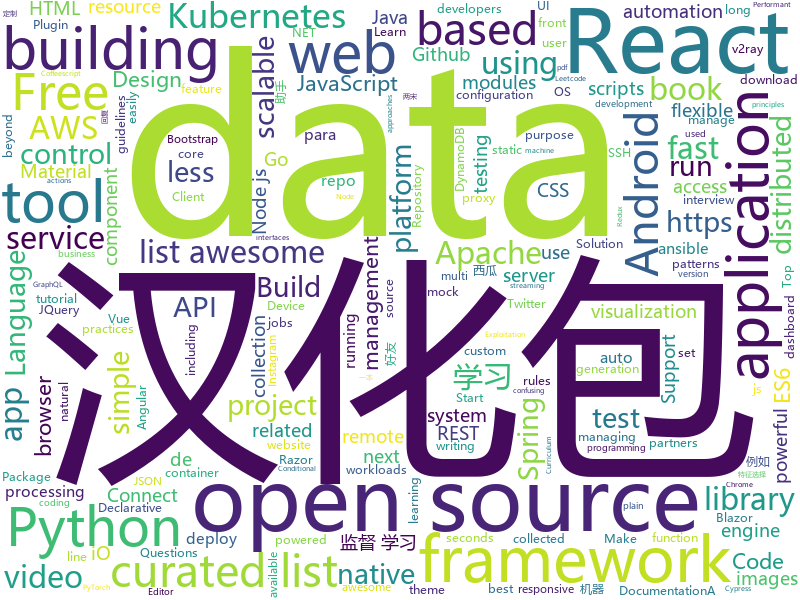

# 2019-09-15
See what the GitHub community is most excited about today.

## python
* [spaCy](https://github.com/explosion/spaCy)(**10 stars today**): 💫Industrial-strength Natural Language Processing (NLP) with Python and Cython
* [youtube-dl](https://github.com/ytdl-org/youtube-dl)(**114 stars today**): Command-line program to download videos from YouTube.com and other video sites
* [30-seconds-of-python](https://github.com/30-seconds/30-seconds-of-python)(**93 stars today**): A curated collection of useful Python snippets that you can understand in 30 seconds or less.
* [django](https://github.com/django/django)(**19 stars today**): The Web framework for perfectionists with deadlines.
* [code_snippets](https://github.com/CoreyMSchafer/code_snippets)(**9 stars today**): 
* [ctrl](https://github.com/salesforce/ctrl)(**55 stars today**): Conditional Transformer Language Model for Controllable Generation (https://einstein.ai/presentations/ctrl.pdf)
* [redash](https://github.com/getredash/redash)(**4 stars today**): Make Your Company Data Driven. Connect to any data source, easily visualize, dashboard and share your data.
* [mypy](https://github.com/python/mypy)(**10 stars today**): Optional static typing for Python 3 and 2 (PEP 484)
* [cpython](https://github.com/python/cpython)(**19 stars today**): The Python programming language
* [scikit-learn](https://github.com/scikit-learn/scikit-learn)(**18 stars today**): scikit-learn: machine learning in Python
* [instabot](https://github.com/instagrambot/instabot)(**28 stars today**): 🐙Free Instagram scripts, bots and Python API wrapper. Get free instagram followers with our auto like, auto follow and other scripts!
* [bless](https://github.com/Netflix/bless)(**5 stars today**): Repository for BLESS, an SSH Certificate Authority that runs as a AWS Lambda function
* [home-assistant](https://github.com/home-assistant/home-assistant)(**22 stars today**): 🏡Open source home automation that puts local control and privacy first
* [delta](https://github.com/didi/delta)(**34 stars today**): DELTA is a deep learning based natural language and speech processing platform.
* [pandas](https://github.com/pandas-dev/pandas)(**12 stars today**): Flexible and powerful data analysis / manipulation library for Python, providing labeled data structures similar to R data.frame objects, statistical functions, and much more
* [ray](https://github.com/ray-project/ray)(**6 stars today**): A fast and simple framework for building and running distributed applications.
* [EverydayWechat](https://github.com/sfyc23/EverydayWechat)(**9 stars today**): 微信助手：1.每日定时给好友发送定制消息。2.机器人自动回复好友。3.群助手功能（例如：查询垃圾分类、天气、日历、电影实时票房、快递物流等）
* [apex](https://github.com/NVIDIA/apex)(**4 stars today**): A PyTorch Extension: Tools for easy mixed precision and distributed training in Pytorch
* [CppCoreGuidelines](https://github.com/isocpp/CppCoreGuidelines)(**21 stars today**): The C++ Core Guidelines are a set of tried-and-true guidelines, rules, and best practices about coding in C++
* [aws-sam-cli](https://github.com/awslabs/aws-sam-cli)(**3 stars today**): CLI tool to build, test, debug, and deploy Serverless applications using AWS SAM
* [molecule](https://github.com/ansible/molecule)(**0 stars today**): Molecule aids in the development and testing of Ansible roles.
* [tlroadmap](https://github.com/tlbootcamp/tlroadmap)(**6 stars today**): 👩🏼‍💻👨🏻‍💻Карта навыков и модель развития тимлидов
* [optuna](https://github.com/pfnet/optuna)(**1 stars today**): A hyperparameter optimization framework
* [VideoPose3D](https://github.com/facebookresearch/VideoPose3D)(**9 stars today**): Efficient 3D human pose estimation in video using 2D keypoint trajectories
* [ansible](https://github.com/ansible/ansible)(**12 stars today**): Ansible is a radically simple IT automation platform that makes your applications and systems easier to deploy. Avoid writing scripts or custom code to deploy and update your applications — automate in a language that approaches plain English, using SSH, with no agents to install on remote systems. https://docs.ansible.com/ansible/

## java
* [nifi](https://github.com/apache/nifi)(**4 stars today**): Mirror of Apache NiFi
* [quarkus](https://github.com/quarkusio/quarkus)(**6 stars today**): Quarkus: Supersonic Subatomic Java.
* [jabref](https://github.com/JabRef/jabref)(**1 stars today**): Graphical Java application for managing BibTeX and biblatex (.bib) databases
* [invest-openapi-java-sdk](https://github.com/TinkoffCreditSystems/invest-openapi-java-sdk)(**2 stars today**): 
* [bytecode-viewer](https://github.com/Konloch/bytecode-viewer)(**5 stars today**): A Java 8+ Jar & Android APK Reverse Engineering Suite (Decompiler, Editor, Debugger & More)
* [react-native-video](https://github.com/react-native-community/react-native-video)(**2 stars today**): A <Video /> component for react-native
* [zalenium](https://github.com/zalando/zalenium)(**3 stars today**): A flexible and scalable container based Selenium Grid with video recording, live preview, basic auth & dashboard.
* [stripe-android](https://github.com/stripe/stripe-android)(**1 stars today**): Stripe Android SDK
* [xDrip](https://github.com/NightscoutFoundation/xDrip)(**2 stars today**): Nightscout version of xDrip+
* [beam](https://github.com/apache/beam)(**5 stars today**): Apache Beam
* [dynamo-cassandra-proxy](https://github.com/datastax/dynamo-cassandra-proxy)(**4 stars today**): Preview version of an open source tool that enables developers to run their AWS DynamoDB™ workloads on Apache Cassandra™. With the proxy, developers can run DynamoDB workloads outside of AWS (including on premises, other clouds, and in hybrid configurations).
* [spring-boot](https://github.com/spring-projects/spring-boot)(**18 stars today**): Spring Boot
* [selenium](https://github.com/SeleniumHQ/selenium)(**9 stars today**): A browser automation framework and ecosystem.
* [tutorials](https://github.com/eugenp/tutorials)(**13 stars today**): The "REST With Spring" Course:
* [Leetcode](https://github.com/fishercoder1534/Leetcode)(**6 stars today**): Complete solutions to Leetcode problems; updated daily. (I'm looking for long-term contributors/partners to this repo! Send me PRs if you're interested! - 9/5/2018)
* [react-native-svg](https://github.com/react-native-community/react-native-svg)(**2 stars today**): SVG library for React Native, React Native Web, and plain React web projects.
* [react-native-keychain](https://github.com/oblador/react-native-keychain)(**1 stars today**): 🔑Keychain Access for React Native
* [jackson-databind](https://github.com/FasterXML/jackson-databind)(**1 stars today**): General data-binding package for Jackson (2.x): works on streaming API (core) implementation(s)
* [easy-rules](https://github.com/j-easy/easy-rules)(**5 stars today**): The simple, stupid rules engine for Java
* [thingsboard](https://github.com/thingsboard/thingsboard)(**6 stars today**): Open-source IoT Platform - Device management, data collection, processing and visualization.
* [pulsar](https://github.com/apache/pulsar)(**7 stars today**): Apache Pulsar - distributed pub-sub messaging system
* [calcite](https://github.com/apache/calcite)(**2 stars today**): Mirror of Apache Calcite
* [java-docs-samples](https://github.com/GoogleCloudPlatform/java-docs-samples)(**2 stars today**): 
* [spring-graal-feature](https://github.com/spring-projects-experimental/spring-graal-feature)(**3 stars today**): Graal feature for building native images of Spring applications
* [spring-cloud-config](https://github.com/spring-cloud/spring-cloud-config)(**0 stars today**): External configuration (server and client) for Spring Cloud

## unknown
* [ECMAScript-new-features-list](https://github.com/daumann/ECMAScript-new-features-list)(**159 stars today**): A comprehensive list of new ES features, including ES2015 (ES6), ES2016 (ES7), ES2017 (ES8), ES2018 (ES9), ES2019 (ES10)
* [project-based-learning](https://github.com/tuvtran/project-based-learning)(**213 stars today**): Curated list of project-based tutorials
* [build-your-own-x](https://github.com/danistefanovic/build-your-own-x)(**125 stars today**): 🤓Build your own (insert technology here)
* [Hacking-Security-Ebooks](https://github.com/yeahhub/Hacking-Security-Ebooks)(**226 stars today**): Top 100 Hacking & Security E-Books (Free Download) - Powered by Yeahhub.com
* [Data-Science--Cheat-Sheet](https://github.com/abhat222/Data-Science--Cheat-Sheet)(**49 stars today**): Cheat Sheets
* [awesome-blazor](https://github.com/AdrienTorris/awesome-blazor)(**5 stars today**): Resources for Blazor, a .NET web framework using C#/Razor and HTML that runs in the browser with WebAssembly.
* [awesome-dotnet](https://github.com/quozd/awesome-dotnet)(**9 stars today**): A collection of awesome .NET libraries, tools, frameworks and software
* [You-Dont-Know-JS](https://github.com/getify/You-Dont-Know-JS)(**53 stars today**): A book series on JavaScript. @YDKJS on twitter.
* [Active-Directory-Pentest-Notes](https://github.com/uknowsec/Active-Directory-Pentest-Notes)(**41 stars today**): 个人域渗透学习笔记
* [Machine-learning-learning-notes](https://github.com/Vay-keen/Machine-learning-learning-notes)(**18 stars today**): 周志华《机器学习》又称西瓜书是一本较为全面的书籍，书中详细介绍了机器学习领域不同类型的算法(例如：监督学习、无监督学习、半监督学习、强化学习、集成降维、特征选择等)，记录了本人在学习过程中的理解思路与扩展知识点，希望对新人阅读西瓜书有所帮助！
* [Awesome-Advanced-Windows-Exploitation-References](https://github.com/yeyintminthuhtut/Awesome-Advanced-Windows-Exploitation-References)(**5 stars today**): List of Awesome Advanced Windows Exploitation References
* [react-redux-links](https://github.com/markerikson/react-redux-links)(**9 stars today**): Curated tutorial and resource links I've collected on React, Redux, ES6, and more
* [angular-interview-questions](https://github.com/sudheerj/angular-interview-questions)(**3 stars today**): List of 300 Angular Interview Questions and answers[WIP]
* [frontend-challenges](https://github.com/felipefialho/frontend-challenges)(**6 stars today**): 💥Listing some playful open-source's challenges of jobs to test your knowledge
* [Scanners-Box](https://github.com/We5ter/Scanners-Box)(**9 stars today**): A powerful hacker toolkit collected more than 10 categories of open source scanners from Github - 安全行业从业者自研开源扫描器合辑
* [awesome-flask](https://github.com/mjhea0/awesome-flask)(**23 stars today**): A curated list of awesome things related to Flask
* [awesome-scalability](https://github.com/binhnguyennus/awesome-scalability)(**9 stars today**): The Patterns of Scalable, Reliable, and Performant Large-Scale Systems
* [xamarin-forms-goodlooking-UI](https://github.com/jsuarezruiz/xamarin-forms-goodlooking-UI)(**1 stars today**): Xamarin.Forms goodlooking UI samples
* [quickdraw-dataset](https://github.com/googlecreativelab/quickdraw-dataset)(**3 stars today**): Documentation on how to access and use the Quick, Draw! Dataset.
* [SystemProgramming](https://github.com/angrave/SystemProgramming)(**6 stars today**): Angrave's Crowd-Sourced System Programming Book used at UIUC
* [vagas](https://github.com/frontendbr/vagas)(**0 stars today**): 🔬Espaço para divulgação de vagas para front-enders.
* [Learn_Data_Science_in_3_Months](https://github.com/llSourcell/Learn_Data_Science_in_3_Months)(**4 stars today**): This is the Curriculum for "Learn Data Science in 3 Months" By Siraj Raval on Youtube
* [awesome-actions](https://github.com/sdras/awesome-actions)(**93 stars today**): A curated list of awesome actions to use on GitHub
* [awesome-remote-job](https://github.com/lukasz-madon/awesome-remote-job)(**10 stars today**): A curated list of awesome remote jobs and resources. Inspired by https://github.com/vinta/awesome-python
* [awesome-microservices](https://github.com/mfornos/awesome-microservices)(**2 stars today**): A curated list of Microservice Architecture related principles and technologies.

## javascript
* [girls-reptile](https://github.com/Licoy/girls-reptile)(**57 stars today**): 🎨Beautiful girl picture collector based on electron-vue development, Support for Mac/Windows
* [puppeteer](https://github.com/GoogleChrome/puppeteer)(**65 stars today**): Headless Chrome Node.js API
* [odoo](https://github.com/odoo/odoo)(**8 stars today**): Odoo. Open Source Apps To Grow Your Business.
* [react-table](https://github.com/tannerlinsley/react-table)(**91 stars today**): ⚛️Hooks for building fast and extendable tables and datagrids for React
* [chinese-poetry](https://github.com/chinese-poetry/chinese-poetry)(**60 stars today**): 最全中华古诗词数据库, 唐宋两朝近一万四千古诗人, 接近5.5万首唐诗加26万宋诗. 两宋时期1564位词人，21050首词。
* [grokking_algorithms](https://github.com/egonSchiele/grokking_algorithms)(**7 stars today**): Code for the book Grokking Algorithms (https://amzn.to/29rVyHf)
* [immer](https://github.com/immerjs/immer)(**40 stars today**): Create the next immutable state by mutating the current one
* [deck.gl](https://github.com/uber/deck.gl)(**15 stars today**): WebGL2 powered geospatial visualization layers
* [Rocket.Chat](https://github.com/RocketChat/Rocket.Chat)(**6 stars today**): The ultimate Free Open Source Solution for team communications.
* [gutenberg](https://github.com/WordPress/gutenberg)(**10 stars today**): The Block Editor project for WordPress and beyond. Plugin is available from the official repository.
* [strapi](https://github.com/strapi/strapi)(**36 stars today**): 🚀Open source Node.js Headless CMS to easily build customisable APIs
* [react](https://github.com/facebook/react)(**54 stars today**): A declarative, efficient, and flexible JavaScript library for building user interfaces.
* [nodebestpractices](https://github.com/goldbergyoni/nodebestpractices)(**30 stars today**): ✅The largest Node.js best practices list (September 2019)
* [select2](https://github.com/select2/select2)(**1 stars today**): Select2 is a jQuery based replacement for select boxes. It supports searching, remote data sets, and infinite scrolling of results.
* [fastify](https://github.com/fastify/fastify)(**21 stars today**): Fast and low overhead web framework, for Node.js
* [json-server](https://github.com/typicode/json-server)(**17 stars today**): Get a full fake REST API with zero coding in less than 30 seconds (seriously)
* [gridsome](https://github.com/gridsome/gridsome)(**9 stars today**): ⚡️Build lightning fast websites and apps with Vue.js
* [webpack](https://github.com/webpack/webpack)(**10 stars today**): A bundler for javascript and friends. Packs many modules into a few bundled assets. Code Splitting allows for loading parts of the application on demand. Through "loaders", modules can be CommonJs, AMD, ES6 modules, CSS, Images, JSON, Coffeescript, LESS, ... and your custom stuff.
* [Prebid.js](https://github.com/prebid/Prebid.js)(**1 stars today**): Setup and manage header bidding advertising partners without writing code or confusing line items. Prebid.js is open source and free.
* [react-native](https://github.com/facebook/react-native)(**39 stars today**): A framework for building native apps with React.
* [stf](https://github.com/openstf/stf)(**8 stars today**): Control and manage Android devices from your browser.
* [mattermost-mobile](https://github.com/mattermost/mattermost-mobile)(**0 stars today**): Next generation iOS and Android apps for Mattermost in React Native
* [opendatacam](https://github.com/opendatacam/opendatacam)(**57 stars today**): An open source tool to quantify the world
* [bootstrap](https://github.com/twbs/bootstrap)(**19 stars today**): The most popular HTML, CSS, and JavaScript framework for developing responsive, mobile first projects on the web.
* [react-admin](https://github.com/marmelab/react-admin)(**14 stars today**): A frontend Framework for building admin applications running in the browser on top of REST/GraphQL APIs, using ES6, React and Material Design

## html
* [TranslatorX](https://github.com/pingfangx/TranslatorX)(**28 stars today**): JetBrains 系列软件汉化包 关键字: Android Studio 3.5 汉化包 CLion 2019.2 汉化包 DataGrip 2019.2 汉化包 GoLand 2019.2 汉化包 IntelliJ IDEA 2019.2 汉化包 PhpStorm 2019.2 汉化包 PyCharm 2019.2 汉化包 Rider 2019.2 汉化包 RubyMine 2019.2 汉化包 WebStorm 2019.2 汉化包
* [hyperblog](https://github.com/freddier/hyperblog)(**5 stars today**): Un blog increíble para el curso de Git y Github de Platzi
* [docs](https://github.com/aws-amplify/docs)(**0 stars today**): Amplify Framework Documentation
* [startbootstrap-resume](https://github.com/BlackrockDigital/startbootstrap-resume)(**1 stars today**): A Bootstrap 4 resume/CV theme created by Start Bootstrap
* [blog_os](https://github.com/phil-opp/blog_os)(**10 stars today**): Writing an OS in Rust
* [JavaScript30](https://github.com/wesbos/JavaScript30)(**13 stars today**): 30 Day Vanilla JS Challenge
* [web-moderno](https://github.com/cod3rcursos/web-moderno)(**3 stars today**): 
* [Screenshot-to-code](https://github.com/emilwallner/Screenshot-to-code)(**3 stars today**): A neural network that transforms a design mock-up into a static website.
* [laptop.css](https://github.com/jjkaufman/laptop.css)(**8 stars today**): laptop CSS for the modern world
* [Spoon-Knife](https://github.com/octocat/Spoon-Knife)(**1 stars today**): This repo is for demonstration purposes only.
* [bootstrap-multiselect](https://github.com/davidstutz/bootstrap-multiselect)(**0 stars today**): JQuery multiselect plugin based on Twitter Bootstrap.
* [awesome-angular](https://github.com/PatrickJS/awesome-angular)(**5 stars today**): 📄A curated list of awesome Angular resources
* [v2-ui](https://github.com/sprov065/v2-ui)(**7 stars today**): 支持多协议多用户的 v2ray 面板，Support multi-protocol multi-user v2ray panel
* [MatBlazor](https://github.com/SamProf/MatBlazor)(**3 stars today**): Material Design components for Blazor and Razor Components
* [infinite-scroll](https://github.com/metafizzy/infinite-scroll)(**1 stars today**): 📜Automatically add next page
* [cypress-example-kitchensink](https://github.com/cypress-io/cypress-example-kitchensink)(**1 stars today**): This is an example app used to showcase Cypress.io testing.
* [Front-end-Developer-Interview-Questions](https://github.com/h5bp/Front-end-Developer-Interview-Questions)(**13 stars today**): A list of helpful front-end related questions you can use to interview potential candidates, test yourself or completely ignore.
* [dataviz](https://github.com/clauswilke/dataviz)(**3 stars today**): A book covering the fundamentals of data visualization.
* [mkdocs-material](https://github.com/squidfunk/mkdocs-material)(**4 stars today**): A Material Design theme for MkDocs
* [webgl-fundamentals](https://github.com/gfxfundamentals/webgl-fundamentals)(**2 stars today**): WebGL lessons that start with the basics
* [openshift-docs](https://github.com/openshift/openshift-docs)(**0 stars today**): OpenShift Documentation
* [proposal-optional-chaining](https://github.com/tc39/proposal-optional-chaining)(**4 stars today**): 
* [responsive-html-email-template](https://github.com/leemunroe/responsive-html-email-template)(**2 stars today**): A free simple responsive HTML email template
* [svelte-material-ui](https://github.com/hperrin/svelte-material-ui)(**5 stars today**): Svelte Material UI Components
* [html](https://github.com/whatwg/html)(**2 stars today**): HTML Standard

## go
* [client](https://github.com/keybase/client)(**55 stars today**): Keybase Go Library, Client, Service, OS X, iOS, Android, Electron
* [origin](https://github.com/openshift/origin)(**3 stars today**): The self-managing, auto-upgrading, Kubernetes distribution for everyone
* [grpc-gateway](https://github.com/grpc-ecosystem/grpc-gateway)(**9 stars today**): gRPC to JSON proxy generator following the gRPC HTTP spec
* [alertmanager](https://github.com/prometheus/alertmanager)(**1 stars today**): Prometheus Alertmanager
* [kuma](https://github.com/Kong/kuma)(**59 stars today**): 🐻The Universal Control Plane for Service Mesh
* [skaffold](https://github.com/GoogleContainerTools/skaffold)(**3 stars today**): Easy and Repeatable Kubernetes Development
* [cadence](https://github.com/uber/cadence)(**63 stars today**): Cadence is a distributed, scalable, durable, and highly available orchestration engine to execute asynchronous long-running business logic in a scalable and resilient way.
* [vault](https://github.com/hashicorp/vault)(**9 stars today**): A tool for secrets management, encryption as a service, and privileged access management
* [go-patterns](https://github.com/tmrts/go-patterns)(**35 stars today**): Curated list of Go design patterns, recipes and idioms
* [rancher](https://github.com/rancher/rancher)(**4 stars today**): Complete container management platform
* [opa](https://github.com/open-policy-agent/opa)(**0 stars today**): An open source, general-purpose policy engine.
* [caddy](https://github.com/caddyserver/caddy)(**20 stars today**): Fast, cross-platform HTTP/2 web server with automatic HTTPS
* [dex](https://github.com/dexidp/dex)(**5 stars today**): OpenID Connect Identity (OIDC) and OAuth 2.0 Provider with Pluggable Connectors
* [go-sqlmock](https://github.com/DATA-DOG/go-sqlmock)(**5 stars today**): Sql mock driver for golang to test database interactions
* [terraform-provider-aws](https://github.com/terraform-providers/terraform-provider-aws)(**16 stars today**): Terraform AWS provider
* [helm](https://github.com/helm/helm)(**10 stars today**): The Kubernetes Package Manager
* [dep](https://github.com/golang/dep)(**8 stars today**): Go dependency management tool
* [charts](https://github.com/helm/charts)(**9 stars today**): Curated applications for Kubernetes
* [k3s](https://github.com/rancher/k3s)(**15 stars today**): Lightweight Kubernetes. 5 less than k8s.
* [linkerd2](https://github.com/linkerd/linkerd2)(**4 stars today**): A service mesh for Kubernetes and beyond. Main repo for Linkerd 2.x.
* [mux](https://github.com/gorilla/mux)(**3 stars today**): A powerful HTTP router and URL matcher for building Go web servers with🦍
* [istio](https://github.com/istio/istio)(**8 stars today**): Connect, secure, control, and observe services.
* [vegeta](https://github.com/tsenart/vegeta)(**5 stars today**): HTTP load testing tool and library. It's over 9000!
* [argo-cd](https://github.com/argoproj/argo-cd)(**4 stars today**): Declarative continuous deployment for Kubernetes.
* [buildah](https://github.com/containers/buildah)(**7 stars today**): A tool that facilitates building OCI images

## WordCloud

