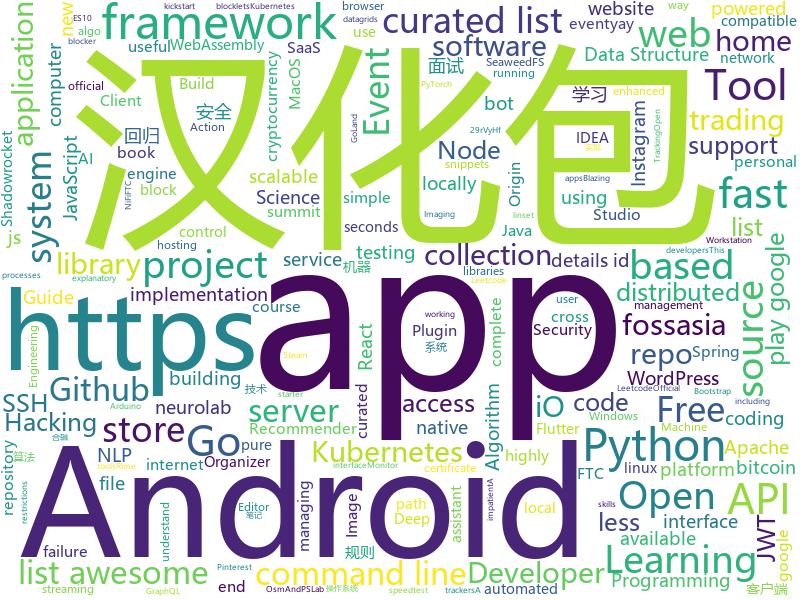

# 2019-09-16
See what the GitHub community is most excited about today.

## python
* [30-seconds-of-python](https://github.com/30-seconds/30-seconds-of-python)(**231 stars today**): A curated collection of useful Python snippets that you can understand in 30 seconds or less.
* [learn2learn](https://github.com/learnables/learn2learn)(**67 stars today**): PyTorch Meta-learning Framework for Researchers
* [mne-python](https://github.com/mne-tools/mne-python)(**19 stars today**): MNE : Magnetoencephalography (MEG) and Electroencephalography (EEG) in Python
* [home-assistant](https://github.com/home-assistant/home-assistant)(**41 stars today**): 🏡Open source home automation that puts local control and privacy first
* [pycparser](https://github.com/eliben/pycparser)(**6 stars today**): 🐍Complete C99 parser in pure Python
* [open-event-server](https://github.com/fossasia/open-event-server)(**35 stars today**): The Open Event Organizer Server to Manage Events https://api.eventyay.com | http://open-event-api.herokuapp.com
* [manim](https://github.com/3b1b/manim)(**26 stars today**): Animation engine for explanatory math videos
* [speedtest-cli](https://github.com/sivel/speedtest-cli)(**16 stars today**): Command line interface for testing internet bandwidth using speedtest.net
* [anki](https://github.com/dae/anki)(**9 stars today**): Anki for desktop computers
* [spaCy](https://github.com/explosion/spaCy)(**90 stars today**): 💫Industrial-strength Natural Language Processing (NLP) with Python and Cython
* [algo](https://github.com/wangzheng0822/algo)(**81 stars today**): 数据结构和算法必知必会的50个代码实现
* [pwntools](https://github.com/Gallopsled/pwntools)(**5 stars today**): CTF framework and exploit development library
* [Algorithm_Interview_Notes-Chinese](https://github.com/imhuay/Algorithm_Interview_Notes-Chinese)(**37 stars today**): 2018/2019/校招/春招/秋招/算法/机器学习(Machine Learning)/深度学习(Deep Learning)/自然语言处理(NLP)/C/C++/Python/面试笔记
* [Shadowrocket-ADBlock-Rules](https://github.com/h2y/Shadowrocket-ADBlock-Rules)(**17 stars today**): 提供多款 Shadowrocket 规则，带广告过滤功能。用于 iOS 未越狱设备选择性地自动翻墙。
* [fastapi](https://github.com/tiangolo/fastapi)(**66 stars today**): FastAPI framework, high performance, easy to learn, fast to code, ready for production
* [unlocker](https://github.com/DrDonk/unlocker)(**18 stars today**): VMware Workstation macOS
* [dirsearch](https://github.com/maurosoria/dirsearch)(**16 stars today**): Web path scanner
* [backtrader](https://github.com/backtrader/backtrader)(**7 stars today**): Python Backtesting library for trading strategies
* [C1GamesStarterKit](https://github.com/correlation-one/C1GamesStarterKit)(**2 stars today**): Starter kit for new players of Terminal. Contains starter-algo and a basic CLI for running/debugging algo's locally.
* [leetcode](https://github.com/qiyuangong/leetcode)(**7 stars today**): Python & JAVA Solutions for Leetcode
* [i3blocks-contrib](https://github.com/vivien/i3blocks-contrib)(**3 stars today**): Official repository for community contributed blocklets
* [elasticdl](https://github.com/sql-machine-learning/elasticdl)(**49 stars today**): Kubernetes-native Deep Learning Framework
* [InstaPy](https://github.com/timgrossmann/InstaPy)(**20 stars today**): 📷Instagram Bot - Tool for automated Instagram interactions
* [bitcoinbook](https://github.com/bitcoinbook/bitcoinbook)(**9 stars today**): Mastering Bitcoin 2nd Edition - Programming the Open Blockchain
* [fsociety](https://github.com/Manisso/fsociety)(**6 stars today**): fsociety Hacking Tools Pack – A Penetration Testing Framework

## java
* [phimpme-android](https://github.com/fossasia/phimpme-android)(**32 stars today**): Phimp.me Photo Imaging and Picture Editor https://play.google.com/store/apps/details?id=org.fossasia.phimpme
* [cassandra](https://github.com/apache/cassandra)(**5 stars today**): Mirror of Apache Cassandra
* [NetGuard](https://github.com/M66B/NetGuard)(**9 stars today**): A simple way to block access to the internet per application
* [amidst](https://github.com/toolbox4minecraft/amidst)(**3 stars today**): Advanced Minecraft Interface and Data/Structure Tracking
* [runelite](https://github.com/runelite/runelite)(**6 stars today**): Open source Old School RuneScape client
* [CS-Notes](https://github.com/CyC2018/CS-Notes)(**107 stars today**): 📚Tech Interview Guide 技术面试必备基础知识、Leetcode 题解、Java、C++、Python、后端面试、操作系统、计算机网络、系统设计
* [SkyStone](https://github.com/FIRST-Tech-Challenge/SkyStone)(**6 stars today**): FTC SDK
* [Anki-Android](https://github.com/ankidroid/Anki-Android)(**4 stars today**): AnkiDroid: Anki on Android
* [spring-security-react-ant-design-polls-app](https://github.com/callicoder/spring-security-react-ant-design-polls-app)(**4 stars today**): Full Stack Polls App built using Spring Boot, Spring Security, JWT, React, and Ant Design
* [Android-Image-Slider](https://github.com/smarteist/Android-Image-Slider)(**2 stars today**): Android Auto Image Slider
* [Hystrix](https://github.com/Netflix/Hystrix)(**10 stars today**): Hystrix is a latency and fault tolerance library designed to isolate points of access to remote systems, services and 3rd party libraries, stop cascading failure and enable resilience in complex distributed systems where failure is inevitable.
* [EdXposed](https://github.com/ElderDrivers/EdXposed)(**10 stars today**): Elder driver Xposed Framework.
* [NewPipe](https://github.com/TeamNewPipe/NewPipe)(**41 stars today**): A libre lightweight streaming front-end for Android.
* [android](https://github.com/nextcloud/android)(**5 stars today**): 📱Nextcloud Android app
* [ghidra](https://github.com/NationalSecurityAgency/ghidra)(**16 stars today**): Ghidra is a software reverse engineering (SRE) framework
* [open-event-organizer-android](https://github.com/fossasia/open-event-organizer-android)(**31 stars today**): Open Event Mobile App for Organizers and Entry Managers https://play.google.com/store/apps/details?id=com.eventyay.organizer
* [pipeline](https://github.com/PipelineAI/pipeline)(**18 stars today**): PipelineAI: Real-Time Enterprise AI Platform
* [susi_server](https://github.com/fossasia/susi_server)(**32 stars today**): SUSI.AI server backend - the Artificial Intelligence server for personal assistants https://api.susi.ai
* [nifi](https://github.com/apache/nifi)(**30 stars today**): Mirror of Apache NiFi
* [ftc_app](https://github.com/ftctechnh/ftc_app)(**0 stars today**): FTC Android Studio project to create FTC Robot Controller app.
* [Osmand](https://github.com/osmandapp/Osmand)(**7 stars today**): OsmAnd
* [pslab-android](https://github.com/fossasia/pslab-android)(**29 stars today**): PSLab Android App https://play.google.com/store/apps/details?id=io.pslab
* [megabasterd](https://github.com/tonikelope/megabasterd)(**8 stars today**): Yet another unofficial (and ugly) cross-platform MEGA downloader/uploader/streaming suite.
* [neurolab-android](https://github.com/fossasia/neurolab-android)(**28 stars today**): NeuroLab Android https://github.com/fossasia/neurolab-android/raw/apk/neurolab-dev-debug.apk
* [flutter_local_notifications](https://github.com/MaikuB/flutter_local_notifications)(**4 stars today**): A Flutter plugin for displaying local notifications on Android and iOS

## unknown
* [computer-science](https://github.com/ossu/computer-science)(**181 stars today**): 🎓Path to a free self-taught education in Computer Science!
* [Hacking-Security-Ebooks](https://github.com/yeahhub/Hacking-Security-Ebooks)(**336 stars today**): Top 100 Hacking & Security E-Books (Free Download) - Powered by Yeahhub.com
* [project-based-learning](https://github.com/tuvtran/project-based-learning)(**335 stars today**): Curated list of project-based tutorials
* [ECMAScript-new-features-list](https://github.com/daumann/ECMAScript-new-features-list)(**303 stars today**): A comprehensive list of new ES features, including ES2015 (ES6), ES2016 (ES7), ES2017 (ES8), ES2018 (ES9), ES2019 (ES10)
* [build-your-own-x](https://github.com/danistefanovic/build-your-own-x)(**230 stars today**): 🤓Build your own (insert technology here)
* [Python-programming-exercises](https://github.com/zhiwehu/Python-programming-exercises)(**36 stars today**): 100+ Python challenging programming exercises
* [Project-Based-Tutorials-in-C](https://github.com/rby90/Project-Based-Tutorials-in-C)(**58 stars today**): A curated list of project-based tutorials in C
* [Data-Science--Cheat-Sheet](https://github.com/abhat222/Data-Science--Cheat-Sheet)(**87 stars today**): Cheat Sheets
* [app-ideas](https://github.com/florinpop17/app-ideas)(**29 stars today**): A Collection of application ideas which can be used to improve your coding skills.
* [awesome-actions](https://github.com/sdras/awesome-actions)(**36 stars today**): A curated list of awesome actions to use on GitHub
* [developer-portfolios](https://github.com/emmawedekind/developer-portfolios)(**80 stars today**): A list of developer portfolios for your inspiration
* [the-art-of-command-line](https://github.com/jlevy/the-art-of-command-line)(**69 stars today**): Master the command line, in one page
* [node-vs-deno](https://github.com/egoist/node-vs-deno)(**48 stars today**): A Deno guide for Node.js developers
* [The-Open-Book](https://github.com/joeycastillo/The-Open-Book)(**39 stars today**): 
* [Awesome-Hacking-Tools](https://github.com/m4ll0k/Awesome-Hacking-Tools)(**9 stars today**): Awesome Hacking Tools
* [trackerslist](https://github.com/ngosang/trackerslist)(**67 stars today**): Updated list of public BitTorrent trackers
* [new-grads-2020](https://github.com/cmackenzie1/new-grads-2020)(**29 stars today**): A collection of new grad roles for 2020
* [awesome-recommender-systems](https://github.com/gaolinjie/awesome-recommender-systems)(**3 stars today**): A curated list of awesome resources about Recommender Systems.
* [1024app-android](https://github.com/yuuwill/1024app-android)(**2 stars today**): 草榴官方客户端，小草客户端，Android
* [Flutter-Course-Resources](https://github.com/londonappbrewery/Flutter-Course-Resources)(**4 stars today**): 
* [awesome-project-ideas](https://github.com/NirantK/awesome-project-ideas)(**1 stars today**): Curated list of Machine Learning, NLP, Vision, Recommender Systems Project Ideas
* [coding-interview-university](https://github.com/jwasham/coding-interview-university)(**73 stars today**): A complete computer science study plan to become a software engineer.
* [weekly](https://github.com/ruanyf/weekly)(**23 stars today**): 科技爱好者周刊，每周五发布
* [Scanners-Box](https://github.com/We5ter/Scanners-Box)(**13 stars today**): A powerful hacker toolkit collected more than 10 categories of open source scanners from Github - 安全行业从业者自研开源扫描器合辑
* [android_guides](https://github.com/codepath/android_guides)(**5 stars today**): Extensive Open-Source Guides for Android Developers

## javascript
* [girls-reptile](https://github.com/Licoy/girls-reptile)(**95 stars today**): 🎨Beautiful girl collector, support custom acquisition source, compatible with Windows and MacOS 奈斯！
* [hiring-without-whiteboards](https://github.com/poteto/hiring-without-whiteboards)(**26 stars today**): ⭐️Companies that don't have a broken hiring process
* [borderlands](https://github.com/rockdevourer/borderlands)(**22 stars today**): Interact with Shift
* [iptv](https://github.com/freearhey/iptv)(**18 stars today**): Collection of 8000+ publicly available IPTV channels from all over the world
* [website](https://github.com/CodingTrain/website)(**9 stars today**): Coding Train website
* [react-native](https://github.com/facebook/react-native)(**66 stars today**): A framework for building native apps with React.
* [google-unlocked](https://github.com/Ibit-to/google-unlocked)(**31 stars today**): Google Unlocked browser extension uncensor google search results
* [30-seconds-of-code](https://github.com/30-seconds/30-seconds-of-code)(**66 stars today**): A curated collection of useful JavaScript snippets that you can understand in 30 seconds or less.
* [react-table](https://github.com/tannerlinsley/react-table)(**149 stars today**): ⚛️Hooks for building fast and extendable tables and datagrids for React
* [rn-casts](https://github.com/StephenGrider/rn-casts)(**4 stars today**): Companion Repo for a React Native course on Udemy
* [svelte](https://github.com/sveltejs/svelte)(**64 stars today**): Cybernetically enhanced web apps
* [graphql-engine](https://github.com/hasura/graphql-engine)(**29 stars today**): Blazing fast, instant realtime GraphQL APIs on Postgres with fine grained access control, also trigger webhooks on database events.
* [awesome-selfhosted](https://github.com/Kickball/awesome-selfhosted)(**55 stars today**): This is a list of Free Software network services and web applications which can be hosted locally. Selfhosting is the process of locally hosting and managing applications instead of renting from SaaS providers.
* [wp-calypso](https://github.com/Automattic/wp-calypso)(**5 stars today**): The JavaScript and API powered WordPress.com
* [DataTypes](https://github.com/HowProgrammingWorks/DataTypes)(**5 stars today**): Built-in data types
* [Rules](https://github.com/lhie1/Rules)(**13 stars today**): Rules / 规则：Surge / Shadowrocket / Quantumult
* [gekko](https://github.com/askmike/gekko)(**10 stars today**): A bitcoin trading bot written in node - https://gekko.wizb.it/
* [ccxt](https://github.com/ccxt/ccxt)(**18 stars today**): A JavaScript / Python / PHP cryptocurrency trading API with support for more than 120 bitcoin/altcoin exchanges
* [uBlock](https://github.com/gorhill/uBlock)(**19 stars today**): uBlock Origin - An efficient blocker for Chromium and Firefox. Fast and lean.
* [homebridge](https://github.com/nfarina/homebridge)(**13 stars today**): HomeKit support for the impatient
* [image-actions](https://github.com/calibreapp/image-actions)(**36 stars today**): A Github Action that will automatically compress images with mozjpeg
* [gatsby](https://github.com/gatsbyjs/gatsby)(**50 stars today**): Build blazing fast, modern apps and websites with React
* [mapbox-gl-js](https://github.com/mapbox/mapbox-gl-js)(**2 stars today**): Interactive, thoroughly customizable maps in the browser, powered by vector tiles and WebGL
* [grokking_algorithms](https://github.com/egonSchiele/grokking_algorithms)(**12 stars today**): Code for the book Grokking Algorithms (https://amzn.to/29rVyHf)
* [gutenberg](https://github.com/WordPress/gutenberg)(**13 stars today**): The Block Editor project for WordPress and beyond. Plugin is available from the official repository.

## html
* [stisla](https://github.com/stisla/stisla)(**15 stars today**): Free Bootstrap Admin Template
* [web-moderno](https://github.com/cod3rcursos/web-moderno)(**5 stars today**): 
* [zfaka](https://github.com/zlkbdotnet/zfaka)(**12 stars today**): 免费、安全、稳定、高效的发卡系统，值得拥有!
* [JavaScript30](https://github.com/wesbos/JavaScript30)(**8 stars today**): 30 Day Vanilla JS Challenge
* [datasciencecoursera](https://github.com/mGalarnyk/datasciencecoursera)(**3 stars today**): Data Science Repo and blog for John Hopkins Coursera Courses. Please let me know if you have any questions.
* [TranslatorX](https://github.com/pingfangx/TranslatorX)(**43 stars today**): JetBrains 系列软件汉化包 关键字: Android Studio 3.5 汉化包 CLion 2019.2 汉化包 DataGrip 2019.2 汉化包 GoLand 2019.2 汉化包 IntelliJ IDEA 2019.2 汉化包 PhpStorm 2019.2 汉化包 PyCharm 2019.2 汉化包 Rider 2019.2 汉化包 RubyMine 2019.2 汉化包 WebStorm 2019.2 汉化包
* [Machine-Learning](https://github.com/Jack-Cherish/Machine-Learning)(**9 stars today**): ⚡️机器学习实战（Python3）：kNN、决策树、贝叶斯、逻辑回归、SVM、线性回归、树回归
* [shellphish](https://github.com/thelinuxchoice/shellphish)(**8 stars today**): Phishing Tool for 18 social media: Instagram, Facebook, Snapchat, Github, Twitter, Yahoo, Protonmail, Spotify, Netflix, Linkedin, Wordpress, Origin, Steam, Microsoft, InstaFollowers, Gitlab, Pinterest
* [blog](https://github.com/biaochenxuying/blog)(**6 stars today**): 技术为主，读书笔记、随笔、理财为辅，做个终身学习者。
* [summit.fossasia.org](https://github.com/fossasia/summit.fossasia.org)(**32 stars today**): FOSSASIA Summit 2020 https://summit.fossasia.org
* [free-for-dev](https://github.com/ripienaar/free-for-dev)(**10 stars today**): A list of SaaS, PaaS and IaaS offerings that have free tiers of interest to devops and infradev
* [ionicons](https://github.com/ionic-team/ionicons)(**7 stars today**): The premium icon font for Ionic Framework and web apps everywhere
* [learning-area](https://github.com/mdn/learning-area)(**7 stars today**): Github repo for the MDN Learning Area.
* [fluxion](https://github.com/FluxionNetwork/fluxion)(**2 stars today**): Fluxion is a remake of linset by vk496 with less bugs and enhanced functionality.
* [KubeInvaders](https://github.com/lucky-sideburn/KubeInvaders)(**29 stars today**): Chaos Engineering Tool for Kubernetes and Openshift
* [quickstart-js](https://github.com/firebase/quickstart-js)(**5 stars today**): Firebase Quickstart Samples for Web
* [zenbot](https://github.com/DeviaVir/zenbot)(**0 stars today**): Zenbot is a command-line cryptocurrency trading bot using Node.js and MongoDB.
* [personal-website](https://github.com/github/personal-website)(**3 stars today**): Code that'll help you kickstart a personal website that showcases your work as a software developer.
* [home-assistant.io](https://github.com/home-assistant/home-assistant.io)(**2 stars today**): 📘Home Assistant User documentation
* [computer-science-flash-cards](https://github.com/jwasham/computer-science-flash-cards)(**7 stars today**): Mini website for testing both general CS knowledge and enforce coding practice and common algorithm/data structure memorization.
* [tools](https://github.com/googlecodelabs/tools)(**3 stars today**): Codelabs management & hosting tools
* [home](https://github.com/rime/home)(**2 stars today**): Rime::Home is home to Rime users and developers
* [Spoon-Knife](https://github.com/octocat/Spoon-Knife)(**0 stars today**): This repo is for demonstration purposes only.
* [awesome-competitive-programming](https://github.com/lnishan/awesome-competitive-programming)(**10 stars today**): 💎A curated list of awesome Competitive Programming, Algorithm and Data Structure resources
* [webdevbootcamp](https://github.com/nax3t/webdevbootcamp)(**10 stars today**): All source code for back-end projects from the Web Developer Bootcamp

## go
* [cadence](https://github.com/uber/cadence)(**82 stars today**): Cadence is a distributed, scalable, durable, and highly available orchestration engine to execute asynchronous long-running business logic in a scalable and resilient way.
* [v2ray-core](https://github.com/v2ray/v2ray-core)(**36 stars today**): A platform for building proxies to bypass network restrictions.
* [clash](https://github.com/Dreamacro/clash)(**18 stars today**): A rule-based tunnel in Go.
* [quic-go](https://github.com/lucas-clemente/quic-go)(**31 stars today**): A QUIC implementation in pure go
* [goquery](https://github.com/PuerkitoBio/goquery)(**11 stars today**): A little like that j-thing, only in Go.
* [cli](https://github.com/smallstep/cli)(**36 stars today**): 🧰 A zero trust swiss army knife for working with X509, OAuth, JWT, OATH OTP, etc.
* [certificates](https://github.com/smallstep/certificates)(**35 stars today**): 🛡️A private certificate authority (X.509 & SSH) and related tools for secure automated certificate management, so you can use TLS everywhere & SSO for SSH.
* [seaweedfs](https://github.com/chrislusf/seaweedfs)(**5 stars today**): SeaweedFS is a simple and highly scalable distributed file system. There are two objectives: to store billions of files! to serve the files fast! SeaweedFS implements an object store with O(1) disk seek and an optional Filer with POSIX interface, supporting S3 API, Rack-Aware Erasure Coding for warm storage, FUSE mount, Hadoop compatible, WebDAV.
* [caddy](https://github.com/caddyserver/caddy)(**40 stars today**): Fast, cross-platform HTTP/2 web server with automatic HTTPS
* [tinygo](https://github.com/tinygo-org/tinygo)(**12 stars today**): Go compiler for small places. Microcontrollers, WebAssembly, and command-line tools. Based on LLVM.
* [aquatone](https://github.com/michenriksen/aquatone)(**15 stars today**): A Tool for Domain Flyovers
* [client](https://github.com/keybase/client)(**96 stars today**): Keybase Go Library, Client, Service, OS X, iOS, Android, Electron
* [go-flutter](https://github.com/go-flutter-desktop/go-flutter)(**8 stars today**): Flutter on Windows, MacOS and Linux - based on Flutter Embedding, Go and GLFW.
* [awesome-go](https://github.com/avelino/awesome-go)(**40 stars today**): A curated list of awesome Go frameworks, libraries and software
* [xray](https://github.com/chaitin/xray)(**22 stars today**): xray 安全评估工具
* [go-ethereum](https://github.com/ethereum/go-ethereum)(**13 stars today**): Official Go implementation of the Ethereum protocol
* [app](https://github.com/maxence-charriere/app)(**35 stars today**): A WebAssembly framework to build GUI with Go, HTML and CSS.
* [arduino-cli](https://github.com/arduino/arduino-cli)(**8 stars today**): Arduino command line interface
* [pspy](https://github.com/DominicBreuker/pspy)(**8 stars today**): Monitor linux processes without root permissions
* [jwt-go](https://github.com/dgrijalva/jwt-go)(**16 stars today**): Golang implementation of JSON Web Tokens (JWT)
* [helm](https://github.com/helm/helm)(**28 stars today**): The Kubernetes Package Manager
* [kit](https://github.com/go-kit/kit)(**14 stars today**): A standard library for microservices.
* [flink-on-k8s-operator](https://github.com/GoogleCloudPlatform/flink-on-k8s-operator)(**32 stars today**): Kubernetes operator for managing the lifecycle of Apache Flink applications.
* [ssh-chat](https://github.com/shazow/ssh-chat)(**12 stars today**): Chat over SSH.
* [rio](https://github.com/rancher/rio)(**12 stars today**): Kubernetes based MicroPaaS

## WordCloud

