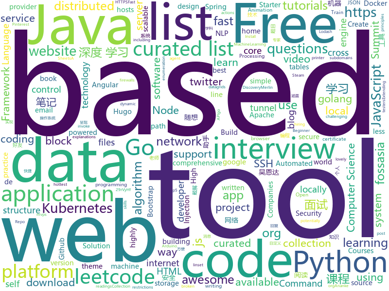

# 2019-09-17
See what the GitHub community is most excited about today.

## python
* [d2l-zh](https://github.com/d2l-ai/d2l-zh)(**216 stars today**): 《动手学深度学习》：面向中文读者、能运行、可讨论。英文版即伯克利“深度学习导论”教材。
* [mne-python](https://github.com/mne-tools/mne-python)(**29 stars today**): MNE : Magnetoencephalography (MEG) and Electroencephalography (EEG) in Python
* [home-assistant](https://github.com/home-assistant/home-assistant)(**36 stars today**): 🏡Open source home automation that puts local control and privacy first
* [30-seconds-of-python](https://github.com/30-seconds/30-seconds-of-python)(**252 stars today**): A curated collection of useful Python snippets that you can understand in 30 seconds or less.
* [DeepPrivacy](https://github.com/hukkelas/DeepPrivacy)(**91 stars today**): DeepPrivacy: A Generative Adversarial Network for Face Anonymization
* [NeMo](https://github.com/NVIDIA/NeMo)(**243 stars today**): Neural Modules: a toolkit for conversational AI
* [ctrl](https://github.com/salesforce/ctrl)(**121 stars today**): Conditional Transformer Language Model for Controllable Generation
* [spaCy](https://github.com/explosion/spaCy)(**19 stars today**): 💫Industrial-strength Natural Language Processing (NLP) with Python and Cython
* [mlcourse.ai](https://github.com/Yorko/mlcourse.ai)(**18 stars today**): Open Machine Learning Course
* [interview_internal_reference](https://github.com/0voice/interview_internal_reference)(**39 stars today**): 2019年最新总结，阿里，腾讯，百度，美团，头条等技术面试题目，以及答案，专家出题人分析汇总。
* [Sublist3r](https://github.com/aboul3la/Sublist3r)(**4 stars today**): Fast subdomains enumeration tool for penetration testers
* [hosts](https://github.com/StevenBlack/hosts)(**25 stars today**): Extending and consolidating hosts files from several well-curated sources like adaway.org, mvps.org, malwaredomainlist.com, someonewhocares.org, and potentially others. You can optionally invoke extensions to block additional sites by category.
* [hacs](https://github.com/custom-components/hacs)(**2 stars today**): Manage (Install, track, upgrade) and discover custom elements for Home Assistant.
* [machine_learning_examples](https://github.com/lazyprogrammer/machine_learning_examples)(**3 stars today**): A collection of machine learning examples and tutorials.
* [algo](https://github.com/wangzheng0822/algo)(**46 stars today**): 数据结构和算法必知必会的50个代码实现
* [EverydayWechat](https://github.com/sfyc23/EverydayWechat)(**29 stars today**): 微信助手：1.每日定时给好友发送定制消息。2.机器人自动回复好友。3.群助手功能（例如：查询垃圾分类、天气、日历、电影实时票房、快递物流等）
* [manim](https://github.com/3b1b/manim)(**22 stars today**): Animation engine for explanatory math videos
* [docker-pi-hole](https://github.com/pi-hole/docker-pi-hole)(**8 stars today**): Pi-hole in a docker container
* [TensorFlow-Course](https://github.com/machinelearningmindset/TensorFlow-Course)(**24 stars today**): Simple and ready-to-use tutorials for TensorFlow
* [AiLearning](https://github.com/apachecn/AiLearning)(**46 stars today**): AiLearning: 机器学习 - MachineLearning - ML、深度学习 - DeepLearning - DL、自然语言处理 NLP
* [zhao](https://github.com/programthink/zhao)(**2 stars today**): 【编程随想】整理的《太子党关系网络》，专门揭露赵国的权贵
* [dirsearch](https://github.com/maurosoria/dirsearch)(**9 stars today**): Web path scanner
* [youtube-dl](https://github.com/ytdl-org/youtube-dl)(**50 stars today**): Command-line program to download videos from YouTube.com and other video sites
* [learn2learn](https://github.com/learnables/learn2learn)(**76 stars today**): PyTorch Meta-learning Framework for Researchers
* [autokeras](https://github.com/keras-team/autokeras)(**6 stars today**): Accessible AutoML for deep learning.

## java
* [TubeMQ](https://github.com/Tencent/TubeMQ)(**142 stars today**): TubeMQ focuses on high-performance storage and transmission of massive data in large data scenarios
* [CS-Notes](https://github.com/CyC2018/CS-Notes)(**121 stars today**): 📚Tech Interview Guide 技术面试必备基础知识、Leetcode 题解、Java、C++、Python、后端面试、操作系统、计算机网络、系统设计
* [LeetCodeAnimation](https://github.com/MisterBooo/LeetCodeAnimation)(**104 stars today**): Demonstrate all the questions on LeetCode in the form of animation.（用动画的形式呈现解LeetCode题目的思路）
* [JavaGuide](https://github.com/Snailclimb/JavaGuide)(**123 stars today**): 【Java学习+面试指南】 一份涵盖大部分Java程序员所需要掌握的核心知识。
* [nifi](https://github.com/apache/nifi)(**4 stars today**): Mirror of Apache NiFi
* [system-design](https://github.com/FreemanZhang/system-design)(**34 stars today**): Preparing for system design interview questions
* [SkyStone](https://github.com/FIRST-Tech-Challenge/SkyStone)(**7 stars today**): FTC SDK
* [baritone](https://github.com/cabaletta/baritone)(**2 stars today**): google maps for block game
* [quarkus](https://github.com/quarkusio/quarkus)(**8 stars today**): Quarkus: Supersonic Subatomic Java.
* [NetGuard](https://github.com/M66B/NetGuard)(**17 stars today**): A simple way to block access to the internet per application
* [vhr](https://github.com/lenve/vhr)(**26 stars today**): 微人事是一个前后端分离的人力资源管理系统，项目采用SpringBoot+Vue开发。
* [android](https://github.com/nextcloud/android)(**3 stars today**): 📱Nextcloud Android app
* [phimpme-android](https://github.com/fossasia/phimpme-android)(**22 stars today**): Phimp.me Photo Imaging and Picture Editor https://play.google.com/store/apps/details?id=org.fossasia.phimpme
* [spring-security-react-ant-design-polls-app](https://github.com/callicoder/spring-security-react-ant-design-polls-app)(**8 stars today**): Full Stack Polls App built using Spring Boot, Spring Security, JWT, React, and Ant Design
* [Anime4K](https://github.com/bloc97/Anime4K)(**25 stars today**): A High-Quality Real Time Upscaler for Anime Video
* [EdXposed](https://github.com/ElderDrivers/EdXposed)(**8 stars today**): Elder driver Xposed Framework.
* [holer](https://github.com/wisdom-projects/holer)(**8 stars today**): Holer exposes local servers behind NATs and firewalls to the public internet over secure tunnels.
* [JCSprout](https://github.com/crossoverJie/JCSprout)(**21 stars today**): 👨‍🎓Java Core Sprout : basic, concurrent, algorithm
* [lucene-solr](https://github.com/apache/lucene-solr)(**6 stars today**): Mirror of Apache Lucene + Solr
* [MyBookshelf](https://github.com/gedoor/MyBookshelf)(**8 stars today**): 阅读是一款可以自定义来源阅读网络内容的工具，为广大网络文学爱好者提供一种方便、快捷舒适的试读体验。
* [Java](https://github.com/DuGuQiuBai/Java)(**5 stars today**): 27天成为Java大神
* [Interview-Questions](https://github.com/rishabh115/Interview-Questions)(**7 stars today**): Most comprehensive list📋of interview questions📘of companies scraped from Geeksforgeeks, CareerCup and Glassdoor.
* [xDrip](https://github.com/NightscoutFoundation/xDrip)(**0 stars today**): Nightscout version of xDrip+
* [interview](https://github.com/mission-peace/interview)(**6 stars today**): Interview questions
* [android-play-location](https://github.com/googlesamples/android-play-location)(**2 stars today**): 

## unknown
* [Active-Directory-Pentest-Notes](https://github.com/uknowsec/Active-Directory-Pentest-Notes)(**109 stars today**): 个人域渗透学习笔记
* [build-your-own-x](https://github.com/danistefanovic/build-your-own-x)(**280 stars today**): 🤓Build your own (insert technology here)
* [Hacking-Security-Ebooks](https://github.com/yeahhub/Hacking-Security-Ebooks)(**452 stars today**): Top 100 Hacking & Security E-Books (Free Download) - Powered by Yeahhub.com
* [Data-Science--Cheat-Sheet](https://github.com/abhat222/Data-Science--Cheat-Sheet)(**95 stars today**): Cheat Sheets
* [ECMAScript-new-features-list](https://github.com/daumann/ECMAScript-new-features-list)(**439 stars today**): A comprehensive list of new ES features, including ES2015 (ES6), ES2016 (ES7), ES2017 (ES8), ES2018 (ES9), ES2019 (ES10)
* [hosts](https://github.com/googlehosts/hosts)(**30 stars today**): 镜像：https://coding.net/u/scaffrey/p/hosts/git
* [developer-portfolios](https://github.com/emmawedekind/developer-portfolios)(**73 stars today**): A list of developer portfolios for your inspiration
* [kubernetes-the-hard-way](https://github.com/kelseyhightower/kubernetes-the-hard-way)(**78 stars today**): Bootstrap Kubernetes the hard way on Google Cloud Platform. No scripts.
* [books](https://github.com/programthink/books)(**9 stars today**): 【编程随想】收藏的电子书清单（多个学科，含下载链接）
* [project-based-learning](https://github.com/tuvtran/project-based-learning)(**185 stars today**): Curated list of project-based tutorials
* [computer-science](https://github.com/ossu/computer-science)(**240 stars today**): 🎓Path to a free self-taught education in Computer Science!
* [Python-programming-exercises](https://github.com/zhiwehu/Python-programming-exercises)(**92 stars today**): 100+ Python challenging programming exercises
* [KnowledgeGraphCourse](https://github.com/npubird/KnowledgeGraphCourse)(**23 stars today**): 东南大学《知识图谱》研究生课程
* [awesome-actions](https://github.com/sdras/awesome-actions)(**43 stars today**): A curated list of awesome actions to use on GitHub
* [app-ideas](https://github.com/florinpop17/app-ideas)(**175 stars today**): A Collection of application ideas which can be used to improve your coding skills.
* [the-art-of-command-line](https://github.com/jlevy/the-art-of-command-line)(**190 stars today**): Master the command line, in one page
* [Project-Based-Tutorials-in-C](https://github.com/rby90/Project-Based-Tutorials-in-C)(**60 stars today**): A curated list of project-based tutorials in C
* [Awesome](https://github.com/Awesome-Windows/Awesome)(**11 stars today**): 💻An awesome & curated list of best applications and tools for Windows.
* [awesome-algorithms](https://github.com/tayllan/awesome-algorithms)(**6 stars today**): A curated list of awesome places to learn and/or practice algorithms.
* [system-design-interview](https://github.com/checkcheckzz/system-design-interview)(**16 stars today**): System design interview for IT companies
* [awesome-interview-questions](https://github.com/MaximAbramchuck/awesome-interview-questions)(**20 stars today**): A curated awesome list of lists of interview questions. Feel free to contribute!🎓
* [binance-official-api-docs](https://github.com/binance-exchange/binance-official-api-docs)(**2 stars today**): Official Documentation for the Binance APIs and Streams
* [coding-interview-university](https://github.com/jwasham/coding-interview-university)(**75 stars today**): A complete computer science study plan to become a software engineer.
* [ganhacks](https://github.com/soumith/ganhacks)(**8 stars today**): starter from "How to Train a GAN?" at NIPS2016
* [Beginner-Network-Pentesting](https://github.com/hmaverickadams/Beginner-Network-Pentesting)(**4 stars today**): Notes for Beginner Network Pentesting Course

## javascript
* [bustag](https://github.com/gxtrobot/bustag)(**353 stars today**): a tag and recommend system for old bus driver
* [leetcode](https://github.com/azl397985856/leetcode)(**168 stars today**): LeetCode Solutions: A Record of My Problem Solving Journey.( leetcode题解，记录自己的leetcode解题之路。)
* [hiring-without-whiteboards](https://github.com/poteto/hiring-without-whiteboards)(**142 stars today**): ⭐️Companies that don't have a broken hiring process
* [gatsby](https://github.com/gatsbyjs/gatsby)(**40 stars today**): Build blazing fast, modern apps and websites with React
* [website](https://github.com/CodingTrain/website)(**12 stars today**): Coding Train website
* [immer](https://github.com/immerjs/immer)(**66 stars today**): Create the next immutable state by mutating the current one
* [borderlands](https://github.com/rockdevourer/borderlands)(**42 stars today**): Interact with Shift
* [DataTypes](https://github.com/HowProgrammingWorks/DataTypes)(**6 stars today**): Built-in data types
* [javascript-algorithms](https://github.com/trekhleb/javascript-algorithms)(**41 stars today**): 📝Algorithms and data structures implemented in JavaScript with explanations and links to further readings
* [iptv](https://github.com/freearhey/iptv)(**54 stars today**): Collection of 8000+ publicly available IPTV channels from all over the world
* [33-js-concepts](https://github.com/stephentian/33-js-concepts)(**7 stars today**): 📜每个 JavaScript 工程师都应懂的33个概念 @leonardomso
* [lighthousebot](https://github.com/GoogleChromeLabs/lighthousebot)(**11 stars today**): Run Lighthouse in CI, as a web service, using Docker. Pass/Fail GH pull requests.
* [DPlayer](https://github.com/MoePlayer/DPlayer)(**5 stars today**): 🍭Wow, such a lovely HTML5 danmaku video player
* [Functional-Light-JS](https://github.com/getify/Functional-Light-JS)(**7 stars today**): Pragmatic, balanced FP in JavaScript. @FLJSBook on twitter.
* [eui](https://github.com/elastic/eui)(**7 stars today**): Elastic UI Framework🙌
* [discord.js](https://github.com/discordjs/discord.js)(**4 stars today**): A powerful JavaScript library for interacting with the Discord API
* [grokking_algorithms](https://github.com/egonSchiele/grokking_algorithms)(**12 stars today**): Code for the book Grokking Algorithms (https://amzn.to/29rVyHf)
* [jsonbox](https://github.com/vasanthv/jsonbox)(**52 stars today**): A Free HTTP based JSON storage.
* [p5.js](https://github.com/processing/p5.js)(**9 stars today**): p5.js is a client-side JS platform that empowers artists, designers, students, and anyone to learn to code and express themselves creatively on the web. It is based on the core principles of Processing. http://twitter.com/p5xjs —
* [clean-code-javascript](https://github.com/ryanmcdermott/clean-code-javascript)(**15 stars today**): 🛁Clean Code concepts adapted for JavaScript
* [awesome-selfhosted](https://github.com/Kickball/awesome-selfhosted)(**34 stars today**): This is a list of Free Software network services and web applications which can be hosted locally. Selfhosting is the process of locally hosting and managing applications instead of renting from SaaS providers.
* [lowdb](https://github.com/typicode/lowdb)(**11 stars today**): ⚡️lowdb is a small local JSON database powered by Lodash (supports Node, Electron and the browser)
* [webui-aria2](https://github.com/ziahamza/webui-aria2)(**6 stars today**): The aim for this project is to create the worlds best and hottest interface to interact with aria2. Very simple to use, just download and open index.html in any web browser.
* [react-table](https://github.com/tannerlinsley/react-table)(**50 stars today**): ⚛️Hooks for building fast and extendable tables and datagrids for React

## html
* [KubeInvaders](https://github.com/lucky-sideburn/KubeInvaders)(**9 stars today**): Chaos Engineering Tool for Kubernetes and Openshift
* [deeplearning_ai_books](https://github.com/fengdu78/deeplearning_ai_books)(**20 stars today**): deeplearning.ai（吴恩达老师的深度学习课程笔记及资源）
* [blog_os](https://github.com/phil-opp/blog_os)(**4 stars today**): Writing an OS in Rust
* [shellphish](https://github.com/thelinuxchoice/shellphish)(**1 stars today**): Phishing Tool for 18 social media: Instagram, Facebook, Snapchat, Github, Twitter, Yahoo, Protonmail, Spotify, Netflix, Linkedin, Wordpress, Origin, Steam, Microsoft, InstaFollowers, Gitlab, Pinterest
* [hugo-academic](https://github.com/gcushen/hugo-academic)(**2 stars today**): 📝The website builder for Hugo. Build and deploy a beautiful website in minutes!
* [computer-science-flash-cards](https://github.com/jwasham/computer-science-flash-cards)(**3 stars today**): Mini website for testing both general CS knowledge and enforce coding practice and common algorithm/data structure memorization.
* [python](https://github.com/Show-Me-the-Code/python)(**4 stars today**): Show Me the Code Python version.
* [learnyounode](https://github.com/workshopper/learnyounode)(**3 stars today**): Learn You The Node.js For Much Win! An intro to Node.js via a set of self-guided workshops.
* [datasciencecoursera](https://github.com/mGalarnyk/datasciencecoursera)(**1 stars today**): Data Science Repo and blog for John Hopkins Coursera Courses. Please let me know if you have any questions.
* [caniemail](https://github.com/hteumeuleu/caniemail)(**17 stars today**): Can I email… Support tables for HTML and CSS in emails.
* [summit.fossasia.org](https://github.com/fossasia/summit.fossasia.org)(**8 stars today**): FOSSASIA Summit 2020 https://summit.fossasia.org
* [simple-icons](https://github.com/simple-icons/simple-icons)(**4 stars today**): SVG icons for popular brands
* [Commodity-Injection-Signatures](https://github.com/xsscx/Commodity-Injection-Signatures)(**7 stars today**): Commodity Injection Signatures, Malicious Inputs, XSS, HTTP Header Injection, XXE, RCE, Javascript, XSLT
* [2020.fossasia.org](https://github.com/fossasia/2020.fossasia.org)(**10 stars today**): FOSSASIA Summit 2020 Singapore https://2020.fossasia.org
* [gohugo-theme-ananke](https://github.com/budparr/gohugo-theme-ananke)(**0 stars today**): Ananke: A theme for Hugo Sites
* [flexboxgrid](https://github.com/kristoferjoseph/flexboxgrid)(**4 stars today**): Grid based on CSS3 flexbox
* [REKCARC-TSC-UHT](https://github.com/PKUanonym/REKCARC-TSC-UHT)(**28 stars today**): 清华大学计算机系课程攻略 Guidance for courses in Department of Computer Science and Technology, Tsinghua University
* [Coursera-ML-AndrewNg-Notes](https://github.com/fengdu78/Coursera-ML-AndrewNg-Notes)(**26 stars today**): 吴恩达老师的机器学习课程个人笔记
* [hyperblog](https://github.com/freddier/hyperblog)(**1 stars today**): Un blog increíble para el curso de Git y Github de Platzi
* [coreui-free-angular-admin-template](https://github.com/coreui/coreui-free-angular-admin-template)(**1 stars today**): CoreUI Angular is free Angular 2+ admin template based on Bootstrap 4
* [zfaka](https://github.com/zlkbdotnet/zfaka)(**10 stars today**): 免费、安全、稳定、高效的发卡系统，值得拥有!
* [Repetier-Firmware](https://github.com/repetier/Repetier-Firmware)(**1 stars today**): Firmware for Arduino based RepRap 3D printer.
* [fluxion](https://github.com/FluxionNetwork/fluxion)(**0 stars today**): Fluxion is a remake of linset by vk496 with less bugs and enhanced functionality.
* [startbootstrap-resume](https://github.com/BlackrockDigital/startbootstrap-resume)(**4 stars today**): A Bootstrap 4 resume/CV theme created by Start Bootstrap
* [personal-website](https://github.com/github/personal-website)(**4 stars today**): Code that'll help you kickstart a personal website that showcases your work as a software developer.

## go
* [clash](https://github.com/Dreamacro/clash)(**80 stars today**): A rule-based tunnel in Go.
* [v2ray-core](https://github.com/v2ray/v2ray-core)(**78 stars today**): A platform for building proxies to bypass network restrictions.
* [rio](https://github.com/rancher/rio)(**8 stars today**): Kubernetes based MicroPaaS
* [kubeval](https://github.com/instrumenta/kubeval)(**10 stars today**): Validate your Kubernetes configuration files, supports multiple Kubernetes versions
* [aquatone](https://github.com/michenriksen/aquatone)(**20 stars today**): A Tool for Domain Flyovers
* [reviewdog](https://github.com/reviewdog/reviewdog)(**6 stars today**): 🐶Automated code review tool integrated with any code analysis tools regardless of programming language
* [xray](https://github.com/chaitin/xray)(**34 stars today**): xray 安全评估工具
* [ssh-chat](https://github.com/shazow/ssh-chat)(**10 stars today**): Chat over SSH.
* [cadence](https://github.com/uber/cadence)(**140 stars today**): Cadence is a distributed, scalable, durable, and highly available orchestration engine to execute asynchronous long-running business logic in a scalable and resilient way.
* [color](https://github.com/fatih/color)(**2 stars today**): Color package for Go (golang)
* [telegram-bot-api](https://github.com/go-telegram-bot-api/telegram-bot-api)(**2 stars today**): Golang bindings for the Telegram Bot API
* [shadowsocks-go](https://github.com/shadowsocks/shadowsocks-go)(**3 stars today**): go port of shadowsocks (Deprecated)
* [terraform-provider-dominos](https://github.com/ndmckinley/terraform-provider-dominos)(**47 stars today**): The Terraform plugin for the Dominos Pizza provider.
* [certificates](https://github.com/smallstep/certificates)(**31 stars today**): 🛡️A private certificate authority (X.509 & SSH) and related tools for secure automated certificate management, so you can use TLS everywhere & SSO for SSH.
* [service](https://github.com/ardanlabs/service)(**1 stars today**): Starter code for writing web services in Go
* [beats](https://github.com/elastic/beats)(**9 stars today**): 🐠Beats - Lightweight shippers for Elasticsearch & Logstash
* [nes](https://github.com/fogleman/nes)(**10 stars today**): NES emulator written in Go.
* [996.Blockchain](https://github.com/996BC/996.Blockchain)(**26 stars today**): Blockchain for the 996 evidence
* [go-ethereum](https://github.com/ethereum/go-ethereum)(**9 stars today**): Official Go implementation of the Ethereum protocol
* [consul](https://github.com/hashicorp/consul)(**15 stars today**): Consul is a distributed, highly available, and data center aware solution to connect and configure applications across dynamic, distributed infrastructure.
* [wails](https://github.com/wailsapp/wails)(**9 stars today**): Create desktop apps using Go and Web Technologies
* [Amass](https://github.com/OWASP/Amass)(**14 stars today**): In-depth Attack Surface Mapping and Asset Discovery
* [merlin](https://github.com/Ne0nd0g/merlin)(**1 stars today**): Merlin is a cross-platform post-exploitation HTTP/2 Command & Control server and agent written in golang.
* [caddy](https://github.com/caddyserver/caddy)(**13 stars today**): Fast, cross-platform HTTP/2 web server with automatic HTTPS
* [dgraph](https://github.com/dgraph-io/dgraph)(**19 stars today**): Fast, Distributed Graph DB

## WordCloud

