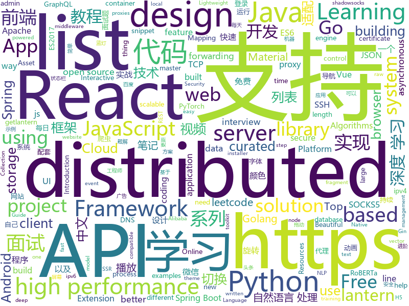

# 2019-09-18
See what the GitHub community is most excited about today.

## python
* [d2l-zh](https://github.com/d2l-ai/d2l-zh)(**508 stars today**): 《动手学深度学习》：面向中文读者、能运行、可讨论。英文版即伯克利“深度学习导论”教材。
* [NeMo](https://github.com/NVIDIA/NeMo)(**130 stars today**): Neural Modules: a toolkit for conversational AI
* [Deep-Reinforcement-Learning-Algorithms-with-PyTorch](https://github.com/p-christ/Deep-Reinforcement-Learning-Algorithms-with-PyTorch)(**108 stars today**): PyTorch implementations of deep reinforcement learning algorithms and environments
* [public-apis](https://github.com/public-apis/public-apis)(**243 stars today**): A collective list of free APIs for use in software and web development.
* [30-seconds-of-python](https://github.com/30-seconds/30-seconds-of-python)(**388 stars today**): A curated collection of useful Python snippets that you can understand in 30 seconds or less.
* [learn2learn](https://github.com/learnables/learn2learn)(**73 stars today**): PyTorch Meta-learning Framework for Researchers
* [system-design-primer](https://github.com/donnemartin/system-design-primer)(**131 stars today**): Learn how to design large-scale systems. Prep for the system design interview. Includes Anki flashcards.
* [interview_internal_reference](https://github.com/0voice/interview_internal_reference)(**60 stars today**): 2019年最新总结，阿里，腾讯，百度，美团，头条等技术面试题目，以及答案，专家出题人分析汇总。
* [roberta_zh](https://github.com/brightmart/roberta_zh)(**22 stars today**): RoBERTa中文预训练模型: RoBERTa for Chinese
* [mne-python](https://github.com/mne-tools/mne-python)(**37 stars today**): MNE : Magnetoencephalography (MEG) and Electroencephalography (EEG) in Python
* [AiLearning](https://github.com/apachecn/AiLearning)(**57 stars today**): AiLearning: 机器学习 - MachineLearning - ML、深度学习 - DeepLearning - DL、自然语言处理 NLP
* [mypy](https://github.com/python/mypy)(**20 stars today**): Optional static typing for Python 3 and 2 (PEP 484)
* [saleor](https://github.com/mirumee/saleor)(**18 stars today**): A modular, high performance e-commerce storefront built with Python, GraphQL, Django, and ReactJS.
* [Algorithm_Interview_Notes-Chinese](https://github.com/imhuay/Algorithm_Interview_Notes-Chinese)(**32 stars today**): 2018/2019/校招/春招/秋招/算法/机器学习(Machine Learning)/深度学习(Deep Learning)/自然语言处理(NLP)/C/C++/Python/面试笔记
* [mmdetection](https://github.com/open-mmlab/mmdetection)(**20 stars today**): Open MMLab Detection Toolbox and Benchmark
* [bake](https://github.com/kennethreitz/bake)(**60 stars today**): Bake — the strangely familiar task runner.
* [knockknock](https://github.com/huggingface/knockknock)(**41 stars today**): 🚪✊Knock Knock: Be notified when your training ends with only two additional lines of code
* [shadowsocks](https://github.com/shadowsocks/shadowsocks)(**36 stars today**): 
* [ShadowSocksShare](https://github.com/the0demiurge/ShadowSocksShare)(**19 stars today**): Python爬虫/Flask网站/免费ShadowSocks帐号/ssr订阅/json API
* [pytorch-transformers](https://github.com/huggingface/pytorch-transformers)(**368 stars today**): 👾A library of state-of-the-art pretrained models for Natural Language Processing (NLP)
* [bert-as-service](https://github.com/hanxiao/bert-as-service)(**16 stars today**): Mapping a variable-length sentence to a fixed-length vector using BERT model
* [home-assistant](https://github.com/home-assistant/home-assistant)(**169 stars today**): 🏡Open source home automation that puts local control and privacy first
* [models](https://github.com/tensorflow/models)(**37 stars today**): Models and examples built with TensorFlow
* [algo](https://github.com/wangzheng0822/algo)(**51 stars today**): 数据结构和算法必知必会的50个代码实现
* [apex](https://github.com/NVIDIA/apex)(**14 stars today**): A PyTorch Extension: Tools for easy mixed precision and distributed training in Pytorch

## java
* [TubeMQ](https://github.com/Tencent/TubeMQ)(**243 stars today**): TubeMQ focuses on high-performance storage and transmission of massive data in large data scenarios
* [CS-Notes](https://github.com/CyC2018/CS-Notes)(**251 stars today**): 📚Tech Interview Guide 技术面试必备基础知识、Leetcode 题解、Java、C++、Python、后端面试、操作系统、计算机网络、系统设计
* [incubator-dolphinscheduler](https://github.com/apache/incubator-dolphinscheduler)(**120 stars today**): Apache DolphinScheduler
* [toBeTopJavaer](https://github.com/hollischuang/toBeTopJavaer)(**43 stars today**): To Be Top Javaer - Java工程师成神之路
* [flink](https://github.com/apache/flink)(**11 stars today**): Apache Flink
* [tutorials](https://github.com/eugenp/tutorials)(**31 stars today**): The "REST With Spring" Course:
* [HanLP](https://github.com/hankcs/HanLP)(**19 stars today**): 自然语言处理 中文分词 词性标注 命名实体识别 依存句法分析 新词发现 关键词短语提取 自动摘要 文本分类聚类 拼音简繁
* [GSYVideoPlayer](https://github.com/CarGuo/GSYVideoPlayer)(**19 stars today**): 视频播放器（IJKplayer、ExoPlayer、MediaPlayer），HTTPS，支持弹幕，支持滤镜、水印、gif截图，片头广告、中间广告，多个同时播放，支持基本的拖动，声音、亮度调节，支持边播边缓存，支持视频自带rotation的旋转（90,270之类），重力旋转与手动旋转的同步支持，支持列表播放 ，列表全屏动画，视频加载速度，列表小窗口支持拖动，动画效果，调整比例，多分辨率切换，支持切换播放器，进度条小窗口预览，列表切换详情页面无缝播放，rtsp、concat、mpeg。
* [incubator-shardingsphere](https://github.com/apache/incubator-shardingsphere)(**13 stars today**): Distributed database middleware
* [spring-boot-examples](https://github.com/ityouknow/spring-boot-examples)(**19 stars today**): about learning Spring Boot via examples. Spring Boot 教程、技术栈示例代码，快速简单上手教程。
* [SpringCloudLearning](https://github.com/forezp/SpringCloudLearning)(**19 stars today**): 《史上最简单的Spring Cloud教程源码》
* [curator](https://github.com/apache/curator)(**2 stars today**): Apache Curator
* [mybatis-plus](https://github.com/baomidou/mybatis-plus)(**13 stars today**): An powerful enhanced toolkit of MyBatis for simplify development
* [elasticsearch](https://github.com/elastic/elasticsearch)(**28 stars today**): Open Source, Distributed, RESTful Search Engine
* [spring-cloud-alibaba](https://github.com/alibaba/spring-cloud-alibaba)(**21 stars today**): Spring Cloud Alibaba provides a one-stop solution for application development for the distributed solutions of Alibaba middleware.
* [system-design](https://github.com/FreemanZhang/system-design)(**22 stars today**): Preparing for system design interview questions
* [ImmersionBar](https://github.com/gyf-dev/ImmersionBar)(**46 stars today**): android 4.4以上沉浸式状态栏和沉浸式导航栏管理，适配横竖屏切换、刘海屏、软键盘弹出等问题，可以修改状态栏字体颜色和导航栏图标颜色，以及不可修改字体颜色手机的适配，适用于Activity、Fragment、DialogFragment、Dialog，PopupWindow，一句代码轻松实现，以及对bar的其他设置，详见README。简书请参考：http://www.jianshu.com/p/2a884e211a62
* [retrofit](https://github.com/square/retrofit)(**18 stars today**): Type-safe HTTP client for Android and Java by Square, Inc.
* [HikariCP](https://github.com/brettwooldridge/HikariCP)(**11 stars today**): 光 HikariCP・A solid, high-performance, JDBC connection pool at last.
* [spring-security-react-ant-design-polls-app](https://github.com/callicoder/spring-security-react-ant-design-polls-app)(**2 stars today**): Full Stack Polls App built using Spring Boot, Spring Security, JWT, React, and Ant Design
* [seata](https://github.com/seata/seata)(**16 stars today**): 🔥Seata is an easy-to-use, high-performance, open source distributed transaction solution.
* [RxJava](https://github.com/ReactiveX/RxJava)(**10 stars today**): RxJava – Reactive Extensions for the JVM – a library for composing asynchronous and event-based programs using observable sequences for the Java VM.
* [Java](https://github.com/TheAlgorithms/Java)(**28 stars today**): All Algorithms implemented in Java
* [AndroidAutoSize](https://github.com/JessYanCoding/AndroidAutoSize)(**14 stars today**): 🔥A low-cost Android screen adaptation solution (今日头条屏幕适配方案终极版，一个极低成本的 Android 屏幕适配方案).
* [paascloud-master](https://github.com/paascloud/paascloud-master)(**12 stars today**): spring cloud + vue + oAuth2.0全家桶实战，前后端分离模拟商城，完整的购物流程、后端运营平台，可以实现快速搭建企业级微服务项目。支持微信登录等三方登录。

## unknown
* [app-ideas](https://github.com/florinpop17/app-ideas)(**105 stars today**): A Collection of application ideas which can be used to improve your coding skills.
* [computer-science](https://github.com/ossu/computer-science)(**123 stars today**): 🎓Path to a free self-taught education in Computer Science!
* [build-your-own-x](https://github.com/danistefanovic/build-your-own-x)(**204 stars today**): 🤓Build your own (insert technology here)
* [ECMAScript-new-features-list](https://github.com/daumann/ECMAScript-new-features-list)(**304 stars today**): A comprehensive list of new ES features, including ES2015 (ES6), ES2016 (ES7), ES2017 (ES8), ES2018 (ES9), ES2019 (ES10)
* [Hacking-Security-Ebooks](https://github.com/yeahhub/Hacking-Security-Ebooks)(**218 stars today**): Top 100 Hacking & Security E-Books (Free Download) - Powered by Yeahhub.com
* [the-art-of-command-line](https://github.com/jlevy/the-art-of-command-line)(**116 stars today**): Master the command line, in one page
* [kubernetes-the-hard-way](https://github.com/kelseyhightower/kubernetes-the-hard-way)(**27 stars today**): Bootstrap Kubernetes the hard way on Google Cloud Platform. No scripts.
* [Active-Directory-Pentest-Notes](https://github.com/uknowsec/Active-Directory-Pentest-Notes)(**50 stars today**): 个人域渗透学习笔记
* [new-pac](https://github.com/Alvin9999/new-pac)(**76 stars today**): 
* [project-based-learning](https://github.com/tuvtran/project-based-learning)(**42 stars today**): Curated list of project-based tutorials
* [flink-training-course](https://github.com/flink-china/flink-training-course)(**10 stars today**): Flink 中文视频课程（持续更新...）
* [hosts](https://github.com/googlehosts/hosts)(**62 stars today**): 镜像：https://coding.net/u/scaffrey/p/hosts/git
* [Project-Based-Tutorials-in-C](https://github.com/rby90/Project-Based-Tutorials-in-C)(**10 stars today**): A curated list of project-based tutorials in C
* [weekly](https://github.com/dt-fe/weekly)(**17 stars today**): 前端精读周刊
* [KnowledgeGraphCourse](https://github.com/npubird/KnowledgeGraphCourse)(**20 stars today**): 东南大学《知识图谱》研究生课程
* [Resources-for-Beginner-Bug-Bounty-Hunters](https://github.com/nahamsec/Resources-for-Beginner-Bug-Bounty-Hunters)(**0 stars today**): A list of resources for those interested in getting started in bug bounties
* [shadowsocks_install](https://github.com/iMeiji/shadowsocks_install)(**9 stars today**): Auto install shadowsocks server，thanks 秋水逸冰
* [tasks](https://github.com/rolling-scopes-school/tasks)(**2 stars today**): 
* [Python-programming-exercises](https://github.com/zhiwehu/Python-programming-exercises)(**33 stars today**): 100+ Python challenging programming exercises
* [desktop](https://github.com/PureWriter/desktop)(**10 stars today**): 
* [chromium](https://github.com/jjqqkk/chromium)(**16 stars today**): Chromium browser with SSL VPN. Use this browser to unblock websites.
* [awesome-android-ui](https://github.com/wasabeef/awesome-android-ui)(**13 stars today**): A curated list of awesome Android UI/UX libraries
* [Awesome-Asset-Discovery](https://github.com/redhuntlabs/Awesome-Asset-Discovery)(**8 stars today**): List of Awesome Asset Discovery Resources
* [Blog](https://github.com/mqyqingfeng/Blog)(**21 stars today**): 冴羽写博客的地方，预计写四个系列：JavaScript深入系列、JavaScript专题系列、ES6系列、React系列。
* [Share-SSR-V2ray](https://github.com/selierlin/Share-SSR-V2ray)(**13 stars today**): 🃏Free SS/SSR/V2ray 免费分享节点账号信息网站

## javascript
* [bustag](https://github.com/gxtrobot/bustag)(**200 stars today**): a tag and recommend system for old bus driver
* [hiring-without-whiteboards](https://github.com/poteto/hiring-without-whiteboards)(**71 stars today**): ⭐️Companies that don't have a broken hiring process
* [algorithm-visualizer](https://github.com/algorithm-visualizer/algorithm-visualizer)(**89 stars today**): 🎆Interactive Online Platform that Visualizes Algorithms from Code
* [leetcode](https://github.com/azl397985856/leetcode)(**128 stars today**): LeetCode Solutions: A Record of My Problem Solving Journey.( leetcode题解，记录自己的leetcode解题之路。)
* [mapbox-gl-js](https://github.com/mapbox/mapbox-gl-js)(**4 stars today**): Interactive, thoroughly customizable maps in the browser, powered by vector tiles and WebGL
* [tech-interview-handbook](https://github.com/yangshun/tech-interview-handbook)(**112 stars today**): 💯Materials to help you rock your next coding interview
* [async-storage](https://github.com/react-native-community/async-storage)(**5 stars today**): An asynchronous, persistent, key-value storage system for React Native.
* [Viewers](https://github.com/OHIF/Viewers)(**3 stars today**): OHIF zero-footprint DICOM viewer and oncology specific Lesion Tracker, plus shared extension packages
* [fe-interview](https://github.com/haizlin/fe-interview)(**47 stars today**): 前端面试每日 3+1，以面试题来驱动学习，提倡每日学习与思考，每天进步一点！每天早上5点纯手工发布面试题（死磕自己，愉悦大家）
* [vue](https://github.com/vuejs/vue)(**92 stars today**): 🖖Vue.js is a progressive, incrementally-adoptable JavaScript framework for building UI on the web.
* [borderlands](https://github.com/rockdevourer/borderlands)(**12 stars today**): Interact with Shift
* [jsonbox](https://github.com/vasanthv/jsonbox)(**48 stars today**): A Free HTTP based JSON storage.
* [taro](https://github.com/NervJS/taro)(**27 stars today**): 多端统一开发框架，支持用 React 的开发方式编写一次代码，生成能运行在微信/百度/支付宝/字节跳动/ QQ 小程序、快应用、H5、React Native 等的应用。 https://taro.jd.com/
* [react-admin](https://github.com/marmelab/react-admin)(**23 stars today**): A frontend Framework for building admin applications running in the browser on top of REST/GraphQL APIs, using ES6, React and Material Design
* [d3](https://github.com/d3/d3)(**37 stars today**): Bring data to life with SVG, Canvas and HTML.📊📈🎉
* [react](https://github.com/facebook/react)(**70 stars today**): A declarative, efficient, and flexible JavaScript library for building user interfaces.
* [Web](https://github.com/qianguyihao/Web)(**54 stars today**): 前端入门和进阶学习笔记，超详细的Web前端学习图文教程。从零开始学前端，做一个Web全栈工程师。持续更新...
* [eui](https://github.com/elastic/eui)(**14 stars today**): Elastic UI Framework🙌
* [react-beautiful-dnd](https://github.com/atlassian/react-beautiful-dnd)(**18 stars today**): Beautiful and accessible drag and drop for lists with React
* [egg](https://github.com/eggjs/egg)(**15 stars today**): 🥚Born to build better enterprise frameworks and apps with Node.js & Koa
* [miniprogram-demo](https://github.com/wechat-miniprogram/miniprogram-demo)(**8 stars today**): 微信小程序组件 / API / 云开发示例
* [uni-app](https://github.com/dcloudio/uni-app)(**75 stars today**): uni-app 是使用 Vue 语法开发小程序、H5、App的统一框架
* [mui](https://github.com/dcloudio/mui)(**6 stars today**): 最接近原生APP体验的高性能框架
* [koa](https://github.com/koajs/koa)(**15 stars today**): Expressive middleware for node.js using ES2017 async functions

## html
* [proposal-optional-chaining](https://github.com/tc39/proposal-optional-chaining)(**7 stars today**): 
* [hexo-theme-matery](https://github.com/blinkfox/hexo-theme-matery)(**10 stars today**): A beautiful hexo blog theme with material design and responsive design.一个基于材料设计和响应式设计而成的全面、美观的Hexo主题。
* [EIPs](https://github.com/ethereum/EIPs)(**3 stars today**): The Ethereum Improvement Proposal repository
* [swagger-codegen](https://github.com/swagger-api/swagger-codegen)(**5 stars today**): swagger-codegen contains a template-driven engine to generate documentation, API clients and server stubs in different languages by parsing your OpenAPI / Swagger definition.
* [zfaka](https://github.com/zlkbdotnet/zfaka)(**7 stars today**): 免费、安全、稳定、高效的发卡系统，值得拥有!
* [rellax](https://github.com/dixonandmoe/rellax)(**18 stars today**): Lightweight, vanilla javascript parallax library
* [antispider](https://github.com/asyncins/antispider)(**16 stars today**): 书籍《Python3 反爬虫原理与绕过实战》配套代码
* [boost](https://github.com/boostorg/boost)(**5 stars today**): Super-project for modularized Boost
* [fastText](https://github.com/facebookresearch/fastText)(**10 stars today**): Library for fast text representation and classification.
* [startbootstrap-resume](https://github.com/BlackrockDigital/startbootstrap-resume)(**6 stars today**): A Bootstrap 4 resume/CV theme created by Start Bootstrap
* [blog](https://github.com/biaochenxuying/blog)(**0 stars today**): 技术为主，读书笔记、随笔、理财为辅，做个终身学习者。
* [keep-a-changelog](https://github.com/olivierlacan/keep-a-changelog)(**6 stars today**): If you build software, keep a changelog.
* [OctoPrint-Dashboard](https://github.com/StefanCohen/OctoPrint-Dashboard)(**1 stars today**): A dashboard for Octoprint
* [PyQt5](https://github.com/cxinping/PyQt5)(**2 stars today**): 《PyQt5快速开发与实战》配套代码
* [csswg-drafts](https://github.com/w3c/csswg-drafts)(**1 stars today**): CSS Working Group Editor Drafts
* [ScrollToTextFragment](https://github.com/WICG/ScrollToTextFragment)(**3 stars today**): Proposal to allow specifying a text snippet in a URL fragment
* [indigo](https://github.com/sergiokopplin/indigo)(**2 stars today**): 🍜Minimalist Jekyll Template
* [mxgraph](https://github.com/jgraph/mxgraph)(**3 stars today**): mxGraph is a fully client side JavaScript diagramming library
* [nginxconfig.io](https://github.com/digitalocean/nginxconfig.io)(**9 stars today**): ⚙️NGiИX config generator on steroids💉
* [Java-Interview-Advanced](https://github.com/shishan100/Java-Interview-Advanced)(**5 stars today**): 中华石杉--互联网Java进阶面试训练营
* [curso-algebra-lineal](https://github.com/joanby/curso-algebra-lineal)(**2 stars today**): Curso de Álgebra Lineal
* [intro.js](https://github.com/usablica/intro.js)(**9 stars today**): A better way for new feature introduction and step-by-step users guide for your website and project.
* [ctf-wiki](https://github.com/ctf-wiki/ctf-wiki)(**5 stars today**): CTF Wiki Online. Come and join us, we need you!
* [ecma262](https://github.com/tc39/ecma262)(**10 stars today**): Status, process, and documents for ECMA-262
* [stat-learning](https://github.com/asadoughi/stat-learning)(**1 stars today**): Notes and exercise attempts for "An Introduction to Statistical Learning"

## go
* [gin](https://github.com/gin-gonic/gin)(**46 stars today**): Gin is a HTTP web framework written in Go (Golang). It features a Martini-like API with much better performance -- up to 40 times faster. If you need smashing performance, get yourself some Gin.
* [cadence](https://github.com/uber/cadence)(**30 stars today**): Cadence is a distributed, scalable, durable, and highly available orchestration engine to execute asynchronous long-running business logic in a scalable and resilient way.
* [tidb](https://github.com/pingcap/tidb)(**27 stars today**): TiDB is an open source distributed HTAP database compatible with the MySQL protocol
* [influxdb](https://github.com/influxdata/influxdb)(**12 stars today**): Scalable datastore for metrics, events, and real-time analytics
* [client-go](https://github.com/kubernetes/client-go)(**9 stars today**): Go client for Kubernetes.
* [clash](https://github.com/Dreamacro/clash)(**30 stars today**): A rule-based tunnel in Go.
* [rancher](https://github.com/rancher/rancher)(**20 stars today**): Complete container management platform
* [istio](https://github.com/istio/istio)(**29 stars today**): Connect, secure, control, and observe services.
* [xray](https://github.com/chaitin/xray)(**31 stars today**): xray 安全评估工具
* [certificates](https://github.com/smallstep/certificates)(**24 stars today**): 🛡️A private certificate authority (X.509 & SSH) & ACME server for secure automated certificate management, so you can use TLS everywhere & SSO for SSH.
* [concourse](https://github.com/concourse/concourse)(**7 stars today**): Concourse is a container-based continuous thing-doer written in Go and Elm.
* [996.Blockchain](https://github.com/996BC/996.Blockchain)(**19 stars today**): Blockchain for the 996 evidence
* [lantern](https://github.com/getlantern/lantern)(**51 stars today**): 蓝灯Windows下载 https://raw.githubusercontent.com/getlantern/lantern-binaries/master/lantern-installer.exe 蓝灯安卓下载 https://raw.githubusercontent.com/getlantern/lantern-binaries/master/lantern-installer.apk
* [minio](https://github.com/minio/minio)(**19 stars today**): MinIO is a high performance object storage server compatible with Amazon S3 APIs
* [arduino-cli](https://github.com/arduino/arduino-cli)(**7 stars today**): Arduino command line interface
* [goproxy](https://github.com/snail007/goproxy)(**26 stars today**): Proxy is a high performance HTTP(S), websocket,TCP, UDP,Secure DNS,Socks5 proxy server .Chain-style proxies,nat forwarding in different lan,TCP/UDP port forwarding, SSH forwarding ,ipv4 and ipv6 supporting .Proxy是golang实现的高性能http,https,websocket,tcp,防污染DNS,socks5代理服务器,支持内网穿透,链式代理,通讯加密,智能HTTP,SOCKS5代理,前置CDN,域名黑白名单,跨平台,KCP协议支持,支持ipv4和ipv6,集成外部API。
* [Amass](https://github.com/OWASP/Amass)(**14 stars today**): In-depth Attack Surface Mapping and Asset Discovery
* [fabric](https://github.com/hyperledger/fabric)(**12 stars today**): Read-only mirror of https://gerrit.hyperledger.org/r/#/admin/projects/fabric
* [aquatone](https://github.com/michenriksen/aquatone)(**12 stars today**): A Tool for Domain Flyovers
* [goquery](https://github.com/PuerkitoBio/goquery)(**6 stars today**): A little like that j-thing, only in Go.
* [mindoc](https://github.com/lifei6671/mindoc)(**8 stars today**): Golang实现的基于beego框架的接口在线文档管理系统
* [v2ray-core](https://github.com/v2ray/v2ray-core)(**89 stars today**): A platform for building proxies to bypass network restrictions.
* [beats](https://github.com/elastic/beats)(**9 stars today**): 🐠Beats - Lightweight shippers for Elasticsearch & Logstash
* [jsonparser](https://github.com/buger/jsonparser)(**3 stars today**): Alternative JSON parser for Go that does not require schema (so far fastest)
* [frp](https://github.com/fatedier/frp)(**47 stars today**): A fast reverse proxy to help you expose a local server behind a NAT or firewall to the internet.

## WordCloud

