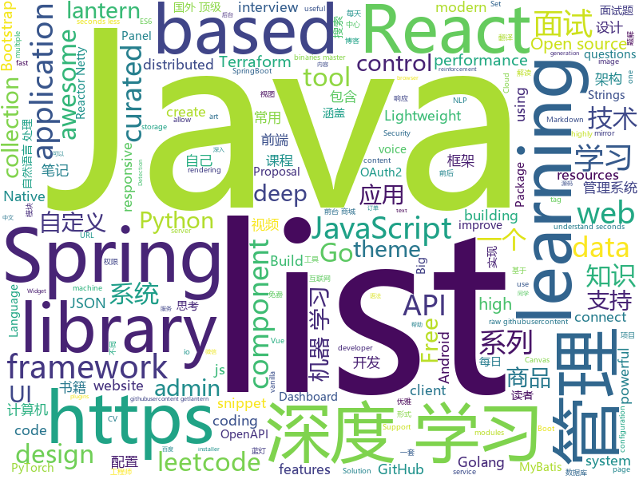

# 2019-09-19
See what the GitHub community is most excited about today.

## python
* [d2l-zh](https://github.com/d2l-ai/d2l-zh)(**371 stars today**): 《动手学深度学习》：面向中文读者、能运行、可讨论。英文版即伯克利“深度学习导论”教材。
* [pytorch-transformers](https://github.com/huggingface/pytorch-transformers)(**158 stars today**): 👾A library of state-of-the-art pretrained models for Natural Language Processing (NLP)
* [30-seconds-of-python](https://github.com/30-seconds/30-seconds-of-python)(**258 stars today**): A curated collection of useful Python snippets that you can understand in 30 seconds or less.
* [system-design-primer](https://github.com/donnemartin/system-design-primer)(**187 stars today**): Learn how to design large-scale systems. Prep for the system design interview. Includes Anki flashcards.
* [public-apis](https://github.com/public-apis/public-apis)(**251 stars today**): A collective list of free APIs for use in software and web development.
* [big-list-of-naughty-strings](https://github.com/minimaxir/big-list-of-naughty-strings)(**23 stars today**): The Big List of Naughty Strings is a list of strings which have a high probability of causing issues when used as user-input data.
* [home-assistant](https://github.com/home-assistant/home-assistant)(**24 stars today**): 🏡Open source home automation that puts local control and privacy first
* [SpeedTorch](https://github.com/Santosh-Gupta/SpeedTorch)(**47 stars today**): Library for fastest pinned CPU <-> GPU transfer
* [mne-python](https://github.com/mne-tools/mne-python)(**4 stars today**): MNE : Magnetoencephalography (MEG) and Electroencephalography (EEG) in Python
* [Deep-Reinforcement-Learning-Algorithms-with-PyTorch](https://github.com/p-christ/Deep-Reinforcement-Learning-Algorithms-with-PyTorch)(**108 stars today**): PyTorch implementations of deep reinforcement learning algorithms and environments
* [interview_internal_reference](https://github.com/0voice/interview_internal_reference)(**56 stars today**): 2019年最新总结，阿里，腾讯，百度，美团，头条等技术面试题目，以及答案，专家出题人分析汇总。
* [Algorithm_Interview_Notes-Chinese](https://github.com/imhuay/Algorithm_Interview_Notes-Chinese)(**38 stars today**): 2018/2019/校招/春招/秋招/算法/机器学习(Machine Learning)/深度学习(Deep Learning)/自然语言处理(NLP)/C/C++/Python/面试笔记
* [shadowsocks](https://github.com/shadowsocks/shadowsocks)(**31 stars today**): 
* [gluon-cv](https://github.com/dmlc/gluon-cv)(**14 stars today**): Gluon CV Toolkit
* [NeMo](https://github.com/NVIDIA/NeMo)(**73 stars today**): Neural Modules: a toolkit for conversational AI
* [AiLearning](https://github.com/apachecn/AiLearning)(**52 stars today**): AiLearning: 机器学习 - MachineLearning - ML、深度学习 - DeepLearning - DL、自然语言处理 NLP
* [ShadowSocksShare](https://github.com/the0demiurge/ShadowSocksShare)(**24 stars today**): Python爬虫/Flask网站/免费ShadowSocks帐号/ssr订阅/json API
* [rasa](https://github.com/RasaHQ/rasa)(**28 stars today**): 💬Open source machine learning framework to automate text- and voice-based conversations: NLU, dialogue management, connect to Slack, Facebook, and more - Create chatbots and voice assistants
* [mmdetection](https://github.com/open-mmlab/mmdetection)(**25 stars today**): Open MMLab Detection Toolbox and Benchmark
* [shadowsocksr](https://github.com/shadowsocksr-backup/shadowsocksr)(**18 stars today**): Python port of ShadowsocksR
* [bake](https://github.com/kennethreitz/bake)(**40 stars today**): Bake — the strangely familiar workflow utility.
* [pytorch-tutorial](https://github.com/yunjey/pytorch-tutorial)(**15 stars today**): PyTorch Tutorial for Deep Learning Researchers
* [keras](https://github.com/keras-team/keras)(**49 stars today**): Deep Learning for humans
* [bk-sops](https://github.com/Tencent/bk-sops)(**7 stars today**): 蓝鲸智云标准运维(SOPS)
* [learn2learn](https://github.com/learnables/learn2learn)(**48 stars today**): PyTorch Meta-learning Framework for Researchers

## java
* [incubator-dolphinscheduler](https://github.com/apache/incubator-dolphinscheduler)(**105 stars today**): Apache DolphinScheduler
* [views-widgets](https://github.com/android/views-widgets)(**49 stars today**): Multiple samples showing the best practices in views-widgets on Android.
* [TubeMQ](https://github.com/Tencent/TubeMQ)(**324 stars today**): TubeMQ focuses on high-performance storage and transmission of massive data in big data scenarios
* [advanced-java](https://github.com/doocs/advanced-java)(**217 stars today**): 😮互联网 Java 工程师进阶知识完全扫盲：涵盖高并发、分布式、高可用、微服务等领域知识，后端同学必看，前端同学也可学习
* [JavaGuide](https://github.com/Snailclimb/JavaGuide)(**123 stars today**): 【Java学习+面试指南】 一份涵盖大部分Java程序员所需要掌握的核心知识。
* [CS-Notes](https://github.com/CyC2018/CS-Notes)(**282 stars today**): 📚Tech Interview Guide 技术面试必备基础知识、Leetcode 题解、Java、C++、Python、后端面试、操作系统、计算机网络、系统设计
* [mall](https://github.com/macrozheng/mall)(**55 stars today**): mall项目是一套电商系统，包括前台商城系统及后台管理系统，基于SpringBoot+MyBatis实现。 前台商城系统包含首页门户、商品推荐、商品搜索、商品展示、购物车、订单流程、会员中心、客户服务、帮助中心等模块。 后台管理系统包含商品管理、订单管理、会员管理、促销管理、运营管理、内容管理、统计报表、财务管理、权限管理、设置等模块。
* [vhr](https://github.com/lenve/vhr)(**66 stars today**): 微人事是一个前后端分离的人力资源管理系统，项目采用SpringBoot+Vue开发。
* [LeetCodeAnimation](https://github.com/MisterBooo/LeetCodeAnimation)(**84 stars today**): Demonstrate all the questions on LeetCode in the form of animation.（用动画的形式呈现解LeetCode题目的思路）
* [mybatis-3](https://github.com/mybatis/mybatis-3)(**16 stars today**): MyBatis SQL mapper framework for Java
* [arthas](https://github.com/alibaba/arthas)(**28 stars today**): Alibaba Java Diagnostic Tool Arthas/Alibaba Java诊断利器Arthas
* [apollo](https://github.com/ctripcorp/apollo)(**38 stars today**): Apollo（阿波罗）是携程框架部门研发的分布式配置中心，能够集中化管理应用不同环境、不同集群的配置，配置修改后能够实时推送到应用端，并且具备规范的权限、流程治理等特性，适用于微服务配置管理场景。
* [spring-framework](https://github.com/spring-projects/spring-framework)(**33 stars today**): Spring Framework
* [ExoPlayer](https://github.com/google/ExoPlayer)(**13 stars today**): An extensible media player for Android
* [toBeTopJavaer](https://github.com/hollischuang/toBeTopJavaer)(**44 stars today**): To Be Top Javaer - Java工程师成神之路
* [Java](https://github.com/DuGuQiuBai/Java)(**14 stars today**): 27天成为Java大神
* [jib](https://github.com/GoogleContainerTools/jib)(**11 stars today**): 🏗Build container images for your Java applications.
* [CalendarView](https://github.com/huanghaibin-dev/CalendarView)(**8 stars today**): Android上一个优雅、万能自定义UI、支持周视图、自定义周起始、性能高效的日历控件，支持热插拔实现的UI定制！支持标记、自定义颜色、农历、自定义月视图各种显示模式等。Canvas绘制，速度快、占用内存低，你真的想不到日历居然还可以如此优雅！An elegant, highly customized and high-performance Calendar Widget on Android.
* [SpringAll](https://github.com/wuyouzhuguli/SpringAll)(**23 stars today**): 循序渐进，学习Spring Boot、Spring Boot & Shiro、Spring Cloud、Spring Security & Spring Security OAuth2，博客Spring系列源码
* [Sentinel](https://github.com/alibaba/Sentinel)(**18 stars today**): A lightweight powerful flow control component enabling reliability and monitoring for microservices. (轻量级的流量控制、熔断降级 Java 库)
* [jetcache](https://github.com/alibaba/jetcache)(**2 stars today**): JetCache is a Java cache framework.
* [spring-security-oauth](https://github.com/spring-projects/spring-security-oauth)(**5 stars today**): Support for adding OAuth1(a) and OAuth2 features (consumer and provider) for Spring web applications.
* [RxJava](https://github.com/ReactiveX/RxJava)(**24 stars today**): RxJava – Reactive Extensions for the JVM – a library for composing asynchronous and event-based programs using observable sequences for the Java VM.
* [openapi-generator](https://github.com/OpenAPITools/openapi-generator)(**7 stars today**): OpenAPI Generator allows generation of API client libraries (SDK generation), server stubs, documentation and configuration automatically given an OpenAPI Spec (v2, v3)
* [react-native-camera](https://github.com/react-native-community/react-native-camera)(**3 stars today**): A Camera component for React Native. Also supports barcode scanning!

## unknown
* [awesome-shodan-queries](https://github.com/jakejarvis/awesome-shodan-queries)(**87 stars today**): 🔍A collection of interesting, funny, and depressing search queries to plug into https://shodan.io/👩‍💻
* [hosts](https://github.com/googlehosts/hosts)(**44 stars today**): 镜像：https://coding.net/u/scaffrey/p/hosts/git
* [ECMAScript-new-features-list](https://github.com/daumann/ECMAScript-new-features-list)(**160 stars today**): A comprehensive list of new ES features, including ES2015 (ES6), ES2016, ES2017, ES2018, ES2019
* [the-art-of-command-line](https://github.com/jlevy/the-art-of-command-line)(**103 stars today**): Master the command line, in one page
* [new-pac](https://github.com/Alvin9999/new-pac)(**103 stars today**): 
* [build-your-own-x](https://github.com/danistefanovic/build-your-own-x)(**112 stars today**): 🤓Build your own (insert technology here)
* [app-ideas](https://github.com/florinpop17/app-ideas)(**95 stars today**): A Collection of application ideas which can be used to improve your coding skills.
* [awesome-flask](https://github.com/humiaozuzu/awesome-flask)(**9 stars today**): A curated list of awesome Flask resources and plugins
* [DeepLearning-500-questions](https://github.com/scutan90/DeepLearning-500-questions)(**41 stars today**): 深度学习500问，以问答形式对常用的概率知识、线性代数、机器学习、深度学习、计算机视觉等热点问题进行阐述，以帮助自己及有需要的读者。 全书分为18个章节，50余万字。由于水平有限，书中不妥之处恳请广大读者批评指正。 未完待续............ 如有意合作，联系scutjy2015@163.com 版权所有，违权必究 Tan 2018.06
* [Blog](https://github.com/mqyqingfeng/Blog)(**25 stars today**): 冴羽写博客的地方，预计写四个系列：JavaScript深入系列、JavaScript专题系列、ES6系列、React系列。
* [reverse-interview-zh](https://github.com/yifeikong/reverse-interview-zh)(**231 stars today**): 技术面试最后反问面试官的话
* [awesome-flask](https://github.com/mjhea0/awesome-flask)(**10 stars today**): A curated list of awesome things related to Flask
* [developer-portfolios](https://github.com/emmawedekind/developer-portfolios)(**28 stars today**): A list of developer portfolios for your inspiration
* [FreeNetwork](https://github.com/xiaoming2028/FreeNetwork)(**22 stars today**): 翻墙-科学上网 史上最全教程
* [free-programming-books-zh_CN](https://github.com/justjavac/free-programming-books-zh_CN)(**41 stars today**): 📚免费的计算机编程类中文书籍，欢迎投稿
* [Checklists](https://github.com/netbiosX/Checklists)(**0 stars today**): Pentesting checklists for various engagements
* [download](https://github.com/getlantern/download)(**37 stars today**): 蓝灯Windows下载 https://raw.githubusercontent.com/getlantern/lantern-binaries/master/lantern-installer.exe 蓝灯安卓下载 https://raw.githubusercontent.com/getlantern/lantern-binaries/master/lantern-installer.apk
* [MARL-Papers](https://github.com/LantaoYu/MARL-Papers)(**5 stars today**): Paper list of multi-agent reinforcement learning (MARL)
* [awesome-remote-job](https://github.com/lukasz-madon/awesome-remote-job)(**11 stars today**): A curated list of awesome remote jobs and resources. Inspired by https://github.com/vinta/awesome-python
* [awesome-interview-questions](https://github.com/MaximAbramchuck/awesome-interview-questions)(**24 stars today**): A curated awesome list of lists of interview questions. Feel free to contribute!🎓
* [bbr](https://github.com/google/bbr)(**9 stars today**): 
* [README](https://github.com/guodongxiaren/README)(**5 stars today**): README文件语法解读，即Github Flavored Markdown语法介绍
* [deep_learning_object_detection](https://github.com/hoya012/deep_learning_object_detection)(**18 stars today**): A paper list of object detection using deep learning.
* [chromium](https://github.com/jjqqkk/chromium)(**18 stars today**): Chromium browser with SSL VPN. Use this browser to unblock websites.
* [technology-talk](https://github.com/aalansehaiyang/technology-talk)(**17 stars today**): 汇总java生态圈常用技术框架、开源中间件，系统架构、数据库、大公司架构案例、常用三方类库、项目管理、线上问题排查、个人成长、思考等知识

## javascript
* [fe-interview](https://github.com/haizlin/fe-interview)(**52 stars today**): 前端面试每日 3+1，以面试题来驱动学习，提倡每日学习与思考，每天进步一点！每天早上5点纯手工发布面试题（死磕自己，愉悦大家）
* [bustag](https://github.com/gxtrobot/bustag)(**150 stars today**): a tag and recommend system for old bus driver
* [google-access-helper](https://github.com/haotian-wang/google-access-helper)(**56 stars today**): 谷歌访问助手破解版
* [30-seconds-of-code](https://github.com/30-seconds/30-seconds-of-code)(**75 stars today**): A curated collection of useful JavaScript snippets that you can understand in 30 seconds or less.
* [taro](https://github.com/NervJS/taro)(**23 stars today**): 多端统一开发框架，支持用 React 的开发方式编写一次代码，生成能运行在微信/百度/支付宝/字节跳动/ QQ 小程序、快应用、H5、React Native 等的应用。 https://taro.jd.com/
* [vue](https://github.com/vuejs/vue)(**78 stars today**): 🖖Vue.js is a progressive, incrementally-adoptable JavaScript framework for building UI on the web.
* [create-react-app](https://github.com/facebook/create-react-app)(**48 stars today**): Set up a modern web app by running one command.
* [yapi](https://github.com/YMFE/yapi)(**26 stars today**): YApi 是一个可本地部署的、打通前后端及QA的、可视化的接口管理平台
* [react-rainbow](https://github.com/nexxtway/react-rainbow)(**69 stars today**): React Rainbow Components. Build your web application in a snap.
* [joi](https://github.com/hapijs/joi)(**14 stars today**): 🏢The most powerful data validation library for JS
* [OwlCarousel2](https://github.com/OwlCarousel2/OwlCarousel2)(**2 stars today**): DEPRECATED jQuery Responsive Carousel.
* [hacker-scripts](https://github.com/NARKOZ/hacker-scripts)(**18 stars today**): Based on a true story
* [leetcode](https://github.com/azl397985856/leetcode)(**94 stars today**): LeetCode Solutions: A Record of My Problem Solving Journey.( leetcode题解，记录自己的leetcode解题之路。)
* [Front-End-Checklist](https://github.com/thedaviddias/Front-End-Checklist)(**69 stars today**): 🗂The perfect Front-End Checklist for modern websites and meticulous developers
* [exif-js](https://github.com/exif-js/exif-js)(**8 stars today**): JavaScript library for reading EXIF image metadata
* [Chart.js](https://github.com/chartjs/Chart.js)(**14 stars today**): Simple HTML5 Charts using the <canvas> tag
* [dayjs](https://github.com/iamkun/dayjs)(**20 stars today**): ⏰Day.js 2KB immutable date library alternative to Moment.js with the same modern API
* [xd-to-flutter](https://github.com/thize/xd-to-flutter)(**3 stars today**): Xd to Flutter
* [airframe-react](https://github.com/0wczar/airframe-react)(**11 stars today**): Free Open Source High Quality Dashboard based on Bootstrap 4 & React 16: http://dashboards.webkom.co/react/airframe
* [aws-serverless-workshops](https://github.com/aws-samples/aws-serverless-workshops)(**9 stars today**): Code and walkthrough labs to set up serverless applications for Wild Rydes workshops
* [Functional-Light-JS](https://github.com/getify/Functional-Light-JS)(**7 stars today**): Pragmatic, balanced FP in JavaScript. @FLJSBook on twitter.
* [vant](https://github.com/youzan/vant)(**19 stars today**): Lightweight Mobile UI Components built on Vue
* [Vue.Draggable](https://github.com/SortableJS/Vue.Draggable)(**19 stars today**): Vue drag-and-drop component based on Sortable.js
* [next.js](https://github.com/zeit/next.js)(**31 stars today**): The React Framework
* [miniprogram-demo](https://github.com/wechat-miniprogram/miniprogram-demo)(**13 stars today**): 微信小程序组件 / API / 云开发示例

## html
* [Coursera-ML-AndrewNg-Notes](https://github.com/fengdu78/Coursera-ML-AndrewNg-Notes)(**24 stars today**): 吴恩达老师的机器学习课程个人笔记
* [deeplearning_ai_books](https://github.com/fengdu78/deeplearning_ai_books)(**10 stars today**): deeplearning.ai（吴恩达老师的深度学习课程笔记及资源）
* [glTF](https://github.com/KhronosGroup/glTF)(**4 stars today**): glTF – Runtime 3D Asset Delivery
* [startbootstrap-resume](https://github.com/BlackrockDigital/startbootstrap-resume)(**4 stars today**): A Bootstrap 4 resume/CV theme created by Start Bootstrap
* [foundation-emails](https://github.com/foundation/foundation-emails)(**1 stars today**): Quickly create responsive HTML emails that work on any device and client. Even Outlook.
* [web-moderno](https://github.com/cod3rcursos/web-moderno)(**1 stars today**): 
* [technical-books](https://github.com/doocs/technical-books)(**14 stars today**): 😆国内外互联网技术大牛们都写了哪些书籍：计算机基础、网络、前端、后端、数据库、架构、大数据、深度学习...
* [EIPs](https://github.com/ethereum/EIPs)(**4 stars today**): The Ethereum Improvement Proposal repository
* [AdminLTE](https://github.com/ColorlibHQ/AdminLTE)(**65 stars today**): AdminLTE - Free Premium Admin control Panel Theme Based On Bootstrap 3.x
* [Django-CRM](https://github.com/MicroPyramid/Django-CRM)(**0 stars today**): Open Source Python CRM based on Django aimed to salesforce compatible for migrating to
* [hexo-theme-matery](https://github.com/blinkfox/hexo-theme-matery)(**8 stars today**): A beautiful hexo blog theme with material design and responsive design.一个基于材料设计和响应式设计而成的全面、美观的Hexo主题。
* [ScrollToTextFragment](https://github.com/WICG/ScrollToTextFragment)(**2 stars today**): Proposal to allow specifying a text snippet in a URL fragment
* [rellax](https://github.com/dixonandmoe/rellax)(**7 stars today**): Lightweight, vanilla javascript parallax library
* [url-to-pdf-api](https://github.com/alvarcarto/url-to-pdf-api)(**4 stars today**): Web page PDF/PNG rendering done right. Self-hosted service for rendering receipts, invoices, or any content.
* [simviso-Source-code-interpretation-sharing](https://github.com/muyinchen/simviso-Source-code-interpretation-sharing)(**8 stars today**): simviso 的一系列源码解读分享视频，涉及国外顶级学府课程翻译、国外顶级开发者视频翻译，JDK, Rxjava，Spring Reactor， Netty ，Reactor-Netty ，Spring Webflux 我的目标是将Java的响应式建立起一套学习体系，假如你想深入，可以参考我的视频和后续出版的书籍，同时展现一些我的编程经验，做一个铺路人
* [hermit](https://github.com/Track3/hermit)(**1 stars today**): A minimal & fast Hugo theme for bloggers
* [awesome-creative-coding](https://github.com/terkelg/awesome-creative-coding)(**7 stars today**): Creative Coding: Generative Art, Data visualization, Interaction Design, Resources.
* [tiny-slider](https://github.com/ganlanyuan/tiny-slider)(**2 stars today**): Vanilla javascript slider for all purposes.
* [Markdown-Resume](https://github.com/CyC2018/Markdown-Resume)(**5 stars today**): ⭐️Markdown 简历模版
* [ng-alain](https://github.com/ng-alain/ng-alain)(**3 stars today**): NG-ZORRO admin panel front-end framework (netlify mirror https://netlify.ng-alain.com/)
* [gentelella](https://github.com/ColorlibHQ/gentelella)(**27 stars today**): Free Bootstrap 3 Admin Template
* [curso-algebra-lineal](https://github.com/joanby/curso-algebra-lineal)(**3 stars today**): Curso de Álgebra Lineal
* [BlazorStrap](https://github.com/chanan/BlazorStrap)(**0 stars today**): Bootstrap 4 Components for Blazor Framework
* [terraform-website](https://github.com/hashicorp/terraform-website)(**0 stars today**): Prototype of Terraform website being assembled from multiple repositories
* [linux-command](https://github.com/jaywcjlove/linux-command)(**8 stars today**): Linux命令大全搜索工具，内容包含Linux命令手册、详解、学习、搜集。https://git.io/linux

## go
* [gin](https://github.com/gin-gonic/gin)(**99 stars today**): Gin is a HTTP web framework written in Go (Golang). It features a Martini-like API with much better performance -- up to 40 times faster. If you need smashing performance, get yourself some Gin.
* [traefik](https://github.com/containous/traefik)(**92 stars today**): The Cloud Native Edge Router
* [v2ray-core](https://github.com/v2ray/v2ray-core)(**108 stars today**): A platform for building proxies to bypass network restrictions.
* [istio](https://github.com/istio/istio)(**34 stars today**): Connect, secure, control, and observe services.
* [dgraph](https://github.com/dgraph-io/dgraph)(**19 stars today**): Fast, Distributed Graph DB
* [sarama](https://github.com/Shopify/sarama)(**10 stars today**): Sarama is a Go library for Apache Kafka 0.8, and up.
* [mux](https://github.com/gorilla/mux)(**11 stars today**): A powerful HTTP router and URL matcher for building Go web servers with🦍
* [consul](https://github.com/hashicorp/consul)(**14 stars today**): Consul is a distributed, highly available, and data center aware solution to connect and configure applications across dynamic, distributed infrastructure.
* [terraform](https://github.com/hashicorp/terraform)(**22 stars today**): Terraform enables you to safely and predictably create, change, and improve infrastructure. It is an open source tool that codifies APIs into declarative configuration files that can be shared amongst team members, treated as code, edited, reviewed, and versioned.
* [redis](https://github.com/go-redis/redis)(**12 stars today**): Type-safe Redis client for Golang
* [external-storage](https://github.com/kubernetes-incubator/external-storage)(**8 stars today**): External storage plugins, provisioners, and helper libraries
* [go-github](https://github.com/google/go-github)(**12 stars today**): Go library for accessing the GitHub API
* [charts](https://github.com/helm/charts)(**28 stars today**): Curated applications for Kubernetes
* [fabric](https://github.com/hyperledger/fabric)(**8 stars today**): Read-only mirror of https://gerrit.hyperledger.org/r/#/admin/projects/fabric
* [helm](https://github.com/helm/helm)(**23 stars today**): The Kubernetes Package Manager
* [distribution](https://github.com/docker/distribution)(**6 stars today**): The Docker toolset to pack, ship, store, and deliver content
* [reviewdog](https://github.com/reviewdog/reviewdog)(**23 stars today**): 🐶Automated code review tool integrated with any code analysis tools regardless of programming language
* [beats](https://github.com/elastic/beats)(**10 stars today**): 🐠Beats - Lightweight shippers for Elasticsearch & Logstash
* [gorm](https://github.com/jinzhu/gorm)(**16 stars today**): The fantastic ORM library for Golang, aims to be developer friendly
* [go-patterns](https://github.com/sevenelevenlee/go-patterns)(**48 stars today**): Golang 设计模式
* [terragrunt](https://github.com/gruntwork-io/terragrunt)(**9 stars today**): Terragrunt is a thin wrapper for Terraform that provides extra tools for working with multiple Terraform modules.
* [color](https://github.com/fatih/color)(**1 stars today**): Color package for Go (golang)
* [gjson](https://github.com/tidwall/gjson)(**7 stars today**): Get JSON values quickly - JSON parser for Go
* [clash](https://github.com/Dreamacro/clash)(**26 stars today**): A rule-based tunnel in Go.
* [xray](https://github.com/chaitin/xray)(**35 stars today**): xray 安全评估工具

## WordCloud

