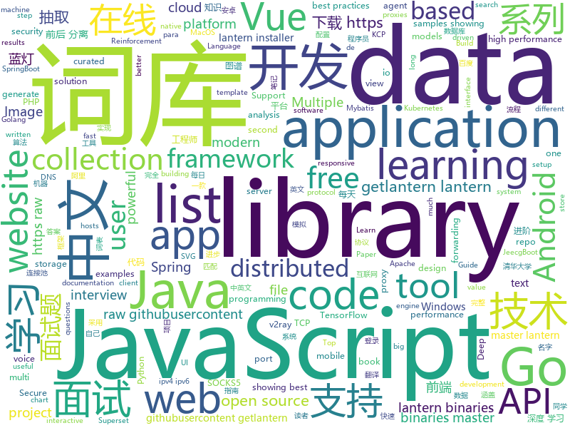

# 2019-09-20
See what the GitHub community is most excited about today.

## python
* [mexican-government-report](https://github.com/PhantomInsights/mexican-government-report)(**25 stars today**): Text Mining on the 2019 Mexican Government Report, covering from extracting text from a PDF file to plotting the results.
* [Real-Time-Voice-Cloning](https://github.com/CorentinJ/Real-Time-Voice-Cloning)(**123 stars today**): Clone a voice in 5 seconds to generate arbitrary speech in real-time
* [DoubleDIP](https://github.com/yossigandelsman/DoubleDIP)(**22 stars today**): Official implementation of the paper "Double-DIP: Unsupervised Image Decomposition via Coupled Deep-Image-Priors"
* [system-design-primer](https://github.com/donnemartin/system-design-primer)(**134 stars today**): Learn how to design large-scale systems. Prep for the system design interview. Includes Anki flashcards.
* [bert](https://github.com/google-research/bert)(**33 stars today**): TensorFlow code and pre-trained models for BERT
* [public-apis](https://github.com/public-apis/public-apis)(**169 stars today**): A collective list of free APIs for use in software and web development.
* [CheatSheetSeries](https://github.com/OWASP/CheatSheetSeries)(**49 stars today**): The OWASP Cheat Sheet Series was created to provide a concise collection of high value information on specific application security topics.
* [AiLearning](https://github.com/apachecn/AiLearning)(**43 stars today**): AiLearning: 机器学习 - MachineLearning - ML、深度学习 - DeepLearning - DL、自然语言处理 NLP
* [30-seconds-of-python](https://github.com/30-seconds/30-seconds-of-python)(**112 stars today**): A curated collection of useful Python snippets that you can understand in 30 seconds or less.
* [d2l-en](https://github.com/d2l-ai/d2l-en)(**14 stars today**): Dive into Deep Learning: an interactive deep learning book with code, math, and discussions
* [funNLP](https://github.com/fighting41love/funNLP)(**38 stars today**): 中英文敏感词、语言检测、中外手机/电话归属地/运营商查询、名字推断性别、手机号抽取、身份证抽取、邮箱抽取、中日文人名库、中文缩写库、拆字词典、词汇情感值、停用词、反动词表、暴恐词表、繁简体转换、英文模拟中文发音、汪峰歌词生成器、职业名称词库、同义词库、反义词库、否定词库、汽车品牌词库、汽车零件词库、连续英文切割、各种中文词向量、公司名字大全、古诗词库、IT词库、财经词库、成语词库、地名词库、历史名人词库、诗词词库、医学词库、饮食词库、法律词库、汽车词库、动物词库、中文聊天语料、中文谣言数据、百度中文问答数据集、句子相似度匹配算法集合、bert资源、文本生成&摘要相关工具、cocoNLP信息抽取工具、国内电话号码正则匹配、清华大学XLORE:中英文跨语言百科知识图谱、清华大学人工智能技术…
* [django](https://github.com/django/django)(**22 stars today**): The Web framework for perfectionists with deadlines.
* [interview_internal_reference](https://github.com/0voice/interview_internal_reference)(**53 stars today**): 2019年最新总结，阿里，腾讯，百度，美团，头条等技术面试题目，以及答案，专家出题人分析汇总。
* [models](https://github.com/tensorflow/models)(**55 stars today**): Models and examples built with TensorFlow
* [pytorch-transformers](https://github.com/huggingface/pytorch-transformers)(**92 stars today**): 👾A library of state-of-the-art pretrained models for Natural Language Processing (NLP)
* [pdlist](https://github.com/gnebbia/pdlist)(**15 stars today**): A passive subdomain finder
* [agents](https://github.com/tensorflow/agents)(**5 stars today**): TF-Agents is a library for Reinforcement Learning in TensorFlow
* [d2l-zh](https://github.com/d2l-ai/d2l-zh)(**136 stars today**): 《动手学深度学习》：面向中文读者、能运行、可讨论。英文版即伯克利“深度学习导论”教材。
* [rasa](https://github.com/RasaHQ/rasa)(**17 stars today**): 💬Open source machine learning framework to automate text- and voice-based conversations: NLU, dialogue management, connect to Slack, Facebook, and more - Create chatbots and voice assistants
* [pandas](https://github.com/pandas-dev/pandas)(**16 stars today**): Flexible and powerful data analysis / manipulation library for Python, providing labeled data structures similar to R data.frame objects, statistical functions, and much more
* [multi-v2ray](https://github.com/Jrohy/multi-v2ray)(**8 stars today**): v2ray easy delpoy & manage tool， support multiple user & protocol manage
* [shadowsocksr](https://github.com/shadowsocksr-backup/shadowsocksr)(**11 stars today**): Python port of ShadowsocksR
* [pygcn](https://github.com/tkipf/pygcn)(**3 stars today**): Graph Convolutional Networks in PyTorch
* [shadowsocks](https://github.com/shadowsocks/shadowsocks)(**19 stars today**): 
* [mlflow](https://github.com/mlflow/mlflow)(**5 stars today**): Open source platform for the machine learning lifecycle

## java
* [advanced-java](https://github.com/doocs/advanced-java)(**269 stars today**): 😮互联网 Java 工程师进阶知识完全扫盲：涵盖高并发、分布式、高可用、微服务等领域知识，后端同学必看，前端同学也可学习
* [CS-Notes](https://github.com/CyC2018/CS-Notes)(**358 stars today**): 📚Tech Interview Guide 技术面试必备基础知识、Leetcode 题解、Java、C++、Python、后端面试、操作系统、计算机网络、系统设计
* [TubeMQ](https://github.com/Tencent/TubeMQ)(**174 stars today**): TubeMQ focuses on high-performance storage and transmission of massive data in big data scenarios
* [incubator-dolphinscheduler](https://github.com/apache/incubator-dolphinscheduler)(**121 stars today**): Apache DolphinScheduler
* [JavaGuide](https://github.com/Snailclimb/JavaGuide)(**163 stars today**): 【Java学习+面试指南】 一份涵盖大部分Java程序员所需要掌握的核心知识。
* [views-widgets](https://github.com/android/views-widgets)(**62 stars today**): Multiple samples showing the best practices in views-widgets on Android.
* [druid](https://github.com/alibaba/druid)(**29 stars today**): 阿里巴巴数据库事业部出品，为监控而生的数据库连接池。阿里云Data Lake Analytics(https://www.aliyun.com/product/datalakeanalytics )、DRDS、TDDL 连接池powered by Druid
* [user-interface](https://github.com/android/user-interface)(**11 stars today**): Multiple samples showing the best practices in user-interface on Android.
* [spring-framework](https://github.com/spring-projects/spring-framework)(**36 stars today**): Spring Framework
* [presto](https://github.com/prestodb/presto)(**5 stars today**): The official home of the Presto distributed SQL query engine for big data
* [jeecg-boot](https://github.com/zhangdaiscott/jeecg-boot)(**24 stars today**): 一款基于代码生成器的JAVA快速开发平台！采用最新技术，前后端分离架构：SpringBoot 2.x，Ant Design&Vue，Mybatis，Shiro，JWT。强大的代码生成器让前后端代码一键生成，无需写任何代码，绝对是全栈开发福音！！ JeecgBoot的宗旨是提高UI能力的同时,降低前后分离的开发成本，JeecgBoot还独创在线开发模式，No代码概念，一系列在线智能开发：在线配置表单、在线配置报表、在线设计流程等等。
* [elasticsearch](https://github.com/elastic/elasticsearch)(**25 stars today**): Open Source, Distributed, RESTful Search Engine
* [skywalking](https://github.com/apache/skywalking)(**19 stars today**): APM, Application Performance Monitoring System
* [toBeTopJavaer](https://github.com/hollischuang/toBeTopJavaer)(**34 stars today**): To Be Top Javaer - Java工程师成神之路
* [MPAndroidChart](https://github.com/PhilJay/MPAndroidChart)(**8 stars today**): A powerful🚀Android chart view / graph view library, supporting line- bar- pie- radar- bubble- and candlestick charts as well as scaling, dragging and animations.
* [vhr](https://github.com/lenve/vhr)(**81 stars today**): 微人事是一个前后端分离的人力资源管理系统，项目采用SpringBoot+Vue开发。
* [tutorials](https://github.com/eugenp/tutorials)(**25 stars today**): The "REST With Spring" Course:
* [jib](https://github.com/GoogleContainerTools/jib)(**13 stars today**): 🏗Build container images for your Java applications.
* [spring-cloud-alibaba](https://github.com/alibaba/spring-cloud-alibaba)(**28 stars today**): Spring Cloud Alibaba provides a one-stop solution for application development for the distributed solutions of Alibaba middleware.
* [paascloud-master](https://github.com/paascloud/paascloud-master)(**34 stars today**): spring cloud + vue + oAuth2.0全家桶实战，前后端分离模拟商城，完整的购物流程、后端运营平台，可以实现快速搭建企业级微服务项目。支持微信登录等三方登录。
* [animation](https://github.com/android/animation)(**10 stars today**): Multiple samples showing the best practices in animation on Android.
* [mybatis-plus](https://github.com/baomidou/mybatis-plus)(**21 stars today**): An powerful enhanced toolkit of MyBatis for simplify development
* [spring-boot](https://github.com/spring-projects/spring-boot)(**28 stars today**): Spring Boot
* [incubator-shardingsphere](https://github.com/apache/incubator-shardingsphere)(**12 stars today**): Distributed database middleware
* [kafka-streams-examples](https://github.com/confluentinc/kafka-streams-examples)(**2 stars today**): Demo applications and code examples for Apache Kafka's Streams API.

## unknown
* [A-to-Z-Resources-for-Students](https://github.com/dipakkr/A-to-Z-Resources-for-Students)(**55 stars today**): ✅Curated list of resources for college students
* [Programming_Interview_Study_Plan](https://github.com/llSourcell/Programming_Interview_Study_Plan)(**59 stars today**): This is the Programming Interview Study Plan by Siraj Raval on Youtube
* [reverse-interview-zh](https://github.com/yifeikong/reverse-interview-zh)(**219 stars today**): 技术面试最后反问面试官的话
* [new-pac](https://github.com/Alvin9999/new-pac)(**100 stars today**): 
* [Hacking-Security-Ebooks](https://github.com/yeahhub/Hacking-Security-Ebooks)(**64 stars today**): Top 100 Hacking & Security E-Books (Free Download)
* [app-ideas](https://github.com/florinpop17/app-ideas)(**24 stars today**): A Collection of application ideas which can be used to improve your coding skills.
* [Blog](https://github.com/mqyqingfeng/Blog)(**26 stars today**): 冴羽写博客的地方，预计写四个系列：JavaScript深入系列、JavaScript专题系列、ES6系列、React系列。
* [AZ-103-MicrosoftAzureAdministrator](https://github.com/MicrosoftLearning/AZ-103-MicrosoftAzureAdministrator)(**2 stars today**): AZ-103: Microsoft Azure Administrator
* [awesome-shodan-queries](https://github.com/jakejarvis/awesome-shodan-queries)(**96 stars today**): 🔍A collection of interesting, funny, and depressing search queries to plug into https://shodan.io/👩‍💻
* [awesome-wechat-weapp](https://github.com/justjavac/awesome-wechat-weapp)(**31 stars today**): 微信小程序开发资源汇总💯
* [proposals](https://github.com/tc39/proposals)(**7 stars today**): Tracking ECMAScript Proposals
* [architect-awesome](https://github.com/xingshaocheng/architect-awesome)(**40 stars today**): 后端架构师技术图谱
* [AIinterview](https://github.com/PPshrimpGo/AIinterview)(**14 stars today**): 算法工程师面试题整理
* [electron-ssr-backup](https://github.com/qingshuisiyuan/electron-ssr-backup)(**24 stars today**): electron-ssr原作者删除了这个伟大的项目，故备份了下来，不继续开发,且用且珍惜
* [remote-jobs-brazil](https://github.com/lerrua/remote-jobs-brazil)(**2 stars today**): Lista de empresas com trabalho remoto no Brasil
* [gold-miner](https://github.com/xitu/gold-miner)(**23 stars today**): 🥇掘金翻译计划，可能是世界最大最好的英译中技术社区，最懂读者和译者的翻译平台：
* [vagas](https://github.com/frontendbr/vagas)(**4 stars today**): 🔬Espaço para divulgação de vagas para front-enders.
* [hosts](https://github.com/googlehosts/hosts)(**92 stars today**): 镜像：https://coding.net/u/scaffrey/p/hosts/git
* [javascript-questions](https://github.com/lydiahallie/javascript-questions)(**17 stars today**): A long list of (advanced) JavaScript questions, and their explanations✨Updated weekly!
* [HEAD](https://github.com/joshbuchea/HEAD)(**6 stars today**): 🗿A list of everything that *could* go in the head of your document
* [awesome-interview-questions](https://github.com/MaximAbramchuck/awesome-interview-questions)(**25 stars today**): A curated awesome list of lists of interview questions. Feel free to contribute!🎓
* [MARL-Papers](https://github.com/LantaoYu/MARL-Papers)(**3 stars today**): Paper list of multi-agent reinforcement learning (MARL)
* [digital-preservation](https://github.com/usnationalarchives/digital-preservation)(**6 stars today**): NARA digital preservation file format risk analysis and preservation plans
* [gitignore](https://github.com/github/gitignore)(**60 stars today**): A collection of useful .gitignore templates
* [download](https://github.com/getlantern/download)(**30 stars today**): 蓝灯Windows下载 https://raw.githubusercontent.com/getlantern/lantern-binaries/master/lantern-installer.exe 蓝灯安卓下载 https://raw.githubusercontent.com/getlantern/lantern-binaries/master/lantern-installer.apk

## javascript
* [jsonbox](https://github.com/vasanthv/jsonbox)(**172 stars today**): A Free HTTP based JSON storage.
* [fe-interview](https://github.com/haizlin/fe-interview)(**214 stars today**): 前端面试每日 3+1，以面试题来驱动学习，提倡每日学习与思考，每天进步一点！每天早上5点纯手工发布面试题（死磕自己，愉悦大家）
* [Front-End-Checklist](https://github.com/thedaviddias/Front-End-Checklist)(**34 stars today**): 🗂The perfect Front-End Checklist for modern websites and meticulous developers
* [algorithm-visualizer](https://github.com/algorithm-visualizer/algorithm-visualizer)(**39 stars today**): 🎆Interactive Online Platform that Visualizes Algorithms from Code
* [react](https://github.com/facebook/react)(**71 stars today**): A declarative, efficient, and flexible JavaScript library for building user interfaces.
* [d3](https://github.com/d3/d3)(**32 stars today**): Bring data to life with SVG, Canvas and HTML.📊📈🎉
* [bootstrap](https://github.com/twbs/bootstrap)(**26 stars today**): The most popular HTML, CSS, and JavaScript framework for developing responsive, mobile first projects on the web.
* [incubator-superset](https://github.com/apache/incubator-superset)(**15 stars today**): Apache Superset (incubating) is a modern, enterprise-ready business intelligence web application
* [CyberChef](https://github.com/gchq/CyberChef)(**46 stars today**): The Cyber Swiss Army Knife - a web app for encryption, encoding, compression and data analysis
* [create-react-app](https://github.com/facebook/create-react-app)(**45 stars today**): Set up a modern web app by running one command.
* [swiper](https://github.com/nolimits4web/swiper)(**11 stars today**): Most modern mobile touch slider with hardware accelerated transitions
* [gridsome](https://github.com/gridsome/gridsome)(**19 stars today**): ⚡️Build lightning fast websites and apps with Vue.js
* [Daily-Interview-Question](https://github.com/Advanced-Frontend/Daily-Interview-Question)(**39 stars today**): 我是木易杨，公众号「高级前端进阶」作者，每天搞定一道前端大厂面试题，祝大家天天进步，一年后会看到不一样的自己。
* [aws-serverless-workshops](https://github.com/aws-samples/aws-serverless-workshops)(**5 stars today**): Code and walkthrough labs to set up serverless applications for Wild Rydes workshops
* [uni-app](https://github.com/dcloudio/uni-app)(**63 stars today**): uni-app 是使用 Vue 语法开发小程序、H5、App的统一框架
* [systemjs](https://github.com/systemjs/systemjs)(**21 stars today**): Dynamic ES module loader
* [wepy](https://github.com/Tencent/wepy)(**11 stars today**): 小程序组件化开发框架
* [jumpserver](https://github.com/jumpserver/jumpserver)(**8 stars today**): Jumpserver是全球首款完全开源的堡垒机，是符合 4A 的专业运维审计系统。
* [sweetalert2](https://github.com/sweetalert2/sweetalert2)(**16 stars today**): A beautiful, responsive, highly customizable and accessible (WAI-ARIA) replacement for JavaScript's popup boxes. Zero dependencies.
* [baidu-netdisk-downloaderx](https://github.com/b3log/baidu-netdisk-downloaderx)(**43 stars today**): ⚡️一款图形界面的百度网盘不限速下载器，支持 Windows、Linux 和 Mac。
* [eui](https://github.com/elastic/eui)(**2 stars today**): Elastic UI Framework🙌
* [exif-js](https://github.com/exif-js/exif-js)(**16 stars today**): JavaScript library for reading EXIF image metadata
* [joi](https://github.com/hapijs/joi)(**34 stars today**): 🏢The most powerful data validation library for JS
* [SwitchHosts](https://github.com/oldj/SwitchHosts)(**6 stars today**): Switch hosts quickly!
* [plus](https://github.com/preprocess/plus)(**23 stars today**): ➕A superset of PHP that makes PHP cool again.

## html
* [learning-area](https://github.com/mdn/learning-area)(**6 stars today**): Github repo for the MDN Learning Area.
* [website](https://github.com/kubernetes/website)(**3 stars today**): Kubernetes website and documentation repo:
* [coexisting-vue-microfrontends](https://github.com/joeldenning/coexisting-vue-microfrontends)(**27 stars today**): A repo showing separate vue apps coexisting as microfrontends with single-spa
* [swagger-codegen](https://github.com/swagger-api/swagger-codegen)(**6 stars today**): swagger-codegen contains a template-driven engine to generate documentation, API clients and server stubs in different languages by parsing your OpenAPI / Swagger definition.
* [18.06-linalg-notes](https://github.com/apachecn/18.06-linalg-notes)(**4 stars today**): MIT-18.06-线性代数-完整笔记
* [v2-ui](https://github.com/sprov065/v2-ui)(**15 stars today**): 支持多协议多用户的 v2ray 面板，Support multi-protocol multi-user v2ray panel
* [SuperTinyIcons](https://github.com/edent/SuperTinyIcons)(**3 stars today**): Under 1KB each! Super Tiny Icons are miniscule SVG versions of your favourite website and app logos
* [Coursera-ML-AndrewNg-Notes](https://github.com/fengdu78/Coursera-ML-AndrewNg-Notes)(**25 stars today**): 吴恩达老师的机器学习课程个人笔记
* [speedtest](https://github.com/adolfintel/speedtest)(**4 stars today**): Self-hosted HTML5 Speedtest. Easy setup, examples, configurable, mobile friendly. Supports PHP, Node, Multiple servers, and more
* [intro.js](https://github.com/usablica/intro.js)(**3 stars today**): A better way for new feature introduction and step-by-step users guide for your website and project.
* [proposal-nullish-coalescing](https://github.com/tc39/proposal-nullish-coalescing)(**2 stars today**): Nullish coalescing proposal x ?? y
* [rellax](https://github.com/dixonandmoe/rellax)(**6 stars today**): Lightweight, vanilla javascript parallax library
* [proposal-optional-chaining](https://github.com/tc39/proposal-optional-chaining)(**16 stars today**): 
* [Java-Interview-Advanced](https://github.com/shishan100/Java-Interview-Advanced)(**4 stars today**): 中华石杉--互联网Java进阶面试训练营
* [all-contributors](https://github.com/all-contributors/all-contributors)(**3 stars today**): ✨Recognize all contributors, not just the ones who push code✨
* [fastText](https://github.com/facebookresearch/fastText)(**11 stars today**): Library for fast text representation and classification.
* [Keka](https://github.com/aonez/Keka)(**0 stars today**): The macOS file archiver
* [free-for-dev](https://github.com/ripienaar/free-for-dev)(**8 stars today**): A list of SaaS, PaaS and IaaS offerings that have free tiers of interest to devops and infradev
* [ChineseNLP](https://github.com/didi/ChineseNLP)(**7 stars today**): Datasets, SOTA results of every fields of Chinese NLP
* [mxgraph](https://github.com/jgraph/mxgraph)(**2 stars today**): mxGraph is a fully client side JavaScript diagramming library
* [skill-map](https://github.com/TeamStuQ/skill-map)(**4 stars today**): 程序员技能图谱
* [css-grid](https://github.com/wesbos/css-grid)(**2 stars today**): Starter Files + Solutions to my CSSGrid.io Course
* [django-DefectDojo](https://github.com/DefectDojo/django-DefectDojo)(**1 stars today**): DefectDojo is an open-source application vulnerability correlation and security orchestration tool.
* [dragon-book-exercise-answers](https://github.com/fool2fish/dragon-book-exercise-answers)(**5 stars today**): Compilers Principles, Techniques, & Tools (purple dragon book) second edition exercise answers. 编译原理（紫龙书）第2版习题答案。
* [stickyfill](https://github.com/wilddeer/stickyfill)(**1 stars today**): Polyfill for CSS `position: sticky`

## go
* [traefik](https://github.com/containous/traefik)(**96 stars today**): The Cloud Native Edge Router
* [charts](https://github.com/helm/charts)(**17 stars today**): Curated applications for Kubernetes
* [v2ray-core](https://github.com/v2ray/v2ray-core)(**104 stars today**): A platform for building proxies to bypass network restrictions.
* [kcptun](https://github.com/xtaci/kcptun)(**12 stars today**): A Stable & Secure Tunnel based on KCP with N:M multiplexing and FEC. Available for ARM, MIPS, 386 and AMD64
* [istio](https://github.com/istio/istio)(**30 stars today**): Connect, secure, control, and observe services.
* [terraform-provider-azurerm](https://github.com/terraform-providers/terraform-provider-azurerm)(**6 stars today**): Terraform provider for Azure Resource Manager
* [gnet](https://github.com/panjf2000/gnet)(**98 stars today**): ⚡️A high-performance, lightweight, nonblocking, event-loop networking library written in pure Go.🔥
* [harbor](https://github.com/goharbor/harbor)(**22 stars today**): An open source trusted cloud native registry project that stores, signs, and scans content.
* [go](https://github.com/golang/go)(**47 stars today**): The Go programming language
* [go-patterns](https://github.com/sevenelevenlee/go-patterns)(**35 stars today**): Golang 设计模式
* [shadowsocks-go](https://github.com/shadowsocks/shadowsocks-go)(**4 stars today**): go port of shadowsocks (Deprecated)
* [learn-go-with-tests](https://github.com/quii/learn-go-with-tests)(**37 stars today**): Learn Go with test-driven development
* [etcd](https://github.com/etcd-io/etcd)(**17 stars today**): Distributed reliable key-value store for the most critical data of a distributed system
* [gin](https://github.com/gin-gonic/gin)(**76 stars today**): Gin is a HTTP web framework written in Go (Golang). It features a Martini-like API with much better performance -- up to 40 times faster. If you need smashing performance, get yourself some Gin.
* [kube-state-metrics](https://github.com/kubernetes/kube-state-metrics)(**5 stars today**): Add-on agent to generate and expose cluster-level metrics.
* [v2ray-plugin](https://github.com/shadowsocks/v2ray-plugin)(**15 stars today**): A SIP003 plugin based on v2ray
* [the-way-to-go_ZH_CN](https://github.com/unknwon/the-way-to-go_ZH_CN)(**22 stars today**): 《The Way to Go》中文译本，中文正式名《Go 入门指南》
* [reviewdog](https://github.com/reviewdog/reviewdog)(**23 stars today**): 🐶Automated code review tool integrated with any code analysis tools regardless of programming language
* [goproxy](https://github.com/snail007/goproxy)(**25 stars today**): Proxy is a high performance HTTP(S), websocket,TCP, UDP,Secure DNS,Socks5 proxy server .Chain-style proxies,nat forwarding in different lan,TCP/UDP port forwarding, SSH forwarding ,ipv4 and ipv6 supporting .Proxy是golang实现的高性能http,https,websocket,tcp,防污染DNS,socks5代理服务器,支持内网穿透,链式代理,通讯加密,智能HTTP,SOCKS5代理,前置CDN,域名黑白名单,跨平台,KCP协议支持,支持ipv4和ipv6,集成外部API。
* [terraform-provider-aws](https://github.com/terraform-providers/terraform-provider-aws)(**4 stars today**): Terraform AWS provider
* [kustomize](https://github.com/kubernetes-sigs/kustomize)(**12 stars today**): Customization of kubernetes YAML configurations
* [examples](https://github.com/micro/examples)(**6 stars today**): Learn micro by example
* [thanos](https://github.com/thanos-io/thanos)(**8 stars today**): Highly available Prometheus setup with long term storage capabilities. CNCF Sandbox project.
* [brook](https://github.com/txthinking/brook)(**44 stars today**): Brook is a cross-platform(Linux/MacOS/Windows/Android/iOS) proxy/vpn software
* [lantern](https://github.com/getlantern/lantern)(**44 stars today**): 蓝灯Windows下载 https://raw.githubusercontent.com/getlantern/lantern-binaries/master/lantern-installer.exe 蓝灯安卓下载 https://raw.githubusercontent.com/getlantern/lantern-binaries/master/lantern-installer.apk

## WordCloud

