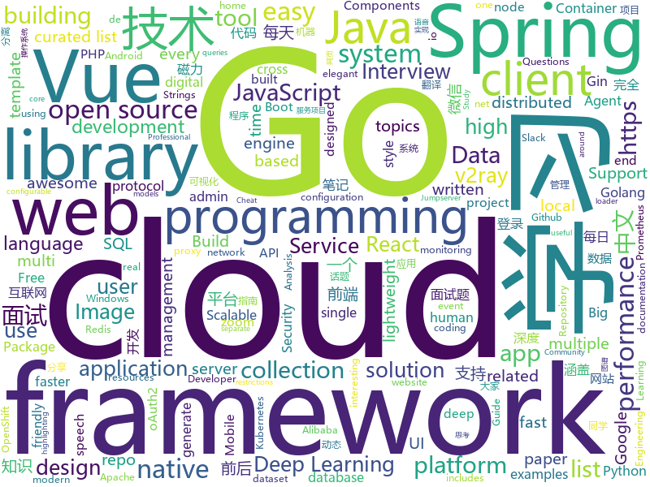

# 2019-09-21
See what the GitHub community is most excited about today.

## python
* [case-212](https://github.com/developers-against-repressions/case-212)(**226 stars today**): Открытое письмо специалистов IT-индустрии в защиту фигурантов «московского дела»
* [bsuite](https://github.com/deepmind/bsuite)(**24 stars today**): bsuite is a collection of carefully-designed experiments that investigate core capabilities of a reinforcement learning (RL) agent
* [localstack](https://github.com/localstack/localstack)(**33 stars today**): 💻A fully functional local AWS cloud stack. Develop and test your cloud & Serverless apps offline!
* [shadowsocks](https://github.com/shadowsocks/shadowsocks)(**26 stars today**): 
* [shadowsocksr](https://github.com/shadowsocksr-backup/shadowsocksr)(**11 stars today**): Python port of ShadowsocksR
* [pytorch_geometric](https://github.com/rusty1s/pytorch_geometric)(**7 stars today**): Geometric Deep Learning Extension Library for PyTorch
* [big-list-of-naughty-strings](https://github.com/minimaxir/big-list-of-naughty-strings)(**10 stars today**): The Big List of Naughty Strings is a list of strings which have a high probability of causing issues when used as user-input data.
* [alexa-prize-topical-chat-dataset](https://github.com/alexa/alexa-prize-topical-chat-dataset)(**12 stars today**): A knowledge-grounded human-human dataset of open-domain conversations.
* [locust](https://github.com/locustio/locust)(**16 stars today**): Scalable user load testing tool written in Python
* [chainer](https://github.com/chainer/chainer)(**2 stars today**): A flexible framework of neural networks for deep learning
* [requests](https://github.com/psf/requests)(**29 stars today**): A simple, yet elegant HTTP library.
* [multi-v2ray](https://github.com/Jrohy/multi-v2ray)(**22 stars today**): v2ray easy delpoy & manage tool， support multiple user & protocol manage
* [models](https://github.com/tensorflow/models)(**39 stars today**): Models and examples built with TensorFlow
* [DeepPavlov](https://github.com/deepmipt/DeepPavlov)(**14 stars today**): An open source library for deep learning end-to-end dialog systems and chatbots.
* [ParlAI](https://github.com/facebookresearch/ParlAI)(**5 stars today**): A framework for training and evaluating AI models on a variety of openly available dialogue datasets.
* [multi-agent-emergence-environments](https://github.com/openai/multi-agent-emergence-environments)(**40 stars today**): Environment generation code for the paper "Emergent Tool Use From Multi-Agent Autocurricula"
* [albumentations](https://github.com/albu/albumentations)(**8 stars today**): fast image augmentation library and easy to use wrapper around other libraries
* [celery](https://github.com/celery/celery)(**13 stars today**): Distributed Task Queue (development branch)
* [ASRT_SpeechRecognition](https://github.com/nl8590687/ASRT_SpeechRecognition)(**2 stars today**): A Deep-Learning-Based Chinese Speech Recognition System 基于深度学习的中文语音识别系统
* [insightface](https://github.com/deepinsight/insightface)(**7 stars today**): Face Analysis Project on MXNet
* [DoubleDIP](https://github.com/yossigandelsman/DoubleDIP)(**32 stars today**): Official implementation of the paper "Double-DIP: Unsupervised Image Decomposition via Coupled Deep-Image-Priors"
* [CornerNet-Lite](https://github.com/princeton-vl/CornerNet-Lite)(**3 stars today**): 
* [home-assistant](https://github.com/home-assistant/home-assistant)(**36 stars today**): 🏡Open source home automation that puts local control and privacy first
* [Real-Time-Voice-Cloning](https://github.com/CorentinJ/Real-Time-Voice-Cloning)(**137 stars today**): Clone a voice in 5 seconds to generate arbitrary speech in real-time
* [system-design-primer](https://github.com/donnemartin/system-design-primer)(**80 stars today**): Learn how to design large-scale systems. Prep for the system design interview. Includes Anki flashcards.

## java
* [CS-Notes](https://github.com/CyC2018/CS-Notes)(**209 stars today**): 📚Tech Interview Guide 技术面试必备基础知识、Leetcode 题解、Java、C++、Python、后端面试、操作系统、计算机网络、系统设计
* [advanced-java](https://github.com/doocs/advanced-java)(**313 stars today**): 😮互联网 Java 工程师进阶知识完全扫盲：涵盖高并发、分布式、高可用、微服务等领域知识，后端同学必看，前端同学也可学习
* [magnetW](https://github.com/dengyuhan/magnetW)(**30 stars today**): 磁力搜网页版 - 磁力链接聚合搜索 - https://biedian.me
* [JavaGuide](https://github.com/Snailclimb/JavaGuide)(**128 stars today**): 【Java学习+面试指南】 一份涵盖大部分Java程序员所需要掌握的核心知识。
* [SpringAll](https://github.com/wuyouzhuguli/SpringAll)(**26 stars today**): 循序渐进，学习Spring Boot、Spring Boot & Shiro、Spring Cloud、Spring Security & Spring Security OAuth2，博客Spring系列源码
* [vhr](https://github.com/lenve/vhr)(**69 stars today**): 微人事是一个前后端分离的人力资源管理系统，项目采用SpringBoot+Vue开发。
* [kubernetes-client](https://github.com/fabric8io/kubernetes-client)(**6 stars today**): Java client for Kubernetes & OpenShift
* [seata](https://github.com/seata/seata)(**22 stars today**): 🔥Seata is an easy-to-use, high-performance, open source distributed transaction solution.
* [incubator-dolphinscheduler](https://github.com/apache/incubator-dolphinscheduler)(**49 stars today**): Apache DolphinScheduler
* [Java](https://github.com/TheAlgorithms/Java)(**36 stars today**): All Algorithms implemented in Java
* [nacos](https://github.com/alibaba/nacos)(**20 stars today**): an easy-to-use dynamic service discovery, configuration and service management platform for building cloud native applications.
* [react-native-webview](https://github.com/react-native-community/react-native-webview)(**5 stars today**): React Native Cross-Platform WebView
* [mybatis-plus](https://github.com/baomidou/mybatis-plus)(**10 stars today**): An powerful enhanced toolkit of MyBatis for simplify development
* [okhttp](https://github.com/square/okhttp)(**19 stars today**): An HTTP client for Android, Kotlin, and Java.
* [spring-cloud-alibaba](https://github.com/alibaba/spring-cloud-alibaba)(**27 stars today**): Spring Cloud Alibaba provides a one-stop solution for application development for the distributed solutions of Alibaba middleware.
* [skywalking](https://github.com/apache/skywalking)(**11 stars today**): APM, Application Performance Monitoring System
* [camel](https://github.com/apache/camel)(**4 stars today**): Apache Camel
* [hive](https://github.com/apache/hive)(**4 stars today**): Apache Hive
* [rocketmq](https://github.com/apache/rocketmq)(**12 stars today**): Mirror of Apache RocketMQ
* [incubator-shardingsphere](https://github.com/apache/incubator-shardingsphere)(**9 stars today**): Distributed database middleware
* [paascloud-master](https://github.com/paascloud/paascloud-master)(**31 stars today**): spring cloud + vue + oAuth2.0全家桶实战，前后端分离模拟商城，完整的购物流程、后端运营平台，可以实现快速搭建企业级微服务项目。支持微信登录等三方登录。
* [presto](https://github.com/prestodb/presto)(**11 stars today**): The official home of the Presto distributed SQL query engine for big data
* [mybatis-3](https://github.com/mybatis/mybatis-3)(**11 stars today**): MyBatis SQL mapper framework for Java
* [flink](https://github.com/apache/flink)(**11 stars today**): Apache Flink
* [Algorithms](https://github.com/williamfiset/Algorithms)(**12 stars today**): A collection of algorithms

## unknown
* [eng-practices](https://github.com/google/eng-practices)(**207 stars today**): Google's Engineering Practices documentation
* [cascadia-code](https://github.com/microsoft/cascadia-code)(**1,549 stars today**): This is a fun, new monospaced font that includes programming ligatures and is designed to enhance the modern look and feel of the Windows Terminal.
* [A-to-Z-Resources-for-Students](https://github.com/dipakkr/A-to-Z-Resources-for-Students)(**141 stars today**): ✅Curated list of resources for college students
* [hosts](https://github.com/googlehosts/hosts)(**33 stars today**): 镜像：https://coding.net/u/scaffrey/p/hosts/git
* [new-pac](https://github.com/Alvin9999/new-pac)(**95 stars today**): 
* [xiaozhi](https://github.com/qq449245884/xiaozhi)(**8 stars today**): 
* [google-cloud-4-words](https://github.com/gregsramblings/google-cloud-4-words)(**14 stars today**): The Google Cloud Developer's Cheat Sheet
* [awesome-shodan-queries](https://github.com/jakejarvis/awesome-shodan-queries)(**27 stars today**): 🔍A collection of interesting, funny, and depressing search queries to plug into https://shodan.io/👩‍💻
* [reverse-interview-zh](https://github.com/yifeikong/reverse-interview-zh)(**304 stars today**): 技术面试最后反问面试官的话
* [deep_learning_object_detection](https://github.com/hoya012/deep_learning_object_detection)(**11 stars today**): A paper list of object detection using deep learning.
* [architect-awesome](https://github.com/xingshaocheng/architect-awesome)(**40 stars today**): 后端架构师技术图谱
* [awesome](https://github.com/sindresorhus/awesome)(**66 stars today**): 😎Awesome lists about all kinds of interesting topics
* [gold-miner](https://github.com/xitu/gold-miner)(**16 stars today**): 🥇掘金翻译计划，可能是世界最大最好的英译中技术社区，最懂读者和译者的翻译平台：
* [Programming_Interview_Study_Plan](https://github.com/llSourcell/Programming_Interview_Study_Plan)(**103 stars today**): This is the Programming Interview Study Plan by Siraj Raval on Youtube
* [awesome-vue](https://github.com/vuejs/awesome-vue)(**33 stars today**): 🎉A curated list of awesome things related to Vue.js
* [reactjs-interview-questions](https://github.com/sudheerj/reactjs-interview-questions)(**7 stars today**): List of top 500 ReactJS Interview Questions & Answers....Coding exercise questions are coming soon!!
* [SSR](https://github.com/DuyaoSS/SSR)(**16 stars today**): 毒药笔记
* [gitignore](https://github.com/github/gitignore)(**43 stars today**): A collection of useful .gitignore templates
* [Cookbook](https://github.com/andkret/Cookbook)(**13 stars today**): The Data Engineering Cookbook
* [Behinder](https://github.com/rebeyond/Behinder)(**19 stars today**): “冰蝎”动态二进制加密网站管理客户端
* [the-art-of-command-line](https://github.com/jlevy/the-art-of-command-line)(**35 stars today**): Master the command line, in one page
* [webkit](https://github.com/WebKit/webkit)(**4 stars today**): Unofficial mirror of the WebKit SVN repository
* [Share-SSR-V2ray](https://github.com/selierlin/Share-SSR-V2ray)(**17 stars today**): 🃏Free SS/SSR/V2ray 免费分享节点账号信息网站
* [ds-cheatsheets](https://github.com/FavioVazquez/ds-cheatsheets)(**31 stars today**): List of Data Science Cheatsheets to rule the world
* [Flutter-Course-Resources](https://github.com/londonappbrewery/Flutter-Course-Resources)(**3 stars today**): 

## javascript
* [fe-interview](https://github.com/haizlin/fe-interview)(**122 stars today**): 前端面试每日 3+1，以面试题来驱动学习，提倡每日学习与思考，每天进步一点！每天早上5点纯手工发布面试题（死磕自己，愉悦大家）
* [google-access-helper](https://github.com/haotian-wang/google-access-helper)(**57 stars today**): 谷歌访问助手破解版
* [yapi](https://github.com/YMFE/yapi)(**25 stars today**): YApi 是一个可本地部署的、打通前后端及QA的、可视化的接口管理平台
* [jsonbox](https://github.com/vasanthv/jsonbox)(**396 stars today**): A Free HTTP based JSON storage.
* [crypto-js](https://github.com/brix/crypto-js)(**11 stars today**): JavaScript library of crypto standards.
* [vant](https://github.com/youzan/vant)(**19 stars today**): Lightweight Mobile UI Components built on Vue
* [taro](https://github.com/NervJS/taro)(**18 stars today**): 多端统一开发框架，支持用 React 的开发方式编写一次代码，生成能运行在微信/百度/支付宝/字节跳动/ QQ 小程序、快应用、H5、React Native 等的应用。 https://taro.jd.com/
* [vue-admin-template](https://github.com/PanJiaChen/vue-admin-template)(**14 stars today**): a vue2.0 minimal admin template
* [vue](https://github.com/vuejs/vue)(**74 stars today**): 🖖Vue.js is a progressive, incrementally-adoptable JavaScript framework for building UI on the web.
* [CyberChef](https://github.com/gchq/CyberChef)(**41 stars today**): The Cyber Swiss Army Knife - a web app for encryption, encoding, compression and data analysis
* [gridsome](https://github.com/gridsome/gridsome)(**19 stars today**): ⚡️Build lightning fast websites and apps with Vue.js
* [zdog](https://github.com/metafizzy/zdog)(**21 stars today**): Flat, round, designer-friendly pseudo-3D engine for canvas & SVG
* [33-js-concepts](https://github.com/leonardomso/33-js-concepts)(**23 stars today**): 📜33 concepts every JavaScript developer should know.
* [digital-climate-strike](https://github.com/fightforthefuture/digital-climate-strike)(**8 stars today**): Repository for Digital #ClimateStrike widget: https://digital.globalclimatestrike.net/
* [js-xlsx](https://github.com/SheetJS/js-xlsx)(**22 stars today**): 📗SheetJS Community Edition -- Spreadsheet Data Toolkit
* [pdf.js](https://github.com/mozilla/pdf.js)(**24 stars today**): PDF Reader in JavaScript
* [vant-weapp](https://github.com/youzan/vant-weapp)(**9 stars today**): 轻量、可靠的小程序 UI 组件库
* [jumpserver](https://github.com/jumpserver/jumpserver)(**13 stars today**): Jumpserver是全球首款完全开源的堡垒机，是符合 4A 的专业运维审计系统。
* [react-native](https://github.com/facebook/react-native)(**35 stars today**): A framework for building native apps with React.
* [node_redis](https://github.com/NodeRedis/node_redis)(**4 stars today**): redis client for node
* [axios](https://github.com/axios/axios)(**38 stars today**): Promise based HTTP client for the browser and node.js
* [material-ui](https://github.com/mui-org/material-ui)(**44 stars today**): React components for faster and easier web development. Build your own design system, or start with Material Design.
* [microsoft-authentication-library-for-js](https://github.com/AzureAD/microsoft-authentication-library-for-js)(**3 stars today**): Microsoft Authentication Library (MSAL) for JS
* [systemjs](https://github.com/systemjs/systemjs)(**25 stars today**): Dynamic ES module loader
* [Historical-ranking-data-visualization-based-on-d3.js](https://github.com/Jannchie/Historical-ranking-data-visualization-based-on-d3.js)(**17 stars today**): 这是一个数据可视化项目，能够将历史数据排名转化为动态柱状图图表

## html
* [treehouses.github.io](https://github.com/treehouses/treehouses.github.io)(**8 stars today**): A Markdown Wiki for treehouses🏡
* [proposal-optional-chaining](https://github.com/tc39/proposal-optional-chaining)(**8 stars today**): 
* [Coursera-ML-AndrewNg-Notes](https://github.com/fengdu78/Coursera-ML-AndrewNg-Notes)(**19 stars today**): 吴恩达老师的机器学习课程个人笔记
* [technical-books](https://github.com/doocs/technical-books)(**9 stars today**): 😆国内外互联网技术大牛们都写了哪些书籍：计算机基础、网络、前端、后端、数据库、架构、大数据、深度学习...
* [tiny-slider](https://github.com/ganlanyuan/tiny-slider)(**12 stars today**): Vanilla javascript slider for all purposes.
* [portainer](https://github.com/portainer/portainer)(**8 stars today**): Making Docker management easy.
* [coexisting-vue-microfrontends](https://github.com/joeldenning/coexisting-vue-microfrontends)(**17 stars today**): A repo showing separate vue apps coexisting as microfrontends with single-spa
* [website](https://github.com/kubernetes/website)(**2 stars today**): Kubernetes website and documentation repo:
* [kubernetes-failure-stories](https://github.com/hjacobs/kubernetes-failure-stories)(**5 stars today**): Compilation of public failure/horror stories related to Kubernetes
* [errors](https://github.com/LaravelCollective/errors)(**24 stars today**): Some elegant error page illustrations for Laravel
* [embeddedsw](https://github.com/Xilinx/embeddedsw)(**0 stars today**): Xilinx Embedded Software (embeddedsw) Development
* [blog](https://github.com/biaochenxuying/blog)(**5 stars today**): 技术为主，读书笔记、随笔、理财为辅，做个终身学习者。
* [v2-ui](https://github.com/sprov065/v2-ui)(**10 stars today**): 支持多协议多用户的 v2ray 面板，Support multi-protocol multi-user v2ray panel
* [swagger-codegen](https://github.com/swagger-api/swagger-codegen)(**2 stars today**): swagger-codegen contains a template-driven engine to generate documentation, API clients and server stubs in different languages by parsing your OpenAPI / Swagger definition.
* [speedtest](https://github.com/adolfintel/speedtest)(**3 stars today**): Self-hosted HTML5 Speedtest. Easy setup, examples, configurable, mobile friendly. Supports PHP, Node, Multiple servers, and more
* [professional-services](https://github.com/GoogleCloudPlatform/professional-services)(**3 stars today**): Common solutions and tools developed by Google Cloud's Professional Services team
* [sql-formatter](https://github.com/jdorn/sql-formatter)(**3 stars today**): A lightweight php class for formatting sql statements. Handles automatic indentation and syntax highlighting.
* [learning-area](https://github.com/mdn/learning-area)(**2 stars today**): Github repo for the MDN Learning Area.
* [styleguide](https://github.com/google/styleguide)(**20 stars today**): Style guides for Google-originated open-source projects
* [awesome-modern-cpp](https://github.com/rigtorp/awesome-modern-cpp)(**6 stars today**): A collection of resources on modern C++
* [hyperblog](https://github.com/freddier/hyperblog)(**7 stars today**): Un blog increíble para el curso de Git y Github de Platzi
* [fe4ml-zh](https://github.com/apachecn/fe4ml-zh)(**3 stars today**): 📖[译] 面向机器学习的特征工程
* [coding-interview](https://github.com/doocs/coding-interview)(**8 stars today**): 😀代码面试题集，包括剑指 Offer、编程之美等
* [d3js_doc](https://github.com/xswei/d3js_doc)(**3 stars today**): D3js中文文档 D3中文📊📈🎉
* [ace](https://github.com/bopoda/ace)(**2 stars today**): Twitter bootstrap 3 admin template

## go
* [gnet](https://github.com/panjf2000/gnet)(**171 stars today**): ⚡️A high-performance, lightweight, nonblocking and event-loop networking library written in pure Go.🔥
* [brook](https://github.com/txthinking/brook)(**25 stars today**): Brook is a cross-platform(Linux/MacOS/Windows/Android/iOS) proxy/vpn software
* [charts](https://github.com/helm/charts)(**24 stars today**): Curated applications for Kubernetes
* [prometheus](https://github.com/prometheus/prometheus)(**19 stars today**): The Prometheus monitoring system and time series database.
* [gin](https://github.com/gin-gonic/gin)(**31 stars today**): Gin is a HTTP web framework written in Go (Golang). It features a Martini-like API with much better performance -- up to 40 times faster. If you need smashing performance, get yourself some Gin.
* [loki](https://github.com/grafana/loki)(**27 stars today**): Like Prometheus, but for logs.
* [go-restful](https://github.com/emicklei/go-restful)(**3 stars today**): package for building REST-style Web Services using Go
* [harbor](https://github.com/goharbor/harbor)(**21 stars today**): An open source trusted cloud native registry project that stores, signs, and scans content.
* [influxdb](https://github.com/influxdata/influxdb)(**9 stars today**): Scalable datastore for metrics, events, and real-time analytics
* [traefik](https://github.com/containous/traefik)(**66 stars today**): The Cloud Native Edge Router
* [v2ray-core](https://github.com/v2ray/v2ray-core)(**118 stars today**): A platform for building proxies to bypass network restrictions.
* [the-way-to-go_ZH_CN](https://github.com/unknwon/the-way-to-go_ZH_CN)(**17 stars today**): 《The Way to Go》中文译本，中文正式名《Go 入门指南》
* [redis](https://github.com/go-redis/redis)(**6 stars today**): Type-safe Redis client for Golang
* [build-web-application-with-golang](https://github.com/astaxie/build-web-application-with-golang)(**13 stars today**): A golang ebook intro how to build a web with golang
* [crc](https://github.com/code-ready/crc)(**7 stars today**): CodeReady Containers: Run OpenShift 4.x locally
* [aws-sdk-go](https://github.com/aws/aws-sdk-go)(**3 stars today**): AWS SDK for the Go programming language.
* [go](https://github.com/golang/go)(**34 stars today**): The Go programming language
* [mock](https://github.com/golang/mock)(**10 stars today**): GoMock is a mocking framework for the Go programming language.
* [frp](https://github.com/fatedier/frp)(**41 stars today**): A fast reverse proxy to help you expose a local server behind a NAT or firewall to the internet.
* [reading-go](https://github.com/developer-learning/reading-go)(**10 stars today**): Go 夜读 > Share the related technical topics of Go every week through zoom online live broadcast, every day on the WeChat/Slack to communicate programming technology topics. 每周通过 zoom 在线直播的方式分享 Go 相关的技术话题，每天大家在微信/Slack 上及时沟通交流编程技术话题。
* [rancher](https://github.com/rancher/rancher)(**14 stars today**): Complete container management platform
* [awesome-go](https://github.com/avelino/awesome-go)(**30 stars today**): A curated list of awesome Go frameworks, libraries and software
* [packer](https://github.com/hashicorp/packer)(**4 stars today**): Packer is a tool for creating identical machine images for multiple platforms from a single source configuration.
* [beego](https://github.com/astaxie/beego)(**15 stars today**): beego is an open-source, high-performance web framework for the Go programming language.
* [helm](https://github.com/helm/helm)(**22 stars today**): The Kubernetes Package Manager

## WordCloud

